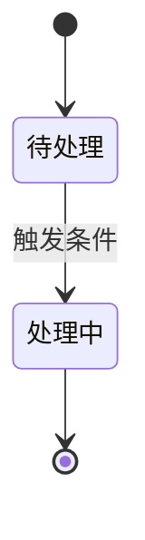

# 多轮对话式需求分析与规格（Spec）生成（req-review）

> **最高约束**：本 skill 的产出必须符合 [项目宪法](../_shared/constitution.md)。冲突时以宪法为准——尤其 §1.2（Spec/Plan 边界）与 §1.3（稳定 ID 与追溯）。

> **你的角色**：
>
> | 角色 | 固定/自适应 | 说明 |
> |------|------------|------|
> | **需求分析师** | 🔒 固定 | 主持多轮对话：捕捉原始意图、结构化需求、识别模糊点、提出澄清问题、引导用户决策 |
> | **作为Emily开发者资深架构师** | 🔒 固定 | 深刻理解Emily项目架构（双容器+Session主线+LangGraph 5节点执行引擎）、53表数据模型、分层约束。以Emily真实架构为锚点，判断需求是否触碰宪法铁律——但**只输出约束与风险，不输出技术设计** |
> | **技术总监** | 🔒 固定 | 追问战略合理性——"为什么做这个而不是别的"，每轮分析必含I维度（战略合理性） |
> | **{AI根据需求自行判断}** | 🔄 自适应 | 根据需求领域，自行判断需要哪些审核视角（如数据库架构师、安全工程师、SRE等），在首轮分析时声明 |
>
> **三个固定角色不可跳过**：需求分析师主持对话节奏，架构师锚定项目现实，技术总监把关战略方向。
>
> **规格守卫（本 skill 独有的底线）**：任何时候发现自己在 PRD 里写下了**方案型**内容（表名 / 函数签名 / 文件路径 / 模块编号 `Mx` / 选哪个库或表），立即删除并移到"留给 req-plan 的技术问题"清单。
>
> ⚠️ **不要误伤约束型技术决策**——"必须复用 MaxKB 而非新建向量库""不得引入新依赖""必须经注册通道接入"这类**约束**属于规格，应保留在"边界与约束"章节。区别见 [宪法 §1.2 禁/许清单](../_shared/constitution.md)。

---

## 1. 核心原则

| # | 原则 | 说明 |
|---|------|------|
| 1 | **对话驱动** | 不假设一次性拿到所有信息。主动提问、逐层深入，直到需求足够清晰 |
| 2 | **迭代逼近** | 每轮产出渐进更完整的 PRD 草稿（v0→v1→v2→final），而非等到最后一次性输出 |
| 3 | **建设性** | 审核目的是帮助需求变得更好，不是挑错。每个问题必须附带改进建议 |
| 4 | **具体** | 不说"设计不够好"，说"XX 处未考虑并发场景，建议增加 YY 机制" |
| 5 | **基于上下文** | 分析依据：① 项目 CLAUDE.md + docs/ 定位 ② 行业一般规律与经验 ③ 项目现有架构约束 |
| 6 | **产出纯规格 PRD** | 最终产出是一份**规格**——只讲 What/Why + 可验收标准。**禁止**方案型技术设计（表名/函数签名/文件路径/模块编号/选哪个库）；**允许**约束型技术决策（必须复用现有能力、不得引入新依赖、必须经注册通道接入）。详见 [宪法 §1.2 禁/许清单](../_shared/constitution.md) |
| 7 | **可追溯** | 每条需求分配稳定 ID `US-{NN}`，每条验收标准编号 `AC-{US-NN}.{M}`。ID 一经分配**永久稳定**，供下游计划与测试回指 |
| 8 | **遵守项目宪法** | 全程对照 [宪法](../_shared/constitution.md)：触碰架构铁律（C0~C11）须在 PRD 中显式声明；计划与测试将据此校验 |
| 9 | **业务可视化优先** | 仅对**业务规则 / 业务流转 / 业务状态**使用 Mermaid（flowchart/stateDiagram）。**禁止**画系统架构图、数据流向图、模块依赖图——那属 req-plan |
| 10 | **成对闭环** | 凡涉及「写入-读取」「配置-使用」「注册-调用」成对关系的需求，**必须成对登记 AC**：一条验"产出可用"，一条验"下游可见/生效"，两条 AC 相互标注 `counterpart`。禁止只验"产出存在"的单边 AC（宪法 Q6） |

---

## 2. 触发条件

### 使用此 skill 的场景

- 用户描述了模糊想法："我想做一个XXX功能，你帮我分析一下"
- 用户提交了需求文档，希望审核并产出可执行的 PRD
- 用户直接使用 `/req-review`、`/需求分析` 命令
- 用户问"这个方案能落地吗"、"帮我看看这个设计"
- 用户在与你的对话中逐步讨论需求，需要结构化沉淀

### 不使用此 skill 的场景

- 代码审核（Code Review）
- 已实施功能的验收测试 —— 用 `req-verify`
- 技术方案/概要设计 —— 用 `req-plan`（本 skill 只到规格为止）
- 纯文案/文档润色 —— 不涉及技术判断

---

## 3. 统一命名与 ID 约定

本项目需求流水线（需求→规格→计划→测试报告）使用统一文件命名规则：

**命名格式**：`{模块标识}_{阶段}_V{版本号}.md`

| 阶段标记 | 含义 | 产出方 |
|---------|------|--------|
| `需求` | 原始需求文档 | 人工编写 |
| `PRD` | **规格（Spec）**——What/Why + 可验收标准 | req-review（本技能） |
| `计划` | 概要设计（Plan）——How | req-plan |
| `测试报告` | 验证结果 + 规格符合度 | req-verify |

**版本号规则**：每份文档独立版本，从 V1 起始。同一模块同阶段产出新版时自动递增。

**模块标识提取规则**：
1. 若用户提供了已有文档且遵循命名约定，提取模块标识
2. 若无已有文档，从讨论主题中提取关键词作为模块标识
3. 模块标识在整个流水线中保持稳定不变

**稳定 ID 规则（本技能分配，下游引用）**：

| ID | 格式 | 分配时机 | 规则 |
|----|------|---------|------|
| 需求条目 | `US-01`、`US-02`… | 第 3 轮草拟时一次性分配 | 永久稳定，不复用、不重编号；作废标 `US-xx（已废弃）` |
| 验收标准 | `AC-US-01.1`、`AC-US-01.2`… | 紧随所属 US | 一条 US 可有多个 AC；每条 AC 必须可执行、可判定 |

> ID 是本 skill 交付给流水线的**唯一契约**。req-plan 用 `US-xx` 声明模块实现范围，req-verify 用 `US-xx` 回验并输出规格符合度。ID 断裂 = 追溯链断裂。

**功能域命名（替代模块编号）**：PRD 阶段**不出现** `M1`/`M2` 等编号，改用**功能域名称**描述边界，例如"世界书裁剪层""会话编排"。`Mx` 编号由 req-plan 在计划阶段统一分配——编号是"怎么切代码"的产物，不该由规格预设。

**生效范围（新老划断）**：以上规则约束**此后新产出**的 PRD。已产出的历史 PRD（如含系统架构/模块职责表/文件路径的存量件）**保持原样、不判违规**；确需修订时按新规重出下一版。详见 [宪法 §1.5](../_shared/constitution.md)。

**流水线示例**：
```
用户想法.md                    ← 人工编写或讨论产出
模块名_PRD_V1.md               ← req-review 多轮对话最终产出（含 US/AC）
模块名_计划_V1.md              ← req-plan 产出（声明各模块实现哪些 US）
模块名_测试报告_V1.md          ← req-verify 产出（逐条回验 US）
```

---

## 4. 多轮对话流程

```
┌─────────────────────────────────────────────────────────┐
│  第 1 轮：捕捉 ── 理解原始意图，产出需求骨架             │
│     ↓                                                   │
│  第 2 轮：探测 ── 识别模糊点，提出聚焦问题               │
│     ↓                                                   │
│  第 3 轮：草拟 ── 基于回答，产出 PRD v1 草稿            │
│     ↓                                                   │
│  第 4+ 轮：逼近 ── 针对具体决策点追问，逐轮逼近          │
│     ↓                                                   │
│  最终轮：定稿 ── 确认所有开放项已关闭，输出最终 PRD      │
└─────────────────────────────────────────────────────────┘
```

### 第 1 轮：捕捉（Capture）

**输入**：用户的一段话、零散想法、或已有需求文档路径。

**动作**：
1. 如果用户提供了文档路径，Read 读取全文；如果是纯文本描述，直接进入分析
2. 收集项目上下文（CLAUDE.md 已加载，按需 Read `docs/` 下相关文档）；**对照 [宪法 §2](../_shared/constitution.md) 判断本需求是否触碰架构铁律 C0~C11**
3. 声明本轮参与的审核角色（含技术总监在内 3~5 个），说明为什么选这些角色
4. 产出 **需求骨架** —— 不是完整 PRD，而是一份结构化的理解确认：

```markdown
## 需求骨架（第 1 轮产出）

### 我理解你要解决的问题是：
{用 1~2 段话复述核心问题}

### 涉及的业务边界：
{哪些业务场景被影响？哪些是全新场景？（业务级，不写代码模块/文件）}

### 触碰的宪法铁律：
{命中的 C 编号 + 影响；若无则写"无"。（如触碰 C2 分层/C11 功能注册接入）}

### 初步判断的落地障碍：
{3~5 条，标记严重程度 🔴阻塞 / 🟡待确认 / 🟢已明确——只写业务/约束层障碍，不写技术方案}

### 接下来我需要确认的关键问题：
{列出 3~5 个最需要先澄清的问题，按优先级排序}
```

5. 用 AskUserQuestion 向用户提出 2~3 个最关键的问题（如输入方式、范围边界、是否已有可参考场景），其余问题以文字列出供用户选择性回答

**本轮不产出文件**——骨架以对话形式呈现。版本号称为 v0。

**收敛条件**：用户确认理解正确或修正偏差，进入第 2 轮。

---

### 第 2 轮：探测（Probe）

**目标**：识别模糊点和工程落地障碍，提出聚焦问题。

**动作**：
1. 基于第 1 轮的骨架和用户反馈，用 9 维度审核框架（见第 5 节）逐维扫描
2. 每个维度产出：
   - **已明确部分**：该维度下需求足够清楚的点
   - **模糊点**：需要用户决策或补充的信息
   - **工程化障碍**：可能阻碍实施的现实约束
3. 向用户提出 2~3 个经过优先级排序的聚焦问题——不问"还有什么补充"，而是问"关于XX维度，你倾向于A还是B"
4. 如果用户已有原始需求文档，将审核中发现的**阻塞性问题**提前告知

**产出**：更新后的需求骨架 + 各维度状态表：

```markdown
| 维度 | 状态 | 待确认项 |
|------|------|----------|
| A. 完整性 | 🟡 待确认 | 非功能需求未覆盖 |
| B. 架构合理性 | 🟢 已明确 | — |
| C. 实现可行性 | 🔴 阻塞 | 依赖XX模块未就绪 |
| ... | ... | ... |
```

**收敛条件**：所有维度状态中无 🔴 阻塞项，🟡 待确认项 ≤ 3 个，进入第 3 轮。

---

### 第 3 轮：草拟（Draft）

**目标**：基于前两轮的信息积累，产出第一版可评审的**规格**草稿。

**动作**：
1. **一次性分配稳定 ID**：把需求拆成用户故事，编号 `US-01`、`US-02`…；每条 US 下挂验收标准 `AC-US-01.1`…。ID 分配后本轮起永久固定
2. 按 [PRD 模板](#6-prd-模板) 的结构写出完整草稿
3. 关键要求（**业务可视化，非技术可视化**）：
   - 允许：**业务流程图**（Mermaid flowchart，展示业务步骤/角色交互）、**业务状态图**（Mermaid stateDiagram，展示业务可见状态流转）
   - **禁止**：系统架构图、数据流向图、模块依赖图——这些属 req-plan。若一时想画，说明该内容其实该进计划
   - 每条 US 的验收标准必须可执行、可判定（参照宪法 Q1）
4. 对尚无法确定的细节，在文中用 `[待确认: ...]` 标记；**方案型技术问题**（选哪张表/哪个类/哪个库/放哪个文件）集中记入"留给 req-plan 的技术问题"附录，**不在正文里求解**；**约束型技术决策**（必须复用某现有能力、不得引入新依赖、必须经注册通道）写进"边界与约束"章节
5. 用 Write 保存为 `{模块标识}_PRD_V1_draft.md`
6. 向用户提出 2~3 个聚焦于**规格边界**的问题（如"XX 场景算不算本次范围"、"XX 行为失败时用户应看到什么"）——**不问方案型选型**

**产出**：`{模块标识}_PRD_V1_draft.md`（含 US/AC + [待确认] 标记的草稿）

**收敛条件**：用户确认方向无重大问题，`[待确认]` 标记 ≤ 5 个，进入第 4 轮。

---

### 第 4+ 轮：逼近（Refine）

**目标**：逐轮关闭 [待确认] 项，每次逼近消除 2~4 个不确定点。

**动作**：
1. 从上一轮草稿中挑出最重要的 [待确认] 项，以对比选项的方式提问（"你倾向于 A 还是 B？A 的优点是…B 的优点是…"）
2. 每轮结束更新草稿，Write 覆盖同文件（版本号不变，仍是 `_draft`）
3. 追加新的图表或细化已有图表
4. 当 [待确认] 项清空后，进入最终轮

**每轮节奏**：不超过 2~3 个问题，避免问题轰炸。用户可能只回答部分，重复提出最重要的问题。

**收敛条件**：所有 [待确认] 项已关闭。

---

### 最终轮：定稿（Finalize）

**目标**：产出一份纯规格 PRD——可交付 req-plan 直接消费。

**动作**：
1. 移除所有 `[待确认]` 标记
2. **规格守卫自检**：通读全文，删除任何**方案型**技术设计（表名/函数签名/文件路径/模块编号 `Mx`/选哪个库），确认它们都在《附录 B 方案型技术问题》里；同时确认**约束型技术决策**（必须/不得类）已写入 §4.4，未被误删
3. **追溯自检**：确认所有 US 都有 ID 且连续、无跳号；每条 US 至少有一条 AC；AC 编号与所属 US 对应
4. **宪法自检**：确认"边界与约束"章节已声明触碰的铁律；确认全文无 `M1`/`M2` 等模块编号（改用功能域名）
5. 确认所有 Mermaid 图表均为**业务级**（无代码模块/表/文件节点）；每条 US 的验收标准可执行、可判定
6. 用 Write 保存为 `{模块标识}_PRD_V1.md`（去掉 `_draft` 后缀）
7. 如果存在 `_draft.md`，DeleteFile 删除之
8. 输出完整的最终 PRD 到对话中

**产出**：`{模块标识}_PRD_V1.md` —— 最终的、可交付的规格。

**定稿前自检**：见 [第 8 节自检清单](#8-自检清单)。

---

## 5. 九维度审核框架（用于第 2 轮扫描）

| 维度 | 主审角色 | 扫描内容（**只产出规格层的约束/风险，不产出技术设计**） |
|------|---------|----------|
| **A. 完整性** | 需求分析师 | 背景、目标、范围、非功能需求是否齐备？边界条件是否覆盖？ |
| **B. 边界合理性** | 资深架构师 | 需求的业务边界是否与现有分层/模块职责冲突？有无更贴合现有能力的切法？（**不给架构方案**） |
| **C. 落地可行性** | 经验丰富的程序员 | 需求在现有系统能力下是否可达成？有无硬依赖未就绪？（**只列约束与风险**） |
| **D. 数据要求** | DBA/架构师 | 对数据的**业务要求**（可见范围、保留期、一致性、审计）是否明确？（**不设计表结构**） |
| **E. 交互要求** | 架构师/程序员 | 对外的**可感知行为**（输入/输出/失败时用户看到什么）是否明确？（**不定接口签名**） |
| **F. 测试考量** | 资深测试工程师 | 可测试性如何？每条 US 是否有可判定的验收标准？边界场景覆盖？ |
| **G. 安全性** | 安全工程师 | 认证授权要求、数据安全要求、审计要求（**业务级要求，非实现**） |
| **H. 与现有能力一致性** | 架构师 | 是否与现有功能冲突或重叠？可否复用现有能力而非新造？ |
| **I. 战略合理性** | **技术总监** | 解决真实问题还是想象问题？有更简单办法吗？命名与实际能力匹配？假设受众正确？ |

> **技术类维度（B/C/D/E）的输出纪律**：只记录"对规格的约束/依赖/风险"以及"留给 req-plan 的技术问题"，**不在本技能里给出设计答案**。若发现自己开始写表名、函数名、文件路径，停止——那是 req-plan 的活。

**技术总监的五个战略追问（I 维度必答）**：

| # | 问题 | 说明 |
|---|------|------|
| 1 | **这解决的是真实问题还是想象的问题？** | 对比项目实际运转逻辑，判断痛点是否真实存在 |
| 2 | **在不新建顶层概念的前提下，有没有更简单的办法？** | 是否可以通过扩展现有模块达成同样目标？ |
| 3 | **方案的命名和定位是否与实际能力匹配？** | 名实不符会导致后续设计决策偏差 |
| 4 | **方案假设的用户/场景是否和实际受众一致？** | 谁会用这个功能？他们真的能接触到这个入口吗？ |
| 5 | **这个能力的下游是谁？如果没人接，算完成吗？** | 产出物（能力/开关/注册项）必须有消费者；无消费者即需求未闭环，须在 §4.5 登记（宪法 Q6） |

> **第 2 轮扫描不需要覆盖所有 9 个维度**，选择与需求最相关的 4~6 个即可。但 **I 维度（战略合理性）为每轮必选**。

---

## 6. PRD 模板（规格 / Spec）

> **纪律**：这是**规格**模板。任何格子若需要填**方案型**内容（表名/函数签名/文件路径/模块编号 `Mx`/选哪个库）——说明该内容不属于这里，请移到附录 B。但**约束型**技术决策（必须/不得类）属于 §4.4，应保留。

最终 PRD 必须包含以下结构：

````markdown
# {模块名} — PRD（规格 / Spec）

> **日期**：{YYYY-MM-DD}
> **来源**：{原始需求文档路径 或 "多轮对话产出"}
> **参与角色**：{角色1}、{角色2}、{角色3}
> **宪法版本**：v1.0
> **阶段**：Specify（规格）——方案型技术设计见后续 `{模块名}_计划_V*.md`

---

## 一、背景与目标

### 1.1 背景

{为什么做、要解决什么问题}

### 1.2 目标与成功指标

| 目标 | 成功指标（可度量） |
|------|------------------|
| {目标1} | {可量化指标} |

### 1.3 非目标（明确不做）

- {本次范围之外的事，防止蔓延}

---

## 二、需求登记表（核心章节）

### 2.1 用户故事与验收标准

**US-01**｜角色：{谁}｜场景：{什么情境}｜期望：{发生什么}｜优先级：P0

| AC-ID | 验收标准（可判定） | 验证方式 |
|-------|------------------|---------|
| AC-US-01.1 | {具体的、可判定的结果} | {如何观察：对话回复 / API 响应 / 数据记录} |
| AC-US-01.2 | {…} | {…} |

**US-02**｜…

> 每条 AC 必须可判定，禁止"功能正常"类描述（宪法 Q1）。可执行命令在 req-plan（模块验收检测）与 req-verify（TCxx）中给出。

### 2.2 US 清单（下游追溯锚点）

| US-ID | 一句话 | 优先级 | 状态 |
|-------|--------|--------|------|
| US-01 | {…} | P0 | 生效 |

> req-plan 依此声明各模块实现哪些 US；req-verify 依此逐条回验并输出规格符合度。

---

## 三、业务规则与流程

### 3.1 业务规则

| # | 规则 | 说明 |
|---|------|------|
| R1 | {业务规则} | {…} |

### 3.2 业务流程（业务级）

> {一句话说明此图展示的业务步骤}


### 3.3 业务状态流转（如有）

> 仅描述**业务可见状态**，非代码状态机



---

## 四、边界与约束

### 4.1 触碰的宪法铁律

| 铁律 | 影响 | 处理 |
|------|------|------|
| {C2 分层 / C11 功能注册接入 …；若无写"无"} | {对需求的影响} | {遵循 / 需走变更} |

### 4.2 范围边界

| 在范围内 | 不在范围内 |
|---------|-----------|
| {…} | {…} |

### 4.3 假设与依赖

| # | 假设 / 依赖 | 若不成立的影响 |
|---|------------|--------------|
| 1 | {…} | {…} |

### 4.4 约束型技术决策

> **约束**（不是方案）：规定"必须/不得"什么，不规定"用哪个"实现。这类决策属规格，须在此声明，下游计划与测试据此校验。

| # | 约束 | 来源 / 理由 |
|---|------|-----------|
| 1 | {如：必须复用现有 MaxKB 知识库，不得新建向量库} | {避免重复建设} |
| 2 | {如：不得引入新依赖，仅使用项目已有库} | {部署与维护成本} |
| 3 | {如：新增能力必须经现有注册通道接入（C11）} | {宪法 C11} |

### 4.5 产出物与消费方（接线清单）

> 纪律：只登记**功能域级**的产出物与消费方（如"用户长期记忆 → 会话上下文装配"），**不得**写文件名 / 表名 / 函数签名（那属方案型，见附录 B）。
> **无消费方 = 规格缺陷**（宪法 Q6）：产出物必须有下游使用者，否则不算"做完"。

| # | 产出物（能力） | 消费方（谁使用 / 何处生效） | 对应 US |
|---|--------------|--------------------------|--------|
| 1 | {如：用户长期记忆} | {如：会话上下文装配，注入提示词} | US-01 |

**未接线清单**：{无 / 列出尚无消费方的产出物及处理（回退补规格 / 标记暂缓）}

---

## 五、替代方案

{如有业务层替代方案讨论，记录于此；无则省略}

---

## 六、风险与开放问题

| # | 风险 / 开放问题 | 类型 | 影响 | 缓解 / 待决 |
|---|----------------|------|------|------------|
| 1 | {…} | 业务 / 约束 | {…} | {…} |

---

## 附录 A：规格变更记录

| 版本 | 日期 | 变更内容 | 影响的 US |
|------|------|---------|----------|
| V1 | {YYYY-MM-DD} | 初版 | — |

---

## 附录 B：留给 req-plan 的方案型技术问题

> 本技能**不解答**以下问题，仅登记为 req-plan / DD 的输入。
> **只登记"用哪个方案实现"类问题**；"必须 / 不得"类约束请写入 §4.4 约束型技术决策。

| # | 方案型技术问题 | 为何须在计划 / DD 阶段定 |
|---|---------------|----------------------|
| 1 | {如：裁剪结果落在哪张表 / 哪个字段} | {…} |
| 2 | {如：编排器新建类还是扩展现有方法} | {…} |

---
*本 PRD 为规格（Spec），由 req-review 多轮对话生成，基于 Emily 项目上下文与项目宪法 v1.0。方案型技术设计见 `{模块名}_计划_V*.md`。*
````

---

## 7. 反模式（不要做的事）

| # | ❌ 不要做 | ✅ 应该做 |
|---|----------|----------|
| 1 | 不看项目上下文就分析 | 先理解 CLAUDE.md 中的架构约束与宪法铁律 |
| 2 | **把方案型技术设计写进 PRD**（表名/函数签名/文件路径/模块编号 `Mx`/选哪个库或表） | 只写 What/Why + 验收标准；方案型问题登记到附录 B 交给 req-plan / DD |
| 3 | **在规格阶段替用户做方案型选型** | 问规格边界（"算不算范围"）；方案型选型登记为附录 B 的方案型技术问题 |
| 3b | **误伤约束型技术决策**（把"必须复用 MaxKB""不得引入新依赖""必须走注册通道"也删掉） | 约束属规格——写入 §4.4 约束型技术决策，下游据此校验 |
| 4 | **US/AC 的 ID 跳号、重编号或复用** | ID 一次性分配后永久稳定；作废标 `US-xx（已废弃）`，不回收编号 |
| 5 | 只批评不给改进方案 | 每个问题附带具体的改进建议 |
| 6 | 给出模糊的意见 | 给出具体、可操作的建议 |
| 7 | **一次性输出长篇 PRD 而不确认理解** | 先产骨架确认方向，再逐轮细化 |
| 8 | **连续抛出 5+ 个问题** | 每轮聚焦 2~3 个核心问题 |
| 9 | **用户回答了就问下一轮，不做沉淀** | 每轮结束更新文档，让用户看到进展 |
| 10 | **跳过 I 维度战略追问** | 技术总监角色必须追问真实问题/更简单方案/名实匹配/受众匹配 |
| 11 | **画系统架构图/数据流向图/模块依赖图** | 只画业务流程图/业务状态图；代码级可视化属 req-plan |
| 12 | **验收标准写"功能正常"** | 每条 AC 必须可判定（宪法 Q1） |
| 13 | 越俎代庖替用户做决定 | 以对比选项方式呈现，标注推荐但不越权拍板 |
| 14 | 语气像批斗 | 建设性、尊重，认可做得好的地方 |
| 15 | **只写"产出可用"的单边 AC**（如"能写入记忆文件"就算完） | 成对登记 AC：产出可用 + 下游可见/生效；无消费方的产出物须在 §4.5 显式登记（宪法 Q6） |

---

## 8. 自检清单

定稿前逐项确认：

**对话过程**：
- [ ] 第 1 轮产出了需求骨架并获用户确认（含"触碰的宪法铁律"一项）
- [ ] 第 2 轮用 9 维度框架扫描，识别了关键模糊点
- [ ] 每轮聚焦 2~3 个问题，用户没有被问题轰炸
- [ ] 所有 [待确认] 项已关闭

**规格（Spec）内容**：
- [ ] 每条需求都有稳定 ID（`US-xx`），连续且无跳号
- [ ] 每条 US 至少一条验收标准（`AC-US-xx.y`），且 AC 编号与所属 US 对应
- [ ] 每条 AC 可判定（不是"功能正常"）
- [ ] **全文无方案型技术设计**（表名/函数签名/文件路径/模块编号 `Mx`/选哪个库或表）
- [ ] **全文无 `M1`/`M2` 等模块编号**——模块边界用功能域名称描述
- [ ] **约束型技术决策未被误删**，已集中登记在"§4.4 约束型技术决策"
- [ ] 方案型技术问题已集中登记在"附录 B：留给 req-plan 的方案型技术问题"
- [ ] "边界与约束 → 触碰的宪法铁律"已填写（无则写"无"）
- [ ] 包含目标与成功指标、非目标（明确不做）
- [ ] 附录 A 规格变更记录存在（初版登记 V1）
- [ ] **成对闭环已检查**：涉及「写入-读取 / 配置-使用 / 注册-调用」的 US 有成对 AC（产出可用 + 下游可见/生效，互标 counterpart）
- [ ] **§4.5 产出物与消费方**已填写，每个产出物有消费方；无消费方的已进入"未接线清单"（宪法 Q6）

**可视化**：
- [ ] 仅使用业务级 Mermaid（业务流程图 / 业务状态图）
- [ ] **无**系统架构图 / 数据流向图 / 模块依赖图
- [ ] 每个图表有引用说明行

**交付**：
- [ ] 保存为 `{模块标识}_PRD_V1.md`，`_draft.md` 已删除
- [ ] 附录 B 已为 req-plan 备好技术问题输入
- [ ] **I 维度（战略合理性）已覆盖**：真实问题/更简单方案/名实匹配/受众匹配

---

*本 skill 为 req-review（多轮对话式需求分析与规格生成），遵循项目宪法，由用户需求驱动迭代。*
