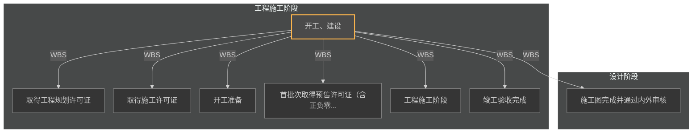

```mermaid
%%{init: {"theme": "dark", "flowchart": {"nodeSpacing": 20, "rankSpacing": 50}}}%%
flowchart TB

    subgraph SJ_Stage [设计阶段]
        SJ_0001["施工图完成并通过内外审核"]:::subNode
    end

    subgraph SG_Stage [工程施工阶段]
        SG_0001["开工、建设"]:::mainNode
        SG_0002["取得工程规划许可证"]:::subNode
        SG_0016["取得施工许可证"]:::subNode
        SG_0027["开工准备"]:::subNode
        SG_0032["首批次取得预售许可证（含正负零..."]:::subNode
        SG_0041["工程施工阶段"]:::subNode
        SG_0680["竣工验收完成"]:::subNode
    end

    classDef mainNode fill:#4a4a4a,stroke:#ffb74d,stroke-width:2px
    classDef subNode fill:#353535,stroke:#888888,stroke-width:1px
    SG_0001 -->|WBS| SG_0002
    SG_0001 -->|WBS| SJ_0001
    SG_0001 -->|WBS| SG_0016
    SG_0001 -->|WBS| SG_0027
    SG_0001 -->|WBS| SG_0032
    SG_0001 -->|WBS| SG_0041
    SG_0001 -->|WBS| SG_0680
```