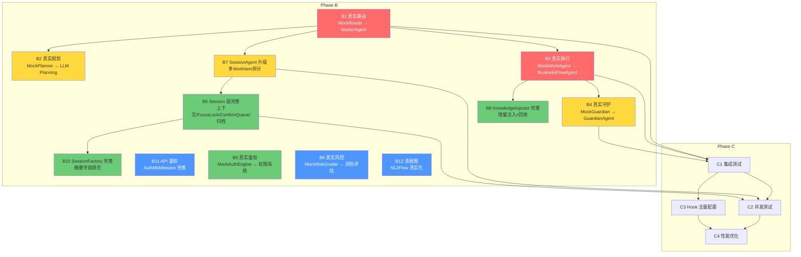

# Emily 项目实现计划

> **生成日期**: 2026-06-24  
> **基于**: [Emily_现状分析报告.md](./Emily_现状分析报告.md)  
> **覆盖范围**: Phase B（真实大脑接入）→ Phase C（集成测试与生产就绪）

---

## 一、实现路径总览

```
Phase A (已完成)                 Phase B (本轮规划)                    Phase C (后续)
┌─────────────────┐          ┌──────────────────────────┐          ┌──────────────────┐
│ Pipeline BUS    │          │ Mock → 真实大脑替换       │          │ 集成测试          │
│ Session 骨架    │  ────→   │ SessionAgent 升级         │  ────→   │ 并发压力测试      │
│ 6 Mock 组件     │          │ 知识注入 + 上下文完善     │          │ Hook 全量配置     │
│ 基础设施全量    │          │ 鉴权/风控 真实化          │          │ 生产环境调优      │
└─────────────────┘          └──────────────────────────┘          └──────────────────┘
    已完成 ✅                                                       后续阶段
```

### 设计原则

1. **渐进替换**: 每次只换一个 Mock 组件，换完立即冒烟测试，确保"换一个、测一个、稳一个"
2. **接口不变**: 所有 Mock 和真实实现共享 `pipeline/interfaces/` 定义的抽象接口，替换=改 import + 适配参数
3. **可回退**: 每个替换步骤保留 Mock 作为 fallback，通过配置开关（环境变量或 config）控制使用 Mock 还是真实大脑
4. **先核心后周边**: P0（路由+执行）→ P1（规划+守护+拆分）→ P2（知识+上下文+鉴权）→ P3（归档+风控+流程图）

---

## 二、Phase B 模块实现计划

### B1. 真实路由大脑（MockRouter → MasterAgent + SOPIntentRegistry）

- **优先级**: 🔴 P0
- **复杂度**: 高
- **依赖**: SOPIntentRegistry 已就绪（`agent/intent_registry.py`），MasterAgent 已就绪（`agent/master_agent.py`）
- **涉及文件**:
  - 入口: `workitem/workitem_agent.py` — MockRouter 注入点
  - 总线: `workitem/pipeline/bus.py` — 节点 1 处理器
  - 接口: `workitem/pipeline/interfaces/routing.py` — Routing interface
  - 大脑: `agent/master_agent.py` — MasterAgent（冷→热）
  - 注册表: `agent/intent_registry.py` — SOPIntentRegistry
- **实现要点**:
  1. 在 `WorkItemAgent` 中新增 `RealRouter` 适配器，实现 `Routing` 接口
  2. `RealRouter` 内部调用 `MasterAgent` 的意图识别能力（非完整 ReAct 循环，仅路由决策）
  3. 从 `SOPIntentRegistry` 获取实时 SOP 目录注入路由上下文
  4. 路由结果映射为 `RouteDecision` 协议对象（与 Mock 输出格式一致）
  5. 配置开关: `EMILY_ROUTER_MODE=mock|real`，默认先 mock
  6. 冒烟测试: 发送不同类型的消息，验证路由到不同 SOP
- **风险**: MasterAgent 当前设计为完整 ReAct 循环，需要剥离出"仅路由决策"的轻量模式
- **预估工作量**: 中（~2-3 天）

### B2. 真实规划大脑（MockPlanner → LLM Planning）

- **优先级**: 🟡 P1
- **复杂度**: 中
- **依赖**: B1（路由完成后才能基于正确的 SOP 做规划）
- **涉及文件**:
  - Mock: `workitem/pipeline/mocks/mock_planning.py`
  - 接口: `workitem/pipeline/interfaces/planning.py`
  - 大脑: `agent/business_flow_agent.py`（SOPLoader 可复用）
- **实现要点**:
  1. 新增 `RealPlanner` 适配器，实现 `Planning` 接口
  2. 基于路由决策中的 SOP ID 加载对应 SOP 全文（复用 `SOPLoader`）
  3. LLM 单次调用（非 ReAct 循环）生成 `ExecutionPlan`
  4. 规划输出需包含：步骤列表、每步所需工具、预期输出、检查点
  5. 配置开关: `EMILY_PLANNER_MODE=mock|real`
- **风险**: LLM 规划可能产生不合理步骤，需要步骤数限制（建议 ≤5 步）
- **预估工作量**: 中（~2 天）

### B3. 真实执行大脑（MockWorkAgent → BusinessFlowAgent + M14 工具）

- **优先级**: 🔴 P0
- **复杂度**: 高
- **依赖**: B1（路由确定 SOP 后执行），与 B2 可并行
- **涉及文件**:
  - Mock: `workitem/pipeline/mocks/mock_execution.py`
  - 接口: `workitem/pipeline/interfaces/execution.py`
  - 大脑: `agent/business_flow_agent.py`（冷→热）
  - 工具: `tools/business_flow_tools.py`（M14 结构化输出）
  - 总线: `workitem/pipeline/bus.py` — 节点 3 处理器
- **实现要点**:
  1. 新增 `RealWorkAgent` 适配器，实现 `WorkAgent` 接口
  2. 每个步骤调用 `BusinessFlowAgent` 执行（优先结构化输出模式，回退 ReAct）
  3. 执行结果映射为标准 `StepResult` 协议对象
  4. 与 M14 BusinessFlowToolRegistry 对接（`record_event/task/meeting/file` + `query_data`）
  5. 步骤间状态传递：上一步输出 → 下一步上下文注入
  6. 配置开关: `EMILY_EXECUTION_MODE=mock|real`
- **风险**: BusinessFlowAgent 原设计接收完整用户消息，需适配为接收 WorkItem 步骤上下文
- **预估工作量**: 高（~3-4 天）

### B4. 真实守护大脑（MockGuardian → GuardianAgent + GuardianReview）

- **优先级**: 🟡 P1
- **复杂度**: 中
- **依赖**: B3（执行有输出后才能验证），可与 B2 并行
- **涉及文件**:
  - Mock: `workitem/pipeline/mocks/mock_guardian.py`
  - 接口: `workitem/pipeline/interfaces/guardian.py`
  - 深度审计: `agent/guardian_agent.py`（冷→热）
  - 轻量验证: `agent/guardian_review.py`（冷→热）
- **实现要点**:
  1. 新增 `RealGuardian` 适配器，实现 `Guardian` 接口
  2. 双模式:
     - **轻量模式**（默认）: 调用 `GuardianReview.review_reply()` 验证回复文本
     - **深度模式**（管理员触发）: 调用 `GuardianAgent` 进行完整 ReAct 审计
  3. 验证结果映射为 `GuardianDecision`（PASS / WARN / BLOCK）
  4. 轻量模式超时 5 秒，超时默认 PASS（不阻塞主流程）
  5. 配置开关: `EMILY_GUARDIAN_MODE=mock|light|deep`
- **风险**: 守护验证增加延迟，需关注 5 秒超时是否足够
- **预估工作量**: 中（~2 天）

### B5. 真实鉴权大脑（MockAuthEngine → Hook 权限系统）

- **优先级**: 🟢 P2
- **复杂度**: 中
- **依赖**: 用户权限数据就绪（`users` 表已有角色字段）
- **涉及文件**:
  - Mock: `workitem/pipeline/mocks/mock_auth.py`
  - 接口: `workitem/pipeline/interfaces/auth.py`
  - Hook: `workitem/pipeline/hook.py`（AuthHook 已定义，L104 预留接口）
- **实现要点**:
  1. 新增 `RealAuthEngine` 适配器，实现 `AuthEngine` 接口
  2. 基于用户角色（`users.role`）和 SOP `allow_roles` 字段做权限判定
  3. 接入 Hook 系统：AuthHook 从 `hook_config.json` 读取配置
  4. 默认策略: 普通工具操作允许所有已验证用户，管理员工具仅管理员
  5. 配置开关: `EMILY_AUTH_MODE=mock|role_based`
- **预估工作量**: 中（~1-2 天）

### B6. 真实风险评估（MockRiskGrader → 真实风险评估）

- **优先级**: 🔵 P3
- **复杂度**: 中
- **依赖**: 可独立实现
- **涉及文件**:
  - Mock: `workitem/pipeline/mocks/mock_risk.py`
  - 接口: `workitem/pipeline/interfaces/risk.py`
- **实现要点**:
  1. 新增 `RealRiskGrader` 适配器，实现 `RiskGrader` 接口
  2. 基于意图类型 + 用户角色 + 操作范围做风险定级（L1-L5）
  3. 风险等级影响后续 Hook 行为（如 L4+ 需要深度审计）
  4. 配置开关: `EMILY_RISK_MODE=mock|rule_based|llm`
- **预估工作量**: 低（~1 天）

### B7. SessionAgent 升级（多 WorkItem 拆分 + MasterAgent 接入）

- **优先级**: 🟡 P1
- **复杂度**: 高
- **依赖**: B1（路由大脑就绪后才能做真实拆分）
- **涉及文件**:
  - 主文件: `session/session_agent.py`（L108-121 占位拆分逻辑）
  - 大脑: `agent/master_agent.py`
- **实现要点**:
  1. 替换 `_split_into_workitems()` 占位逻辑
  2. 调用 MasterAgent 进行消息分析：识别是否复合请求
  3. 复合请求 → 拆分为多个 WorkItem（按优先级排序）
  4. 单请求 → 1 个 WorkItem（与当前行为一致）
  5. WorkItem 间依赖关系标记（`depends_on` 字段）
  6. 拆分质量指标：拆分后每项有明确边界，不重叠不遗漏
- **风险**: 拆分策略需要调优，初期可能过度拆分或拆分不足
- **预估工作量**: 高（~3-4 天）

### B8. KnowledgeInjector 完善（增量注入 + 回收策略）

- **优先级**: 🟢 P2
- **复杂度**: 中
- **依赖**: B3（执行大脑需要知识注入）
- **涉及文件**:
  - 主文件: `workitem/injector.py`（L9-10 占位，L54 占位，L85 占位）
- **实现要点**:
  1. **增量注入**（Phased injection）:
     - 阶段 1（初始化）: 注入项目基础信息 + 用户偏好
     - 阶段 2（路由后）: 注入目标 SOP 全文 + 所需工具 Schema
     - 阶段 3（执行中）: 按需注入相关历史记录 + 知识库片段
     - 阶段 4（验证时）: 注入检查标准 + 审查规则
  2. **回收策略**:
     - 简单 LRU：最近最少使用的 SOP/工具 Schema 优先回收
     - 引用计数：正在执行的 WorkItem 持有的知识不可回收
     - 总 Token 上限控制（如 32K tokens 硬上限）
  3. 保持当前 `set-diff` 算法作为注入判定基础
- **预估工作量**: 中（~2-3 天）

### B9. Session 层完善（上下文 + FocusLock + ConfirmQueue + 归档）

- **优先级**: 🟢 P2（上下文、FocusLock、ConfirmQueue）/ 🔵 P3（归档）
- **复杂度**: 中-高
- **依赖**: B7（SessionAgent 升级后才能定义完整的上下文结构）
- **涉及文件**:
  - `session/session_context.py` — 懒加载触发器
  - `session/focus_lock.py` — 主题匹配调度
  - `session/confirm_queue.py` — WorkItem 确认交付
  - `session/session_agent.py` — `archive()` 方法
- **实现要点**:

  **B9a. SessionContext 懒加载**:
  1. 字段按需触发加载（首次访问时从 DB/服务获取）
  2. 缓存加载结果在 SessionContext 实例中
  3. 增量更新：新消息到达时只更新相关字段

  **B9b. FocusLock 主题匹配**:
  1. 为每个 WorkItem 提取主题关键词
  2. 新消息到达时计算与当前焦点 WorkItem 的语义相似度
  3. 高相似度 → 维持焦点（追加到当前 WorkItem 上下文）
  4. 低相似度 → 创建新 WorkItem（进入 ConfirmQueue）

  **B9c. ConfirmQueue 确认交付**:
  1. WorkItem 完成时生成确认摘要
  2. 按优先级排序待确认项
  3. 消息窗口内批量推送确认请求
  4. 超时自动确认（可配置 TTL）

  **B9d. Session 归档**:
  1. 会话关闭时触发 `archive()`
  2. 调用 `UserMemoryService` 更新长期记忆
  3. 调用 `ChatArchiveService` 归档全部通信记录
  4. 执行 SOP-010（会话归档标准流程）
  5. 生成会话摘要存入数据库

- **预估工作量**: 高（~4-5 天，四个子模块）

### B10. SessionFactory 完善（摘要字段填充）

- **优先级**: 🟢 P2
- **复杂度**: 低
- **依赖**: B9a（上下文懒加载定义了摘要数据结构）
- **涉及文件**:
  - `adapters/session/session_factory.py`（L61-79 占位）
- **实现要点**:
  1. 调用 `UserMemoryService` 获取用户偏好和历史摘要
  2. 调用 `MessageService` 获取最近对话轮次
  3. 调用 `SOPIntentRegistry` 生成 SOP 目录摘要
  4. 填充 `recent_turns`、`user_preferences`、`history_summary`、`sop_catalog_summary` 等字段
- **预估工作量**: 低（~1 天）

### B11. API 鉴权中间件完善

- **优先级**: 🔵 P3
- **复杂度**: 低
- **依赖**: 可独立实现
- **涉及文件**:
  - `api/middleware/auth.py`（当前可选 Token 校验）
- **实现要点**:
  1. 强制共享密钥（Shared Secret）校验
  2. 支持多密钥轮换（`EMILY_API_TOKENS` 逗号分隔）
  3. 健康检查端点始终放行
  4. 失败时返回 401 而非静默放行
- **预估工作量**: 低（~0.5 天）

### B12. Mermaid Flow NL2Flow 真实化

- **优先级**: 🔵 P3
- **复杂度**: 中
- **依赖**: LLM 客户端可用
- **涉及文件**:
  - `agent/mermaid_flow.py`（L530-548 `_placeholder_template()`）
- **实现要点**:
  1. 当 LLM 客户端可用时，调用 LLM 将自然语言描述转为 Mermaid 语法
  2. 保留 `_placeholder_template()` 作为 fallback
  3. 输出校验：检查 Mermaid 语法是否可渲染
- **预估工作量**: 低（~1 天）

---

## 三、Phase C 模块实现计划

### C1. 完整集成测试

- **优先级**: 🔴 P0（Phase B 全部完成后）
- **内容**:
  1. 端到端冒烟测试（升级 `scripts/smoke_test.py` 覆盖真实大脑路径）
  2. 每个 SOP 类型的专项测试（REC / FILE / QRY / FLOW / SYS）
  3. 边界场景：空消息、超长消息、乱码、并发消息
  4. 回退场景：LLM 超时/错误时的降级行为
  5. SSE 推送完整性测试

### C2. 多 WorkItem 并发测试

- **优先级**: 🟡 P1
- **内容**:
  1. 同一 Session 内多个 WorkItem 并发执行
  2. WorkItem 间依赖关系正确性（`depends_on` 链）
  3. FocusLock 切换正确性
  4. KnowledgeInjector 并发安全（引用计数竞态）

### C3. Hook 全量配置迁移

- **优先级**: 🟡 P1
- **内容**:
  1. 将 12 个 Hook 配置从 Mock 模式切换到真实模式
  2. 启用 `guardian.deep_audit` Hook（当前 `"enabled": false`）
  3. Hook 决策链测试（ALLOW / WARN / BLOCK 三种结果路径）

### C4. 性能优化与生产就绪

- **优先级**: 🟡 P1
- **内容**:
  1. LLM 调用延迟监控与优化
  2. DB 连接池调优
  3. Session 内存占用优化（TTL + LRU 回收）
  4. 日志分级完善（DEBUG / INFO / WARN / ERROR）
  5. Docker 健康检查完善

---

## 四、模块依赖关系图



**图例**: 🔴 红色 = P0 | 🟡 黄色 = P1 | 🟢 绿色 = P2 | 🔵 蓝色 = P3

---

## 五、建议实现顺序

### 第一阶段：核心大脑接入（P0，预计 5-7 天）

```
第1步: B1  真实路由 (MockRouter → MasterAgent)        ← 一切入口
第2步: B3  真实执行 (MockWorkAgent → BusinessFlowAgent) ← 核心价值
       ↓
    [冒烟测试通过]

第3步: B2  真实规划 (MockPlanner → LLM Planning)        ← 可与B3并行
第4步: B4  真实守护 (MockGuardian → GuardianAgent)       ← 执行后验证
       ↓
    [冒烟测试通过]
```

### 第二阶段：Session 升级（P1，预计 5-7 天）

```
第5步: B7  SessionAgent 升级 (多WorkItem拆分 + MasterAgent)
第6步: B9  Session 层完善 (上下文 → FocusLock → ConfirmQueue → 归档)
第7步: B10 SessionFactory 完善 (摘要字段填充)
       ↓
    [冒烟测试通过]
```

### 第三阶段：增强与补齐（P2，预计 4-6 天）

```
第8步:  B8  KnowledgeInjector 完善 (增量注入 + 回收)
第9步:  B5  真实鉴权 (MockAuthEngine → 权限系统)
        ↓
    [冒烟测试通过]
```

### 第四阶段：收尾（P3，预计 2-3 天）

```
第10步: B11 API 鉴权中间件
第11步: B6  真实风险评估
第12步: B12 Mermaid Flow 真实化
        ↓
    [冒烟测试通过] → 进入 Phase C
```

### 第五阶段：生产就绪（Phase C，预计 5-7 天）

```
第13步: C1 完整集成测试
第14步: C2 多WorkItem并发测试
第15步: C3 Hook全量配置迁移
第16步: C4 性能优化与生产就绪
```

---

## 六、每步验收标准

| 步骤 | 验收标准 |
|------|----------|
| B1 | 发送不同意图消息，路由到不同 SOP（非固定 SOP-002-REC）；`[Mock mode]` 前缀从路由阶段消失 |
| B3 | 发送"记录一个事件：今天开会讨论了安全问题"，数据库 `events` 表出现真实记录（非硬编码数据） |
| B2 | ExecutionPlan 步骤数 ≥2 且 ≤5，步骤间有合理依赖关系 |
| B4 | 故意发送错误数据（如"记录明天开会，结束时间早于开始时间"），Guardian 应标记 WARN |
| B7 | 发送"帮我查一下项目进度，然后安排明天的会议"，产生 2 个 WorkItem |
| B9 | 上下文字段在访问时触发加载，归档后用户记忆文件有更新 |
| B8 | 不同 SOP 触发不同工具 Schema 注入，上下文 Token 总量可控 |
| B5 | 非管理员用户执行管理员操作返回 BLOCK |
| C1 | 完整冒烟测试通过（覆盖全部 SOP 类型），真实大脑路径无 `[Mock mode]` 残留 |

---

## 七、风险与缓解

| 风险 | 影响 | 缓解措施 |
|------|------|----------|
| MasterAgent 与 WorkItem 接口不匹配 | B1/B3 阻塞 | 先写适配器层做协议转换，不改 MasterAgent 内部 |
| LLM 调用延迟导致用户体验下降 | 全链路 | 保持快捷回复（问候/感谢）不走 LLM；添加进度推送 |
| 多 WorkItem 并发导致状态竞争 | B7/B9 | FocusLock 串行化同主题 WorkItem；DB 事务隔离 |
| KnowledgeInjector Token 超限 | B8 | 硬上限 32K + LRU 回收策略 |
| Phase B 改动量过大 | 整体 | 严格按顺序推进，每步提交一个 commit，方便回退 |

---

*计划结束*
