# Emily 项目结构现状报告

> **文档版本**: v1.0  
> **生成日期**: 2026-06-24  
> **当前阶段**: Phase 0 + Phase A 完成，Phase B 待启动  
> **适用对象**: 开发团队、架构评审、新人 Onboarding  
> **关联文档**: [Emily_实现计划.md](./Emily_实现计划.md)、[Emily_现状分析报告.md](./Emily_现状分析报告.md)

---

## 目录

1. [项目概述](#一项目概述)
2. [系统架构](#二系统架构)
3. [开发版本历史](#三开发版本历史)
4. [模块结构详解](#四模块结构详解)
5. [接口约定](#五接口约定)
6. [数据模型](#六数据模型)
7. [状态机定义](#七状态机定义)
8. [Hook 系统](#八hook-系统)
9. [SOP 知识体系](#九sop-知识体系)
10. [配置管理](#十配置管理)
11. [开发进度总览](#十一开发进度总览)
12. [环境与部署](#十二环境与部署)
13. [附录](#十三附录)

---

## 一、项目概述

### 1.1 项目定位

**Emily** 是面向建筑工程行业的**企业项目管理 AI 助手**。通过 QQ 即时通讯平台（NapCat + AstrBot）为项目团队提供：

| 能力域 | 说明 |
|--------|------|
| 📝 事件记录 | 项目事件（施工节点、安全检查、质量验收等）结构化录入与追溯 |
| ✅ 任务管理 | 任务创建、分配、跟踪、状态管理 |
| 📋 会议纪要 | 会议记录归档、决议追踪、行动项管理 |
| 📁 文件管理 | 工程图纸、合同、规范文件元数据管理与存储 |
| 🔍 数据查询 | 9 种查询类型覆盖全部业务表，支持自然语言查询 |
| 🧠 知识检索 | MaxKB 向量搜索 + 本地 TF-IDF 回退的 RAG 系统 |
| 📖 SOP 引导 | 10 套标准化业务流程，AI 引导式执行 |
| 🛡️ 守护审计 | AI 回复验证 + 深度数据审计，确保输出质量 |
| 💾 长期记忆 | 用户偏好与项目上下文的持久化记忆 |

### 1.2 技术栈

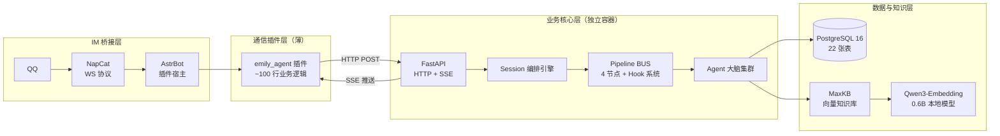
```mermaid
graph LR
    subgraph "IM 桥接层"
        A[QQ] --> B[NapCat<br/>WS 协议]
        B --> C[AstrBot<br/>插件宿主]
    end

    subgraph "通信插件层（薄）"
        D[emily_agent 插件<br/>~100 行业务逻辑]
    end

    subgraph "业务核心层（独立容器）"
        E[FastAPI<br/>HTTP + SSE]
        F[Session 编排引擎]
        G[Pipeline BUS<br/>4 节点 + Hook 系统]
        H[Agent 大脑集群]
    end

    subgraph "数据与知识层"
        I[(PostgreSQL 16<br/>22 张表)]
        J[MaxKB<br/>向量知识库]
        K[Qwen3-Embedding<br/>0.6B 本地模型]
    end

    C --> D
    D -->|HTTP POST| E
    E -->|SSE 推送| D
    E --> F
    F --> G
    G --> H
    H --> I
    H --> J
    J --> K
```

| 层次 | 技术选型 | 版本/说明 |
|------|----------|-----------|
| IM 桥接 | NapCat Docker | QQ 协议 WebSocket |
| 插件宿主 | AstrBot | 插件运行时框架 |
| 业务核心 | Python 3.12 + FastAPI | 独立 Docker 容器 |
| 数据库 | PostgreSQL 16 + SQLAlchemy 2.0 | 22 张表 ORM |
| AI 引擎 | DeepSeek API（兼容 OpenAI） | 支持思考模式 + 函数调用 |
| 向量检索 | MaxKB + Qwen3-Embedding-0.6B | 本地部署 embedding |
| 容器编排 | Docker Compose | 5 服务协同 |

### 1.3 两容器架构

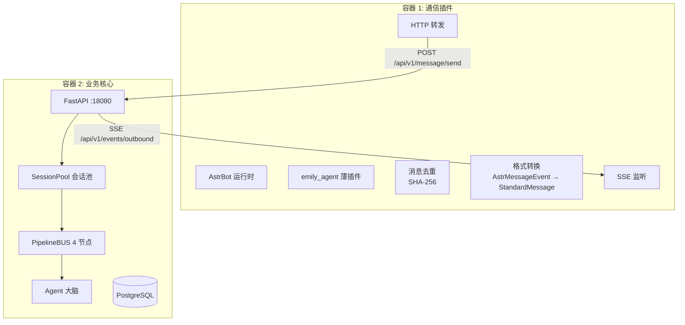
```mermaid
graph TB
    subgraph "容器 1: 通信插件"
        direction TB
        P1[AstrBot 运行时]
        P2[emily_agent 薄插件]
        P3[消息去重<br/>SHA-256]
        P4[格式转换<br/>AstrMessageEvent → StandardMessage]
        P5[HTTP 转发]
        P6[SSE 监听]
    end

    subgraph "容器 2: 业务核心"
        direction TB
        C1[FastAPI :18080]
        C2[SessionPool 会话池]
        C3[PipelineBUS 4 节点]
        C4[Agent 大脑]
        C5[(PostgreSQL)]
    end

    P5 -->|POST /api/v1/message/send| C1
    C1 -->|SSE /api/v1/events/outbound| P6
    C1 --> C2
    C2 --> C3
    C3 --> C4
```

**设计原则**: 业务逻辑与 IM 协议**物理隔离**。插件只做协议适配（去重、格式转换、转发），所有 AI 推理、业务规则、数据访问全部在 Core 容器内完成。

### 1.4 代码规模

| 指标 | 数值 |
|------|------|
| Python 有效代码行 | ~15,300 |
| Python 源文件 | ~105 |
| 基础设施层（服务+仓储+工具） | ~50% |
| Agent 大脑（待接入） | ~25% |
| 新编排层（Session+Pipeline） | ~21% |
| 薄插件层 | ~5% |
| SOP 文档 | 10 篇 ~2,000 行 |
| Prompt 模板 | 5 个文件 |
| 配置文件 | 2 个 JSON |

---

## 二、系统架构

### 2.1 消息处理主链路

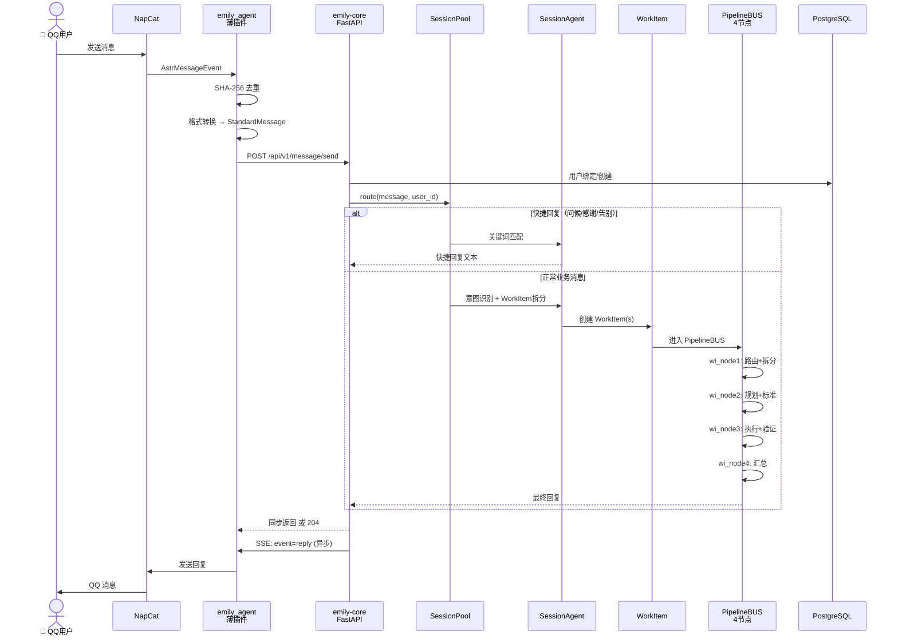
```mermaid
sequenceDiagram
    actor User as 👤 QQ用户
    participant NapCat as NapCat
    participant Plugin as emily_agent<br/>薄插件
    participant Core as emily-core<br/>FastAPI
    participant Pool as SessionPool
    participant Agent as SessionAgent
    participant WI as WorkItem
    participant Bus as PipelineBUS<br/>4节点
    participant DB as PostgreSQL

    User->>NapCat: 发送消息
    NapCat->>Plugin: AstrMessageEvent
    Plugin->>Plugin: SHA-256 去重
    Plugin->>Plugin: 格式转换 → StandardMessage
    Plugin->>Core: POST /api/v1/message/send

    Core->>DB: 用户绑定/创建
    Core->>Pool: route(message, user_id)

    alt 快捷回复（问候/感谢/告别）
        Pool->>Agent: 关键词匹配
        Agent-->>Core: 快捷回复文本
    else 正常业务消息
        Pool->>Agent: 意图识别 + WorkItem拆分
        Agent->>WI: 创建 WorkItem(s)
        WI->>Bus: 进入 PipelineBUS
        Bus->>Bus: wi_node1: 路由+拆分
        Bus->>Bus: wi_node2: 规划+标准
        Bus->>Bus: wi_node3: 执行+验证
        Bus->>Bus: wi_node4: 汇总
        Bus-->>Core: 最终回复
    end

    Core-->>Plugin: 同步返回 或 204
    Core->>Plugin: SSE: event=reply (异步)
    Plugin->>NapCat: 发送回复
    NapCat->>User: QQ 消息
```

### 2.2 核心架构分层

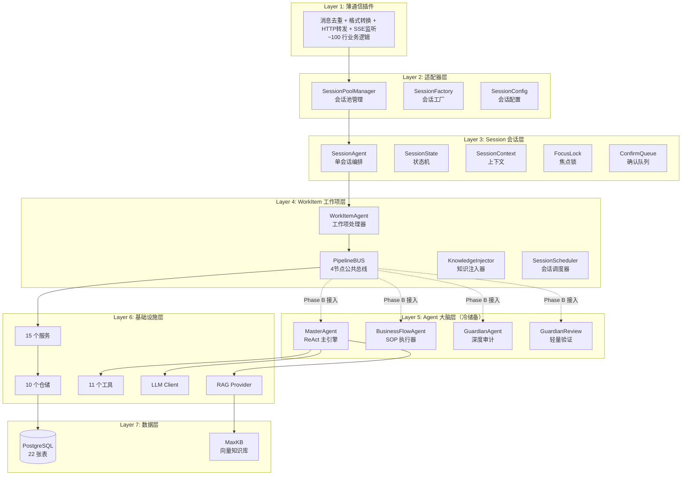
```mermaid
graph TB
    subgraph "Layer 1: 薄通信插件"
        L1[消息去重 + 格式转换 + HTTP转发 + SSE监听<br/>~100 行业务逻辑]
    end

    subgraph "Layer 2: 适配器层"
        L2A[SessionPoolManager<br/>会话池管理]
        L2B[SessionFactory<br/>会话工厂]
        L2C[SessionConfig<br/>会话配置]
    end

    subgraph "Layer 3: Session 会话层"
        L3A[SessionAgent<br/>单会话编排]
        L3B[SessionState<br/>状态机]
        L3C[SessionContext<br/>上下文]
        L3D[FocusLock<br/>焦点锁]
        L3E[ConfirmQueue<br/>确认队列]
    end

    subgraph "Layer 4: WorkItem 工作项层"
        L4A[WorkItemAgent<br/>工作项处理器]
        L4B[PipelineBUS<br/>4节点公共总线]
        L4C[KnowledgeInjector<br/>知识注入器]
        L4D[SessionScheduler<br/>会话调度器]
    end

    subgraph "Layer 5: Agent 大脑层（冷储备）"
        L5A[MasterAgent<br/>ReAct 主引擎]
        L5B[BusinessFlowAgent<br/>SOP 执行器]
        L5C[GuardianAgent<br/>深度审计]
        L5D[GuardianReview<br/>轻量验证]
    end

    subgraph "Layer 6: 基础设施层"
        L6A[15 个服务]
        L6B[10 个仓储]
        L6C[11 个工具]
        L6D[LLM Client]
        L6E[RAG Provider]
    end

    subgraph "Layer 7: 数据层"
        L7A[(PostgreSQL<br/>22 张表)]
        L7B[MaxKB<br/>向量知识库]
    end

    L1 --> L2A
    L2A --> L3A
    L3A --> L4A
    L4A --> L4B
    L4B -.->|Phase B 接入| L5A
    L4B -.->|Phase B 接入| L5B
    L4B -.->|Phase B 接入| L5C
    L4B -.->|Phase B 接入| L5D
    L4B --> L6A
    L6A --> L6B
    L6B --> L7A
    L5A --> L6C
    L5A --> L6D
    L5A --> L6E
    L6E --> L7B
```

### 2.3 Pipeline BUS 内部结构

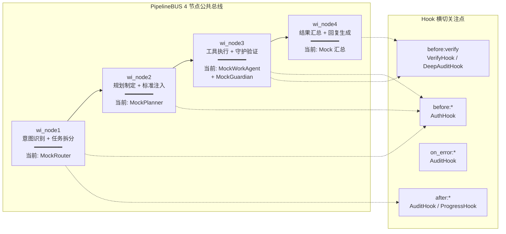
```mermaid
graph LR
    subgraph "PipelineBUS 4 节点公共总线"
        direction LR
        N1[wi_node1<br/>意图识别 + 任务拆分<br/>━━━━━━━━<br/>当前: MockRouter]
        N2[wi_node2<br/>规划制定 + 标准注入<br/>━━━━━━━━<br/>当前: MockPlanner]
        N3[wi_node3<br/>工具执行 + 守护验证<br/>━━━━━━━━<br/>当前: MockWorkAgent<br/>+ MockGuardian]
        N4[wi_node4<br/>结果汇总 + 回复生成<br/>━━━━━━━━<br/>当前: Mock 汇总]
        N1 --> N2 --> N3 --> N4
    end

    subgraph "Hook 横切关注点"
        H1[before:*<br/>AuthHook]
        H2[after:*<br/>AuditHook / ProgressHook]
        H3[on_error:*<br/>AuditHook]
        H4[before:verify<br/>VerifyHook / DeepAuditHook]
    end

    N1 -.-> H1
    N1 -.-> H2
    N2 -.-> H1
    N3 -.-> H1
    N3 -.-> H4
    N4 -.-> H4
```

---

## 三、开发版本历史

### 3.1 版本时间线

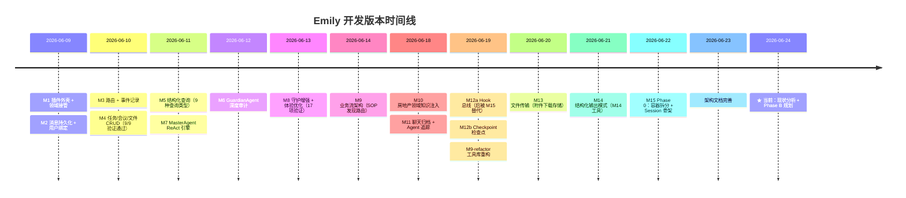
```mermaid
timeline
    title Emily 开发版本时间线
    2026-06-09 : M1 插件外壳 + 领域接管
               : M2 消息持久化 + 用户绑定
    2026-06-10 : M3 路由 + 事件记录
               : M4 任务/会议/文件 CRUD（9/9 验证通过）
    2026-06-11 : M5 结构化查询（9 种查询类型）
               : M7 MasterAgent ReAct 引擎
    2026-06-12 : M6 GuardianAgent 深度审计
    2026-06-13 : M8 守护增强 + 体验优化（17 项验证）
    2026-06-14 : M9 业务流架构（SOP 发现路由）
    2026-06-18 : M10 房地产领域知识注入
               : M11 聊天归档 + Agent 追踪
    2026-06-19 : M12a Hook 总线（后被 M15 替代）
               : M12b Checkpoint 检查点
               : M9-refactor 工具库重构
    2026-06-20 : M13 文件传输（附件下载存储）
    2026-06-21 : M14 结构化输出模式（M14 工具）
    2026-06-22 : M15 Phase 0：容器拆分 + Session 骨架
    2026-06-23 : 架构文档完善
    2026-06-24 : ★ 当前：现状分析 + Phase B 规划
```

### 3.2 里程碑详情

#### M1 — 插件外壳 + 领域接管（2026-06-09）✅

- 首个可运行插件
- `DomainTakeoverService` 判断是否接管消息（@机器人、私聊/群聊模式）
- 三种接管模式：`observe`（观察）、`collaborate`（协作）、`managed`（管理模式预留）

#### M2 — 消息持久化 + 用户绑定（2026-06-09）✅

- `MessageService` 消息记录（幂等插入）
- `UserBindingService` 自动创建用户 + IM 身份绑定
- `users` + `user_im_bindings` + `messages` + `conversations` 表

#### M3 — 路由 + 事件记录（2026-06-10）✅

- 意图路由：自然语言 → 结构化操作参数
- `EventService` 事件创建/查询、事件编号生成
- `EventCommand` 协议对象定义

#### M4 — 任务/会议/文件 CRUD（2026-06-10）✅

- 补齐 `TaskService`、`MeetingService`、`FileService`
- 完整 CRUD + 编号生成 + 回复格式化
- `smoke_test` 验证 9/9 通过

#### M5 — 结构化查询（2026-06-11）✅

- `QueryService` 9 种查询类型
- 支持：event / task / meeting / file / message / conversation / user / project / summary
- 跨仓储联合查询 + 格式化输出

#### M7 — MasterAgent ReAct 引擎（2026-06-11）✅

- `MasterAgent` 完整 ReAct（Reasoning + Acting）循环
- 动态技能注册（`ToolRegistry`）
- DeepSeek 思考模式支持

#### M6 — GuardianAgent 深度审计（2026-06-12）✅

- 无状态 ReAct Agent，专用于数据分析
- `write_notebook` 工具输出审计报告
- QQ 群 3 个实际用例验证

#### M8 — 守护增强 + 体验优化（2026-06-13）✅

- M8a: `GuardianReview` 轻量单次 LLM 验证（回复 + 记录）
- M8b: 进度消息推送（"正在为你处理..."）
- M8c: `UserMemoryService` + `EventJournal` 长期记忆

#### M9 — 业务流架构（2026-06-14）✅

- `SOPIntentRegistry` 动态 SOP 发现 + 目录序列化
- `BusinessFlowAgent` 双模式执行（结构化 + ReAct）
- `SOPRoutingLog` 路由决策日志
- **ADR-022**: 发现式路由替代硬编码意图映射

#### M10 — 房地产领域知识（2026-06-18）✅

- L1 核心认知注入（生命周期 7 阶段、三级管控、9 部门职责、20+ 术语）
- L2 按需检索（MaxKB 知识库匹配）
- 108 项测试全部通过

#### M11 — 聊天归档 + Agent 追踪（2026-06-18）✅

- 4 张新表：`message_attachments`、`agent_reasoning_logs`、`llm_interaction_logs`、`tool_call_logs`
- 3 个新服务：`ChatArchiveService`、`AgentTraceService`、`FileStorageService`
- `chat_archive` 工具（聊天历史查询）
- IM 测试 7/8 通过

#### M12a — Hook 总线架构（2026-06-19 → 2026-06-22 废止）⚠️

- **ADR-026**: 6 个 Mock 占位模块 + Pipeline BUS + Hook 系统
- 12 个声明式 Hook 配置
- 后被 M15 Session 架构替代（Hook 基础设施保留）

#### M12b — Checkpoint 检查点（2026-06-19）✅

- `sop_checkpoints` 表 + `CheckpointService`
- SOP 执行状态快照：确认/取消/过期/恢复生命周期
- 5 状态：`pending` → `confirmed` / `cancelled` / `expired` / `resumed`

#### M13 — 文件传输（2026-06-20）✅

- `send_file` + `read_local_file` 工具
- IM 附件下载 → 本地存储 → 数据库记录
- `message_attachments` 关联表

#### M14 — 结构化输出模式（2026-06-21）✅

- `BusinessFlowToolRegistry` 框架直调工具（不经过 LLM 函数调用）
- LLM 输出 JSON 参数 → 框架直接调用 handler
- 核心工具：`record_event` / `record_task` / `record_meeting` / `record_file` / `query_data`

#### M9-refactor — 工具库重构（2026-06-19）✅

- 工具从 15 个精简到 10 个
- 5 个"伪工具"移出 LLM 可见范围，转为框架直调

#### M15 — Phase 0：容器拆分 + Session 骨架（2026-06-22）✅

- **重大架构变更**：`emily-core` 从 AstrBot 插件中物理拆分为独立 Docker 容器
- 插件变为薄通信层（~100 行业务逻辑）
- Session 主链路骨架搭建：`SessionPool` → `SessionAgent` → `WorkItem` → `PipelineBUS`
- 6 个 Mock 组件跑通总线验证
- 冒烟测试通过

### 3.3 架构决策记录 (ADR)

| 编号 | 里程碑 | 决策内容 | 状态 |
|------|--------|----------|------|
| ADR-022 | M9 | 发现式路由：LLM 语义匹配 SOP 目录，替代硬编码意图映射 | 已采纳 |
| ADR-026 | M15 | Phase 0 Mock 占位策略：6 个 Mock 组件验证 Pipeline BUS，渐进替换为真实 Agent | 执行中 |

---

## 四、模块结构详解

### 4.1 目录树

```
D:\app\Emily/
│
├── docker-compose-napcat.yml          # 5 服务 Docker 编排
├── .env / .env.example                # 环境变量（LLM key、模型等）
├── .gitignore
│
├── emily-core/                        # ★ 业务核心独立容器
│   ├── Dockerfile
│   ├── requirements.txt
│   ├── api/                           # FastAPI 入口
│   │   ├── server.py                  # 应用创建、路由注册、SSE 挂载
│   │   ├── routes/
│   │   │   ├── message.py             # POST /api/v1/message/send
│   │   │   ├── session.py             # POST /api/v1/session/terminate
│   │   │   └── health.py              # GET /api/v1/health
│   │   ├── sse/outbound.py            # GET /api/v1/events/outbound
│   │   └── middleware/auth.py         # 鉴权中间件（占位）
│   │
│   └── emily_core/                    # 业务内核
│       ├── __init__.py                # EmilyCore 编排入口
│       ├── config.py                  # 配置 dataclass（~60 字段）
│       ├── bootstrap.py               # DB 初始化 + 工厂
│       ├── outbound_bus.py            # 出站事件总线（SSE 源）
│       │
│       ├── adapters/
│       │   ├── standard/              # 跨平台协议对象
│       │   │   ├── message.py         # StandardMessage
│       │   │   ├── reply.py           # ReplyMessage
│       │   │   ├── command.py         # EventCommand/TaskCommand/MeetingCommand/FileCommand/QueryCommand
│       │   │   ├── result.py          # RouteResult/HandlerResult/AgentResult/AgentStep
│       │   │   └── route_decision.py  # RouteDecision（领域接管决策）
│       │   └── session/               # Session 适配器
│       │       ├── session_pool.py    # SessionPoolManager
│       │       ├── session_factory.py # SessionFactory
│       │       └── session_config.py  # SessionConfig
│       │
│       ├── session/                   # Session 会话层
│       │   ├── session_agent.py       # SessionAgent（单会话编排）
│       │   ├── session_state.py       # SessionState 状态机
│       │   ├── session_context.py     # SessionContext（骨架）
│       │   ├── focus_lock.py          # FocusLock（占位）
│       │   └── confirm_queue.py       # ConfirmQueue（占位）
│       │
│       ├── workitem/                  # WorkItem 工作项层
│       │   ├── __init__.py            # WorkItem 定义
│       │   ├── workitem_state.py      # WorkItemState 状态机
│       │   ├── workitem_agent.py      # WorkItemAgent（全局单例，持有 Mock 大脑）
│       │   ├── injector.py            # KnowledgeInjector（占位）
│       │   ├── scheduler.py           # SessionScheduler
│       │   └── pipeline/              # Pipeline BUS 子系统
│       │       ├── bus.py             # PipelineBUS 核心
│       │       ├── node.py            # PipelineNode
│       │       ├── context.py         # BusContext
│       │       ├── hook.py            # Hook 基类 + 6 子类
│       │       ├── hook_registry.py   # HookRegistry 挂载点管理
│       │       ├── interfaces/        # 7 个抽象接口
│       │       │   ├── routing.py     # IntentType/SubTask/RouteDecision/Router
│       │       │   ├── planning.py    # PlanStep/ExecutionPlan/Planner
│       │       │   ├── execution.py   # ToolCallRecord/StepResult/WorkAgent
│       │       │   ├── guardian.py    # GuardianVerdict/Guardian
│       │       │   ├── auth.py        # AuthDecision/AuthResult/AuthEngine
│       │       │   └── risk.py        # RiskGrader
│       │       └── mocks/             # 6 个 Mock 实现
│       │           ├── mock_routing.py    # MockRouter
│       │           ├── mock_planning.py   # MockPlanner
│       │           ├── mock_execution.py  # MockWorkAgent + MockWorkAgentQuery
│       │           ├── mock_guardian.py   # MockGuardian
│       │           ├── mock_auth.py       # MockAuthEngine
│       │           └── mock_risk.py       # MockRiskGrader
│       │
│       ├── agent/                     # Agent 大脑（已迁移，冷储备）
│       │   ├── master_agent.py        # MasterAgent ReAct 主引擎 (~800行)
│       │   ├── business_flow_agent.py # BusinessFlowAgent SOP 执行器 (~400行)
│       │   ├── guardian_agent.py      # GuardianAgent 深度审计 (~500行)
│       │   ├── guardian_review.py     # GuardianReview 轻量验证 (~200行)
│       │   ├── intent_registry.py     # SOPIntentRegistry 动态发现 (~400行)
│       │   ├── tool_registry.py       # ToolRegistry 工具注册 (~300行)
│       │   ├── sop_parser.py          # SOP 解析器
│       │   ├── conversation_context.py# 对话上下文管理
│       │   ├── mermaid_flow.py        # Mermaid 流程图引擎
│       │   └── flow_renderer.py       # 流程图渲染器
│       │
│       ├── application/               # 应用编排层（5 个）
│       │   ├── event_app.py           # 事件应用
│       │   ├── task_app.py            # 任务应用
│       │   ├── meeting_app.py         # 会议应用
│       │   ├── file_app.py            # 文件应用
│       │   └── query_app.py           # 查询应用
│       │
│       ├── services/                  # 服务层（15 个）
│       │   ├── event_service.py       # 事件服务
│       │   ├── task_service.py        # 任务服务
│       │   ├── meeting_service.py     # 会议服务
│       │   ├── file_service.py        # 文件服务
│       │   ├── query_service.py       # 查询服务（9 类型）
│       │   ├── message_service.py     # 消息服务
│       │   ├── user_binding_service.py# 用户绑定服务
│       │   ├── domain_takeover_service.py # 领域接管服务
│       │   ├── user_memory_service.py # 用户记忆服务
│       │   ├── event_journal.py       # 事件日志
│       │   ├── pending_issues.py      # 待办问题服务
│       │   ├── file_storage_service.py# 文件存储服务
│       │   ├── chat_archive_service.py# 聊天归档服务
│       │   ├── agent_trace_service.py # Agent 追踪服务
│       │   └── checkpoint_service.py  # 检查点服务
│       │
│       ├── repositories/              # 仓储层（10 个）
│       │   ├── event_repo.py
│       │   ├── task_repo.py
│       │   ├── meeting_repo.py
│       │   ├── file_repo.py
│       │   ├── message_repo.py
│       │   ├── user_repo.py
│       │   ├── chat_archive_repo.py
│       │   ├── agent_reasoning_repo.py
│       │   ├── llm_interaction_repo.py
│       │   └── tool_call_repo.py
│       │
│       ├── tools/                     # 工具层（11 个）
│       │   ├── __init__.py            # 工具注册入口
│       │   ├── event_tool.py          # record_event（M14 结构化）
│       │   ├── task_tool.py           # record_task（M14 结构化）
│       │   ├── meeting_tool.py        # record_meeting（M14 结构化）
│       │   ├── file_tool.py           # record_file + send/read（M14 + LLM）
│       │   ├── query_tool.py          # query_data（M14 结构化 + LLM 回退）
│       │   ├── knowledge_search_tool.py # knowledge_search（LLM）
│       │   ├── memory_tool.py         # write_user_memory（LLM）
│       │   ├── pending_issue_tool.py  # query/resolve（LLM）
│       │   ├── chat_archive_tool.py   # chat_archive（LLM）
│       │   └── business_flow_tools.py # BusinessFlowToolRegistry（M14）
│       │
│       ├── infrastructure/
│       │   ├── database/
│       │   │   ├── models.py          # 22 张表 ORM 定义
│       │   │   └── session.py         # DB 会话管理
│       │   └── llm/
│       │       └── client.py          # LLMClient（OpenAI 兼容）
│       │
│       └── providers/
│           └── rag/
│               ├── base.py            # RagProvider 抽象基类
│               ├── maxkb_provider.py  # MaxKB 向量搜索
│               └── local_fallback.py  # 本地 TF-IDF 回退
│
├── data/plugins/emily_agent/          # ★ AstrBot 薄通信插件
│   ├── metadata.yaml                  # 插件元数据
│   ├── main.py                        # 入口（~100 行）
│   ├── _conf_schema.json              # 插件配置 Schema
│   └── adapters/
│       ├── api_client.py              # EmilyApiClient（HTTP → Core）
│       ├── sse_listener.py            # SSEListener（SSE ← Core）
│       ├── astrbot/
│       │   ├── inbound_adapter.py     # AstrMessageEvent → StandardMessage
│       │   └── outbound_sender.py     # OutboundEvent → AstrBot 发送
│       └── standard/                  # 协议对象副本（需与 Core 同步）
│
├── emily-data/                        # ★ 容器挂载数据
│   ├── sops/                          # 10 个 SOP 业务流定义
│   ├── prompts/                       # LLM Prompt 模板
│   ├── config/                        # core_config.json + hook_config.json
│   ├── baseknowledge/                 # 知识库原始文档（MaxKB 索引用）
│   ├── notebooks/                     # Guardian Agent 调查笔记
│   ├── logs/                          # Core 运行日志
│   ├── attachments/                   # IM 附件存储
│   ├── user_memory/                   # 用户长期记忆文件
│   ├── journal/                       # 项目事件日志
│   └── db_seeds/                      # 数据库种子数据
│
├── scripts/
│   └── smoke_test.py                  # 离线端到端冒烟测试
│
├── 看板内容/                          # 项目文档
│   ├── CLAUDE.md                      # AI 助手指令
│   ├── Projects+Wiki.md               # 项目 Wiki
│   ├── Releases.md                    # 版本发布记录
│   └── issues.md                      # 未来规划 + 待办
│
└── tem/                               # 架构文档
    ├── 0623README.md                  # Emily README (v0.6.0)
    ├── 0623Emily_主系统架构.md         # 主架构蓝图 (2000+ 行)
    └── 0623项目规模报告.md             # 项目规模报告
```

### 4.2 模块依赖关系

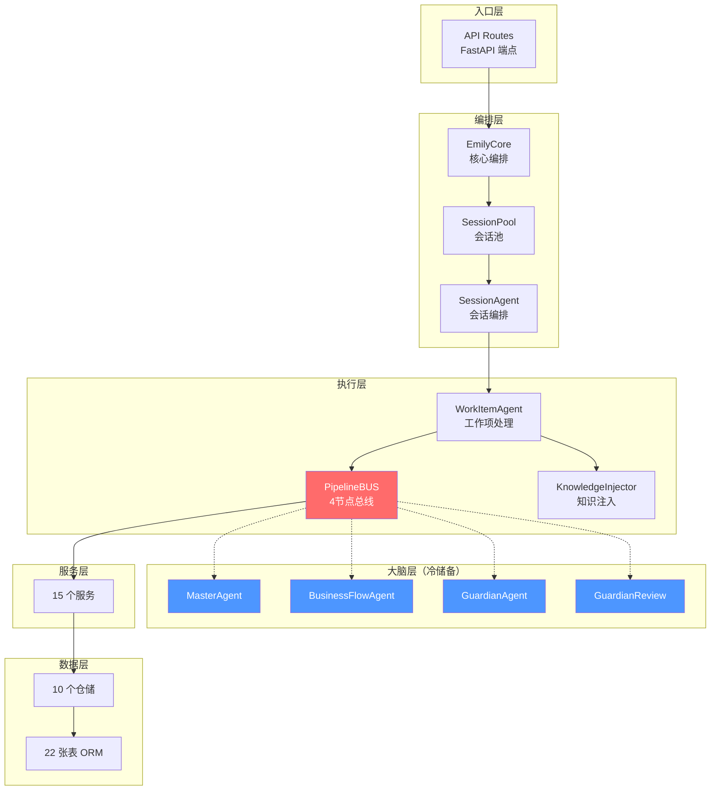
```mermaid
graph TB
    subgraph "入口层"
        API[API Routes<br/>FastAPI 端点]
    end

    subgraph "编排层"
        EC[EmilyCore<br/>核心编排]
        SP[SessionPool<br/>会话池]
        SA[SessionAgent<br/>会话编排]
    end

    subgraph "执行层"
        WA[WorkItemAgent<br/>工作项处理]
        BUS[PipelineBUS<br/>4节点总线]
        KI[KnowledgeInjector<br/>知识注入]
    end

    subgraph "大脑层（冷储备）"
        MA[MasterAgent]
        BF[BusinessFlowAgent]
        GA[GuardianAgent]
        GR[GuardianReview]
    end

    subgraph "服务层"
        SVCS[15 个服务]
    end

    subgraph "数据层"
        REPOS[10 个仓储]
        MODELS[22 张表 ORM]
    end

    API --> EC
    EC --> SP
    SP --> SA
    SA --> WA
    WA --> BUS
    BUS -.-> MA
    BUS -.-> BF
    BUS -.-> GA
    BUS -.-> GR
    WA --> KI
    BUS --> SVCS
    SVCS --> REPOS
    REPOS --> MODELS

    style BUS fill:#ff6b6b,color:#fff
    style MA fill:#4d96ff,color:#fff
    style BF fill:#4d96ff,color:#fff
    style GA fill:#4d96ff,color:#fff
    style GR fill:#4d96ff,color:#fff
```

**图例**: 🔴 红色 = 当前 Mock 驱动 | 🔵 蓝色 = 已完成但未接入（冷储备）

---

## 五、接口约定

### 5.1 Pipeline 抽象接口

项目定义了 7 个抽象接口，位于 `emily_core/workitem/pipeline/interfaces/`，所有 Mock 和未来真实实现必须遵循：


```mermaid
classDiagram
    class Router {
        <<interface>>
        +async route(message, context) RouteDecision
    }
    class Planner {
        <<interface>>
        +async plan(route_decision, context) ExecutionPlan
    }
    class WorkAgent {
        <<interface>>
        +async plan(route_decision, context) ExecutionPlan
        +async execute(plan, context) list~StepResult~
    }
    class Guardian {
        <<interface>>
        +async review_step(step_result, plan_step, criteria) GuardianVerdict
        +async review_reply(draft_reply, work_order) GuardianVerdict
    }
    class AuthEngine {
        <<interface>>
        +async authorize(user_id, route_decision) AuthResult
    }
    class RiskGrader {
        <<interface>>
        +grade(route_decision, operation_type) str
    }

    Router <|.. MockRouter : implements
    Router <|.. RealRouter : Phase B
    Planner <|.. MockPlanner : implements
    Planner <|.. RealPlanner : Phase B
    WorkAgent <|.. MockWorkAgent : implements
    WorkAgent <|.. RealWorkAgent : Phase B
    Guardian <|.. MockGuardian : implements
    Guardian <|.. RealGuardian : Phase B
    AuthEngine <|.. MockAuthEngine : implements
    AuthEngine <|.. RealAuthEngine : Phase B
    RiskGrader <|.. MockRiskGrader : implements
    RiskGrader <|.. RealRiskGrader : Phase B
```

### 5.2 核心协议对象

#### StandardMessage（消息入站标准格式）

| 字段 | 类型 | 必填 | 说明 |
|------|------|------|------|
| `message_id` | str | ✗ | 消息唯一 ID |
| `platform` | str | ✗ | 平台标识，如 "napcat" |
| `conversation_type` | str | ✗ | "private" / "group" |
| `conversation_id` | str | ✗ | 群号或私聊用户 ID |
| `sender_id` | str | ✗ | 发送者 ID |
| `sender_name` | str | ✗ | 发送者昵称 |
| `group_id` | str \| None | ✗ | 群 ID |
| `group_name` | str \| None | ✗ | 群名称 |
| `content` | str | ✗ | 纯文本内容（@bot 已去除） |
| `is_at_bot` | bool | ✗ | 是否 @了机器人 |
| `mentioned_user_ids` | list[str] | ✗ | 被 @的用户 ID 列表 |
| `reply_to_message_id` | str \| None | ✗ | 被回复的消息 ID |
| `timestamp` | datetime \| None | ✗ | 消息时间戳 |
| `raw_event` | dict \| None | ✗ | 原始事件数据（调试用） |
| `msg_type` | int | ✗ | 1=text, 2=image, 3=file, 4=voice, 5=video, 6=card |
| `attachments` | list[dict] | ✗ | 附件列表 `{"type","url","file_name","file_size"}` |

#### ReplyMessage（回复出站标准格式）

| 字段 | 类型 | 必填 | 说明 |
|------|------|------|------|
| `conversation_id` | str | ✓ | 目标会话 ID |
| `content` | str | ✓ | 回复文本内容 |
| `reply_to_message_id` | str \| None | ✗ | 被回复的消息 ID |
| `references` | list[dict] | ✗ | 引用数据 |
| `metadata` | dict | ✗ | 元数据 |
| `file_paths` | list[dict] | ✗ | 附件路径 `{"path","name"}` |

#### RouteDecision（领域接管决策）

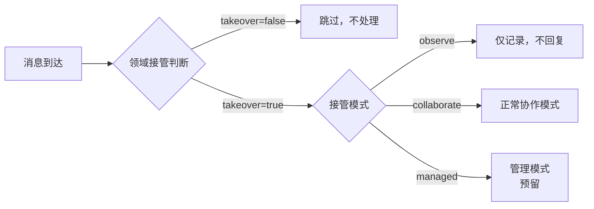
```mermaid
graph LR
    M[消息到达] --> D{领域接管判断}
    D -->|takeover=false| SKIP[跳过，不处理]
    D -->|takeover=true| MODE{接管模式}
    MODE -->|observe| O[仅记录，不回复]
    MODE -->|collaborate| C[正常协作模式]
    MODE -->|managed| MGR[管理模式<br/>预留]
```

| 字段 | 类型 | 说明 |
|------|------|------|
| `takeover` | bool | 是否接管此消息 |
| `mode` | str | "observe" / "collaborate" / "managed" |
| `intent` | str \| None | 意图类型（预留，由 MasterAgent 决策） |
| `confidence` | float | 置信度 0.0-1.0 |
| `handler` | str \| None | 处理器名称（预留） |
| `should_reply` | bool | 是否需要回复用户 |
| `reason` | str | 决策理由（日志追溯） |

#### 业务命令对象（Command）

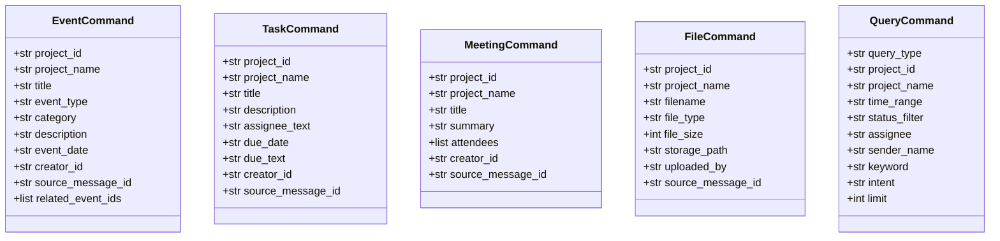
```mermaid
classDiagram
    class EventCommand {
        +str project_id
        +str project_name
        +str title
        +str event_type
        +str category
        +str description
        +str event_date
        +str creator_id
        +str source_message_id
        +list related_event_ids
    }
    class TaskCommand {
        +str project_id
        +str project_name
        +str title
        +str description
        +str assignee_text
        +str due_date
        +str due_text
        +str creator_id
        +str source_message_id
    }
    class MeetingCommand {
        +str project_id
        +str project_name
        +str title
        +str summary
        +list attendees
        +str creator_id
        +str source_message_id
    }
    class FileCommand {
        +str project_id
        +str project_name
        +str filename
        +str file_type
        +int file_size
        +str storage_path
        +str uploaded_by
        +str source_message_id
    }
    class QueryCommand {
        +str query_type
        +str project_id
        +str project_name
        +str time_range
        +str status_filter
        +str assignee
        +str sender_name
        +str keyword
        +str intent
        +int limit
    }
```

---

## 六、数据模型

### 6.1 数据库 ER 图（核心表）

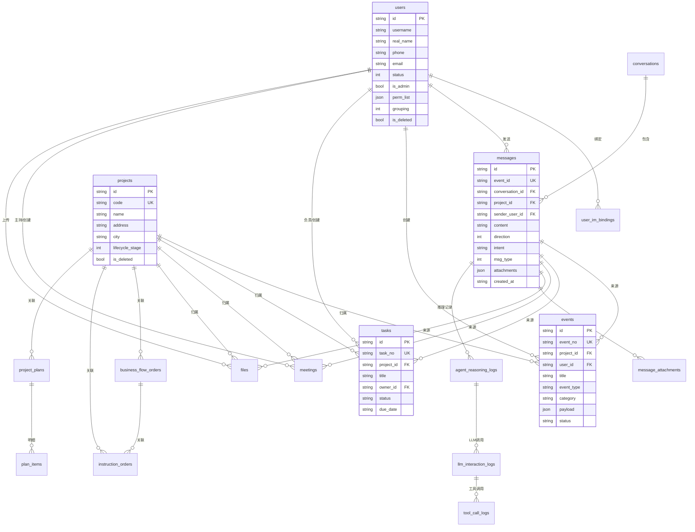
```mermaid
erDiagram
    users ||--o{ user_im_bindings : "绑定"
    users ||--o{ messages : "发送"
    users ||--o{ events : "创建"
    users ||--o{ tasks : "负责/创建"
    users ||--o{ meetings : "主持/创建"
    users ||--o{ files : "上传"

    conversations ||--o{ messages : "包含"
    projects ||--o{ events : "归属"
    projects ||--o{ tasks : "归属"
    projects ||--o{ meetings : "归属"
    projects ||--o{ files : "归属"
    projects ||--o{ business_flow_orders : "关联"
    projects ||--o{ instruction_orders : "关联"
    projects ||--o{ project_plans : "关联"

    messages ||--o{ events : "来源"
    messages ||--o{ tasks : "来源"
    messages ||--o{ meetings : "来源"
    messages ||--o{ files : "来源"
    messages ||--o{ message_attachments : "附件"

    project_plans ||--o{ plan_items : "明细"
    business_flow_orders ||--o{ instruction_orders : "关联"

    messages ||--o{ agent_reasoning_logs : "推理记录"
    agent_reasoning_logs ||--o{ llm_interaction_logs : "LLM调用"
    llm_interaction_logs ||--o{ tool_call_logs : "工具调用"

    users {
        string id PK
        string username
        string real_name
        string phone
        string email
        int status
        bool is_admin
        json perm_list
        int grouping
        bool is_deleted
    }

    messages {
        string id PK
        string event_id UK
        string conversation_id FK
        string project_id FK
        string sender_user_id FK
        string content
        int direction
        string intent
        int msg_type
        json attachments
        string created_at
    }

    projects {
        string id PK
        string code UK
        string name
        string address
        string city
        int lifecycle_stage
        bool is_deleted
    }

    events {
        string id PK
        string event_no UK
        string project_id FK
        string user_id FK
        string title
        string event_type
        string category
        json payload
        string status
    }

    tasks {
        string id PK
        string task_no UK
        string project_id FK
        string title
        string owner_id FK
        string status
        string due_date
    }
```

### 6.2 全部 22 张表清单

| # | 表名 | 类名 | 用途 |
|---|------|------|------|
| 1 | `users` | User | 系统用户 + 员工信息（含 `perm_list` 权限列表、`grouping` 分组） |
| 2 | `user_im_bindings` | UserImBinding | IM 平台用户绑定（platform + user_id 唯一） |
| 3 | `conversations` | Conversation | IM 会话（platform + conversation_id 唯一） |
| 4 | `messages` | Message | 消息记录（含 msg_type 1-6、attachments JSON） |
| 5 | `projects` | Project | 项目基础信息（lifecycle_stage 0-3） |
| 6 | `events` | Event | 项目事件（event_no 唯一、payload JSON） |
| 7 | `tasks` | Task | 任务（task_no 唯一、owner 关联用户） |
| 8 | `meetings` | Meeting | 会议纪要（meeting_type 0-5、conclusion、action_items JSON） |
| 9 | `files` | File | 文件管理（file_no 唯一、confidentiality 0-3、version 管理） |
| 10 | `company_info` | CompanyInfo | 公司信息（unified_code 18 位统一信用代码） |
| 11 | `project_indicator_details` | ProjectIndicatorDetail | 项目指标（名称、值、单位、是否约束性指标） |
| 12 | `business_flow_orders` | BusinessFlowOrder | 业务流程单（flow_type 0-4、metrics JSON、current_node） |
| 13 | `instruction_orders` | InstructionOrder | 指令单（instruction_type 0-4、executor_ids JSON） |
| 14 | `project_plans` | ProjectPlan | 计划主表（plan_type 0-4、parent_plan_id 树形结构） |
| 15 | `plan_items` | PlanItem | 计划明细（progress 0-100、responsible_id） |
| 16 | `sop_routing_logs` | SOPRoutingLog | SOP 路由决策日志（matched_sop_id、match_confidence） |
| 17 | `message_attachments` | MessageAttachment | 消息附件关联（attachment_type 0-5） |
| 18 | `agent_reasoning_logs` | AgentReasoningLog | Agent 推理记录（iteration_count、execution_result） |
| 19 | `llm_interaction_logs` | LLMInteractionLog | LLM 调用记录（token 用量、latency_ms） |
| 20 | `tool_call_logs` | ToolCallLog | 工具调用记录（tool_name、step_index、elapsed_ms） |
| 21 | `hook_execution_logs` | HookExecutionLog | Hook 执行审计（mount_point、decision、duration_ms） |
| 22 | `sop_checkpoints` | SOPCheckpoint | SOP 检查点（state_json、status、expires_at） |

### 6.3 数据库约定

- **主键**: 全部使用 UUID 字符串（`_new_uuid()`）
- **业务编号**: 使用前缀 + 日期 + 序号（如 `EVT-20260624-001`）
- **时间戳**: 全部使用 ISO-8601 字符串格式，北京时间（UTC+8）
- **JSON 字段**: 灵活扩展字段使用 SQLAlchemy JSON 类型
- **软删除**: 关键表使用 `is_deleted` 标志
- **连接池**: pool_size=5, max_overflow=10, pool_pre_ping=True, pool_recycle=3600s

---

## 七、状态机定义

### 7.1 Session 生命周期

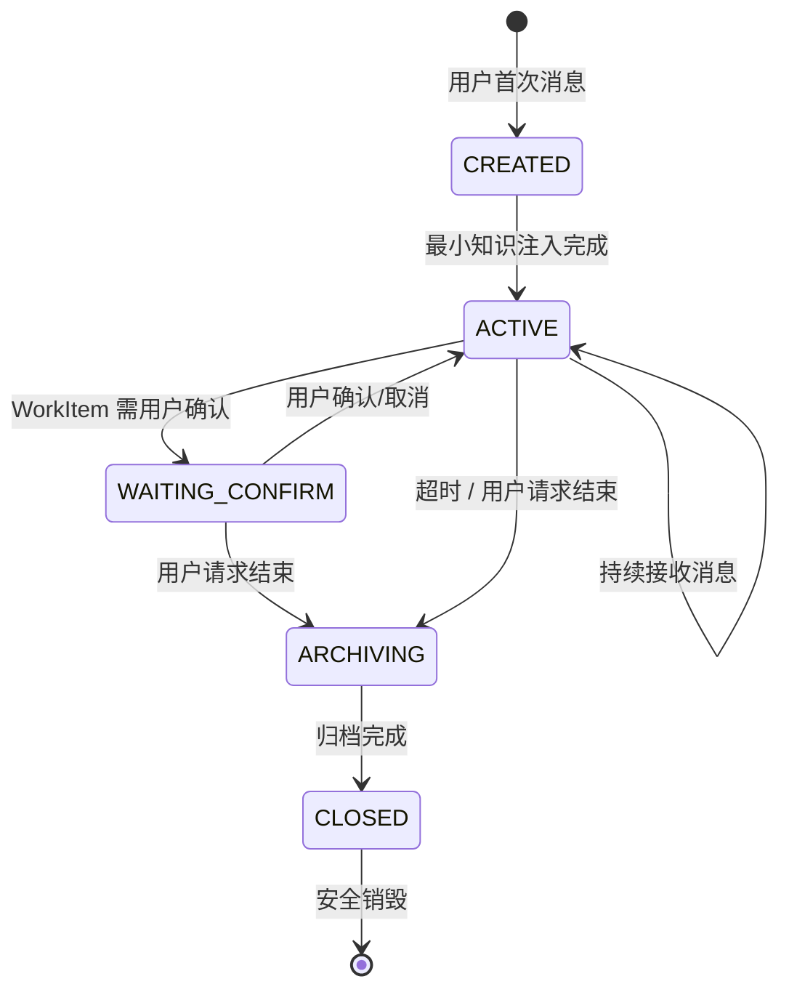
```mermaid
stateDiagram-v2
    [*] --> CREATED : 用户首次消息
    CREATED --> ACTIVE : 最小知识注入完成
    ACTIVE --> ACTIVE : 持续接收消息
    ACTIVE --> WAITING_CONFIRM : WorkItem 需用户确认
    WAITING_CONFIRM --> ACTIVE : 用户确认/取消
    WAITING_CONFIRM --> ARCHIVING : 用户请求结束
    ACTIVE --> ARCHIVING : 超时 / 用户请求结束
    ARCHIVING --> CLOSED : 归档完成
    CLOSED --> [*] : 安全销毁
```

**状态说明**:

| 状态 | 说明 |
|------|------|
| `CREATED` | 会话创建，待完成最小上下文注入 |
| `ACTIVE` | 正常工作状态，可接收和回复消息 |
| `WAITING_CONFIRM` | 等待用户确认（如确认录入的数据） |
| `ARCHIVING` | 会话归档中（更新长期记忆、归档通信记录、执行 SOP-010） |
| `CLOSED` | 终态——会话已关闭，等待安全销毁 |

### 7.2 WorkItem 生命周期

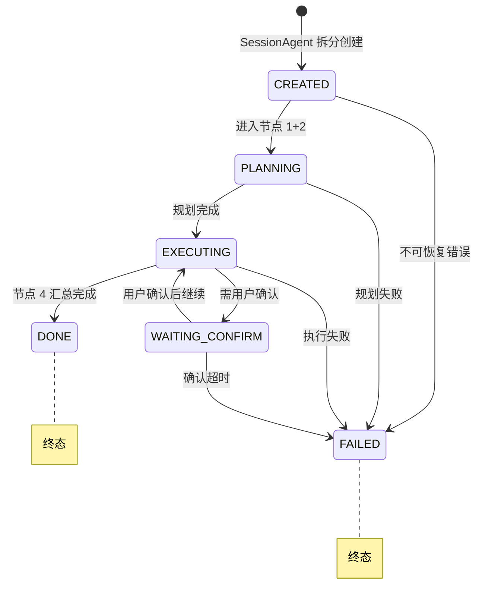
```mermaid
stateDiagram-v2
    [*] --> CREATED : SessionAgent 拆分创建
    CREATED --> PLANNING : 进入节点 1+2
    PLANNING --> EXECUTING : 规划完成
    EXECUTING --> DONE : 节点 4 汇总完成
    EXECUTING --> WAITING_CONFIRM : 需用户确认
    WAITING_CONFIRM --> EXECUTING : 用户确认后继续
    CREATED --> FAILED : 不可恢复错误
    PLANNING --> FAILED : 规划失败
    EXECUTING --> FAILED : 执行失败
    WAITING_CONFIRM --> FAILED : 确认超时

    note right of DONE : 终态
    note right of FAILED : 终态
```

**有效转移矩阵**:

| 从 ↓ / 到 → | CREATED | PLANNING | EXECUTING | WAITING_CONFIRM | DONE | FAILED |
|-------------|---------|----------|-----------|-----------------|------|--------|
| CREATED | — | ✓ | — | — | — | ✓ |
| PLANNING | — | — | ✓ | — | — | ✓ |
| EXECUTING | — | — | — | ✓ | ✓ | ✓ |
| WAITING_CONFIRM | — | — | ✓ | — | — | ✓ |
| DONE | — | — | — | — | — | — |
| FAILED | — | — | — | — | — | — |

### 7.3 SOP Checkpoint 生命周期

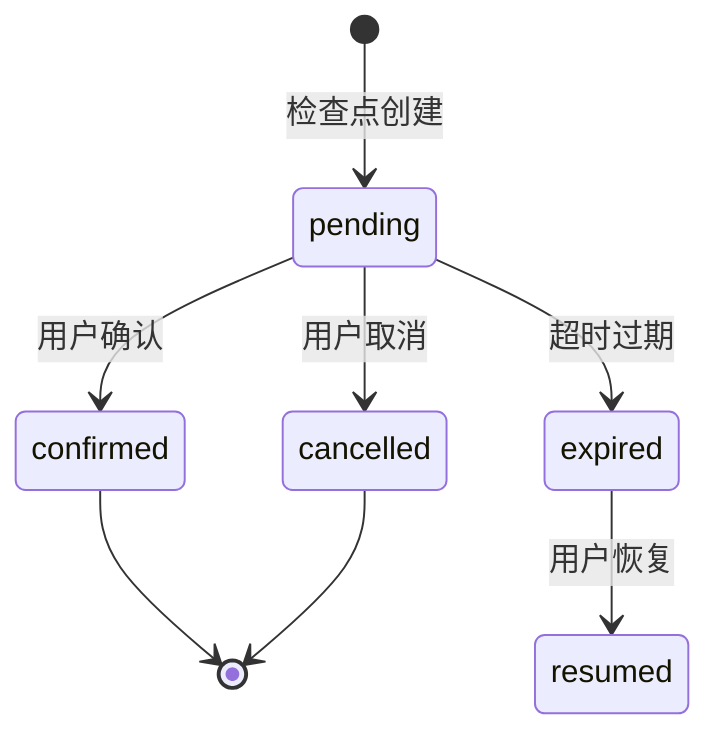
```mermaid
stateDiagram-v2
    [*] --> pending : 检查点创建
    pending --> confirmed : 用户确认
    pending --> cancelled : 用户取消
    pending --> expired : 超时过期
    expired --> resumed : 用户恢复
    confirmed --> [*]
    cancelled --> [*]
```

---

## 八、Hook 系统

### 8.1 Hook 架构

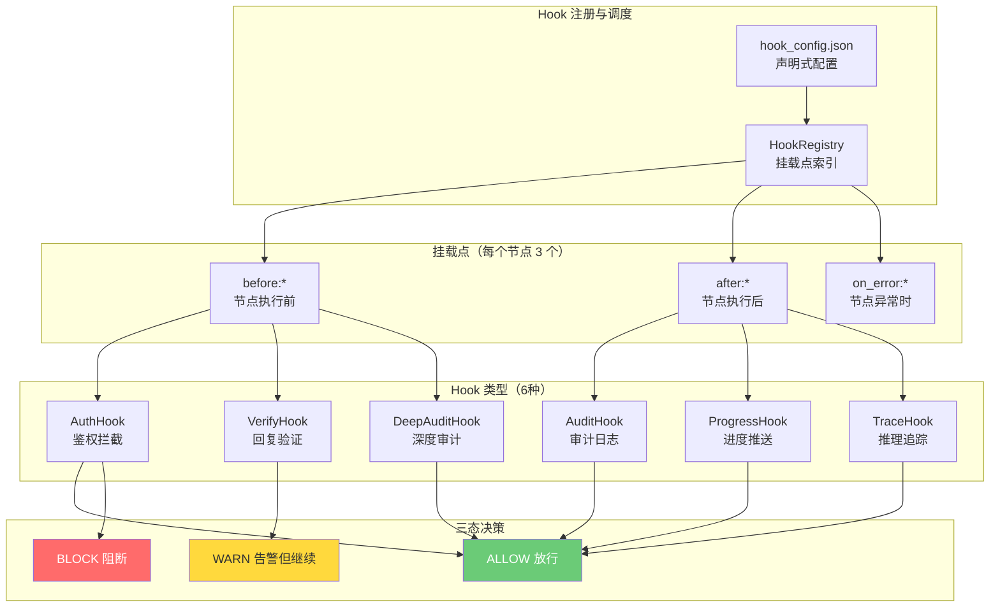
```mermaid
graph TB
    subgraph "Hook 注册与调度"
        HR[HookRegistry<br/>挂载点索引]
        HC[hook_config.json<br/>声明式配置]
    end

    subgraph "Hook 类型（6种）"
        AUTH[AuthHook<br/>鉴权拦截]
        AUDIT[AuditHook<br/>审计日志]
        VERIFY[VerifyHook<br/>回复验证]
        TRACE[TraceHook<br/>推理追踪]
        PROG[ProgressHook<br/>进度推送]
        DEEP[DeepAuditHook<br/>深度审计]
    end

    subgraph "挂载点（每个节点 3 个）"
        BEFORE[before:*<br/>节点执行前]
        AFTER[after:*<br/>节点执行后]
        ERROR[on_error:*<br/>节点异常时]
    end

    subgraph "三态决策"
        ALLOW[ALLOW 放行]
        WARN[WARN 告警但继续]
        BLOCK[BLOCK 阻断]
    end

    HC --> HR
    HR --> BEFORE
    HR --> AFTER
    HR --> ERROR

    BEFORE --> AUTH
    AFTER --> AUDIT
    AFTER --> PROG
    AFTER --> TRACE
    BEFORE --> VERIFY
    BEFORE --> DEEP

    AUTH --> ALLOW
    AUTH --> BLOCK
    AUDIT --> ALLOW
    VERIFY --> WARN
    TRACE --> ALLOW
    PROG --> ALLOW
    DEEP --> ALLOW

    style BLOCK fill:#ff6b6b,color:#fff
    style WARN fill:#ffd93d
    style ALLOW fill:#6bcb77,color:#fff
```

### 8.2 Hook 配置清单

| 挂载点 | Hook | 类型 | 启用 | 说明 |
|--------|------|------|------|------|
| `before:wi_node1` | auth.sop_access | auth | ✅ | SOP 访问权限校验 |
| `after:wi_node1` | audit.intent_result | audit | ✅ | 意图识别结果审计 |
| `after:wi_node1` | progress.processing | progress | ✅ | 进度推送 |
| `on_error:wi_node1` | audit.intent_failed | audit | ✅ | 意图识别失败审计 |
| `before:wi_node2` | auth.resource_check | auth | ✅ | 资源访问权限（读表） |
| `after:wi_node2` | audit.plan_created | audit | ✅ | 规划创建审计 |
| `on_error:wi_node2` | audit.plan_failed | audit | ✅ | 规划失败审计 |
| `before:wi_node3` | trace.execution_start | trace | ✅ | 推理开始追踪 |
| `after:wi_node3` | audit.sop_completed | audit | ✅ | SOP 完成审计 |
| `after:wi_node3` | trace.execution_end | trace | ✅ | 推理结束追踪 |
| `on_error:wi_node3` | audit.execution_error | audit | ✅ | 执行错误审计 |
| `before:wi_node4` | guardian.deep_audit | deep_audit | ❌ | 深度审计（默认关闭） |
| `before:wi_node4` | guardian.reply_review | verify | ✅ | 回复验证 |
| `after:wi_node4` | audit.result_final | audit | ✅ | 最终结果审计 |
| `on_error:wi_node4` | audit.summary_failed | audit | ✅ | 汇总失败审计 |

### 8.3 Hook 执行规则

1. **优先级排序**: 同一挂载点的 Hook 按 `priority` 升序执行
2. **阻断优先**: 任一 Hook 返回 BLOCK → 立即停止，不再执行后续 Hook
3. **异常容忍**: 单个 Hook 异常不影响其他 Hook 执行
4. **审计全量**: 每次 Hook 执行写入 `hook_execution_logs` 表（含 decision、duration_ms）

---

## 九、SOP 知识体系

### 9.1 SOP 目录

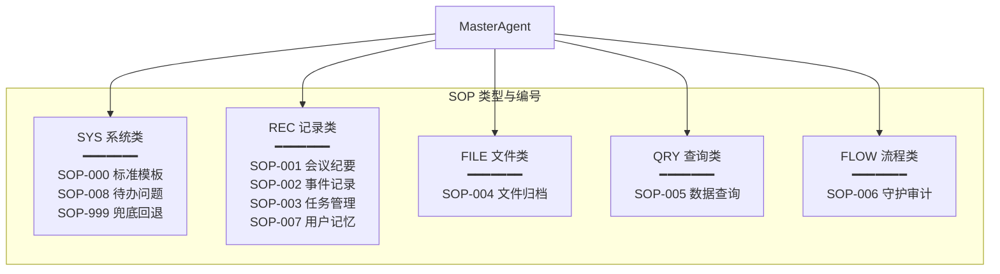
```mermaid
graph TB
    subgraph "SOP 类型与编号"
        SYS[SYS 系统类<br/>━━━━━━━<br/>SOP-000 标准模板<br/>SOP-008 待办问题<br/>SOP-999 兜底回退]
        REC[REC 记录类<br/>━━━━━━━<br/>SOP-001 会议纪要<br/>SOP-002 事件记录<br/>SOP-003 任务管理<br/>SOP-007 用户记忆]
        FILE[FILE 文件类<br/>━━━━━━━<br/>SOP-004 文件归档]
        QRY[QRY 查询类<br/>━━━━━━━<br/>SOP-005 数据查询]
        FLOW[FLOW 流程类<br/>━━━━━━━<br/>SOP-006 守护审计]
    end

    MA[MasterAgent] --> SYS
    MA --> REC
    MA --> FILE
    MA --> QRY
    MA --> FLOW
```

### 9.2 SOP 文档标准结构

每份 SOP 遵循 7+2 固定模板：

| 章节 | 内容 |
|------|------|
| **元数据头** | 适用对象、允许角色、业务目的、文档风格 |
| **第 1 章** | 业务流版本信息（编号、版本、权限控制、编辑历史） |
| **第 2 章** | 意图识别标准（触发关键词、拒绝条件、正/负例对话） |
| **第 3 章** | 业务流描述（目标表、工具/API、处理流程 ASCII 图） |
| **第 4 章** | 输出要求（字段分级 RED/YELLOW/GREEN、格式要求、回执模板） |
| **第 5 章** | 异常处理原则（缺信息、数据质量、系统异常） |
| **第 6 章** | 建议补充项（可选，标注"当前未完全实现"） |
| **第 7 章** | 变更日志（版本、日期、编辑者、变更内容） |
| **附录 A** | 业务类型缩写对照表 |
| **附录 B** | 空白 SOP 模板 + Agent 通用操作约束 |

### 9.3 SOP 详细清单

| 编号 | 名称 | 类型 | 版本 | 角色 | 目标表 | 核心工具 |
|------|------|------|------|------|--------|----------|
| SOP-000 | 标准模板 | SYS | v1.4 | admin | — | — |
| SOP-001 | 会议纪要 | REC | v1.2 | all | meetings | record_meeting, record_event, record_task |
| SOP-002 | 事件记录 | REC | — | all | events | record_event |
| SOP-003 | 任务管理 | REC | v1.0 | all | tasks | record_task, query_data |
| SOP-004 | 文件归档 | FILE | — | all | files | record_file |
| SOP-005 | 数据查询 | QRY | — | all | 全部 | query_data |
| SOP-006 | 守护审计 | FLOW | — | admin | — | query_data, write_notebook |
| SOP-007 | 用户记忆 | REC | v1.0 | all | memory 文件 | write_user_memory |
| SOP-008 | 待办问题 | SYS | — | all | pending_issues | query/resolve |
| SOP-999 | 兜底回退 | SYS | v1.0 | all | — | 全部原子工具 |

### 9.4 SOP 发现路由机制

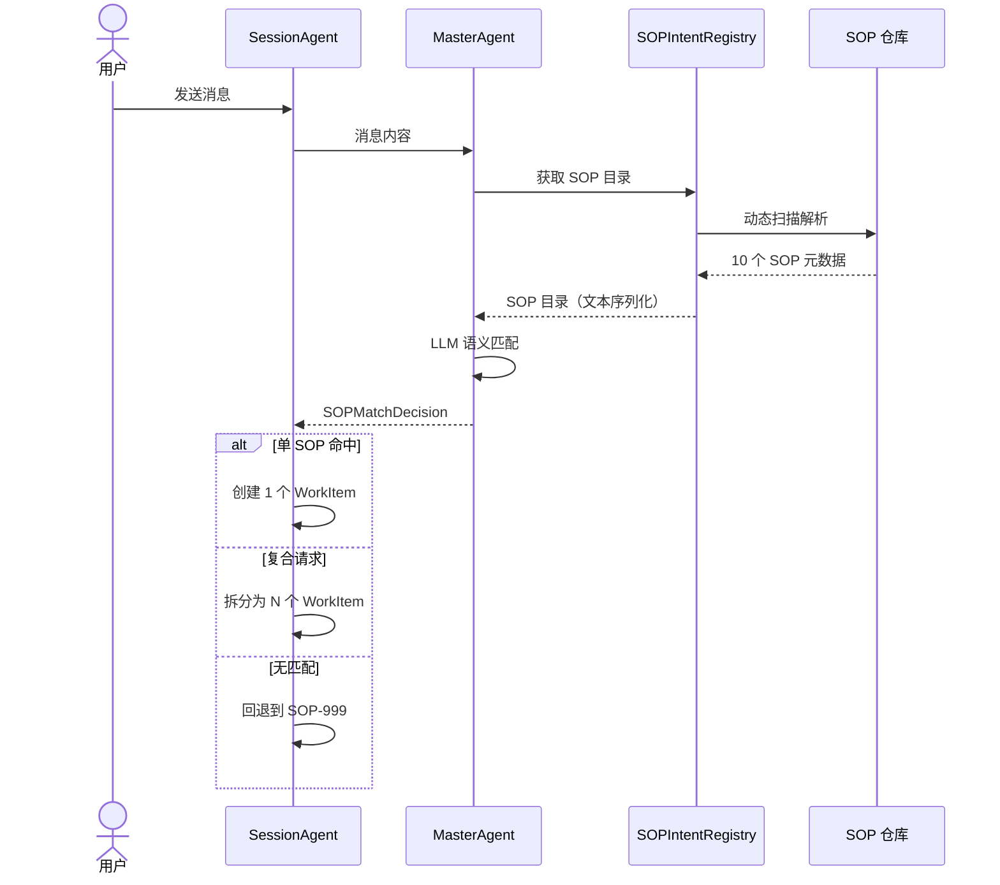
```mermaid
sequenceDiagram
    actor User as 用户
    participant SA as SessionAgent
    participant MA as MasterAgent
    participant IR as SOPIntentRegistry
    participant SOP as SOP 仓库

    User->>SA: 发送消息
    SA->>MA: 消息内容
    MA->>IR: 获取 SOP 目录
    IR->>SOP: 动态扫描解析
    SOP-->>IR: 10 个 SOP 元数据
    IR-->>MA: SOP 目录（文本序列化）
    MA->>MA: LLM 语义匹配
    MA-->>SA: SOPMatchDecision

    alt 单 SOP 命中
        SA->>SA: 创建 1 个 WorkItem
    else 复合请求
        SA->>SA: 拆分为 N 个 WorkItem
    else 无匹配
        SA->>SA: 回退到 SOP-999
    end
```

---

## 十、配置管理

### 10.1 配置结构

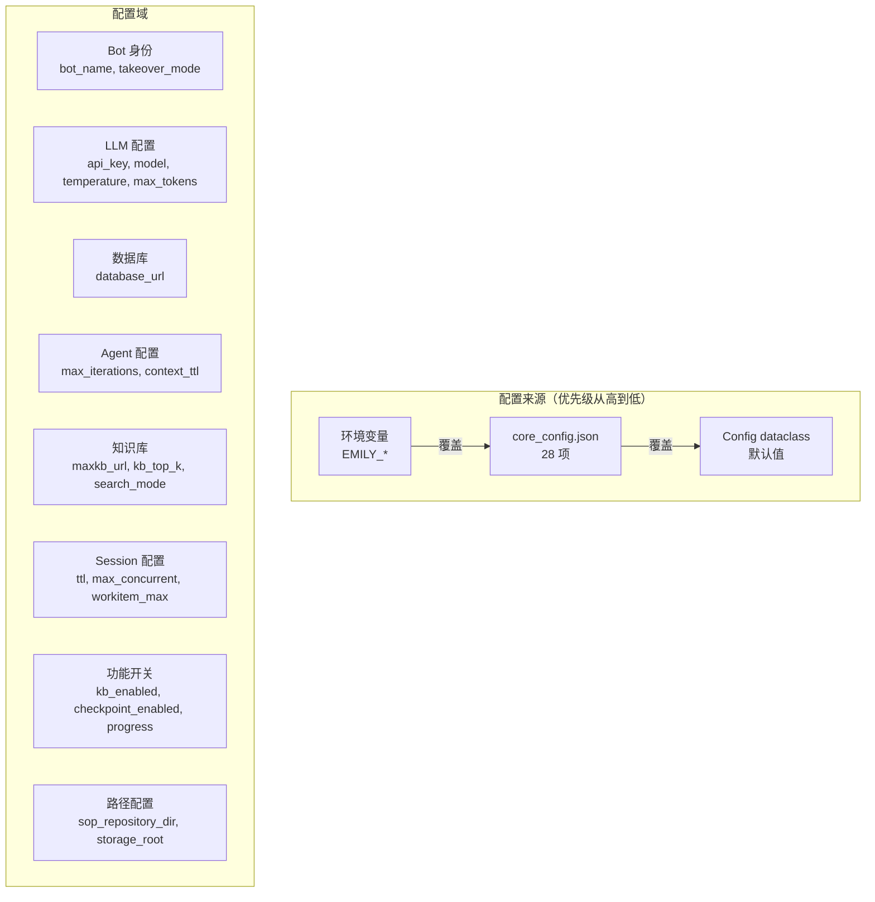
```mermaid
graph TB
    subgraph "配置来源（优先级从高到低）"
        ENV[环境变量<br/>EMILY_*]
        JSON[core_config.json<br/>28 项]
        CODE[Config dataclass<br/>默认值]
    end

    ENV -->|覆盖| JSON
    JSON -->|覆盖| CODE

    subgraph "配置域"
        BOT[Bot 身份<br/>bot_name, takeover_mode]
        LLM[LLM 配置<br/>api_key, model, temperature, max_tokens]
        DB[数据库<br/>database_url]
        AGENT[Agent 配置<br/>max_iterations, context_ttl]
        KB[知识库<br/>maxkb_url, kb_top_k, search_mode]
        SESSION[Session 配置<br/>ttl, max_concurrent, workitem_max]
        FEATURE[功能开关<br/>kb_enabled, checkpoint_enabled, progress]
        PATH[路径配置<br/>sop_repository_dir, storage_root]
    end
```

### 10.2 核心配置项

| 分类 | 配置项 | 类型 | 默认值 | 说明 |
|------|--------|------|--------|------|
| Bot | `bot_name` | str | "Emy" | 机器人名称（@提及用） |
| Bot | `takeover_mode` | str | "collaborate" | observe/collaborate/managed |
| Bot | `pipeline_mode` | str | "session" | 消息管道模式 |
| LLM | `llm_api_key` | str | "" | API Key（空=Mock 模式） |
| LLM | `llm_base_url` | str | "https://api.deepseek.com" | API 地址 |
| LLM | `llm_model` | str | "deepseek-chat" | 模型名称 |
| LLM | `llm_temperature` | float | 0.1 | 采样温度 |
| LLM | `llm_max_tokens` | int | 1024 | 最大输出 Token |
| Agent | `agent_max_iterations` | int | 10 | ReAct 最大迭代 |
| Agent | `agent_context_max_turns` | int | 10 | 最大保留对话轮次 |
| Agent | `agent_context_ttl_seconds` | int | 600 | 上下文 TTL |
| Session | `session_ttl_seconds` | int | 600 | 会话 TTL |
| Session | `session_max_concurrent` | int | 100 | 最大并发会话 |
| Session | `workitem_max_per_session` | int | 5 | 每会话最大 WorkItem |
| KB | `kb_enabled` | bool | False | 知识库开关 |
| KB | `kb_top_k` | int | 5 | 返回结果数 |
| KB | `maxkb_search_mode` | str | "embedding" | embedding/keywords/blend |
| KB | `maxkb_similarity_threshold` | float | 0.3 | 相似度阈值 |
| Feature | `enable_progress_message` | bool | True | 进度消息开关 |
| Feature | `checkpoint_enabled` | bool | True | 检查点开关 |
| Feature | `checkpoint_ttl_seconds` | int | 300 | 检查点 TTL |
| Feature | `guardian_reply_enabled` | bool | True | 回复验证开关 |
| Feature | `guardian_record_enabled` | bool | True | 记录验证开关 |
| Feature | `chat_archive_enabled` | bool | True | 聊天归档开关 |
| Feature | `agent_trace_enabled` | bool | True | Agent 追踪开关 |

### 10.3 环境变量桥接

以下环境变量会在 `bootstrap.init()` 中自动覆盖 JSON 配置：

```bash
EMILY_DATABASE_URL    → database_url
EMILY_LLM_API_KEY     → llm_api_key
EMILY_LLM_BASE_URL    → llm_base_url
EMILY_LLM_MODEL       → llm_model
EMILY_STORAGE_ROOT    → storage_root
EMILY_HOOK_CONFIG_PATH → hook_config_path
EMILY_SOP_REPOSITORY_DIR → sop_repository_dir
EMILY_API_TOKEN       → API 鉴权密钥（auth middleware）
```

---

## 十一、开发进度总览

### 11.1 模块完成度矩阵

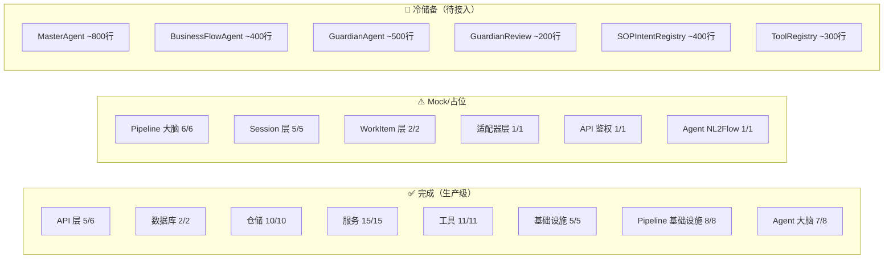
```mermaid
graph LR
    subgraph "✅ 完成（生产级）"
        A1[API 层 5/6]
        A2[数据库 2/2]
        A3[仓储 10/10]
        A4[服务 15/15]
        A5[工具 11/11]
        A6[基础设施 5/5]
        A7[Pipeline 基础设施 8/8]
        A8[Agent 大脑 7/8]
    end

    subgraph "⚠️ Mock/占位"
        B1[Pipeline 大脑 6/6]
        B2[Session 层 5/5]
        B3[WorkItem 层 2/2]
        B4[适配器层 1/1]
        B5[API 鉴权 1/1]
        B6[Agent NL2Flow 1/1]
    end

    subgraph "🔵 冷储备（待接入）"
        C1[MasterAgent ~800行]
        C2[BusinessFlowAgent ~400行]
        C3[GuardianAgent ~500行]
        C4[GuardianReview ~200行]
        C5[SOPIntentRegistry ~400行]
        C6[ToolRegistry ~300行]
    end
```

### 11.2 分阶段进度

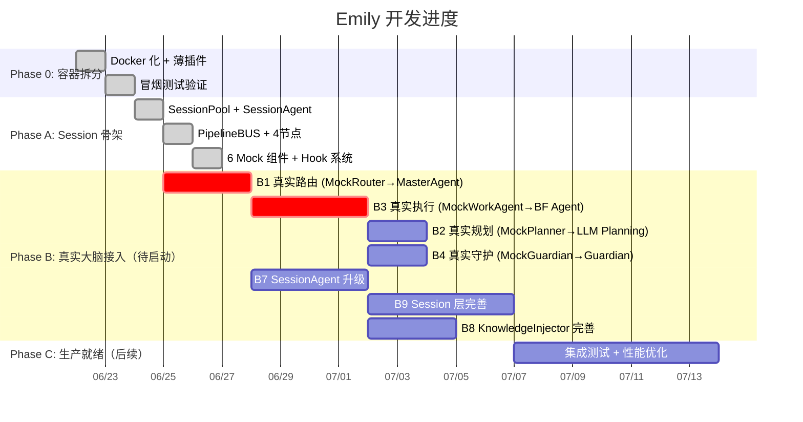
```mermaid
gantt
    title Emily 开发进度
    dateFormat  YYYY-MM-DD
    axisFormat  %m/%d

    section Phase 0: 容器拆分
    Docker 化 + 薄插件           :done, p0a, 2026-06-22, 1d
    冒烟测试验证                  :done, p0b, after p0a, 1d

    section Phase A: Session 骨架
    SessionPool + SessionAgent   :done, pa1, after p0b, 1d
    PipelineBUS + 4节点          :done, pa2, after pa1, 1d
    6 Mock 组件 + Hook 系统      :done, pa3, after pa2, 1d

    section Phase B: 真实大脑接入（待启动）
    B1 真实路由 (MockRouter→MasterAgent)    :crit, pb1, 2026-06-25, 3d
    B3 真实执行 (MockWorkAgent→BF Agent)    :crit, pb3, after pb1, 4d
    B2 真实规划 (MockPlanner→LLM Planning)  :pb2, after pb3, 2d
    B4 真实守护 (MockGuardian→Guardian)     :pb4, after pb3, 2d
    B7 SessionAgent 升级                    :pb7, after pb1, 4d
    B9 Session 层完善                       :pb9, after pb7, 5d
    B8 KnowledgeInjector 完善               :pb8, after pb3, 3d

    section Phase C: 生产就绪（后续）
    集成测试 + 性能优化           :pc1, 2026-07-07, 7d
```

### 11.3 Mock → 真实 替换路线图

| 优先级 | Mock 组件 | 替换目标 | 阻塞项 | 预估 |
|--------|-----------|----------|--------|------|
| 🔴 P0 | MockRouter | MasterAgent + SOPIntentRegistry | 无 | 2-3 天 |
| 🔴 P0 | MockWorkAgent | BusinessFlowAgent + M14 工具 | B1 | 3-4 天 |
| 🟡 P1 | MockPlanner | LLM 动态规划 | B1 | 2 天 |
| 🟡 P1 | MockGuardian | GuardianAgent + GuardianReview | B3 | 2 天 |
| 🟢 P2 | MockAuthEngine | 角色权限系统 | 用户权限数据 | 1-2 天 |
| 🔵 P3 | MockRiskGrader | 规则/LLM 风险评估 | 无 | 1 天 |

---

## 十二、环境与部署

### 12.1 Docker Compose 服务拓扑

```mermaid
graph TB
    subgraph "emily_network (bridge)"
        NC[napcat<br/>QQ 协议桥接<br/>:6098-6099]
        AB[astrbot<br/>插件宿主<br/>:6185, :6199]
        EC[emily-core<br/>业务核心<br/>:18080]
        MK[maxkb<br/>知识库<br/>:8080]
        PG[emily-postgres<br/>业务数据库<br/>:25432→5432]
    end

    NC -->|"depends_on (无)"| AB
    AB -->|depends_on| NC
    EC -->|depends_on| PG
    EC -->|depends_on| MK
    PG -->|独立启动| EC

    AB -->|HTTP POST| EC
    EC -->|SSE| AB
    EC -->|SQL| PG
    EC -->|hit_test API| MK
```

### 12.2 服务详情

| 服务 | 镜像 | 端口 | 挂载卷 | 说明 |
|------|------|------|--------|------|
| **napcat** | `mlikiowa/napcat-docker` | 6098-6099 | — | QQ 协议桥接 |
| **astrbot** | `soulter/astrbot` | 6185, 6199 | `./data:/AstrBot/data` | 加载 emily_agent 插件 |
| **emily-core** | `./emily-core/Dockerfile` | 127.0.0.1:18080 | sops/prompts/config (ro), notebooks/logs/attachments/memory (rw) | 业务核心（代码 ro 挂载，支持热重载） |
| **maxkb** | `1panel/maxkb` | 8080 | Qwen3-Embedding 模型 (ro), baseknowledge (ro) | 向量知识库 |
| **emily-postgres** | `postgres:16-alpine` | 127.0.0.1:25432→5432 | `pgdata/emily:/var/lib/postgresql/data` | 业务数据库 |

### 12.3 初始化流程

```mermaid
sequenceDiagram
    participant DC as Docker Compose
    participant PG as emily-postgres
    participant MK as maxkb
    participant EC as emily-core
    participant AB as astrbot
    participant NC as napcat

    DC->>PG: 启动 PostgreSQL
    DC->>MK: 启动 MaxKB
    DC->>NC: 启动 NapCat
    PG-->>DC: healthy
    MK-->>DC: healthy
    DC->>EC: 启动 emily-core
    EC->>EC: 读 core_config.json
    EC->>EC: 合并环境变量
    EC->>PG: 连接 + 自动建表
    EC->>EC: 创建 EmilyCore 实例
    EC->>EC: 懒加载 LLM Client
    EC->>EC: 构建 PipelineBUS + Hooks
    EC->>EC: 构建 SessionPool
    EC-->>DC: :18080 就绪
    DC->>AB: 启动 AstrBot
    AB->>AB: 加载 emily_agent 插件
    AB->>NC: WS 连接
    AB-->>DC: 就绪
```

---

## 十三、附录

### 13.1 代码约定

- **语言**: Python 3.12+
- **类型注解**: 全面使用 type hints
- **异步**: async/await 全链路
- **数据类**: 优先使用 `@dataclass` 定义协议对象
- **ABC**: 抽象接口使用 `ABC` + `@abstractmethod`
- **日志**: 统一使用 `logging.getLogger("emily")`
- **时间**: 全链路北京时间（UTC+8），ISO-8601 字符串格式
- **ID**: UUID 字符串作为主键，业务编号使用前缀+日期+序号

### 13.2 命名约定

| 对象 | 约定 | 示例 |
|------|------|------|
| 模块文件 | snake_case | `session_agent.py` |
| 类名 | PascalCase | `SessionAgent` |
| 方法/函数 | snake_case | `handle_message()` |
| 私有方法 | `_` 前缀 | `_split_into_workitems()` |
| 常量 | UPPER_SNAKE | `HOOK_TYPE_MAP` |
| 配置键 | snake_case | `session_ttl_seconds` |
| 表名 | snake_case 复数 | `agent_reasoning_logs` |
| 业务编号 | PREFIX-YYYYMMDD-NNN | `EVT-20260624-001` |

### 13.3 关键文件索引

| 用途 | 文件路径 |
|------|----------|
| 应用入口 | `emily-core/api/server.py` |
| 核心编排 | `emily-core/emily_core/__init__.py` |
| 启动引导 | `emily-core/emily_core/bootstrap.py` |
| 配置定义 | `emily-core/emily_core/config.py` |
| 数据库模型 | `emily-core/emily_core/infrastructure/database/models.py` |
| Pipeline 接口 | `emily-core/emily_core/workitem/pipeline/interfaces/` |
| Mock 实现 | `emily-core/emily_core/workitem/pipeline/mocks/` |
| Hook 配置 | `emily-data/config/hook_config.json` |
| 核心配置 | `emily-data/config/core_config.json` |
| SOP 目录 | `emily-data/sops/` |
| Prompt 模板 | `emily-data/prompts/` |
| Docker 编排 | `docker-compose-napcat.yml` |
| 冒烟测试 | `scripts/smoke_test.py` |
| 架构蓝图 | `tem/0623Emily_主系统架构.md` |

### 13.4 团队协作指引

- **PR 提交**: 针对 `main` 分支创建 feature 分支，完成后 PR 合并
- **架构变更**: 需在 `看板内容/Releases.md` 中记录 ADR
- **Mock 替换**: 每个 Mock 替换为独立的 PR，替换后运行 `smoke_test.py` 验证
- **SOP 变更**: 修改 `emily-data/sops/` 文件后需更新版本号 + 变更日志
- **配置变更**: 修改 `core_config.json` 后同步更新 `.env.example` 和 `config.py` 默认值
- **数据库变更**: 修改 `models.py` 需要提供迁移脚本或确保 `create_all` 兼容

---

*报告结束 — 生成于 2026-06-24*
