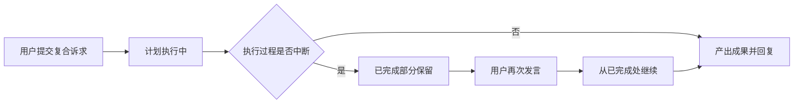
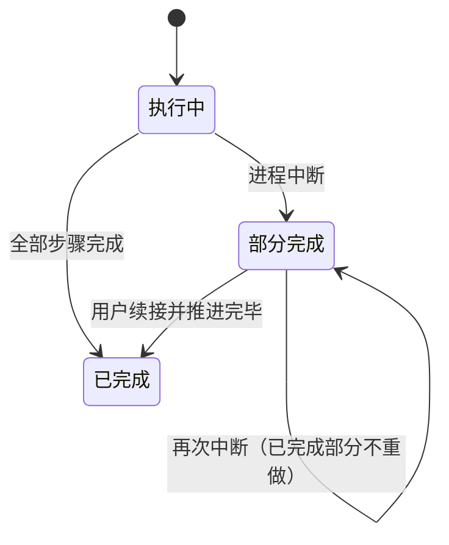

# LangGraph 内核能力补全 — PRD（规格 / Spec）

> **日期**：2026-09-15
> **来源**：[LangGraph内核能力补全_需求基线_V1.md](LangGraph内核能力补全_需求基线_V1.md)、[LangGraph内核能力补全_PRD_V1.md](LangGraph内核能力补全_PRD_V1.md)（V1 被本版取代）
> **参与角色**：需求分析师（固定）、Emily 深资架构师（固定）、技术总监（固定）、资深测试工程师
> **宪法版本**：v1.1
> **阶段**：Specify（规格）——方案型技术设计见后续 `LangGraph内核能力补全_计划_V*.md`
> **本版决策**：原开放问题 Q1、Q2 已由项目所有者裁决关闭（Q1 合并为一次内核形态调整；Q2 随本需求一并解决），US-01/US-03/US-04 的范围、验收与测试用例随之修订。

---

## 一、背景与目标

### 1.1 背景

编排内核已迁移到 LangGraph StateGraph，图形态的选择是对的，但原基线 D6「框架约束用满」未被完全满足：缺口全部落在执行引擎的**耐久性**与**复用性**上——计划执行不随主图落检查点、失败重试由节点自行手写、会话与工单两条主循环各写一份对话循环、内核上下文经自研通道传递而不被检查点识别。本规格把这四项缺口登记为可验收事项，与业务功能开发解耦。

技术总监（I 维度）追问结论：

| 追问 | 结论 |
|---|---|
| 真实问题还是想象问题？ | 真实。计划执行中断后不可恢复、重试不可观测，已有复盘证据 |
| 有无更简单办法？ | 不新建顶层概念，只在既有内核形态内补全；上下文机制按官方能力切换，不引入新依赖 |
| 命名与能力匹配？ | "能力补全"指内核机制补全，不含业务能力扩展，故名 |
| 受众正确？ | 受众是内核维护者与后续接入方，用户不可感知——这也决定了本项以「对外行为不变」为硬约束 |
| 下游是谁？ | 见 §4.5，无消费者不进编码 |

### 1.2 目标与成功指标

| 目标 | 成功指标（可度量） |
|---|---|
| 计划执行与主图同生命周期 | 计划执行中途重启后，已完成的步骤不重复执行；用户续接可获得真实成果 |
| 失败重试与超时由引擎承担 | 重试次数与退避可在检查点与日志观测；节点内无自持重试循环 |
| 两条主循环共享同一对话循环 | 循环实现被两处消费；两侧差异清单条数为 0 |
| 内核上下文机制切换到位 | 自研通道被替换（非并存）；跨进程续接全路径可用 |
| 内核形态一次调整到位 | US-01 与 US-03 在同一次改造中完成，不产生二次形态调整 |
| 对外行为零变化 | 既有回归语料全通过，用户可感知语义不变 |

### 1.3 非目标（明确不做）

- 不重写业务能力本体（工具实现、SOP 内容、检索管线、全景节点状态机）。
- 不改变权限模型、审计与归档口径。
- 不引入 LangGraph Platform 或任何云端托管依赖。
- **不引入框架侧长期记忆存储**：用户/项目长期记忆沿用现有业务记忆体系。
- **不做业务拓扑图化**：不得按业务切节点、不得把业务分支写入图的拓扑。
- 流式 token 级输出不在本次范围（观察项，取决于产品是否需要逐字呈现）。

---

## 二、需求登记表（核心章节）

### 2.1 用户故事与验收标准

**US-01**｜角色：内核维护者 / 使用计划的用户｜场景：一条被拆为多层依赖的执行计划在推进过程中进程中断｜期望：已完成部分不重做、不丢失，续接后得到真实成果｜优先级：P0｜批次：B1

| AC-ID | 验收标准（可判定） | 验证方式 |
|-------|------------------|---------|
| AC-US-01.1 | 计划执行中的状态参与主图检查点，可从检查点恢复 | 中断重启后核对：已完成步骤不再执行（业务记录计数不变） |
| AC-US-01.2 | 续接后用户收到反映真实执行结果的回复（非空转、非重复副作用） | 对话回复文本 + 业务记录核对（`counterpart: AC-US-01.1`） |
| AC-US-01.3 | 计划步骤的执行进度可见，粒度细于「计划整体执行中」 | 进度事件序列中出现与步骤对应的多条进度 |
| AC-US-01.4 | 计划为空、计划校验不通过、单步失败三类场景行为与现状一致 | 回归语料 + 级联跳过场景核对 |
| AC-US-01.5 | 无计划诉求的请求不因本项产生额外节点跳转或额外时延 | 与改造前的时延与节点迁移序列对照 |

**US-02**｜角色：内核维护者｜场景：模型调用连续失败或单节点执行超时｜期望：重试与超时由引擎按声明策略执行且可观测｜优先级：P0｜批次：B2

| AC-ID | 验收标准（可判定） | 验证方式 |
|-------|------------------|---------|
| AC-US-02.1 | 重试与超时以节点级策略声明，节点内不再自持重试循环 | 静态可达性（策略声明处 ↔ 使用处）+ 代码审阅 |
| AC-US-02.2 | 模型连续失败时，重试由引擎执行，重试次数与退避可观测 | 故障注入后读检查点记录与日志（`counterpart: AC-US-02.1`） |
| AC-US-02.3 | 达到重试上限后的用户可见回复与现状一致 | 回归语料对照回复文本 |
| AC-US-02.4 | 单节点超时后用户仍收到可读回复，不出现无响应 | 故障注入（对应原基线验收项 A3） |
| AC-US-02.5 | 正常路径不因本项引入额外重试开销 | 正常请求的调用次数与时延不劣化 |

**US-03**｜角色：内核维护者｜场景：会话主循环与工单主循环各维护一份同构的对话循环｜期望：单份实现被两处复用，差异以注入点表达｜优先级：P1｜批次：B1（与 US-01 合并为一次形态调整）

| AC-ID | 验收标准（可判定） | 验证方式 |
|-------|------------------|---------|
| AC-US-03.1 | 对话循环以单份实现承载，两条主循环均消费之 | 静态可达性扫描：实现处 ↔ 消费者 ≥ 2 |
| AC-US-03.2 | 两侧差异（工具集、控制手段、上限、收尾）均由注入点声明，循环本体内无按侧分支 | 差异清单 + 代码审阅（`counterpart: AC-US-03.3`） |
| AC-US-03.3 | 会话侧与工单侧既有行为回归全通过 | 回归语料 11/12 号用例文件 + 会话图回放脚本 |
| AC-US-03.4 | 改造不改变两侧对外可感知行为（回复语义、成果结构化） | 回归语料对照 + 归档产物核对 |
| AC-US-03.5 | 与 US-01 在同一次改造中完成，不遗留二次形态调整 | 改造批次记录 + 改动面清单核对（`counterpart: AC-US-01.1`） |

**US-04**｜角色：内核维护者｜场景：内核上下文经自研通道传递，不被检查点识别，官方观测无法接入｜期望：切换为框架官方机制并落地，跨进程行为不回归｜优先级：P2｜批次：B3

| AC-ID | 验收标准（可判定） | 验证方式 |
|-------|------------------|---------|
| AC-US-04.1 | 内核上下文改由框架官方机制承载，自研通道被替换而非并存 | 静态扫描：自研通道读取点清零，或仅剩显式标注的兼容点 |
| AC-US-04.2 | 跨进程续接全路径不回归（挂起 → 重启 → 续接可用） | 跨进程两阶段验收（对应原基线 A1） |
| AC-US-04.3 | 上下文入口成为图配置的一部分，可被检查点识别与观测读取 | 检查点记录与观测输出中可见上下文入口标识 |
| AC-US-04.4 | 长期记忆存储不引入框架侧实现，业务记忆体系行为不变 | 静态扫描 + 业务记忆功能回归（`counterpart: AC-US-04.1`） |
| AC-US-04.5 | 本项切换不改变任何业务的对话语义与权限裁剪结果 | 回归语料全通过 |

### 2.2 US 清单（下游追溯锚点）

| US-ID | 一句话 | 优先级 | 批次 | 状态 |
|-------|--------|--------|------|------|
| US-01 | 计划执行纳入主图生命周期，可恢复、不重复副作用 | P0 | B1 | 生效 |
| US-02 | 重试与超时由节点级策略承担且可观测 | P0 | B2 | 生效 |
| US-03 | 会话与工单共享同一对话循环实现 | P1 | B1 | 生效 |
| US-04 | 内核上下文切换为框架官方机制并落地 | P2 | B3 | 生效 |

### 2.3 实施批次与回退颗粒度（本版新增）

> 依据项目所有者裁决（原开放问题 Q1）：US-01 与 US-03 合并为**一次**内核形态调整。批次决定验收方式与回退颗粒度，属规格级决策；具体排布与顺序由计划阶段定。

| 批次 | 包含 US | 说明 | 回退颗粒度 | 验收方式 |
|------|--------|------|-----------|---------|
| B1 | US-01 + US-03 | 同一次内核形态调整、同一次全量回归 | **整组回退**（不得拆为两次形态调整） | 合并组全量回归 + 分项判定留证 |
| B2 | US-02 | 节点级策略，独立 | 单项回退 | 独立验收 |
| B3 | US-04 | 上下文机制切换，独立 | 单项回退 | 独立验收 |

**边界要求**：B2、B3 均不得成为 B1 的前置阻塞；B1 完成后不得因 B2/B3 再次改动对话循环与计划执行的形态。

---

## 三、业务规则与流程

### 3.1 业务规则

| # | 规则 | 说明 |
|---|------|------|
| R1 | 计划执行与主图同生命周期 | 中途状态必须可恢复；恢复后不得重复产生副作用 |
| R2 | 重试是引擎职责，不是节点职责 | 次数与退避须可观测；节点内手写计数仅用于终态判定 |
| R3 | 单点失败不阻塞用户 | 任一节点异常或超时后，用户仍收到可读回复 |
| R4 | 同一机制单份实现 | 两侧差异以注入点声明，不以代码分叉 |
| R5 | 对外行为不变 | 本次只改内核机制，不改用户可感知语义 |
| R6 | 按批次回退 | 回退颗粒度为 B1 整组、B2 单项、B3 单项三档；B1 内两项不得拆开单独形态调整 |
| R7 | 内核形态一次到位 | B1 完成后，对话循环与计划执行的形态不再因后续批次改动 |

### 3.2 业务流程（业务级）

> 展示「计划执行中途中断 → 用户续接」这一路径上用户可感知的行为变化。

### 3.3 业务状态流转（计划执行的可恢复状态）

> 仅描述对续接与观测可见的状态，非代码状态机。

---

## 四、边界与约束

### 4.1 触碰的宪法铁律

| 铁律 | 影响 | 处理 |
|------|------|------|
| C0 根治而非迁就 | 四项均为"把复杂度搬到正确的地方"，不做凑合方案 | 遵循 |
| C8 唯一执行引擎 | 改动发生在既有唯一执行引擎之内，不得引入第二套编排 | 遵循 |
| Q6 接线闭合 | 共享循环、节点级策略、上下文入口等产出物必须有消费者（见 §4.5） | 遵循，成对登记 AC |
| Q4 无残留 | 被替换的实现（含自研上下文通道）不得留存为并列路径 | 遵循，见 §4.4-6、4.4-8 |
| 约束 13 内核冻结 | 本项属内核自身机制升级，须专项立项评审后实施 | 已以本规格立项 |

### 4.2 范围边界

| 在范围内 | 不在范围内 |
|---------|-----------|
| 计划执行的可恢复性与进度粒度 | 计划拆分算法与排序策略 |
| 节点级重试与超时策略 | 模型选型、提示词内容 |
| 对话循环的实现归并与差异注入化 | 业务工具与 SOP 的增删 |
| 内核上下文的官方机制切换 | 框架侧长期记忆存储、业务记忆体系形态 |
| 回归语料的全量通过 | 新增业务验收场景 |

### 4.3 假设与依赖

| # | 假设 / 依赖 | 若不成立的影响 |
|---|------------|--------------|
| 1 | 既有检查点持久化能力可用（非进程内存态） | US-01、US-04 均无法成立，须先修复持久化 |
| 2 | 框架版本维持既有锁定区间 | 节点级策略与官方上下文机制的声明方式需重核 |
| 3 | 回归语料（11/12 号用例文件、会话图回放脚本）可执行 | 四项均失去判定基线，须先补齐语料 |
| 4 | US-01 与 US-03 由同一次形态调整承载（Q1 已决） | 若拆开实施，将产生二次改造与二次全量回归，接续失效风险上升 |
| 5 | US-04 的官方机制为框架内置能力，无需云端托管 | 若需托管，则与本规格非目标冲突，须回退评审 |

### 4.4 约束型技术决策

| # | 约束 | 来源 / 理由 |
|---|------|-----------|
| 1 | 必须复用既有检查点持久化能力，不得回退到进程内存态 | 原基线 D6 与 A5 |
| 2 | 不得引入 LangChain 主包；框架版本沿用既有锁定区间 | 原基线 D7 |
| 3 | 必须保持对外行为不变（回复语义、权限裁剪、审计与归档口径、SOP 生效方式） | R5 |
| 4 | 回退颗粒度必须为三档：B1 整组、B2 单项、B3 单项；B1 内两项不得拆为两次形态调整 | R6、本版决策 Q1 |
| 5 | 不得为使用框架而把业务分支写入图的拓扑 | 原基线 §非目标 |
| 6 | 被替换的实现落地后不得保留为并列路径；确需保留须显式标注原因 | 宪法 Q4 |
| 7 | 必须同步更新约束 13 所指向的内核形态描述，且该更新与 B1 完成绑定 | 约束 13 的适用条件 |
| 8 | 不得引入框架侧长期记忆存储；上下文机制切换只覆盖运行时上下文传递 | §1.3 非目标 |

### 4.5 产出物与消费方（接线清单）

| # | 产出物（能力） | 消费方（谁使用 / 何处生效） | 对应 US |
|---|--------------|--------------------------|--------|
| 1 | 计划执行的可恢复状态与步骤级进度 | 会话续接路径、进度观察端（对话内进度与对外流式） | US-01 |
| 2 | 节点级重试与超时策略 | 引擎的节点调度与可观测（检查点记录、日志） | US-02 |
| 3 | 共享对话循环 | 会话主循环 + 工单主循环（两处消费，≥2） | US-03 |
| 4 | 官方机制承载的内核上下文入口 | 检查点识别与官方观测接入、跨进程续接路径 | US-04 |

**未接线清单**：无。

---

## 五、替代方案

| 方案 | 说明 | 结论 |
|------|------|------|
| A. 什么都不做 | 接受现状：计划执行不可恢复、重试不可观测、双实现并存、上下文不可观测 | 不接受。缺口均为真实问题，且随业务增长放大 |
| B. 四项各自独立立项 | 分别评审、分别验收、分别回退 | 不接受。US-01 与 US-03 同处一次形态调整，拆分会产生二次改造 |
| C. 合并为一次内核形态调整 | 全量一次改造、一次全量回归 | 部分采纳（本版决策 Q1）：US-01 + US-03 合并为 B1；US-02、US-04 保持独立回退 |
| D. 借助框架的托管能力整体替换 | 引入云端托管以获得观测与持久化 | 不接受：违反 §4.4-2 与 §1.3 非目标。注意官方运行时上下文属框架内置能力，不等同于托管，B3 不因此被否决 |

---

## 六、风险与开放问题

| # | 风险 / 开放问题 | 类型 | 影响 | 缓解 / 待决 |
|---|----------------|------|------|------------|
| Q1 | US-01 与 US-03 是否合并为一次形态调整 | — | — | **已决（2026-09-15，项目所有者）**：合并为 B1 |
| Q2 | US-04 的决策路径 | — | — | **已决（2026-09-15，项目所有者）**：随本需求一并解决，由"评估并关闭"改为"实施" |
| Q3 | 图拓扑变更后，历史检查点与新拓扑的兼容性 | 约束 | 旧中断态可能无法续接 | 需给出清理窗口与不兼容态处理策略（留给计划） |
| Q4 | B1 合并实施后单次回归面变大，故障定位变难 | 业务 | 缺陷归属难以区分 | 保留 US-01 与 US-03 的**分项判定留证**（AC 分别留证）+ 分阶段观察点 |
| Q5 | 重试退避与超时取值如何与既有迭代上限对齐 | 约束 | 取值不当会放大时延或掩盖故障 | 参数取值在计划阶段定；规格只要求"可观测、行为不变" |
| Q6 | B3 切换上下文承载方式会触及所有节点的取值路径 | 约束 | 改动面广，易出现遗漏节点 | 以注册点式替换推进；TC-04-01 以静态扫描清零验证，不接受"部分节点仍读自研通道" |
| Q7 | B1 完成后 B2/B3 是否可能再次改动循环与计划形态 | 约束 | 形态二次调整，违背 R7 | 以 AC-US-02.1、AC-US-04.1 的替换边界与接线矩阵核对 |

---

## 七、测试用例（验收场景）

> 判定口径见各 AC。以下为规格级验收场景，测试执行层（脚本、数据准备）由后续测试计划与测试报告落地，并合入 `Issues/测试用例/12_内核编排专项.md`。
> 类型：N 正常 / B 边界 / E 异常注入 / R 回归 / M 合并批次。

### 7.1 US-01 计划执行可恢复

| TC-ID | 类型 | 前置 | 操作 | 预期结果 | 判定依据 |
|-------|------|------|------|---------|---------|
| TC-01-01 | E | 一条会产生多层依赖计划的复合诉求 | 执行至第 2 层时重启内核，随后再次发言续接 | 已完成步骤不重复执行；产出成果并回复；业务记录无重复 | 业务记录计数 + 回复文本 |
| TC-01-02 | N | 同上诉求，不中断 | 观察执行期进度事件序列 | 出现与计划步骤对应的多条进度，非单条"计划执行中" | 进度事件序列 |
| TC-01-03 | B | 计划为空（无可执行步骤） | 提交该诉求 | 给出可读回复，不空转至迭代上限 | 回复文本 + 迭代计数 |
| TC-01-04 | E | 计划含非法参数步骤 | 提交该诉求 | 该步标记失败，下游级联跳过，用户收到可读回复 | 计划执行结果摘要 |
| TC-01-05 | R | 无计划诉求的普通请求 | 提交请求 | 与改造前一致：无额外节点跳转、时延不劣化 | 节点迁移序列 + 时延对照 |

### 7.2 US-02 节点级重试与超时

| TC-ID | 类型 | 前置 | 操作 | 预期结果 | 判定依据 |
|-------|------|------|------|---------|---------|
| TC-02-01 | E | 可注入模型连续失败 | 触发失败注入 | 重试由引擎按声明策略执行，次数与退避可在检查点/日志观测 | 检查点记录 + 日志 |
| TC-02-02 | E | 可注入单节点超时 | 触发超时注入 | 用户在可接受时间内收到可读回复（对应原基线 A3） | 回复文本 + 响应时延 |
| TC-02-03 | E | 失败持续超过重试上限 | 触发持续失败 | 进入兜底并以可读回复收尾，行为与现状一致 | 回复文本对照回归语料 |
| TC-02-04 | N | — | 静态核验策略声明处与使用处 | 声明存在且有消费方（≥1），节点内无自持重试循环 | 静态可达性扫描 + 代码审阅 |
| TC-02-05 | R | 正常可用模型 | 提交正常请求 | 无额外重试开销，调用次数与时延不劣化 | 调用次数 + 时延对照 |

### 7.3 US-03 共享对话循环

| TC-ID | 类型 | 前置 | 操作 | 预期结果 | 判定依据 |
|-------|------|------|------|---------|---------|
| TC-03-01 | N | — | 静态核验循环实现的消费者 | 会话侧与工单侧均消费同一实现（≥2） | 静态可达性扫描 |
| TC-03-02 | R | 会话侧回归语料就绪 | 跑会话侧全量用例（含计划、门禁、挂起） | 全通过，语义与改造前一致 | 回归语料结果 |
| TC-03-03 | R | 工单侧回归语料就绪 | 跑工单侧全量用例（含控制手段、成果结构化） | 全通过 | 回归语料结果 |
| TC-03-04 | N | — | 核验两侧差异清单 | 差异全部由注入点解释，循环本体内无按侧分支 | 差异清单（条数为 0） |
| TC-03-05 | R | 回放脚本可用 | 执行既有回放用例 | 全通过 | 回放结果 |

### 7.4 US-04 内核上下文机制切换

| TC-ID | 类型 | 前置 | 操作 | 预期结果 | 判定依据 |
|-------|------|------|------|---------|---------|
| TC-04-01 | N | 切换已完成 | 静态扫描自研上下文通道的读取点 | 读取点清零，或仅剩显式标注的兼容点（不得"部分节点仍读自研通道"） | 静态可达性扫描 |
| TC-04-02 | E | 可构造"需补充信息"的能力调用 | 挂起 → 重启内核 → 用户补充信息 → 续接 | 全路径可用，续接结果正确 | 跨进程两阶段验收（对应原基线 A1） |
| TC-04-03 | N | 切换已完成 | 读取检查点与观测输出 | 可见上下文入口标识，官方观测可接入 | 检查点记录 + 观测输出 |
| TC-04-04 | R | 业务记忆功能可用 | 跑记忆相关回归 | 行为与改造前一致；未引入框架侧长期记忆存储 | 回归语料 + 静态扫描 |
| TC-04-05 | R | 会话与工单回归语料就绪 | 跑全量回归 | 对话语义与权限裁剪结果不变 | 回归语料结果 |

### 7.5 合并批次 B1 与回退颗粒度

| TC-ID | 类型 | 前置 | 操作 | 预期结果 | 判定依据 |
|-------|------|------|------|---------|---------|
| TC-05-01 | M | B1 改造完成 | 一次性执行 B1 全量回归（会话侧 + 工单侧 + 回放） | 全通过，无二次形态调整 | 回归结果 + 改动面清单 |
| TC-05-02 | M | B1 改造完成 | 核验 US-01 与 US-03 的分项判定证据 | 两项 AC 各自可独立判定（留证完整），但归属同一次改造 | 分项判定记录 |
| TC-05-03 | M | B1 改造完成 | 分别核验三档回退：B1 整组、B2 单项、B3 单项 | 三档均可独立回退，行为回到各自改造前状态 | 回退验证 + 对照结果 |
| TC-05-04 | N | — | 核验 B2/B3 是否成为 B1 的前置 | 无前置阻塞；B1 完成后循环与计划形态未因 B2/B3 再次变动 | 依赖声明 + 改动面清单 |

---

## 附录 A：规格变更记录

| 版本 | 日期 | 变更内容 | 影响的 US |
|------|------|---------|----------|
| V1 | 2026-09-15 | 初版，由《LangGraph内核能力补全_需求基线_V1》转化 | — |
| V2 | 2026-09-15 | 依项目所有者裁决关闭原 Q1、Q2：①US-01 与 US-03 合并为一次内核形态调整（新增 §2.3 批次与回退颗粒度、R6/R7、约束 4、TC-05 系列、AC-US-03.5）；②US-04 由"评估并关闭"升级为"实施"（重写 AC-US-04.1~04.5、TC-04 系列、§4.5 产出物、非目标新增长期记忆边界）；相应修订目标指标、依赖 4/5、约束 7/8、替代方案 C/D、Q3~Q7 | US-01、US-03、US-04 |

---

## 附录 B：留给 req-plan 的方案型技术问题

| # | 方案型技术问题 | 为何须在计划 / DD 阶段定 |
|---|---------------|----------------------|
| 1 | 计划子图以何种方式纳父图生命周期，检查点如何共用同一线程命名空间 | 属实现结构，规格不预设 |
| 2 | 图拓扑变更后，历史检查点的清理窗口与不兼容态处理策略 | 需结合存储现状定 |
| 3 | 共享对话循环的边界切在哪一层，哪些节点留在父图 | 属模块边界划分 |
| 4 | 节点级重试与超时的取值（次数、退避、超时秒数）与既有上限的对齐 | 参数取值属设计 |
| 5 | 官方上下文机制的接入方式与自研通道的迁移顺序；长期记忆存储不在本次范围（已由 §4.4-8 约束） | 需评估改动面后定 |
| 6 | B1 合并改造的改动面清单、分阶段观察点与回归执行顺序 | 属计划排布 |
| 7 | B2 接入点相对 B1 改造后形态的位置（需在 B1 形态定稿后确定） | 依赖 B1 的形态结论 |

---

*本 PRD 为规格（Spec），基于 Emily 项目上下文与项目宪法 v1.1。方案型技术设计见 `LangGraph内核能力补全_计划_V*.md`。*
