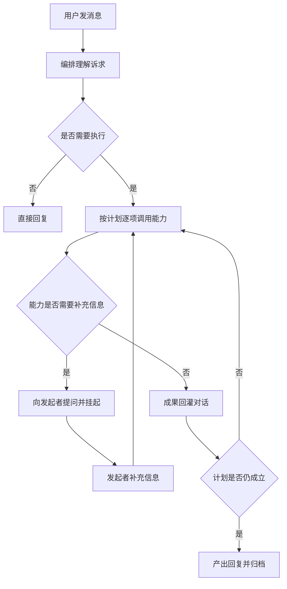
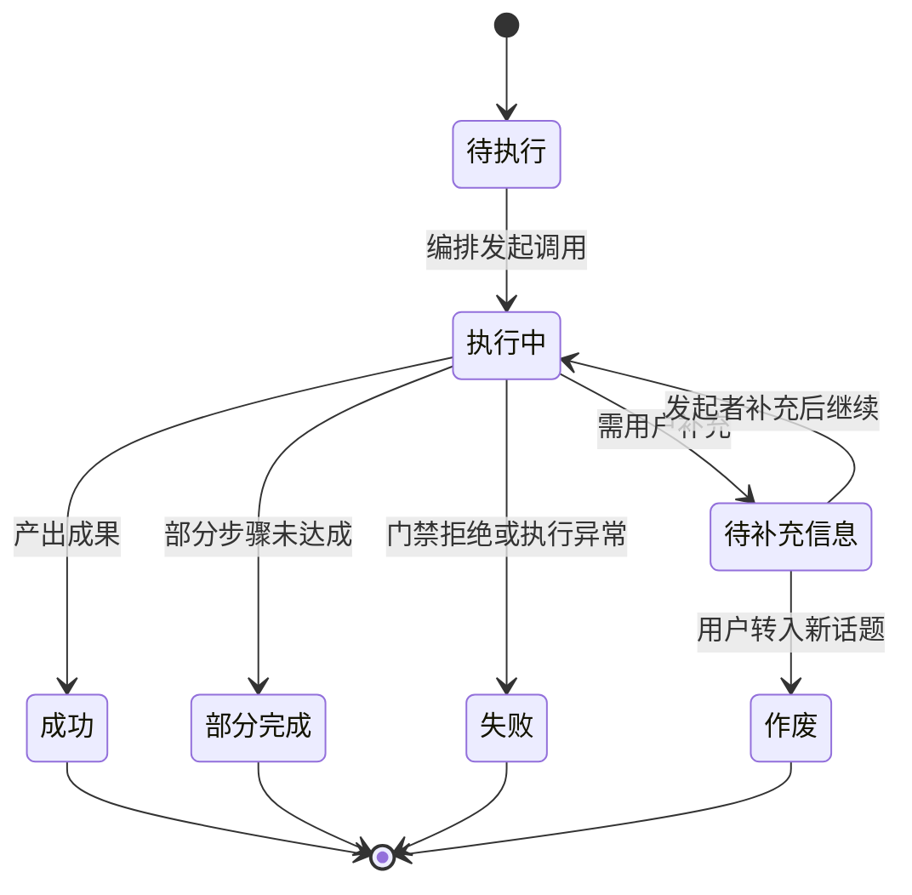

# LangGraph 编排内核化 — PRD（规格 / Spec）

> **日期**：2026-09-11
> **来源**：`LangGraph编排内核化_需求基线_V1.md`、`LangGraph编排内核化_模块拆解清单_V1.md`、`Emily系统技术栈定版_V1.md`（本 PRD 由多轮架构讨论收敛后一次性定稿，第 1 至第 4 轮对话成果已沉淀于上述三份文档）
> **参与角色**：需求分析师、Emily 开发者资深架构师、技术总监、SRE 运维工程师（自适应）、资深测试工程师（自适应）
> **宪法版本**：v1.1
> **阶段**：Specify（规格）。方案型技术设计见后续 `LangGraph编排内核化_计划_V*.md`

---

## 一、背景与目标

### 1.1 背景

系统现在有两套编排实现。业务执行一侧已经是图式形态，具备生命周期节点、条件路由、纠错闭环与持久化检查点；会话一侧仍是自研循环与自研计划游标，并且是全系统唯一没有纳入图式形态的执行路径。同一系统内两套形态并存，带来四个可验证的问题：

一是任务级计划只能编排业务流能力，查询与写类能力因参数契约不同被排除在计划之外，实测出现过参数丢失导致的降级记录。二是挂起状态仅存于会话内存，进程重启后未完成的能力调用即失效，该缺口此前被书面接受。三是进度与对外流式由多套自研通道分别承担。四是已废弃的编排代码仍留在主干。

与此并行，架构自身也留有伤痕：执行状态曾因持有领域对象而无法序列化，导致检查点被禁用、断点续传与中断能力同时失效；框架版本假定与实际安装不一致，已发生过一次接口断裂。

### 1.2 目标与成功指标

| 目标 | 成功指标（可度量） |
|------|------------------|
| 编排形态收敛为单一实现 | 会话处理与业务执行使用同一执行形态；手写循环与手写计划游标不再作为并列实现存在 |
| 挂起可跨进程恢复 | 重启后未完成的能力调用可由发起者续接并产出成果（可判定用例） |
| 执行有界可收敛 | 单条消息存在明确迭代上限；任一能力异常或超时后用户仍收到可读回复 |
| 执行状态可序列化 | 中间状态仅含可序列化内容，持久化全路径可用，不再出现降级记录 |
| 能力契约完备 | 对模型开放的能力全部声明参数约束与读写性质，缺声明者不进入可见工具集 |
| 治理资产不减 | 权限分级、可见范围、质量门、专家评审、分级兜底在迁移后逐条仍生效 |
| 迁移可回退 | 开关关闭时旧链路行为与现状一致 |
| 无人值守作业与内核解耦 | 调度引擎停用不影响会话主流程；自检类作业不再自动触发，且不依赖其他作业的执行日志 |

### 1.3 非目标（明确不做）

1. 不重写业务能力本体：业务流内容、工具实现、检索管线、节点业务规则均保持现状。
2. 不改变权限模型与审计口径，本次只改判定的位置，不改判定的语义。
3. 不做多租户，不预留租户字段（单租户形态，隔离边界属权限域）。
4. 不引入 LangChain 主包与 Agent 生态。
5. 不新增第二套能力执行记录存储，沿用轮次归档与现有审计。
6. 不做多渠道抽象，不改变对外流式的语义契约。
7. 不在本需求内统一宿主外壳的技术载体，只做归属划分与解耦（载体选型见计划）。
8. 不做前端与接入通道改造。

---

## 二、需求登记表（核心章节）

### 2.1 用户故事与验收标准

**US-01**｜角色：群聊与私聊用户｜场景：任意消息进入系统｜期望：会话以唯一的编排形态完成从理解到回复的全程，对话自然延续｜优先级：P0

| AC-ID | 验收标准（可判定） | 验证方式 |
|-------|------------------|---------|
| AC-US-01.1 | 同一会话连续对话中，回复由编排循环直接产出，不存在可感知的中间合成层，用户无需重述前文 | 对话语料回放 + 模型调用记录核对 |
| AC-US-01.2 | 问候、感谢、告别、自我介绍类消息不触发任何能力调用，直接得到回复 | 调用记录中该类消息无能力调用 |
| AC-US-01.3 | 单条消息存在迭代上限；达到上限时用户收到可读收尾回复，而非无响应或报错原文 | 构造超限场景，观察对话回复 |
| AC-US-01.4 | 会话侧不再存在第二套并列的编排实现：同一消息只由一个编排主体决策 | 静态扫描并列入口 + 双轨开关关闭时行为对照 |

**US-02**｜角色：业务用户｜场景：提出复合诉求（同时涉及查询与记录）｜期望：计划可覆盖全部能力类型，且参数不丢失｜优先级：P0

| AC-ID | 验收标准（可判定） | 验证方式 |
|-------|------------------|---------|
| AC-US-02.1 | 复合请求的计划可包含查询、写入、业务流三类能力，任一类进入计划后参数完整传递 | 复现历史降级场景，断言不再产生字段缺失的业务记录 |
| AC-US-02.2 | 计划内的层间顺序与层内并行可核对：同层能力并发发起，跨层按依赖推进 | 归档中的调用清单顺序与时间戳核对 |
| AC-US-02.3 | 前置能力失败时，依赖它的下游能力不执行，且用户收到如实说明 | 构造前置失败场景，观察回复与执行记录 |
| AC-US-02.4 | 计划执行中动态追加的能力受深度上限约束，超限即放弃追加并说明 | 构造多层追加场景，核对执行记录 |
| AC-US-02.5 | 计划不成立时（能力不可用、参数不匹配），编排按实际结果重排或收敛，不停摆 | 故障注入，观察回复与调用清单 |

**US-03**｜角色：业务用户与权限管理者｜场景：能力被调用｜期望：能力契约显式，可见范围按操作者裁剪，写入受门禁约束｜优先级：P0

| AC-ID | 验收标准（可判定） | 验证方式 |
|-------|------------------|---------|
| AC-US-03.1 | 每个对模型开放的能力都声明参数约束与读写性质；缺声明的能力不进入可见工具集（产出侧） | 能力目录枚举 + 一致性校验脚本输出 |
| AC-US-03.2 | 可见工具集按当前操作者裁剪，越权能力不可被调用，且拒绝为默认行为（counterpart: AC-US-03.1） | 低权限用户演练，断言无越权能力出现在可见集且调用被拒 |
| AC-US-03.3 | 写入类能力受分级兜底门禁约束：权限不足时给出明确拒绝，不静默降级 | 分级演练，对照拒绝提示与留痕 |
| AC-US-03.4 | 单条消息的裁剪以该消息的操作者为基准；群聊中不因他人权限放宽 | 群聊多用户越界演练，断言可见集与操作者一致 |

**US-04**｜角色：业务用户｜场景：能力需要补充信息｜期望：挂起成为对话自然状态，可在重启后续接｜优先级：P0

| AC-ID | 验收标准（可判定） | 验证方式 |
|-------|------------------|---------|
| AC-US-04.1 | 能力需要补充信息时，会话以自然提问挂起，且不产出成果 | 对话回放 + 归档断言无成果 |
| AC-US-04.2 | 进程重启后，未完成的挂起可由发起者补充信息后继续并产出成果 | 构造挂起后重启，补充信息后核对成果 |
| AC-US-04.3 | 挂起归属为发起者：群聊中其他成员的回答不认领该挂起 | 多人演练，断言归属正确 |
| AC-US-04.4 | 用户转入新话题时挂起作废，不误判为续接 | 话题切换演练，断言不误认领 |

**US-05**｜角色：业务用户｜场景：多步计划执行中｜期望：进度与结果可见，且与实际一致｜优先级：P1

| AC-ID | 验收标准（可判定） | 验证方式 |
|-------|------------------|---------|
| AC-US-05.1 | 多步计划在会话中显示简版进度，进度内容与执行事实一致 | 对话回放对照调用清单 |
| AC-US-05.2 | 对话内进度与对外流式来自同一事件来源，不出现两套通道描述不一致 | 同时采集两路输出并比对 |
| AC-US-05.3 | 失败或部分完成时，回复如实反映已完成与未完成的部分 | 构造部分完成场景，核对回复措辞与记录 |

**US-06**｜角色：业务用户与治理方｜场景：诉求触及门禁或评审｜期望：门禁在编排内判定，否决效力保留｜优先级：P0

| AC-ID | 验收标准（可判定） | 验证方式 |
|-------|------------------|---------|
| AC-US-06.1 | 权限不足的写操作被拒绝并留下可追溯记录 | 越权演练 + 审计记录核对 |
| AC-US-06.2 | 专家评审不通过时不产出成果，用户收到明确说明 | 构造被否决场景，观察回复与归档 |
| AC-US-06.3 | 质量门退回重做存在次数上限，超限后以失败收尾，不进入死循环 | 构造连续不达标场景，观察收敛与耗时 |
| AC-US-06.4 | 装配期裁剪、执行期判定、分级兜底三处判定结论一致，不出现同一诉求两处结论相反 | 抽样对照三处判定结果 |

**US-07**｜角色：运维与开发方｜场景：执行中间状态持久化与恢复｜期望：状态可序列化、可恢复、不重复产生副作用｜优先级：P0

| AC-ID | 验收标准（可判定） | 验证方式 |
|-------|------------------|---------|
| AC-US-07.1 | 执行中间状态仅含可序列化内容，持久化全路径可用，运行期间无降级记录 | 运行时日志 + 恢复演练 |
| AC-US-07.2 | 同一会话主题在恢复后重放，不产生重复业务记录 | 重放演练，核对业务记录条数 |
| AC-US-07.3 | 长会话下持久化的中间状态体积受控，不随轮次无界增长 | 连续多轮对话后测量增长曲线 |

**US-08**｜角色：开发与运维方｜场景：领域资源被编排调用｜期望：领域与外壳不进入执行状态，只经端口访问｜优先级：P0

| AC-ID | 验收标准（可判定） | 验证方式 |
|-------|------------------|---------|
| AC-US-08.1 | 执行状态中不出现领域对象（会话上下文、消息、工单对象等），只允许标识与摘要（产出侧） | 状态结构静态检查 |
| AC-US-08.2 | 领域对象按标识重建获取，重建后行为与现状一致：上下文注入与权限裁剪结果不变（counterpart: AC-US-08.1） | 对照迁移前后的上下文与裁剪结果 |
| AC-US-08.3 | 会话运行时状态、事件推送、定时作业、文件与检索均经端口调用，执行状态不持有其实例 | 静态检查 + 多副本演练 |
| AC-US-08.4 | 能力层不反向依赖执行状态的内部结构 | 静态可达性扫描（定义处 vs 使用处） |

**US-09**｜角色：运维与开发方｜场景：灰度放开与回退｜期望：新旧路径并存可控，回退不影响数据｜优先级：P0

| AC-ID | 验收标准（可判定） | 验证方式 |
|-------|------------------|---------|
| AC-US-09.1 | 全局开关与按能力放开均可用；开关关闭时旧链路行为与现状一致 | 双轨对照回归 |
| AC-US-09.2 | 切回旧路径不需要数据回滚，既有业务两路径均可完成 | 切换演练 + 数据核对 |
| AC-US-09.3 | 开关状态与生效范围可查询，不存在只写不读的死开关 | 静态扫描开关的读取方 |

**US-10**｜角色：业务方与治理方｜场景：迁移完成｜期望：治理与资产一条不少｜优先级：P0

| AC-ID | 验收标准（可判定） | 验证方式 |
|-------|------------------|---------|
| AC-US-10.1 | 权限分级、可见范围、质量门、专家评审、分级兜底逐条演练仍生效 | 逐条演练记录 |
| AC-US-10.2 | 轮次归档仍可回答"调用了哪些能力、产出什么、谁触发、成败如何" | 归档内容抽查 |
| AC-US-10.3 | 审计记录口径与迁移前一致，无字段缺失或语义变化 | 前后对照 |
| AC-US-10.4 | 既有业务能力（记录类、查询类、文件类、节点类）两路径均可完成，无能力因迁移而消失 | 能力目录逐项核对 |

**US-11**｜角色：运维方｜场景：无人值守作业与内核的关系｜期望：自检类作业先降级为手动，内核不因作业缺失而不可用｜优先级：P1

| AC-ID | 验收标准（可判定） | 验证方式 |
|-------|------------------|---------|
| AC-US-11.1 | 自检类作业不再由内核常驻进程自动触发，改为显式手动入口 | 停用作业记录后观察不再自动执行 |
| AC-US-11.2 | 自检结果不再依赖任何定时作业的执行日志 | 关闭相关作业后执行自检，断言结论仍成立 |
| AC-US-11.3 | 调度引擎停用后，会话主流程与能力调用不受影响 | 停用引擎演练 |
| AC-US-11.4 | 手动入口的产出与原有作业产出等价，可逐项核对 | 同输入下对照两份产出 |
| AC-US-11.5 | 后续以插件方式回归自动化时，无需改动会话编排（只有回归项清单） | 设计评审确认 |

### 2.2 US 清单（下游追溯锚点）

| US-ID | 一句话 | 优先级 | 状态 |
|-------|--------|--------|------|
| US-01 | 会话编排收敛为唯一执行形态 | P0 | 生效 |
| US-02 | 任务级计划覆盖全部能力且不丢参 | P0 | 生效 |
| US-03 | 能力契约显式化与可见范围裁剪 | P0 | 生效 |
| US-04 | 挂起可跨进程恢复且归属发起者 | P0 | 生效 |
| US-05 | 进度与结果统一可见且与实际一致 | P1 | 生效 |
| US-06 | 门禁与评审在编排内判定，否决效力保留 | P0 | 生效 |
| US-07 | 中间状态可序列化、可恢复、可幂等重放 | P0 | 生效 |
| US-08 | 领域与外壳不进执行状态，只经端口访问 | P0 | 生效 |
| US-09 | 灰度双轨与可回退 | P0 | 生效 |
| US-10 | 治理与业务资产不减 | P0 | 生效 |
| US-11 | 无人值守作业与内核解耦 | P1 | 生效 |

> 上游需求基线中的"出图范围与禁止第二编排器"已拆入 US-01、US-08、US-09；"能力契约显式化"对应 US-03；"挂起改用中断与检查点"对应 US-04 与 US-07。

---

## 三、业务规则与流程

### 3.1 业务规则

| # | 规则 | 说明 |
|---|------|------|
| R1 | 唯一编排 | 一条消息的处理只由一个编排主体决策，不出现第二套并列编排 |
| R2 | 执行权留在编排 | 计划由编排逐项执行并可按结果重排；执行权与纠错权不随计划移交 |
| R3 | 不前置分类 | 不在回合开始做"是否需要建工单"的显式分类步骤 |
| R4 | 能力即契约 | 能力入参、读写性质、权限归属必须显式声明，缺声明不开放 |
| R5 | 挂起即对话状态 | 挂起是待补充的能力调用，归属发起者，可跨进程恢复 |
| R6 | 失败结构化 | 结果分成功、部分完成、失败三态，失败如实回传，不宣称原子性 |
| R7 | 领域不进状态 | 执行状态只存标识与摘要，领域对象按标识重建 |
| R8 | 门禁不减弱 | 权限、分级兜底、质量门、评审否决效力保留，只改判定位置 |
| R9 | 无人值守可缺席 | 定时作业不构成内核运行的必要条件 |

### 3.2 业务流程（业务级）

> 展示一条消息在唯一编排形态下的业务步骤，含挂起与重排两个回路。

### 3.3 业务状态流转（业务可见状态）

> 描述一次能力调用对用户可见的状态流转，不涉及代码状态机。

---

## 四、边界与约束

### 4.1 触碰的宪法铁律

| 铁律 | 影响 | 处理 |
|------|------|------|
| C0 根治而非迁就 | 本需求正面处理两套编排并存与内存态挂起的结构性缺陷，不以补丁缓解 | 遵循 |
| C2 分层不可跳 | 编排只经能力端口与门禁端口访问领域，不直接触达数据访问层 | 遵循 |
| C6 同步数据访问由异步层包裹 | 领域数据访问保持同步实现并异步包裹，本次不变更该约定 | 遵循 |
| C8 唯一执行引擎 | 现状是执行一侧已图式化、会话一侧未纳入，构成"事实上的两套"；本需求正是让全网遵守 C8 | 遵循，本需求的核心依据 |
| C10 工具必须带参数 schema | 能力契约显式化是 C10 在会话侧的延伸，缺声明者不开放 | 遵循 |
| C11 功能注册接入 | 能力与作业的手动入口均须经既有注册通道接入，禁止裸调用 | 遵循 |
| Q6 接线闭合 | 灰度开关、手动入口、能力契约均须有读取方与消费方；死开关视为未完成 | 遵循 |
| `CLAUDE.md` 开发约束 13（内核冻结的适用范围） | 本需求属内核形态升级，不在"业务功能增长"范围内 | 已获授权变更，条文已重述 |

### 4.2 范围边界

| 在范围内 | 不在范围内 |
|---------|-----------|
| 会话编排与计划执行的形态统一 | 业务能力本体的重写 |
| 能力契约的显式化与裁剪 | 权限判定语义与审计口径的变更 |
| 挂起的可恢复与归属 | 多租户与租户隔离 |
| 执行状态的边界与序列化 | 前端与接入通道改造 |
| 门禁与评审的判定位置收敛 | 宿主外壳技术载体的选型落地 |
| 无人值守作业与内核的解耦 | 无人值守能力的重新设计 |
| 灰度与回退机制 | 全网性能优化 |

### 4.3 假设与依赖

| # | 假设 / 依赖 | 若不成立的影响 |
|---|------------|--------------|
| 1 | 2026-09-11 的会话重构先行收敛（开关放开、语料跑完、遗留缺陷与测试数据清理） | 两个未验证变更叠加，排障成本相乘，建议作为 P0 前置 |
| 2 | 业务执行一侧的图式引擎与检查点可复用 | 需重做检查点与恢复，工作量与风险显著上升 |
| 3 | 权限判定与分级兜底通道可被编排调用而不改语义 | 需先改权限层，范围外溢 |
| 4 | 领域对象可由标识重建且重建成本可接受 | 需引入额外缓存，性能与一致性风险上升 |
| 5 | 现有归档与审计口径足以承载能力调用清单 | 需扩展归档结构，触发规格变更 |

### 4.4 约束型技术决策

| # | 约束 | 来源 / 理由 |
|---|------|-----------|
| 1 | 必须复用现有图式执行引擎作为唯一编排形态，不得并行保留第二套编排实现 | C8；且已有一次同类替换经验，路径可复制 |
| 2 | 必须复用现有业务执行引擎作为业务流能力的内部实现，不得重写能力本体 | 避免重复建设，保留既有质量门与评审资产 |
| 3 | 执行中间状态必须只含可序列化内容，领域对象不得进入状态，只能按标识重建 | 历史上因状态持有领域对象导致检查点被禁用 |
| 4 | 必须复用现有权限判定与分级兜底通道，不得新造权限判定，不得引入策略引擎类新依赖 | C2 与历史事故成本 |
| 5 | 不得引入 LangChain 主包；确需生态能力时按单个子包引入并登记版本上界 | 依赖面与版本漂移风险 |
| 6 | 新增能力与新增作业入口必须经既有注册通道接入 | C11 |
| 7 | 必须保留灰度双轨与可回退，开关关闭时行为与现状一致 | 迁移安全 |
| 8 | 挂起必须支持跨进程恢复，不得以"仅存内存"作为最终形态 | 消除既有书面接受的缺口 |
| 9 | 无人值守作业不得构成内核运行的必要条件；自检类作业降级为手动入口，且不得依赖其他作业的执行日志 | R9；解开隐蔽耦合 |
| 10 | 新增或升级的组件必须锁定版本上界并登记，配套升级回归语料 | 已发生过一次框架接口断裂 |
| 11 | 领域与外壳不得进入执行状态，外部资源一律经端口访问 | US-08；为多副本与可测试性留出空间 |

### 4.5 产出物与消费方（接线清单）

| # | 产出物（能力） | 消费方（谁使用 / 何处生效） | 对应 US |
|---|--------------|--------------------------|--------|
| 1 | 唯一编排形态 | 会话处理全链路 | US-01 |
| 2 | 显式能力契约 | 能力装配与门禁裁剪 | US-03 |
| 3 | 可恢复挂起 | 会话续接与重启恢复 | US-04 |
| 4 | 统一事件来源 | 对话内进度与对外流式 | US-05 |
| 5 | 手动自检入口 | 运维人工执行 | US-11 |
| 6 | 灰度开关与生效范围查询 | 双轨切换与运维核对 | US-09 |
| 7 | 能力调用清单（归档内嵌） | 审计与溯源查询 | US-10 |

**未接线清单**：无。第四项"统一事件来源"的消费方为两路输出（对话内进度、对外流式），两路均需在计划阶段落实读取方，否则按 Q6 视为未完成。

---

## 五、替代方案

| 方案 | 结论 | 理由 |
|------|------|------|
| 保留双轨不动，只修补现有缺陷 | 否决 | 结构性缺陷不消失：两套编排长期并存，每次功能增长都要在两条链路上各做一遍 |
| 改用耐久工作流引擎承载编排 | 否决 | 与现有图式引擎争夺执行权，等于自带第二个编排器，违反 R1 与 R2 |
| 只把挂起落库，不统一编排形态 | 否决 | 缓解一个症状，编排形态仍为两套，且挂起落库本身在新形态下是自然结果 |
| 先做外壳剥离，后做形态统一 | 暂缓 | 外壳剥离会改动运行环境，与形态变更同时做会让排障面变宽，建议分期 |

---

## 六、风险与开放问题

| # | 风险 / 开放问题 | 类型 | 影响 | 缓解 / 待决 |
|---|----------------|------|------|------------|
| 1 | 与尚未收敛的会话重构叠加 | 约束 | 排障成本相乘 | 作为 P0 前置，先收敛再迁移 |
| 2 | 迁移顺序未定：先会话主循环还是先任务级计划 | 约束 | 决定分期形状 | 建议先计划后主循环，计划侧切口更小 |
| 3 | 专家评审的归属未定：编排内的判定分支，还是可独立调用的能力 | 业务 / 约束 | 直接决定编排结构的复杂度 | 计划阶段优先决策 |
| 4 | 旧路径的删除时机与双轨持续时间 | 约束 | 长期双轨会持续付维护成本 | 建议在能力契约冻结并跑完语料后即删除 |
| 5 | 存量能力契约的改造范围与兼容期 | 约束 | 影响可开工时间 | 计划阶段分批，先查询类后写入类 |
| 6 | 会话运行时状态与事件通道的载体选型 | 约束 | 影响多副本能力 | 属方案型问题，见附录 B |
| 7 | 升级回归语料与责任人 | 约束 | 版本漂移再次引发故障 | 计划阶段指定责任人与语料位置 |
| 8 | 中间状态持久化与业务库的关系及清理窗口 | 约束 | 存储膨胀 | 属方案型问题，见附录 B |
| 9 | 自检手动化后，无人值守能力是否长期缺失 | 业务 | 运维依赖人工 | US-11.5 要求回归路径设计评审通过，长期以插件形式回归 |

---

## 附录 A：规格变更记录

| 版本 | 日期 | 变更内容 | 影响的 US |
|------|------|---------|----------|
| V1 | 2026-09-11 | 初版。由需求基线 V1、模块拆解清单 V1、系统技术栈定版 V1 收敛定稿 | — |

---

## 附录 B：留给 req-plan 的方案型技术问题

| # | 方案型技术问题 | 为何须在计划 / DD 阶段定 |
|---|---------------|----------------------|
| 1 | 编排图的节点划分与子图边界如何组织 | 属实现结构，规格不预设 |
| 2 | 能力契约的描述载体与注册方式（声明放在哪、如何被装配消费） | 属实现选型 |
| 3 | 中间状态持久化复用现有存储还是独立存储，清理窗口如何设定 | 属实现选型 |
| 4 | 会话运行时状态、事件通道、文件存储的载体选型 | 属实现选型，且会触及部署形态 |
| 5 | 上下文压缩由编排节点承担还是复用现有压缩服务 | 属实现结构 |
| 6 | 专家评审改为独立能力的改造范围（若风险 3 选择该方向） | 依赖风险 3 的业务决策 |
| 7 | 自检手动入口的承载形式（脚本入口、控制台入口或两者） | 属实现选型 |
| 8 | 灰度开关的粒度落地（全局、按能力、按会话） | 属实现选型 |
| 9 | 旧废弃编排代码的清理范围与顺序 | 属实现动作，随计划分批 |
| 10 | 三处门禁判定收敛为哪几个判定点 | 属实现结构 |

---
*本 PRD 为规格（Spec），由 req-review 流程生成，基于 Emily 项目上下文与项目宪法 v1.1。方案型技术设计见 `LangGraph编排内核化_计划_V*.md`。*
