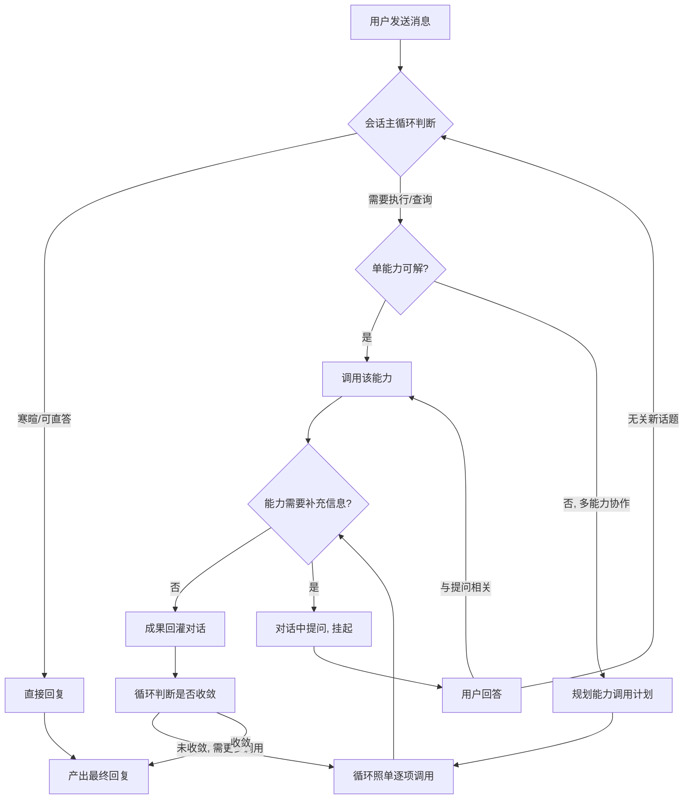
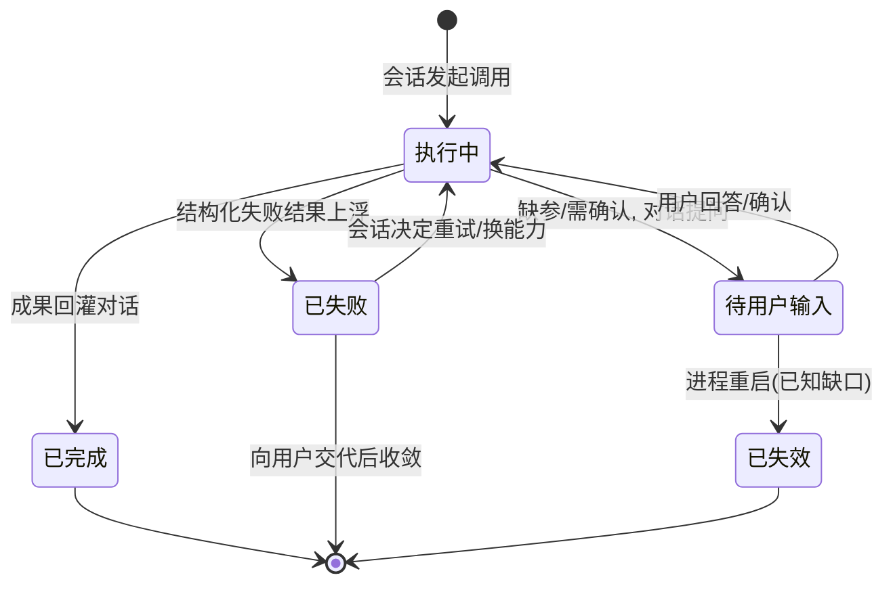

# Session 主体化与 WorkItem 能力化 — PRD（规格 / Spec）

> **日期**：2026-09-11
> **来源**：`需求/Session主体化与WorkItem能力化/Session主体化与WorkItem能力化_需求基线_V2.md`（多轮对话评审收敛产物；上游 V1 提供现状差距与证据索引）
> **参与角色**：需求分析师、Emily 资深架构师、技术总监、SRE/运维工程师（自适应）
> **宪法版本**：v1.1
> **阶段**：Specify（规格）——方案型技术设计见后续 `Session主体化与WorkItem能力化_计划_V*.md`

---

## 一、背景与目标

### 1.1 背景

当前系统的对话处理是"意图识别 → 预拆分工单 → DAG 派发 → 回收结果 → 二次合成回复"的管道：会话每条消息固定两次结构化 LLM 调用，全系统唯一的工具循环在工单执行图内部，对话无法自然延续（挂起依赖内存图检查点、确认是工单特例、编排计划只存内存）。这是结构性缺陷，调参无法解决——用户在对话中的自然追问、纠错、确认都要绕特例通道。

本需求将系统换位为业界已验证的"单一对话主循环 + 能力调用"形态：**会话（连续对话瀑布流）是唯一主体**，工单体系降级为**可插拔能力**，向对话提供两类服务——执行手脚（写/操作）与查询服务（读）。方向经评审确认为真实问题（非想象问题），且相比"修补派发范式"与"照抄 Pi 生态"两个替代方案（见第五节），本方案以可承受的改动面换取架构收敛与未来扩展期权。

### 1.2 目标与成功指标

| 目标 | 成功指标（可度量） |
|------|------------------|
| 会话主体唯一化：连续对话持有唯一主循环，回复由循环直接产出 | 同批业务语料上新路径体验判定 ≥ 现状；闲聊类消息平均 token 与延迟不劣于现状 |
| 能力化：工单退化为能力，对话中按需调用 | 每个启用中 SOP 可枚举为独立能力；回复中不出现工单实体词汇 |
| 资产不丢：SOP、权限分级、质量门、专家评审、分级兜底、审计归档全部保留 | golden 语料四类断言全过：能力命中正确性、权限拦截、挂起续接、归档完整性 |
| 灰度安全：新旧路径并存可回退 | 全局开关与按 SOP 放开均可用；切换后既有业务两路径均可完成 |

### 1.3 非目标（明确不做）

1. token 级流式输出。
2. 会话树分叉。
3. Pi 式"内核零内建 + 热加载扩展生态"（本需求只收敛形态，不建生态）。
4. 删除或弱化 SOP、权限分级、质量门、专家评审、分级兜底。
5. 重写工单内部执行引擎（现有引擎保留为能力实现）。
6. 多渠道收敛为统一渠道抽象。
7. 执行图检查点持久化（新路径不再依赖图挂起）。
8. 挂起状态落库——**书面接受的已知缺口**：挂起仅存会话内存，进程重启后未完成的能力调用即失效，用户需重新提出。此缺口须登记于运维口径与缺陷治理清单，不计为回归缺陷。

---

## 二、需求登记表（核心章节）

### 2.1 用户故事与验收标准

**US-01**｜角色：群聊/私聊用户｜场景：任意消息发送｜期望：会话以唯一连续主循环处理全部消息，回复由循环直接产出，对话自然延续｜优先级：P0

| AC-ID | 验收标准（可判定） | 验证方式 |
|-------|------------------|---------|
| AC-US-01.1 | 同一会话连续对话中，用户可感知的"中间合成层"不再存在：回复由主循环直接产出，回复内容与上下文自然衔接（无需用户重述前文） | 对话语料回放 + LLM 流量日志核对 |
| AC-US-01.2 | 问候/感谢/告别/自我介绍类消息不触发任何能力调用，直接得到回复 | LLM 流量日志中该类消息无工具调用记录 |
| AC-US-01.3 | 单条消息处理循环存在终止上限；达到上限时用户收到可读的收尾回复，而非无响应或报错原文 | 构造超限场景（语料注入），观察对话回复 |
| AC-US-01.4 | 单次能力调用超时后，对话收到结构化失败反馈并收敛为可读回复 | 构造慢能力场景，观察对话回复与日志 |

**US-02**｜角色：群聊/私聊用户｜场景：诉求命中业务流｜期望：每个启用中的 SOP 以一个独立能力被对话调用，内部质量保障机制完整保留，用户不感知工单实体｜优先级：P0

| AC-ID | 验收标准（可判定） | 验证方式 |
|-------|------------------|---------|
| AC-US-02.1 | 命中 SOP 场景时能力被调用并产出成果（结构化 + 可读文本）；用户可见回复中不出现工单编号、状态机词汇等实体泄露 | 对话语料回放 + 回复文本断言 |
| AC-US-02.2 | 启用中的 SOP 与能力的对应关系可枚举、可注册、可停用；新增或停用 SOP 后能力目录随之生效 | 运营操作演练 + 目录枚举核对 |
| AC-US-02.3 | 质量门/专家评审否决时，用户收到"不产出成果"的明确答复（否决效力保留：参考意见不削弱否决权重） | 构造被否决场景，观察对话回复 |
| AC-US-02.4 | 能力执行产生与手工操作口径一致的审计记录 | 审计记录比对 |

**US-03**｜角色：任意权限用户｜场景：查询类诉求｜期望：查询能力直达对话，不经业务流路径，且仍受可见范围约束｜优先级：P0

| AC-ID | 验收标准（可判定） | 验证方式 |
|-------|------------------|---------|
| AC-US-03.1 | 查询诉求的回复直接来自查询能力调用结果，全程无业务流路径参与 | LLM 流量日志 + 对话回复核对 |
| AC-US-03.2 | 查询调用不被写操作门禁拦截（counterpart：AC-US-03.3） | 低权限用户查询演练 |
| AC-US-03.3 | 查询结果仍受当前操作者可见范围约束，越权数据不出现在回复中（counterpart：AC-US-03.2） | 越权查询演练，断言无越权数据 |

**US-04**｜角色：分级权限用户｜场景：写类诉求｜期望：写操作保留权限过滤与分级兜底门禁，高危诉求不走自由工具集｜优先级：P0

| AC-ID | 验收标准（可判定） | 验证方式 |
|-------|------------------|---------|
| AC-US-04.1 | 覆盖/编辑/删除类高危能力不出现在自由工具集中，仅能经对应 SOP 能力完成 | 工具集枚举断言 + 越权调用演练 |
| AC-US-04.2 | 分级兜底语义与现状一致：普通兜底只读、高级兜底可追加写；越权写调用被拒绝且用户收到拒绝说明 | 分级用户矩阵演练 |

**US-05**｜角色：群聊/私聊用户｜场景：一条消息需要多个能力协作｜期望：任务级粗排产出带依赖的调用计划，计划由会话循环照单执行，进度可见｜优先级：P0

| AC-ID | 验收标准（可判定） | 验证方式 |
|-------|------------------|---------|
| AC-US-05.1 | 多能力依赖诉求被规划为带依赖的调用计划：层内并行、层间顺序、前置失败则下游跳过 | 多能力依赖语料回放 + 执行日志断言 |
| AC-US-05.2 | 计划执行中途，会话循环依据已回灌成果调整后续调用（动态追加/重排）；最终回复反映实际执行结果而非原始计划 | 构造中途失败/前提变化场景 |
| AC-US-05.3 | 计划在对话中以简版进度可见，用户能看到"要做什么、做到哪" | 对话回放断言进度信息存在 |
| AC-US-05.4 | 能力内部细排失败时，失败以结构化结果上浮，用户收到可读交代（做了什么、卡在哪、建议），而非静默丢失 | 构造能力内部失败场景 |

**US-06**｜角色：群聊/私聊用户｜场景：能力执行缺参或需用户决策｜期望：挂起成为对话自然状态，多轮续接，重启丢失为已接受缺口｜优先级：P0

| AC-ID | 验收标准（可判定） | 验证方式 |
|-------|------------------|---------|
| AC-US-06.1 | 能力缺参时对话中直接提问，用户回答后续接同一能力并继续执行，无需重述原始需求 | 多轮缺参语料回放 |
| AC-US-06.2 | 用户转入无关新话题后，旧挂起不被误续接，新话题正常处理 | 话题切换语料回放 |
| AC-US-06.3 | 同轮多能力并发挂起时，用户回答按"谁发起谁确认"归属到正确能力 | 并发挂起场景演练 |
| AC-US-06.4 | 进程重启后未完成挂起失效；用户重新提出同诉求可正常处理；该行为在运维口径中有书面记载 | 重启演练 + 运维文档核对 |

**US-07**｜角色：群聊/私聊用户｜场景：操作需用户确认｜期望：确认/取消归位为对话行为，确认存储复用现有链路｜优先级：P0

| AC-ID | 验收标准（可判定） | 验证方式 |
|-------|------------------|---------|
| AC-US-07.1 | 待确认项在对话中呈现；用户确认后能力继续执行，取消后不执行且收到说明 | 确认/取消语料回放 |
| AC-US-07.2 | 确认记录落于现有确认存储通道，无第二套确认存储产生（counterpart：AC-US-07.1 的存储侧验证） | 存储记录核对 |

**US-08**｜角色：运维/审计人员｜场景：溯源一条回复｜期望：归档以会话轮次为锚点，轮次记录内嵌能力调用清单｜优先级：P1

| AC-ID | 验收标准（可判定） | 验证方式 |
|-------|------------------|---------|
| AC-US-08.1 | 任一条涉及能力调用的回复，可从其轮次归档段回答"调了哪些能力、入参摘要、产出什么、由谁触发、成败"，且审计意见作为会话参考意见呈现 | 归档记录抽样核对 |
| AC-US-08.2 | 归档仅有会话轮次一套锚点，无独立的第二套能力执行记录存储 | 存储清点断言 |

**US-09**｜角色：开发者/运维｜场景：灰度与回退｜期望：新旧路径并存可开关，支持按 SOP 粒度放开，旧路径最终下线｜优先级：P0

| AC-ID | 验收标准（可判定） | 验证方式 |
|-------|------------------|---------|
| AC-US-09.1 | 全局开关切换后，同一批既有业务问题在新旧两条路径下均可完成 | 双路径语料回放 |
| AC-US-09.2 | 未被放开的 SOP 走旧路径行为不变；被放开的走新路径 | 分组放开演练 |
| AC-US-09.3 | 二期验收通过后，旧派发路径可完整下线删除，删除后全部业务路径仍可达 | 下线后全量语料回放 |

**US-10**｜角色：技术负责人｜场景：成本与质量验收｜期望：新路径成本不回归，质量以 golden 语料判定｜优先级：P1

| AC-ID | 验收标准（可判定） | 验证方式 |
|-------|------------------|---------|
| AC-US-10.1 | 不触发能力的闲聊类消息，平均 token 与延迟不劣于现状基线 | golden 语料分组度量比对 |
| AC-US-10.2 | 同批业务语料上，新路径在四类断言（能力命中、权限拦截、挂起续接、归档完整性）上全过且体验判定 ≥ 现状 | golden 语料自动断言 + 人工评审 |

### 2.2 US 清单（下游追溯锚点）

| US-ID | 一句话 | 优先级 | 状态 |
|-------|--------|--------|------|
| US-01 | 会话唯一主循环，回复直接产出，循环有界可收敛 | P0 | 生效 |
| US-02 | 一 SOP 一能力，内部质量机制保留，实体不泄露 | P0 | 生效 |
| US-03 | 查询能力直达对话，仍受可见范围约束 | P0 | 生效 |
| US-04 | 写操作护栏：权限过滤 + 分级兜底 + 高危不出自由集 | P0 | 生效 |
| US-05 | 任务级粗排 + 循环照单执行 + 进度可见 | P0 | 生效 |
| US-06 | 挂起对话化，多轮续接，重启失效为已接受缺口 | P0 | 生效 |
| US-07 | 确认/取消归位对话行为，复用现有确认存储 | P0 | 生效 |
| US-08 | 归档锚定会话轮次，内嵌能力调用清单 | P1 | 生效 |
| US-09 | 全局开关 + 按 SOP 放开的灰度，旧路径最终下线 | P0 | 生效 |
| US-10 | 成本不回归 + golden 语料四断言验收 | P1 | 生效 |

---

## 三、业务规则与流程

### 3.1 业务规则

| # | 规则 | 说明 |
|---|------|------|
| R1 | 会话主循环冻结 | 主循环只因对话机制本身而改，永不因业务功能增长而改；功能增长一律落能力层。业务功能的改动触达主循环即违规（CLAUDE.md 约束 #13） |
| R2 | 是否调用能力是循环内隐式判断 | 能直答则直答，需要执行则调能力；禁止任何回合开始的"是否需要工单"前置分类步骤 |
| R3 | 一 SOP 一能力 | 每个启用中的 SOP 暴露为一个独立能力；能力工具名与 SOP 编号一一对应、可枚举 |
| R4 | 任务包是执行依据，不是交付物 | 会话将需求规划为能力调用计划后，由会话循环逐项调用、成果逐步回灌、按结果随时重排；执行权与纠错权永不随任务包移交。"打包扔给第三方自主组合执行"即派发范式复辟，禁止 |
| R5 | 两级编排互不越界 | 会话层负责任务级粗排（调哪些能力、依赖顺序）；能力内部负责工具级细排。细排失败以结构化结果向上冒泡，由会话决定重试/换能力/放弃；粗排只在能力边界间重排，不进入能力内部 |
| R6 | 评审否决效力保留 | 质量门/专家评审意见在对话中作为参考意见呈现，但否决即不产出成果——"参考"仅指呈现方式，不是决策权重 |
| R7 | 挂起即对话状态 | 挂起 = 对话中待回答的能力调用；续接沿用"相关则续、无关则新话题"口径；多挂起按"谁发起谁确认"归属 |
| R8 | 数据经能力访问 | 会话掌握能力目录与对话上下文，不直接持有数据资源；一切数据读取经查询能力（保权限过滤） |

### 3.2 业务流程（业务级）

> 下图展示一条用户消息在"会话主体 + 能力"模式下的业务步骤（含挂起分支）。

### 3.3 业务状态流转（业务可见状态）

> 下图描述一次能力调用在对话中的业务可见状态（非代码状态机）。

---

## 四、边界与约束

### 4.1 触碰的宪法铁律

| 铁律 | 影响 | 处理 |
|------|------|------|
| C2 分层不可跳 | 会话与工单的**调用语义**换位，分层关系本身不变 | 遵循 |
| C3 SOP 即路由 | 该铁律以派发范式为前提，与本需求"SOP 即能力"冲突 | **显式变更**：实施时改写措辞（随二期转默认） |
| C5 结构化输出优先 | 同上，其措辞以"命中 SOP → 框架直调"的派发链路为前提 | **显式变更**：实施时改写措辞（随二期转默认） |
| C8 唯一执行引擎 | 现有执行引擎保留为能力内部实现，不另起引擎 | 遵循 |
| C11 功能注册接入 | SOP 能力、查询能力、新工具均必须经注册通道接入，禁止裸调用 | 遵循 |
| C12 Session 主循环冻结 | 本需求属"对话机制本身的升级"，是主循环的**合法一次性改动**；完成后主循环即冻结，此后业务增长一律走能力层 | 遵循（本次为冻结前的一次性改造） |

### 4.2 范围边界

| 在范围内 | 不在范围内 |
|---------|-----------|
| 会话主循环换位、SOP 能力化、查询直达、写护栏、两级编排、挂起/确认对话化、归档锚点换位、灰度开关 | token 级流式、会话树分叉、插件生态/热加载、执行引擎重写、渠道抽象、挂起落库、检查点持久化 |

### 4.3 假设与依赖

| # | 假设 / 依赖 | 若不成立的影响 |
|---|------------|--------------|
| 1 | 会话上下文能力（消息历史、预算压缩、用量记录）可复用 | 主循环需自建上下文管理，范围扩大 |
| 2 | 工具装配的权限过滤通道（fail-closed）可直接复用 | 需重新设计会话侧权限裁剪，风险升级 |
| 3 | SOP 目录可作为能力目录来源 | 能力目录需另建维护入口 |
| 4 | 现有确认链路与归档链路可扩展复用 | US-07/US-08 范围扩大 |
| 5 | golden 语料可依托现有测试脚本体系建立 | US-10 验收方式需重新约定 |

### 4.4 约束型技术决策

> 以下为"必须/不得"类约束，下游计划与测试据此校验。

| # | 约束 | 来源 / 理由 |
|---|------|-----------|
| 1 | 必须复用现有工单执行引擎作为重能力的内部实现，不得另起执行引擎 | C8；避免重复建设 |
| 2 | 必须复用现有工具装配的权限过滤通道与分级兜底门禁，不得新造权限判定 | 权限 fail-closed 是历史缺陷修复成果（BUG #3），不得绕开 |
| 3 | 新增能力必须经注册通道接入，禁止裸调用 | C11 |
| 4 | 新主循环必须以**并行模块**形态与旧路径并存，不得原地改写旧会话处理链路 | 灰度双轨要求旧路径原样保留，开关才干净 |
| 5 | 归档以会话轮次为唯一锚点，轮次记录内嵌能力调用清单；**不得**新增独立的第二套能力执行记录存储 | D4；一条记录同时满足审计与溯源 |
| 6 | 挂起状态仅存会话内存，**不得**为本需求引入新的挂起持久化机制 | D3；重启丢失已书面接受为缺口 |
| 7 | 能力调用计划必须是与工单计划相互独立的计划形态，**不得**与旧工单拆分计划混用同一数据形态 | 评审结论：混用会让关系换位半途而废 |
| 8 | 能力失败以结构化失败结果回灌对话，**不得**声明能力执行的原子性；部分完成状态如实回传 | 失败不阻塞主链路；用户须知晓部分完成 |

### 4.5 产出物与消费方（接线清单）

| # | 产出物（能力） | 消费方（谁使用 / 何处生效） | 对应 US |
|---|--------------|--------------------------|--------|
| 1 | 会话唯一主循环 | 会话消息入口的全部消息处理 | US-01 |
| 2 | SOP 能力目录（可枚举、可停用） | 会话循环工具装配；运营停用操作 | US-02 |
| 3 | 查询能力直达通道 | 会话循环对查询类诉求的直接调用 | US-03 |
| 4 | 能力调用计划 | 会话循环照单执行；对话进度展示 | US-05 |
| 5 | 挂起对话状态（含多挂起归属） | 会话循环续接判定 | US-06 |
| 6 | 轮次归档内嵌能力调用清单 | 运维/审计溯源查询 | US-08 |
| 7 | 全局开关 + 按 SOP 放开清单 | 部署与灰度操作；旧路径下线决策 | US-09 |
| 8 | 运维口径（挂起重启失效缺口记载） | 运维文档、缺陷治理清单 | US-06 |

**未接线清单**：无。

---

## 五、替代方案

| 方案 | 结论 | 理由 |
|------|------|------|
| 修补现有派发范式（继续加特例通道） | 否决 | 挂起/确认/续接的特例已证明该范式结构性不可持续，修补成本高于换位 |
| 全盘照抄 Pi 生态（零内建内核 + 插件热加载） | 否决 | 生态税当下不必要；但本方案**保留门口**——能力注册日后可增量升级为公开契约，无需架构重写 |
| 本方案（形态收敛、停在生态门口） | **采纳** | 以可承受改动面换取架构收敛；单循环 + 能力目录是扩展的稳定地基 |

---

## 六、风险与开放问题

| # | 风险 / 开放问题 | 类型 | 影响 | 缓解 / 待决 |
|---|----------------|------|------|------------|
| 1 | 重启丢挂起（已接受缺口） | 业务 | 用户重复提问体验 | 运维口径书面化；US-06.4 验证 |
| 2 | 工具集随能力增长膨胀，token 成本上升 | 约束 | 长期成本 | 当前全量暴露；能力数超阈值（数值待计划阶段定）触发两段式加载 |
| 3 | 群聊多用户并发挂起的归属与超时体验 | 业务 | 归属错乱 | R7 规则 + US-06.3 断言；超时策略由计划阶段细化 |
| 4 | 旧路径下线时点（二期验收后）若验收不充分 | 约束 | 业务中断 | US-09.3 全量语料回放作为下线前置条件 |
| 5 | 双编排器（粗排/细排）边界腐化 | 约束 | 架构退化 | R5 越界禁令 + C12 主循环冻结判据（业务 PR 触达主循环即违规） |

---

## 附录 A：规格变更记录

| 版本 | 日期 | 变更内容 | 影响的 US |
|------|------|---------|----------|
| V1 | 2026-09-11 | 初版。基于需求基线 V2（D1–D7 七条已锁定决策、V1 全部开放问题关闭）生成 | — |

---

## 附录 B：留给 req-plan 的方案型技术问题

> 本技能不解答以下问题，仅登记为计划/DD 阶段的输入。

| # | 方案型技术问题 | 为何须在计划 / DD 阶段定 |
|---|---------------|----------------------|
| 1 | 新主循环并行模块的文件位置与既有会话处理文件的组合方式 | 方案型（文件路径/类设计）；规格只约束"并行并存、不改旧链路"（§4.4-4） |
| 2 | 能力调用计划的数据结构与字段设计（基线中的 `CapabilityPlan` 命名仅为占位） | 方案型（数据结构）；规格只约束"独立于工单计划形态"（§4.4-7） |
| 3 | 单次能力调用的超时数值与超时后的资源清理方式 | 方案型（参数与机制）；规格只约束"超时以失败结果回灌并收敛"（AC-US-01.4） |
| 4 | 工具集两段式加载的触发阈值（能力数量）与实现方式 | 方案型；规格只约束"当前全量暴露"（风险 2） |
| 5 | golden 语料的具体题目清单、判定人与指标采集方式 | 验收工程实现；规格只定义四类断言（US-10） |
| 6 | 能力执行进度回灌的具体事件形式与节奏 | 方案型；规格只约束"简版进度可见"（AC-US-05.3） |
| 7 | 会话层编排器对现有 DAG 执行语义的复用与改造切分 | 方案型（类/方法设计）；规格只约束沿用层内并行、层间顺序等语义（AC-US-05.1） |
| 8 | CLAUDE.md 约束 #3/#5 措辞改写的具体文案与生效时点 | 文档变更的执行细节（规格已在 §4.1 声明需变更） |

---
*本 PRD 为规格（Spec），由 req-review 生成。多轮对话过程即本会话的需求评审讨论（捕捉 → 探测 → 逼近 → 定稿），全部开放问题已在基线 V2 中关闭。方案型技术设计见 `Session主体化与WorkItem能力化_计划_V*.md`。*
