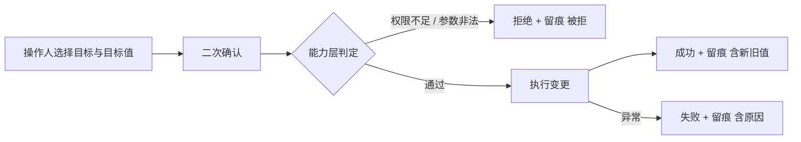
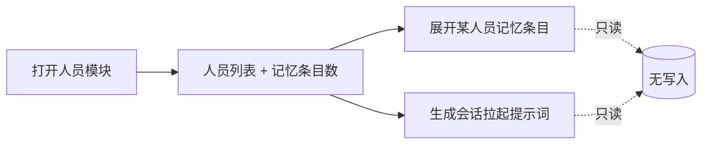
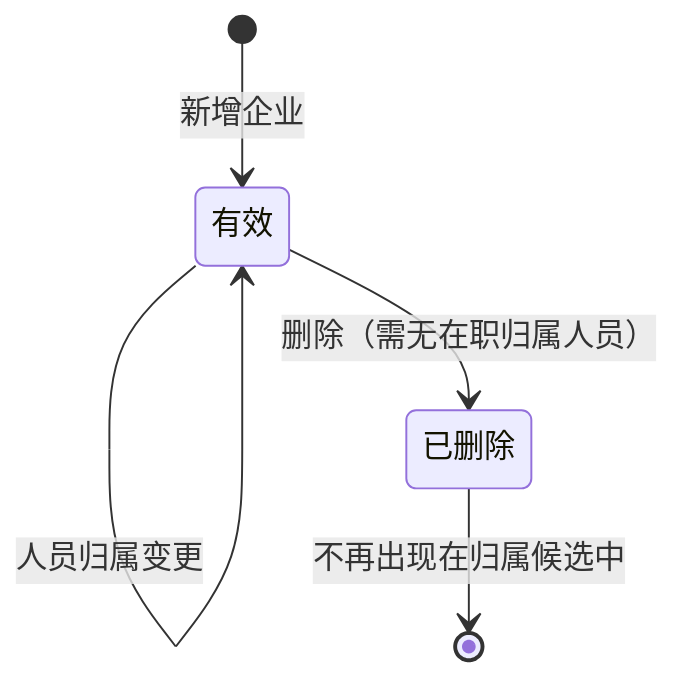

# 人员管理 — PRD（规格 / Spec）

> **日期**：2026-09-17
> **来源**：`Issues/人员展示页面/人员展示页面_需求基线_V1.md`（V1.1）
> **参与角色**：需求分析师、Emily 开发者资深架构师、技术总监、权限与审计工程师（自适应）、前端交互工程师（自适应）
> **宪法版本**：v1.2
> **阶段**：Specify（规格）——方案型技术设计（选哪张表 / 哪个类 / 放哪个文件）见后续 `人员管理_计划_V*.md`
> **模块标识**：`人员管理`（沿自原始意向文件 `Issues/人员展示页面.md`；显示名取「人员管理」，因其含写能力）

---

## 一、背景与目标

### 1.1 背景

emy-console 是观察 Emily 的窗口，但**人员维度完全没有视图**：唯一的人员读取入口是左侧"操作人"下拉的候选源，只有四个字段、上限 300 条、不可排序，需求要的"登记时间""录入人"**在任何入口都不存在**。

更根本的是**人员与企业相关的读写能力从未在能力层建立过**：等级与企业归属只能裸写数据库（无校验、无授权判定、无留痕）；企业连"清单"都没有（只能按 ID 单查），因此无法列举、无法新增、无法删除。同时两个"黑箱"也无法观测：Emily 究竟记住了这个人什么（长期记忆无法按条目查看）、Emily 是以什么身份与上下文面对这个人（会话拉起提示词无任何生成入口，其装配逻辑只存在于运行时的内核私有方法中）。

本需求把上述能力**先在能力层补齐，再由 console 同源接线**，作为一个 console 模块上限，而不是在页面里另造一套。

### 1.2 目标与成功指标

| 目标 | 成功指标（可度量） |
|------|------------------|
| G1 人员可看全 | 一张表同时呈现 人员标识 / 姓名 / 所属企业 / 登记时间 / 录入人 五列，且支持按列排序 |
| G2 人员与企业可维护 | 等级调整、企业归属调整、企业增删均可执行；**每一次尝试（成功与被拒）都留下可回答"谁对谁做了什么、成没成、新旧值是什么"的记录** |
| G3 记忆可见 | 任意有长期记忆的人员，其记忆可按条目（时间/标题/内容）查看；无记忆者有明确提示 |
| G4 提示词可现 | 对任意人员一键得到其会话拉起提示词全文，且与 Emily 实际装配使用的那份在模板/变量/能力目录上口径一致 |
| G5 同源不另造 | 页面所依赖的每一项能力都存在于能力层（业务工具层或服务层），页面侧零业务逻辑、零裸查询、零自行解析 |
| G6 主链路零侵入 | 内核文件（会话主循环、执行引擎）改动数为 0；IM 侧行为无变化 |

### 1.3 非目标（明确不做）

- 人员的新增、删除、批量导入（自注册链路保持不变）。
- 企业档案字段的编辑（改名、改统一社会信用代码、改单位性质/承包范围/对接单位等）——本期企业侧**只增、删**。
- 纠错补救类后台特权（文件误删恢复、知识分块重建、密级纠错、参与单位补登、数据回填）。
- console 的认证与操作人身份可信化（独立后续项）；本期写操作的能力边界**不因无认证而扩大**。
- 长期记忆的编辑、删除、重排（本页面只读记忆；写入仍走既有记忆写入能力）。
- 会话归档正文、群级记忆、项目世界书的人员视图。
- 人员列表分页与数据导出。

---

## 二、需求登记表（核心章节）

### 2.1 用户故事与验收标准

**US-01**｜角色：管理员（L5/L6）｜场景：想核对人员台账｜期望：在控制台看到人员列表｜优先级：P0

| AC-ID | 验收标准（可判定） | 验证方式 |
|-------|------------------|---------|
| AC-US-01.1 | 列表同时呈现五列：人员标识、姓名、所属企业、登记时间、录入人 | 页面截图/接口响应字段核对 |
| AC-US-01.2 | 所属企业显示为企业名称（非 ID）；人员无企业或企业已失效时显示明确的"未归属/未知"文案，不出现空白 | 造一条无企业人员，观察该行 |
| AC-US-01.3 | 录入人显示为可读姓名（非 ID）；录入人即本人（自注册）时显示"本人（自注册）" | 造一条自注册人员，观察该行 |
| AC-US-01.4 | 列表规模达到上限时有明确的截断提示，不静默丢数据 | 达到上限后观察页面提示 |
| AC-US-01.5 | 无人员数据与加载失败两种状态各有明确文案，互不混淆 | 空库 / 断开后端分别观察 |

**US-02**｜角色：管理员｜场景：想按某个维度看人员｜期望：点击列头排序｜优先级：P0

| AC-ID | 验收标准（可判定） | 验证方式 |
|-------|------------------|---------|
| AC-US-02.1 | 姓名、所属企业、登记时间、录入人四列均可点击列头排序，且有升/降序指示 | 逐列点击观察顺序与指示 |
| AC-US-02.2 | 登记时间按**时间序**排序，而非字符串序（对照：跨年份/跨月份数据顺序正确） | 用跨越年份的数据集验证 |
| AC-US-02.3 | 排序不依赖后端排序参数（页面侧完成），切换排序不产生新的写操作记录 | 抓取请求参数 + 检查留痕无新增 |

**US-03**｜角色：管理员｜场景：想知道 Emily 记住了这个人什么｜期望：在列表看到其长期记忆条目｜优先级：P0

| AC-ID | 验收标准（可判定） | 验证方式 |
|-------|------------------|---------|
| AC-US-03.1 | 列表提供一列显示该人员的长期记忆**条目数**；无记忆时明确显示"无" | 对有/无记忆各取一人观察 |
| AC-US-03.2 | 可展开查看条目列表，每条含 时间 / 标题 / 正文 | 展开后逐条核对 |
| AC-US-03.3 | 展示的条目与该人员实际被 Emily 注入使用的记忆**同源同内容**（同一取值来源），非页面侧另写解析 | 对照同一人员的注入内容与页面条目 |
| AC-US-03.4 | 展示的条目数与记忆中的条目段数一致（抽样核对） | 抽样比对 |
| AC-US-03.5 | 查看记忆不产生任何写操作（记忆文件内容与修改时间不变） | 查看前后比对文件 mtime 与内容 |

**US-04**｜角色：L6/L5/L4/L3（按分级）｜场景：需要调整某人等级｜期望：在页面直接改，且受规则约束｜优先级：P0

| AC-ID | 验收标准（可判定） | 验证方式 |
|-------|------------------|---------|
| AC-US-04.1 | 在页面可将某人等级改为另一合法值，改后该人权限随新等级生效 | 改后以该人身份验证可见范围变化 |
| AC-US-04.2 | 目标值非法（0 / 7 / 非数值）时被拒绝且不生效 | 提交非法值观察拒绝与数据未变 |
| AC-US-04.3 | 操作人等级不足（按 §3.1 R1 分级不允许的组合）时被拒绝，并返回明确原因 | 以低等级操作人尝试越权调整 |
| AC-US-04.4 | **被拒也是一次留痕**：越权/非法尝试均产生一条"被拒"记录，含拒绝原因 | 查留痕表 |
| AC-US-04.5 | 合法调整产生留痕，记录含 操作人、目标人员、**调整前后等级**、结果 | 查留痕表逐字段核对 |
| AC-US-04.6 | 取不到操作人等级时**默认拒绝**（fail-closed），不出现"放行" | 传空/未知操作人尝试 |
| AC-US-04.7 | 调整前需经二次确认（前端确认闸口），未确认不提交 | 观察交互 |

**US-05**｜角色：L6/L5/L4（及 L3 在本企业范围内）｜场景：某人换了单位｜期望：在页面改其所属企业｜优先级：P0

| AC-ID | 验收标准（可判定） | 验证方式 |
|-------|------------------|---------|
| AC-US-05.1 | 在页面可将某人所属企业改为另一家企业；改后该人的可见范围随归属更新 | 改后以该人身份验证可见节点/文件变化 |
| AC-US-05.2 | 企业候选来自**真实企业清单**（下拉/搜索选择），无需手抄企业 ID | 观察交互 |
| AC-US-05.3 | 可将归属清空为"未归属"，且与"设为某企业"语义不混淆 | 清空后观察展示 |
| AC-US-05.4 | 目标企业不存在/已失效时被拒绝 | 构造失效企业 ID |
| AC-US-05.5 | 操作人等级不足时被拒绝 + 产生"被拒"留痕；合法调整产生留痕，含**新旧企业** | 查留痕表 |
| AC-US-05.6 | 调整前需经二次确认 | 观察交互 |

**US-06**｜角色：L4 及以上｜场景：项目新进场一家单位 / 某单位已退场｜期望：在页面增、删企业｜优先级：P1

| AC-ID | 验收标准（可判定） | 验证方式 |
|-------|------------------|---------|
| AC-US-06.1 | 提供企业清单，取自真实企业数据（非硬编码），且显示每家企业的**当前归属人数** | 页面观察 + 与库内数据比对 |
| AC-US-06.2 | L4 及以上可新增企业，新增后该企业出现在候选中可用于人员归属 | 新增后回到 US-05 使用 |
| AC-US-06.3 | 新增时名称为空或非法（若定唯一则含重名）→ 被拒绝并返回明确原因 | 提交空名/重名观察 |
| AC-US-06.4 | L4 及以上可删除企业；按 §3.1 R3 的删除语义生效，删除后该企业从候选中消失 | 删除后观察候选 |
| AC-US-06.5 | 企业下仍有在职归属人员时（按 R3 若禁止删除）→ 被拒绝并提示归属人数 | 构造有归属人员的企业尝试删除 |
| AC-US-06.6 | L3 及以下执行增/删 → 被拒绝 + 产生"被拒"留痕 | 以 L3 尝试 |
| AC-US-06.7 | 增、删均产生留痕（含操作人、目标企业、结果）；增删前需经二次确认 | 查留痕表 + 观察交互 |
| AC-US-06.8 | 不提供企业字段编辑入口（改名等），页面无该能力（防越界） | 页面走查 |

**US-07**｜角色：管理员｜场景：想确认 Emily 面对此人时的提示词｜期望：一键生成并查看｜优先级：P1

| AC-ID | 验收标准（可判定） | 验证方式 |
|-------|------------------|---------|
| AC-US-07.1 | 对指定人员点击"生成"后，页面下方结果框架内出现**提示词全文** | 页面观察 |
| AC-US-07.2 | 生成内容包含记忆段、项目简述段、规则段、能力目录段、当前时间段的**实际渲染结果**，而非统计数字或片段预览 | 与模板段落逐段对照 |
| AC-US-07.3 | 生成内容与 Emily 实际装配使用的那份在**模板、变量集、能力目录口径**上一致（同源判定） | 与运行时实际提示词比对（可经 LLM 流量日志取证） |
| AC-US-07.4 | 生成过程**无副作用**：不新增消息、不新增会话归档、不新增留痕、不调用 LLM；记忆文件不变 | 生成前后比对四类数据 |
| AC-US-07.5 | 生成失败时（人员不存在 / 模板缺失 / 上下文采集异常）各有明确可诊断文案，不出现"生成失败"式模糊提示 | 分别构造三类失败 |
| AC-US-07.6 | 生成结果可复制 | 观察交互 |
| AC-US-07.7 | 展示区区分"提示词正文"与"生成元信息"（人员、时间、规模等） | 页面观察 |

**US-08**｜角色：开发者/架构｜场景：新增能力需可长期维护｜期望：能力经既有注册通道接入，不留孤儿代码｜优先级：P0

| AC-ID | 验收标准（可判定） | 验证方式 |
|-------|------------------|---------|
| AC-US-08.1 | 新增写能力均在业务工具注册表中登记，并通过参数 schema 一致性检查（无缺失项） | 运行工具一致性检查脚本，error 数为 0 |
| AC-US-08.2 | 新增写能力均声明写语义（append/transition/overwrite/delete 类），并同步一致性映射 | 检查注册元数据 + 一致性脚本通过 |
| AC-US-08.3 | 页面路由层不出现裸查询、不直接调用仓储/工具/提供者（同源复用能力层） | 静态扫描路由文件 |
| AC-US-08.4 | 能力层新增的每个只读方法都有明确消费方（页面端点），无"仅定义无使用" | 静态可达性扫描（定义处 vs 使用处） |
| AC-US-08.5 | 页面模块在前端的三个登记点全部同步，无"面板残留"或"点不开" | 逐项点开各模块 + 切换观察 |

**US-09**｜角色：架构负责人｜场景：防止以业务需求之名改内核｜期望：内核文件零改动｜优先级：P0

| AC-ID | 验收标准（可判定） | 验证方式 |
|-------|------------------|---------|
| AC-US-09.1 | 会话主循环文件、执行引擎文件在本需求实施前后**零改动** | 代码差异比对 |
| AC-US-09.2 | IM 侧抽测一次常规对话，无新增告警、无行为变化 | 走一次真实用户消息 |
| AC-US-09.3 | 提示词装配出现"两份实现"的事实被**显式登记为遗留收敛项**，并注明收敛须走内核机制专项立项 | 遗留项清单存在该条目 |

**US-10**｜角色：管理员｜场景：想让操作可追溯与可回退｜期望：写操作有记录、能力可停用｜优先级：P1

| AC-ID | 验收标准（可判定） | 验证方式 |
|-------|------------------|---------|
| AC-US-10.1 | 从留痕能完整回答"谁 + 做了什么 + 对象是谁 + 成没成（含新旧值）"四问 | 抽查写操作留痕 |
| AC-US-10.2 | 留痕写入失败不影响业务返回（非阻断） | 模拟留痕写入异常 |
| AC-US-10.3 | 该模块可整体停用（入口下架或返回"暂未开放"）而不影响其他模块 | 停用后走查其他模块 |
| AC-US-10.4 | 页面**不宣称**写操作具备对外审计效力（无认证前提下的限制已如实标注） | 页面文案走查 |

### 2.2 US 清单（下游追溯锚点）

| US-ID | 一句话 | 优先级 | 状态 |
|-------|--------|--------|------|
| US-01 | 人员列表五列展示 | P0 | 生效 |
| US-02 | 按列排序（时间按时间序） | P0 | 生效 |
| US-03 | 长期记忆条目展示（与此人实际注入内容同源） | P0 | 生效 |
| US-04 | 人员等级调整（分级授权 + 校验 + 留痕 + 二次确认） | P0 | 生效 |
| US-05 | 人员企业归属调整（真实候选 + 校验 + 留痕 + 二次确认） | P0 | 生效 |
| US-06 | 企业清单 + 企业增删（L4+） | P1 | 生效 |
| US-07 | 一键生成并展示会话拉起提示词（口径一致 + 无副作用） | P1 | 生效 |
| US-08 | 能力经既有注册通道接入（同源、无孤儿） | P0 | 生效 |
| US-09 | 内核零改动 + 双份实现遗留登记 | P0 | 生效 |
| US-10 | 留痕四问可达 + 非阻断 + 可回退 + 限制如实标注 | P1 | 生效 |

---

## 三、业务规则与流程

### 3.1 业务规则

| # | 规则 | 说明 |
|---|------|------|
| R1 | **等级调整分级** | 逐级授权，越级不可：操作人为最高级时可调至该级；其余按"上对下"逐级授权（高一级可调其下一级范围内的目标），最低两级不可执行调整。具体分级以项目的权限分级定义为准（本次裁决口径：以权限口径文件的 D6 行为准；原"限最高两级"的表述已废止）。 |
| R2 | **企业归属调整分级** | 高等级可调整任意人员归属；中间等级可管理**本企业**人员的进出；最低两级不可。 |
| R3 | **企业增删分级与删除语义** | 增删企业限**次高等级及以上**（本次口径：L4+）；删除采用**逻辑删除**（保留历史，与人员/文件既有软删口径一致）；**企业下仍有在职归属人员时禁止删除**。 |
| R4 | **企业名称唯一性** | 不允许同名**有效**企业（避免归属选择出现同名歧义）。 |
| R5 | **授权判定位置** | 全部写操作的授权判定在**能力层（服务层）**完成，以操作人**实际等级**为准；判定不通过一律拒绝并留痕。 |
| R6 | **fail-closed** | 主客体信息缺失（取不到操作人等级、取不到目标、取不到企业有效性）时**默认拒绝**，不得放行。 |
| R7 | **三态留痕** | 状态变更操作的成功、失败（异常）、被拒（规则/权限不通过）三态均须留痕；**被拒记录须含拒绝原因**。 |
| R8 | **留痕内容** | 变更类留痕须含**变更前后值**；企业增删须含企业标识与结果。 |
| R9 | **只读路径零副作用** | 人员列表、记忆条目、提示词生成三条只读路径不产生任何写入（不写库、不写文件、不留痕、不调用大模型）。 |
| R10 | **记忆同源** | 页面展示的记忆条目与 Emily 注入使用的记忆取自**同一来源与同一取值逻辑**。 |
| R11 | **提示词口径一致** | 生成的提示词与 Emily 实际使用者**同模板、同变量集、同能力目录口径**。 |
| R12 | **人员可见范围不变** | 人员与节点的可见范围仍由"单位性质 + 企业参与节点"推导，本需求不新增可见范围规则；页面为后台视角。 |

### 3.2 业务流程（业务级）

> 展示"写操作"的统一业务路径：先判定再执行，三态皆留痕。

> 展示"只读"路径：三条只读路径均不落任何写入。

### 3.3 业务状态流转（企业）

> 仅描述**业务可见状态**，非代码状态机。

---

## 四、边界与约束

### 4.1 触碰的宪法铁律

| 铁律 | 影响 | 处理 |
|------|------|------|
| C11 功能注册接入（元原则） | 本需求新增的全部写能力都必须经注册通道接入，不得裸文件/硬编码接线 | 遵循：新增写能力登记到业务工具注册表 |
| C10 工具必须带参数 schema | 新增写能力必须完成"源文件 schema → 注册声明 → 一致性映射"三步 | 遵循：缺任一步即不通过 |
| C12 Session 主循环冻结 | 提示词装配存在于内核私有方法中；若为"口径一致"而改内核，即违反本条 | 遵循：**内核零改动**；改走能力层新增装配能力，并把"两份实现"登记为遗留收敛项（须专项立项） |
| C13 Web 控制台 = 观察窗口 | 页面不得自造能力；写能力须复用能力层，只读须复用服务/仓储层，禁止路由层复刻逻辑或裸查询 | 遵循：所有能力先在能力层落地再接页面 |
| C13（能力缺失时的顺序） | 人员/企业/记忆/提示词四类能力当前**均缺失** | 遵循：**先补能力层，再接线页面**；不得页面先行 |
| C6 同步仓储 + 异步包裹 | 页面端点为异步，能力层仓储为同步 | 遵循：能力调用按既有异步包裹约定执行 |
| C0 根治而非迁就 | 若仅"在页面里读文件拼记忆""在页面里复刻提示词装配"，都是凑合方案 | 遵循：一律在能力层补齐 |

### 4.2 范围边界

| 在范围内 | 不在范围内 |
|---------|-----------|
| 人员列表（五列）+ 按列排序 | 人员增删、批量导入 |
| 长期记忆**条目**展示（只读） | 记忆的编辑/删除/重排 |
| 人员等级调整、企业归属调整 | 人员其他档案字段的编辑 |
| 企业清单、企业新增、企业删除 | 企业字段编辑（改名/统一码/性质等） |
| 一键生成会话拉起提示词（只读、无副作用） | 生成结果的持久化存档、版本对比 |
| 写操作的服务层授权判定与留痕 | console 认证、操作人身份可信化 |
| 能力经注册通道接入 | 定时/批量的自动调整、纠错补救类特权 |
| 内核零改动 + 遗留登记 | 会话主循环与提示词装配的重构 |

### 4.3 假设与依赖

| # | 假设 / 依赖 | 若不成立的影响 |
|---|------------|--------------|
| 1 | 人员等级的实际取值域与语义已有权威定义（1–6 级） | 分级授权规则无法落地 |
| 2 | 企业主数据表已存在且有逻辑删除语义 | 企业增删需先建表（范围扩张，须回退规格） |
| 3 | 人员长期记忆已有**按用户**维度的存储与取值来源 | 记忆条目展示无数据可取（需先补记忆存储，范围扩张） |
| 4 | 会话拉起提示词的模板与变量来源在运行时可用且**可被能力层复用**（不依赖实例私有状态） | 提示词生成无法在页面侧复现，只能降级为片段预览（须回退规格重定 AC-US-07.2/07.3） |
| 5 | 人员等级是权限的决定因素之一，调整后权限即时生效 | AC-US-04.1 无法验证 |
| 6 | 企业主数据表存在**多个无默认值的必填列** | 企业新增无法"只填名称"落库；必填项取值口径须在计划阶段明确 |
| 7 | 页面侧无法提供操作人可信身份（console 无认证） | 写操作的留痕仅具内部参考意义，不得作为对外审计依据（已如实标注） |

### 4.4 约束型技术决策

| # | 约束 | 来源 / 理由 |
|---|------|-----------|
| 1 | 页面所依赖的**每一项能力**必须先存在于能力层（业务工具层承载写、服务层承载读写），页面只做接线复用 | C13：控制台不得自造功能 |
| 2 | 新增写能力**必须**经既有注册通道接入，并完成参数 schema 三步与写语义声明 | C11 / C10 |
| 3 | **不得**修改会话主循环与执行引擎等内核文件（含提示词装配所在的私有方法） | C12 |
| 4 | 授权判定**必须**落在服务层，以操作人实际等级为准，且 fail-closed | 本需求 §3.1 R5/R6；写操作的安全底线 |
| 5 | 状态变更的留痕**必须**经既有**唯一留痕挂载点**写入，**禁止**在页面路由层或前端自行记录 | 留痕治理：挂载点唯一 |
| 6 | **不得**引入新依赖；**不得**新建平行层（如"人员服务层"）；**不得**在页面侧解析记忆文本或复刻提示词装配 | 无越界改动 + C0 根治 |
| 7 | **不得**新增/改变人员可见范围规则与权限模型 | 权限口径文件注1、注3 |
| 8 | 记忆展示**必须**与注入使用同源（同一取值逻辑），**不得**在页面另写解析 | C0 + 一致性 |
| 9 | 只读三条路径**必须**零副作用 | 本需求 §3.1 R9 |
| 10 | 企业删除**必须**逻辑删除；企业下仍有在职归属人员时**不得**删除 | §3.1 R3 |
| 11 | 本需求**不得**扩大 console 的暴露面（不因本功能放开鉴权、不新增对外监听） | 安全边界 |

### 4.5 产出物与消费方（接线清单）

| # | 产出物（能力） | 消费方（谁使用 / 何处生效） | 对应 US |
|---|--------------|--------------------------|--------|
| 1 | 人员列表读取能力 | 页面人员列表端点 | US-01, US-02 |
| 2 | 长期记忆条目读取能力 | 页面记忆条目展示端点 | US-03 |
| 3 | 人员等级调整能力（写工具） | 页面等级调整端点；M 侧 IM 也可经同一能力获得（可选） | US-04 |
| 4 | 人员企业归属调整能力（写工具） | 页面归属调整端点 | US-05 |
| 5 | 企业清单读取能力 | 页面企业区块 + 归属候选下拉 | US-05, US-06 |
| 6 | 企业新增 / 删除能力（写工具） | 页面企业区块 | US-06 |
| 7 | 会话拉起提示词生成能力 | 页面生成端点 | US-07 |
| 8 | 页面模块（前端面板 + 端点） | 控制台使用者（管理员/建设主管） | 全部 |

**未接线清单**：无。逐项均有明确消费方（页面端点或候选下拉）。

---

## 五、替代方案

| 方案 | 说明 | 未采纳原因 |
|------|------|-----------|
| 页面直读数据表实现列表与调整 | 路由层直接查/改表 | 违反 C13（页面自造能力），且无法复用既有校验与留痕 |
| 页面侧解析记忆文件文本 | 在页面读取记忆文件并按分隔符拆分条目 | 违反 C0 与约束 6；与"注入使用"两份实现，易跑偏 |
| 提示词生成沿用现有统计型脚本口径 | 复用现有只出"世界书/规则书统计"的脚本 | 不满足需求本意（要的是提示词本身），且 AC-US-07.2/07.3 无法达成 |
| 为"口径一致"直接改内核装配方法 | 把内核私有装配提炼为共享能力，内核改为调用它 | **违反 C12**：内核机制形态变更须以专项需求基线立项，不得夹带在业务需求内（已登记为遗留收敛项） |
| 企业删除改物理删除 | 直接从表中移除 | 与既有软删口径不一致，历史归属无法追溯 |

---

## 六、风险与开放问题

| # | 风险 / 开放问题 | 类型 | 影响 | 缓解 / 待决 |
|---|----------------|------|------|------------|
| 1 | **提示词装配双份实现**：能力层新增装配与内核内既有装配并存 | 约束 | 两者可能随模板/变量演进漂移，导致"页面看到的"与"实际用的"不一致 | 本期以"同模板 + 同变量 + 同能力目录"约束口径并配 AC-US-07.3 同源判定；**登记遗留收敛项**，收敛须走内核机制专项立项（AC-US-09.3） |
| 2 | **console 无认证**：操作人身份由请求自述 | 约束 | 写操作留痕不具对外审计效力；理论上可被冒用 | 本期如实标注限制（AC-US-10.4），并强制服务层等级判定与 fail-closed；认证为独立后续项 |
| 3 | **企业必填列无默认值** | 业务/约束 | "最小字段新增企业"可能无法落库 | 计划阶段明确其余必填项的取值口径；若无法收敛，须回退规格调整 AC-US-06.2 |
| 4 | **等级调整分级口径的最终表述** | 业务 | 分级授权细则（谁能调谁能）若无唯一权威表述，AC-US-04.3 无法判定 | 已裁决以权限口径文件的 D6 为业务口径（并同步修订其 D3 表述）；实施时以该文件为准 |
| 5 | **记忆条目解析依赖分隔约定** | 业务 | 记忆条目靠 Markdown 段约定界定，无独立字段；若有人手工改文件可能破坏解析 | 条目读取须容忍异常格式（跳过并计数），不得因单条异常导致整页失败 |
| 6 | **提示词生成无副作用 vs 复用上下文采集** | 技术（规格已给约束，方案待定） | 复用现有采集链路若含隐式写入，将违反 AC-US-07.4 | 计划阶段须核验采集链路副作用；若有写侧效果，须改为只读采集路径。**若无法做到零副作用，须回退规格** |
| 7 | 人员列表规模 | 业务 | 大批量时逐人读取记忆会拖慢首屏 | 已约束为批量/惰性获取（见基线 NFR-3），须在计划阶段落实 |
| 8 | 三份未定口径（页面显示名、记忆展开形态、等级调整理由字段、企业删除语义、名称唯一性、脚本入口） | 业务 | 影响交互细节与 AC 判定粒度 | 见基线 §十一 Q1/Q3/Q7/Q9/Q10/Q8；本 PRD 已按建议口径书写，待最终确认后如需变更按 §附录 A 走版本递增 |

---

## 附录 A：规格变更记录

| 版本 | 日期 | 变更内容 | 影响的 US |
|------|------|---------|----------|
| V1 | 2026-09-17 | 初版：基于需求基线 V1.1（含 Q4 裁决与企业增删纳入本期）转写为规格，分配 US-01~US-10 与对应 AC | — |

---

## 附录 B：留给 req-plan 的方案型技术问题

> 本规格**不解答**以下问题，仅登记为计划 / 详细设计的输入。

| # | 方案型技术问题 | 为何须在计划 / DD 阶段定 |
|---|---------------|----------------------|
| 1 | 人员列表读取能力落在哪个仓储/服务方法上；如何一次查询同时取到企业名与录入人姓名（连接 or 多次查询） | 涉及查询实现与性能，属方案型 |
| 2 | 记忆条目读取方法放在哪个既有服务上、以何结构返回条目 | 涉及类与方法结构 |
| 3 | 三个写能力以何种工具形态注册（各一个工具 or 合一个带子命令的工具）、参数 schema 如何定义、写语义如何标注 | C10 三步落地细节 |
| 4 | 服务层分级授权判定的实现位置（新增判定函数 or 复用既有权限组件）与错误码到三态的映射 | 涉及类与方法结构 |
| 5 | 会话拉起提示词的能力层装配如何取得"能力目录"（该用户等级下的可用能力清单）而不依赖内核实例 | 装配依赖与实现路径 |
| 6 | 提示词生成复用的上下文采集链路是否存在写侧副作用；若无副作用路径需如何构造只读采集 | 见风险 6，须实证核验 |
| 7 | 企业新增时其余必填列的取值口径（自动生成 / 取操作人 / 允许留空）与唯一性校验落点 | 涉及数据约束与实现 |
| 8 | 前端面板的 DOM 结构与复用样式；展开/生成结果的呈现容器 | 属实现细节 |
| 9 | 遗留收敛项（提示词装配唯一化）的专项立项如何拆解 | 内核机制专项，需独立基线 |

---

*本 PRD 为规格（Spec），由多轮需求分析生成，基于 Emily 项目上下文与项目宪法 v1.2。方案型技术设计见 `人员管理_计划_V*.md`。*
