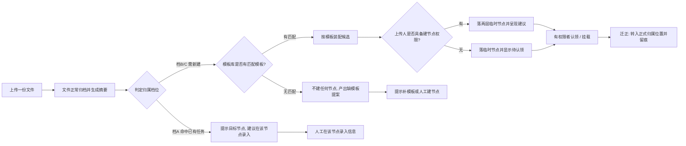
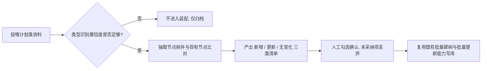
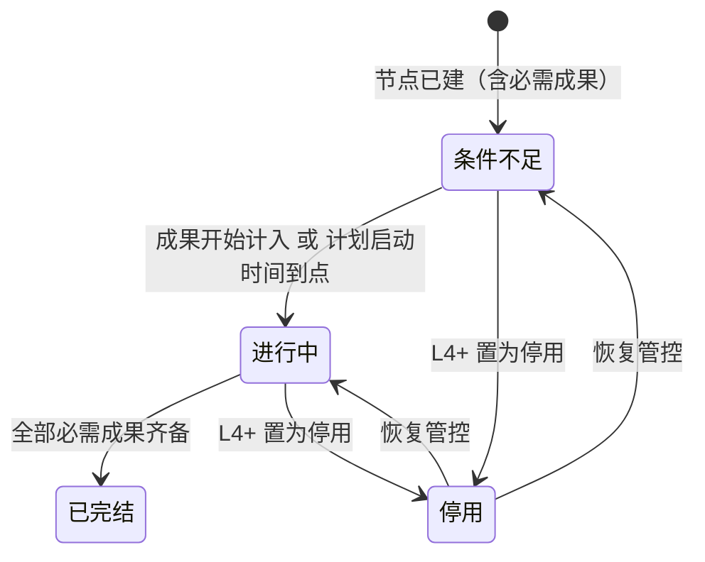
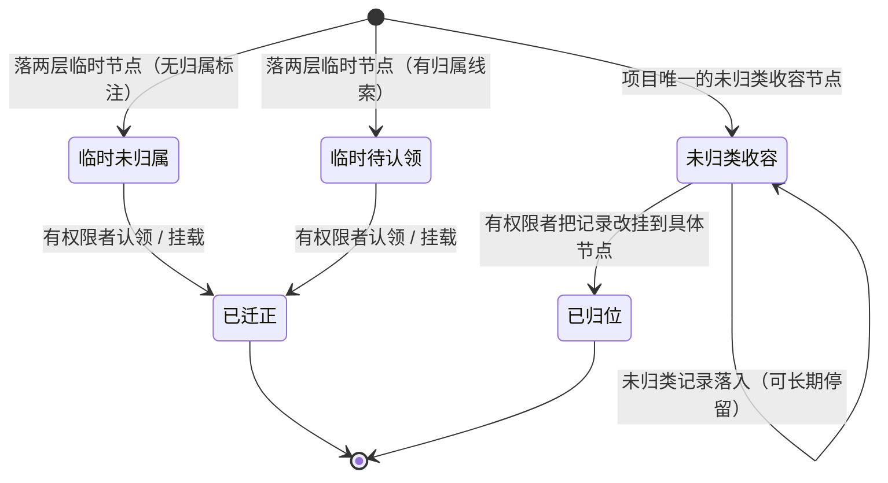

# 全景节点 — PRD（规格 / Spec）

> **日期**：2026-09-22
> **来源**：[全景节点_需求基线_V1.md](./全景节点_需求基线_V1.md)（2026-09-22，含 §十一 已定口径 D1–D14 与 §十二 逐项回答）
> **参与角色**：需求分析师、作为 Emily 开发者资深架构师、技术总监、（自适应）资深测试工程师、企业主数据治理工程师
> **宪法版本**：v1.2
> **阶段**：Specify（规格）——方案型技术设计见后续 `全景节点_计划_V*.md`

---

## 一、背景与目标

### 1.1 背景

全景节点的原子能力齐备（建节点、成果提交、依赖挂载、编号生成），但**判断能力缺失**：该不该建节点、该挂在哪里、建成什么样，完全依赖操作人。模板库已有位置却无消费者——索引只扫顶层单文件、没有 LLM 可调用的读取通道、节点管理 SOP 未提及模板；文件与节点之间也不存在关联链路（没有成果匹配器，"上传文件 → 反推属于哪个节点、该节点是否已完成"整条链缺失）。

由此产生四个已被实测证实的问题：

| # | 问题 | 现状事实 |
|---|------|---------|
| 1 | 「未归属 / 未迁正」没有容器 | 现有未归类兜底只是一个**归属标记**（挂在事件记录上），不承载新节点，也没有认领与迁正流程 |
| 2 | 模板有位置、无消费者 | 模板解析与装配逻辑内联在控制台路由层，LLM 侧无工具、无注册、SOP 未声明 |
| 3 | 人工出口不全 | 节点只有三态，缺「停用」；没有"计划启动时间"，激活条件无从判定 |
| 4 | 阶段口径与数据结构脱节 | 阶段列已随迁移删除（阶段不入库），但填报口径仍以"所属阶段入库"表达 |

**结论**：把"模板蓝图 + 对象装配 + 归属判断 + 收容迁正"作为一套**可注册能力**落地——三条能力线（模板库 → 装配 → 判断）共用三书为共识来源，判断只出建议、不擅自改图。

### 1.2 目标与成功指标

| 目标 | 成功指标（可度量） |
|------|------------------|
| G1 模板可发现 | 对话中可列出模板清单并读出任一模板的成果清单、对象声明与附件清单；该只读能力在能力注册通道内且带参数约束（可静态检出），无"仅注册无调用" |
| G2 装配可声明 | 给定一份声明了四类对象的模板，装配能产出**候选集合**（非单值）；每条候选可回指"依据模板哪一条声明、匹配到什么"；未经确认的动作后相关表行数不变 |
| G3 节点可锚定 | 构造"模板库无匹配"的文件上传：新建节点数 **0**、提案数 **1**（附来源文件与匹配尝试依据）；构造"有匹配"：新建节点携带模板来源且装配项齐全 |
| G4 归属可判断 | 三档判定各自命中正确档位并给出依据；判定全过程节点图变更数为 **0**（只出建议） |
| G5 收容可控 | 未迁正节点与未归类业务事件 100% 落在**真实节点**上（全库不存在"有归属却无节点承载"的记录）；可被 L4+ 或创建者本人看到；迁正后临时标记残留 **0**、节点编号未变、迁正动作有留痕 |
| G6 不阻断 | 模板库不可用 / 索引损坏 / 分析失败三种故障下，文件归档与人工建节点成功率 **100%**，故障仅体现为「缺模板」提案 |
| G7 控制台同源 | 控制台模板与装配相关端点的路由层业务解析残留 **0** 处；控制台与对话/脚本使用同一份能力实现 |

### 1.3 非目标（明确不做）

1. **不重建节点三态与"完成自证"口径**——类型两层制、状态纯派生（退役父子聚合）、里程碑成果强制已落地（P0），本需求不重复实施。
2. **不做生产存量业务数据迁移**——仅两类对齐作业在本范围内：模板库形态收敛涉及的存量模板迁移（US-01 回归项）、存量未归类事件的归属对齐（US-15.10）。
3. **不新造知识源**——规则书 / 态势书 / 能力书复用，不新建知识库。
4. **不做常驻 agent、不引入 A2A 通道**；不因本能力给普通对话增加额外 LLM 调用。
5. **不放开自动建节点**——模板匹配失败一律不建节点；演进方向是补齐模板库（见 §六 风险 1）。
6. **不新造权限规则**——节点创建 / 批量建树 / 成果提交 / 参与单位维护沿用既有判定。
7. **不在本需求内做企业台账数据治理**——企业类型同义词归一只做"可巡检 + 告警"，数据清洗并行推动（见 §六 风险 2）。
8. **不改成果上报与匹配算法口径**——除"文件 → 节点完成反推"的提示行为外。
9. **阶段不入库**——阶段只存在于模板侧字段与展示层分组。
10. **不做界面视觉重构**——控制台仅在既有面板上扩展。
11. **不引入新依赖**（宪法 Q5）。

---

## 二、需求登记表（核心章节）

### 2.1 用户故事与验收标准

#### 功能域 A：模板库（蓝图可发现）

**US-01**｜角色：节点维护者 / Emily 对话使用者｜场景：新增或迁移一个节点模板｜期望：模板以**自洽单元**（固定命名的结构化清单入口 + 附件）存在，索引能自动发现它，我不用改代码｜优先级：P0

| AC-ID | 验收标准（可判定） | 验证方式 |
|-------|------------------|---------|
| AC-US-01.1 | 一个模板单元可被识别为：固定命名的结构化清单入口 + 附件；清单文件承载入库所需字段（至少模板编号、节点名称、节点类型），任意文本格式只开放给附件 | 模板目录结构比对 |
| AC-US-01.2 | 索引扫描**递归覆盖子目录**（含"模板目录套资料文件夹"的现存形态），不再只扫顶层单文件 | 索引输出条目比对 |
| AC-US-01.3 | 索引登记附件清单（文件名 / 大小 / 类型） | 索引输出字段比对 |
| AC-US-01.4 | `counterpart`：新增一个符合形态的模板单元 → 重建索引后该模板出现在索引中（写入 → 索引可见） | 新增前后索引条目数 |
| AC-US-01.5 | 存量模板迁移后，模板编号 / 节点名称 / 节点类型 / 摘要四项输出与迁移前**完全一致**（回归项） | 迁移前后索引 diff |
| AC-US-01.6 | 模板目录以**只读**方式挂入，容器内不可写；各部署变体挂载口径一致 | 容器内写测试 + 挂载配置比对 |

**US-02**｜角色：Emily 对话使用者｜场景：问"有哪些节点模板 / 某模板要求交什么成果"｜期望：能列出模板清单、读出指定模板的完整内容｜优先级：P0

| AC-ID | 验收标准（可判定） | 验证方式 |
|-------|------------------|---------|
| AC-US-02.1 | 提供**一个**只读检索能力（不拆成多个），可按类型 / 关键词过滤列出模板清单，可读取指定模板的清单 + 对象声明 + 附件清单 | 对话回复 / 能力调用结果 |
| AC-US-02.2 | 该能力只读、幂等：调用前后相关表行数不变 | 调用前后行数比对 |
| AC-US-02.3 | 该能力经**能力注册通道**接入并带参数约束，未带约束时不进入可用能力 | 注册与一致性校验 |
| AC-US-02.4 | `counterpart`：注册的能力在 SOP 声明与实际对话调用两条路径均可达（注册 → 调用闭合） | 静态可达性扫描 + 一次实际调用 |
| AC-US-02.5 | 该能力失败（模板库缺失 / 索引损坏）时返回明确失败而非异常冒泡，且不影响文件归档与节点创建 | 故障注入 |

**US-03**｜角色：Emily 对话使用者 / 节点维护者｜场景：了解"模板库是什么、怎么用、谁能用"｜期望：节点管理 SOP 声明模板库的位置、发现方式、使用方式与权限口径｜优先级：P0

| AC-ID | 验收标准（可判定） | 验证方式 |
|-------|------------------|---------|
| AC-US-03.1 | 节点管理 SOP 增补"参考模板库"一节：位置、发现方式、使用方式、权限门槛（L4+），并声明"模板是判断依据 / 参考蓝图，不是硬规则" | SOP 文件比对 |
| AC-US-03.2 | 仅增一节，**不改**既有触发条件、工具清单与权限映射 | SOP diff |
| AC-US-03.3 | `counterpart`：移除该 SOP 声明文件后重启 → 模板读取能力不可用且无残留触发器（证明经注册通道接入） | 能力目录 + 静态可达性扫描 |
| AC-US-03.4 | 模板列出 / 读取的门槛为 **L4+**；低于 L4 的调用被明确拒绝 | 分权限级别调用 |

**US-04**｜角色：控制台使用者 / 对话使用者 / 批量脚本使用者｜场景：同一个模板装配动作从不同入口发起｜期望：三个入口行为一致，内容同源｜优先级：P0

| AC-ID | 验收标准（可判定） | 验证方式 |
|-------|------------------|---------|
| AC-US-04.1 | 模板解析与装配能力由**能力层**提供，控制台、对话、批量脚本共用同一实现（不各写一份） | 代码检索 + 三入口结果比对 |
| AC-US-04.2 | 控制台相关路由层**不再残留**业务解析 / 装配逻辑 | 路由层静态检查 |
| AC-US-04.3 | 同一模板经三入口装配出的候选集合一致（顺序可不同，集合内容必须相同） | 三入口输出 diff |

**US-05**｜角色：节点维护者｜场景：模板附带了参考范例（表格 / 文档 / 图）｜期望：附件能被人查看下载，但不要求系统解析它｜优先级：P1

| AC-ID | 验收标准（可判定） | 验证方式 |
|-------|------------------|---------|
| AC-US-05.1 | 附件是"给人看 / 给人下载"的参考物；索引只登记附件清单，不解析附件内容 | 索引字段 + 无解析调用 |
| AC-US-05.2 | 二进制附件（表格 / 文档 / PDF）不进入本模块解析链路 | 无解析路径可达 |
| AC-US-05.3 | 附件缺失或不可读时，模板仍可被列出与读取，装配链路不受影响 | 故障注入 |

#### 功能域 B：对象装配（声明 → 采集 → 草稿 → 落库）

**US-06**｜角色：节点维护者｜场景：编写模板，声明"建这个节点要采集哪些对象"｜期望：声明是**结构化、可校验**的，写错了会被告警而不是被静默忽略｜优先级：P0

| AC-ID | 验收标准（可判定） | 验证方式 |
|-------|------------------|---------|
| AC-US-06.1 | 模板内设机器可读的对象声明区，按对象类型（参与单位 / 成员 / 共享文件 / 前置成果）分节，每条含「描述 / 匹配条件 / 是否必需」 | 模板文件比对 |
| AC-US-06.2 | 匹配条件为**声明式**（非脚本式、非声明+脚本混合）：参与单位为类型归一 + 范围关键词 + 名称关键词；成员为来源单位 + 可选角色；共享文件为文件名/类型关键词；前置成果为成果名关键词 | 声明结构校验 |
| AC-US-06.3 | 声明**不进索引**，随模板内容按需读取 | 索引字段比对 |
| AC-US-06.4 | 声明语法错误 / 类型越出词表 / 引用不存在的来源单位 → 产出**告警**，不得静默忽略 | 故障模板注入 |

**US-07**｜角色：节点维护者｜场景：按模板装配"参与单位"与"成员"候选｜期望：系统给出**候选集合**供我增删，而不是替我猜一个值｜优先级：P0

| AC-ID | 验收标准（可判定） | 验证方式 |
|-------|------------------|---------|
| AC-US-07.1 | 参与单位候选池：**项目内参建单位优先**，未命中退全局企业 | 装配结果比对 |
| AC-US-07.2 | 企业匹配判据 = **类型归一化后等值匹配 + 范围与名称关键词包含匹配**；不使用 LLM 语义挑选 | 装配结果 + 无 LLM 参与证据 |
| AC-US-07.3 | 装配返回**候选集合**（非单值）；既有单值精确解析语义**并存不改** | 返回结构 + 回归既有场景 |
| AC-US-07.4 | 成员候选由已确定的参与单位推出该单位**在职人员**，候选带出所属单位；默认候选集为该企业全员 | 装配结果比对 |
| AC-US-07.5 | 类型越出同义词表 / 范围字段缺失的情况**可巡检**（产出告警），不以静默降级掩盖 | 巡检输出 |
| AC-US-07.6 | `counterpart`：装配产出的候选落在草稿中并被落库链路消费（产出 → 消费可见） | 草稿字段 + 落库结果 |

**US-08**｜角色：节点维护者｜场景：按模板装配"共享文件"与"前置成果（依赖）"候选｜期望：候选受我的可见范围约束，依赖只能指向已存在的成果｜优先级：P0

| AC-ID | 验收标准（可判定） | 验证方式 |
|-------|------------------|---------|
| AC-US-08.1 | 共享文件候选范围**必须限定在操作人可见文件集合内**，越权文件不得出现在候选中 | 分权限级别装配比对 |
| AC-US-08.2 | 共享文件匹配 = 文件名 / 类型关键词包含匹配 | 装配结果 |
| AC-US-08.3 | 前置成果在**项目内已有成果**中匹配：整句优先、无命中退主体词；双向子串匹配；多命中取名称最长者 | 装配结果比对 |
| AC-US-08.4 | 依赖落库必须发生在节点创建**之后**（依赖只能指向已存在的成果） | 落库顺序 + 依赖表记录 |
| AC-US-08.5 | 零候选时不报错，草稿中显式呈现"未解析项"（见 US-09） | 空匹配注入 |

**US-09**｜角色：节点维护者｜场景：查看装配结果｜期望：产物是**只读草稿**，可反复调用、可增删，且每条候选都说得清"凭什么"｜优先级：P0

| AC-ID | 验收标准（可判定） | 验证方式 |
|-------|------------------|---------|
| AC-US-09.1 | 装配产物为只读草稿：不写库、可反复调用（重复调用结果稳定） | 调用前后行数 + 两次结果比对 |
| AC-US-09.2 | 候选呈现给人可增删；未经确认不落库 | 交互 + 库内记录 |
| AC-US-09.3 | **未解析项必须单列回显**，不得静默丢弃 | 草稿输出 |
| AC-US-09.4 | 每条候选能回答"依据模板的哪一条声明、匹配到什么、为什么命中" | 草稿依据字段 |
| AC-US-09.5 | 该可解释信息在**控制台与对话回复中均可见**（同一份依据，两个出口） | 两出口输出比对 |

**US-10**｜角色：节点维护者 / 安全审计｜场景：装配与落库过程中涉及各类编号｜期望：编号由**服务端解析得出**，LLM 绝不生成编号｜优先级：P0

| AC-ID | 验收标准（可判定） | 验证方式 |
|-------|------------------|---------|
| AC-US-10.1 | 所有编号（节点 / 成果 / 单位 / 用户 / 文件 / 依赖）由服务端从声明解析得出；LLM 只转述候选 | 装配链路检查 |
| AC-US-10.2 | 解析不出的项被丢弃并**回报**，不得以编造编号代替 | 故障注入 + 回报内容 |
| AC-US-10.3 | 越权 / 不存在的项被丢弃并回报 | 越权注入 |

**US-11**｜角色：节点维护者｜场景：确认装配草稿后建节点｜期望：确认一次就把**节点 + 成果 + 参与单位 + 参与人 + 共享文件 + 依赖**全部落库，单项失败不毁掉整个节点｜优先级：P0

| AC-ID | 验收标准（可判定） | 验证方式 |
|-------|------------------|---------|
| AC-US-11.1 | 创建期按依赖顺序落库：节点 → 成果 → 参与单位 → 参与人 → 共享文件 → 依赖 | 落库结果 + 顺序证据 |
| AC-US-11.2 | 服务端对每个编号做存在性与归属校验；越权 / 不存在项丢弃并回报 | 越权注入 |
| AC-US-11.3 | **单项失败不阻断节点创建**：节点必成功，失败项在回报中列出 | 故障注入（构造一条不可落库的候选） |
| AC-US-11.4 | 人工建节点路径（控制台信息面板 / 对话）同样支持"确认后一次性落库"，无需事后另行维护参与单位 / 参与人 / 共享文件 | 两入口各建一个节点 |
| AC-US-11.5 | `counterpart`：落库后的参与单位 / 参与人 / 共享文件 / 依赖在节点查询与全景视图中均可见（写入 → 下游可见） | 节点查询输出 |

#### 功能域 C：归属判定与收容迁正

**US-12**｜角色：节点维护者 / 项目管理人员｜场景：上传一份文件，触发节点自动补建｜期望：**必须命中模板才建节点**，没模板就只出提案，不产生任何节点｜优先级：P0

| AC-ID | 验收标准（可判定） | 验证方式 |
|-------|------------------|---------|
| AC-US-12.1 | 门禁**仅**作用于"文件上传触发的节点自动补建"；人工建节点、整树装配不受此硬门禁限制 | 分入口验证 |
| AC-US-12.2 | 匹配强度 = 必须命中模板库中**已存在的模板编号**；不允许类别近似 / 同专业派生 / LLM 软匹配等降级命中 | 弱匹配文件注入 |
| AC-US-12.3 | 命中后按该模板装配节点字段与成果清单、对象声明，落库携带模板来源 | 落库记录 |
| AC-US-12.4 | 未命中 → **不创建任何节点**（含临时节点），仅产出一条「缺模板」提案：写明"这份文件指向的节点在模板库无匹配"，附来源文件与匹配尝试依据 | 节点数 0 + 提案内容 |
| AC-US-12.5 | 模板库不可用 / 索引损坏 / 检索能力异常 → 一律按"未命中"处理，且文件归档与人工建节点主链路**照常成功** | 三种故障注入 |
| AC-US-12.6 | `counterpart`：门禁拒建的同时，人工路径对同一份文件仍可建节点（能力可替代，不阻断业务） | 同文件两路径对照 |

**US-13**｜角色：项目管理人员｜场景：一份新信息进来，系统判断它该挂哪里｜期望：给出**三档判定结论 + 依据**，只出建议不改图｜优先级：P0

| AC-ID | 验收标准（可判定） | 验证方式 |
|-------|------------------|---------|
| AC-US-13.1 | 档 A（命中某里程碑下已有任务预定的内容）→ 反馈目标节点，建议在该节点录入信息；**不新建节点、无需模板** | 对话回复 + 节点数不变 |
| AC-US-13.2 | 档 B（未命中已有任务但有里程碑级归属）→ 先过门禁：命中则按模板装配，有权限落临时节点（认领/挂载后迁正），无权限落临时节点等待认领；未命中则不建节点只出提案 | 分权限 × 分模板命中 四象限验证 |
| AC-US-13.3 | 档 C（无里程碑级归属）→ 先过门禁：命中则落临时节点并标「无归属」等待认领；未命中则不建节点只出提案 | 同上 |
| AC-US-13.4 | 判定**必须给出依据**（命中的规则条目 / 命中的模板编号及其具体条目 / 来源文件） | 回复与草稿内容 |
| AC-US-13.5 | 判定与建议全过程**不擅自改图**：节点、父子关系、状态在建议阶段变更数为 0 | 前后比对 |
| AC-US-13.6 | 资料口径与规则冲突时**显性输出冲突**交人裁决，不静默二选一 | 冲突样本注入 |

**US-14**｜角色：项目管理人员｜场景：上传的文件正是某节点的必需成果（尤其里程碑）｜期望：系统提示归属并**询问**是否标记完成，不自动改状态｜优先级：P0

| AC-ID | 验收标准（可判定） | 验证方式 |
|-------|------------------|---------|
| AC-US-14.1 | 文件被判定为某节点必需成果时，提示"该文件像是 X 节点的成果"并给出节点编号 | 对话回复 |
| AC-US-14.2 | 建议标记该节点完成，但**必须询问有权限者批准**；未获批准前节点状态不变 | 状态查询 |
| AC-US-14.3 | 系统**不自动改状态**（含成果完成量与节点状态的自动写入均为 0） | 前后数据比对 |
| AC-US-14.4 | 无权限者收到的是提示而非操作入口；有权限者获得可确认的动作 | 分权限验证 |

**US-15**｜角色：节点维护者 / 上传人｜场景：新节点还不该落正式位置，或一条信息不知道该归哪个节点｜期望：两种情况都落入**真实的收容节点**，不设超时、长期挂起即可｜优先级：P0

| AC-ID | 验收标准（可判定） | 验证方式 |
|-------|------------------|---------|
| AC-US-15.1 | 收容结构分两层：根图下的**临时里程碑**、某里程碑下的**临时任务** | 节点树结构 |
| AC-US-15.2 | 收容对象 = 无归属信息 + 未迁正节点；两者在收容区可区分呈现（含「无归属」标注） | 收容区输出 |
| AC-US-15.3 | 临时节点**按需（懒）创建**，不按阶段 / 里程碑预建 | 空项目下不产生临时节点 |
| AC-US-15.4 | **不设待认领超时**：长期挂起不产生自动清理 / 自动迁正 | 时间推移后状态不变 |
| AC-US-15.5 | 可见范围 = L4+；**创建者本人始终可见自己的节点**（即使低于 L4） | 分权限 × 分创建者验证 |
| AC-US-15.6 | 未迁正节点的存在与否**可被单独识别**（供收容区与汇总口径使用） | 收容区查询 |
| AC-US-15.7 | **未归类业务事件的兜底落点也是真实节点**，不是无节点承载的标记：每个项目有且仅有一个未归类收容节点，位于临时里程碑层 | 数据核对 + 项目级唯一性扫描 |
| AC-US-15.8 | 未归类收容节点可被 L4+ 看到；归属到它的事件在检索与呈现中标注为「待归类」，不呈现为"无归属 / 坏数据" | 分权限查询 + 呈现检查 |
| AC-US-15.9 | `counterpart`：任何事件的归属都指向**真实存在且在项目内可解析的节点**（归属 → 节点可解析闭合） | 全量归属一致性扫描 |
| AC-US-15.10 | 存量未归类事件的归属对齐完成后，全库无"归属指向非节点"的记录；对齐过程可回溯 | 迁移前后全量扫描 |
| AC-US-15.11 | 临时节点与未归类收容节点是**容器**而非业务节点：不要求必需成果、不计入完成度汇总、不产生到期提醒、不得作为依赖目标 | 容器行为验证 + 汇总输出（见 §4.4-19） |

**US-16**｜角色：节点维护者（各节点所有者）｜场景：认领 / 挂载一个临时节点，或把一条未归类信息挂到具体节点｜期望：认领即迁正、归位即改挂，两者都留痕｜优先级：P0

| AC-ID | 验收标准（可判定） | 验证方式 |
|-------|------------------|---------|
| AC-US-16.1 | 各节点所有者可认领临时节点；认领 / 挂载即完成迁正：从临时区转入正式归属位置，临时标记消失 | 迁正前后节点树 |
| AC-US-16.2 | 迁正动作记入节点事件留痕（操作人 + 时间 + 由何处转入何处） | 节点事件记录 |
| AC-US-16.3 | 迁正**不改变节点编号**，因此挂在其上的成果 / 事件 / 参与关系无需搬迁，无孤儿数据 | 迁正前后子表归属比对 |
| AC-US-16.4 | 存量签认三列仅作**纯标记**保留：不参与状态判定、不参与迁正判定；检索回复中不出现"未签认"标注 | 静态检索 + 回复文本检查 |
| AC-US-16.5 | `counterpart`：迁正后该节点在正式归属位置的查询、全景视图、完成度汇总中均可见（写入 → 下游可见） | 三处输出 |
| AC-US-16.6 | **事件归位**与节点迁正是两个独立动作：把一条事件从未归类收容节点改挂到具体节点时，留痕须记录改挂前归属、改挂后归属与操作人 | 事件记录 |
| AC-US-16.7 | 事件归位不改变事件编号，也不改变被归入节点（收容节点）自身的归属与状态 | 前后比对 |

**US-17**｜角色：项目管理人员｜场景：想让某个节点退出管控（不再适用）｜期望：可置为「停用」，节点留在图中但不再参与管控｜优先级：P0

| AC-ID | 验收标准（可判定） | 验证方式 |
|-------|------------------|---------|
| AC-US-17.1 | 新增节点状态「停用」；**仅 L4+** 可操作，L3 执行同一操作被拒 | 分权限验证 |
| AC-US-17.2 | 停用后：不计入完成度汇总、不产生到期提醒、不得挂载新任务 | 三项分别验证 |
| AC-US-17.3 | 节点仍留在全景图中（不消失） | 节点查询 |
| AC-US-17.4 | 停用需留痕（谁 / 何时 / 为何）；且**非终态、可恢复** | 留痕记录 + 恢复操作 |
| AC-US-17.5 | `counterpart`：停用状态被完成度汇总与提醒链路实际读取（产出 → 消费生效） | 汇总/提醒输出比对 |

**US-18**｜角色：项目管理人员｜场景：节点在什么条件下进入/离开展开管控（激活 / 完成）｜期望：激活与完成的触发条件明确、可判定；相对时间锚点可推算｜优先级：P0

| AC-ID | 验收标准（可判定） | 验证方式 |
|-------|------------------|---------|
| AC-US-18.1 | 节点具备「计划启动时间」这一信息（当前不存在，本需求内补齐） | 节点信息输出 |
| AC-US-18.2 | 激活条件 = 已有任务级节点录入 **或** 计划启动时间到点 | 两条路径分别验证 |
| AC-US-18.3 | 完成条件 = 必需成果齐备（沿用既有自证口径，不在本需求内改动） | 回归既有场景 |
| AC-US-18.4 | 相对锚点（如"取得施工许可证后 30 天"）→ 取被锚定节点的计划时间推算为**具体日期**，不凭空猜测年度 / 季度 | 输入输出比对 |
| AC-US-18.5 | 被锚定节点无计划时间时，产出待确认项而非猜测值 | 空锚点注入 |

#### 功能域 D：资料整树装配与规律沉淀

**US-19**｜角色：项目管理人员｜场景：投喂一份计划类资料（全景计划 / 进度计划）｜期望：产出**变更草案**，我勾选确认后才写库｜优先级：P1

| AC-ID | 验收标准（可判定） | 验证方式 |
|-------|------------------|---------|
| AC-US-19.1 | 两个入口：文件归档后异步挂载分析；或用户显式指定"按这份资料更新全景节点"。上传主链路不被阻断 | 两入口验证 |
| AC-US-19.2 | 类型识别判定资料是否计划 / 全景类并输出**置信度**；低置信度不进入装配；结论与文件记录关联、可追溯 | 高/低置信样本 |
| AC-US-19.3 | 抽取节点树（名称 / 编号 / 截止时间 / 成果 / 前置依赖 / 父子层级），与现有节点比对产出「新增 / 更新 / 无变化」三类清单 | 草案内容 |
| AC-US-19.4 | 比对键优先节点编号，无编号时用"名称 + 项目" | 无编号样本 |
| AC-US-19.5 | **不因资料未提及而删除**任何现有节点或字段 | 缺项资料注入 |
| AC-US-19.6 | 草案**暂不落库**，确认后才执行写入；每项附资料出处；支持部分采纳，未采纳的丢弃 | 落库前后比对 |
| AC-US-19.7 | 写入复用既有批量建树 / 批量更新能力，按项目隔离，携带操作人与来源文件身份 | 落库记录 |
| AC-US-19.8 | 以模板库为比对参考系，能对应到模板的条目标注模板编号；本入口逐条人工确认，**不适用硬门禁** | 草案内容 |
| AC-US-19.9 | 同一份资料重复投喂 → 不产生重复节点、不重复更新（幂等）；同一份文件重复归档不产生重复节点 | 重复投喂 |

**US-20**｜角色：项目管理人员 / 流程负责人｜场景：项目结束或积累了一定人工改图记录｜期望：提炼**规则候选 + 支撑样本**，经人确认后升级为标准｜优先级：P2

| AC-ID | 验收标准（可判定） | 验证方式 |
|-------|------------------|---------|
| AC-US-20.1 | 从往期项目节点图与人工改节点记录中提炼规则候选，并附**支撑样本** | 产出内容 |
| AC-US-20.2 | 规则候选必须可追溯样本；**禁止**无依据的"经验总结" | 无样本候选不得产出 |
| AC-US-20.3 | 经人确认后才升级为标准并落入三书；未确认的仅停留为候选 | 三书内容 |
| AC-US-20.4 | `counterpart`：确认后的标准被能力侧复用（写入 → 消费生效，体现在判断依据中） | 判定依据输出 |

#### 功能域 E：共通口径

**US-21**｜角色：项目管理人员 / 审计｜场景：查看编号与操作记录｜期望：编号规则统一、每步操作可追溯｜优先级：P0

| AC-ID | 验收标准（可判定） | 验证方式 |
|-------|------------------|---------|
| AC-US-21.1 | 节点编号沿用现有规则；资料 / 文件已给出编号的，以给定编号为准 | 编号比对 |
| AC-US-21.2 | 新增编号与模板库编号映射不冲突 | 冲突扫描 |
| AC-US-21.3 | 建议、落库、迁正、停用**均留痕**（建议依据 + 操作人 + 结果），审计口径与手工操作一致 | 留痕记录 |
| AC-US-21.4 | 自动补建的节点留痕"装配它的模板编号" | 节点记录 |
| AC-US-21.5 | 能力可整体下线：移除 SOP 声明后系统回落为手工路径，无残留触发器 | 下线演练 |

### 2.2 US 清单（下游追溯锚点）

| US-ID | 一句话 | 优先级 | 状态 |
|-------|--------|--------|------|
| US-01 | 模板以"清单文件 + 附件"自洽单元存在，索引递归覆盖子目录与附件 | P0 | 生效 |
| US-02 | 一个只读检索能力：列清单 + 读详情，经注册通道接入 | P0 | 生效 |
| US-03 | 节点管理 SOP 声明模板库位置/用法/权限（L4+），移除即能力下线 | P0 | 生效 |
| US-04 | 模板解析与装配下沉能力层，控制台/对话/脚本同源 | P0 | 生效 |
| US-05 | 附件只登记不解析，缺失不影响主链路 | P1 | 生效 |
| US-06 | 对象声明结构化、可校验，错误告警不静默 | P0 | 生效 |
| US-07 | 参与单位与成员采集：返回候选集合，类型归一 + 范围包含，成员默认全员 | P0 | 生效 |
| US-08 | 共享文件受操作人可见范围约束；前置成果仅指向既有成果 | P0 | 生效 |
| US-09 | 装配产物为只读草稿，未解析项回显，每条候选可解释且两出口可见 | P0 | 生效 |
| US-10 | 所有编号由服务端解析生成，LLM 不生成编号 | P0 | 生效 |
| US-11 | 确认后一次性落库六类对象，单项失败不阻断节点创建 | P0 | 生效 |
| US-12 | 模板锚定硬门禁：未命中不建任何节点，只出「缺模板」提案 | P0 | 生效 |
| US-13 | 三档归属判定，给依据、只出建议、不改图、分歧显性 | P0 | 生效 |
| US-14 | 文件 → 节点完成反推：只提示 + 询问批准，不自动改状态 | P0 | 生效 |
| US-15 | 两层临时节点 + 未归类收容节点（均为真实节点）收容未归属信息与未迁正节点，按需创建、不设超时、L4+/本人可见 | P0 | 生效 |
| US-16 | 认领/挂载即迁正、事件归位即改挂；编号不变、留痕、签认标记不参与判定 | P0 | 生效 |
| US-17 | 节点「停用」态：L4+ 可操作，退出管控、可恢复、留痕 | P0 | 生效 |
| US-18 | 计划启动时间字段 + 激活/完成触发条件 + 相对锚点推算 | P0 | 生效 |
| US-19 | 资料整树装配：草案确认后写入，不因未提及而删除，幂等 | P1 | 生效 |
| US-20 | 从历史记录沉淀规则候选（带样本），人确认后入三书 | P2 | 生效 |
| US-21 | 编号规则统一 + 全链路留痕 + 能力可整体关闭 | P0 | 生效 |

> req-plan 依此声明各模块实现哪些 US；req-verify 依此逐条回验并输出规格符合度。

---

## 三、业务规则与流程

### 3.1 业务规则

| # | 规则 | 说明 |
|---|------|------|
| R1 | **模板是唯一蓝图来源** | 文件触发的节点自动补建必须命中模板库已有模板编号；匹配失败一律不建节点 |
| R2 | **判断只出建议** | 归属判定、完成反推、缺模板处置全程只出建议与提案，不擅自改节点图、不自动改状态 |
| R3 | **收容先于迁正** | 未归属信息与未迁正节点一律先落两层临时节点，由有权限者认领 / 挂载后迁正 |
| R4 | **迁正不换编号** | 迁正只改归属位置与临时标记，节点编号恒定，挂载在其上的成果 / 事件 / 参与关系随之生效 |
| R5 | **ID 由服务端生成** | LLM 只转述候选，绝不生成编号；解析不出的丢弃并回报 |
| R6 | **声明式可校验** | 对象声明是结构化声明式，错误必须告警，不得静默忽略 |
| R7 | **候选而非单值** | 采集器返回候选集合供人增删；既有单值精确解析语义并存不改 |
| R8 | **越权即丢弃** | 越权 / 不存在的候选项一律丢弃并回报，不得以近似值代替 |
| R9 | **不阻断** | 模板库缺失、索引损坏、分析失败、单项落库失败均不影响文件归档与节点创建主链路 |
| R10 | **幂等** | 重复归档、重复投喂不产生重复节点、不重复更新 |
| R11 | **阶段不入库** | 阶段仅存在于模板侧字段与展示层分组 |
| R12 | **停用非终态** | 停用是退出管控的人工操作，可恢复；停用不计完成度、不提醒、不可挂新任务 |
| R13 | **权限不新造** | 一律沿用既有判定：建节点 / 批量建树 L5+；成果提交 L2/L3+；模板读取与临时节点查看 L4+；参与单位维护 L5+ |
| R14 | **分歧不隐藏** | 资料与规则冲突时显性输出冲突交人裁决 |
| R15 | **能力可整体下线** | 移除 SOP 声明即回落手工路径，无残留触发器 |
| R16 | **归属即节点** | 任何"某条记录归到哪里"的表达都必须指向真实存在的节点；未归类记录落到本项目唯一的收容节点，改挂到具体节点称为「归位」 |
| R17 | **模板库人工维护** | 系统不得自动制作模板；模板库由人工补齐，未命中时按人的要求走人工建节点路径 |

### 3.2 业务流程（业务级）

> 此图展示：一份文件上传后，系统如何从"归档"走到"节点建议 / 收容 / 提案"。

> 此图展示：一份计划类资料投喂后，草案确认流程。

### 3.3 业务状态流转

> 仅描述业务可见状态。节点自身三态沿用既有自证口径（不在本需求内改动），此处只补「停用/恢复」与「临时 → 迁正」。

---

## 四、边界与约束

### 4.1 触碰的宪法铁律

| 铁律 | 影响 | 处理 |
|------|------|------|
| **C0 根治而非迁就** | 本需求是根源性补齐（把"该不该建 / 该挂哪里"显性化为能力），非绕过 | 遵循 |
| **C2 分层不可跳** | 模板解析、装配、判定均属能力层；控制台与对话只调用 | 遵循（见 US-04） |
| **C3 SOP 即路由** | 判断能力以 SOP 声明 + 运行时推导实现；新增 SOP 声明重启生效 | 遵循（US-03） |
| **C10 工具必须带参数 schema** | 新增只读检索能力与装配相关能力必须带参数约束，三步齐备 | 遵循（AC-US-02.3） |
| **C11 功能注册接入 + Q6 接线闭合** | 本需求新增能力较多，最易出现"仅注册无调用 / 仅写入无读取" | 逐条登记 §4.5，静态可达性扫描为验收项（AC-US-02.4 / US-03.3） |
| **C12 Session 主循环冻结** | 判断能力不得落进主循环；文件触发的判断也不得在主链路上硬编码 | 遵循（US-13 + §4.4-4）；若计划阶段发现需改主循环文件，须停下改走内核形态专项 |
| **C13 控制台 = 观察窗口** | 模板解析当前内联在控制台路由层，必须下沉后由控制台复用 | 遵循（US-04） |
| C1 / C4 / C5 / C6 / C7 / C8 / C9 | 不涉及 | — |

### 4.2 范围边界

| 在范围内 | 不在范围内 |
|---------|-----------|
| 模板库形态收敛、索引改造、存量模板迁移、只读挂载 | 节点三态与完成自证口径的重建（P0 已落地） |
| 模板只读检索能力与 SOP 声明 | 生产存量业务数据迁移 |
| 对象声明与四类采集器 | 企业台账数据清洗（仅做可巡检与告警） |
| 装配草稿、可解释、创建期落库编排 | 常驻 agent / A2A 通道 |
| 模板锚定门禁与「缺模板」提案 | 放开自动建节点 |
| 三档归属判定、文件→完成反推 | 成果上报与匹配算法口径调整 |
| 两层临时节点、认领迁正 | 界面视觉重构 |
| 节点「停用」态、计划启动时间、相对锚点推算 | 新造权限规则 |
| 资料整树装配、规律沉淀 | 阶段入库（阶段不入库，沿用既有口径） |

### 4.3 假设与依赖

| # | 假设 / 依赖 | 若不成立的影响 |
|---|------------|--------------|
| 1 | 既有节点创建、成果提交、依赖挂载、参与单位 / 参与人 / 共享文件维护能力可被复用 | 装配链路无落点，US-11 不可实现 |
| 2 | 创建期可接收参与人 / 共享文件 / 依赖入参（当前需在创建后另行维护） | 一次性落库退化为"建完再补"，US-11.4 不达标 |
| 3 | 节点创建类能力可携带模板来源（当前未实现） | AC-US-12.3 / US-21.4 不达标 |
| 4 | 文件归档链路可承载异步分析触发点，且不阻断上传 | US-13 / US-19 无触发入口 |
| 5 | 企业主数据的类型与范围字段质量可支撑归一匹配（依赖外部的数据治理并行推进） | 参与单位采集召回质量差，US-07 部分不达标 |
| 6 | 模板库覆盖度可随业务投入持续补齐 | 门禁下自动补建长期低效（见 §六 风险 1） |
| 7 | 三书内容可作为判断依据被读取 | R2 / US-13 依据不完整 |

### 4.4 约束型技术决策

> 约束（不是方案）：规定"必须/不得"什么，不规定"用哪个"实现。下游计划与测试据此校验。

| # | 约束 | 来源 / 理由 |
|---|------|-----------|
| 1 | **必须**复用既有节点、成果、依赖、参与单位、参与人、共享文件能力落库；**不得**新造一套节点体系 | 避免重复建设（C0） |
| 2 | 模板锚定门禁**不得降级**：不得类别近似、不得同专业派生、不得 LLM 软匹配 | D3，门禁是需求的核心 |
| 3 | 新增能力**必须**经注册通道接入并带参数约束；**不得**裸文件 / 裸调用 / 硬编码接线 | C11 / C10 |
| 4 | **不得**触碰 Session 主循环；判断逻辑以 SOP 声明 + 运行时推导实现，**不得**写成硬编码判断 | C12 / D12 |
| 5 | 控制台的动作与写库能力**必须**复用能力层；**不得**在路由层复刻或另写业务逻辑 | C13 |
| 6 | 模板目录**必须**只读挂载；装配链路**必须**全程只读，不得在装配过程中写库 | NFR-3 |
| 7 | **不得**引入新依赖；**不得**新建知识源（三书复用） | Q5 / D13 |
| 8 | **不得**新增常驻进程或通道（无 A2A、无常驻 agent） | NFR-2 |
| 9 | **不得**在普通对话中因本能力增加额外 LLM 调用 | NFR-2 |
| 10 | 零 schema 变更优先；确需新增字段须单独说明（本需求已确认需要"计划启动时间"，属必要新增） | NFR-5 |
| 11 | 迁正**不得**改变节点编号——否则挂载其上的成果 / 事件 / 参与关系将成为孤儿 | C0，收容迁正的根基 |
| 12 | 分析 / 装配 / 判定任何一步失败**不得**阻断文件归档与节点创建主链路 | NFR-1 / R9 |
| 13 | 写入类能力**必须**幂等：重复归档、重复投喂不产生重复节点 | R10 |
| 14 | LLM **不得**生成任何编号；编号一律由服务端从声明解析得出 | D10 |
| 15 | 越权 / 不存在的候选**不得**以近似值代替，必须丢弃并回报 | R8 / FR-ASM-6 |
| 16 | 归属**必须**指向真实存在的节点：**不得**用"无节点承载的标记"表达某条记录归到哪里；未归类业务事件一律落到本项目唯一的未归类收容节点（临时里程碑层） | 基线 §十二 第 8 项回答（收容统一到节点体系） |
| 17 | 停用状态**必须**被完成度汇总与到期提醒链路实际读取，**不得**只写状态不消费 | Q6 / AC-US-17.5 |
| 18 | 系统**不得**自动制作 / 生成节点模板；模板库只能由人工维护与补齐；未命中模板时按人的要求走人工建节点路径 | 基线 §十二 第 11 项回答 |
| 19 | **业务节点**（含任务）一律至少 1 条必需成果；**容器节点**（临时里程碑 / 临时任务 / 未归类收容节点）豁免此项，且不计完成度、不产生提醒、不得作为依赖目标 | 基线 §十二 第 10 项回答 + AC-US-15.11 |

### 4.5 产出物与消费方（接线清单）

| # | 产出物（能力） | 消费方（谁使用 / 何处生效） | 对应 US |
|---|--------------|--------------------------|--------|
| 1 | 模板清单与详情（只读能力） | 对话中的模板问答、装配链路、控制台展示、SOP 指引 | US-02 / US-03 |
| 2 | 对象声明解析结果（候选集合） | 装配草稿、创建期落库编排 | US-06 / US-07 / US-08 |
| 3 | 装配草稿（含依据与未解析项） | 控制台信息面板、对话确认、落库编排 | US-09 / US-11 |
| 4 | 模板锚定门禁结论 | 文件触发的自动补建、缺模板提案 | US-12 |
| 5 | 归属判定结论与依据 | 对话回复、控制台呈现 | US-13 |
| 6 | 两层临时节点、未归类收容节点与「无归属 / 待归类」标注 | 收容区呈现、认领迁正、事件归位、可见范围判定 | US-15 / US-16 |
| 7 | 迁正与归位留痕记录 | 节点事件、审计 | US-16 / US-21 |
| 8 | 「停用」状态 | 完成度汇总、到期提醒、挂载准入 | US-17 |
| 9 | 计划启动时间与相对锚点推算结果 | 激活触发、节点信息呈现 | US-18 |
| 10 | 整树装配草案 | 人工确认、既有批量建树 / 批量更新能力 | US-19 |
| 11 | 规则候选（含支撑样本） | 三书（经人确认后升级为标准） | US-20 |
| 12 | 「缺模板」提案 | 对话回复、控制台呈现、模板库补齐决策 | US-12 |

**未接线清单**：无。本需求所有产出物均已在表中登记消费方；实施阶段若发现某项无消费方，须回退补规格（Q6）。

---

## 五、替代方案

| 方案 | 内容 | 为何未采纳 |
|------|------|-----------|
| S1（被否） | 只做模板只读能力，不做门禁：LLM 自由决定建不建节点 | 自由度不可控，节点图质量回到"完全依赖操作人"，G3 无法达成 |
| S2（被否） | 门禁放宽为"类别近似 / 同专业派生"软匹配 | 软匹配无法解释、无法验收，且会持续产生错挂节点；D3 已定不允许 |
| S3（被否） | 无匹配时也先落临时节点，等认领 | 会产生大量无蓝图依据的临时节点，把收容区变成垃圾场；D2 已定不建 |
| S4（被否） | 建节点后由人逐项补参与单位 / 成员 / 共享文件 | 现状即如此，正是"人工出口不全"的成因；G2 要求一次装配 |
| S5（采纳） | **硬门禁 + 对象声明式装配 + 两层收容 + 认领迁正**：模板库是唯一蓝图，缺失就出提案并把补模板库作为演进方向 | 唯一能做到"可解释、可验收、不擅自改图"的组合 |

---

## 六、风险与开放问题

| # | 风险 / 开放问题 | 类型 | 影响 | 缓解 / 待决 |
|---|----------------|------|------|------------|
| 1 | **模板库覆盖度决定门禁上限**：当前模板库仅 3 个模板（均为前期阶段），门禁落地后自动补建将大概率只出「缺模板」提案 | 业务 | 自动补建成效低，用户体感"没做" | 已定：**系统不自动制作模板**，模板库只能由人工维护与补齐；未命中时按人的要求走人工建节点路径（§4.4-18）。"匹配不可控"的判定阈值与补库责任人**不进本需求验收口径**，作为观察项由业务方后续确定 |
| 2 | **企业台账数据质量**：企业类型为自由文本且写法不统一、范围字段缺乏规范化 | 约束 | 参与单位采集召回差，US-07 部分不达标 | 本需求只做"可巡检 + 告警"（AC-US-07.5）；数据治理并行推动 |
| 3 | **未归类兜底升级为真实节点后的连带面**（基线第 8 项已定）：兜底归属改由真实节点承载，收容与认领迁正统一到节点体系 | 约束 | 每项目需一个收容节点；写入方需先解析项目；存量归属需对齐 | 已定口径见 §4.4-16 与 US-15.7–15.10；已接受代价（写入从"无前置依赖"变为需先解析项目）。**随之待定两点**：① 可见范围落到既有节点权限模型的具体方式（是否为收容节点单独授权）；② 事件归位与节点迁正的留痕是否合并展示 |
| 4 | **成果必备的适用边界**（基线第 10 项已定：所有节点均要求） | 业务 | 若把容器节点一并纳入，收容容器将无法建立（与 US-15 冲突） | 已定：**业务节点**（含任务）一律至少 1 条必需成果；**容器节点**（临时里程碑 / 临时任务 / 未归类收容节点）豁免（§4.4-19 / AC-US-15.11）。**待确认**：若坚持容器也必须带成果，需改为"占位成果"方案并重定义容器的完成口径 |
| 5 | 自动补建的节点由系统创建，其"责任人"从何而来 | 业务 | 临时节点无人认领则长期挂起 | 已定不设超时、长期挂起；责任人取创建者 / 待认领人，认领时明确 |
| 6 | 两层临时节点在收容区长期积累后如何呈现 | 业务 | 收容区可读性下降 | 本需求只要求"可被单独识别"（AC-US-15.6）；呈现形态由展示层决定 |
| 7 | 相对锚点推算依赖被锚定节点的计划时间，链条可能断裂 | 业务 | 推算失败 | AC-US-18.5 要求产出待确认项而非猜测 |
| 8 | 类型两层制下"任务可含子任务"，任务与里程碑的区分只剩声明，可能出现语义混用 | 业务 | 类型失真 | 由填报与验收口径约束，本需求只保证"系统不改写" |
| 9 | 用户预期落差：原本"自己决定挂哪就挂哪"的习惯被门禁与收容改变 | 业务 | 使用阻力 | 以 R2 / R3 对外说明：系统只出建议与提案，认领权在人 |
| 10 | 控制台侧改动面较大（模板与装配相关面板），易残留业务逻辑 | 约束 | 违反 C13 | AC-US-04.2 设为验收项 |
| 11 | 判断能力依赖三书内容质量；三书若空泛，依据不成立 | 约束 | US-13 依据不完整 | 登记为依赖 4.3-7；三书维护属既有职责 |

---

## 附录 A：规格变更记录

| 版本 | 日期 | 变更内容 | 影响的 US |
|------|------|---------|----------|
| V1 | 2026-09-22 | 初版：由《全景节点_需求基线_V1》转换而来，覆盖模板库 / 对象装配 / 归属判定与收容 / 整树装配 / 共通五域，共 21 条 US。定稿时关闭基线 §十二 第 8（兜底归属升级为真实节点）、第 10（业务节点成果必备、容器豁免）、第 11（系统不自动制作模板）三项待定 | US-15 / US-16 / US-17 / §4.4 |

---

## 附录 B：留给 req-plan 的方案型技术问题

> 本技能**不解答**以下问题，仅登记为 req-plan / DD 的输入。
> **只登记"用哪个方案实现"类问题**；"必须 / 不得"类约束见 §4.4。

| # | 方案型技术问题 | 为何须在计划 / DD 阶段定 |
|---|---------------|----------------------|
| 1 | 对象声明的承载位：模板内独立小节，还是清单文件的一个字段（须与模板单元形态一并定，避免同一信息两处） | 涉及模板文件形态与解析契约；基线第 5 项未决 |
| 2 | 索引改造的具体结构：条目字段增删（目录 + 入口文件 + 附件清单）与存量条目的迁移方式 | 涉及索引契约与迁移作业 |
| 3 | 模板编号与目录命名的取舍（模板编号 vs "模板编号-节点名称"） | 涉及存量模板迁移范围 |
| 4 | 「临时节点」用何种方式表达（独立标志 / 层级标记 / 归属位置约定），以及它在节点树查询中的过滤方式 | 涉及数据形态与查询改造 |
| 5 | 两层临时节点的落点如何选择（何时进"临时里程碑"层、何时进"临时任务"层） | 涉及判定与落库编排的边界 |
| 6 | 创建期落库编排的入参扩展方式（参与人 / 共享文件 / 依赖如何进入创建期）与失败回滚策略 | 涉及既有创建能力的改造面 |
| 7 | 企业类型同义词表的存放形态与维护方式 | 涉及配置与运营 |
| 8 | 未归类事件的可见范围实现方式（如何绕过节点白名单而不破坏既有权限模型） | 涉及权限链路改造 |
| 9 | 模板锚定门禁的"匹配"由谁执行（检索能力 / 判定能力 / 调用方），以及匹配过程的可解释信息如何留存 | 涉及能力职责切分 |
| 10 | 停用态与既有三态判定、进度汇总、提醒链路的衔接方式 | 涉及状态机与多处消费方 |
| 11 | 计划启动时间的字段形态与相对锚点的推算时机（写入时算 / 读取时算） | 涉及数据一致性 |
| 12 | 整树装配的草案承载形态（暂存位置与生命周期）与部分采纳的持久化方式 | 涉及草案落库契约 |
| 13 | 模板能力整体下线的判定方式（如何证明"无残留触发器"） | 涉及验收方式 |
| 14 | 未归类收容节点的建立时机与"每项目唯一"的保证方式（建项目时建立，还是首次出现未归类记录时懒创建） | 涉及与项目生命周期的耦合、并发下的唯一性保证 |
| 15 | 存量未归类事件归属对齐的迁移方式与可回滚策略 | 涉及数据迁移范围与回滚 |
| 16 | 「容器节点」的识别方式（独立标志 / 归属位置约定）与其在既有校验链路上的豁免点 | 涉及建节点校验、完成度汇总、依赖校验多处 |

---

## 附录 C：基线 FR ↔ 本 PRD US 追溯映射

| 基线 FR | 本 PRD US | 说明 |
|---------|-----------|------|
| FR-TPL-1 / FR-TPL-2 / FR-TPL-3 | US-01 | 存储形态、挂载、索引改造与存量迁移回归 |
| FR-TPL-4 | US-02 | 只读检索通道（合并为一个能力） |
| FR-TPL-5 | US-03 | SOP 声明与权限门槛 L4+ |
| FR-TPL-6 | US-04 | 解析下沉与三入口同源 |
| FR-TPL-7 | US-05 | 附件口径 |
| FR-ASM-1 | US-06 | 对象声明与校验告警 |
| FR-ASM-2（参与单位 / 成员） | US-07 | 采集器前两类 |
| FR-ASM-2（共享文件 / 前置成果） | US-08 | 采集器后两类 |
| FR-ASM-5 / FR-ASM-7 | US-09 | 草稿与可解释 |
| FR-ASM-4 | US-10 | ID 服务端生成 |
| FR-ASM-6 | US-11 | 创建期落库编排 |
| FR-ASM-3 / FR-COM-8 | US-12 | 模板锚定门禁与缺模板不降级 |
| FR-ATL-1 / FR-COM-7 | US-13 | 三档判定、依据、分歧显性 |
| FR-ATL-2 | US-14 | 完成反推 |
| FR-ATL-3（收容） / D5 | US-15 | 两层临时节点、懒创建、不设超时、可见范围 |
| FR-ATL-3（迁正） / D6 | US-16 | 认领迁正与签认标记边界 |
| FR-NODE-4 | US-17 | 停用态 |
| FR-NODE-5 / FR-COM-2 | US-18 | 计划启动时间、激活/完成触发、相对锚点 |
| FR-DOC-1 ~ FR-DOC-6 / FR-COM-5 | US-19 | 整树装配与幂等 |
| FR-ATL-4 | US-20 | 规律沉淀 |
| FR-COM-1 / FR-COM-4 / FR-COM-6 | US-21 | 编号、留痕、可关闭 |
| FR-NODE-1 / FR-NODE-2 / FR-NODE-3 | —— | P0 已落地，列入 §1.3 非目标 |
| §十二 第 1/2/3/4/6/7/9 项回答 | 已落入 US-01 / §1.3 / US-03 / US-02 / US-07 / US-15 / US-16 | — |
| §十二 第 5 项 | 附录 B-1 | 方案型问题（对象声明承载位） |
| §十二 第 8 项 | §4.4-16 / US-15 / US-16 | 已定：兜底归属升级为**真实节点**承载，收容与认领迁正统一到节点体系 |
| §十二 第 10 项 | §4.4-19 / AC-US-15.11 | 已定：业务节点（含任务）强制成果必备；容器节点豁免 |
| §十二 第 11 项 | §4.4-18 / §六 风险 1 | 已定：按人的要求建节点，**系统不自动制作模板** |
| §十二 第 12 项 | §六 风险 2 | 外部依赖：企业台账数据治理并行推动 |

---

*本 PRD 为规格（Spec），由 req-review 规范（宪法 v1.2）手工执行生成，基于《全景节点_需求基线_V1》。方案型技术设计见 `全景节点_计划_V*.md`。基线 §十二 待定项中的第 8 / 10 / 11 项已在 V1 定稿时关闭；第 5 项（对象声明承载位）为方案型问题，登记于附录 B-1。剩余 1 处待确认：§六 风险 4 的"容器节点豁免成果必备"边界。*
