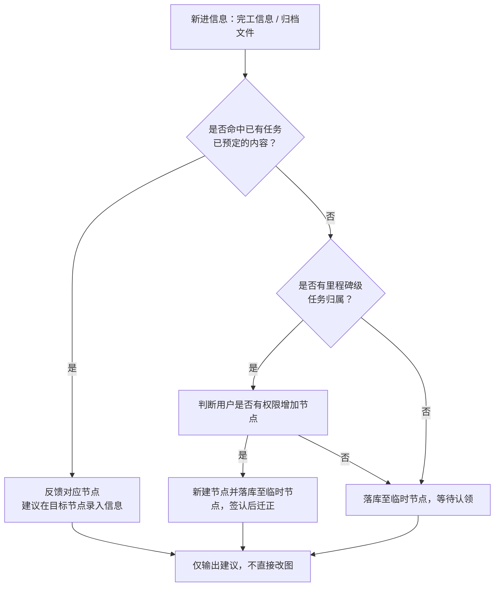

# 一个思考
- 关于emily的业务我在思考一个问题，关于全景节点的管理，我有一个需求描述的是希望系统能根据上传的文件自行构建全景节点。我想这个能力还是比较难实现的，因为难点在于怎么让LLM理解公司的节点拆分设置规则。甚至不同的团队成员对节点的设置、可见文件范围、参与企业的设置、事件挂在规则，都可能有不同意见。这说到底是人之间的问题。但也是emily的机遇，通过理性的‘中间人’，成为‘强制’大家达成相对的组织架构共识的载体，这就是全景节点维护者，

- 我一开始想到，似乎它与现在已经有的sop机制很接近，可以根据观察往期项目与团队成员的处理操作完成自总结升级。但又想到另一个问题，它应该有较高的读取权限，读取历史项目或参考手册的设置。

- 所以又想到，是否应该定义它是个专业领域的Agent，（通过完善skills文件？），通过A2A与session通讯，作为辅助agent，通过提建议的方法引导团队成员整理全景节点。

- 这可能是个有价值的方向，就是SOP都agent，有独立权限，通过A2A与session通信来提供服务，以此达成权限隔离。

---

# 全景节点维护者 部分描述
- 全景节点维护者 需要一个简称，暂简称为‘Atlas’
- 核心职能，维护一套全景节点的架构标准，对值守的全景节点图提出维护操作建议。分三点具体：

1. 根据新进的信息（完工信息、归档文件）；判断信息是否是全景节点图某个‘里程碑’节点下的任务中已经预定的内容，若是，反馈对应的节点，建议在目标节点上进行信息录入。若否，判断信息是否有‘里程碑’级任务归属，若是，建议在该里程碑下新建任务节点后录入；若否，标注为“无归属”，放入项目资料库待人工认领。全程只出建议，不直接改图。

2. 根据参考资料（往期其他项目的全景节点图、团队成员手改节点的记录），总结节点管控规律、沉淀经验，输出可复用的规则候选（如“某类节点必然包含某几个参与单位/共享文件”），经人工确认后升级为标准。

3. 根据上传资料（人写的本项目全景节点计划表，节点产出成果文件）组织产出节点更新建议：与现有架构标准做比对，输出增/删/改差异清单及理由，供责任人逐条确认。

- 一个节点/任务应包含的信息：
创建人、责任人（负责单位）、前置完成节点（依赖的上级节点及成果）、节点达成标准（需要什么文件，成果文件审核标准）、产出成果（成果名称、目标数量、单位）、节点层级（L2 里程碑 / L3 工作包）、需要哪些企业参与（如景观工程节点，固定需要‘景观承包单位’、‘监理单位’、‘总包单位’、‘建设单位’）、需要哪些共享文件（如景观工程节点，固定需要‘景观方案本册’、‘景观施工图’、‘企业景观工程工艺工法标准’、‘企业安全生产规范’、‘工地组织生产规则与奖惩办法’、‘预计完工日期’等等诸多文件）

# 临时节点
临时节点分两层，一层是全景节点图根图下的临时‘里程碑’节点，一层是挂在在某个‘里程碑’节点下的‘任务’级节点。他们是无主事件暂时收容容器，由‘全景节点维护者’建议去向，被动等待有权限用户来认领并按去除。
- 定调：Atlas 的产出**一律先落库进临时节点**（不阻断、不做草稿态），**签认后才迁正**到全景节点图的正式归属位置。
- 可见与认领：临时节点 L4 及以上人员可见；上传者/创建者本人始终可见自己的节点；各节点所有者可认领回自己的节点。
- 不设待认领超时，长期挂起即可。
---
# 4.2
- 三态流转（未激活→激活→完成）的触发条件:
    - ‘激活’，有两种触发条件：
        1. 有‘任务’级节点录入的，状态即为激活状态
        2. 节点的‘启动时间’字段对应的时间到，自动视为激活
    - ‘完成’有两种触发条件：
        1. 预期成果有，且成果满足预定审核标准，状态即为完成
        2. 或由L5、L6人员签认为完成也可视为完成
    - 无以上两组条件的，都视为未激活状态
    - 新增状态‘节点停用’（等价于废弃/冻结），**仅 L4 及以上人员可操作**，用于节点不再适用或需退出管控的场景；停用后不计入完成度与提醒
 - 来一份新文件，什么时候建新节点、什么时候挂到现有节点？
    - 由session，根据‘上岗手册’（即三书中的**系统能力书**，说明系统当前能做什么）的任务书判断，判断依据，文件被判定为本项目的阶段性成果文件。比如证照、完工单、正式版图纸、工作闭环确认文件等。判断并询问全景节点维护者后向用户建议，同意则新建节点。若无权新建节点，则挂在临时节点下。
- 节点编号生成策略，策略统一、简单即可，有具体负责的AI工具根据自己的建议生成编码规则
- ‘权重’概念，退役，暂时用不到它了，若有即成实现则进行全面退役。
- 问题：相对锚点换算：计划时点用"取得施工许可证后 30 天"这类相对锚点如何换算。
    - 回答：关于时间周期，的描述为相对时间，则查询被锚定节点的时间计划，来推算本节点周期。

# 4.3
1. 关于签认，节点新增的，没有签认的，统一由各级‘临时节点’收纳，签认后根据节点组织办法改动归属位置
2. 成果反推| 资料驱动  是不同入口，实现渠道为统一的，全景节点维护者（Atlas）为渠道具体执行的顾问。
3. 通过LLM阅读理解其中规律，并提炼成经验保存在三书的对应资料中
 