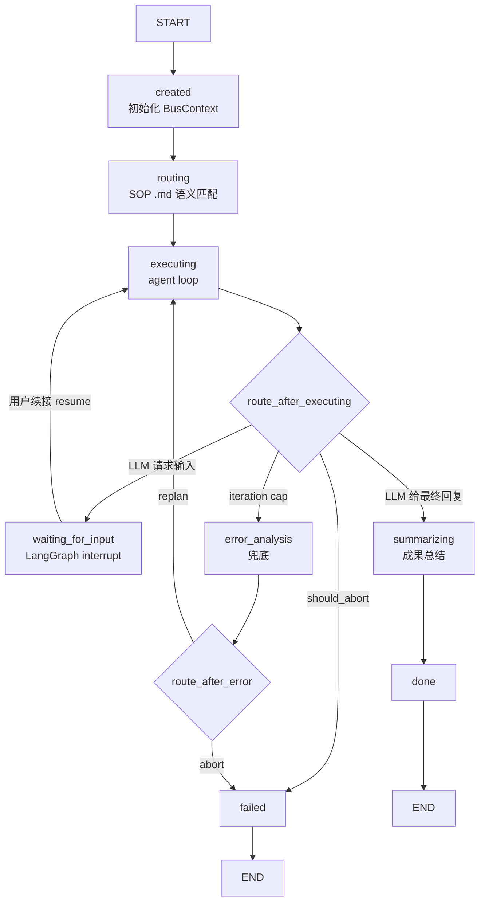
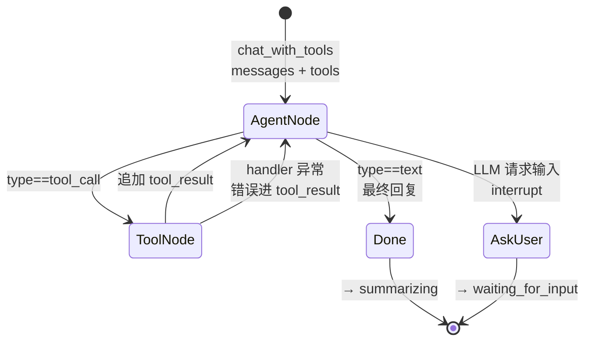
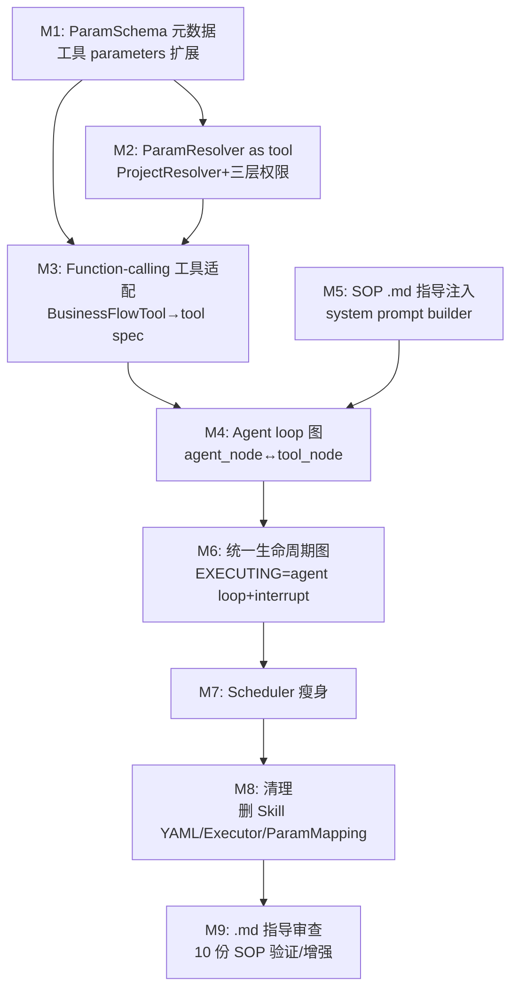

# WorkItem 全量 LangGraph 迁移（L3 Agent Loop）— PRD

> **日期**：2026-07-29
> **来源**：BUG-01 调查链路多轮对话产出
> **参与角色**：需求分析师、Emily 资深架构师、技术总监、LangGraph 图引擎专家、SRE 性能工程师
> **版本**：V1（L3 agent loop 模式，替代早期 L2 step 子图方案）

---

## 一、产品概述

### 1.1 背景与目标

Emily 在 2026-07-28 将外层执行引擎从 PipelineBUS 迁到 LangGraph StateGraph（5 节点含 error_analysis 闭环），但**迁移只换了外壳**——LangGraph 只接管了 EXECUTING 阶段，WorkItem 的其余部分仍是手写控制流，且 EXECUTING 内部是手写 for 循环（`_real_execute` / `SkillExecutor.execute`），LLM **不在执行循环里**。

调查 BUG-01（FK 约束违反）时发现一连串结构性缺陷的根因：**当前是 plan-then-execute 流水线，不是 Anthropic harness 理念的 agent loop**。LLM 在 node2 一次性规划、node3 机械执行，执行期间零 LLM 调用——看不到中间结果、无法基于观测调整、错误靠事后 error_analysis 兜底。

**目标**：WorkItem **全量迁移到 LangGraph，并采用 L3 agent loop 模式**——用一个统一生命周期图覆盖 CREATED→DONE/FAILED 全流程，EXECUTING 阶段内嵌 agent loop（`agent_node ↔ tool_node` ReAct 循环）。LLM 在循环里，每轮基于累积对话历史决策、调用工具、看 tool_result 自纠。

指导不控制：**SOP `.md` 文件（10 份）作为 agent 指导注入 system prompt**，丢掉 Skill YAML 的硬性 step 控制。工具调用从结构化输出切换到 **function calling**（`chat_with_tools`，已有基础设施）。resolver 作为 function-calling tool 供 LLM 自主调用。

### 1.2 核心价值

| 维度 | 改善 |
|------|------|
| 执行模式 | plan-then-execute 流水线 → **L3 agent loop**（LLM 在循环里，基于观测决策） |
| 工具调用 | 结构化输出（plan JSON → 框架执行）→ **function calling**（LLM 直接调工具，看 tool_result） |
| 指导载体 | Skill YAML 硬性 step 控制 → **SOP `.md` 作为指导**（指导不控制，Anthropic harness 理念） |
| 状态机统一 | scheduler 手写状态机 + LangGraph 执行图 → **一个生命周期图** |
| WAITING_FOR_INPUT | scheduler + node3 手写检查 → **LangGraph `interrupt()` 原生挂起/恢复** |
| 架构简化 | 消灭 Skill YAML / SkillExecutor / ParamMapping / ExecutionPlan / 动态子图编译 / `${}` 语法一整套结构化执行机制 |
| BUG-01 根治 | LLM 看 schema 首次不错（预防）+ 看 tool_result 自纠（恢复）+ iteration cap 兜底 |
| scheduler 瘦身 | 从"状态机管理 + 图调用"简化为"DB 持久化 + 图调用" |

### 1.3 用户故事

| ID | 角色 | 场景 | 期望 |
|----|------|------|------|
| US-01 | 员工 | "帮我记一下样板段放线完成，翠湖庭院项目" | agent loop 自动调 `resolve_project` 查 UUID → `record_event`，无 FK 报错 |
| US-02 | 员工 | 录入时项目名有重名 | `resolve_project` 返回候选，LLM 追问用户选择 |
| US-03 | 员工 | "查延期事件，多的话建跟踪任务" | LLM 调 query 看结果 → 基于观测决定是否 create_task（条件分支，流水线做不到） |
| US-04 | 员工 | 录入中途系统问"事件日期？" | WAITING_FOR_INPUT interrupt 挂起，用户回复后从断点恢复 |
| US-05 | 开发者 | 新增工具 | `BusinessFlowTool.parameters` 声明 FK + resolver hint，LLM 自动识别用法 |

---

## 二、系统架构

### 2.1 统一 WorkItem 生命周期图

> 一张图覆盖全生命周期。WorkItem 6 态变成图节点。EXECUTING 阶段内嵌 agent loop（`agent_node ↔ tool_node`）。WAITING_FOR_INPUT 是 LangGraph interrupt。scheduler 不做状态决策，只调图 + 持久化。



### 2.2 Agent Loop 核心循环（EXECUTING 内部）

> ReAct 循环：`agent_node` 调 `chat_with_tools` → LLM 发 `tool_call` → `tool_node` 执行 handler → tool_result 追加进 messages → 回 `agent_node`。LLM 基于累积对话历史决策，直到发最终回复（`type=="text"`）。错误自纠：tool 返回错误时 LLM 看 tool_result 自行调整。



### 2.3 核心数据结构

#### AgentLoopState（统一图 state，替代 WorkItemGraphState + StepGraphState）

```python
# emily-core/emily_core/workitem/langgraph_engine/state.py
class AgentLoopState(TypedDict, total=False):
    # ── 生命周期状态 ──
    wi_state: str               # CREATED/ROUTING/EXECUTING/WAITING_FOR_INPUT/DONE/FAILED
    # ── agent loop 核心 ──
    messages: list[dict]        # 对话历史（system + user + assistant + tool_result），即状态
    current_sop_id: str         # 路由匹配到的 SOP .md
    iteration_count: int        # agent loop 迭代次数（防 runaway）
    # ── WAITING_FOR_INPUT ──
    waiting_question: str       # interrupt 时的问题
    # ── 兜底 ──
    error_analysis: dict        # iteration cap 触发时的兜底分析
    replan_hint: str
    # ── 元数据 ──
    node_timings: dict
    pipeline_run_id: str
    current_stage: str
    _max_iterations: int        # agent loop 最大迭代数（默认 12）
```

**状态即对话历史**——`messages` list 是 agent loop 的唯一状态，累积 system prompt + 用户消息 + LLM 的 tool_call + tool_result。不需要 StepGraphState / step_results / param_fixes / ExecutionPlan。

#### ParamSchema 元数据（BusinessFlowTool.parameters 扩展）

```python
# 工具 parameters JSON Schema 扩展字段（LLM 直接读，决定怎么用工具）
{
    "project_id": {
        "type": "string", "format": "uuid",
        "fk_target": "projects.id",          # ← FK 声明
        "resolvable_from": "project_name",    # ← 可从哪个字段解析
        "resolver": "project.by_name"         # ← resolver hint（LLM 看到会先调 resolver）
    },
    "project_name": {
        "type": "string", "description": "项目名称（人类可读）"
    }
}
```

LLM 看到 `project_id` 的 schema 有 `resolver: project.by_name`，会**主动先调 `resolve_project`** 拿 UUID，再填进 `record_event`。BUG-01 在源头预防。

#### ParamResolver 作为 function-calling tool（三层权限模型）

```python
# emily-core/emily_core/workitem/langgraph_engine/agent/resolver.py
class ParamResolver(ABC):
    """参数解析器 —— 作为 function-calling tool 暴露给 LLM。"""
    @property
    @abstractmethod
    def name(self) -> str: ...           # "resolve_project"
    @property
    @abstractmethod
    def spec(self) -> dict: ...          # OpenAI tool spec
    @abstractmethod
    async def handle(self, params: dict, session_ctx) -> dict: ...

class ProjectResolver(ParamResolver):
    """项目名 → UUID，三层权限模型第二层。"""
    async def handle(self, params: dict, session_ctx) -> dict:
        value = params.get("project_name", "")
        # ① 超 session 读：查全表找匹配
        matches = ProjectRepo.find_by_name_fuzzy(value)
        if not matches:
            return {"found": False, "error": f"未找到项目'{value}'"}
        # ② session 约束解析：只在用户可访问项目集合内解析
        accessible = set(session_ctx.project_ids) if session_ctx else set()
        in_scope = [m for m in matches if m.id in accessible]
        if not in_scope:
            return {"found": False, "error": f"未找到项目'{value}'"}  # 不泄漏存在性
        if len(in_scope) > 1:
            return {"found": False, "candidates": [{"id": m.id, "name": m.name} for m in in_scope]}
        return {"found": True, "project_id": in_scope[0].id}
```

| 层 | 主体 | 权限范围 | 职责 |
|----|------|---------|------|
| 第一层 | LLM（agent loop） | session 级 | 读 schema 决策调哪个 tool（含 resolver） |
| 第二层 | ParamResolver tool | 超 session 读，范围受限 + 输出过滤 | 取数（name→UUID），不泄漏不可见资源 |
| 第三层 | BusinessFlowTool handler 执行 | session 级 | 业务权限检查兜底 |

#### Function-calling 工具适配（BusinessFlowTool → OpenAI tool spec）

```python
# emily-core/emily_core/workitem/langgraph_engine/agent/tool_adapter.py
def build_tool_specs(
    business_tools: BusinessFlowToolRegistry,
    resolvers: list[ParamResolver],
    session_api_ids: set[str],
) -> list[dict]:
    """构建 LLM 可见的 tool spec 列表，按 session 权限过滤。"""
    specs = []
    for name in business_tools.list_names():
        if name not in session_api_ids:
            continue  # fail-closed：用户无权限的工具不暴露
        tool = business_tools.get(name)
        specs.append({
            "type": "function",
            "function": {
                "name": tool.name,
                "description": tool.description,
                "parameters": tool.parameters,  # 含 FK/resolver hint
            },
        })
    # resolver 工具始终可见（其内部做权限约束）
    for r in resolvers:
        specs.append(r.spec)
    return specs
```

---

## 三、模块拆解

### 3.1 模块依赖图



### 3.2 模块职责表

| 模块 | 文件 | 改动类型 | 核心变更 |
|------|------|----------|----------|
| M1 | `tools/business_flow_tools.py` + 各工具定义 | 修改 | parameters 增加 `fk_target`/`resolvable_from`/`resolver`；LLM 直接读 schema 决定用法 |
| M2 | `workitem/langgraph_engine/agent/resolver.py`（新增） | 新增 | ParamResolver ABC + ProjectResolver + ResolverRegistry；作为 function-calling tool 暴露；三层权限 |
| M3 | `workitem/langgraph_engine/agent/tool_adapter.py`（新增） | 新增 | `build_tool_specs()`：BusinessFlowTool + Resolver → OpenAI tool spec；按 `session_api_ids` 过滤；复用 `registry.py:294` 桥接模式 |
| M4 | `workitem/langgraph_engine/agent/loop.py`（新增） | 新增 | Agent loop：`agent_node`（调 `chat_with_tools`）↔ `tool_node`（调 handler）；`route_after_agent`（tool_call→tool_node / text→done / interrupt→waiting）；iteration cap → 升级外层 error_analysis |
| M5 | `workitem/langgraph_engine/agent/prompt_builder.py`（新增） | 新增 | system prompt = SOP `.md` 全文 + 可见工具 schema 摘要 + session 上下文 + 用户消息历史；替代 KnowledgeInjector planner 注入 |
| M6 | `workitem/langgraph_engine/graph.py` + `nodes.py` | 重写 | 统一生命周期图（created→routing→executing(agent loop)→summarizing→done/failed）；WAITING_FOR_INPUT 用 LangGraph `interrupt()`；外层 error_analysis 作 iteration cap 兜底 |
| M7 | `workitem/scheduler.py` | 修改 | `_run_one` 瘦身：建 BusContext + 调图 + 持久化；删除手写状态转换 + WAITING_FOR_INPUT 检查 |
| M8 | 全局 | 删除 | 删除：`_real_execute`、`SkillExecutor`、`SkillDefinition`/`SkillStep`/`ParamMapping`、`ParamExtractor`、`ExecutionPlan`/`PlanStep`、10 份 Skill YAML、`KnowledgeInjector` planner 角色、step 子图编译器。`SkillRegistry` 降级为 SOP `.md` 索引器 |
| M9 | `emily-data/sops/*.md` | 审查 | 验证 10 份 `.md` 作为 agent 指导是否充分；必要时补"工具选择/参数约束"段落（`.md` 已含工具表 + 字段分级，预期微调） |

---

## 四、工程决策记录

| # | 决策 | 选择 | 理由 |
|---|------|------|------|
| 1 | 迁移范围 | WorkItem 全生命周期图化 | scheduler 状态机 + WAITING_FOR_INPUT + node2 分支全部迁入 LangGraph |
| 2 | 执行模式 | **L3 agent loop**（全量） | `.md` 指导 + function calling，统一所有任务；LLM 自调节深度；Anthropic harness 理念 |
| 3 | SOP 指导载体 | **`.md` 文件注入 system prompt** | 已是合格指导；丢掉 Skill YAML 硬性 step 控制 |
| 4 | 工具调用模型 | **function calling**（`chat_with_tools`） | LLM 直接调工具，看 tool_result 决策；已有基础设施（`client.py:275`） |
| 5 | 状态载体 | **对话历史（messages list）** | 不需要 StepGraphState / step_results / param_fixes / ExecutionPlan |
| 6 | 错误恢复 | **LLM 在 loop 里看 tool_result 自纠** | 不需要 step 级 error_analysis；保留 iteration cap + 外层 error_analysis 兜底 |
| 7 | Skill YAML | **整体丢弃** | `.md` 已含指导；YAML 的 step 控制、ParamMapping、output_key 全被 agent loop + 对话历史替代 |
| 8 | resolver 形态 | **function-calling tool** | LLM 自己调 `resolve_project`；不需要框架 param_fixes 机制 |
| 9 | WAITING_FOR_INPUT | LangGraph `interrupt()` + checkpoint | 原生挂起/恢复，不再手写；用户续接时 `Command(resume=...)` |
| 10 | checkpointer 持久化 | MemorySaver（内存），PostgreSQLSaver 留后续 | 当前 WAITING_FOR_INPUT 也是内存态，无回归 |
| 11 | scheduler 职责 | 瘦身为 DB 持久化 + 图调用 | 状态转换由图驱动 |
| 12 | 成本控制 | fast model（router_model）做 agent loop 调用 | 简单任务 LLM 自调节为 1-3 次调用；不设 fast-path 双模 |
| 13 | iteration cap | 默认 12 次 | 防 agent loop runaway；超限升级外层 error_analysis |
| 14 | param schema 载体 | 工具 parameters 内联 | 工具自描述，LLM 直接读 |
| 15 | resolver 权限 | 三层模型 | LLM session 级 / resolver 超 session 读+过滤 / handler session 级兜底 |

---

## 五、替代方案

### 5.1 最小补丁（被否决）

移植 `output_key`/`ParamMapping` 到 `_real_execute`，不引入子图/loop。

**否决**：第三套并行状态传递机制，`depends_on` 仍死，违反 CLAUDE.md 约束 #0。

### 5.2 L2 自适应 workflow（被否决）

step 子图 + reflect 节点 + 保留 Skill YAML 结构化执行。

**否决**：
- 保留 Skill YAML/SkillExecutor/ParamMapping/动态子图编译/`${}` 语法一整套机制，复杂度高
- LLM 仍不在执行循环里（reflect 只在每步后触发，非 ReAct loop）
- 工具调用仍是结构化输出，非 function calling
- 非 Anthropic harness 理念（harness 应薄，智能在 LLM）

### 5.3 固定拓扑 step 子图（被否决）

step 节点固定，靠 state 控流。**否决**：不支持任意依赖图，且仍属 L2 范畴。

### 5.4 理解 A：仅执行内部图化（被否决）

node3 step 子图化但 scheduler 状态机保留。**否决**：两套状态机仍并存，非全量迁移。

---

## 六、验收标准

### 6.1 模块级

| 模块 | 验收项 | 验证方式 |
|------|--------|----------|
| M1 | record_event parameters 含 fk_target + resolver hint | `uv run python -c "from emily_core.tools.event_tool import _build_tool; p=_build_tool().parameters; assert p['project_id']['fk_target']; assert p['project_id']['resolver']"` |
| M2 | ProjectResolver 作为 tool，不泄漏不可见项目 | 单测：accessible 外项目返回 found=False |
| M2 | ProjectResolver 有 OpenAI tool spec | `uv run python -c "from emily_core.workitem.langgraph_engine.agent.resolver import ProjectResolver; r=ProjectResolver(); assert r.spec()['type']=='function'"` |
| M3 | tool_adapter 按 session 过滤 + 含 resolver | 单测：session_api_ids 外的 tool 不出现在 specs；specs 含 resolve_project |
| M4 | agent loop 迭代正常 | 单测：mock LLM 返回 tool_call → tool 执行 → LLM 返回 text → 循环结束 |
| M4 | iteration cap 触发兜底 | 单测：mock LLM 持续返回 tool_call 到 cap → 升级 error_analysis |
| M5 | system prompt 含 SOP .md 全文 + 工具 schema | 单测：prompt_builder 输出含 SOP-002 .md 内容 + resolve_project tool 描述 |
| M6 | 统一生命周期图含 agent loop + interrupt | `grep -n "agent_node\|tool_node\|interrupt" emily-core/emily_core/workitem/langgraph_engine/graph.py` 有结果 |
| M6 | WAITING_FOR_INPUT 用 interrupt | 单测：LLM 请求输入 → 图挂起 → resume → 从断点继续 |
| M7 | scheduler 无手写状态转换 | `grep -n "transition_to\|WAITING_FOR_INPUT" emily-core/emily_core/workitem/scheduler.py` 无结果（或仅持久化） |
| M8 | Skill YAML 已删除 | `ls emily-data/skills/` 无 `.skill.yaml` |
| M8 | SkillExecutor 已删除 | `ls emily-core/emily_core/skill/` 不存在（或仅保留 SOP .md 索引） |
| M8 | ExecutionPlan/PlanStep 已删除 | `grep -rn "class PlanStep\|class ExecutionPlan" emily-core/emily_core/` 无结果 |
| M8 | `_real_execute` 已删除 | `grep -rn "_real_execute" emily-core/emily_core/` 无结果 |
| M9 | 10 份 .md 含工具表 + 字段分级 | `grep -l "工具名\|字段" emily-data/sops/*.md` 返回 10 份 |

### 6.2 端到端

```powershell
# BUG-01 回归：agent loop 应自然查 UUID 再录入（核心验证）
docker exec emily-postgres psql -U emily -d emily -c "SELECT id, username, permission_level FROM users WHERE status = 'active' ORDER BY permission_level LIMIT 10;"
uv run python .claude/skills/emy-test/cli.py --managed --llm `
  --message "帮我记一下样板段放线完成，翠湖庭院项目" --sender "王建国"
# 预期：agent loop 调 resolve_project → record_event，返回录入成功，无 FK 报错

# 条件分支验证（L3 独有能力，流水线做不到）
uv run python .claude/skills/emy-test/cli.py --managed --llm `
  --message "查一下翠湖庭院最近的延期事件，如果有的话帮我建个跟踪任务" --sender "王建国"
# 预期：LLM 调 query 看结果 → 基于观测决定是否 create_task

# WAITING_FOR_INPUT 回归：多轮续接从断点恢复
uv run python .claude/skills/emy-test/cli.py --managed --llm `
  --message "记录事件：材料进场" --sender "王建国"
# 预期：系统追问缺失信息，回复后从 interrupt 断点恢复

# 歧义项目名：resolver 返回候选，LLM 追问
uv run python .claude/skills/emy-test/cli.py --managed --llm `
  --message "记录事件：材料进场，翠湖项目" --sender "王建国"
# 预期：resolve_project 返回多个候选，LLM 追问选择
```

### 6.3 LLM 流量验证

```powershell
# 确认 function calling 序列：resolve_project → record_event
docker exec mitmproxy grep "tool_call\|tool_use" /app/logs/llm_trace.jsonl | tail -10
# 预期：trace 含 resolve_project + record_event 的 tool_call 序列

# 确认 SOP .md 注入 system prompt
docker exec mitmproxy grep "事件记录" /app/logs/llm_trace.jsonl | head -3
# 预期：system prompt 含 SOP-002 .md 内容
```

---

## 七、风险与边界

| 风险 | 缓解措施 |
|------|----------|
| 成本：每任务从 1 次 LLM 调用变 N 次 | fast model（router_model）做 agent loop 调用；简单任务 LLM 自调节 1-3 次；iteration cap 防失控 |
| `.md` 指导质量：当前 .md 是业务手册，作 agent 指导可能要补工具选择/参数约束 | M9 审查 10 份 .md，必要时增强；.md 已含工具表 + 字段分级，预期微调 |
| 确定性下降：LLM 跟 .md 走但不强制 exact steps | .md 写清必需步骤 + Guardian 审合规 + tool-call 日志留全痕 |
| LangGraph interrupt 稳定性 | 验证 LangGraph 1.x interrupt/resume；若不稳定回退到 checkpoint + 条件边 |
| agent loop runaway | iteration cap（默认 12），超限升级外层 error_analysis |
| resolver 权限泄漏 | 三层模型第二层：范围受限读 + session 约束 + 输出过滤；单测覆盖 |
| Skill YAML 删除影响 SkillRegistry 用户 | SkillRegistry 降级为 SOP .md 索引器，保留 sop_id 查询接口 |
| 工具 schema 不清晰致 LLM 误用 | M1 schema 元数据完整声明；工具 description 写清调用场景 |
| scheduler 瘦身影响 SessionAgent 协作 | M7 明确新职责：建 BusContext + 调图 + 持久化；SessionAgent 仍管 WorkItem 队列 |

---

## 八、BUG-01 根治验证路径

L3 agent loop 下，BUG-01 在三个层面被根治，且比 L2 方案更自然：

| 层面 | 机制 | 验证 |
|------|------|------|
| **首次预防** | LLM 读 `record_event` 的 schema，看到 `project_id` 有 `resolver: project.by_name` hint → 主动先调 `resolve_project("翠湖庭院")` 拿 UUID，再填进 `record_event` | LLM trace 含 resolve_project → record_event 序列，无 FK 错误 |
| **loop 自纠** | 若 LLM 首次仍把名字塞进 project_id → `record_event` handler 返回 FK 错误（tool_result）→ LLM 看到 → 自己调 `resolve_project` 修正 → 重试 | trace 含 record_event 失败 → resolve_project → record_event 成功 |
| **iteration cap 兜底** | 若 LLM 持续失败到 cap → 升级外层 error_analysis → abort 或问用户 | 日志含 iteration cap 触发 |

**BUG-01 修复判定**：6.2 端到端"带项目名事件录入"返回成功确认，无 FK 报错超时，LLM trace 显示 resolve_project → record_event 的 tool_call 序列。

**与 L2 方案对比**：L2 需要 step 级 error_analysis + param_fixes + ProjectResolver 框架机制来修 BUG-01；L3 里 LLM 看 schema + 看 tool_result 自然就修了——**harness 薄，LLM 智能补位**，复杂度从框架转移到 LLM。

---
*本 PRD 由 req-review 多轮对话生成，基于 Emily 项目上下文、BUG-01 调查链路及 Anthropic harness 理念。可直接交付 AI 开发工具执行。*
