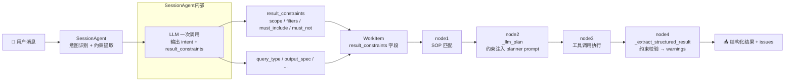
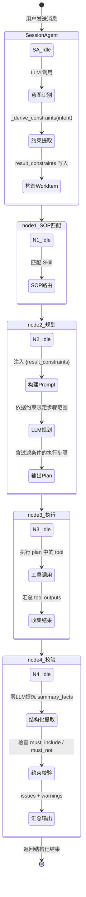
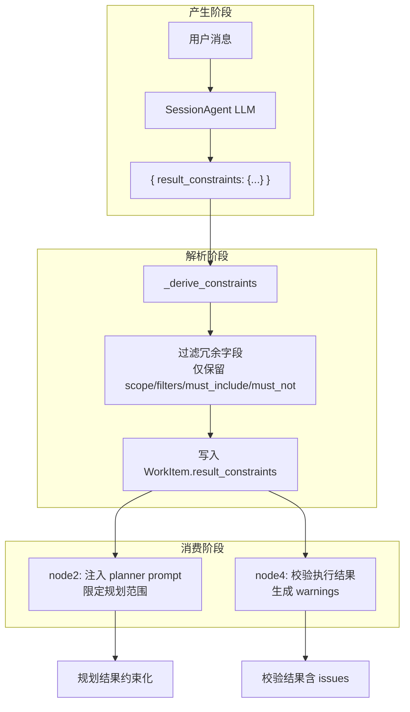
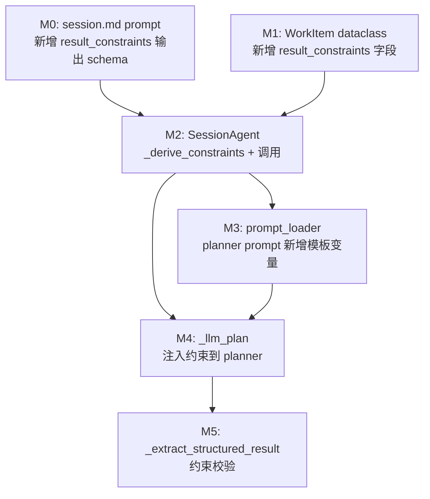
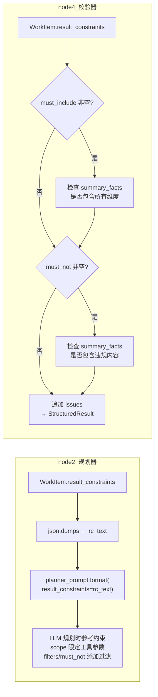

# SessionAgent → WorkItem 结果约束传递 — PRD

> **版本**：V1.0  
> **状态**：待开发  
> **关联计划**：[result_constraints_计划_V1.md](./result_constraints_计划_V1.md)

---

## 1. 产品概述

### 1.1 背景

当前 SessionAgent 在将用户请求拆分为 WorkItem 并分发到执行链（node1→node2→node3→node4）时，仅传递 `user_input` 原文和基础元数据。用户对执行结果的**隐含约束**（如"只看翠湖庭院的""别列已完成的""必须有截止日期"）在传递过程中丢失，导致：

- node2 规划时无法精准限定范围
- node3 执行时可能产出不符合预期的结果
- node4 验证时缺少校验依据

### 1.2 目标

在 **不增加 LLM 调用次数、不改动已有方法签名** 的前提下，实现 SessionAgent 从用户表达中提取结果约束，结构化传递到下游执行链（node2 → node3 → node4），让每个节点有据可依。

### 1.3 核心价值

| 维度 | 改善 |
|------|------|
| **精准度** | node2 规划时可依据 scope/filters 限定查询范围 |
| **合规性** | node4 验证时可依据 must_include/must_not 逐项校验 |
| **效率** | 不增加 LLM 调用，约束来自同一次意图识别的输出 |
| **兼容性** | 所有新字段可选，旧链路不传约束时不崩溃 |

---

## 2. 用户故事

| ID | 角色 | 场景 | 期望 |
|----|------|------|------|
| US-01 | 项目经理 | 查询"翠湖庭院本周王建国负责的未完成任务" | 系统自动限定 scope={project, responsible_user, time_range}，只返回匹配结果 |
| US-02 | 项目经理 | 让 Emily "列出所有节点，但别列已完成的" | 系统提取 filters=["exclude_completed"]，node4 校验时不包含已完成项 |
| US-03 | 施工员 | "帮我汇总进度，必须列出每个节点的负责人和截止日期" | 系统提取 must_include=["负责人","截止日期"]，node4 校验时检查是否缺失 |
| US-04 | 项目经理 | 简单录入"样板段放线完成了" | 无需提取约束，result_constraints={}，全链路不受影响 |

---

## 3. 系统架构

### 3.1 数据流向图



### 3.2 约束对象结构

```
result_constraints (dict)
├── scope (dict, 可选)          — 范围限定
│   ├── project: str            — 项目名
│   ├── responsible_user: str   — 负责人
│   ├── time_range: str         — 时间范围
│   └── ...
├── filters (list[str], 可选)   — 过滤条件
│   └── e.g. ["exclude_completed", "only_pending"]
├── must_include (list[str], 可选)  — 必须包含的维度
│   └── e.g. ["节点名称", "截止日期", "负责人"]
└── must_not (list[str], 可选)  — 禁止出现的内容
    └── e.g. ["不要已完成节点", "不要提预算"]
```

---

## 4. 节点流转图

### 4.1 执行链节点状态流转（含约束消费点）



### 4.2 约束字段生命周期



---

## 5. 模块拆解

### 5.1 模块依赖关系



> M0 与 M1 互不依赖可并行开发；M3/M4/M5 依次串行。

### 5.2 模块职责表

| 模块 | 文件 | 改动类型 | 核心变更 |
|------|------|----------|----------|
| M0 | `emily-data/prompts/session.md` | 修改 | 新增 result_constraints 派生规则段落 |
| M1 | `emily-core/emily_core/workitem/workitem.py` | 修改 | WorkItem 新增 `result_constraints: dict` 字段 |
| M2 | `emily-core/emily_core/session/session_agent.py` | 修改 | 新增 `_derive_constraints()`，`_split_into_workitems()` 中调用 |
| M3 | `emily-core/emily_core/infrastructure/llm/prompt_loader.py` | 修改 | planner prompt 新增 `{result_constraints}` template |
| M4 | `emily-core/emily_core/workitem/workitem_agent.py` | 修改 | `_llm_plan()` 注入 rc_text 到 planner prompt |
| M5 | `emily-core/emily_core/workitem/workitem_agent.py` | 修改 | `_extract_structured_result()` 新增约束校验块 |

### 5.3 各节点约束消费行为



---

## 6. 硬约束（设计底线）

| # | 约束 | 说明 |
|---|------|------|
| 1 | 不修改方法签名 | `_recognize_intent`、`_split_into_workitems`、`_llm_plan`、`_extract_structured_result` 签名不变 |
| 2 | 不新增 LLM 调用 | `result_constraints` 来自同一次 `_recognize_intent` 的 LLM 输出 |
| 3 | 向后兼容 | 新增字段均为可选，`result_constraints={}` 时全链路无异 |
| 4 | 风格一致 | 参照现有 `_derive_output_spec` 的代码模式 |

---

## 7. 验收标准

### 7.1 模块级

| 模块 | 验收项 | 验证方式 |
|------|--------|----------|
| M0 | session.md 含 `result_constraints 派生规则` 段落 | `grep -c` |
| M1 | `WorkItem().result_constraints` 返回 `{}` | `python -c` |
| M2 | `SessionAgent._derive_constraints({})` 返回 `{}` | `python -c` |
| M3 | planner prompt 含 `{result_constraints}` | `python -c "load_prompt('planner')"` |
| M4 | `_llm_plan` 中 `.format()` 含 `result_constraints` | `grep` |
| M5 | 约束校验块存在且语法正确 | `grep` + `python -c` |

### 7.2 端到端

```python
# 全链路 import + 单元验证，预期输出 "ALL PASSED"
from emily_core.workitem.workitem import WorkItem
from emily_core.session.session_agent import SessionAgent

wi = WorkItem()
assert hasattr(wi, 'result_constraints')

r = SessionAgent._derive_constraints({
    'result_constraints': {
        'scope': {'project': 'test'},
        'filters': ['exclude_completed'],
        'must_include': ['负责人'],
        'must_not': ['不要已完成'],
        'extra_noise': 'should be filtered'
    }
})
assert 'extra_noise' not in r
assert r.get('scope') == {'project': 'test'}
# → ALL PASSED
```

---

## 8. 风险与边界

| 风险 | 缓解措施 |
|------|----------|
| LLM 输出非预期 shape | `_derive_constraints` 只取已知 4 字段，过滤噪音 |
| planner prompt 过长 | `rc_text` 为 json 紧凑格式，体积可控 |
| node4 校验误报 | `must_not` 用简单关键词匹配，后续可升级为语义匹配 |
| 旧 WorkItem 无此字段 | `getattr(wi, "result_constraints", {}) or {}` 双重兜底 |

---

*PRD 基于 [result_constraints_计划_V1.md](./result_constraints_计划_V1.md) 生成，与其保持同步。*
