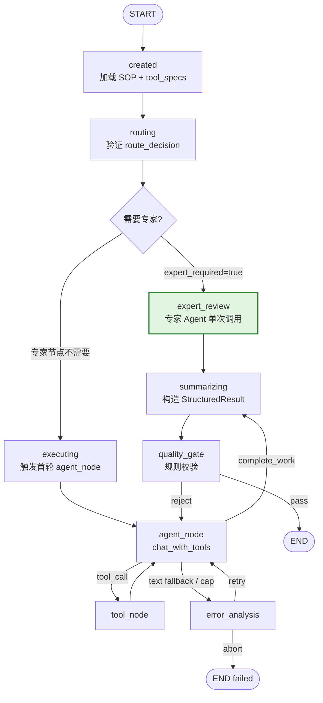
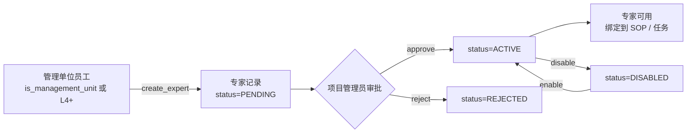
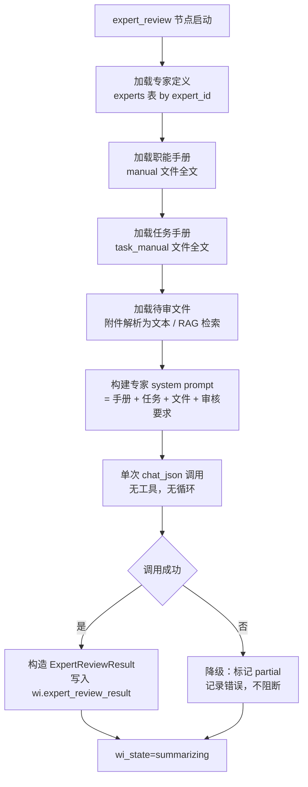

# 专家 Agent PRD V1

> **版本**：V1.1  
> **日期**：2026-08-12  
> **状态**：决策已定，待实施  
> **原始需求**：[`需求/专家Agent.md`](专家Agent.md)  
> **关联架构**：Emily V1.0 LangGraph StateGraph（`emily-core/emily_core/workitem/langgraph_engine/`）  
> **V1.1 变更**：5 项待决问题转为已定决策（见 §12）

---

## 1. 背景与目标

### 1.1 背景

Emily V1.0 当前所有业务任务统一走 **LangGraph agent loop**（`agent_node ↔ tool_node` 多轮循环），system prompt 载入通用 SOP + 全量可见工具表 + session 上下文。对于"审核类"窄域任务（如*景观工程施工图苗木应用审核*），这套通用路径存在两个问题：

1. **算力浪费**：agent loop 平均 3-8 轮迭代，每轮携带完整工具表 + SOP 全文 + 对话历史，token 消耗高
2. **注意力分散**：LLM 在 10+ 工具 + 通用行为规则中选路，对"只需对照审核标准给文件打分"这类任务过重

### 1.2 目标

引入**专家 Agent**——针对特定窄域业务的轻量级执行器，作为 WorkItem 图中的**可选节点**：

- **专家库**：每个专家绑定一份职能手册 + 任务手册，负责一项具体业务
- **专家评审节点**：任务匹配到专家时，跳过通用 agent loop，由专家单次 LLM 调用产出评审成果
- **省算力**：专家 prompt 只含手册 + 任务 + 待审文件，单次 `chat_json` 调用，无工具循环
- **集中注意力**：窄域 prompt（无通用工具表、无通用行为规则），LLM 注意力聚焦审核标准

### 1.3 设计优势的机制实现

| 优势 | 通用 agent loop | 专家 Agent |
|------|----------------|-----------|
| LLM 调用次数 | 3-8 次（多轮迭代） | **1 次**（单次 chat_json） |
| system prompt 构成 | 通用角色 + SOP 全文 + 全工具表 + 行为规则 | **专家职能手册 + 任务手册 + 待审文件** |
| 工具调用 | 多轮 function-calling | **无**（纯文本审核，不调工具） |
| 上下文窗口占用 | 随迭代线性增长 | **固定**（手册 + 文件 + 任务） |
| 注意力聚焦 | 在 10+ 工具间选路 | **单一审核标准** |

---

## 2. 核心概念

| 概念 | 定义 |
|------|------|
| **专家（Expert）** | 专家库中的一项窄域业务执行器，绑定职能手册 + 任务手册，由单次 LLM 调用产出评审成果 |
| **职能手册（Function Manual）** | 专家的全量业务知识（如"景观施工图苗木设计说明与表的审核标准、关注点、打分规则"），全量注入专家 prompt |
| **任务手册（Task Manual）** | 专家执行任务时的具体步骤指引（如"先审苗木表规格、再审设计说明一致性、最后量化打分"） |
| **专家评审节点（expert_review）** | LangGraph 图中的可选执行节点，替代通用 `executing(agent loop)` 路径 |
| **专家库（Expert Registry）** | `experts` 表 + 磁盘手册文件目录，支持 CRUD + 审批流 |
| **评审成果（ExpertReviewResult）** | 专家产出的结构化结果：评分 + 问题清单 + 结论 + 建议 |

---

## 3. 系统架构

### 3.1 专家评审节点在 LangGraph 图中的位置



**关键决策**：专家评审节点是 `routing` 后的**替代执行路径**，而非 `summarizing` 后的后置审核。理由：

1. 需求"专家Agent返回成果：根据审核要求的评审成果"——专家直接产出成果，不消费 agent loop 成果
2. 若先跑 agent loop 再跑专家审核，双重 LLM 消耗，违背"省算力"初衷
3. 专家任务（如文件审核）不需要工具调用，走 agent loop 是浪费

**路由判定**：`route_after_routing` 检查 `wi.expert_id`（非空 → expert_review，空 → executing）。`wi.expert_id` 由 `SessionAgent` 在意图识别阶段根据 SOP 声明或用户显式请求设置。

### 3.2 专家库管理流程



**权限矩阵**：

| 操作 | 权限要求 | 对应现有判定 |
|------|---------|-------------|
| 新建专家 | 管理单位员工 | `is_management_unit=True` 或 `can_access(level, 4)` |
| 审批专家 | 项目管理员 | `is_admin(level)`（L5+） |
| 启用/停用 | 项目管理员 | `is_admin(level)` |
| 查询专家 | 全体员工 | `can_access(level, 1)`（L1+） |

### 3.3 专家 Agent 执行流程



---

## 4. 数据模型

### 4.1 新增表：`experts`（专家库）

| 字段 | 类型 | 说明 |
|------|------|------|
| `id` | UUID PK | 专家 UUID |
| `expert_no` | VARCHAR(32) UNIQUE | 业务编号，如 `EXP-001` |
| `name` | VARCHAR(100) | 专家名称（如"景观苗木审核专家"） |
| `function_desc` | VARCHAR(200) | 一句话职能描述 |
| `manual_path` | VARCHAR(500) | 职能手册文件名（相对 `emily-data/files/Expert Work Manual/`） |
| `task_manual_path` | VARCHAR(500) | 任务手册文件名（相对 `emily-data/files/Expert Work Manual/`） |
| `review_schema` | JSON | 评审成果 schema（评分维度 + 打分规则），用于 `chat_json` 约束输出 |
| `sop_id` | VARCHAR(64) | 绑定的 SOP ID（可空，表示通用专家） |
| `status` | VARCHAR(16) | `PENDING` / `ACTIVE` / `REJECTED` / `DISABLED` |
| `creator_id` | UUID FK→users | 创建人 |
| `approver_id` | UUID FK→users | 审批人（PENDING 时为空） |
| `created_at` | TIMESTAMPTZ | 创建时间 |
| `approved_at` | TIMESTAMPTZ | 审批时间 |
| `updated_at` | TIMESTAMPTZ | 更新时间 |

**索引**：`(status)`, `(sop_id)`, `(expert_no)`

### 4.2 新增表：`expert_approvals`（专家审批记录）

| 字段 | 类型 | 说明 |
|------|------|------|
| `id` | UUID PK | 记录 UUID |
| `expert_id` | UUID FK→experts | 关联专家 |
| `action` | VARCHAR(16) | `APPROVE` / `REJECT` / `ENABLE` / `DISABLE` |
| `operator_id` | UUID FK→users | 操作人 |
| `reason` | TEXT | 操作理由 |
| `created_at` | TIMESTAMPTZ | 操作时间 |

### 4.3 WorkItem 字段扩展

在 `emily-core/emily_core/workitem/workitem.py` 的 `WorkItem` dataclass 新增：

```python
# ── 专家评审（可选）──
expert_id: str = ""
"""匹配到的专家 UUID（非空时 routing 后走 expert_review 节点）"""

expert_required: bool = False
"""是否需要专家评审（SessionAgent 意图识别时设置）"""

expert_review_result: dict = field(default_factory=dict)
"""专家评审成果（ExpertReviewResult 序列化），供 summarizing 节点构造 StructuredResult"""
```

### 4.4 磁盘文件目录

```
emily-data/
└── files/
    └── Expert Work Manual/      # 专家手册（职能手册 + 任务手册，临时存放位置）
        ├── EXP-001-景观苗木审核.md              # 职能手册
        └── EXP-001-景观苗木审核-任务.md          # 任务手册
```

> **决策**：手册临时存放于 `emily-data/files/Expert Work Manual/`，后期如有需要（热更新、版本管理、权限隔离）再迁移到独立目录或 DB。`experts.manual_path` / `task_manual_path` 字段存相对该目录的文件名。

---

## 5. 模块设计

### 5.1 专家评审节点

**文件**：`emily-core/emily_core/workitem/langgraph_engine/nodes.py`

新增 `make_expert_review` 工厂函数，参照 `make_executing` / `make_summarizing` 模式：

```python
def make_expert_review(hook_adapter, *, llm_client, config):
    """expert_review 节点：专家 Agent 单次 LLM 调用，产出评审成果。

    替代通用 agent loop 路径——省算力、集中注意力。
    输入：专家手册 + 任务手册 + 待审文件 + 审核要求
    输出：ExpertReviewResult 写入 wi.expert_review_result
    """
    async def expert_review(state: dict) -> dict:
        ctx = _get_context()
        wi = ctx.work_item
        t = _enter_stage(state, "expert_review")

        # before hook（可阻断，同其他节点）
        if not await hook_adapter.fire_before("expert_review", ctx):
            ctx.should_abort = True
            return {**_exit_stage(state, "expert_review", t), "wi_state": "failed"}

        try:
            result = await _run_expert_agent(wi, ctx, llm_client, config)
            wi.expert_review_result = result
            # prompt_info 供 ArchiveHook
            ctx.set("prompt_info_expert_review", {
                "expert_id": wi.expert_id,
                "score": result.get("score", 0),
                "issues_count": len(result.get("issues", [])),
            })
        except Exception as e:
            logger.error("expert_review failed: %s", e, exc_info=True)
            # 降级：不阻断，标记 partial
            wi.expert_review_result = {
                "status": "partial",
                "error": f"专家评审异常: {e}",
                "score": 0,
                "issues": [],
                "conclusion": "专家评审未完成，需人工复核",
            }
            wi.add_warning(f"专家评审失败: {e}")
            await hook_adapter.fire_error("expert_review", ctx, e)

        await hook_adapter.fire_after("expert_review", ctx)
        return {**_exit_stage(state, "expert_review", t), "wi_state": "summarizing"}

    expert_review.__name__ = "expert_review"
    return expert_review
```

### 5.2 专家 Agent 核心：`_run_expert_agent`

**文件**：`emily-core/emily_core/workitem/langgraph_engine/expert_agent.py`（新增）

```python
async def _run_expert_agent(wi, ctx, llm_client, config) -> dict:
    """专家 Agent 单次 LLM 调用。

    载入内容（全量注入 system prompt）：
      1. 职能手册（manual_path 全文）
      2. 任务手册（task_manual_path 全文）
      3. 待审文件（附件解析为文本 / 指定文件路径）
      4. 审核要求（来自 wi.work_spec.objective + wi.user_input）

    返回：ExpertReviewResult dict（score / issues / conclusion / recommendation）
    """
    # ① 加载专家定义
    expert = await asyncio.to_thread(ExpertRepository.get_by_id, wi.expert_id)
    if expert is None or expert.status != "ACTIVE":
        raise ValueError(f"专家 {wi.expert_id} 不存在或未激活")

    # ② 加载手册全文
    manual_text = _load_manual(expert.manual_path)      # 职能手册
    task_manual_text = _load_manual(expert.task_manual_path)  # 任务手册

    # ③ 加载待审文件
    file_text = await _load_review_files(wi, ctx)       # 附件 / 指定文件

    # ④ 构建 system prompt（窄域，无工具表）
    system_prompt = build_expert_prompt(
        manual_text=manual_text,
        task_manual_text=task_manual_text,
        file_text=file_text,
        review_requirement=wi.work_spec.get("objective", "") or wi.user_input,
        review_schema=expert.review_schema,
    )

    # ⑤ 单次 chat_json 调用（无 tools，省算力）
    result = await llm_client.chat_json(
        system_prompt=system_prompt,
        user_prompt=wi.user_input,
        schema=expert.review_schema,
        model=llm_client.expert_model,  # 固定 deepseek-chat
        max_tokens=getattr(config, "llm_expert_max_tokens", 4096),
    )

    # ⑥ 标准化输出
    return _normalize_expert_result(result)
```

### 5.3 专家 prompt 构建

**文件**：`emily-core/emily_core/workitem/langgraph_engine/expert_prompt_builder.py`（新增）

**模板文件**：`emily-data/prompts/expert_review.md`（新增）

```python
def build_expert_prompt(
    manual_text: str,
    task_manual_text: str,
    file_text: str,
    review_requirement: str,
    review_schema: dict,
) -> str:
    """构建专家 system prompt——窄域，无通用工具表。

    与通用 build_system_prompt 的区别：
      - 不含 agent loop 行为规则
      - 不含工具表
      - 不含 complete_work / ask_user 指令
      - 只含：手册 + 任务 + 文件 + 审核要求 + 输出 schema
    """
    prompt = load_prompt("expert_review")  # 从 emily-data/prompts/expert_review.md 加载
    return prompt.format(
        manual=manual_text,
        task_manual=task_manual_text,
        file_content=file_text,
        review_requirement=review_requirement,
        review_schema=json.dumps(review_schema, ensure_ascii=False, indent=2),
    )
```

`expert_review.md` 模板核心结构：

```markdown
# 你的角色
你是 {manual} 中定义的专家。你只负责上述职能手册描述的窄域业务。

# 职能手册（全量）
{manual}

# 任务手册
{task_manual}

# 待审文件内容
{file_content}

# 审核要求
{review_requirement}

# 输出格式（严格按 schema）
{review_schema}

# 约束
- 只针对待审文件内容给出评审
- 评分必须基于职能手册的打分规则
- 问题清单每条需指明文件位置 + 违反的标准条款
- 不要调用任何工具，不要返回纯文本，直接输出符合 schema 的 JSON
```

### 5.4 图节点装配

**文件**：`emily-core/emily_core/workitem/langgraph_engine/graph.py`

修改 `build_workitem_graph`：

```python
# 新增节点
gs.add_node("expert_review", make_expert_review(
    hook_adapter, llm_client=llm_client, config=config))

# routing 后条件路由
gs.add_conditional_edges(
    "routing",
    route_after_routing,
    {"executing": "executing", "expert_review": "expert_review"},
)

# expert_review → summarizing（专家成果直接构造 StructuredResult）
gs.add_edge("expert_review", "summarizing")

# 删除原 routing → executing 的直连边，改为条件路由
```

新增路由函数：

```python
def route_after_routing(state: dict) -> str:
    """routing 之后路由：需要专家 → expert_review，否则 → executing。"""
    ctx = get_bus_context()
    wi = ctx.work_item
    if getattr(wi, "expert_required", False) and getattr(wi, "expert_id", ""):
        return "expert_review"
    return "executing"
```

### 5.5 summarizing 节点适配

**文件**：`emily-core/emily_core/workitem/langgraph_engine/nodes.py`

`make_summarizing` 需识别专家评审路径——当 `wi.expert_review_result` 非空时，从中构造 `StructuredResult`：

```python
# 在 summarizing 节点内，structured_result 缺失时优先从 expert_review_result 构造
if wi.structured_result is None and wi.expert_review_result:
    er = wi.expert_review_result
    wi.structured_result = StructuredResult(
        status=er.get("status", "success"),
        intent="expert_review",
        sop_id=wi.sop_id or "",
        risk_level=getattr(wi, "risk_level", "L2"),
        data={"score": er.get("score", 0), "details": er.get("details", {})},
        summary_facts=[er.get("conclusion", "")],
        issues=er.get("issues", []),
        business_object_no="",
    )
```

### 5.6 专家库管理工具

**文件**：`emily-core/emily_core/tools/expert_manage_tool.py`（新增）

注册 4 个工具到 `registry.py`（**必须带 params schema**，约束 #11）：

| 工具名 | 职能 | 权限 |
|--------|------|------|
| `create_expert` | 新建专家（PENDING） | 管理单位员工 |
| `approve_expert` | 审批专家（PENDING→ACTIVE/REJECTED） | L5+ |
| `toggle_expert` | 启用/停用专家 | L5+ |
| `query_experts` | 查询专家库 | L1+ |

`_EXPERT_CREATE_SCHEMA` 示例（注册时传 `params=_EXPERT_CREATE_S`）：

```python
_EXPERT_CREATE_SCHEMA = {
    "type": "object",
    "properties": {
        "name": {"type": "string", "description": "专家名称，如'景观苗木审核专家'"},
        "function_desc": {"type": "string", "description": "一句话职能描述"},
        "manual_path": {"type": "string", "description": "职能手册文件名（相对 experts/manuals/）"},
        "task_manual_path": {"type": "string", "description": "任务手册文件名"},
        "review_schema": {"type": "object", "description": "评审成果 JSON schema"},
        "sop_id": {"type": "string", "description": "绑定的 SOP ID（可空）"},
    },
    "required": ["name", "function_desc", "manual_path", "task_manual_path"],
}
```

### 5.7 专家库管理 SOP

**文件**：`emily-data/sops/SOP-012-SYS-expert_manage.md`（新增）

参照现有 `SOP-011-SYS-node_manage.md` 格式，描述专家库 CRUD + 审批流程，供 LLM 在意图识别阶段匹配"新建专家"/"审批专家"类消息。

### 5.8 Repository 层

**文件**：`emily-core/emily_core/repositories/expert_repo.py`（新增）

```python
class ExpertRepository:
    @staticmethod
    def create(*, expert_no, name, function_desc, manual_path,
               task_manual_path, review_schema, sop_id, creator_id) -> str: ...

    @staticmethod
    def approve(*, expert_id, approver_id, action, reason) -> bool: ...

    @staticmethod
    def get_by_id(expert_id) -> Expert | None: ...

    @staticmethod
    def list_by_status(status: str) -> list[Expert]: ...

    @staticmethod
    def list_active() -> list[Expert]: ...

    @staticmethod
    def get_by_sop_id(sop_id: str) -> Expert | None: ...
```

### 5.9 ORM 模型

**文件**：`emily-core/emily_core/infrastructure/database/models.py`

新增 `Expert` / `ExpertApproval` 模型，并在 `_PENDING_COLUMNS` 映射中注册（参照约束：`create_all()` 不 ALTER 已有表）。

---

## 6. 接口契约

### 6.1 ExpertReviewResult 数据结构

```python
@dataclass
class ExpertReviewResult:
    """专家评审成果（序列化存入 wi.expert_review_result）。"""
    status: str           # success | partial | failed
    score: float          # 量化打分（0-100）
    score_dimensions: dict  # 分维度打分，如 {"completeness": 80, "accuracy": 90}
    issues: list[dict]    # 问题清单，每条 {"location": "...", "standard": "...", "severity": "high|mid|low", "description": "..."}
    conclusion: str       # 总体结论
    recommendation: str   # 处置建议（通过/退回修改/重做）
    elapsed_ms: int       # LLM 调用耗时
```

### 6.2 节点 State 字段

`AgentLoopState`（`state.py`）无需扩展——专家评审结果通过 `wi.expert_review_result`（BusContext.work_item）传递，不进 LangGraph state，保持 state 纯可序列化（符合 BUG-04 教训）。

### 6.3 LLM 调用约定

- 使用 `llm_client.chat_json()`（非 `chat_with_tools`），无 tools 参数
- **固定模型 `deepseek-chat`**（决策 #1），不走 reasoner，降低成本与延迟
- `max_tokens` 默认 4096（评审成果通常 < 2K token）
- **不支持 ask_user**（决策 #3）：专家节点不挂 interrupt，信息不足时直接 `partial` 降级，由用户重发补充后重新触发

### 6.4 Config 配置项

**文件**：`emily-core/emily_core/config.py`

```python
# 专家评审配置
expert_review_enabled: bool = True
llm_expert_max_tokens: int = 4096
expert_model: str = "deepseek-chat"  # 固定使用 deepseek-chat（简单起见）
```

> **决策**：专家模型固定 `deepseek-chat`（非 reasoner），降低成本与延迟。`llm_client` 需暴露 `expert_model` 属性或在 `_run_expert_agent` 内直接传 `model="deepseek-chat"`。

---

## 7. 权限与审批

### 7.1 创建权判定

```python
from emily_core.permission.level import can_access

def can_create_expert(user_level: int, is_management_unit: bool) -> bool:
    """管理单位员工 或 L4+ 建设主管可新建专家。"""
    return is_management_unit or can_access(user_level, 4)
```

### 7.2 审批权判定

```python
from emily_core.permission.level import is_admin

def can_approve_expert(user_level: int) -> bool:
    """项目管理员（L5+）可审批专家。

    决策 #5："项目管理员"指 users 表中 level >= 5 的管理人员（is_admin）。
    """
    return is_admin(user_level)
```

### 7.3 审批流状态机

```
PENDING ──approve──→ ACTIVE ──disable──→ DISABLED ──enable──→ ACTIVE
   │
   └──reject──→ REJECTED（终态）
```

---

## 8. 文件清单

### 8.1 新增文件

| 文件 | 职责 |
|------|------|
| `emily-core/emily_core/workitem/langgraph_engine/expert_agent.py` | 专家 Agent 核心：`_run_expert_agent` + `_load_review_files` |
| `emily-core/emily_core/workitem/langgraph_engine/expert_prompt_builder.py` | 专家 prompt 构建 |
| `emily-core/emily_core/tools/expert_manage_tool.py` | 专家库管理工具（4 个 handler + schema） |
| `emily-core/emily_core/repositories/expert_repo.py` | ExpertRepository |
| `emily-data/prompts/expert_review.md` | 专家 system prompt 模板 |
| `emily-data/sops/SOP-012-SYS-expert_manage.md` | 专家库管理 SOP |
| `emily-data/files/Expert Work Manual/EXP-001-景观苗木审核.md` | 首份职能手册（样板） |
| `emily-data/files/Expert Work Manual/EXP-001-景观苗木审核-任务.md` | 首份任务手册（样板） |

### 8.2 修改文件

| 文件 | 改动 |
|------|------|
| `emily-core/emily_core/workitem/langgraph_engine/graph.py` | 注册 `expert_review` 节点 + `route_after_routing` 条件边 |
| `emily-core/emily_core/workitem/langgraph_engine/nodes.py` | 新增 `make_expert_review` + `make_summarizing` 适配专家成果 |
| `emily-core/emily_core/workitem/workitem.py` | `WorkItem` 新增 `expert_id`/`expert_required`/`expert_review_result` 字段 |
| `emily-core/emily_core/infrastructure/database/models.py` | 新增 `Expert`/`ExpertApproval` 模型 + `_PENDING_COLUMNS` 注册 |
| `emily-core/emily_core/tools/registry.py` | 注册 4 个专家管理工具（带 `params=` schema） |
| `emily-core/emily_core/config.py` | 新增 `expert_review_enabled`/`llm_expert_max_tokens`/`expert_model` |
| `emily-core/emily_core/session/session_agent.py` | 意图识别阶段设置 `wi.expert_id`/`wi.expert_required`（SOP 声明或用户显式请求） |
| `emily-core/emily_core/bootstrap.py` | `init_db()` 后调用 `ExpertRepository.ensure_schema()`（或依赖 `_ensure_columns`） |
| `scripts/check_tools_consistency.py` | `TOOL_SCHEMA_MAP` 添加 4 个专家工具映射（约束 #11 CI 校验） |

### 8.3 文档同步（约束 §10）

| 文档 | 更新内容 |
|------|---------|
| `docs/代码文件目录.md` | 新增 expert_agent/expert_prompt_builder/expert_manage_tool/expert_repo 条目 |
| `docs/业务模块与运转全景.md` | WorkItem 图新增 expert_review 节点 + 专家库模块清单 |
| `docs/接口协议与调用约定.md` | 新增 ExpertReviewResult 数据结构 + 专家工具 schema |
| `docs/数据库设计.md` | 新增 experts + expert_approvals 两表 |

---

## 9. 实施计划

### Phase 1：专家库基建（独立可验收）

- 新增 `Expert`/`ExpertApproval` ORM 模型 + `_PENDING_COLUMNS`
- 新增 `ExpertRepository` CRUD + 审批
- 新增 `expert_manage_tool.py` 4 工具 + schema + registry 注册
- 新增 `SOP-012-SYS-expert_manage.md`
- **验收**：通过 emy-test 发送"新建专家"消息，专家入库 PENDING；"审批专家"消息流转到 ACTIVE

### Phase 2：专家评审节点（独立可验收）

- 新增 `expert_agent.py` + `expert_prompt_builder.py`
- 新增 `expert_review.md` prompt 模板
- `WorkItem` 新增 3 字段
- `nodes.py` 新增 `make_expert_review`
- `graph.py` 装配节点 + `route_after_routing`
- `make_summarizing` 适配专家成果
- **验收**：手动设置 `wi.expert_id` + `wi.expert_required=True`，发送审核类消息，专家节点单次 LLM 调用产出评审成果

### Phase 3：意图识别接入 + 样板专家

- `session_agent.py` 意图识别阶段：SOP 声明 `expert_required` 或用户显式"用XX专家审核"时设置 `wi.expert_id`
- 编写样板：`EXP-001-景观苗木审核` 职能手册 + 任务手册
- `SOP-XXX-FLOW-landscape_review.md` 声明 `expert_required: EXP-001`
- **验收**：用户发送"审核这份景观施工图苗木表" + 附件，系统自动路由到专家节点，产出量化打分

### Phase 4：文档同步 + CI

- 更新 4 份 docs/ 文档
- `check_tools_consistency.py` 添加 schema 映射
- 补充 `docs/技术踩坑备忘录.md`（如有新坑）

---

## 10. 验收标准

### 10.1 功能验收

| # | 场景 | 预期 |
|---|------|------|
| 1 | 管理单位员工发送"新建专家：景观苗木审核" | 专家入库 `PENDING`，返回 expert_no |
| 2 | L4- 员工尝试新建专家 | 工具返回权限不足 |
| 3 | L5 管理员发送"审批 EXP-001" | 专家流转到 `ACTIVE` |
| 4 | 用户发送审核任务 + 附件，SOP 声明专家 | routing 后走 expert_review，单次 LLM 调用，产出评分 |
| 5 | 专家节点 LLM 异常 | 降级 partial，不阻断，warning 记录 |
| 6 | 非专家任务 | 走原 executing(agent loop)，行为不变 |
| 7 | 专家评审成果归档 | ArchiveHook 正确渲染 expert_review 段落 |

### 10.2 性能验收

| 指标 | 通用 agent loop | 专家 Agent |
|------|----------------|-----------|
| LLM 调用次数 | 3-8 次 | **1 次** |
| 单任务总 token | ~15K-40K | **~3K-8K**（手册 + 文件 + 评审） |
| 端到端延迟 | 15-40s | **3-8s** |

### 10.3 CI 验收

- `check_tools_consistency.py` 通过（4 个专家工具 schema 已注册）
- `_ensure_columns` 启动日志无 experts 表缺列警告
- `codegraph status` 索引覆盖新增文件

---

## 11. 风险与降级

| 风险 | 降级策略 |
|------|---------|
| 专家手册过大（> 32K token）超 LLM 上下文 | `_load_manual` 检测 token 数，超限改走 RAG 分块检索（MaxKB hit_test） |
| 待审文件解析失败（非文本格式） | `_load_review_files` 降级到 `parse_document_tool`，仍失败则标记 `partial`（当前不支持 ask_user，决策 #3） |
| 专家 LLM 调用超时/异常 | 标记 `partial`，不阻断主流程，warning 提示人工复核 |
| 专家被停用但 WorkItem 仍引用 | `_run_expert_agent` 校验 `status==ACTIVE`，否则降级到通用 executing |
| `wi.expert_id` 设置但专家不存在 | routing 节点校验，回退到 executing 路径 + warning |
| 信息不足无法完成审核 | 标记 `partial` + `conclusion` 说明缺什么，用户补充后重发触发（当前不支持 ask_user，决策 #3） |

---

## 12. 已定决策

| # | 问题 | 决策 | 影响章节 |
|---|------|------|---------|
| 1 | 专家模型选择 | 固定 `deepseek-chat`（非 reasoner），简单起见 | §6.3 / §6.4 |
| 2 | 手册文件存放位置 | 临时放 `emily-data/files/Expert Work Manual/`，后期按需调整 | §4.1 / §4.4 / §8.1 |
| 3 | 专家评审是否支持 ask_user | V1 不支持，以简单跑起来为主；信息不足直接 `partial` 降级 | §6.3 / §11 |
| 4 | 多专家协同 | V1 单专家，多专家串联留 V2 | §3.1 / §5.2 |
| 5 | "项目管理员"语义 | 指 `users` 表中 `level >= 5` 的管理人员（`is_admin`） | §7.2 |
