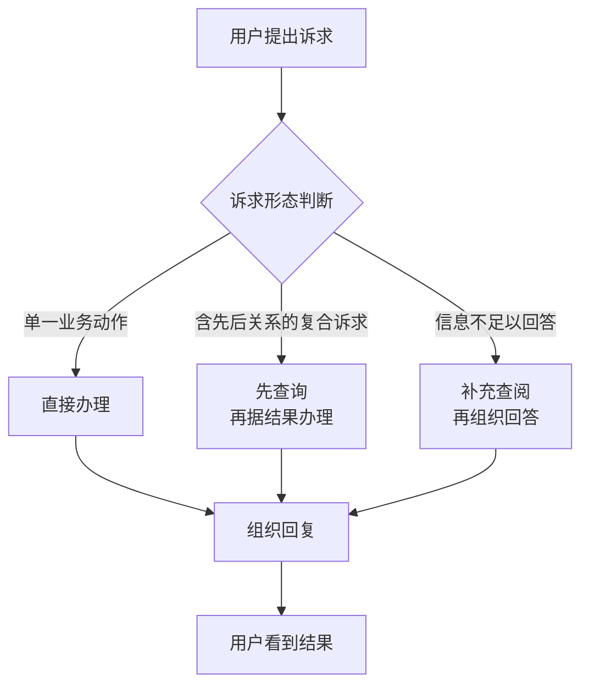
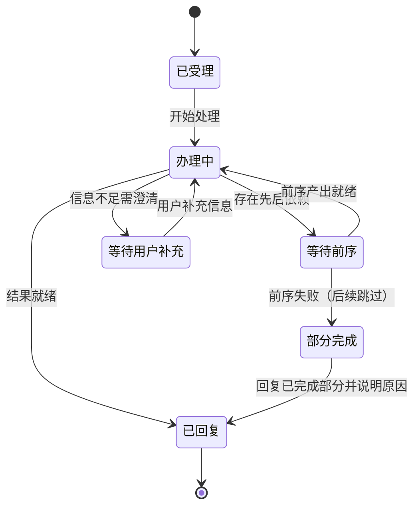

# 三书认知装配层与会话编排 — PRD（规格 / Spec）

> **日期**：2026-09-10
> **来源**：原始需求 [三书认知装配层_需求_V1.md](三书认知装配层_需求_V1.md)（V2.1 修订版）
> **参与角色**：需求分析师、Emily 资深架构师、技术总监、DBA/数据架构师、LLM 工程专家、资深测试工程师
> **宪法版本**：v1.0
> **阶段**：Specify（规格）——方案型技术设计见后续 [三书认知装配层_计划_V1.md](三书认知装配层_计划_V1.md)

---

## 一、背景与目标

### 1.1 背景

Emily 的设计把"世界书 / 规则书 / 认知书"（下称**三书**）定位为**上下文组织层**——以"摘要先行、按需深入"的方式，为每次会话提供项目态势、适用约束与系统能力的公共认知。

实际实现经历两次跑偏，导致三书与 Agent 的认知路径**断连**：

| 阶段 | 做法 | 后果 |
|------|------|------|
| 早期 | 三书全文灌入会话提示 | 上下文膨胀、每轮成本与延迟上升，违背"摘要先行" |
| 后续修正 | 一次性移除三书的全部占位与注入 | **矫枉过正**：连摘要与索引一并删除，三书退化为"只在运维侧可见的展示工件" |

**结果**：三书数据虽仍被加载，但既未进入 Agent 的判断依据，也没有任何通道让 Agent 在需要时深入查阅。Agent 对"项目现在什么情况、受什么约束、自己有什么能力"缺乏基本认知。

同时，会话对复杂诉求的处理是**一次性、扁平化**的——把用户请求拆成若干互不相关的动作并行执行，带来三类能力缺口：

| 缺口 | 典型诉求 | 现状 |
|------|---------|------|
| 有先后的复合诉求 | "查一下逾期节点，然后给每个负责人发提醒" | 只能猜，无法保证"先查后发" |
| 信息不足时自主补齐 | "项目有没有需要注意的质量问题" | 一次取数不足就只能给出不完整回答 |
| 跨域取数 | 结论需要规范 / 制度依据支撑 | 被限制在单一业务域内，不能自主跨域查阅 |

### 1.2 目标与成功指标

| 目标 | 成功指标（可度量） |
|------|------------------|
| 恢复三书作为"上下文组织层"的作用 | 每次会话均携带项目态势 / 适用约束 / 系统能力三类常驻摘要；**摘要注入率 100%**（无未替换占位、无空摘要） |
| 摘要不挤压上下文 | 单类常驻摘要篇幅 **≤ 200 字**；三类合计增量 ≤ 800 字 |
| 三书可按需深入 | 会话内可查阅三书全文；**查阅可用率 100%**（含无数据时的友好失败） |
| 权限零泄漏 | 越权用例 **泄漏数 = 0**（摘要与查阅结果均 ⊆ 操作者可见范围） |
| 有先后的复合诉求可编排 | "先查后办"类诉求**依赖序执行成功率 100%**；前置失败时**会话不中断率 100%** |
| 信息不足时可自主补齐（只读） | 触发补齐后**回答完整度提升**（补齐动作被纳入最终回答）；补齐动作 **100% 为只读**、**0 越权**、**0 递归** |
| 简单诉求不受影响 | 单一业务动作**不新增规划调用**；端到端响应时间劣化 **≤ 20%** |
| 成本可控（复用前缀缓存） | 同一会话内固定提示部分**逐字节一致率 100%** |
| 三书更新即时生效 | 三书变更后进行中会话**下一轮即获得新摘要**（无需重建会话） |

### 1.3 非目标（明确不做）

- 不改动三书的内容生成与语义质量（生成器与内容标准不在本次范围）
- 不新增写操作的自动编排（动态补齐只允许只读）
- 不改变权限模型的等级定义与权限线
- 不引入三书全文的语义（向量）检索
- 不做会话之外的批处理 / 离线任务
- 不引入新的第三方依赖

---

## 二、需求登记表（核心章节）

### 2.1 用户故事与验收标准

**US-01**｜角色：普通员工｜场景：直接问"翠湖庭院项目现在什么情况"｜期望：Emily 依据项目当前态势给出与实情一致的回答，无需用户先解释背景｜优先级：P0

| AC-ID | 验收标准（可判定） | 验证方式 |
|-------|------------------|---------|
| AC-US-01.1 | 会话具备项目态势认知：对"项目现在什么情况"类提问，回答内容与项目实际阶段 / 节点进展 / 近期事件一致，用户未提供任何项目背景 | 对话回复 + 会话记录中的固定提示内容 |
| AC-US-01.2 | 态势信息按操作者的可见节点范围裁剪：低权限用户看不到未授权节点的名称与进展 | 不同权限用户对话对照 + 会话记录 |
| AC-US-01.3 | 单类常驻态势摘要不超过 200 字 | 会话记录中的摘要篇幅测量 |

**US-02**｜角色：项目管理者｜场景：说"帮我查一下逾期节点，然后给每个负责人发提醒"｜期望：系统确实先查再办，提醒基于实际查询结果发出｜优先级：P0

| AC-ID | 验收标准（可判定） | 验证方式 |
|-------|------------------|---------|
| AC-US-02.1 | "先查后办"类诉求按真实先后关系执行：后一步骤在前一步骤产出就绪后才开始 | 对话回复 + 会话记录中的处理步骤顺序 |
| AC-US-02.2 | 前一步骤失败时，依赖它的后续步骤被标记为"已跳过"；整轮会话不中断，用户仍收到已有结果与可理解的说明 | 构造失败场景的对话 + 会话记录 |
| AC-US-02.3 | 编排链路存在深度上限；达到上限即停止继续派生，并回复已完成的结果（不得无限派生） | 构造多级派生场景 + 会话记录 |

**US-03**｜角色：访客 / 低权限用户｜场景：问"我能看到哪些数据"｜期望：只被告知自己有权访问的数据范围｜优先级：P0

| AC-ID | 验收标准（可判定） | 验证方式 |
|-------|------------------|---------|
| AC-US-03.1 | 系统能力摘要中列出的数据资源只含当前操作者有权访问的部分；无权限资源零泄漏 | 不同权限用户对话对照 + 数据权限记录比对 |
| AC-US-03.2 | 摘要包含与权限无关的公共知识部分（权限分级体系、文件分类体系） | 对话回复 / 会话记录 |
| AC-US-03.3 | 单类常驻能力摘要不超过 200 字 | 会话记录中的摘要篇幅测量 |

**US-04**｜角色：任何用户｜场景：追问某方面更细的态势 / 规则 / 能力细节｜期望：能按需深入查阅到更完整的三书内容，且不超出自己的权限｜优先级：P0

| AC-ID | 验收标准（可判定） | 验证方式 |
|-------|------------------|---------|
| AC-US-04.1 | 存在一项会话内可用的"按需查阅"能力，覆盖三书全文，且对全部业务域可用 | 会话中触发查阅 + 会话记录 |
| AC-US-04.2 | 查阅结果已按调用者权限裁剪，对无权限内容零泄漏 | 低权限用户查阅 + 与权限记录比对 |
| AC-US-04.3 | 支持关键词过滤：给定关键词时，返回内容仅含相关内容 | 带关键词的查阅请求 |
| AC-US-04.4 | 该能力为只读；在最低权限档位亦可用，且不得因此获得任何写能力 | 最低权限用户查阅 + 写操作尝试被拒 |
| AC-US-04.5 | 查阅对象非法或不存在时，返回可理解的提示，不报错、不中断会话 | 非法 / 空数据场景对话 |

**US-05**｜角色：任何用户｜场景：问"翠湖庭院有没有需要注意的质量问题"｜期望：信息不足时 Emily 主动补充查阅后给出综合回答｜优先级：P0

| AC-ID | 验收标准（可判定） | 验证方式 |
|-------|------------------|---------|
| AC-US-05.1 | 当执行结果不足以回答诉求时，系统能自动补充一次查阅并纳入最终回答 | 构造信息不足场景的对话 + 会话记录中的步骤 |
| AC-US-05.2 | 补充查阅以原请求者身份执行，不得获取其不可见的信息 | 低权限用户触发补齐 + 结果越权检查 |
| AC-US-05.3 | 补充动作只能是只读；写操作不得被动态追加 | 补齐场景中的动作类型核对（无写操作产生） |
| AC-US-05.4 | 单轮补充次数有上限，且补充动作不再触发新的补充（防链式膨胀） | 构造可链式触发的场景 + 会话记录 |

**US-06**｜角色：使用 Emily 的团队成员｜场景：任何一次交互｜期望：Emily 的判断视角始终一致地体现"团队公共大脑"的身份与边界，不替代人做组织决策｜优先级：P1

| AC-ID | 验收标准（可判定） | 验证方式 |
|-------|------------------|---------|
| AC-US-06.1 | 每次会话的判断依据最前部即包含身份与边界声明，且该声明内容固定（不随用户 / 项目 / 业务变化） | 会话记录中的固定提示内容 + 多场景对照 |
| AC-US-06.2 | 身份与边界声明在所有业务场景下均存在，不因业务类型而缺失 | 多业务类型对话对照 |

**US-07**｜角色：项目管理者｜场景：成员咨询规则 / 边界｜期望：不同权限线、不同等级的成员只看到适用于自己的规则条文｜优先级：P1

| AC-ID | 验收标准（可判定） | 验证方式 |
|-------|------------------|---------|
| AC-US-07.1 | 规则摘要只含适用于当前操作者等级的条文；更高等级专属条文不得出现 | 不同等级用户对照 + 会话记录 |
| AC-US-07.2 | 被标记为"仅供人读、不注入模型"的规则条文，不得出现在摘要中，也不得通过按需查阅返回 | 针对该类条文的查阅尝试 + 摘要检查 |
| AC-US-07.3 | 规则条文未标注适用等级时按全员可见处理（不得因标注缺失而静默丢条文） | 缺标注场景的摘要与查阅结果 |

**US-08**｜角色：系统成本责任方｜场景：同一会话内连续多次交互｜期望：固定提示部分保持稳定以复用模型前缀缓存｜优先级：P1

| AC-ID | 验收标准（可判定） | 验证方式 |
|-------|------------------|---------|
| AC-US-08.1 | 同一会话内，每次请求的固定提示部分逐字节一致 | 同一会话多轮请求的提示内容逐字节比对 |
| AC-US-08.2 | 随操作者变化的摘要与权限信息不进入固定部分（即不得破坏上述稳定性） | 群聊多用户交替发言时的提示对比 |

**US-09**｜角色：项目管理者｜场景：编辑三书内容后｜期望：进行中的会话无需重建即可获得更新后的摘要｜优先级：P2

| AC-ID | 验收标准（可判定） | 验证方式 |
|-------|------------------|---------|
| AC-US-09.1 | 三书内容更新后，进行中的会话在刷新时获得更新后的摘要，无需重建会话 | 变更三书后继续同会话对话 + 摘要比对 |
| AC-US-09.2 | 刷新失败时保留原摘要继续服务，不中断会话 | 构造取数失败 + 会话可用性检查 |

**US-10**｜角色：普通员工｜场景：发起单一业务动作（如记录一条事件）｜期望：响应速度不因新增的编排能力而变慢｜优先级：P1

| AC-ID | 验收标准（可判定） | 验证方式 |
|-------|------------------|---------|
| AC-US-10.1 | 单一业务动作请求不触发额外的规划调用 | 单动作请求的模型调用链比对 |
| AC-US-10.2 | 单一业务动作的端到端响应时间相对改造前无显著劣化（≤20%） | 改造前后响应时间对照 |
| AC-US-10.3 | 编排能力具备关闭开关；关闭后系统行为与改造前一致，功能不中断 | 关闭开关后的复合诉求对话 |

### 2.2 US 清单（下游追溯锚点）

| US-ID | 一句话 | 优先级 | 状态 |
|-------|--------|--------|------|
| US-01 | 会话具备项目态势认知，且按可见节点范围裁剪 | P0 | 生效 |
| US-02 | 有先后的复合诉求按依赖序执行，前置失败不中断会话 | P0 | 生效 |
| US-03 | 会话具备系统能力认知，且按数据访问权限裁剪 | P0 | 生效 |
| US-04 | 三书全文可按需查阅，只读、可按关键词过滤、零越权 | P0 | 生效 |
| US-05 | 信息不足时可自主补齐（只读、原请求者权限、有上限、不递归） | P0 | 生效 |
| US-06 | 会话始终体现"团队公共大脑"的身份与边界 | P1 | 生效 |
| US-07 | 规则按权限等级适用，人读条文不外泄，缺标注不丢条文 | P1 | 生效 |
| US-08 | 固定提示部分逐字节稳定，复用模型前缀缓存 | P1 | 生效 |
| US-09 | 三书更新后进行中会话自动获得新摘要（失败保留原值） | P2 | 生效 |
| US-10 | 简单诉求不因编排能力而变慢，且编排可开关 | P1 | 生效 |

> req-plan 依此声明各功能域 / 模块实现哪些 US；req-verify 依此逐条回验并输出规格符合度。

---

## 三、业务规则与流程

### 3.1 业务规则

| # | 规则 | 说明 |
|---|------|------|
| R1 | **摘要先行、按需深入** | 常驻只放语义骨架（项目态势 / 适用规则 / 能力边界），明细一律走按需查阅 |
| R2 | **按人裁剪** | 一切常驻摘要与按需查阅结果，均按**当前操作者**（非会话创建者）的权限口径裁剪；群聊中成员之间互不可见 |
| R3 | **补齐只读** | 信息不足时只允许自动补齐**只读检索**；任何写入仍须走原有标准流程与确认 |
| R4 | **简单诉求不增负** | 单一业务动作不触发额外规划；编排能力仅作用于有先后关系或信息不足的诉求 |
| R5 | **缺标注 fail-open** | 规则条文未标注适用等级时按**全员可见**处理，避免标注缺失导致条文静默失效 |
| R6 | **失败降级不中断** | 摘要取数 / 刷新失败保留原值继续服务；编排规划失败回退为扁平执行；用户始终得到可理解的回复 |
| R7 | **派生有界** | 编排派生有深度与次数上限；派生出的动作**不再派生**，防链式膨胀 |
| R8 | **固定部分不含权限信息** | 随操作者变化的摘要与权限信息不进入会话固定提示部分，以保持前缀稳定 |
| R9 | **只读能力普惠** | 按需查阅归入只读能力，最低权限档位亦可用，但不因此获得任何写能力 |

### 3.2 业务流程（业务级）

> 此图展示用户诉求进入系统后的业务分流：单一动作直接办理；含先后关系的复合诉求先查后办；信息不足则先补充查阅再作答。

### 3.3 业务状态流转

> 描述用户可感知的诉求处理状态（非代码状态机）。"等待前序"与"部分完成"为本需求新增的可见状态。

---

## 四、边界与约束

### 4.1 触碰的宪法铁律

| 铁律 | 影响 | 处理 |
|------|------|------|
| **C0 根治而非迁就** | 权限裁剪必须以"当前操作者"为口径，否则群聊场景越权 | 遵循：以根治口径设计，不用会话创建者权限凑合 |
| **C1 业务内核独立** | 无跨容器依赖变更 | 不涉及 |
| **C2 分层不可跳** | 新增的裁剪与装配逻辑须落在会话层内，数据读取仍经既有数据访问路径 | 遵循 |
| **C3 SOP 即路由** | 不新增 / 修改业务流定义 | 不涉及 |
| **C4 Hook 声明式 JSON** | 不新增 Hook | 不涉及 |
| **C5 结构化输出优先** | 不改变既有工具调用范式 | 不涉及 |
| **C6 Sync repo + to_thread** | 按需查阅涉及数据读取，须遵守"同步数据访问 + 异步包装" | 遵循 |
| **C7 Hook 三态 deny-wins** | 不涉及 | 不涉及 |
| **C8 唯一执行引擎** | 编排须复用既有唯一执行路径，不得新建第二套执行链 | 遵循 |
| **C9 ToolManager / ScriptManager 边界** | 新增开发者脚本与运行时能力互不调用 | 遵循 |
| **C10 工具必须带参数 schema** | 新增按需查阅能力须完整提供参数约束 | 遵循 |
| **C11 功能注册接入（元原则）** | 新能力须经既定注册通道接入；不得留下无人调用的孤儿实现 | 遵循 |

> 结论：本需求**不违反**任一条铁律；C0 / C2 / C6 / C8 / C9 / C10 / C11 为必须遵守项，下游计划须逐条回应（见 [计划](三书认知装配层_计划_V1.md) 的"硬约束"与"PRD 约束落实"）。

### 4.2 范围边界

| 在范围内 | 不在范围内 |
|---------|-----------|
| 三类常驻摘要（项目态势 / 适用规则 / 系统能力）的恢复与按人裁剪 | 三书内容生成与语义质量 |
| 身份与边界声明的常驻 | 权限模型的等级定义与权限线调整 |
| 三书全文按需查阅（只读、关键词过滤） | 三书全文的语义（向量）检索 |
| 有先后关系的复合诉求编排 | 写操作的自动编排 |
| 信息不足时的只读自动补齐 | 会话之外的批处理 / 离线任务 |
| 摘要热更新、前缀稳定、编排可开关 | 前端 / IM 展示样式改造 |

### 4.3 假设与依赖

| # | 假设 / 依赖 | 若不成立的影响 |
|---|------------|--------------|
| 1 | 三书权威层产出可用（世界书 / 规则书 / 认知书均已生成且可读） | 摘要为空，US-01 / US-03 / US-04 无法达成（降级为"（无）"，不报错） |
| 2 | 现有权限模型可提供按人裁剪所需的口径（可见节点、权限等级、数据访问权限） | US-01.2 / US-03.1 / US-04.2 / US-05.2 的裁剪无法保证，须回退 req-review 调整规格 |
| 3 | 既有会话链路与执行链路可承载编排与动态补齐 | US-02 / US-05 无法达成 |
| 4 | 模型服务可用 | 编排规划降级为扁平执行（US-02 降级）；其余能力不受影响 |
| 5 | 规则书条文可按适用等级标注 | US-07.1 无法精确裁剪，退化为 US-07.3 的全员可见 |

### 4.4 约束型技术决策

> **约束**（不是方案）：规定"必须 / 不得"什么，不规定"用哪个"实现。这类决策属规格，下游计划与测试须据此校验。

| # | 约束 | 来源 / 理由 |
|---|------|-----------|
| 1 | 必须复用现有三书权威层产出与现有裁剪口径，**不得**新建第二套三书生成或存储 | 避免重复建设与数据不一致 |
| 2 | **不得引入新的第三方依赖**，仅使用项目已有能力 | 部署与维护成本（宪法 Q5） |
| 3 | 新增能力必须经现有**注册通道**接入（C11），不得裸调用 / 硬编码接线 | 宪法 C11 |
| 4 | 编排必须复用**既有唯一执行路径**，不得新建第二套执行链（C8） | 宪法 C8 |
| 5 | 必须复用现有权限口径做裁剪，**不得**新增或调整权限线 / 等级定义 | 与鉴权引擎保持一致，避免两套口径 |
| 6 | 新增的按需查阅能力必须提供完整的**参数约束**（C10） | 宪法 C10 |
| 7 | 随操作者变化的摘要与权限信息**不得进入**会话固定提示部分 | 保证前缀稳定、复用模型前缀缓存；同时防群聊越权 |
| 8 | 规则裁剪必须**兼容未标注适用等级的存量条文**（缺标注按全员可见） | 避免规则书改版后条文静默失效 |
| 9 | 三书数据的结构扩展必须**向后兼容**既有存量数据（缺失新结构时降级不报错） | 避免上线即需要全量重建 |
| 10 | 按需查阅与补齐动作必须**只读**，且在任何权限档位下都不得产生写能力 | 安全边界（R3 / R9） |
| 11 | 数据读取须遵守"同步数据访问 + 异步包装"约定（C6） | 宪法 C6 |

---

## 五、替代方案

### 5.1 不新建"按需查阅"能力，复用现有知识检索与数据查询

**方案**：三书全文不提供专门的查阅通道，需要更详细内容时走现有的知识库检索或数据查询。

**否决理由**：三书全文未必在知识库索引中，数据查询面向的是业务数据而非三书内容，两者都无法覆盖"项目态势 / 规则条文 / 系统能力"的深入查阅。US-04 将无法达成。

### 5.2 把编排逻辑内联到会话主脑，而非独立编排能力

**方案**：不设独立的编排能力，直接在会话主脑的诉求拆分逻辑中增加依赖与补齐处理。

**否决理由**：编排策略会与会话主脑职责耦合，无法独立开关与回退，也无法替换规划策略；且用户故事 US-10.3 要求编排可关闭，内联方案难以干净回退。

### 5.3 摘要按会话创建者权限裁剪（而非当前操作者）

**方案**：为降低实现复杂度，常驻摘要统一按会话创建者的权限裁剪。

**否决理由**：群聊中会话创建者可能是高权限者，会导致低权限成员看到越权摘要。违反 R2 与 C0，属"迁就"而非"根治"。**否决**。

---

## 六、风险与开放问题

| # | 风险 / 开放问题 | 类型 | 影响 | 缓解 / 待决 |
|---|----------------|------|------|------------|
| 1 | 常驻摘要挤压上下文 | 业务 | 每轮成本与延迟上升 | 摘要篇幅上限（200 字 / 类）；只放语义骨架 |
| 2 | 摘要未按操作者裁剪 | 业务 | 群聊越权泄漏 | 以当前操作者权限实时裁剪（R2） |
| 3 | 摘要进入固定提示部分 | 约束 | 前缀缓存失效 + 越权 | 摘要与权限信息走"每轮渲染"路径（约束 #7） |
| 4 | 编排无限派生 | 业务 | 失控、成本不可控 | 深度上限 + 单轮补齐次数上限 + 派生不再派生（R7） |
| 5 | 编排拖慢简单诉求 | 业务 | 体验劣化 | 简单诉求不触发规划（R4）；编排可开关（US-10.3） |
| 6 | 规则书改造遗漏标注 | 业务 | 条文静默失效 | 缺标注按全员可见（R5 / 约束 #8）+ 标注完整性检查 |
| 7 | 旧三书数据缺结构化骨架 | 约束 | 摘要退化为"仅统计" | 向后兼容降级（约束 #9）+ 一次性补齐手段 |
| 8 | 关键词匹配可能漏检 | 业务 | 按需查阅召回不足 | 优先保证零越权与结果可预期；语义检索另立需求评估 |
| 9 | **开放问题**：单项目节点规模很大时摘要与查阅结果的体量控制策略 | 约束 | 响应体过大 | 待 req-plan 评估（附录 B #2 / #11） |

---

## 附录 A：规格变更记录

| 版本 | 日期 | 变更内容 | 影响的 US |
|------|------|---------|----------|
| V1 | 2026-09-10 | 初版（新规格格式）。规格条目沿用既有稳定 ID `US-01~US-10` 与 `AC-US-xx.y`（共 30 条），**未重编号**；按宪法 §1.2 收敛为纯规格：移除全部方案型技术设计（模块编号 / 文件路径 / 数据结构样例 / 系统架构图），改按**功能域**描述边界；新增 §1.2 目标与成功指标、§1.3 非目标、§4.4 约束型技术决策、附录 B。**取代并删除**旧格式的 PRD V1 与 V2（依宪法 §1.5 新老划断，旧件为存量格式） | 全部 |

---

## 附录 B：留给 req-plan 的方案型技术问题

> 本技能**不解答**以下问题，仅登记为 req-plan / DD 的输入。
> **只登记"用哪个方案实现"类问题**；"必须 / 不得"类约束已写入 §4.4。

| # | 方案型技术问题 | 为何须在计划 / DD 阶段定 |
|---|---------------|----------------------|
| 1 | 三类常驻摘要的裁剪结果存放位置（复用既有元认知字段还是新增字段 / 表） | 属数据与模块组织决策 |
| 2 | 世界书是否需扩展为按节点分段的骨架结构；存量数据如何兼容与补齐 | 涉及数据模型与迁移方案 |
| 3 | 规则书"适用等级"的承载形式（文件内标注 / 结构化存储）与解析方式 | 涉及数据格式与解析实现 |
| 4 | 裁剪与渲染逻辑落在哪一层（会话装配层 / 数据采集层） | 涉及分层落位 |
| 5 | 按需查阅的检索方式（关键词匹配 / 语义检索） | 涉及实现成本与效果权衡 |
| 6 | 编排能力是新建独立组件还是扩展既有诉求拆分方法 | 涉及模块划分 |
| 7 | 依赖序执行的调度实现（拓扑分层并行 / 全顺序） | 涉及并发与上下文隔离 |
| 8 | 动态补齐时目标检索能力的选定机制（显式指定 / 由执行层自行选择） | 涉及执行层契约 |
| 9 | 新增配置项（开关、深度上限、补齐次数上限）的命名与默认值 | 涉及配置一致性 |
| 10 | 三书存量数据的补齐手段（迁移脚本 / 重新生成） | 涉及上线步骤与回滚 |
| 11 | 大项目场景下摘要与查阅结果的体量控制（截断 / 分层加载） | 涉及风险 #9 的落地 |

---

*本 PRD 为规格（Spec），由 req-review 多轮对话生成，基于 Emily 项目上下文与项目宪法 v1.0。方案型技术设计见 [三书认知装配层_计划_V1.md](三书认知装配层_计划_V1.md)。*
