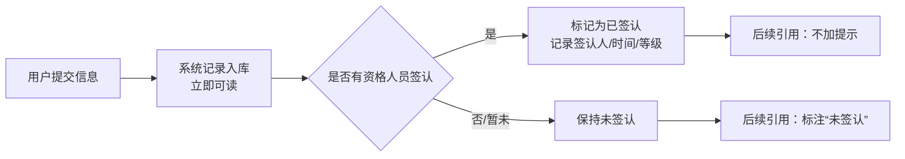
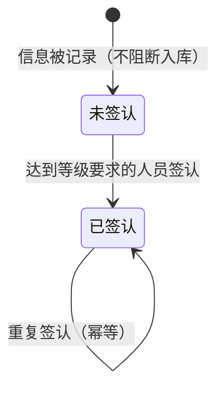

# 部门移除与签认机制 — PRD（规格 / Spec）

> **日期**：2026-09-10
> **来源**：多轮对话产出（本轮关于"项目归属/可见范围/部门归属"的讨论 + 架构分析）
> **参与角色**：需求分析师、Emily 开发者资深架构师、技术总监；自适应角色：数据与权限架构师、项目业务专家（施工管理）
> **宪法版本**：v1.0
> **阶段**：Specify（规格）——方案型技术设计见后续 `部门移除与签认机制_计划_V*.md`

---

## 一、背景与目标

### 1.1 背景

**为什么做**

本次排查"项目归属与可见范围"时，牵出一个更底层的问题：系统把"**部门**"当作了一个权限维度，但它在现有体系里既没有主数据，也没有"人属于哪个部门"的事实来源，导致：

1. **判定逻辑是坏的**：基于部门匹配的审批权限判定，在实际调用时会因引用不存在的用户部门信息而**直接报错**，而不是正常拒绝；
2. **名实不符**：节点上的"主责部门"标识名为标识、实为中文部门名（"项目部""工程部""建筑所""项目总"），其中"项目总"在任何单位下都**不存在对应部门**，成为永远无人可审的孤值；
3. **能力本就没在用**：相关过滤能力**无任何调用者**，SOP 层的部门匹配开关**全部为空**；权限分组里"部门"带来的区分度，与"人员等级"高度重合（多数分组仅差在等级上）；
4. **审批阻塞与现场实际不符**：现状"未审批不生效"，而项目现场的真实诉求是"**信息先记录、后认可**"——信息不应因没人签认就进不来。

**要解决什么**

把"部门"这个**没有事实基础的中间概念**从权限归口中移除，让权限回归两个有数据支撑的维度（**单位性质 + 人员等级**）；并用"**签认**"替换"**审批**"，把"能不能入库"（阻断）改为"可不可信"（标注）。

### 1.2 目标与成功指标

| 目标 | 成功指标（可度量） |
|------|------------------|
| 权限归口不再依赖部门 | 权限判定结果中，**不存在**任何"仅靠部门不同而产生差异"的能力集合；部门信息缺失/为空时判定结果不变 |
| 判定的"报错"归零 | 对任意等级的用户执行原部门相关判定路径，**不再出现运行时异常**（表现为正常放行或正常拒绝） |
| 信息记录不再被签认阻断 | 用户提交信息后，**无论是否有人签认**，均得到入库成功的反馈（成功率 100%） |
| 未签认信息可被识别 | Emily 引用未签认信息时，用户可见回复中**出现明确的"未签认"标识**；已签认信息不出现 |
| 存量干净 | 迁移完成后，业务对象上**不再携带部门标识**；**不存在**卡在"待审批"状态的历史对象 |
| 概念收敛 | 全系统**不再新增**任何以"部门"为维度的权限/归属字段 |

### 1.3 非目标（明确不做）

- **不做**"部门主数据"建设（不新建部门表、不做人员-部门归属）——本次的方向是**移除**该维度，而非补全；
- **不做**审批流引擎（多级会签、驳回流转、超时升级）——签认只表达"谁认可了"，不是工作流；
- **不做**历史业务数据的语义回填（如把历史部门名映射为其它维度）——只做**清空/归零**；
- **不做**对外权限模型的重新分级（等级仍为现有 6 级）——不新增、不调整等级定义；
- **不做**前端/IM 展示样式。

---

## 二、需求登记表（核心章节）

### 2.1 用户故事与验收标准

**US-01**｜角色：任一用户｜场景：使用系统能力时｜期望：其可用能力**不再因"部门"而不同**｜优先级：P0

| AC-ID | 验收标准（可判定） | 验证方式 |
|-------|------------------|---------|
| AC-US-01.1 | 对"相同单位性质、相同等级"但部门不同的两名用户，系统判定的可用能力集合**完全一致** | 取两名此类真实用户，核对各自可用能力清单并比对 |
| AC-US-01.2 | 用户所属单位的部门信息为空、缺失或与任何既有取值都不匹配时，其可用能力**与信息完整时一致**（不减少、不增加） | 构造部门信息为空/异常的用户，核对能力清单与常规用户一致 |
| AC-US-01.3 | 系统中不存在任何**仅有部门参与、而无单位性质或等级参与**的权限判定 | 逐条核对权限判定规则，确认每条均含单位性质或等级 |

**US-02**｜角色：任一用户｜场景：需要判断其权限时｜期望：权限由**单位性质 + 人员等级**唯一确定｜优先级：P0

| AC-ID | 验收标准（可判定） | 验证方式 |
|-------|------------------|---------|
| AC-US-02.1 | 给定"单位性质 + 等级"，其可用能力集合**唯一确定**（同组合的任意用户结果相同） | 抽取同单位性质、同等级的多个用户，比对结果一致 |
| AC-US-02.2 | 能力集合的差异**只可能**来自"单位性质"或"等级"两个维度之一 | 对比不同维度用户的差异，确认差异可归因到这两个维度 |
| AC-US-02.3 | 现有权限分组在移除部门后**不产生能力冲突**（不存在"同单位性质同等级却要求不同能力"的分组） | 逐组比对移除部门后的能力要求，列出并处置冲突项 |

**US-03**｜角色：项目管理者、Emily｜场景：沟通与展示时｜期望：口头称呼**映射到**等级/单位性质，而**不作为独立概念**存在｜优先级：P1

| AC-ID | 验收标准（可判定） | 验证方式 |
|-------|------------------|---------|
| AC-US-03.1 | "项目总"这一称呼，在系统内一律对应到**固定等级**的语义，且**不产生独立字段或独立判定分支** | 全文检索确认无独立字段/分支；核查该称呼的映射说明存在且唯一 |
| AC-US-03.2 | "项目部"不再被理解为"总包单位"，而对应"**操盘的管理单位**"语义；"谁在操盘"可由单位性质/管理属性唯一确定 | 对同一项目，核对管理单位判定结果唯一且与业务认知一致 |
| AC-US-03.3 | 同一口头称呼在不同单位性质下**不产生歧义**（要么唯一映射，要么明确说明适用范围） | 抽查称呼映射表，确认无一对多歧义 |

**US-04**｜角色：任一用户｜场景：提交需要被认可的信息时｜期望：系统以"**签认**"替代"**审批**"，且**不阻断**入库｜优先级：P0

| AC-ID | 验收标准（可判定） | 验证方式 |
|-------|------------------|---------|
| AC-US-04.1 | 业务对象**不再存在**"必须审批通过才生效"的阻断状态；相关状态不再出现在任何用户可见状态清单中 | 核对状态清单与业务流转说明，确认无"待审批"阻断态 |
| AC-US-04.2 | 用户提交信息后，即使无任何签认，也收到**成功的入库反馈** | 用真实用户提交一条信息，观察反馈为成功（非"待审批"） |
| AC-US-04.3 | 签认**不是**入库前置条件：签认动作可发生在入库之后，且不影响已入库信息的可读性 | 先入库后签认，确认入库后即可读、签认后标识变化 |

**US-05**｜角色：任一用户｜场景：查询/引用未签认信息时｜期望：被**明确提示**"未签认"｜优先级：P0

| AC-ID | 验收标准（可判定） | 验证方式 |
|-------|------------------|---------|
| AC-US-05.1 | 当 Emily 在回复中引用**未签认**信息时，回复文本中必须出现"未签认"（或等价明确措辞）标识 | 以未签认数据发起提问，检查回复文本含该标识 |
| AC-US-05.2 | 当信息**已签认**时，回复中**不出现**该标识 | 以已签认数据发起提问，检查回复文本不含该标识 |
| AC-US-05.3 | 提示必须出现在**用户可见的回复**中，不得仅记录日志或仅在内部提示中出现 | 检查用户侧回复文本（非日志） |
| AC-US-05.4 | 未签认信息**可被正常检索与展示**，不因未签认而被隐藏或拒绝返回 | 以未签认数据检索，确认结果正常返回（带标识） |

**US-06**｜角色：具备签认资格的人员｜场景：签认一条信息时｜期望：签认动作被**记录**且**可判定是否满足等级要求**｜优先级：P1

| AC-ID | 验收标准（可判定） | 验证方式 |
|-------|------------------|---------|
| AC-US-06.1 | 每类需要签认的业务对象，都有**明确且唯一**的"需几级签认"设定 | 核对签认等级要求表，确认每类对象均有且仅有一个要求值 |
| AC-US-06.2 | 签认后，该信息记录**签认人、签认时间、签认时的等级**三项信息 | 执行一次签认，核对三项记录齐备 |
| AC-US-06.3 | 等级不足者执行签认时，系统给出**明确的"等级不足"反馈**（而非运行时异常） | 用低于要求的等级用户签认，确认返回明确拒绝原因 |
| AC-US-06.4 | 重复签认**不产生冲突**（幂等：要么接受并更新，要么明确告知已签认） | 对同一信息连续签认两次，确认无异常且状态一致 |

**US-07**｜角色：系统运维/迁移执行者｜场景：本次上线迁移时｜期望：**存量清理**且**不破坏既有数据可用性**｜优先级：P0

| AC-ID | 验收标准（可判定） | 验证方式 |
|-------|------------------|---------|
| AC-US-07.1 | 迁移完成后，业务对象上**不存在**非空的部门标识（全部清空/归零） | 全量核对业务对象的部门标识取值，确认无非空值 |
| AC-US-07.2 | 迁移完成后，**不存在**停留在"待审批"类状态的历史对象 | 全量核对状态分布，确认无该类状态 |
| AC-US-07.3 | 迁移**不改变**既有信息的可见范围与内容（除部门标识与状态外，其余字段逐条一致） | 迁移前后对同一批对象做内容比对，差异仅限约定范围 |
| AC-US-07.4 | 迁移**可重复执行**且结果一致（幂等），并支持**先预览不写库** | 连续执行两次全量迁移，第二次无新增变更；预览模式不产生写入 |

### 2.2 US 清单（下游追溯锚点）

| US-ID | 一句话 | 优先级 | 状态 |
|-------|--------|--------|------|
| US-01 | 权限不再因"部门"而不同 | P0 | 生效 |
| US-02 | 权限归口由"单位性质 + 等级"唯一确定 | P0 | 生效 |
| US-03 | 口头称呼（项目总/项目部）映射到等级与单位性质，不独立存在 | P1 | 生效 |
| US-04 | 以"签认"替代"审批"，不阻断入库 | P0 | 生效 |
| US-05 | 未签认信息在使用时被明确提示 | P0 | 生效 |
| US-06 | 签认可判定等级要求并留痕 | P1 | 生效 |
| US-07 | 存量部门标识与阻断状态被清理且迁移幂等 | P0 | 生效 |

> req-plan 依此声明各功能域实现哪些 US；req-verify 依此逐条回验并输出规格符合度。

---

## 三、业务规则与流程

### 3.1 业务规则

| # | 规则 | 说明 |
|---|------|------|
| R1 | 权限只由"单位性质 + 人员等级"决定 | 部门不参与任何权限判定 |
| R2 | 不新增以"部门"为维度的权限/归属概念 | 口头称呼须映射到等级或单位性质 |
| R3 | "项目总"是等级（L5 级人员）的口头称呼 | 不建字段、不建分支 |
| R4 | "项目部"指操盘的**管理单位**，不是"总包" | "谁在操盘"由管理属性/单位性质判定 |
| R5 | 信息**入库不受签认约束** | 无签认也必须成功入库 |
| R6 | 签认表达"**被谁认可**"，不是流程 | 不做多级会签、驳回流转 |
| R7 | 未签认信息**可用但须标注** | 检索/展示/引用时提示"未签认" |
| R8 | 签认有**等级门槛**，且留痕（人/时间/等级） | 等级不足时明确拒绝 |
| R9 | 存量部门标识与阻断状态**一次性清理** | 迁移幂等、可预览、可重复执行 |

### 3.2 业务流程（业务级）

> 展示"信息从记录到被认可"的业务步骤：入库不等待签认，签认只改变可信标注。

### 3.3 业务状态流转（如有）

> 仅描述**业务可见状态**：两个状态都可用，区别只在"可信标注"。

---

## 四、边界与约束

### 4.1 触碰的宪法铁律

| 铁律 | 影响 | 处理 |
|------|------|------|
| C0 根治而非迁就 | 本需求正是"去掉无事实基础的概念"，而非为部门补齐数据 | 遵循 |
| C2 分层不可跳 | 权限判定仍须在权限层完成；签认信息的读写须经既有分层 | 遵循 |
| C6 Sync repo + to_thread | 若新增签认相关数据访问，须遵守"仓储同步 + 异步包装" | 遵循 |
| C10 工具必须带参数 schema | 若新增"签认"类工具，须三步齐备 | 遵循 |
| C11 功能注册接入 | 新增签认能力必须经现有注册通道接入，禁止裸接线；出现孤儿须停下提醒 | 遵循 |
| Q1 验收可执行 / Q2 证据驱动 | 各 AC 已给出可观察的判定方式；测试阶段须附真实证据 | 遵循 |
| Q5 无越界 | 不得顺带重构无关模块；不得引入新依赖 | 遵循 |

### 4.2 范围边界

| 在范围内 | 不在范围内 |
|---------|-----------|
| 移除部门维度：权限分组、权限判定、SOP 匹配、节点归属标识、会话上下文中的部门信息 | 建设部门主数据、人员-部门归属 |
| 口头称呼（项目总/项目部）的映射说明与文案 | 新增等级、调整等级定义 |
| 审批 → 签认：状态、留痕、等级门槛、幂等 | 多级会签/驳回流转/超时升级等流程引擎 |
| 未签认信息的标注与提示 | 未签认信息的自动补签/自动升级 |
| 存量部门标识清空 + 阻断状态归零（幂等迁移） | 历史部门名的语义回填 |
| 提示词与规则文案的同步 | 前端/IM 样式 |

### 4.3 假设与依赖

| # | 假设 / 依赖 | 若不成立的影响 |
|---|------------|--------------|
| 1 | 现有权限分组中，"部门"未承担**不可替代**的区分作用（已初步核对：多数分组差异可由等级解释） | 需先与业务确认分组口径，否则会丢失能力区分 |
| 2 | SOP 层的部门匹配开关当前**未启用**（已核对为全空） | 若实际启用，需补做 SOP 匹配的迁移 |
| 3 | 现状业务对象中**不存在**卡在阻断状态的历史数据（已核对：无该状态） | 若存在，迁移需额外制定状态归并规则 |
| 4 | 项目现场业务确实接受"先记录、后认可" | 若业务要求先审后录，则签认模型不成立 |
| 5 | 用于观察效果的 `users` 表真实用户可用于验收（宪法 Q3） | 无法给出真实样本证据 |

### 4.4 约束型技术决策

> **约束**（不是方案）：规定"必须/不得"什么，不规定"用哪个"实现。

| # | 约束 | 来源 / 理由 |
|---|------|-----------|
| 1 | **必须**复用现有权限体系的"等级 + 单位性质"口径，**不得**引入部门或其它新权限维度 | C0 根治；避免再造无事实基础的维度 |
| 2 | **不得**为"项目总""项目部"等口头称呼新增独立字段或独立判定分支 | 名实一致（R2/R3/R4） |
| 3 | **不得**引入新依赖，仅使用项目已有能力 | 宪法 Q5 |
| 4 | 新增签认能力**必须**经现有注册通道接入 | 宪法 C11 |
| 5 | 信息入库**不得**以签认（或任何人工认可）为前置条件 | R5（业务红线） |
| 6 | 未签认的提示**必须**出现在用户可见回复中，**不得**仅写日志 | 宪法 Q2（证据驱动） |
| 7 | 存量迁移**必须**幂等、可预览（先看不写）、可重复执行 | R9；避免一次性不可逆操作 |
| 8 | 迁移**不得**改变既有信息的可见范围与内容 | AC-US-07.3 |

---

## 五、替代方案

| 方案 | 说明 | 为什么未选 |
|------|------|-----------|
| A. 补齐部门主数据（建部门表 + 人员-部门归属） | 保留部门维度并使其"有据可依" | 需新增主数据与全量人员维护成本；且现场并无"按部门管控"的真实诉求，属**为概念而概念** |
| B. 保留部门但仅用于展示 | 不参与判定，只作为文字信息 | 仍会留下"名似标识、实为名称"的字段，且提示词仍需部门信息 → 概念未收敛 |
| **C. 移除部门维度 + 签认替代审批（本 PRD）** | 权限归口收敛为"单位性质 + 等级"；用签认表达认可、不阻断入库 | **采纳**：与现场"先记录后认可"一致，且一次性消掉现有报错与孤值问题 |

---

## 六、风险与开放问题

| # | 风险 / 开放问题 | 类型 | 影响 | 缓解 / 待决 |
|---|----------------|------|------|------------|
| 1 | **签认覆盖对象与等级矩阵未定**：哪些业务对象需要签认？各需几级？ | 业务 | 未定则 AC-US-06.1 无法落地，"认证生效"会退化为随意标注 | **待业务拍板**；建议先只覆盖"节点/事件"两类 |
| 2 | **签认粒度未定**：逐条签认，还是按节点/批次整体签认？ | 业务 | 影响操作频次与留痕粒度 | 待决；建议"逐条 + 支持按节点批量" |
| 3 | **提示强度未定**：每次必说（硬）还是仅被引用时提示（软）？ | 业务 | 影响打扰度与信息可信感知 | 待决；建议"被引用时提示"（软） |
| 4 | 权限分组塌缩的最终口径 | 约束 | 若处理不当可能丢失能力区分 | 已初步核对：9 组按"单位性质+等级"可塌缩为 8 组（唯一合并项能力集相同）；**需业务确认** |
| 5 | 存量"部门"取值中"项目总"无对应含义 | 业务 | 直接清空即可；但需确认无业务依赖 | 已核对：无对应部门、无调用者；**待确认可清空** |
| 6 | 签认引入后，是否存在"必须签认才可对外发布"的场景 | 业务 | 若存在，则与 R5 冲突 | 待业务确认；若有，须区分"内部可用"与"对外发布" |
| 7 | 移除部门后，个别以部门区分的 SOP 能力是否受影响 | 约束 | 可能影响可用 SOP 集合 | 已核对 SOP 层部门开关全空；**建议上线前复核一次** |

---

## 附录 A：规格变更记录

| 版本 | 日期 | 变更内容 | 影响的 US |
|------|------|---------|----------|
| V1 | 2026-09-10 | 初版：确立"移除部门维度 + 权限锚定等级 + 签认替代审批"规格 | — |

---

## 附录 B：留给 req-plan 的方案型技术问题

> 本技能**不解答**以下问题，仅登记为 req-plan / DD 的输入。
> 只登记"用哪个方案实现"类问题；"必须 / 不得"类约束见 §4.4。

| # | 方案型技术问题 | 为何须在计划 / DD 阶段定 |
|---|---------------|----------------------|
| 1 | 权限分组配置如何从"含部门"重建为"单位性质 + 等级"（现有 9 组 → 塌缩后的组） | 涉及配置数据迁移与能力集合并，需在计划阶段设计迁移与回滚 |
| 2 | "部门"相关字段的处置：哪些**删除**、哪些**保留空置**（含单位信息、权限分组、SOP 流程、节点、会话上下文等位置） | 属数据模型变更 + DDL，须在计划阶段评估影响与顺序 |
| 3 | 签认信息落在何处（新增独立承载，或复用既有"确认/审批"承载字段） | 决定迁移方式与是否复用既有确认机制 |
| 4 | "操盘的管理单位"用现有"管理单位属性"表达，还是新增单位性质取值 | 影响单位性质枚举与既有判定 |
| 5 | 未签认提示的注入位置（回复合成 / 查询结果 / 提示词 / 规则文案） | 决定"提示必现"（约束 6）的实现路径 |
| 6 | 存量迁移脚本的形态与执行顺序（清空部门标识 → 归零阻断状态 → 校验） | 需与部署流程配合，保证幂等与可预览 |
| 7 | 签认能力的准入方式（工具 / 服务方法 / 脚本）与参数约定 | 受 C10/C11 约束（schema 三步 + 注册通道） |
| 8 | 口头称呼映射说明的载体（规则书章节 / 提示词 / 术语表） | 属"文案载体"选择，非业务规则 |

---

*本 PRD 为规格（Spec），由 req-review 多轮对话生成，基于 Emily 项目上下文与项目宪法 v1.0。方案型技术设计见 `部门移除与签认机制_计划_V*.md`。*
