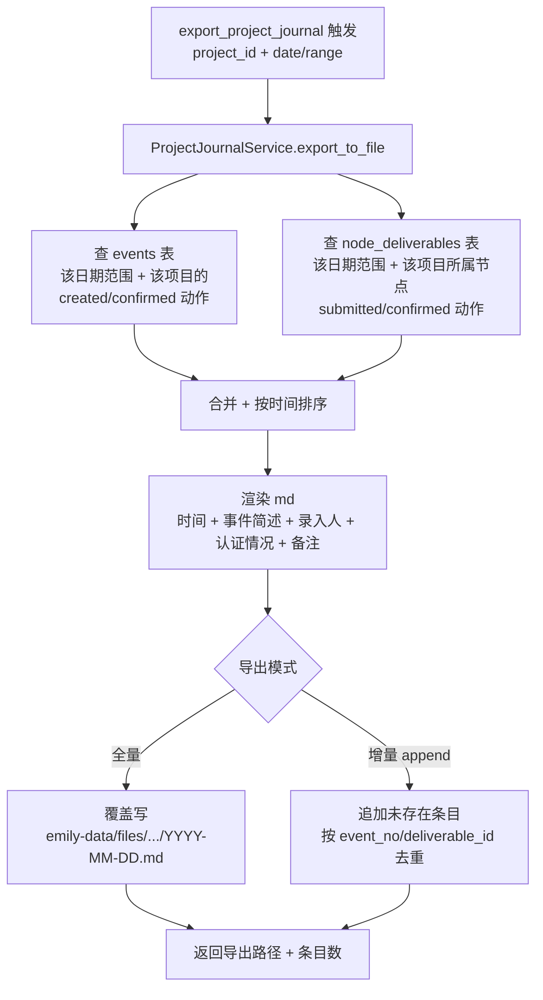
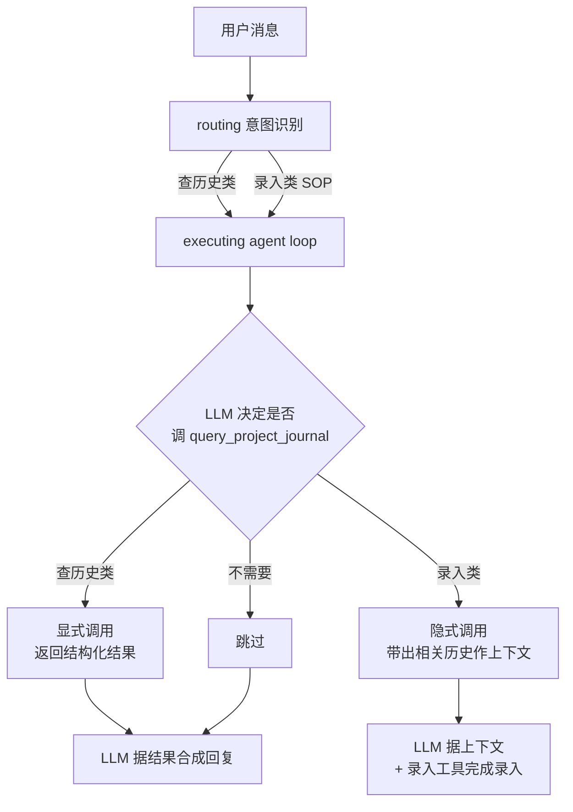

# 业务信息流水 PRD V1

> **版本**：V1.0
> **日期**：2026-08-12
> **状态**：待评审
> **原始需求**：[`需求/项目事件日志.md`](项目事件日志.md)
> **关联架构**：Emily V1.0 LangGraph StateGraph（`emily-core/emily_core/workitem/langgraph_engine/`）

---

## 0. 评审摘要

本 PRD 经一轮需求澄清后产出，核心决策如下（决策细节见 §2）：

| # | 决策点 | 结论 |
|---|--------|------|
| D1 | 存储载体 | **DB 为主，md 仅作导出产物**（非实时双写） |
| D2 | 文件切片粒度 | **分项目 + 按日期**：`emily-data/files/project-events/{project_id}/YYYY-MM/YYYY-MM-DD.md` |
| D3 | 事件范围 | **仅认证类动作**：事件录入与认证 + 节点成果提交与认证；不含节点其他状态流转 |
| D4 | LLM 查询定位 | **做成 LLM 工具 `query_project_journal`**，挂 ToolManager，不新增 LangGraph 节点；既支持用户主动查询，也支持 executing 阶段上下文增强 |
| D5 | md 生成方式 | **按需导出（默认）+ 增量追加（可选）**，md 永远可由 DB 全量重生成 |

---

## 1. 背景与目标

### 1.1 背景

地产项目日常产生大量业务事件：会议纪要上传、完工上报、管理单位认证等。当前 Emily 的留痕散落在多处：

| 现有能力 | 承载 | 局限 |
|---------|------|------|
| `events` 表 | 事件结构化数据 + `status`/`confirmed_at` | **缺 `confirmed_by`**，认证人无记录 |
| `business_event_logs` 表 | 业务操作流水（category/action/target/summary） | 已记 `event_action=confirmed`，但**认证操作人误记为录入人**（见 §1.2 BUG） |
| `node_deliverables` 表 | 节点成果提交/确认全流程 | 字段齐备（`submitted_by`/`confirmed_by`/`submission_status`） |
| `EventJournal`（文件级） | 旧文件双写台账 | 已被 `business_event_logs` 结构化替代，仍在写，与新方案重叠 |
| `SessionArchiveWriter` | 按会话归档 md | 维度是"会话留痕"（debug 用），非"项目业务台账"（对外） |

员工要"快速翻阅某天工地发生了什么、谁报的、认没认证"，目前**无统一视图**——要跨表查 + 人工拼时间线。

### 1.2 已发现的现有 BUG（本 PRD 顺带修复）

**BUG：事件认证人被记为录入人**

[event_app.py:139](emily-core/emily_core/application/event_app.py#L139) 中 `handle_confirmation` 写 `business_event_logs` 时：

```python
_log_business_event(
    ...
    user_id=event.user_id or "",   # ← 录入人，非认证操作人
    ...
)
```

`event.user_id` 是事件创建者（录入人），但认证动作的执行人应是对该 pending 事件点确认的当前操作者。`SessionAgent._handle_confirm` 拿到了 `actor_user_id`（见 [session_agent.py:225](emily-core/emily_core/session/session_agent.py#L225)），但未透传到 `handle_confirmation`。**本 PRD §4.3 修复**。

### 1.3 目标

构建**项目业务台账**——按项目 + 日期切片的人类可读 md 导出 + LLM 可查的结构化查询能力：

1. **统一视图**：合并 `events`（录入/认证）+ `node_deliverables`（提交/确认）两类认证动作，按时间线渲染
2. **认证人可溯**：补 `events.confirmed_by` 字段 + 修 `business_event_logs` 认证人 bug
3. **md 导出**：按项目+日期切片，可重复生成，作为"日报/周报"产物
4. **Agent 查询**：员工在 QQ 直接问"昨天景观铺装谁报的、认了没"——Emily 查 DB 回答
5. **上下文增强**：录入类 SOP 执行时，LLM 可自主调用查询工具带出历史作为上下文

### 1.4 非目标

- ❌ 不做实时 md 双写（一致性难保证，见 §2 D1）
- ❌ 不替代 `SessionArchive`（会话归档，职责不同）
- ❌ 不做节点全状态流转记录（仅认证类，见 §2 D3）
- ❌ 不做权限粒度的台账可见性控制（复用现有 `project_ids` session 约束）

---

## 2. 核心决策

### D1. DB 为主，md 仅作导出产物

**结论**：结构化数据必须落 DB，md 只是 DB 的渲染视图。

理由：
1. **检索能力**：真实诉求是"7#楼景观铺装上次谁报的"——多维查询，DB 一条 SQL，md Grep 做不到
2. **一致性**：事件会补登/修订/驳回。md 双写必然漂移，DB 有事务是单一真相源
3. **Agent 价值**：Emily 是 Agent，员工 QQ 一句就能查——必须基于 DB
4. **合规留痕**：地产有审计需求，结构化 DB 才能做权限控制与操作溯源
5. **md 的合理定位**：日报/周报导出物，可重复生成，丢了重导即可

**对原始需求的调整**：[`需求/项目事件日志.md`](项目事件日志.md) 第 11 行"日志存放以日期为文件名，md 格式"改为"**支持按日期/项目导出为 md 文件**"。

### D2. 分项目 + 按日期切片

```
emily-data/files/project-events/
  └─ {project_id}/
      └─ 2026-08/
          ├─ 2026-08-12.md
          └─ 2026-08-13.md
```

地产项目跨项目混在一份按日期切片，检索不便。分项目后，单项目台账自然成册。

### D3. 事件范围：仅认证类动作

台账只记以下两类**"认证动作"**，不记节点其他状态流转（激活/进度更新/废弃等）：

| 事件类型 | 数据源 | 现有承载 |
|---------|--------|---------|
| **事件录入**（会议纪要、完工上报等 SOP 事件创建） | `events` 表 `event_action=created` | `events.status=pending` |
| **事件认证**（管理单位对 pending 事件的确认/驳回） | `events` 表 `event_action=confirmed` | `events.status=confirmed` + `confirmed_at` |
| **节点成果提交**（施工方上报完工成果） | `node_deliverables.submission_status=SUBMITTED` | `submitted_by`/`submitted_at` |
| **节点成果认证**（管理单位确认施工方成果） | `node_deliverables.submission_status=CONFIRMED` | `confirmed_by`/`confirmed_at` |

**不进台账**：节点激活、进度更新、废弃、状态机其他流转。

### D4. LLM 查询做成工具，不新增 LangGraph 节点

**结论**：新增 `query_project_journal` 工具挂 ToolManager，**不**在 LangGraph 5 节点外新增 `context_retrieval` 节点。

理由：
1. 大多数消息（问候/查任务/闲聊）不需要历史，强制查是浪费 token + 延迟
2. L3 agent loop 模式的优势正是"LLM 自主决定调不调"——工具天然就是"可选节点"
3. 符合 [CLAUDE.md 约束 5](../../CLAUDE.md)（结构化输出优先 → 框架直调工具）
4. 一个工具两种用法，无需分开做：
   - **用户驱动查询**（主动问历史）→ 工具被 LLM 显式调用
   - **任务编排增强**（录入时自动带出历史上下文）→ 同一工具被 LLM 在 executing 隐式调用

工具描述中明确两种调用场景即可（prompt 工程，非架构改动）。

### D5. md 生成方式：按需导出 + 可选增量

- **默认（按需导出）**：`export_project_journal` 工具触发，从 DB 全量渲染指定日期/范围，md 永远是 DB 视图
- **可选（增量追加）**：`--append` 模式只补当天新增——日常场景省时，但仍可随时全量重生成
- **不做实时双写**：补登/修订/驳回时 md 不会回溯同步，时间一长必然漂移

---

## 3. 系统架构

### 3.1 数据流总览

```mermaid
flowchart TD
    subgraph 现有能力[现有数据源 - 无需新增采集器]
        E[events 表<br/>录入 + 认证]
        ND[node_deliverables 表<br/>提交 + 确认]
        BEL[business_event_logs 表<br/>操作流水]
    end

    subgraph 新增[新增能力]
        PJS[ProjectJournalService<br/>查询 + md 渲染 + 导出]
        QPJ[query_project_journal 工具<br/>LLM 查询 + 上下文增强]
        EPJ[export_project_journal 工具<br/>触发 md 导出]
    end

    E --> PJS
    ND --> PJS
    BEL --> PJS
    PJS --> QPJ
    PJS --> EPJ
    QPJ -->|用户主动问| QQ[员工 QQ]
    QPJ -->|executing 阶段<br/>LLM 隐式调用| CTX[录入类 SOP 上下文增强]
    EPJ -->|按需/增量| MD[emily-data/files/project-events/<br/>{project_id}/YYYY-MM/YYYY-MM-DD.md]
    PJS -->|修复 BUG| BEL2[business_event_logs<br/>认证人修正]
    PJS -->|补字段| E2[events.confirmed_by]
```

### 3.2 md 导出流程



### 3.3 LLM 查询流程



---

## 4. 数据模型

### 4.1 `events` 表新增字段

**文件**：[emily-core/emily_core/infrastructure/database/models.py](emily-core/emily_core/infrastructure/database/models.py#L196)

```python
class Event(Base):
    # ... 现有字段 ...
    confirmed_at = Column(String)  # 现有
    confirmed_by = Column(String, default="", comment="认证人ID（FK→users.id），BUG-005 修复：原仅记 confirmed_at 无认证人")  # 新增
```

**迁移**：在 `_PENDING_COLUMNS` 映射中注册 `events.confirmed_by`（参照约束 §9：`create_all()` 不 ALTER 已有表，需 `_ensure_columns` 补齐）。

### 4.2 `business_event_logs` 表

**无 schema 改动**。已有字段足够：
- `event_category`（event/task/meeting/file/...）
- `event_action`（created/confirmed/submitted/...）
- `target_type` / `target_id` / `target_no`
- `summary` / `detail_json`
- `user_id` / `user_name`（**修复写入值即可**，见 §4.3）

### 4.3 BUG 修复：认证人记录

**文件**：[emily-core/emily_core/application/event_app.py](emily-core/emily_core/application/event_app.py#L106)

`handle_confirmation` 签名扩展，接收 `actor_user_id`：

```python
def handle_confirmation(
    self,
    event_id: str,
    action: str,
    actor_user_id: str = "",   # 新增：认证操作人
) -> HandlerResult:
```

写入 `business_event_logs` 时用 `actor_user_id` 而非 `event.user_id`：

```python
_log_business_event(
    event_category="event",
    event_action="confirmed",
    ...
    user_id=actor_user_id or event.user_id or "",   # 修复：认证操作人优先
    ...
)
```

同时 `EventService.confirm_event` 写 `events.confirmed_by = actor_user_id`。

**调用方适配**：[emily-core/emily_core/session/session_agent.py](emily-core/emily_core/session/session_agent.py#L868) `_handle_confirm` 透传 `actor_user_id`：

```python
result = event_app.handle_confirmation(
    event_id=event_id,
    action=action,
    actor_user_id=actor_user_id,   # 新增
)
```

### 4.4 md 文件目录结构

```
emily-data/files/project-events/
  └─ {project_id}/                      # 分项目
      └─ 2026-08/                       # 分年月
          ├─ 2026-08-12.md              # 分日期
          └─ 2026-08-13.md
```

> `project_id` 用 UUID 会出现"看不出是哪个项目"的问题。导出时在 md 文件首行写项目名作为页眉；目录名仍用 UUID 避免重名冲突。

### 4.5 md 文件格式

```markdown
# 项目业务台账 - {项目名称} - 2026-08-12

> 导出时间：2026-08-12 16:30:00 | 条目数：5 | 数据源：events + node_deliverables

---

## 08:15 · 事件录入

- **事件编号**：EVT-20260812-0003
- **事件简述**：7#楼前景观面层铺装 20㎡ 完工
- **录入人**：张三（景艺景观工程有限公司 施工员）
- **认证情况**：⏳ 待认证
- **备注**：等待监理认证

---

## 10:30 · 事件认证

- **事件编号**：EVT-20260812-0003
- **事件简述**：7#楼前景观面层铺装 20㎡ 完工
- **录入人**：张三
- **认证情况**：✅ 已认证
- **认证人**：李四（蓝城伟业 景观工程主管）
- **认证时间**：2026-08-12 10:30
- **备注**：—

---

## 14:00 · 节点成果提交

- **成果编号**：SG-JG-01-2026-DELV-002
- **所属节点**：SG-JG-01-2026（7#楼景观面层铺装）
- **成果简述**：面层铺装完工确认单
- **提交人**：张三（景艺景观工程有限公司）
- **认证情况**：⏳ 待确认
- **备注**：附件：完工确认单.pdf

---

## 16:00 · 节点成果认证

- **成果编号**：SG-JG-01-2026-DELV-002
- **所属节点**：SG-JG-01-2026
- **成果简述**：面层铺装完工确认单
- **提交人**：张三
- **认证情况**：✅ 已确认
- **认证人**：李四（蓝城伟业 景观工程主管）
- **认证时间**：2026-08-12 16:00
- **备注**：—

---
```

---

## 5. 模块设计

### 5.1 ProjectJournalService（新增）

**文件**：`emily-core/emily_core/services/project_journal_service.py`

```python
class ProjectJournalService:
    """项目业务台账服务——查询 + md 渲染 + 导出。

    数据源（合并时间线）：
      - events 表：created / confirmed 动作
      - node_deliverables 表：submitted / confirmed 动作
      - business_event_logs 表：补充流水上下文（pipeline_run_id 关联）

    不新增采集器，只读现有表。
    """

    @staticmethod
    def query(
        *,
        project_id: str = "",
        date_from: str = "",        # ISO 日期 YYYY-MM-DD
        date_to: str = "",
        event_types: list[str] | None = None,   # event_created/event_confirmed/deliverable_submitted/deliverable_confirmed
        user_id: str = "",          # 按录入人/认证人过滤
        auth_status: str = "",      # pending / confirmed / all
        limit: int = 100,
    ) -> list[dict]:
        """结构化查询台账条目。

        返回统一格式 dict：
          {
            "timestamp": "2026-08-12T08:15:00+08:00",
            "entry_type": "event_created" | "event_confirmed" | "deliverable_submitted" | "deliverable_confirmed",
            "summary": "7#楼前景观面层铺装20㎡完工",
            "recorder": {"user_id": "...", "name": "张三", "company": "景艺景观", "role": "施工员"},
            "auth": {"status": "pending"|"confirmed", "auth_user": {...}, "auth_at": "..."},
            "target": {"type": "event"|"deliverable", "no": "EVT-..."|"SG-...-DELV-...", "node_id": "..."},
            "remark": "...",
          }
        """

    @staticmethod
    def render_md(entries: list[dict], *, project_name: str, date_str: str) -> str:
        """渲染台账条目为 md 字符串。"""

    @staticmethod
    def export_to_file(
        *,
        project_id: str,
        project_name: str,
        date_str: str = "",                 # 单日，空则取今天
        date_range: tuple[str, str] = (),   # 或日期范围
        mode: str = "full",                 # full（覆盖写） / append（增量追加）
    ) -> dict:
        """导出 md 文件到 emily-data/files/project-events/{project_id}/YYYY-MM/YYYY-MM-DD.md。

        Returns: {"path": "...", "entries": N, "mode": "..."}
        """
```

### 5.2 LLM 工具：`query_project_journal`（新增）

**文件**：`emily-core/emily_core/tools/project_journal_tool.py`

```python
_QUERY_JOURNAL_SCHEMA = {
    "type": "object",
    "properties": {
        "project_id": {
            "type": "string",
            "description": "项目 UUID。若仅知项目名，先调 resolve_project 解析",
        },
        "date_from": {"type": "string", "description": "起始日期 YYYY-MM-DD（北京时间）"},
        "date_to": {"type": "string", "description": "结束日期 YYYY-MM-DD，单日查询时与 date_from 相同"},
        "entry_types": {
            "type": "array",
            "items": {"type": "string"},
            "description": "条目类型过滤，可选值：event_created/event_confirmed/deliverable_submitted/deliverable_confirmed。空则全部",
        },
        "auth_status": {
            "type": "string",
            "enum": ["pending", "confirmed", "all"],
            "description": "认证状态过滤",
        },
        "keyword": {"type": "string", "description": "关键词模糊匹配事件简述（如'景观铺装'）"},
    },
    "required": ["date_from"],
}
```

工具描述（关键——LLM 据此判断何时调用）：

```
查询项目业务台账——按日期/项目/类型/认证状态检索历史业务事件与节点成果认证记录。

适用场景：
1. 用户主动查询历史（如"昨天景观铺装谁报的"、"上周有哪些完工上报待认证"）——直接调用本工具，将结构化结果合成回复。
2. 录入类 SOP 执行前上下文增强（如用户要"录入7#楼景观铺装完工"，先调本工具查该节点之前是否报过、还差什么认证），将历史作为上下文再调录入工具，避免重复录入或漏认证。

返回：结构化条目列表，每条含 时间/类型/简述/录入人/认证情况/备注。
不调工具的纯文本回复无法回答历史查询类问题。
```

### 5.3 LLM 工具：`export_project_journal`（新增）

**文件**：同 `project_journal_tool.py`

```python
_EXPORT_JOURNAL_SCHEMA = {
    "type": "object",
    "properties": {
        "project_id": {"type": "string", "description": "项目 UUID"},
        "date_str": {"type": "string", "description": "单日日期 YYYY-MM-DD，空则取今天"},
        "date_from": {"type": "string", "description": "范围导出起始日期"},
        "date_to": {"type": "string", "description": "范围导出结束日期"},
        "mode": {"type": "string", "enum": ["full", "append"], "description": "full=覆盖写，append=增量追加"},
    },
    "required": ["project_id"],
}
```

工具描述：

```
导出项目业务台账为 md 文件。按项目+日期切片，存于 emily-data/files/project-events/{project_id}/YYYY-MM/YYYY-MM-DD.md。
适用：用户要"导出今天的台账"、"生成本周周报"、"导出7月所有事件"。
返回：导出文件路径 + 条目数。
```

### 5.4 工具注册

**文件**：`emily-core/emily_core/tools/registry.py`

参照 [CLAUDE.md 约束 11](../../CLAUDE.md) 三步走：

1. 在 `project_journal_tool.py` 定义 `_QUERY_JOURNAL_SCHEMA` / `_EXPORT_JOURNAL_SCHEMA` 常量
2. 在 `registry.py` 注册时传 `params=_QUERY_JOURNAL_S` / `params=_EXPORT_JOURNAL_S`
3. 在 `tools_consistency.py` 的 `TOOL_SCHEMA_MAP` 添加两个映射条目

权限：`query_project_journal` = L1+（全体员工可查自己可见项目）；`export_project_journal` = L3+（项目工程师以上，避免普通员工导出全量）。

### 5.5 SOP 声明

`query_project_journal` 作为**通用查询工具**，注册到所有录入类 SOP 的 `tools` 字段中（如 SOP-001 会议纪要、SOP-002 录入事件、SOP-003 任务管理），让 LLM 在 executing 阶段可自主调用。

具体方式：在 `emily-data/skills/` 下相关 skill YAML 的 `tools` 列表追加 `query_project_journal`。

---

## 6. 接口契约

### 6.1 台账条目统一数据结构

```python
@dataclass
class JournalEntry:
    """台账条目（查询返回 + md 渲染输入）。"""
    timestamp: str          # ISO8601 含时区（北京时间）
    entry_type: str         # event_created / event_confirmed / deliverable_submitted / deliverable_confirmed
    summary: str            # 事件简述
    recorder: dict          # {"user_id", "name", "company", "role"} 录入人/提交人
    auth: dict              # {"status": "pending"|"confirmed", "auth_user": {...}, "auth_at": "..."}
    target: dict            # {"type": "event"|"deliverable", "no": "EVT-..."|"SG-...-DELV-...", "node_id": "..."}
    remark: str             # 备注
```

### 6.2 查询语义

- **日期**：统一按北京时间（UTC+8）解释。`date_from` 含当天 00:00:00，`date_to` 含当天 23:59:59
- **项目过滤**：`project_id` 非空时只查该项目；空则查用户 session 可见的所有项目（受 `session_ctx.project_ids` 约束，参照 `ProjectResolver` 三层权限模型）
- **用户过滤**：`user_id` 非空时匹配 `recorder.user_id` 或 `auth.auth_user.user_id`（任一命中即返回）
- **权限**：查询工具内复用 `session_ctx.project_ids` 做输出过滤，accessible 外项目不泄漏（参照 [resolver.py](emily-core/emily_core/workitem/langgraph_engine/agent/resolver.py#L73) `ProjectResolver` 模式）

### 6.3 LLM 调用约定

- `query_project_journal`：纯查询，无 LLM 调用本身（仅 DB 查询），由 executing 阶段 LLM 调用
- `export_project_journal`：纯 DB + 文件操作，无 LLM 调用
- 两工具均无 `chat_json` / `chat_with_tools` 调用，零额外 token 成本

### 6.4 Config 配置项

**文件**：[emily-core/emily_core/config.py](emily-core/emily_core/config.py)

```python
# 项目业务台账
project_journal_enabled: bool = True
project_journal_export_dir: str = "emily-data/files/project-events"  # 相对工作目录
project_journal_max_entries: int = 500  # 单次导出/查询上限
```

---

## 7. 权限

### 7.1 查询权限

复用现有 session 约束：
- `query_project_journal`：L1+，结果集受 `session_ctx.project_ids` 过滤（只返回用户可访问项目的事件）
- `export_project_journal`：L3+，导出范围同样受 `session_ctx.project_ids` 约束

### 7.2 字段可见性

- `recorder` / `auth.auth_user` 中的 `name` / `company` / `role` 来自 `users` + `user_im_bindings` + `company_info` 表关联
- 跨公司可见性：不额外限制（项目台账是项目内公共信息，参与方互可见）。若后续有"对外隐藏参建方"需求，V2 再加字段级权限

---

## 8. 文件清单

### 8.1 新增文件

| 文件 | 职责 |
|------|------|
| `emily-core/emily_core/services/project_journal_service.py` | `ProjectJournalService`：查询 + md 渲染 + 导出 |
| `emily-core/emily_core/tools/project_journal_tool.py` | `query_project_journal` + `export_project_journal` 工具 handler + schema |
| `emily-core/emily_core/repositories/project_journal_repo.py` | 台账查询 Repository（跨表合并时间线，纯读） |

### 8.2 修改文件

| 文件 | 改动 |
|------|------|
| [emily-core/emily_core/infrastructure/database/models.py](emily-core/emily_core/infrastructure/database/models.py#L196) | `Event` 新增 `confirmed_by` 字段 + `_PENDING_COLUMNS` 注册 |
| [emily-core/emily_core/application/event_app.py](emily-core/emily_core/application/event_app.py#L106) | `handle_confirmation` 签名加 `actor_user_id`，写 `business_event_logs` 用认证人而非录入人（BUG 修复） |
| `emily-core/emily_core/services/event_service.py` | `confirm_event` 写 `confirmed_by` |
| [emily-core/emily_core/session/session_agent.py](emily-core/emily_core/session/session_agent.py#L868) | `_handle_confirm` 透传 `actor_user_id` 给 `handle_confirmation` |
| [emily-core/emily_core/tools/registry.py](emily-core/emily_core/tools/registry.py) | 注册 2 个台账工具（带 `params=` schema） |
| [emily-core/emily_core/config.py](emily-core/emily_core/config.py) | 新增 `project_journal_enabled` / `project_journal_export_dir` / `project_journal_max_entries` |
| `scripts/check_tools_consistency.py` | `TOOL_SCHEMA_MAP` 添加 2 个台账工具映射（约束 #11 CI 校验） |
| `emily-data/skills/*.yaml` | 录入类 SOP 的 `tools` 字段追加 `query_project_journal` |

### 8.3 文档同步（约束 §10）

| 文档 | 更新内容 |
|------|---------|
| `docs/代码文件目录.md` | 新增 project_journal_service / project_journal_tool / project_journal_repo 条目 |
| `docs/业务模块与运转全景.md` | 业务模块清单新增"项目业务台账"模块 + 数据流图 |
| `docs/接口协议与调用约定.md` | 新增 JournalEntry 数据结构 + 2 个台账工具 schema |
| `docs/数据库设计.md` | `events` 表新增 `confirmed_by` 字段说明 + BUG 修复记录 |

---

## 9. 实施计划

### Phase 1：DB 字段补齐 + BUG 修复（独立可验收）

- `Event` 模型新增 `confirmed_by` + `_PENDING_COLUMNS` 注册
- `handle_confirmation` 签名扩展 `actor_user_id`
- `event_service.confirm_event` 写 `confirmed_by`
- `session_agent._handle_confirm` 透传 `actor_user_id`
- **验收**：emy-test 发送"录入事件" → "确认事件"（用不同用户确认），查 DB 确认 `events.confirmed_by` = 认证人 UUID，`business_event_logs.user_id` = 认证人 UUID（非录入人）

### Phase 2：ProjectJournalService + 查询工具（独立可验收）

- 新增 `project_journal_repo.py`：跨表合并时间线查询
- 新增 `project_journal_service.py`：query + render_md + export_to_file
- 新增 `project_journal_tool.py`：`query_project_journal` handler + schema
- `registry.py` 注册 + `tools_consistency.py` 映射
- **验收**：emy-test 发送"查一下昨天景观铺装谁报的"，系统调工具返回结构化结果，LLM 合成回复含录入人/认证状态

### Phase 3：md 导出工具（独立可验收）

- `project_journal_tool.py` 新增 `export_project_journal` handler + schema
- 实现 `render_md` + `export_to_file`（full / append 两模式）
- **验收**：emy-test 发送"导出今天的台账"，文件生成于 `emily-data/files/project-events/{project_id}/2026-08/2026-08-12.md`，内容含 5 类条目段落，格式符合 §4.5

### Phase 4：SOP 接入 + 文档同步

- 录入类 SOP 的 skill YAML `tools` 追加 `query_project_journal`
- 更新 4 份 docs/ 文档
- `check_tools_consistency.py` 通过
- **验收**：emy-test 发送"录入7#楼景观铺装完工"，executing 阶段 LLM 自主调用 `query_project_journal` 查历史作为上下文（mitmproxy 流量可见），再调录入工具

---

## 10. 验收标准

### 10.1 功能验收

| # | 场景 | 预期 |
|---|------|------|
| 1 | 用户A录入事件，用户B确认 | `events.confirmed_by` = B，`business_event_logs.user_id` = B（非 A） |
| 2 | 用户发送"查昨天景观铺装谁报的" | 工具被调用，回复含录入人/认证状态/认证人 |
| 3 | 用户发送"导出今天的台账" | md 文件生成，含当日全部认证类条目，格式符合 §4.5 |
| 4 | 用户发送"导出 2026-08-01 到 2026-08-10 的台账" | 范围内每日一个 md 文件，或合并为单文件（按导出参数） |
| 5 | 用户发送"录入7#楼景观铺装完工"（该节点已报过） | executing 阶段 LLM 自主调 `query_project_journal`，mitmproxy 流量可见，回复提示已报过 |
| 6 | L1 员工尝试导出全量台账 | 工具返回权限不足（L3+ 才能） |
| 7 | 跨项目查询 | 结果集受 `session_ctx.project_ids` 过滤，accessible 外项目不泄漏 |
| 8 | 增量导出 append 模式 | 同日二次导出只追加新条目，已存在条目按 `event_no`/`deliverable_id` 去重 |

### 10.2 数据一致性验收

| # | 场景 | 预期 |
|---|------|------|
| 1 | 事件补登（追加录入历史事件） | DB 更新后，重新全量导出 md 含新条目 |
| 2 | 事件驳回后重新认证 | md 中该事件显示最新认证状态，无重复条目 |
| 3 | md 文件被误删 | 重新导出可完整重建，内容一致 |

### 10.3 CI 验收

- `check_tools_consistency.py` 通过（2 个台账工具 schema 已注册）
- `_ensure_columns` 启动日志无 `events.confirmed_by` 缺列警告
- `codegraph status` 索引覆盖新增文件

---

## 11. 风险与降级

| 风险 | 降级策略 |
|------|---------|
| 跨表合并时间线性能（events + node_deliverables + business_event_logs 三表 JOIN） | 查询走 `(project_id, created_at)` 索引；`business_event_logs` 已有 `idx_bel_project_created` 索引；单次查询 limit 500 上限 |
| 用户名/公司名关联查询慢（多表 JOIN users + user_im_bindings + company_info） | Repository 层批量预取用户/公司字典，内存 join，避免 N+1 |
| md 文件目录 `project_id` 用 UUID 不可读 | md 首行写项目名页眉；提供 `query` 工具按项目名查 |
| LLM 在 executing 不主动调 `query_project_journal`（上下文增强失败） | 非阻断——录入仍可正常完成，仅缺少历史上下文提示。可通过 SOP prompt 引导（"录入前建议先查询相关历史"） |
| `events.confirmed_by` 历史数据为空（存量事件无认证人） | md 渲染时 `confirmed_by` 为空显示"未记录"；只影响存量数据，新增数据完整 |
| append 模式去重失败（条目已存在但被重复追加） | 以 `target.no` + `entry_type` 为去重键，导出前先扫描已有 md 文件提取已存在键集合 |

---

## 12. 与现有 EventJournal 的关系

[event_app.py:127](emily-core/emily_core/application/event_app.py#L127) 仍在调用 `self._journal.append()` 写旧的文件级 EventJournal。处理策略：

- **本期不删除 EventJournal 写入**（避免影响现有行为）
- **新台账（ProjectJournalService）独立走 DB 查询**，不读 EventJournal 文件
- **V2 评估**：新台账稳定运行后，评估是否停用 EventJournal 双写（`business_event_logs` 已结构化替代）

---

## 13. V2 预留

- **多专家协同台账**：与专家 Agent PRD 联动，专家评审成果也纳入台账
- **台账权限粒度**：跨公司字段级可见性
- **台账归档**：历史台账按月/季归档压缩
- **Web UI 查看器**：除 md 导出外，提供 Web 端翻阅界面
- **EventJournal 停用**：新台账稳定后停用旧文件双写
