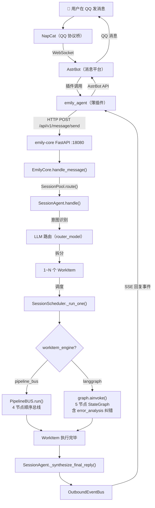
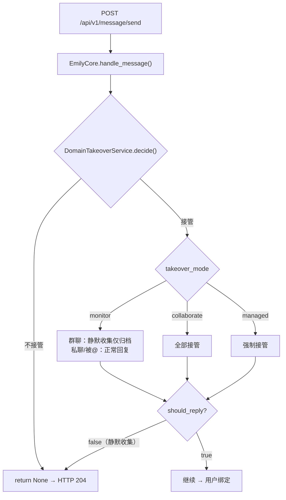
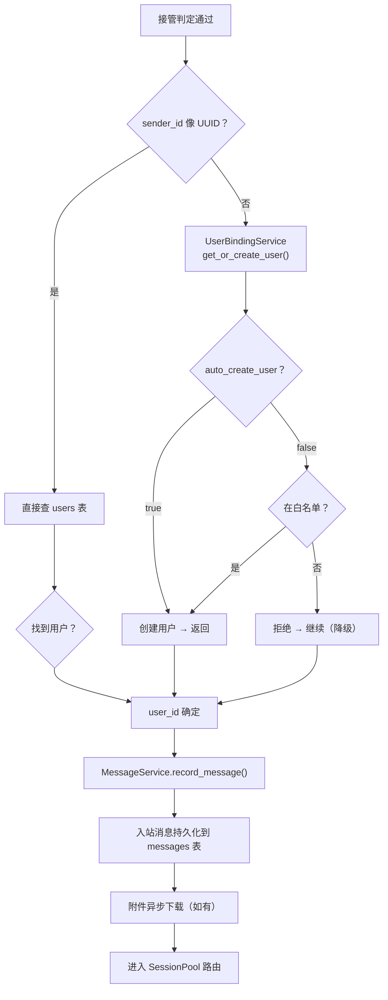
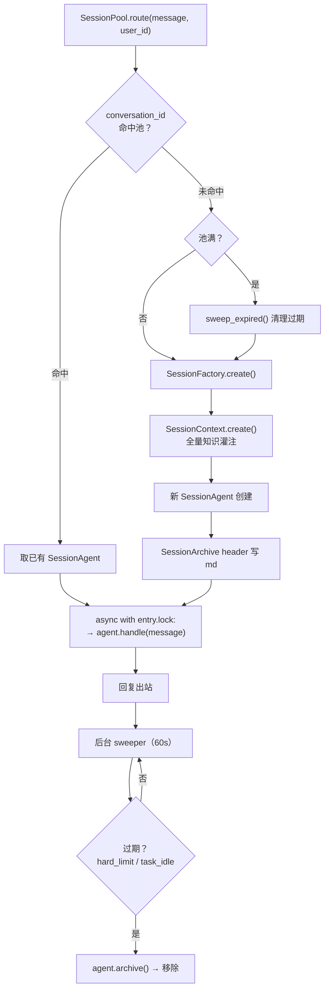
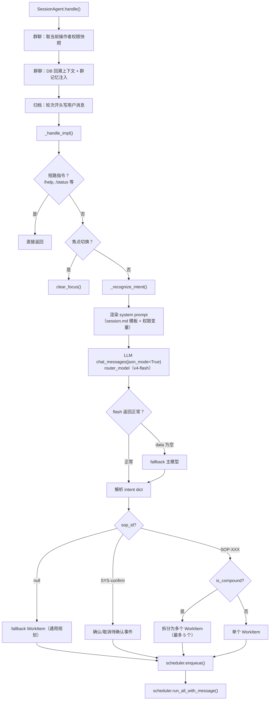
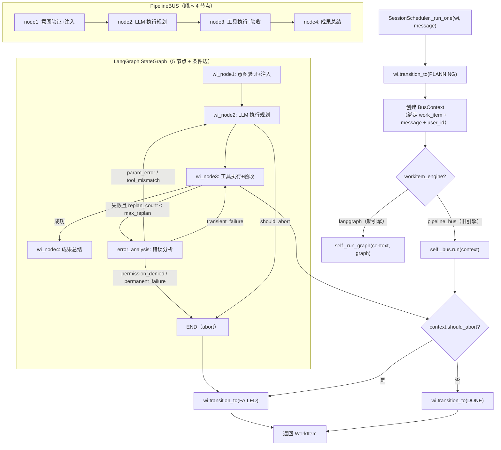
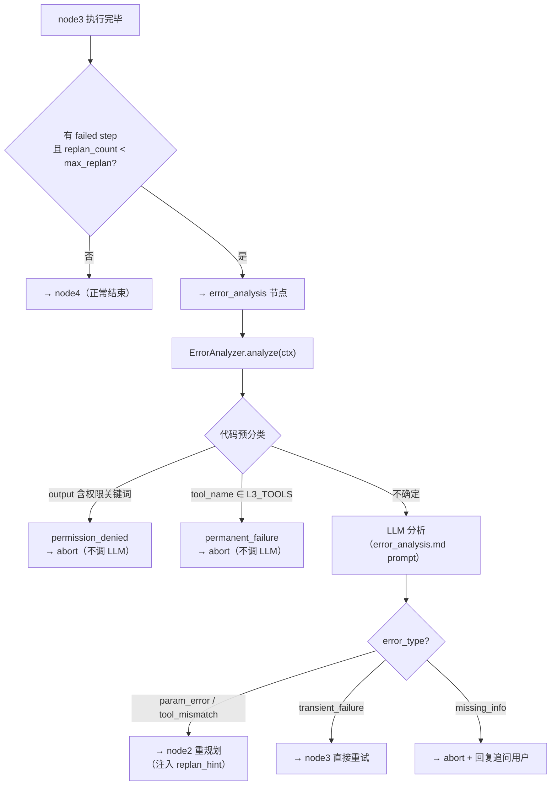
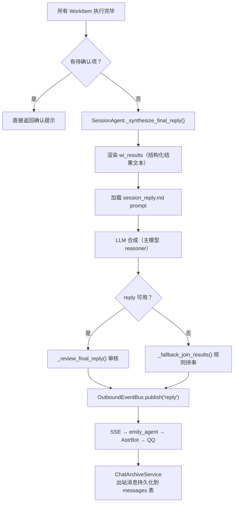
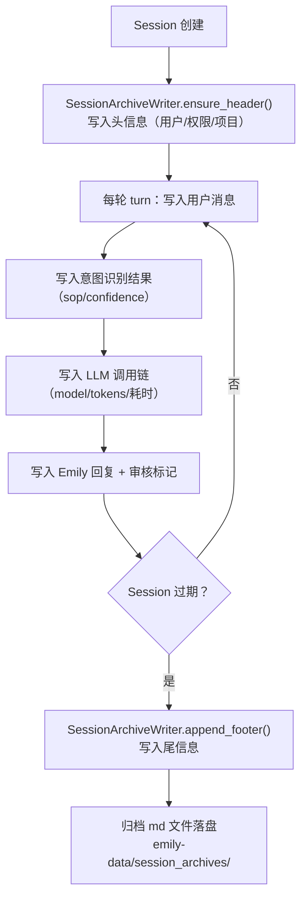

# Emily 用户消息全生命周期流程

> **版本**：V2.0（废弃 PipelineBUS，LangGraph 为唯一执行引擎）
> **日期**：2026-07-28
>
> 本文档描述一条用户消息从 IM（QQ）进站到 Emily 回复出站的完整生命周期。所有环节均以当前真实代码为准。

---

## 一、总览：端到端数据流

---

## 二、命名体系

| 层级 | 名称 | 说明 |
|------|------|------|
| **整体** | **Session 主线** | 以 conversation_id 为键的会话生命周期，从用户进线到 Session 过期归档 |
| **意图层** | **Intent Routing** | SessionAgent 调用路由 LLM 将用户消息映射到 SOP + 拆分为 WorkItem |
| **执行层** | **WorkItem 执行引擎** | 每个 WorkItem 经 4 节点（pipeline_bus）或 5 节点 StateGraph（langgraph）执行 |
| **合成层** | **Reply Synthesis** | SessionAgent 汇总已完成的 WorkItem 结果，调 LLM 合成为最终回复 |
| **出站层** | **Outbound Delivery** | 回复经 SSE 事件总线推送回 emily_agent → AstrBot → QQ |

> **历史对照**：旧架构（EmyBot M15）叫 "WorkOrder 管道"，现已完全移除。当前唯一路径是 **Session 主线 + WorkItem 执行引擎**。其中执行引擎有两种实现（feature flag 切换），但对外接口统一。

---

## 三、分层详解

### 第 1 层：接入与接管判定

**关键代码位置**：
- `DomainTakeoverService.decide()` — `emily_core/services/domain_takeover_service.py`
- `EmilyCore.handle_message()` — `emily_core/__init__.py:965`

---

### 第 2 层：用户绑定与消息持久化

---

### 第 3 层：SessionPool 路由与会话生命周期

**过期判定**：
| 条件 | 阈值 | 说明 |
|------|------|------|
| hard_limit | 1800s（30min） | 强制归档 |
| task_idle | 180s（3min） | 无活跃 WorkItem + 队列空 + 空闲超时 |

---

### 第 4 层：SessionAgent 意图识别与 WorkItem 拆分

**关键代码位置**：
- `_recognize_intent()` — `session_agent.py:350`
- `_split_into_workitems()` — `session_agent.py:474`
- `_build_rendered_system_prompt()` — `session_agent.py:204`

---

### 第 5 层：WorkItem 执行引擎（核心）

这是本次 LangGraph 替换的核心变更层。

**关键代码位置**：
- `SessionScheduler._run_one()` — `scheduler.py:98`
- `PipelineBUS.run()` — `pipeline/bus.py:135`
- `SessionScheduler._run_graph()` — `scheduler.py:167`
- `build_workitem_graph()` — `langgraph_engine/graph.py`

#### 5.1：4 节点职能

| 节点 | 方法 | 职能 | 是否必须 |
|------|------|------|---------|
| node1 | `node1_intent()` | 验证路由决策 + KnowledgeInjector 增量灌注（SOP/工具/表权限） | ✅ |
| node2 | `node2_plan()` | LLM 执行规划：根据 SOP 拆解步骤，选择工具，评估风险等级 | ✅ |
| node3 | `node3_execute()` | 工具循环：逐步骤调用 `tool.handler(params)`，记录 step_results | ✅ |
| node4 | `node4_summary()` | 成果总结：基于 step_results 输出结构化结果供 Session 合成回复 | ❌（非必须） |

#### 5.2：LangGraph 引擎特有：error_analysis 纠错闭环

**关键代码位置**：
- `ErrorAnalyzer.analyze()` — `langgraph_engine/error_analysis.py:82`
- `_code_pre_classify()` — `langgraph_engine/error_analysis.py:121`

---

### 第 6 层：回复合成与出站

**关键代码位置**：
- `_synthesize_final_reply()` — `session_agent.py:605`
- `_review_final_reply()` — `session_agent.py`（M4 审核层）

---

### 第 7 层：Session 归档（全流程旁路）

---

## 四、两条执行路径对比

| 维度 | PipelineBUS（旧引擎） | LangGraph StateGraph（新引擎） |
|------|----------------------|-------------------------------|
| **节点数** | 4（node1→node2→node3→node4） | 5（+ error_analysis） |
| **拓扑** | 单向线性 | 条件图（含回边） |
| **失败处理** | node3 异常 → 直接 FAILED | node3 失败 → error_analysis → 重规划/重试/abort |
| **State** | BusContext（dataclass，在节点间传递） | WorkItemGraphState（纯可序列化 TypedDict）+ contextvars 承载 BusContext |
| **Checkpoint** | 无 | MemorySaver（后续切 PostgresSaver） |
| **Hook** | PipelineBUS 内触发 | HookAdapter 桥接到 graph 节点回调 |
| **启用方式** | `workitem_engine=pipeline_bus` | 环境变量 `EMILY_WORKITEM_ENGINE=langgraph` |

---

## 五、关键对象速查

| 对象 | 生命周期 | 持有者 |
|------|---------|--------|
| `StandardMessage` | 一次消息 | 全链路透传 |
| `SessionAgent` | 一个 conversation_id 从创建到过期 | SessionPool |
| `SessionContext` | 同上 | SessionAgent |
| `WorkItem` | 一次 SOP 执行 | SessionScheduler 队列 |
| `BusContext` | 一个 WorkItem 一次执行 | 节点间共享 / contextvars |
| `WorkItemGraphState` (TypedDict) | graph.ainvoke 期间 | LangGraph runtime |
| `ReplyMessage` | 一条回复 | 短暂（组装后即发） |

---

## 六、文件索引

| 文件 | 角色 |
|------|------|
| `emily-core/api/server.py` | FastAPI app + lifespan |
| `emily-core/api/routes/message.py` | `POST /api/v1/message/send` 消息入口 |
| `emily-core/emily_core/__init__.py` | `EmilyCore.handle_message()` 编排入口 |
| `emily-core/emily_core/adapters/session/session_pool.py` | `SessionPoolManager.route()` 会话路由 |
| `emily-core/emily_core/adapters/session/session_factory.py` | `SessionFactory.create()` 会话创建 |
| `emily-core/emily_core/session/session_agent.py` | `SessionAgent.handle()` 意图识别 + WorkItem 拆分 + 回复合成 |
| `emily-core/emily_core/workitem/scheduler.py` | `SessionScheduler._run_one()` WorkItem 调度 + 引擎切换 |
| `emily-core/emily_core/workitem/pipeline/bus.py` | `PipelineBUS.run()` 旧引擎：4 节点顺序执行 |
| `emily-core/emily_core/workitem/langgraph_engine/graph.py` | `build_workitem_graph()` 新引擎：5 节点 StateGraph |
| `emily-core/emily_core/workitem/langgraph_engine/state.py` | `WorkItemGraphState` (TypedDict) + contextvars 桥接 |
| `emily-core/emily_core/workitem/workitem_agent.py` | 4 个 node_handler 实现（新旧引擎共用） |
| `emily-core/emily_core/workitem/langgraph_engine/error_analysis.py` | ErrorAnalyzer（Self-Reflection 纠错） |
| `emily-data/prompts/session.md` | 意图识别 system prompt 模板 |
| `emily-data/prompts/planner.md` | node2 执行规划 prompt 模板 |
| `emily-data/prompts/error_analysis.md` | error_analysis 节点 prompt 模板 |

---

*本文档基于 2026-07-28 代码现状。执行引擎替换（PipelineBUS → LangGraph StateGraph）通过 `workitem_engine` feature flag 控制，默认 `pipeline_bus`。*
