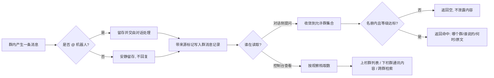
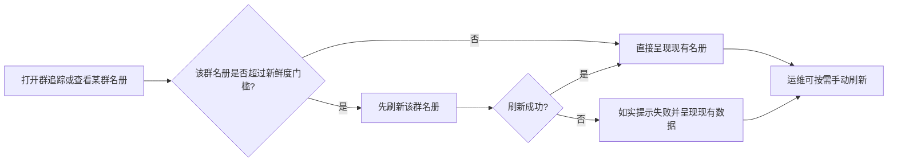
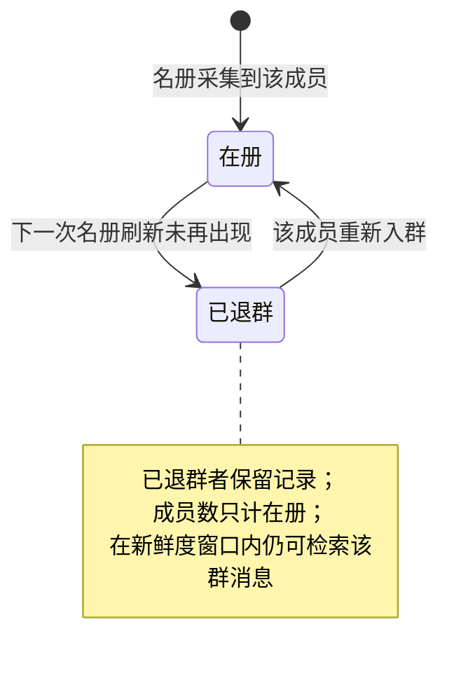
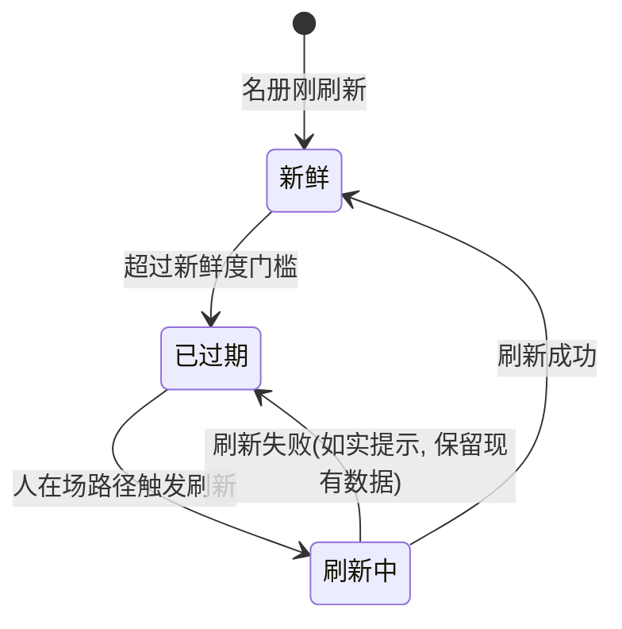

# 群信息保存与复用 — PRD（规格 / Spec）

> **日期**：2026-09-23
> **来源**：[群信息保存与复用_需求基线_V1.md](./群信息保存与复用_需求基线_V1.md)（2026-09-23，含 §十一 已定口径 D1–D20 与 §十二 逐项建议）
> **参与角色**：需求分析师、作为 Emily 开发者资深架构师、技术总监、资深测试工程师、安全与数据治理工程师（自适应）
> **宪法版本**：v1.2
> **阶段**：Specify（规格）——方案型技术设计见后续 `群信息保存与复用_计划_V*.md`
> **口径来源说明**：基线 §十一 中 D1 / D4 / D7 / D19 四项标"待确认"，D20 为本次新增；本版**按基线 §十二 的对应建议值采纳**（D1→建议 B′、D4→建议 C、D7→建议机制三、D19→建议 A、D20→建议"本期即加"）。若拍板结果不同，受影响 US 见 [附录 A](#附录-a规格变更记录)。

---

## 一、背景与目标

### 1.1 背景

Emily 在 QQ 侧已经在持续留存群消息——群内消息（含未 @ 机器人的）会落库，群清单也会在启动时同步一次。但这些留存**只进不出**：机器人不知道系统里有哪些群、群里说过什么；用户问"某材料什么时候进场"时，只能在自己发过言的会话里做关键词匹配，而提问的人往往从没在那个群说过话。

同时，群在系统里只是"一个会话"，缺少台账语义：

| # | 问题 | 现状事实 |
|---|------|---------|
| 1 | 群消息存了，读不回来 | 群消息已逐条留存并带群标识，但群上下文回溯与群级记忆的注入结果每轮被丢弃（闸门恒为关闭）；对外唯一可查通道是聊天归档，作用域仅限"本人发过言的会话"，群聊还以本人首条消息时间为下界裁掉更早历史 |
| 2 | 群没有"是干什么的" | 群台账只存平台下发的群名，没有任何字段承载人工标注；且群名每次同步都会被平台值覆盖，人工标注若放在同一处必然丢失 |
| 3 | 群成员没有建模 | 系统无群成员名册；成员数量采集后未被留存；包内已具备拉取成员清单的通道但从未调用。"某人参与了哪个群"唯一判据是"他是否发过言"，只潜水的人识别不出来 |
| 4 | 没有面向人的观察入口 | 控制台左侧模块清单里没有任何群相关条目，运维无法查看正在被记录的群与群内通讯内容 |
| 5 | 已有聊天归档能力存在实现漂移 | 同一检索能力存在两份参数定义，实际注册生效的是缺少时间范围等参数的简版，调用方可见的参数不完整 |

**结论**：本期把"群台账 + 群成员名册 + 群消息"三样信息补齐成**可查记录**，并把"有哪些群、群里说过什么"以**只读能力**同时交付对话侧与控制台侧——取数逻辑只有一份实现，两端接入复用。**不做**群报备的事件抽取、**不做**会话上下文注入、**不做**向量检索。

### 1.2 目标与成功指标

| 目标 | 成功指标（可度量） |
|------|------------------|
| G1 群可命名 | 群台账可承载人工功能备注；平台群名变更时备注不变（备注非空群的数量在同步前后一致）；所有展示与检索以备注为主标识、平台群名为附注 |
| G2 群可成册 | 名册覆盖率 = 已留存群中"名册非空"的群占比；从未发言的群成员可被查得；同一成员在同一群不产生重复记录；成员数与名册中在册人数一致 |
| G3 消息可留存 | 群内消息（含未 @）持续留存率 100%；群消息可区分真实用户消息与测试/运维消息；检索默认排除测试与运维来源 |
| G4 群可发现 | 对话中能列出全部在追踪群，每条含备注名、平台、成员数、已留存消息数、最近活跃时间；该能力可静态检出注册完整（无"仅注册无调用"） |
| G5 群可检索 | 给定关键词与群，能返回带"哪个群 / 谁说的 / 什么时候 / 原文片段"的命中列表；越权构造不返回任何越权群消息（放行/拒绝判定 100% 符合作用域口径） |
| G6 不阻断 | 群清单同步、名册刷新、备注维护任一失败时，消息留存与对话成功率 100% 不受影响；失败可见（有日志与返回值），无静默吞掉 |
| G7 群可观察 | 控制台新增群追踪视图：上半栏=在追踪群列表，下半栏=选定群通讯内容，另有跨群文字检索；视图取数在控制台路由层的业务查询残留 **0** 处，每一屏数据可指认到同一个能力出口 |
| G8 零人工改库 | 既有部署升级到本版本后，新增的数据承载项由系统初始化自动补齐，**无需人工执行改库操作** |

### 1.3 非目标（明确不做）

1. **不做群消息的语义加工**——不把群消息抽成事件 / 任务 / 成果，不做摘要沉淀，不做群画像与活跃度分析。
2. **不做群消息入向量库**——不进知识库检索通道；既有向量链路要求文档标识锚定在文件台账上，且可见性只认文件台账，属安全敏感改造，另立项。
3. **不做会话级注入**——不新增会话提示词注入、不改会话上下文装配。本期"让机器人知道有哪些群"完全由只读能力达成（见 US-06）。触碰会话主循环或上下文装配的实现一律回退。
4. **不在系统内引入周期性自动触发**——系统已无定时任务模块；群清单与名册的任何周期动作都由外部调度调用脚本或接口承担（见 US-18）。
5. **不做企业微信 / 微信群 / 微信小程序的群消息**——企业微信当前通道（自建应用回调 / 微信客服）在平台侧不推群消息；群消息需"智能机器人"或"会话内容存档"另立项。
6. **不做群成员变动的即时驱动更新**——成员变动通知是否可达插件**尚未实测证实**；本期以惰性刷新 + 新鲜度门槛满足要求（US-04）。待实证通过且确有敏感群需求时，另版本评估。
7. **不加控制台登录鉴权**——控制台整体无鉴权，单独给一个面板加门禁会造成"其余面板仍全开"的假安全；统一鉴权是独立命题（见 US-16 与 §六 风险 5）。
8. **不做群消息的编辑 / 删除 / 导出，不做实时推送**——视图为拉取式只读。
9. **不重构既有聊天归档能力的作用域**——两者并存不合并；本期只修其参数定义漂移（US-22）。
10. **不启用群与项目的归属关联**——该关联字段已存在但当前无消费方；启用需与可见性口径一并定（见 §六 风险 6）。
11. **不引入新依赖、不新建知识源**（宪法 Q5）。

---

## 二、需求登记表（核心章节）

### 2.1 用户故事与验收标准

#### 功能域 A：群台账与名册（保存侧）

**US-01**｜角色：运维 / 管理员｜场景：给一个群标注它是干什么的｜期望：能填一条人工功能备注，且它不会被平台同步冲掉｜优先级：P0

| AC-ID | 验收标准（可判定） | 验证方式 |
|-------|------------------|---------|
| AC-US-01.1 | 群台账可承载一条人工填写的功能备注；备注与平台下发的群名**分离留存**，互不覆盖 | 数据记录比对 |
| AC-US-01.2 | 平台群名发生变更并触发群清单同步后，该群的人工备注**保持不变**；平台群名作为附注被更新 | 同步前后记录比对 |
| AC-US-01.3 | 展示与检索一律以备注为主标识；备注为空时回退显示平台群名 | 对话回复 + 控制台呈现 |
| AC-US-01.4 | `counterpart`：备注写入后，在**群列表展示**与**群消息检索结果**两处均以该备注出现（写入 → 两端可见） | 写入后两端比对 |
| AC-US-01.5 | 备注变更留痕：可回答"谁 / 何时 / 旧值 → 新值" | 审计记录 |
| AC-US-01.6 | 备注为人工设置路径专属：**任何同步链路均不得写入备注** | 代码检索 + 同步后备注比对 |

**US-02**｜角色：运维 / 管理员｜场景：机器人被拉进新群，或需要立即刷新群清单｜期望：能手动触发一次群清单同步，新群进入台账｜优先级：P0

| AC-ID | 验收标准（可判定） | 验证方式 |
|-------|------------------|---------|
| AC-US-02.1 | 提供手动触发入口（脚本或接口），一次性拉取机器人所在全部群并写入台账 | 触发后台账条目数 |
| AC-US-02.2 | 重复同步**幂等**：同一批群同步两次，台账条目数不翻倍 | 连续两次同步后条目数 |
| AC-US-02.3 | 新增群进入台账后，默认处于"在追踪"状态，无需额外操作 | 同步后群列表呈现 |
| AC-US-02.4 | 平台不支持枚举群（如企业微信）时跳过并记明确告警，**不阻断**其余平台 | 故障注入 / 日志 |
| AC-US-02.5 | `counterpart`：手动同步入口在控制台可被触发（配置 → 使用闭合） | 控制台操作回归 |

**US-03**｜角色：运维 / 管理员 / 项目管理人员｜场景：想知道某个群有哪些人，包括从没发过言的成员｜期望：可查到成员名册，并知道谁已退群｜优先级：P0

| AC-ID | 验收标准（可判定） | 验证方式 |
|-------|------------------|---------|
| AC-US-03.1 | 每个群可留存成员名册；同一成员在同一群**不产生重复记录** | 重复拉取后记录数 |
| AC-US-03.2 | 名册成员以**平台账号**为准落地；能关联到系统用户时记录关联，未关联者**保留平台账号不丢弃** | 名册记录比对 |
| AC-US-03.3 | 名册记录含显示名；角色、入群时间在平台可得时记录，不可得时为空且不报错 | 名册字段比对 |
| AC-US-03.4 | 退群者**保留记录**并标记为已退群；**成员数只计在册成员**；历史检索仍认已退群者 | 退群前后成员数 + 名册呈现 |
| AC-US-03.5 | 从未发言的群成员出现在名册中（对照"谁发过言"的旧判据，可多出只潜水成员） | 名册与消息发送者集合比对 |
| AC-US-03.6 | 名册采集失败（机器人权限不足 / 平台不支持该枚举）时明确回报原因，**群消息留存与对话不受影响** | 故障注入 |
| AC-US-03.7 | `counterpart`：名册被检索作用域判定实际消费（见 AC-US-08.2），非"只写不读" | 静态可达性扫描 + 作用域用例 |

**US-04**｜角色：运维 / 管理员｜场景：打开一个很久没看过的群的名册｜期望：系统先把它刷新到最新再给我看，而不是把过期数据当准数｜优先级：P0

| AC-ID | 验收标准（可判定） | 验证方式 |
|-------|------------------|---------|
| AC-US-04.1 | 每个群记录"名册最后同步时间"；超过新鲜度门槛（建议 7 天）即视为过期 | 数据记录 + 过期判定用例 |
| AC-US-04.2 | 在**人在场**的路径（控制台打开群追踪、查看某群名册、执行维护脚本）遇到过期群时，**先刷新该群再呈现**；刷新在数秒内完成 | 控制台操作 + 响应时间 |
| AC-US-04.3 | 刷新失败时如实提示并显示现有数据，**不白屏、不报错冒泡** | 故障注入 |
| AC-US-04.4 | **机器人侧检索路径不触发名册写入**：一次群消息检索调用前后，名册相关记录数不变 | 调用前后记录数比对 |
| AC-US-04.5 | 过期群**可被列出**（控制台与日志），供运维巡检与手动刷新；不以静默掩盖 | 过期群清单呈现 |
| AC-US-04.6 | 系统内**不存在**任何周期性触发名册刷新的机制（无常驻进程、无内置定时） | 静态可达性扫描 |

**US-05**｜角色：项目管理人员｜场景：群里有人报备了信息，事后要能追溯到｜期望：群内消息（含未 @ 机器人）持续留存，且能分辨哪些是真实消息、哪些是测试或运维产生的｜优先级：P0

| AC-ID | 验收标准（可判定） | 验证方式 |
|-------|------------------|---------|
| AC-US-05.1 | 群内消息（含未 @ 机器人）**必被留存**，每条带可定位到所属群的标识 | 数据记录比对 |
| AC-US-05.2 | 群内消息的发送者关联到系统用户；无法关联时如实记录发送者身份标识，不静默丢弃 | 数据记录 |
| AC-US-05.3 | 消息来源可分辨（真实用户 / 测试 / 运维）；**沿用既有来源标记机制，不新建字段** | 数据记录 + 代码检索 |
| AC-US-05.4 | 群消息检索**默认排除测试与运维来源**；可显式包含（如运维排查）时另行指定 | 检索结果比对 |
| AC-US-05.5 | 未 @ 机器人的群消息**不触发回复**（保持安静记录） | 对话侧无回复 + 记录存在 |
| AC-US-05.6 | 群消息留存链路**不新增写入路径**——沿用既有留存链路，本期只做闭环核对 | 代码检索（无新增写入入口） |

#### 功能域 B：群信息查询能力（对话侧）

**US-06**｜角色：Emily 对话使用者｜场景：问"系统在保存哪些群的信息"｜期望：能拿到在追踪群清单，从而知道可以就哪些群提问｜优先级：P0

| AC-ID | 验收标准（可判定） | 验证方式 |
|-------|------------------|---------|
| AC-US-06.1 | 提供**一个**只读能力，可列出在追踪群；每条含备注名（无备注时平台群名）、平台、成员数、已留存消息数、最近活跃时间 | 对话回复 |
| AC-US-06.2 | 该能力**自我说明充分**：不依赖任何额外上下文，调用方即可知道"系统在留存群消息、本能力能列出群、能检索群内原文、典型用途是什么" | 能力描述比对 |
| AC-US-06.3 | 群数量超出单次返回上限时分页或截断，并明示"共 N 个、本次返回 M 个" | 大数据量用例 |
| AC-US-06.4 | 该能力只读、幂等：调用前后相关记录数不变 | 调用前后记录数比对 |
| AC-US-06.5 | `counterpart`：能力经**注册通道**接入且参数约束齐备，对话侧实际可达（注册 → 调用闭合） | 静态可达性扫描 + 一次实际调用 |

**US-07**｜角色：Emily 对话使用者｜场景：问"XX 材料的进场时间"｜期望：能拿到群里相关消息原文，自己判断，而不是被系统替我做结论｜优先级：P0

| AC-ID | 验收标准（可判定） | 验证方式 |
|-------|------------------|---------|
| AC-US-07.1 | `counterpart`（对 AC-US-05.1）：**留存下来的群消息确实可被检索到**——给出关键词后能取回原文，且结果带"所属群（备注名）、发言人、时间、原文片段、可定位标识"（写入 → 读取闭合） | 对话回复 |
| AC-US-07.2 | 可**限定单个群**检索，也可**跨全部在追踪群**检索；两种范围结果口径一致（同一取数出口，见 US-17） | 两种范围结果比对 |
| AC-US-07.3 | 可限定时间范围；不限定时默认覆盖全部已留存区间 | 检索结果比对 |
| AC-US-07.4 | 群以"备注名 / 平台群名 / 群号"任一表达即可检索；**调用方不需提供内部标识**；表达不唯一时返回候选请其再问，解析不出时明确回报"未找到" | 多表达用例 + 歧义用例 |
| AC-US-07.5 | 结果条数有上限；超限时明示截断，不静默丢结果 | 大数据量用例 |
| AC-US-07.6 | 命中即子串匹配，**不做向量检索、不做语义扩召回**（与既有聊天归档同口径） | 检索实现比对 + 无向量调用 |
| AC-US-07.7 | 空结果如实回"该群 / 该时间范围内没有匹配记录"，**不臆造、不编造原文** | 空结果用例 |

**US-08**｜角色：安全责任人｜场景：一份群消息检索请求由不同身份的人发起｜期望：只有该群名册内在册且达到等级门槛的人才能检索到该群消息；名册数据缺失时一律不放行｜优先级：P0

| AC-ID | 验收标准（可判定） | 验证方式 |
|-------|------------------|---------|
| AC-US-08.1 | 检索结果先收敛到发起者的允许群集合，**口径 = 该发起者在目标群名册内（在册）且权限等级 ≥ 参建执行** | 分权限分身份用例 |
| AC-US-08.2 | **fail-closed**：该群无名册数据 / 名册为空 / 名册未拉取时，**一律不放行**；不存在"名册缺失 ⇒ 人人可见" | 空名册用例 |
| AC-US-08.3 | 不在名册内的高等级身份（如 L4 但不在该群）检索该群消息 → 返回空，且回复中不泄露该群消息内容 | 越权用例 |
| AC-US-08.4 | 名册内在册但等级为访客（L1）的身份检索该群消息 → 返回空 | 等级门槛用例 |
| AC-US-08.5 | 已退群者在名册新鲜度窗口内仍可检索该群消息（**已知的方向性缺口**）；窗口上限 = 新鲜度门槛（见 AC-US-04.1） | 退群 + 窗口内/外用例 |
| AC-US-08.6 | 作用域收敛**只有一处实现**；控制台侧走同一实现的不同档位参数（见 AC-US-13.2），不存在第二套过滤 | 静态可达性扫描 |
| AC-US-08.7 | 构造绕过尝试（伪造群标识 / 越权群标识 / 空身份）均不返回任何越权群消息 | 越权构造用例 |

**US-09**｜角色：Emily 对话使用者 / SOP 维护者｜场景：了解"群信息怎么查、能查什么、谁能查"｜期望：能力有明确的使用声明，且可整体下线｜优先级：P0

| AC-ID | 验收标准（可判定） | 验证方式 |
|-------|------------------|---------|
| AC-US-09.1 | 群信息查询能力在业务手册（SOP）中增补一节：能力位置、发现方式、适用场景、权限口径 | SOP 文件比对 |
| AC-US-09.2 | 仅增一节，**不改**既有触发条件、能力清单与权限映射 | SOP diff |
| AC-US-09.3 | `counterpart`：移除该 SOP 声明后重启 → 群信息查询能力不可用且无残留触发器（证明经注册通道接入） | 能力目录 + 静态可达性扫描 |
| AC-US-09.4 | 该能力的参数约束齐备且被一致性校验覆盖；缺约束时进入告警而非静默可用（宪法 C10） | 一致性校验输出 |
| AC-US-09.5 | 群消息留存在能力下线后**仍照常进行**（下线只影响查询入口） | 下线后消息留存回归 |

**US-10**｜角色：Emily 对话使用者 / 运维｜场景：群标识写错、群里没有消息、检索偶发失败｜期望：系统如实说明情况，不臆造也不整链崩溃｜优先级：P0

| AC-ID | 验收标准（可判定） | 验证方式 |
|-------|------------------|---------|
| AC-US-10.1 | 群标识解析不出时回报"未找到"，**不猜测、不以近似群代替** | 错误群标识用例 |
| AC-US-10.2 | 检索/列表异常时返回明确失败信息，**不影响对话主链路**（其余对话轮次照常） | 故障注入 |
| AC-US-10.3 | 该能力**全链路只读**：调用前后群台账、名册、消息三类记录数不变 | 调用前后记录数比对 |
| AC-US-10.4 | 能力可重复调用，结果稳定（同输入同结果，忽略期间新增消息） | 重复调用比对 |

#### 功能域 C：控制台群追踪视图（观察侧）

**US-11**｜角色：控制台使用者（运维 / 管理者）｜场景：想看系统正在记录哪些群、某个群在聊什么｜期望：控制台单开一项，上半栏群列表、下半栏选定群通讯内容，一眼能扫｜优先级：P0

| AC-ID | 验收标准（可判定） | 验证方式 |
|-------|------------------|---------|
| AC-US-11.1 | 控制台左侧模块清单新增一项「群追踪」，点击可进入该视图 | 控制台操作 |
| AC-US-11.2 | 视图为**上下两栏**，中间为可拖拽的横向分隔条；上栏为在追踪群列表，下栏为选定群的通讯内容 | 控制台呈现 |
| AC-US-11.3 | 上栏每行显示：备注名（无备注时平台群名）、平台、成员数、已留存消息数、最近活跃时间 | 控制台呈现 |
| AC-US-11.4 | 上栏支持按备注名/群名筛选、按最近活跃排序 | 控制台操作 |
| AC-US-11.5 | 上栏选定某群 → 下栏切换到该群消息；消息按时间正序显示发言人、时间、正文 | 控制台操作 |
| AC-US-11.6 | 消息附件显示元信息并可打开（复用既有附件查看通道，不新建附件服务） | 控制台操作 |
| AC-US-11.7 | 「群追踪」视图**不新增业务逻辑**：取数一律来自能力出口（见 US-17） | 静态可达性扫描 + 路由层检查 |

**US-12**｜角色：控制台使用者｜场景：想在全部群里找"钢筋进场"｜期望：跨群给我命中列表，点一条能跳到那个群的消息｜优先级：P0

| AC-ID | 验收标准（可判定） | 验证方式 |
|-------|------------------|---------|
| AC-US-12.1 | 视图内提供关键词检索框，**检索范围跨全部在追踪群** | 控制台操作 |
| AC-US-12.2 | 结果每条带"哪个群（备注名）、谁说的、什么时候、原文片段" | 控制台呈现 |
| AC-US-12.3 | 点击结果可切到该群的消息视图 | 控制台操作 |
| AC-US-12.4 | 支持两种入口：跨群检索与"在当前选定群内检索"；两者**结果口径一致**（同一取数出口） | 两入口结果比对 |
| AC-US-12.5 | 结果默认排除测试与运维来源（与 AC-US-05.4 同口径） | 检索结果比对 |
| AC-US-12.6 | 空结果如实呈现"无匹配记录" | 空结果用例 |

**US-13**｜角色：技术负责人 / 审计｜场景：核对控制台这一屏的数据到底从哪来｜期望：控制台的读写能力都能指认到 Emily 的既有能力，控制台不自造业务逻辑｜优先级：P0

| AC-ID | 验收标准（可判定） | 验证方式 |
|-------|------------------|---------|
| AC-US-13.1 | 群追踪视图的每个读写动作都能指认到 Emily 能力层的具体能力（可当场回答"这一屏来自哪个能力"） | 逐动作指认 |
| AC-US-13.2 | 控制台与对话侧**共用同一作用域收敛实现**，仅以档位参数区分（控制台为观察档，可看全量在追踪群；对话侧按 AC-US-08.1 口径） | 静态可达性扫描 + 两档结果比对 |
| AC-US-13.3 | 群追踪相关控制台路由内**不含**业务查询构造 / 检索条件拼装 / 绕过服务层的库直查 | 路由层静态检查 |
| AC-US-13.4 | 能力层缺失时**不得**在控制台先行实现；本期交付顺序为"先落能力出口，再接控制台" | 交付顺序核对 + 路由层检查 |
| AC-US-13.5 | 控制台的群相关**写能力唯一**：群备注维护，且经既有脚本通道接入（不在路由层直接写库） | 控制台动作清单 + 路由层检查 |

**US-14**｜角色：控制台使用者｜场景：群很多、消息很多；某个群的消息读取出了错｜期望：能翻页回溯，单个区域出错不整屏白屏｜优先级：P0

| AC-ID | 验收标准（可判定） | 验证方式 |
|-------|------------------|---------|
| AC-US-14.1 | 群列表可分页；群消息**必须分页**（支持向上回溯与"加载更多"），不存在一次拉全量的端点 | 接口行为 + 路由层检查 |
| AC-US-14.2 | 某群消息读取失败时，**仅该区域**提示错误，视图其余部分仍可用 | 故障注入 |
| AC-US-14.3 | 刷新/翻页为拉取式；**不引入实时推送**（无长连接、无服务端推送） | 静态可达性扫描 |
| AC-US-14.4 | 视图打开不引入长事务；无全表扫描式的取数（按群 + 时间范围收敛） | 取数行为检查 |

**US-15**｜角色：控制台使用者｜场景：查看某群有哪些人；给某个群补一条备注｜期望：都能在控制台完成，改完与对话侧看到的一致｜优先级：P1

| AC-ID | 验收标准（可判定） | 验证方式 |
|-------|------------------|---------|
| AC-US-15.1 | 上栏选定群后可查看该群名册：平台账号、显示名、是否已关联系统用户、角色（可得时） | 控制台呈现 |
| AC-US-15.2 | 已退群成员在名册中可被区分显示（在册 / 已退群） | 控制台呈现 |
| AC-US-15.3 | `counterpart`（对 AC-US-01.3）：可在控制台设置某群备注；写入经既有脚本通道，**且对话侧随即以该备注为主标识**（控制台写 → 对话侧可见） | 控制台操作 + 对话侧比对 |
| AC-US-15.4 | 备注写入需二次确认（写库类操作），未确认时降级为预览 | 控制台操作 |
| AC-US-15.5 | `counterpart`（对 AC-US-04.5）：名册过期的群在视图中**可被实际识别**，并可由运维手动触发刷新（产出 → 消费闭合） | 控制台呈现 + 操作 |

**US-16**｜角色：安全责任人 / 控制台使用者｜场景：群消息可能是敏感商务信息｜期望：本版不加新门禁但明确标注敏感，并把统一鉴权登记为独立待办｜优先级：P1

| AC-ID | 验收标准（可判定） | 验证方式 |
|-------|------------------|---------|
| AC-US-16.1 | 群追踪页在界面上标注该数据敏感 | 控制台呈现 |
| AC-US-16.2 | 本版**不新增**控制台鉴权；控制台其余面板的访问门槛保持不变 | 控制台行为比对 |
| AC-US-16.3 | "控制台统一登录鉴权"作为独立待办被登记（不在本版范围内） | 待办登记 |
| AC-US-16.4 | 若后续启用控制台门禁，群追踪的"观察档全量"必须落在门禁之内（本版仅登记该约束） | 约束登记 |

#### 功能域 D：共通

**US-17**｜角色：技术负责人 / 审计｜场景：同一份群数据被对话侧与控制台侧两处读取｜期望：三处读取只有一份实现，两端接入复用｜优先级：P0

| AC-ID | 验收标准（可判定） | 验证方式 |
|-------|------------------|---------|
| AC-US-17.1 | 三种读取——在追踪群列表 / 群消息列表 / 跨群检索——**只有一处实现**；对话侧能力与控制台两处**共同调用** | 静态可达性扫描 + 两入口同源核对 |
| AC-US-17.2 | 该出口具备按群过滤、按来源排除、分页三项能力，且两端同时受益（不各补一份） | 出口行为 + 两端结果比对 |
| AC-US-17.3 | `counterpart`（对 AC-US-11.7 / AC-US-12.4）：同一查询经对话侧与控制台侧发起，**结果集合一致**（顺序可不同），证明两端确实复用同一出口 | 两入口输出 diff |
| AC-US-17.4 | 交付顺序：能力出口先在能力层落地，再接两端；实现时不得由控制台先写一份查询（见 AC-US-13.4） | 交付顺序核对 |

**US-18**｜角色：技术负责人｜场景：群清单与名册需要保持不过期｜期望：周期动作由外部调度承担，系统内不引入常驻或定时机制｜优先级：P0

| AC-ID | 验收标准（可判定） | 验证方式 |
|-------|------------------|---------|
| AC-US-18.1 | 群清单与名册的刷新入口为**可手动、可被外部调度调用**的脚本或接口 | 入口清单 |
| AC-US-18.2 | 系统内**不存在**新增的常驻进程、内置定时器或周期任务注册项 | 静态可达性扫描 |
| AC-US-18.3 | 名册保鲜采用惰性刷新（US-04），不依赖任何调度即能满足 AC-US-04.2 | 无调度环境回归 |

**US-19**｜角色：技术负责人｜场景：本模块需要新增能力与数据承载｜期望：一律落在能力层，不因业务功能增长改动内核｜优先级：P0

| AC-ID | 验收标准（可判定） | 验证方式 |
|-------|------------------|---------|
| AC-US-19.1 | 本模块改动**未触及**会话主循环与执行引擎文件（宪法 C12 腐化判据） | 改动文件清单核对 |
| AC-US-19.2 | 不新增会话上下文注入：群台账信息不经会话提示词或上下文装配下发（与 US-06 的"由能力达成"一致） | 静态可达性扫描 |
| AC-US-19.3 | 新增能力一律经注册通道接入（对话能力走工具注册、控制台模块走既有模块注册方式、可重复动作走脚本注册） | 注册项核对 |
| AC-US-19.4 | 无孤儿代码：新增的定义处均有使用处，新增的开关均有读取方（宪法 Q6） | 静态可达性扫描 |

**US-20**｜角色：运维 / 审计｜场景：重复同步、重复拉取名册、重复投递同一消息｜期望：不产生重复数据，且关键动作可追溯｜优先级：P0

| AC-ID | 验收标准（可判定） | 验证方式 |
|-------|------------------|---------|
| AC-US-20.1 | 群清单同步幂等：连续两次同步条目数不翻倍（同 AC-US-02.2） | 连续同步比对 |
| AC-US-20.2 | 名册刷新幂等：同一群连续两次刷新，记录数不翻倍 | 连续刷新比对 |
| AC-US-20.3 | 同一消息重复投递不产生重复留存记录 | 重复投递用例 |
| AC-US-20.4 | 备注变更、名册刷新、过期群巡检均留痕（操作人身份可得时记录） | 审计记录 |

**US-21**｜角色：运维 / 技术负责人｜场景：既有部署升级到本版本｜期望：新增的数据承载项由系统初始化自动补齐，无需人工改库；文档同步更新｜优先级：P0

| AC-ID | 验收标准（可判定） | 验证方式 |
|-------|------------------|---------|
| AC-US-21.1 | 既有部署升级后，本模块新增的数据承载项**自动补齐**，无需人工执行改库操作（G8） | 升级前后对照（老库升级） |
| AC-US-21.2 | 补齐动作幂等：重复启动不报错、不重复执行 | 重复启动 |
| AC-US-21.3 | 数据设计文档同步更新，新增承载项可被查到 | 文档比对 |

**US-22**｜角色：Emily 对话使用者 / 技术负责人｜场景：使用既有聊天归档能力查历史｜期望：它暴露的参数与实际能力一致，不再有"完整版参数定义了却没用上"的漂移｜优先级：P1

| AC-ID | 验收标准（可判定） | 验证方式 |
|-------|------------------|---------|
| AC-US-22.1 | 既有聊天归档能力对外暴露的参数与其完整能力一致（含时间范围与是否包含前导消息），不再存在两份定义 | 能力参数比对 + 代码检索 |
| AC-US-22.2 | 修正**只补参数可见性，不改检索行为**：既有调用方式的结果集合不变 | 修正前后结果比对 |
| AC-US-22.3 | `counterpart`：补充后的参数被实际调用方可见并使用（参数 → 使用闭合） | 静态可达性扫描 |

### 2.2 US 清单（下游追溯锚点）

| US-ID | 一句话 | 优先级 | 状态 |
|-------|--------|--------|------|
| US-01 | 群可命名：人工功能备注与平台群名分离留存，同步不覆盖，留痕 | P0 | 生效 |
| US-02 | 群清单可手动同步（幂等），新群默认在追踪 | P0 | 生效 |
| US-03 | 群成员名册落地：唯一、含平台账号与系统用户关联、退群者保留、成员数只计在册 | P0 | 生效 |
| US-04 | 名册惰性刷新：新鲜度门槛 + 只在人在场路径刷新 + 检索路径不写库 + 过期可见 | P0 | 生效 |
| US-05 | 群消息（含未 @）持续留存、来源可分辨、检索默认排除测试/运维 | P0 | 生效 |
| US-06 | 一个只读能力列出在追踪群（含备注/成员数/消息数/活跃），自我说明充分 | P0 | 生效 |
| US-07 | 群消息原文关键词检索：可跨群/限群/限时，可解释，不臆造 | P0 | 生效 |
| US-08 | 检索作用域：名册内在册且 ≥参建执行，fail-closed，单一出口 | P0 | 生效 |
| US-09 | 能力经注册通道接入 + SOP 声明 + 移除即下线 | P0 | 生效 |
| US-10 | 只读、幂等、失败不阻断、错误如实回报 | P0 | 生效 |
| US-11 | 控制台「群追踪」：上下两栏（群列表 / 选定群通讯内容），可筛选排序 | P0 | 生效 |
| US-12 | 群追踪内跨群文字检索，两入口同源，点结果跳群 | P0 | 生效 |
| US-13 | 控制台接入式复用：同源、可用同一出口、路由无业务查询、写能力唯一 | P0 | 生效 |
| US-14 | 分页与回溯、失败不白屏、拉取式（无实时推送） | P0 | 生效 |
| US-15 | 控制台查看名册与维护备注（经既有脚本通道，二次确认） | P1 | 生效 |
| US-16 | 群追踪标注敏感；本版不加鉴权，统一鉴权登记为独立待办 | P1 | 生效 |
| US-17 | 三种读取单一出口，对话侧与控制台共同调用；先落出口再接两端 | P0 | 生效 |
| US-18 | 无内置定时机制；周期动作由外部调度调脚本/接口承担 | P0 | 生效 |
| US-19 | 内核冻结遵守 + 注册通道接入 + 无孤儿代码 | P0 | 生效 |
| US-20 | 幂等（同步/刷新/投递）+ 关键动作留痕 | P0 | 生效 |
| US-21 | 升级自动补齐数据承载项，无需人工改库；文档同步 | P0 | 生效 |
| US-22 | 既有聊天归档能力的参数定义漂移修正（只补可见性，不改行为） | P1 | 生效 |

> req-plan 依此声明各模块实现哪些 US；req-verify 依此逐条回验并输出规格符合度。

---

## 三、业务规则与流程

### 3.1 业务规则

| # | 规则 | 说明 |
|---|------|------|
| R1 | **备注与平台群名分离** | 平台群名可被同步覆盖；人工备注只由人工维护，任何同步链路不得写入 |
| R2 | **名册唯一** | 同一成员在同一平台同一群只保留一条记录；退群者保留记录并标记，成员数只计在册 |
| R3 | **名册刷新不改变检索路径的只读性** | 刷新只发生在"人在场"路径；机器人侧检索不产生名册写入 |
| R4 | **名册过期只能压窗，不能消除** | 惰性刷新对"新入群者"是拒绝（安全方向），对"已退群者"是放行（风险方向）；放行窗口上限 = 新鲜度门槛，须以巡检可见 |
| R5 | **检索作用域 fail-closed** | 名册缺失 / 为空 / 未拉取时一律不放行；不得出现"缺数据即放宽" |
| R6 | **作用域单一出口** | 收敛逻辑只有一处实现；对话侧与控制台侧仅以档位参数区分，不得各写一套 |
| R7 | **群消息只记录不加工** | 不抽事件、不做摘要、不入向量库；本期只做"记录 + 关键词检索" |
| R8 | **机器人知道有哪些群靠能力，不靠注入** | 不得新增会话上下文注入；群台账信息经只读能力暴露 |
| R9 | **控制台是观察窗口** | 取数一律来自能力出口；控制台不新增业务逻辑；写能力唯一为群备注维护，经既有脚本通道 |
| R10 | **系统内无定时** | 不引入常驻进程或内置定时；周期动作由外部调度调用脚本或接口 |
| R11 | **启动式补数据** | 新增数据承载项由系统初始化自动补齐，不要求人工改库 |
| R12 | **在追踪 = 全部已发现群** | 不设单独追踪开关；已进入台账的群一律视为在追踪 |
| R13 | **来源可分辨且默认排除** | 群消息检索默认排除测试与运维来源，避免测试数据污染结论 |
| R14 | **不阻断** | 同步、刷新、备注维护任一失败均不影响消息留存与对话 |
| R15 | **幂等** | 同步、刷新、消息投递均可重复执行而不产生重复数据 |
| R16 | **如实回报** | 解析不出、无匹配、读取失败一律如实说明；不得臆造、不得以近似值代替 |
| R17 | **权限不新造** | 查询能力为只读全员可用；备注与名册维护沿用既有管理口径 |
| R18 | **可下线** | 移除 SOP 声明与能力注册即回落为"照常留存但无查询入口"，无残留触发器 |
| R19 | **企业微信不纳入** | 企微群消息需另立项；本版通道范围仅 QQ |

### 3.2 业务流程（业务级）

> 此图展示：一条群消息从进入系统到可被查询/查看的完整业务路径。

> 此图展示：打开某群名册时，系统如何处理"名册可能已过期"。

### 3.3 业务状态流转

> 仅描述**业务可见状态**，非代码状态机。群自身无状态流转（在追踪 / 已发现即全部在追踪）；此处描述**成员在册状态**与**名册新鲜度**。

---

## 四、边界与约束

### 4.1 触碰的宪法铁律

| 铁律 | 影响 | 处理 |
|------|------|------|
| **C2 分层不可跳** | 群台账、名册、检索收敛均属能力层；控制台与对话只调用 | 遵循（US-13 / US-17） |
| **C3 SOP 即路由** | 群信息查询以 SOP 声明 + 能力注册实现，新增声明重启生效 | 遵循（US-09） |
| **C9 ToolManager / ScriptManager 边界** | 面向对话的是进程内只读能力；控制台的写动作走脚本通道；两者共享服务层但不互相调用 | 遵循（US-13.5 / US-15.3） |
| **C10 工具必须带参数 schema** | 新增只读能力必须带参数约束，三步齐备（定义 → 注册传入 → 一致性映射） | 遵循（AC-US-09.4） |
| **C11 功能注册接入 + Q6 接线闭合** | 本模块新增能力与承载项较多，最易出现"仅注册无调用 / 仅写入无读取" | 逐条登记 §4.5；静态可达性扫描为验收项（AC-US-19.4 / US-03.7） |
| **C12 Session 主循环冻结** | 群信息不得经会话上下文注入下发；不得因本模块改动主循环或执行引擎 | 遵循（US-19）；若实现中发现需改内核文件，须停下改走内核形态专项 |
| **C13 控制台 = 观察窗口** | 控制台取数必须复用能力出口，不得在路由层复刻业务逻辑；能力缺失时先补能力层再接线 | 遵循（US-13 / US-17.4） |
| C0 / C1 / C4 / C5 / C6 / C7 / C8 | 不涉及（本模块不新增 Hook、不改结构化输出链路、不涉 LLM 调用编排） | — |

### 4.2 范围边界

| 在范围内 | 不在范围内 |
|---------|-----------|
| 群台账的人工备注与平台群名分离 | 群消息的事件 / 任务 / 成果抽取 |
| 群清单手动同步与幂等 | 群消息入向量库 / 进知识库 |
| 群成员名册落地、关联、退群者标记 | 群消息摘要、群画像、活跃度分析 |
| 名册惰性刷新与新鲜度门槛 | 系统内周期性自动触发（定时任务） |
| 群消息留存的闭环核对与来源可分辨 | 群消息的编辑 / 删除 / 导出 |
| 群信息只读查询能力（列出群 / 检索原文） | 会话级注入（提示词 / 上下文装配） |
| 检索作用域收敛（fail-closed、单一出口） | 全局权限矩阵改造 |
| 控制台「群追踪」视图：群列表 + 群通讯内容 + 跨群检索 | 控制台登录鉴权（登记为独立待办） |
| 控制台取数接入式复用与分页回溯 | 控制台实时推送（长连接 / 服务端推送） |
| 控制台名册查看与备注维护（经既有脚本通道） | 企业微信 / 微信群 / 小程序群消息 |
| 升级自动补齐数据承载项与文档同步 | 群与项目的归属关联启用 |
| 既有聊天归档能力的参数定义漂移修正 | 既有聊天归档能力作用域的重构 |

### 4.3 假设与依赖

| # | 假设 / 依赖 | 若不成立的影响 |
|---|------------|--------------|
| 1 | 包内已具备拉取群成员清单的通道（机器人侧群枚举能力） | US-03 无法采集名册，作用域口径无法落地，US-08 退化为沿用现状 |
| 2 | 群成员的平台账号可与系统用户建立关联（既有身份绑定能力可用） | US-03.2 关联不可得，名册只保留平台账号；作用域判定需改用平台账号比对 |
| 3 | 群消息已带可定位到所属群的标识，且既有留存链路可复用 | US-05 需改造留存链路，超出本版"只做核对"的范围 |
| 4 | 既有消息来源标记机制可用（真实用户 / 测试 / 运维） | US-05.3/05.4 无来源依据，检索结果可信度下降 |
| 5 | 既有附件查看通道可被控制台复用 | US-11.6 需另建附件读取路径，超出本版范围 |
| 6 | 群数量与消息量在当前规模下，按群 + 时间范围取数可接受 | US-07 / US-14 的性能要求需另立优化项（见 §六 风险 3） |
| 7 | 控制台既有模块注册方式可承载新增模块项 | US-11.1 需先改造控制台模块注册，超出本版范围 |

### 4.4 约束型技术决策

> **约束**（不是方案）：规定"必须/不得"什么，不规定"用哪个"实现。下游计划与测试据此校验。

| # | 约束 | 来源 / 理由 |
|---|------|-----------|
| 1 | 群台账、名册、群消息**必须复用既有留存链路与既有身份绑定能力**；**不得**另建一套消息留存或用户体系 | 避免重复建设（C0） |
| 2 | 群消息留存**不得**新增写入路径——本期只做既有链路的闭环核对 | 基线 FR-GRP-5；写入路径单一化 |
| 3 | 来源标记**必须沿用既有消息来源机制**，**不得**新建字段 | 基线 D13 |
| 4 | 新增能力**必须**经注册通道接入（对话侧走能力注册、控制台侧走既有模块注册方式、可重复动作走脚本注册）；**不得**裸文件 / 裸调用 / 硬编码接线 | C11 |
| 5 | **不得**触碰会话主循环与执行引擎；群台账信息**不得**经会话上下文注入下发，**必须**由只读能力暴露 | C12 / 基线 D8 |
| 6 | 控制台的控制台读写能力**必须**复用能力出口；**不得**在路由层复刻既有逻辑、拼装业务查询或绕过服务层直查库 | C13 |
| 7 | 三种读取（群列表 / 群消息列表 / 跨群检索）**必须**只有一处实现，两端共同调用；实现顺序**必须**先落能力出口再接两端 | C13 / 基线 D16 |
| 8 | 作用域收敛**必须** fail-closed：名册缺失 / 为空 / 未拉取时一律不放行；**不得**出现"缺数据即放宽" | 基线 D1 + §十二-1 配套硬要求 |
| 9 | 作用域收敛**必须**单一实现，控制台侧**不得**另立一套过滤 | 基线 D16；单一出口纪律 |
| 10 | 名册刷新**不得**发生在机器人检索路径上（保证该路径全链路只读：调用前后记录数不变） | 基线 D7b；与 US-10.3 / NFR 只读一致性 |
| 11 | 系统内**不得**引入任何常驻进程、内置定时器或周期任务注册项；周期动作**必须**由外部调度调用脚本或接口 | C11 注（定时任务模块已退役） |
| 12 | 名册刷新**必须**有新鲜度门槛（过期才算需刷新）；**不得**"每次使用都刷新" | 基线 D7；避免逐群高频调用平台接口 |
| 13 | 群消息检索**必须**为子串匹配；**不得**引入向量检索或语义扩召回 | 基线 D6 / D14；与既有聊天归档同口径 |
| 14 | 群消息**不得**入知识库向量链路 | 向量链路的文档标识锚定与可见性口径均为文件台账维度，群消息不属该体系 |
| 15 | 写入类动作（清单同步 / 名册刷新 / 备注维护）**必须**幂等 | R15 |
| 16 | 新增数据承载项**必须**由系统初始化自动补齐；**不得**要求运维手工执行改库 | G8 / US-21 |
| 17 | 群消息的**来源默认排除**规则**必须**同时作用于对话侧与控制台侧（同口径） | R13；避免两端结论不一致 |
| 18 | 控制台**不得**新增群相关写能力（备注维护除外）；群追踪**不得**引入实时推送 | 基线 D15 / D17 |
| 19 | 解析不出 / 无匹配 / 读取失败时**不得**以近似值或臆造内容代替，**必须**如实回报 | R16 |
| 20 | **不得**引入新依赖；**不得**新建知识源 | Q5 |

### 4.5 产出物与消费方（接线清单）

| # | 产出物（能力） | 消费方（谁使用 / 何处生效） | 对应 US |
|---|--------------|--------------------------|--------|
| 1 | 群台账的人工备注 | 对话侧群列表呈现、群消息检索结果标识、控制台群列表与名册呈现 | US-01 |
| 2 | 群清单（在追踪群集合） | 对话侧群列表能力、控制台群追踪上栏、名册刷新范围 | US-02 |
| 3 | 群成员名册（含在册 / 已退群标记） | 检索作用域收敛（关键消费方）、控制台名册查看、成员数展示 | US-03 |
| 4 | 名册新鲜度（最后同步时间 + 过期结论） | 人在场路径的刷新判定、控制台过期标识与巡检 | US-04 |
| 5 | 群消息留存（含来源标记与所属群标识） | 对话侧原文检索、控制台群通讯内容与跨群检索 | US-05 |
| 6 | 在追踪群列表能力 | 对话侧"有哪些群"问答、控制台上栏、SOP 指引 | US-06 |
| 7 | 群消息原文检索能力 | 对话侧问答、控制台跨群检索、SOP 指引 | US-07 |
| 8 | 检索作用域收敛结论 | 对话侧检索、控制台观察档检索（同一实现） | US-08 |
| 9 | 群信息查询的 SOP 声明 | 对话侧能力发现与权限口径说明 | US-09 |
| 10 | 控制台「群追踪」视图 | 运维 / 管理者观察与排查 | US-11 / US-12 / US-14 |
| 11 | 三种读取的单一能力出口 | 对话侧能力与控制台两处共同消费 | US-17 |
| 12 | 手动同步与名册刷新入口 | 外部调度调用、控制台手动触发 | US-02 / US-04 / US-18 |
| 13 | 关键动作留痕（备注变更 / 名册刷新 / 过期巡检） | 审计 | US-20 |
| 14 | 既有聊天归档能力的完整参数 | 既有聊天归档能力的调用方 | US-22 |

**未接线清单**：无。以上产出物均已在表中登记消费方；其中第 3 项（名册）的**关键消费方是检索作用域收敛**——若实现阶段名册只写不读（作用域仍走旧口径），即判未完成（宪法 Q6）。

---

## 五、替代方案

| 方案 | 内容 | 为何未采纳 |
|------|------|-----------|
| S1（被否） | 不做查询能力，改为在会话创建时把"用户参与的群"注入提示词 | 触碰会话上下文装配，属内核冻结范围；且注入是"常驻成本"，查询能力是按需调用（US-19 / 基线 D8） |
| S2（被否） | 群消息灌入知识库向量链路，走语义检索 | 该链路的文档标识必须锚定在文件台账、可见性只认文件台账，群消息不属该体系；且需求本质是"找原文"，子串匹配已足（§4.4-13/14） |
| S3（被否） | 先做企业微信群监控（用户以群主身份建群） | 企微群主身份只提供群元数据，不提供群消息；拿群消息需"会话内容存档"（企业认证 + 按账号付费 + 全员知情同意）或"智能机器人"（仅 @ 可达、不支持外部群），均为独立立项（§1.3-5） |
| S4（被否） | 名册采用周期全量刷新（系统内定时或每日外部调度） | 系统已无定时任务机制；且名册只在被用到时才有价值，为未被查看的群逐个调用平台接口是浪费（US-04 / 基线 D7） |
| S5（被否） | 名册刷新放在检索路径上"顺手更新" | 会让机器人检索路径产生写操作，违反该路径只读与"调用前后记录数不变"的验收条款（§4.4-10） |
| S6（被否） | 群消息检索沿用"仅本人发过言的会话"口径 | 提问者往往从未在该群发言（如项目经理问材料进场），工具价值大幅缩水；G5 的可用性无法达成（US-08） |
| S7（被否） | 控制台自行实现一份群消息查询 | 破坏单一出口，后续口径调整必然漏改一处；且违反控制台观察窗口定位（US-13 / US-17） |
| S8（被否） | 本期不加新鲜度门槛，纯"用到就刷新" | 退群者的检索放行窗口无上界，构成持续越权（§4.4-12 / R4） |
| S9（采纳） | **群台账 + 名册（惰性保鲜）+ 群消息留存 三件保存底座；一份只读能力出口，对话侧与控制台两端接入复用** | 唯一同时满足"不碰内核、无定时机制、单一出口、fail-closed"的组合 |

---

## 六、风险与开放问题

| # | 风险 / 开放问题 | 类型 | 影响 | 缓解 / 待决 |
|---|----------------|------|------|------------|
| 1 | **惰性刷新的方向性缺口**：已退群者在该群名册刷新前仍可检索该群消息，放行窗口最长 = 新鲜度门槛 | 安全 | 退群者短期越权 | 已定：新鲜度门槛建议 7 天，并把"权限路径不写库"作为硬约束（§4.4-10）；过期群须在控制台与日志可见，由运维巡检压缩窗口。**待决**：门槛取值（建议 7 天）与"敏感群是否需叠加成员变动即时驱动"——后者依赖通知可达性实测（§1.3-6） |
| 2 | **通知可达性未证实**：平台侧成员变动通知是否真正派发到插件，尚未实测 | 约束 | 若后续要做即时驱动，方案前提不成立 | 本版不依赖该通道（US-04 用惰性刷新）。作为后续版本的**前置实测项**登记，实测不通过则该方向不可行 |
| 3 | **规模增长后的按群检索性能**：消息表只增不减，当前规模下顺序扫描可接受 | 约束 | 群消息累积后按群检索变慢 | AC-US-14.4 要求按群 + 时间范围收敛；**待决**：是否需要为按群检索引入专门的数据结构（登记为附录 B-1） |
| 4 | **名册覆盖率决定检索可用性**：名册拉取失败或未执行的群，其消息对所有人不可见（fail-closed 的必然结果） | 业务 | 用户体感"明明在群里却查不到" | 已定：fail-closed 不可放宽（§4.4-8）；缓解手段是"过期/缺失群可见 + 运维可按需刷新"（AC-US-04.5）。**待决**：是否需要向用户明示"该群名册未就绪"，还是统一回"无匹配记录" |
| 5 | **控制台无鉴权，群消息可能含敏感商务信息** | 安全 | 能访问控制台即可看到全量群消息 | 已定：本版不加新门禁（避免假安全），改为界面标注敏感 + 统一鉴权登记为独立待办（US-16）。**待决**：统一的控制台鉴权何时立项 |
| 6 | **群与项目的归属关联未启用**：该关联的承载位已存在但无消费方 | 业务 | 无法"按项目看群"；可见性也无法按项目收敛 | 已定：本版不启用（§1.3-10）；启用需与检索作用域口径一并定，避免可见性依据出现两个来源 |
| 7 | **在追踪 = 全部已发现群**：不设追踪开关 | 业务 | 无法排除含大量闲聊的群，控制台列表可能冗长 | 已定：本版按"全部在追踪"（R12 / 基线 D19 建议 A）。若实际使用中出现"需要屏蔽某些群"的诉求，按新增独立追踪开关评估（不触接管决策） |
| 8 | **两端同源的可验证性**：控制台与对话侧共用同一出口，但"是否真的同源"需靠静态扫描而非运行时表现 | 约束 | 运行时"看起来一致"不能证明同源 | AC-US-17.1/17.3 + AC-US-13.3 设为验收项；req-verify 须用静态可达性扫描实测（宪法 Q6） |
| 9 | **检索可信度依赖来源标记的正确性**：若历史数据来源标记缺失（存量记录），默认排除规则对存量无效 | 约束 | 存量群消息可能仍混入测试数据 | **待决**：存量缺失来源标记的记录如何处置（统一视为真实 / 单独标注 / 不回填）；建议先只对新增记录生效并在检索结果中不额外标注 |
| 10 | **姓名重名导致"谁说的"歧义**：名册以平台账号为准，展示用显示名，重名时无法区分 | 业务 | 检索结果中发言人难以确认 | AC-US-07.1 要求带可定位标识；展示层可附平台账号。**待决**：是否需要为群成员单独维护展示别名 |
| 11 | 用户预期落差：原本"只有自己发过言的群能查"变成"群成员都能查"，是可见范围的放宽 | 业务 | 使用习惯变化、可能引发争议 | 以 R5 / R6 对外说明：收敛口径显性、fail-closed、单一出口；放宽范围经拍板后实施（附录 A 已登记） |

---

## 附录 A：规格变更记录

| 版本 | 日期 | 变更内容 | 影响的 US |
|------|------|---------|----------|
| V1 | 2026-09-23 | 初版：由《群信息保存与复用_需求基线_V1》转换而来，覆盖群台账与名册 / 群信息查询 / 控制台群追踪视图 / 共通四域，共 22 条 US。**定稿时按基线 §十二 的建议值采纳 5 项待确认口径**：D1 检索作用域→建议 B′（名册内且 ≥参建执行，fail-closed）；D4 退群者→建议 C（保留 + 已退群标记，成员数只计在册）；D7 名册保鲜→建议机制三（惰性刷新 + 新鲜度门槛 + 检索路径不写库）；D19 在追踪口径→建议 A（不设追踪开关）；D20 按群检索的数据结构→建议本期处理（登记为附录 B-1）。**同时将基线的"成员变动事件驱动"列为非目标**（§1.3-6），因其前提（通知可达性）尚未实测 | US-08 / US-03 / US-04 / US-02 / US-22 / §1.3 |

---

## 附录 B：留给 req-plan 的方案型技术问题

> 本技能**不解答**以下问题，仅登记为 req-plan / DD 的输入。
> **只登记"用哪个方案实现"类问题**；"必须 / 不得"类约束见 §4.4。

| # | 方案型技术问题 | 为何须在计划 / DD 阶段定 |
|---|---------------|----------------------|
| 1 | 按群检索的数据结构形态（是否引入针对"群 + 时间"的专门结构、以何种方式随初始化补齐） | 涉及数据层改动与升级路径；基线 D20 建议本期处理（AC-US-14.4 的性能要求如何落地） |
| 2 | 群成员名册的承载形态：以何种键表达"同一平台同一群同一成员"的唯一性，退群标记如何表达 | 涉及数据一致性与幂等刷新（US-03.4 / US-20.2） |
| 3 | 名册新鲜度的承载位：挂在群台账上还是名册自身（或两者），过期结论在何处计算 | 涉及 US-04 的判定与巡检呈现 |
| 4 | 检索作用域的"档位参数"形态：以何种入参表达观察档与发起者档，避免出现第二套实现 | 涉及单一出口的接口设计（§4.4-9 / AC-US-13.2） |
| 5 | 群标识解析（备注名 / 群名 / 群号 → 唯一群）的实现位置与歧义返回形态 | 涉及 US-07.4 的解析责任切分 |
| 6 | 控制台「群追踪」模块项的注册方式与上下两栏可拖拽分隔的既有样式复用方式 | 涉及控制在既有模块清单与面板体系中的接法（AC-US-11.1/11.2） |
| 7 | 群消息分页与回溯的游标形态（复用既有回溯思路还是新定义） | 涉及 AC-US-14.1 的实现契约 |
| 8 | 控制台与外部调度的调用入口形态（脚本动作分支 vs 独立接口；调用方如何传参与取结果） | 涉及 US-02 / US-18 的入口设计 |
| 9 | 名册刷新失败与部分成功的报告形态 | 涉及 AC-US-04.3 / US-03.6 的如实回报如何呈现 |
| 10 | 既有聊天归档能力的参数漂移修正的具体收敛方式（以哪一份为准、如何避免再次漂移） | 涉及 US-22 的修正路径（AC-US-22.2 要求不改行为） |
| 11 | 存量消息来源标记缺失的处置方式（是否回填、按何判定） | 涉及 §六 风险 9 的待决项 |
| 12 | 过期群巡检的呈现与触发方式（控制台列表 / 日志 / 脚本输出） | 涉及 AC-US-04.5 的落地形态 |

---

## 附录 C：基线 FR ↔ 本 PRD US 追溯映射

| 基线 FR | 本 PRD US | 说明 |
|---------|-----------|------|
| FR-GRP-1 | US-02 / US-18 | 群清单同步、手动入口、无内置定时 |
| FR-GRP-2 | US-01 | 人工备注与平台群名分离、同步不覆盖、留痕 |
| FR-GRP-3 | US-03 / US-04 | 名册落地（唯一 / 关联 / 退群者）与惰性保鲜 |
| FR-GRP-4 | US-03.4 | 成员数只计在册 |
| FR-GRP-5 / FR-GRP-6 | US-05 | 留存闭环核对与来源可分辨 |
| FR-GRP-7 | §1.3-10 / §六 风险 6 | 群与项目归属关联不启用 |
| FR-QRY-1 | US-06 / US-07 | 两个动作：列出在追踪群、检索群消息原文 |
| FR-QRY-2 | AC-US-06.2 | 能力自我说明充分 |
| FR-QRY-3 | AC-US-09.4 / AC-US-07.4 | 参数约束三步齐备；调用方不给内部标识 |
| FR-QRY-4 | US-08 | 作用域收敛（fail-closed、单一出口） |
| FR-QRY-5 | AC-US-07.1 | 可解释：哪个群 / 谁说的 / 何时 / 原文 |
| FR-QRY-6 | US-10 | 只读、幂等、失败不阻断、如实回报 |
| FR-QRY-7 | AC-US-07.6 | 子串匹配，不做向量检索 |
| FR-QRY-8 | US-09 | SOP 声明与可下线 |
| FR-QRY-9 → FR-CON | US-11 ~ US-15 | 控制台呈现全部转入控制台功能域 |
| FR-CON-1 | US-11 | 模块项与上下两栏布局 |
| FR-CON-2 | US-12 | 跨群检索与两入口同源 |
| FR-CON-3 | AC-US-14.1 | 分页与回溯 |
| FR-CON-4 | US-13 / US-17 | 取数接入式复用与单一出口 |
| FR-CON-5 | AC-US-13.5 / AC-US-15.3 | 只读；写能力唯一为备注维护 |
| FR-CON-6 | AC-US-17.2 | 出口补齐按群过滤 / 来源排除 / 分页 |
| FR-CON-7 | US-15.1 | 名册查看 |
| FR-CON-8 | AC-US-14.2 | 失败不白屏 |
| FR-COM-1 | AC-US-19.3 | 注册通道接入 |
| FR-COM-2 | US-19 | 内核冻结、不做注入 |
| FR-COM-3 | US-18 | 无内置定时 |
| FR-COM-4 | US-21 | 承载项自动补齐与文档同步 |
| FR-COM-5 | US-22 | 既有能力参数漂移修正 |
| FR-COM-6 | R17 | 权限不新造 |
| FR-COM-7 | US-20 | 幂等 |
| FR-COM-8 | AC-US-09.5 / R18 | 可下线 |
| §十一 D1 / D2 | US-08 / US-01 | 作用域口径；备注与群名分离 |
| §十一 D3 / D4 | US-03.4 | 成员数来源；退群者口径 |
| §十一 D5 / D6 | §1.3-10 / AC-US-07.6 | 项目关联不启用；检索口径 |
| §十一 D7 / D7b / D7c | US-04 / §4.4-10 / §六 风险 1 | 惰性保鲜；检索路径不写库；方向性缺口 |
| §十一 D7d / D12 / D13 | US-18 / §1.3-5 / US-05.3 | 无内置定时；企微不纳入；沿用来源标记 |
| §十一 D8 / D9 / D10 | US-19 / §1.3-1 / US-22 | 不做注入；不抽事件；与既有能力并存 |
| §十一 D11 / D14 | R17 / AC-US-07.6 | 权限与结果交付形态 |
| §十一 D15 ~ D18 | US-13 / US-17 / AC-US-14.3 / US-11.2 | 控制台定位、单一出口、拉取式、布局 |
| §十一 D19 / D20 | R12 / 附录 B-1 | 在追踪口径；按群检索的数据结构 |
| §十二 第 1 ~ 10 项建议 | 已落入 US-08 / US-03 / US-01 / US-04 / 附录 B-1 / US-15（备注维护入口建议"只做脚本"）/ §六 风险 7 / US-13.2 / US-16 | 建议值采纳，登记见附录 A |

---

*本 PRD 为规格（Spec），由 req-review 规范（宪法 v1.2）手工执行生成，基于《群信息保存与复用_需求基线_V1》。方案型技术设计见 `群信息保存与复用_计划_V*.md`。*
