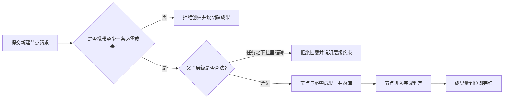
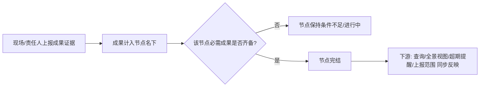
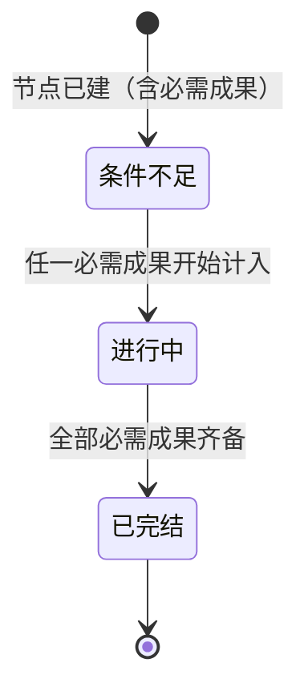

# 节点状态自证化 — PRD（规格 / Spec）

> **日期**：2026-09-21
> **来源**：[节点状态自证化_需求基线_V1.md](./节点状态自证化_需求基线_V1.md)（2026-09-21 讨论）+ 本次多轮对话（第 1~4 轮）
> **参与角色**：需求分析师、作为 Emily 开发者资深架构师、技术总监、资深测试工程师、数据治理/运维工程师
> **宪法版本**：v1.2
> **阶段**：Specify（规格）——方案型技术设计见后续 `节点状态自证化_计划_V*.md`

---

## 一、背景与目标

### 1.1 背景

全景节点的"完成"目前有两个来源：**子节点聚合**与**签认**。由此产生三个已被实证的问题：

| # | 问题 | 实证 |
|---|------|------|
| 1 | 无自有成果的节点永远无法完结 | 状态判定对"无成果定义"的节点一律判为"条件不足" |
| 2 | 父节点状态是派生视图，需靠级联重算维持 | 曾实测记录"父节点状态陈旧"（子节点已推进、父节点未刷新） |
| 3 | "完成"存在一条不依赖证据的路径 | 签认与成果是否齐备无关，签认即可完结 |

叠加本次讨论新确认的两条业务口径：

| # | 新口径 | 与现状的冲突 |
|---|--------|-------------|
| 4 | 节点类型应只由**声明**决定 | 现状"有子节点即自动升格为里程碑"，类型会因结构被系统改写 |
| 5 | 里程碑不得挂在任务之下；任务可含子任务但不得升格 | 现状无此层级约束，且升格是自动发生的 |

**结论**：本需求把节点的事实**收回节点自身**——**完不完成看它自己的必需成果，是什么类型看它自己的声明**，不再由子节点、祖先或人工签认推导。

### 1.2 目标与成功指标

| 目标 | 成功指标（可度量） |
|------|------------------|
| G1 完成判定单一化 | 构造"子节点全完结而父节点自身成果未齐"的场景，父节点不得完结；反之必须完结 |
| G2 取消结构派生类型 | 给任务节点挂子节点后该节点类型**不变**；需求生效后"因挂载而被系统改写类型"的新增记录为 **0** |
| G3 层级约束生效 | 把里程碑挂到任务节点下的操作被拒绝，且拒绝是原子的（原关系不变） |
| G4 无成果节点归零 | 需求生效后，"必需成果为空"的节点数为 **0**（含测试环境布置工具产出） |
| G5 签认链路彻底退场 | 签认能力入口、查询呈现、回复标注残留为 **0 处**；无孤儿能力（静态可达性扫描） |
| G6 语义变更无歧义 | "父节点先行完结"现象消失；全景视图呈现与节点自身判定一致 |

### 1.3 非目标（明确不做）

1. **不纳入**阶段主干（前期/设计/施工）的落地与"所属阶段"承载方式——另立需求线。
2. **不纳入**临时节点（无主信息 / 未签认节点的收容容器）的基础设定——属全景节点维护者线。
3. **不做生产存量迁移作业**——当前数据均为测试数据，无生产存量；对齐范围限于测试环境布置工具与已有场景数据。
4. 不改成果上报与匹配链路的口径。
5. 不引入"人工完结入口"（见 3.1 R6）。
6. 不新增节点状态值（仍为"条件不足 / 进行中 / 已完结"三态）。
7. 不新增层级深度的业务上限，沿用现有安全上限（见 3.1 R9）。
8. 不处理"由展示层负责整体进度感"以外的界面重构。

---

## 二、需求登记表（核心章节）

### 2.1 用户故事与验收标准

**US-01**｜角色：项目管理人员｜场景：查看某里程碑是否完成｜期望：它的完成**只**取决于它自己的必需成果是否齐备，与子节点是否推进无关｜优先级：P0

| AC-ID | 验收标准（可判定） | 验证方式 |
|-------|------------------|---------|
| AC-US-01.1 | 父节点自身必需成果未齐、其全部子节点已完结 → 父节点**不得**为"已完结" | 数据记录 + 节点查询输出 |
| AC-US-01.2 | 父节点自身必需成果齐备、其子节点存在未完结 → 父节点**应为**"已完结" | 数据记录 + 节点查询输出 |
| AC-US-01.3 | 里程碑与任务使用**同一套**完成判定，无分支差异 | 构造同数据的两类节点，判定结果一致 |
| AC-US-01.4 | 任一子节点发生状态变化，其**任何祖先**的已存状态不发生变更 | 变更前后比对祖先状态记录（静态可达性：不存在祖先重算路径） |
| AC-US-01.5 | `counterpart`：判定结果可被下游消费——节点查询、全景视图、超期提醒、成果上报范围均以该判定为准 | 四处输出与判定结果一致 |

**US-02**｜角色：节点创建/维护人｜场景：在既有节点下继续拆解｜期望：**类型不由结构推导**，我声明是什么就是什么｜优先级：P0

| AC-ID | 验收标准（可判定） | 验证方式 |
|-------|------------------|---------|
| AC-US-02.1 | 给一个"任务"节点挂上子节点后，该节点类型仍为"任务" | 节点查询输出 |
| AC-US-02.2 | 带子节点的"任务"，其完成判定仍只按自身必需成果（与 US-01 一致） | 数据记录 |
| AC-US-02.3 | 批量建树/导入时，声明的类型为最终类型，不因是否含子节点而被改写 | 导入结果比对 |
| AC-US-02.4 | 需求生效后，全库"类型被系统自动改写"的新增审计记录数为 0 | 审计记录计数 |

**US-03**｜角色：节点创建/维护人｜场景：挂载父子关系｜期望：不合法的层级关系被明确拒绝，并告诉我为什么｜优先级：P0

| AC-ID | 验收标准（可判定） | 验证方式 |
|-------|------------------|---------|
| AC-US-03.1 | 尝试把"里程碑"节点挂到"任务"节点之下 → **被拒绝**，操作人看到明确原因（不得静默失败、不得静默改类型后放行） | 对话回复 / 接口响应 |
| AC-US-03.2 | "任务"之下只能挂"任务"；挂载成功后双方类型均不变 | 节点查询输出 |
| AC-US-03.3 | 合法挂载（里程碑下挂里程碑 / 里程碑下挂任务）行为不变 | 回归既有场景 |
| AC-US-03.4 | 因层级约束被拒绝时，既有节点关系与类型**不被改动**（拒绝必须是原子的） | 拒绝前后比对 |

**US-04**｜角色：节点创建/维护人｜场景：新建节点｜期望：**没有必需成果就建不出节点**，避免产生永远无法完结的节点｜优先级：P0

| AC-ID | 验收标准（可判定） | 验证方式 |
|-------|------------------|---------|
| AC-US-04.1 | 不带任何必需成果的创建请求 → **被拒绝**，操作人看到"缺少必需成果"的明确提示 | 对话回复 / 接口响应 |
| AC-US-04.2 | 携带至少一条必需成果的创建请求 → 成功，且创建后该成果与节点同时可见、即参与完成判定 | 节点查询输出 |
| AC-US-04.3 | 所有节点创建入口（对话式建节点、批量建树、由调度自动创建）表现一致：不带成果即不可创建 | 逐入口验证 |
| AC-US-04.4 | `counterpart`：成果一旦随节点落库，即被完成判定读取（非仅存储不消费） | 构造 0→达标的过程，观察状态由"条件不足"→"进行中"→"已完结" |
| AC-US-04.5 | 需求生效后，全库"必需成果为空"的节点数为 0 | 全量扫描计数 |

**US-05**｜角色：所有使用者｜场景：查看节点信息 / 阅读 Emily 回复｜期望：不再出现签认与"未签认"相关的一切内容｜优先级：P0

| AC-ID | 验收标准（可判定） | 验证方式 |
|-------|------------------|---------|
| AC-US-05.1 | 签认能力入口对用户不可用（不再出现在可用能力中，调用被明确拒绝或不存在） | 能力目录 + 调用响应 |
| AC-US-05.2 | Emily 回复中**不再**出现"未签认"字样（无论引用何种节点信息） | 对话回复文本检索 |
| AC-US-05.3 | 节点查询与全景视图的呈现中不再包含签认相关信息 | 输出字段比对 |
| AC-US-05.4 | `counterpart`：签认能力被移除的同时，其**全部消费方**同步移除，无"仅定义无使用/仅注册无调用"残留 | 静态可达性扫描（定义处 vs 使用处） |
| AC-US-05.5 | 因签认引起的节点完结路径消失：构造仅"签认通过、成果未齐"的场景，节点**不得**完结 | 数据记录 |

**US-06**｜角色：测试环境维护/数据治理｜场景：测试环境重建或场景布置完成后｜期望：布置工具产出的数据完全符合本规格的全部规则，不留"永久卡住"的节点｜优先级：P0

| AC-ID | 验收标准（可判定） | 验证方式 |
|-------|------------------|---------|
| AC-US-06.1 | 测试环境布置完成后，全库"必需成果为空"的节点数为 0 | 全量扫描计数 |
| AC-US-06.2 | 布置工具产出的节点类型均为声明值；历史因结构升格形成的类型**保留现状、不再追加**，且不存在"里程碑挂在任务下"的关系 | 类型一致性 + 层级扫描 |
| AC-US-06.3 | **布置工具的所有节点创建路径均携带必需成果**——含节点播种、调度作业种子、场景布置脚本三类 | 逐路径检查产出的节点均有成果 |
| AC-US-06.4 | 用于验收的场景数据（含"里程碑下有多个任务"的既有场景）在同口径下重建可通过全部 AC | 场景重建后重跑 |
| AC-US-06.5 | `counterpart`：布置工具中新增的成果相关参数，其消费方（建节点能力）同步具备读取与落库，不留"仅写入无读取" | 静态可达性扫描 + 一次实际布置验证 |

### 2.2 US 清单（下游追溯锚点）

| US-ID | 一句话 | 优先级 | 状态 |
|-------|--------|--------|------|
| US-01 | 完成判定只认节点自身必需成果，退役父子聚合 | P0 | 生效 |
| US-02 | 节点类型只由声明决定，不随结构变化 | P0 | 生效 |
| US-03 | 里程碑不得挂在任务之下，拒绝须原子且可解释 | P0 | 生效 |
| US-04 | 无必需成果不得创建节点（全入口一致） | P0 | 生效 |
| US-05 | 签认整体退役，能力与消费方同步移除 | P0 | 生效 |
| US-06 | 测试环境布置工具与场景数据对齐到新规则 | P0 | 生效 |

---

## 三、业务规则与流程

### 3.1 业务规则

| # | 规则 | 说明 |
|---|------|------|
| R1 | **完成自证** | 节点是否完结，只由该节点自身的必需成果是否齐备决定；子节点、祖先、外部认可均不参与 |
| R2 | **类型自持** | 节点类型由创建/变更时的声明决定；系统**不得**因结构变化（如挂入子节点）改写类型 |
| R3 | **层级约束** | 里程碑不得挂在任务之下；任务之下只能挂任务 |
| R4 | **成果必备** | 任何节点创建时必须携带至少一条必需成果，否则不予创建 |
| R5 | **单一事实** | "已完结"即"必需成果齐备"，是系统判定的事实结论，不存在第二条完结来源 |
| R6 | **无人工完结入口** | 不设"人工宣告完工"的通道；对结果负责的方式是**上报成果证据**本身，不是盖章 |
| R7 | **状态三态不变** | 状态取值与语义保持"条件不足 / 进行中 / 已完结" |
| R8 | **整体进度归展示层** | 状态机不提供层级聚合；如需体现"整体完成度"，由展示层按可见结构自行聚合，且**不得**回写为节点状态 |
| R9 | **层级深度沿用现有安全上限** | 不新增业务深度上限；仅保留用于防止脏数据成环的既有安全上限 |

### 3.2 业务流程（业务级）

> 此图展示：一次"新建节点"请求从提交到落库的把关顺序。

> 此图展示：节点从"被报告了成果"到"完结"的业务链条，以及"认可"责任的下移（R6）。

### 3.3 业务状态流转

> 仅描述业务可见状态；"已完结"不可回退，且只有一条进入路径。

---

## 四、边界与约束

### 4.1 触碰的宪法铁律

| 铁律 | 影响 | 处理 |
|------|------|------|
| **C11 功能注册接入 + Q6 接线闭合** | 签认退役是大面积能力退场：签认能力本身、其查询呈现、其回复标注、其承载数据。任一处只删一半即为孤儿 | 必须同批移除并静态验证（AC-US-05.4） |
| **C10 工具必须带参数 schema** | 退场一个 LLM 工具时，其 schema 声明、注册、一致性映射三步须同步移除 | 纳入范围 |
| **C12 会话主循环冻结** | "未签认"标注链路经核实位于**会话上下文装配、提示词资产、节点查询输出**三处，不涉及会话主循环本体 | 已核实：本需求不触碰主循环；若计划阶段发现需改主循环文件，须停下改走内核形态专项 |
| C0 根治而非迁就 | 本需求是根源修正（收回"事实"的定义权），非绕过 | 合规 |
| C2 分层不可跳 | 状态与类型判定属服务层能力，不得跨层实现 | 合规 |
| C8 唯一执行引擎 | 状态/类型判定不在执行引擎内，不涉及 | 不涉及 |
| C1 / C3 / C4 / C5 / C6 / C7 / C9 / C13 | 不涉及 | — |

### 4.2 范围边界

| 在范围内 | 不在范围内 |
|---------|-----------|
| 完成判定口径（自证） | 阶段主干与"所属阶段"承载 |
| 节点类型规则（自持 + 层级约束） | 临时节点的定义与迁正机制 |
| 节点创建把关（成果必备，全入口一致） | 成果上报/匹配算法口径 |
| 签认整体退役及其消费方清理 | 界面视觉重构 |
| 测试环境布置工具与场景数据对齐 | 生产存量迁移（当前无生产数据） |

### 4.3 假设与依赖

| # | 假设 / 依赖 | 若不成立的影响 |
|---|------------|--------------|
| 1 | 既有成果提交/确认链路可承载"成果计入节点名下" | 缺少成果量来源 → 节点永远无法完结（本需求的核心前置） |
| 2 | 各节点创建入口均**具备**携带成果的能力（尤其由调度自动创建的路径与对话式建节点） | 无成果能力的入口在 R4 下直接不可用，须与其能力一并补齐（见附录 B-1） |
| 3 | **跨需求线依赖**：签认退役后，全景节点维护者线的"迁正 / 可信度"不再以签认为依托；该线的替代落点由其自身规格定义，本 PRD 仅登记该依赖并要求其实施前完成修订。**建议**：改挂到"成果证据是否齐备"，与本需求同源 | 该线规格若不同步修订，将失去可信度判定依据 |
| 4 | 测试环境可在布置后满足全部规则 | G4/G6 指标不达标 |

### 4.4 约束型技术决策

| # | 约束 | 来源 / 理由 |
|---|------|-----------|
| 1 | 必须复用既有成果提交与确认链路承载"成果齐备"，**不得**新造一套完工认定机制 | 避免重复建设（依赖 4.3-1） |
| 2 | 状态与类型判定必须可复现，**不得**由 LLM 判定 | 状态是硬门禁（查询、提醒、上报范围均依赖） |
| 3 | 展示层聚合结果**不得**回写为节点状态存储（R8） | 保住"状态只有单一事实来源" |
| 4 | 退场能力必须连带移除其消费方，**不得**留下无消费方的产出物（Q6） | 宪法 Q6 |
| 5 | **不得**为兼容旧数据保留"结构派生类型"的隐式路径（含自动升格、导入派生） | 宪法 C0，避免双规则并存 |
| 6 | 不得引入新依赖 | 部署与维护成本（Q5） |

### 4.5 产出物与消费方（接线清单）

| # | 产出物（能力） | 消费方（谁使用 / 何处生效） | 对应 US |
|---|--------------|--------------------------|--------|
| 1 | 节点完成判定结果 | 节点查询呈现、全景视图、超期与提醒、成果上报范围 | US-01 |
| 2 | 节点类型（声明式） | 层级校验、视图分组、里程碑相关提醒口径 | US-02 |
| 3 | 层级约束校验结果 | 挂载操作的准入与错误提示 | US-03 |
| 4 | 节点必备的必需成果清单 | 完成判定、成果提交与匹配 | US-04 |
| 5 | 布置工具中的成果参数 | 建节点能力（读取并落库成果） | US-06 |

**未接线清单 / 主动移除清单**：签认及其消费方（签认能力、查询呈现、回复"未签认"标注、承载数据）为**主动移除**，不属未接线；移除后须以静态可达性扫描确认无残留（AC-US-05.4）。

---

## 五、替代方案

| 方案 | 内容 | 为何未采纳 |
|------|------|-----------|
| S1（被否） | **只退役聚合、保留签认**：改动最小 | 签认与成果证据无关，留着它"完成"就仍有一条不依赖证据的来源，问题 3 未解 |
| S2（被否） | **保留签认但降级为纯留痕标记** | 在 R5/R6 下该标记无任何消费方，属"产出物无消费者"（Q6），且会让使用者误以为仍具效力 |
| S3（被否） | **把"认可"上移为节点级人工完结入口** | 又回到"两个完结来源"，与 R5 冲突 |
| S4（采纳） | **完成=成果齐备（系统判定即最终）+ 认可责任下移到成果证据** | 单一事实来源；不需要盖一个与证据无关的章 |

---

## 六、风险与开放问题

| # | 风险 / 开放问题 | 类型 | 影响 | 缓解 / 待决 |
|---|----------------|------|------|------------|
| 1 | 部分创建入口当前不携带成果（调度自动创建、对话式建任务），R4 下将不可用 | 约束 | 入口失效、相关场景失效 | 覆盖 AC-US-04.3 / US-06.3；能力补齐方式见附录 B-1，须与其场景数据一并落地 |
| 2 | 布置工具中新增的成果参数若无人读取，即构成"仅写入无读取" | 约束 | 违反 Q6 | 覆盖 AC-US-06.5；参数与建节点能力**必须同一批落地** |
| 3 | 类型不再派生后，"任务可含子任务"使任务与里程碑的区分只剩声明，可能出现语义混用 | 业务 | 类型失真 | 由填报与验收口径约束（本需求只保证"系统不改写"） |
| 4 | 用户预期落差：原本"签认即完结"的操作习惯消失 | 业务 | 使用阻力 | 以 R6 口径对外说明：对结果负责的方式是上报证据 |
| 5 | 跨需求线：全景节点维护者的可信度地基被抽走 | 约束 | 该线规格失效 | 已在 4.3-3 登记为依赖；建议其改挂"成果证据是否齐备" |
| 6 | "父节点按自身判定显示"可能被用户误读为整体未推进 | 业务 | 理解偏差 | 由 R8 明确整体完成度的归属；呈现方式见附录 B-5 |

---

## 附录 A：规格变更记录

| 版本 | 日期 | 变更内容 | 影响的 US |
|------|------|---------|----------|
| V1 | 2026-09-21 | 初版（含状态自证、类型自持、层级约束、成果必备、签认退役、测试环境对齐） | — |

---

## 附录 B：留给 req-plan 的方案型技术问题

> 本技能**不解答**以下问题，仅登记为 req-plan / DD 的输入。
> 只登记"用哪个方案实现"类问题；"必须 / 不得"类约束见 §4.4。

| # | 方案型技术问题 | 为何须在计划 / DD 阶段定 |
|---|---------------|----------------------|
| 1 | 各创建入口如何补齐"携带必需成果"的能力：调度自动创建节点的成果来源（配置 / 模板 / 继承）、对话式建节点工具的成果入参与 schema | 涉及入参契约与配置形态选型；且须与其消费方同批落地（Q6） |
| 2 | 签认承载数据的处置：物理清除还是保留空位；历史签认记录是否保留 | 涉及数据迁移与兼容策略 |
| 3 | "子节点权重"概念在聚合退役后是否一并退场 | 涉及既有数据语义取舍 |
| 4 | 类型自持后，批量建树 / 导入路径如何消除任何隐式派生 | 涉及导入契约调整 |
| 5 | 展示层整体进度聚合的实现位置与口径（不得回写状态） | 涉及前后端边界 |
| 6 | 存量"类型因结构升格"的节点保留现状，是否需要一次性核对清单 | 涉及数据治理作业范围 |

---
*本 PRD 为规格（Spec），由 req-review 多轮对话生成，基于 Emily 项目上下文与项目宪法 v1.2。方案型技术设计见 `节点状态自证化_计划_V*.md`。*
