# Emily 系统技术白皮书

> 地产开发团队公共大脑 - 陪跑地产开发全生命周期的协作工具
>
> 版本：V1.0 | 最后更新：2026-07-15

***

## 1. 软件概述

### 1.1 基本信息

**Emily** 是一款陪跑地产开发全生命周期的协作工具，定位为"地产开发团队公共大脑"，当前版本 V1.0。系统通过即时通讯渠道（如QQ等）接入，以自然语言交互提供服务。技术架构采用薄插件层 + 独立业务内核（会话主线 + 任务执行单元 + PipelineBUS流水线）。开发语言为 Python，数据库采用 PostgreSQL，开发框架基于 asyncio，支持容器化部署与单机部署。

本系统面向地产参建团队，区别于个人助手类工具，通过结构化的项目全生命周期管理、多角色协同机制和知识持续沉淀能力，服务于施工、监理、建设、设计等多方参建单位的日常协作。

### 1.2 软件运行环境

**服务器环境**：

| 项目         | 要求                                  |
| ---------- | ----------------------------------- |
| 操作系统       | Linux（推荐 Ubuntu 20.04+ / CentOS 7+） |
| CPU        | 4核及以上                               |
| 内存         | 8GB及以上                              |
| 磁盘         | 50GB可用空间及以上                         |
| Python     | 3.10+                               |
| PostgreSQL | 14+                                 |

**开发环境**：

| 项目   | 说明                     |
| ---- | ---------------------- |
| 开发语言 | Python 3.10+           |
| 数据库  | PostgreSQL 14+         |
| 开发框架 | asyncio（异步IO框架）        |
| 部署方式 | 支持容器化部署（Docker）与单机直接部署 |

**客户端环境**：

系统通过即时通讯渠道提供服务，用户端仅需安装对应IM客户端（如QQ等），无需安装额外软件。

### 1.3 运作逻辑与关键价值

Emily 围绕项目全生命周期提供消息归档、任务调度、节点追踪、知识沉淀等功能，核心解决传统地产管理中信息差、协作低效、经验流失、知识孤岛四大痛点。运转上，用户消息经薄插件层协议转换与去重后进入业务内核，会话调度器识别意图并拆解为任务执行单元，沿 PipelineBUS 四节点流水线执行，结果异步回复。

系统以"意图识别→任务拆解→管道执行→成果沉淀"闭环运转，每轮交互同时贡献知识增量。全面记录：消息全量归档，参建方共享同一信息视图，消除信息差。高效协作：自然语言交互，复合请求智能拆解，打破沟通壁垒。知识沉淀：三书协同自进化，个体经验提炼为团队资产。主动巡检：节点周期巡检、分级预警与智能推荐，将智能调度融入日常管理。

### 1.4 软件独创性说明

本系统区别于通用管理软件及通用智能工具，具有以下四项核心独创设计：

**全景节点树**：采用树状层级管理体系，项目→阶段→楼栋→具体施工节点逐层分解，底层节点完工进度自动加权汇总至上层。节点间支持前置依赖约束，节点状态流转由审批驱动。文件与数据可见范围沿节点树自上而下继承、逐级收窄，确保各参建方仅能访问其授权范围的业务数据。

**三维权限模型**：区别于传统的角色-权限二维模型，本系统构建了角色级别×数据范围×操作类型的三维矩阵式鉴权体系。角色级别分为访客、参建执行、参建管理、建设主管、管理员、系统管理员六级；数据范围按全景节点树和参建企业类型限定；操作类型覆盖读、写、删、审、管五种粒度。三者交叉构成精细化的动态鉴权矩阵，权限快照在会话创建时前置计算并注入执行上下文，实现全链路零延迟鉴权。

**SOP 流程引擎**：系统内置七段式标准规范模板（SOP标识、意图识别、工具与权限、执行步骤、输出规范、异常处理、后续动作），通过热重载注册机制实现业务流程的零代码扩展。新增业务流程仅需编写规范文档并放入指定目录，通过 API 触发热重载即可生效，无需修改代码或重启服务。执行层采用 PipelineBUS 四节点流水线（意图拆分→计划标准→执行验收→成果总结），各节点支持前置/后置 Hook 挂载鉴权、审计、校验等横切逻辑。

**三书自进化闭环**：世界书（外部知识与行业规范）、规则书（业务规则与最佳实践）、自我认知书（系统能力边界描述）三者协同，从日常运作中自动提炼优化规则。系统每日自动分析执行记录，计算各 SOP 命中率和健康度，归纳优化规则并更新世界书，形成"观察→学习→进化"的持续改进闭环，使系统随使用时间增长而持续提升服务质量。

### 1.5 功能全景图

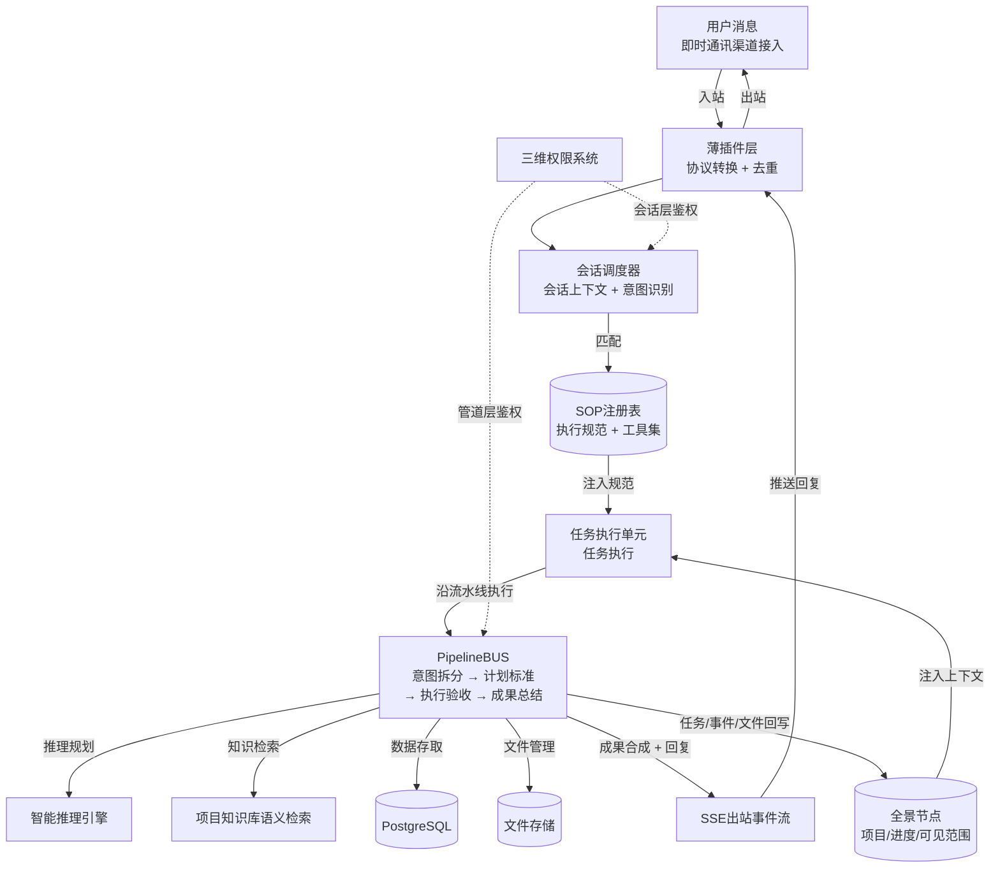
```mermaid
graph TD
    IM[用户消息<br/>即时通讯渠道接入] -->|入站| Plugin[薄插件层<br/>协议转换 + 去重]

    Plugin --> SA[会话调度器<br/>会话上下文 + 意图识别]

    SA -->|匹配| SOP[(SOP注册表<br/>执行规范 + 工具集)]
    SOP -->|注入规范| WA[任务执行单元<br/>任务执行]

    Node[(全景节点<br/>项目/进度/可见范围)] -->|注入上下文| WA

    WA -->|沿流水线执行| BUS[PipelineBUS<br/>意图拆分 → 计划标准<br/>→ 执行验收 → 成果总结]

    BUS -->|推理规划| IR[智能推理引擎]
    BUS -->|知识检索| KS[项目知识库语义检索]
    BUS -->|数据存取| DB[(PostgreSQL)]
    BUS -->|文件管理| FS[(文件存储)]

    BUS -->|成果合成 + 回复| SSE[SSE出站事件流]
    SSE -->|推送回复| Plugin
    Plugin -->|出站| IM

    BUS -->|任务/事件/文件回写| Node

    Perm[三维权限系统] -.->|会话层鉴权| SA
    Perm -.->|管道层鉴权| BUS
```

> 图例：矩形=实体/模块，菱形=判断节点，圆角矩形=流程步骤，箭头=数据/控制流，虚线=鉴权横切

***

## 2. 系统架构设计

### 2.1 系统架构概述

Emily 系统由五层核心模块构成，各层职责边界清晰，通过标准化接口协同工作。自下而上依次为：基础设施层提供智能推理、项目知识库语义检索、数据持久化等基础能力；调度引擎层驱动定时作业与业务流程自动优化闭环；业务内核层包含会话调度、流水线执行与业务服务三大组件，是系统核心；薄插件层屏蔽各即时通讯渠道差异，完成协议转换与消息转发；用户交互层通过 QQ、微信等即时通讯工具面向最终用户。请求从用户交互层逐层向下传递至业务内核，执行结果一方面通过 SSE 事件流异步回传至用户，另一方面沉淀到全景节点体系与知识库。三维权限系统作为横切能力，在会话层与管道执行层双重挂载鉴权点，确保全链路安全可控。系统通过适配器层支持多IM平台接入，QQ仅作为示例渠道之一。

### 2.2 技术架构图

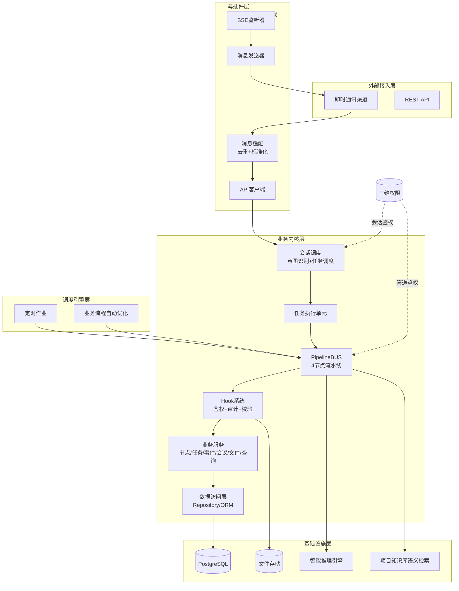
```mermaid
flowchart TB
    subgraph A["外部接入层"]
        A1[即时通讯渠道]
        A2[REST API]
    end

    subgraph B["薄插件层<br/>协议转换 + 消息转发"]
        direction LR
        B1[消息适配<br/>去重+标准化]
        B2[API客户端]
        B3[SSE监听器]
        B4[消息发送器]
    end

    subgraph C["业务内核层"]
        direction LR
        C1[会话调度<br/>意图识别+任务调度]
        C2[任务执行单元]
        C3[PipelineBUS<br/>4节点流水线]
        C4[Hook系统<br/>鉴权+审计+校验]
        C5[业务服务<br/>节点/任务/事件/会议/文件/查询]
        C6[数据访问层<br/>Repository/ORM]
    end

    subgraph D["基础设施层"]
        direction LR
        D1[(PostgreSQL)]
        D2[智能推理引擎]
        D3[项目知识库语义检索]
        D4[(文件存储)]
    end

    subgraph E["调度引擎层"]
        direction LR
        E1[定时作业]
        E2[业务流程自动优化]
    end

    P[(三维权限)]

    A1 --> B1
    B1 --> B2 --> C1
    B3 --> B4 --> A1

    C1 --> C2 --> C3 --> C4
    C4 --> C5 --> C6 --> D1
    C3 --> D2
    C3 --> D3
    C4 --> D4

    P -.->|会话鉴权| C1
    P -.->|管道鉴权| C3

    E1 --> C3
    E2 --> C3
```

> 图例：矩形=实体/模块，圆角矩形=流程步骤，箭头=数据/控制流

### 2.3 分层架构说明

#### 第一层：薄插件层（Plugin Layer）

**职责**：协议转换、消息去重、标准化、转发。插件层负责将不同即时通讯平台的原始消息转换为系统内部的标准化消息格式，并对出站回复进行平台适配。系统通过适配器层支持多IM平台接入。

**核心组件**：

| 组件        | 职责                                 |
| --------- | ---------------------------------- |
| 消息适配模块    | IM 平台原始消息 → 标准化消息（StandardMessage） |
| API 客户端模块 | 标准化消息 → POST 发送到核心服务               |
| 事件监听模块    | 监听核心层出站 SSE 事件流                    |
| 消息发送模块    | 回复消息 → 适配为各 IM 平台消息格式              |

**设计约束**：

- 插件层不引用业务内核的任何内部包
- 仅依赖独立的标准化数据结构副本
- 无状态，可水平扩展

#### 第二层：协议层（Protocol Layer）

**职责**：API 路由、SSE 事件流、请求验签。

| 端点                          | 方法   | 说明        |
| --------------------------- | ---- | --------- |
| `/api/v1/message/send`      | POST | 入站消息入口    |
| `/api/v1/events/outbound`   | GET  | SSE 出站事件流 |
| `/api/v1/health`            | GET  | 健康检查      |
| `/api/v1/session/terminate` | POST | 会话终止      |

#### 第三层：会话层（Session Layer）

**职责**：用户意图识别、多任务调度、上下文管理。

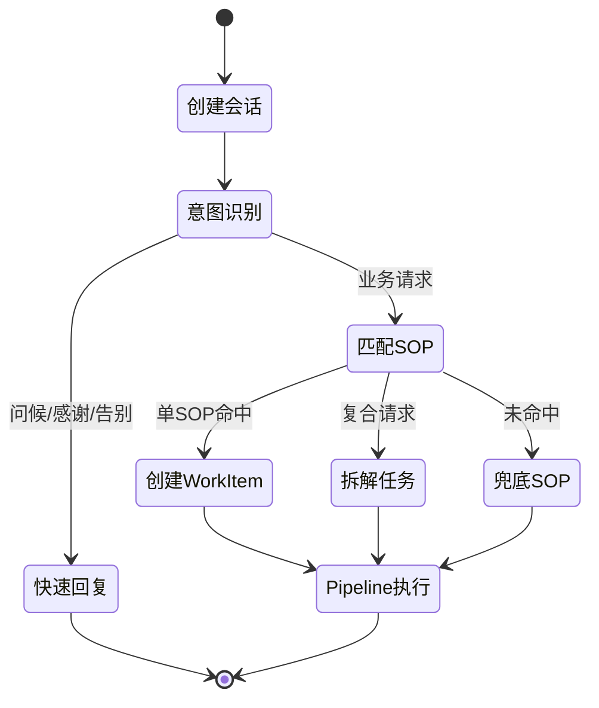
```mermaid
stateDiagram-v2
    [*] --> 创建会话
    创建会话 --> 意图识别
    意图识别 --> 快速回复 : 问候/感谢/告别
    意图识别 --> 匹配SOP : 业务请求
    匹配SOP --> 创建WorkItem : 单SOP命中
    匹配SOP --> 拆解任务 : 复合请求
    匹配SOP --> 兜底SOP : 未命中
    创建WorkItem --> Pipeline执行
    拆解任务 --> Pipeline执行
    兜底SOP --> Pipeline执行
    快速回复 --> [*]
    Pipeline执行 --> [*]
```

> 图例：实线箭头=状态转换，圆角矩形=状态，\[\*]=起始/终止

**核心组件**：

- **SessionPool**：会话ID与调度器的映射管理，含 TTL 自动清理
- **会话调度器**：每会话调度单元，负责意图识别和任务调度
- **FocusLock**：话题切换检测，防止上下文污染
- **ConfirmQueue**：待用户确认的任务排队，支持中断恢复

#### 第四层：管道执行层（Pipeline Layer）

**职责**：4 节点流水线执行、Hook 挂载、任务执行单元状态机驱动。

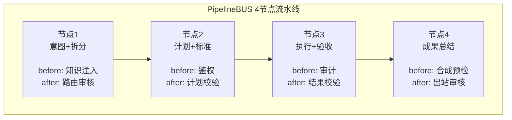
```mermaid
graph TD
    subgraph Pipeline["PipelineBUS 4节点流水线"]
        direction LR
        N1[节点1<br/>意图+拆分<br/><br/>before: 知识注入<br/>after: 路由审核] --> N2[节点2<br/>计划+标准<br/><br/>before: 鉴权<br/>after: 计划校验] --> N3[节点3<br/>执行+验收<br/><br/>before: 审计<br/>after: 结果校验] --> N4[节点4<br/>成果总结<br/><br/>before: 合成预检<br/>after: 出站审核]
    end
```

> 图例：圆角矩形=流程步骤（流水线节点），箭头=执行顺序

**Pipeline 节点说明**：

| 节点        | 名称    | 必选 | 核心职责                              |
| --------- | ----- | -- | --------------------------------- |
| **node1** | 意图+拆分 | ✅  | 知识注入器增量注入 SOP/工具/Schema，构建并验证路由决策 |
| **node2** | 计划+标准 | ✅  | 智能推理引擎生成执行计划（含风险等级/步骤/验收标准）       |
| **node3** | 执行+验收 | ✅  | 遍历计划步骤，调用业务工具或项目知识库语义检索           |
| **node4** | 成果总结  | ❌  | 合成结果文本→验证回复，内容安全审核                |

#### 第五层：业务服务层（Service Layer）

**职责**：领域逻辑实现、事务管理、跨领域协调。

| 服务                | 职责               | 对应 SOP       |
| ----------------- | ---------------- | ------------ |
| NodeService       | 全景节点管理、状态流转、成果进度 | SOP-011-SYS  |
| TaskService       | 任务创建、分配、追踪、验收    | SOP-003-REC  |
| EventService      | 事件记录、分类、关联、简报    | SOP-002-REC  |
| MeetingService    | 会议纪要、待办提取、追踪     | SOP-001-REC  |
| FileService       | 文件归档、版本链、权限控制    | SOP-004-FILE |
| QueryService      | 跨表查询、统计、报表生成     | SOP-005-QRY  |
| PermissionService | 权限校验、范围控制、授权管理   | 系统内置         |

#### 第六层：数据访问层（Repository Layer）

**职责**：ORM 操作、数据一致性保证。采用同步 ORM 操作配合 asyncio 异步调度器完成数据库交互。

**核心 Repository**：

- `UserRepository` - 用户与 IM 绑定管理
- `MessageRepository` - 消息全量归档
- `NodeRepository` - 全景节点树管理
- `TaskRepository` - 任务管理
- `EventRepository` - 事件记录管理
- `MeetingRepository` - 会议管理
- `FileRepository` - 文件与版本链管理
- `PermissionGrantRepository` - 权限授权管理
- `ReasoningRepository` - 推理过程日志
- `EvolutionRepo` - 业务优化相关的洞察、规则、补丁数据管理

### 2.4 核心数据流

#### 端到端消息处理流程

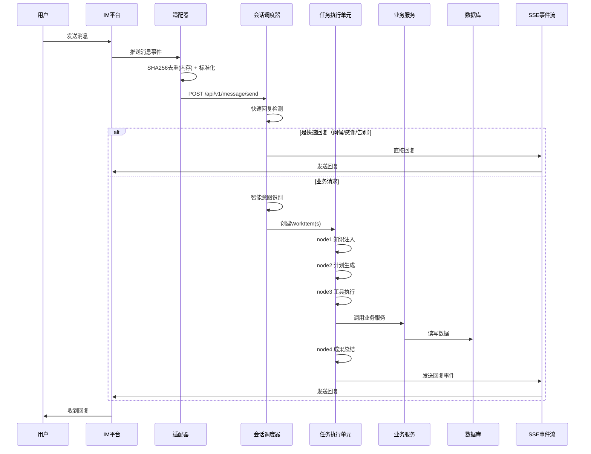
```mermaid
sequenceDiagram
    participant U as 用户
    participant IM as IM平台
    participant A as 适配器
    participant SA as 会话调度器
    participant WA as 任务执行单元
    participant SVC as 业务服务
    participant DB as 数据库
    participant SSE as SSE事件流

    U->>IM: 发送消息
    IM->>A: 推送消息事件
    A->>A: SHA256去重(内存) + 标准化
    A->>SA: POST /api/v1/message/send

    SA->>SA: 快速回复检测
    alt 是快速回复（问候/感谢/告别）
        SA->>SSE: 直接回复
        SSE->>IM: 发送回复
    else 业务请求
        SA->>SA: 智能意图识别
        SA->>WA: 创建WorkItem(s)
        WA->>WA: node1 知识注入
        WA->>WA: node2 计划生成
        WA->>WA: node3 工具执行
        WA->>SVC: 调用业务服务
        SVC->>DB: 读写数据
        WA->>WA: node4 成果总结
        WA->>SSE: 发送回复事件
        SSE->>IM: 发送回复
    end

    IM->>U: 收到回复
```

> 图例：矩形=参与者/组件，实线箭头=同步消息传递，虚线箭头=异步返回

#### WorkItem 状态机流转

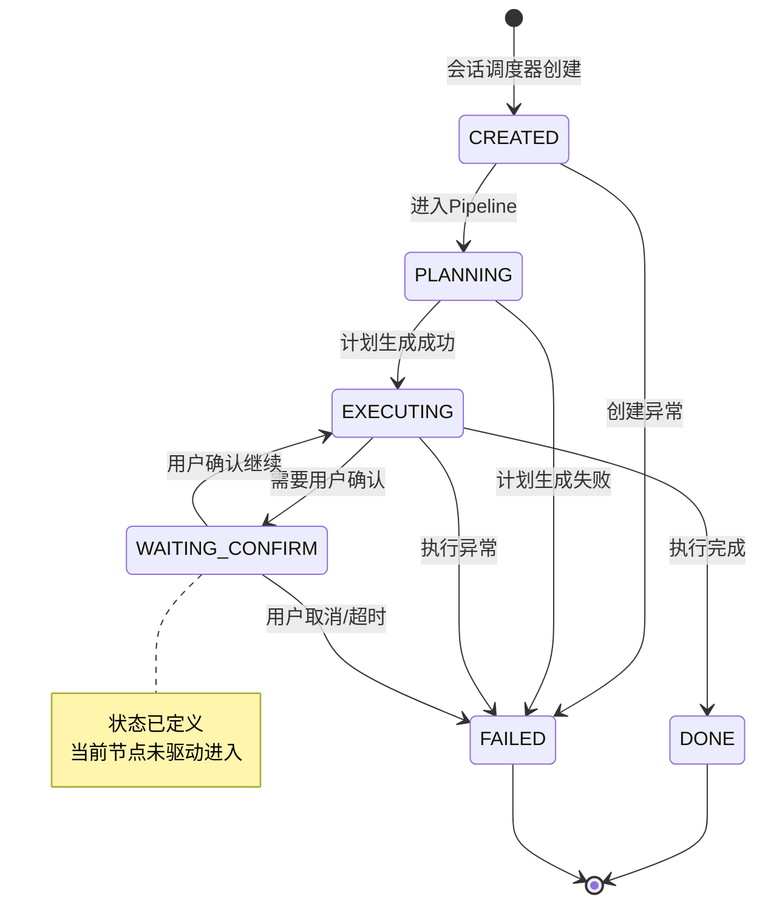
```mermaid
stateDiagram-v2
    [*] --> CREATED: 会话调度器创建

    CREATED --> PLANNING: 进入Pipeline
    CREATED --> FAILED: 创建异常

    PLANNING --> EXECUTING: 计划生成成功
    PLANNING --> FAILED: 计划生成失败

    EXECUTING --> WAITING_CONFIRM: 需要用户确认
    EXECUTING --> DONE: 执行完成
    EXECUTING --> FAILED: 执行异常

    WAITING_CONFIRM --> EXECUTING: 用户确认继续
    WAITING_CONFIRM --> FAILED: 用户取消/超时

    DONE --> [*]
    FAILED --> [*]

    note right of WAITING_CONFIRM
        状态已定义
        当前节点未驱动进入
    end note
```

> 图例：实线箭头=状态转换，圆角矩形=状态，\[\*]=起始/终止

**状态说明**：

| 状态                | 含义       | 触发条件                    |
| ----------------- | -------- | ----------------------- |
| `CREATED`         | 任务已创建    | 会话调度器从用户消息解析创建          |
| `PLANNING`        | 正在生成执行计划 | 任务执行单元 node2 调用智能推理     |
| `EXECUTING`       | 正在执行计划步骤 | 任务执行单元 node3 遍历计划步骤调用工具 |
| `WAITING_CONFIRM` | 等待用户确认   | 执行到需要用户决策的节点            |
| `DONE`            | 执行成功完成   | 所有步骤执行通过，成果合成完成         |
| `FAILED`          | 执行异常或终止  | 任何节点异常 / 用户取消 / 超时      |

***

## 3. 核心业务模块详解

### 3.1 全生命周期管理

#### 3.1.1 消息处理机制

**消息标准化流程**：

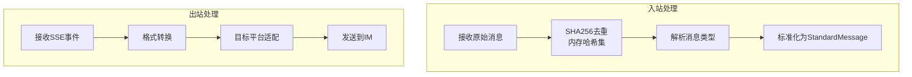
```mermaid
graph TD
    subgraph 入站处理
        R[接收原始消息]
        D[SHA256去重<br/>内存哈希集]
        P[解析消息类型]
        S[标准化为StandardMessage]
    end

    subgraph 出站处理
        E[接收SSE事件]
        F[格式转换]
        T[目标平台适配]
        O[发送到IM]
    end

    R --> D --> P --> S
    E --> F --> T --> O
```

> 图例：圆角矩形=处理步骤，箭头=数据流向

**去重机制**：对每条消息计算 SHA256(平台标识 + 会话ID + 消息ID + 消息内容)，内存哈希集缓存最近 10 分钟的消息哈希，重复消息直接丢弃。

**StandardMessage 标准化字段**：

| 字段                    | 类型          | 说明                      |
| --------------------- | ----------- | ----------------------- |
| `message_id`          | str         | 消息唯一 ID                 |
| `platform`            | str         | 来源平台标识                  |
| `conversation_type`   | str         | "private" / "group"     |
| `conversation_id`     | str         | 群 ID 或私聊用户 ID           |
| `sender_id`           | str         | 发送者 IM ID               |
| `sender_name`         | str         | 发送者昵称                   |
| `is_at_bot`           | bool        | 是否 @机器人                 |
| `content`             | str         | 消息文本（@bot 已剥离）          |
| `msg_type`            | int         | 1文本/2图片/3文件/4语音/5视频/6卡片 |
| `attachments`         | list\[dict] | 附件列表                    |
| `group_id`            | str\|None   | 群 ID                    |
| `mentioned_user_ids`  | list\[str]  | 被 @用户 ID 列表             |
| `reply_to_message_id` | str\|None   | 引用的消息 ID                |

#### 3.1.2 Session 会话管理

**会话生命周期**：

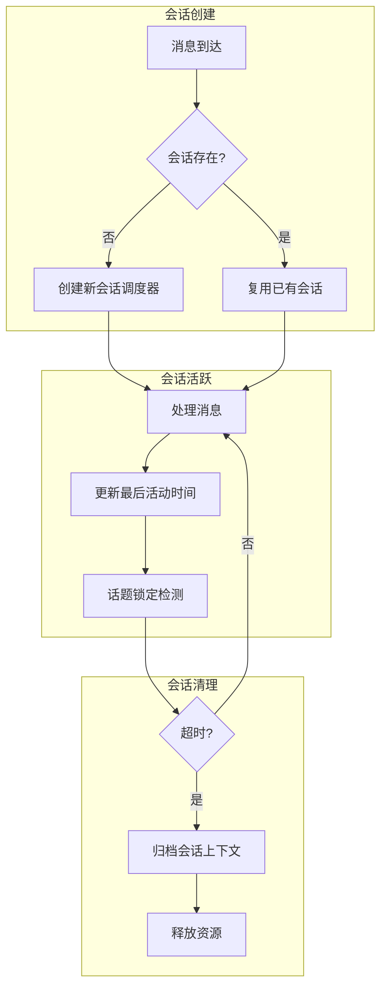
```mermaid
graph TD
    subgraph 会话创建
        A[消息到达]
        B{会话存在?}
        C[创建新会话调度器]
        D[复用已有会话]
    end

    subgraph 会话活跃
        E[处理消息]
        F[更新最后活动时间]
        G[话题锁定检测]
    end

    subgraph 会话清理
        H[超时检测<br/>30分钟无活动]
        I[归档会话上下文]
        J[释放资源]
    end

    A --> B
    B -->|否| C --> E
    B -->|是| D --> E

    E --> F --> G
    G --> H{超时?}
    H -->|是| I --> J
    H -->|否| E
```

> 图例：矩形=处理阶段，菱形=判断节点，圆角矩形=步骤，箭头=流程

**会话上下文数据结构**：每次会话创建时，系统构建会话上下文快照，包含以下关键信息：

- **权限快照**：用户角色级别、所属企业类型、允许访问的 SOP 列表、授权项目与节点范围
- **对话历史**：最近对话轮次摘要
- **用户记忆**：用户长期行为与偏好摘要
- **SOP/工具目录**：当前可用 SOP 与工具的目录摘要
- **话题焦点**：当前锁定的对话话题关键词
- **活动时间**：最后活跃时间戳，用于 TTL 判定

#### 3.1.3 WorkItem 工作项流转

**从用户消息到任务执行单元的拆解过程**：

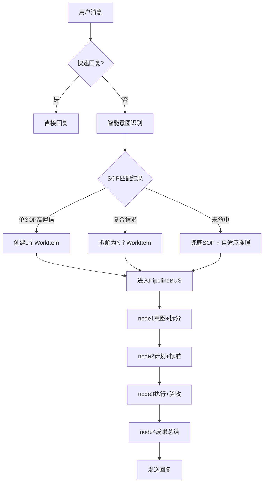
```mermaid
flowchart TD
    A[用户消息] --> B{快速回复?}
    B -->|是| C[直接回复]
    B -->|否| D[智能意图识别]

    D --> E{SOP匹配结果}
    E -->|单SOP高置信| F[创建1个WorkItem]
    E -->|复合请求| G[拆解为N个WorkItem]
    E -->|未命中| H[兜底SOP + 自适应推理]

    F --> I[进入PipelineBUS]
    G --> I
    H --> I

    I --> J[node1意图+拆分]
    J --> K[node2计划+标准]
    K --> L[node3执行+验收]
    L --> M[node4成果总结]
    M --> N[发送回复]
```

> 图例：菱形=判断节点，圆角矩形=处理步骤，箭头=流程链路

**任务执行单元核心数据说明**：每个 WorkItem 包含以下核心要素：

- **标识信息**：全局唯一 ID、所属会话 ID、匹配的 SOP ID
- **状态与优先级**：CREATED→PLANNING→EXECUTING→DONE/FAILED 状态流转，支持 low/normal/high/urgent 四级优先级
- **路由决策**：意图类型（SOP/复合/兜底）、匹配的 SOP ID、置信度、所需工具清单
- **执行计划**：风险等级评估、分步骤计划（每步含工具名、参数、说明）、验收标准
- **执行追踪**：当前执行步骤序号、工具调用结果列表、时间戳

***

### 3.2 全景节点管理系统

#### 3.2.1 树状结构设计

**节点层级体系**：

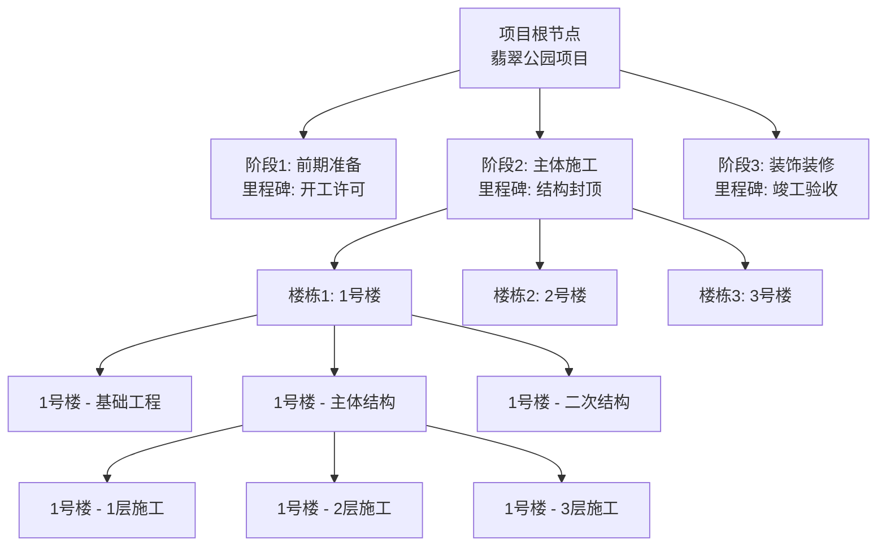
```mermaid
graph TB
    Root[项目根节点<br/>翡翠公园项目]

    Root --> L1_1[阶段1: 前期准备<br/>里程碑: 开工许可]
    Root --> L1_2[阶段2: 主体施工<br/>里程碑: 结构封顶]
    Root --> L1_3[阶段3: 装饰装修<br/>里程碑: 竣工验收]

    L1_2 --> L2_1[楼栋1: 1号楼]
    L1_2 --> L2_2[楼栋2: 2号楼]
    L1_2 --> L2_3[楼栋3: 3号楼]

    L2_1 --> L3_1[1号楼 - 基础工程]
    L2_1 --> L3_2[1号楼 - 主体结构]
    L2_1 --> L3_3[1号楼 - 二次结构]

    L3_2 --> L4_1[1号楼 - 1层施工]
    L3_2 --> L4_2[1号楼 - 2层施工]
    L3_2 --> L4_3[1号楼 - 3层施工]
```

> 图例：矩形=节点实体，箭头=父子包含关系

**节点属性设计**：

| 属性               | 类型      | 说明                                                               |
| ---------------- | ------- | ---------------------------------------------------------------- |
| `id`             | UUID    | 全局唯一节点 ID                                                        |
| `node_no`        | String  | 业务编号（如 NODE-YYYYMMDD-NNNN）                                       |
| `title`          | String  | 节点名称                                                             |
| `description`    | String  | 节点描述                                                             |
| `level`          | Integer | 层级深度                                                             |
| `parent_node_id` | UUID    | 父节点 ID                                                           |
| `project_id`     | UUID    | 所属项目                                                             |
| `status`         | Enum    | NOT\_ACTIVATED / CONDITIONS\_NOT\_MET / IN\_PROGRESS / COMPLETED |
| `weight`         | Integer | 父子权重（用于进度加权计算）                                                   |
| `progress`       | Integer | 进度 0-100                                                         |
| `approver_id`    | UUID    | 审批人                                                              |
| `approved_at`    | String  | 审批时间                                                             |

#### 3.2.2 里程碑体系

**里程碑类型**：

| 类型        | 说明            | 典型示例                |
| --------- | ------------- | ------------------- |
| **强制里程碑** | 必须完成才能进入下一阶段  | 取得施工许可证、主体结构验收、竣工验收 |
| **关键节点**  | 重要时间节点，影响整体进度 | 土方开挖完成、地下结构封顶、主体封顶  |
| **交付里程碑** | 对外交付节点        | 预售节点、交付节点           |

#### 3.2.3 文件可见范围控制

**基于节点的权限继承**：

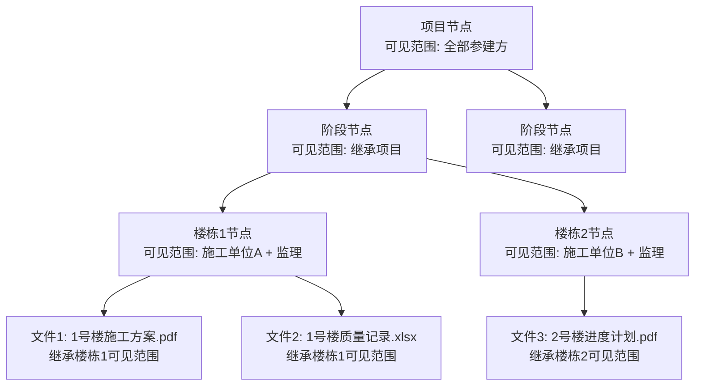
```mermaid
graph TB
    P[项目节点<br/>可见范围: 全部参建方]
    P --> S1[阶段节点<br/>可见范围: 继承项目]
    P --> S2[阶段节点<br/>可见范围: 继承项目]

    S1 --> B1[楼栋1节点<br/>可见范围: 施工单位A + 监理]
    S1 --> B2[楼栋2节点<br/>可见范围: 施工单位B + 监理]

    B1 --> F1[文件1: 1号楼施工方案.pdf<br/>继承楼栋1可见范围]
    B1 --> F2[文件2: 1号楼质量记录.xlsx<br/>继承楼栋1可见范围]
    B2 --> F3[文件3: 2号楼进度计划.pdf<br/>继承楼栋2可见范围]
```

> 图例：矩形=节点/文件实体，箭头=可见范围继承关系

**可见范围规则**：

| 规则       | 说明                    |
| -------- | --------------------- |
| **继承规则** | 子节点默认继承父节点的可见范围       |
| **收窄规则** | 子节点可见范围只能是父节点的子集，不能扩大 |
| **显式授权** | 可通过权限申请流程临时扩大可见范围     |
| **文件关联** | 上传到节点的文件自动继承该节点的可见范围  |

#### 3.2.4 任务依据与完工上报机制

**从节点到任务的分解**：

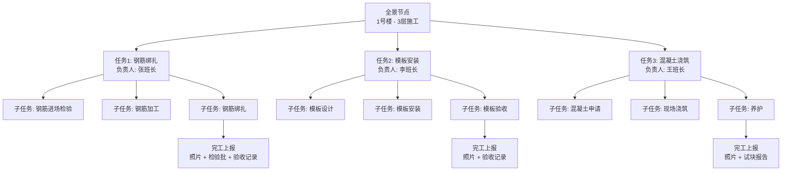
```mermaid
graph TD
    N[全景节点<br/>1号楼 - 3层施工]

    N --> T1[任务1: 钢筋绑扎<br/>负责人: 张班长]
    N --> T2[任务2: 模板安装<br/>负责人: 李班长]
    N --> T3[任务3: 混凝土浇筑<br/>负责人: 王班长]

    T1 --> S1[子任务: 钢筋进场检验]
    T1 --> S2[子任务: 钢筋加工]
    T1 --> S3[子任务: 钢筋绑扎]

    T2 --> S4[子任务: 模板设计]
    T2 --> S5[子任务: 模板安装]
    T2 --> S6[子任务: 模板验收]

    T3 --> S7[子任务: 混凝土申请]
    T3 --> S8[子任务: 现场浇筑]
    T3 --> S9[子任务: 养护]

    S3 --> R1[完工上报<br/>照片 + 检验批 + 验收记录]
    S6 --> R2[完工上报<br/>照片 + 验收记录]
    S9 --> R3[完工上报<br/>照片 + 试块报告]
```

> 图例：矩形=节点/任务实体，箭头=分解关系

**完工上报流程**：

1. **负责人发起**：任务负责人确认完成，提交完工上报
2. **附件要求**：必须上传现场照片、检验批、验收记录等佐证材料
3. **系统预检**：自动检查材料完整性，提示补充缺失项
4. **监理审核**：监理工程师现场核验，签署意见
5. **节点更新**：审核通过后，自动更新节点进度和状态

#### 3.2.5 节点生命周期

**四态节点状态机**：

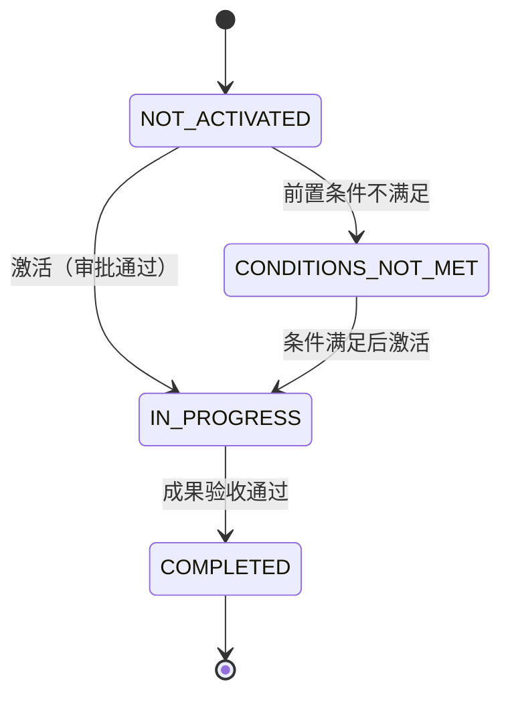
```mermaid
stateDiagram-v2
    [*] --> NOT_ACTIVATED

    NOT_ACTIVATED --> IN_PROGRESS: 激活（审批通过）
    NOT_ACTIVATED --> CONDITIONS_NOT_MET: 前置条件不满足

    CONDITIONS_NOT_MET --> IN_PROGRESS: 条件满足后激活

    IN_PROGRESS --> COMPLETED: 成果验收通过

    COMPLETED --> [*]
```

> 图例：实线箭头=状态转换，圆角矩形=状态，\[\*]=起始/终止

| 状态                   | 颜色    | 说明             |
| -------------------- | ----- | -------------- |
| `NOT_ACTIVATED`      | ⚪ 灰色  | 尚未激活，等待审批或前置条件 |
| `CONDITIONS_NOT_MET` | 🟡 黄色 | 前置条件不满足，无法开始   |
| `IN_PROGRESS`        | 🔵 蓝色 | 正常进行中          |
| `COMPLETED`          | 🟢 绿色 | 已完成，通过验收       |

***

### 3.3 SOP 流程引擎

#### 3.3.1 SOP 设计规范

系统采用七段式标准 SOP 结构，覆盖业务流程的完整生命周期：

1. **SOP 标识**：定义唯一编号、适用场景与触发关键词
2. **意图识别**：明确核心意图、前置条件与匹配置信度阈值
3. **工具与权限**：列出必需的工具集与所需权限级别
4. **执行步骤**：描述分步执行的业务逻辑
5. **输出规范**：定义输出格式与编号规则
6. **异常处理**：覆盖信息不全、权限不足、工具失败、超时等异常场景的应对策略
7. **后续动作**：流程完成后的关联操作，如自动创建关联任务、通知相关人员等

以"会议纪要记录"SOP 为例，其覆盖了从识别用户开会意图→询问会议基本信息→记录决议内容→提取待办事项→生成会议纪要→确认保存→自动创建关联任务的完整链路。

#### 3.3.2 SOP 注册与发现机制

SOP 注册表以结构化方式存储每个已注册 SOP 的元信息，包括：唯一标识、显示名称、业务分类、触发关键词列表、意图匹配示例、所需工具集、最低权限级别、启用状态、文件路径和加载时间。

**热重载机制**：

1. 系统启动时扫描 SOP 配置目录和技能配置目录
2. 解析所有规范文档，构建内存注册表
3. 支持通过 API 端点触发热重载，无需重启服务
4. 未主动触发热重载时，新增 SOP 需重启核心服务生效

#### 3.3.3 执行引擎原理

**SOP 匹配与执行流程**：

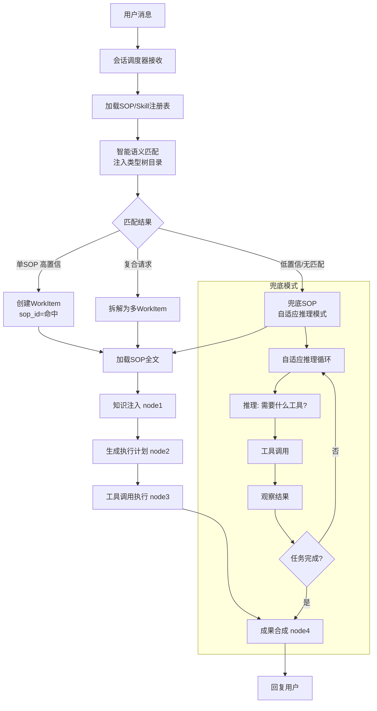
```mermaid
flowchart TD
    A[用户消息] --> B[会话调度器接收]
    B --> C[加载SOP/Skill注册表]
    C --> D[智能语义匹配<br/>注入类型树目录]

    D --> E{匹配结果}
    E -->|单SOP 高置信| F[创建WorkItem<br/>sop_id=命中]
    E -->|复合请求| G[拆解为多WorkItem]
    E -->|低置信/无匹配| H[兜底SOP<br/>自适应推理模式]

    F --> I[加载SOP全文]
    G --> I
    H --> I

    I --> J[知识注入 node1]
    J --> K[生成执行计划 node2]
    K --> L[工具调用执行 node3]
    L --> M[成果合成 node4]
    M --> N[回复用户]

    subgraph 兜底模式
        H --> O[自适应推理循环]
        O --> P[推理: 需要什么工具?]
        P --> Q[工具调用]
        Q --> R[观察结果]
        R --> S{任务完成?}
        S -->|否| O
        S -->|是| M
    end
```

> 图例：菱形=判断节点，圆角矩形=处理步骤，箭头=流程链路

#### 3.3.4 SOP 新增流程

**零代码新增 SOP 三步法**：

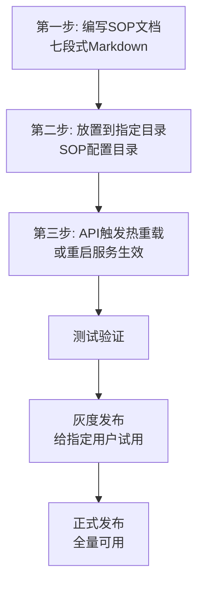
```mermaid
graph TD
    A[第一步: 编写SOP文档<br/>七段式Markdown]
    B[第二步: 放置到指定目录<br/>SOP配置目录]
    C[第三步: API触发热重载<br/>或重启服务生效]

    A --> B --> C

    D[测试验证]
    E[灰度发布<br/>给指定用户试用]
    F[正式发布<br/>全量可用]

    C --> D --> E --> F
```

> 图例：矩形=操作步骤，箭头=操作顺序

新增 SOP 的流程极为简洁：按七段式模板编写 Markdown 文档，放入配置目录，通过 API 触发热重载即可，无需修改任何代码。经验证后可灰度发布给指定用户试用，确认无误后全量开放。

#### 3.3.5 异常处理机制

**SOP 执行异常分类**：

| 异常类型     | 触发场景          | 处理策略                 |
| -------- | ------------- | -------------------- |
| **信息不足** | 用户提供的信息不完整    | 主动询问，引导补充            |
| **权限不足** | 用户权限低于 SOP 要求 | 提示原因，引导申请权限          |
| **工具失败** | 工具调用异常        | 重试 2 次 → 失败提示 → 记录日志 |
| **推理超时** | 智能推理服务响应超时    | 降级策略（简化处理）→ 提示用户     |
| **依赖缺失** | 前置条件不满足       | 说明原因，引导先完成前置         |
| **用户中断** | 用户明确取消        | 清理上下文，确认取消           |

**异常处理流程**：

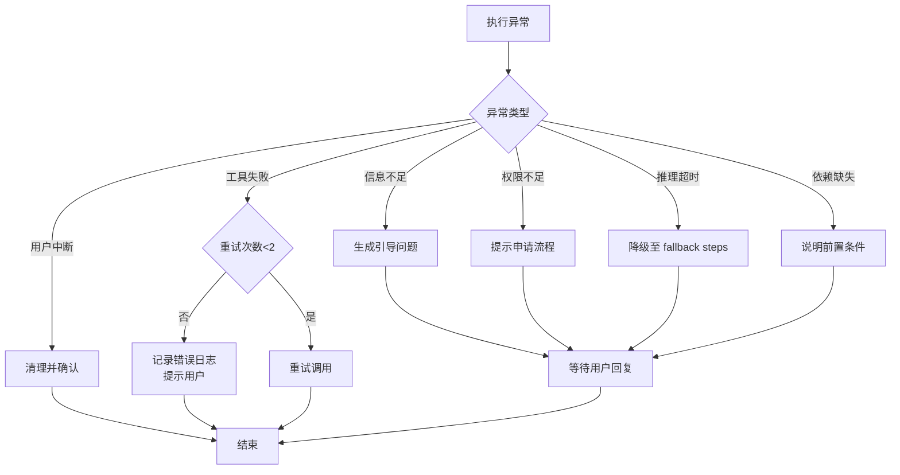
```mermaid
flowchart TD
    A[执行异常] --> B{异常类型}

    B -->|信息不足| C[生成引导问题]
    B -->|权限不足| D[提示申请流程]
    B -->|工具失败| E{重试次数<2}
    B -->|推理超时| F[降级至 fallback steps]
    B -->|依赖缺失| G[说明前置条件]
    B -->|用户中断| H[清理并确认]

    E -->|是| I[重试调用]
    E -->|否| J[记录错误日志<br/>提示用户]

    C --> K[等待用户回复]
    D --> K
    F --> K
    G --> K
    H --> L[结束]
    J --> L
    I --> L
    K --> L
```

> 图例：菱形=判断节点，圆角矩形=处理步骤，箭头=流程链路

***

### 3.4 业务流程自动优化模块

#### 3.4.1 三书体系架构

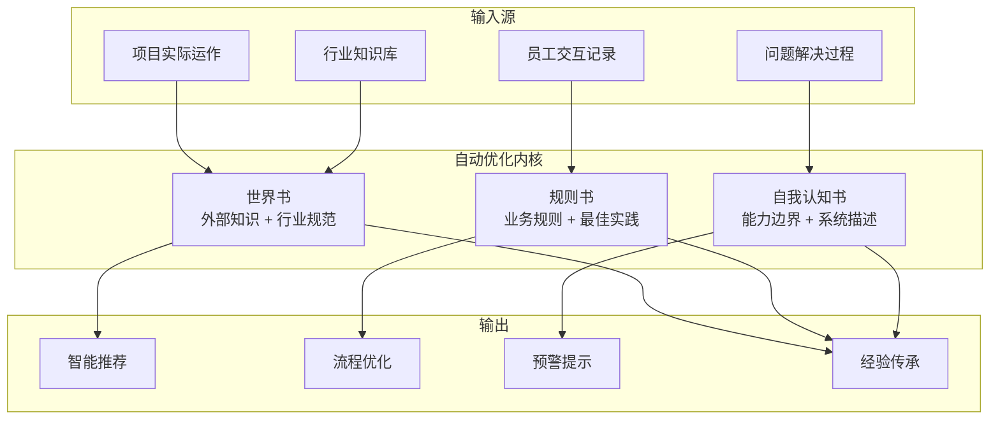
```mermaid
graph TB
    subgraph 自动优化内核
        WB[世界书<br/>外部知识 + 行业规范]
        RB[规则书<br/>业务规则 + 最佳实践]
        SA[自我认知书<br/>能力边界 + 系统描述]
    end

    subgraph 输入源
        A[项目实际运作]
        B[员工交互记录]
        C[问题解决过程]
        D[行业知识库]
    end

    subgraph 输出
        E[智能推荐]
        F[流程优化]
        G[预警提示]
        H[经验传承]
    end

    A --> WB
    B --> RB
    C --> SA
    D --> WB

    WB --> E
    RB --> F
    SA --> G
    WB & RB & SA --> H
```

> 图例：矩形=功能模块/数据源/输出，箭头=数据/影响流向

#### 3.4.2 世界书（World Book）

**世界书内容结构**：

| 分类       | 内容              | 来源     | 更新频率 |
| -------- | --------------- | ------ | ---- |
| **行业规范** | 国家规范、行业标准、地方规定  | 人工导入   | 月度   |
| **项目资料** | 地勘报告、设计图纸、施工方案  | 文件上传解析 | 实时   |
| **历史经验** | 历史项目的问题、解决方案、教训 | 自动提炼   | 每日   |
| **组织知识** | 公司管理制度、流程规范     | 人工录入   | 按需   |

**世界书构建流程**：

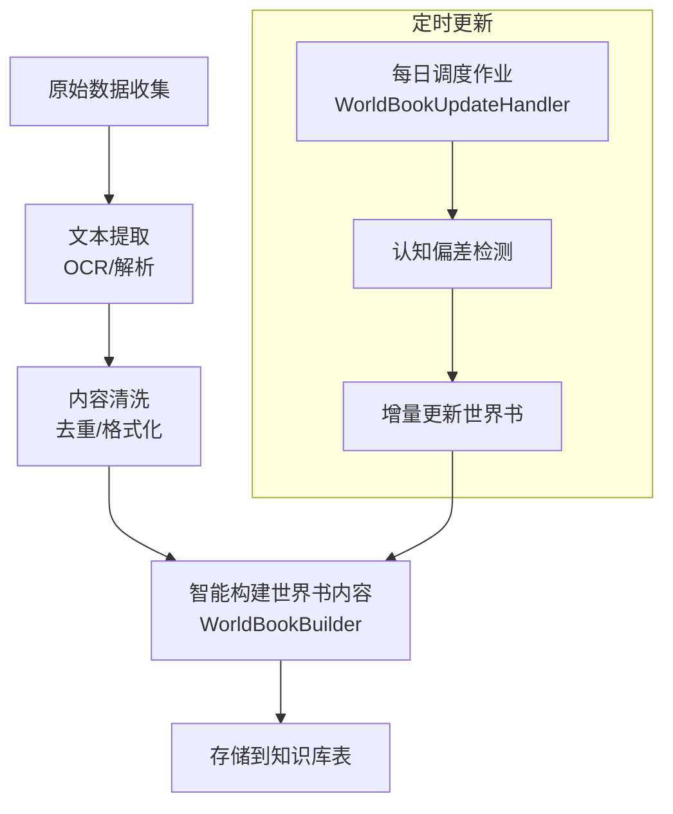
```mermaid
graph TD
    A[原始数据收集] --> B[文本提取<br/>OCR/解析]
    B --> C[内容清洗<br/>去重/格式化]
    C --> D[智能构建世界书内容<br/>WorldBookBuilder]
    D --> E[存储到知识库表]

    subgraph 定时更新
        I[每日调度作业<br/>WorldBookUpdateHandler]
        J[认知偏差检测]
        K[增量更新世界书]
    end

    I --> J --> K --> D
```

> 图例：圆角矩形=处理步骤，矩形=子流程阶段，箭头=数据流向

**世界书检索策略**：

- **语义检索**：通过向量检索服务进行语义匹配（默认主路径）
- **关键词回退**：本地关键词搜索（向量检索不可用时自动兜底）
- **范围过滤**：按项目阶段、岗位角色缩小检索范围

#### 3.4.3 规则书（Rule Book）

规则书加载器读取 YAML 格式规则文件，将规则注入会话上下文供智能推理参考。规则不作为独立引擎执行，而是以上下文提示的方式引导系统行为。规则覆盖业务经验、操作禁忌、优化建议等，由系统定期自动归纳生成，亦可人工编辑。

#### 3.4.4 自我认知书（Self-Awareness Book）

**自我认知维度**：

| 维度       | 内容                                  |
| -------- | ----------------------------------- |
| **能力边界** | 系统自我描述，启动时自动构建，包含数据库结构、SOP 目录、工具列表等 |
| **历史表现** | 各 SOP 命中率、兜底率、健康度评分                 |
| **错误模式** | 常见错误类型与发生频率追踪                       |

系统启动时自动构建自我认知描述，包含数据库结构、SOP 目录、工具列表等核心元信息，供推理引擎理解系统能力边界。

#### 3.4.5 三者协同优化机制

**自动优化闭环**：

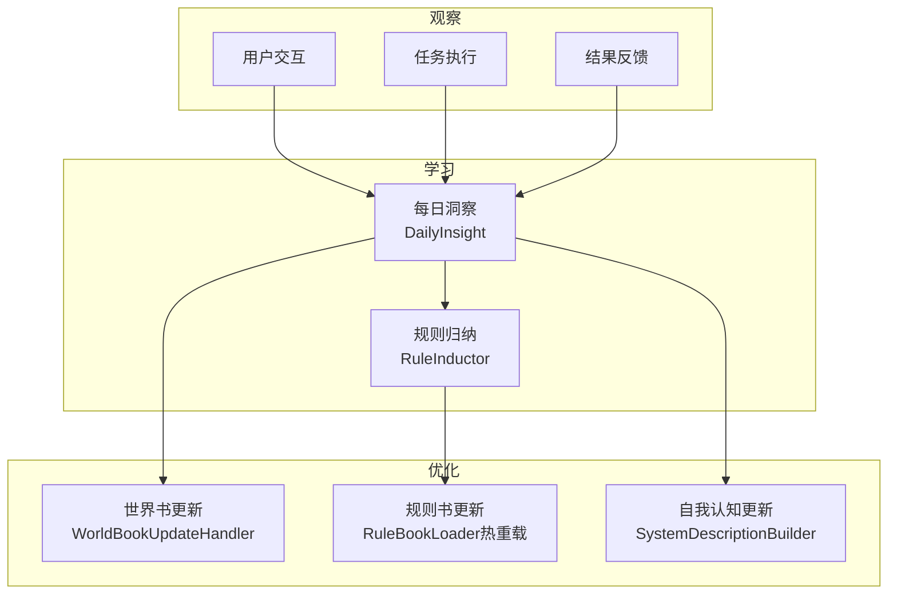
```mermaid
graph TD
    subgraph 观察
        A[用户交互]
        B[任务执行]
        C[结果反馈]
    end

    subgraph 学习
        D[每日洞察<br/>DailyInsight]
        E[规则归纳<br/>RuleInductor]
    end

    subgraph 优化
        G[世界书更新<br/>WorldBookUpdateHandler]
        H[规则书更新<br/>RuleBookLoader热重载]
        I[自我认知更新<br/>SystemDescriptionBuilder]
    end

    A & B & C --> D
    D --> E
    D --> G
    E --> H
    D --> I
```

> 图例：矩形=功能模块，箭头=数据/控制流

**优化触发条件**：

| 触发类型     | 触发条件     | 优化内容         |
| -------- | -------- | ------------ |
| **定时优化** | 调度作业（每日） | 世界书偏差检测 + 更新 |
| **规则归纳** | 每周（可配置）  | 智能归纳优化规则     |
| **人工触发** | 管理员手动执行  | 全量重建世界书      |

***

### 3.5 三维权限控制系统

#### 3.5.1 权限模型原理

**三维权限模型**：

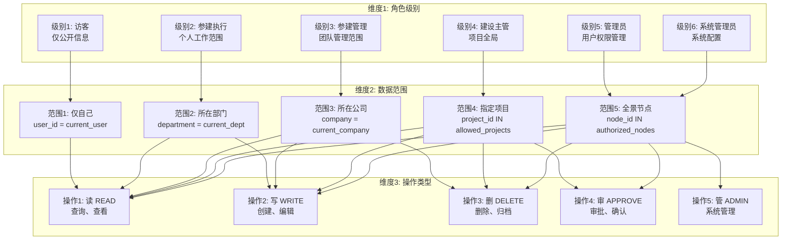
```mermaid
graph TB
    subgraph 维度1: 角色级别
        L1[级别1: 访客<br/>仅公开信息]
        L2[级别2: 参建执行<br/>个人工作范围]
        L3[级别3: 参建管理<br/>团队管理范围]
        L4[级别4: 建设主管<br/>项目全局]
        L5[级别5: 管理员<br/>用户权限管理]
        L6[级别6: 系统管理员<br/>系统配置]
    end

    subgraph 维度2: 数据范围
        P1[范围1: 仅自己<br/>user_id = current_user]
        P2[范围2: 所在部门<br/>department = current_dept]
        P3[范围3: 所在公司<br/>company = current_company]
        P4[范围4: 指定项目<br/>project_id IN allowed_projects]
        P5[范围5: 全景节点<br/>node_id IN authorized_nodes]
    end

    subgraph 维度3: 操作类型
        O1[操作1: 读 READ<br/>查询、查看]
        O2[操作2: 写 WRITE<br/>创建、编辑]
        O3[操作3: 删 DELETE<br/>删除、归档]
        O4[操作4: 审 APPROVE<br/>审批、确认]
        O5[操作5: 管 ADMIN<br/>系统管理]
    end

    L1 --> P1 --> O1
    L2 --> P2 --> O1 & O2
    L3 --> P3 --> O1 & O2 & O3
    L4 --> P4 --> O1 & O2 & O3 & O4
    L5 & L6 --> P5 --> O1 & O2 & O3 & O4 & O5
```

> 图例：矩形=维度/选项实体，箭头=组合关系

**权限编码规则**：

```
权限码 = 资源类型-密级-项目ID-节点ID-资源ID（短横线分隔）

示例：
- DOC-PUBLIC-project-123-*-*   → 项目123下所有公开文档的读权限
- DB-INTERNAL-*-node-456-*     → 节点456下内部数据的写权限
- SOP-INTERNAL-*-*-*           → 所有内部SOP的访问权限
```

#### 3.5.2 范围控制（全景节点 + 企业属性）

**基于全景节点的范围控制**：

```mermaid
graph TB
    U[用户A<br/>施工单位A<br/>负责楼栋1]

    P[项目全景节点树]

    P --> S1[前期准备]
    P --> S2[主体施工]
    P --> S3[装饰装修]

    S2 --> B1[楼栋1<br/>✅ 可见可操作]
    S2 --> B2[楼栋2<br/>❌ 不可见]
    S2 --> B3[楼栋3<br/>❌ 不可见]

    B1 --> F1[1号楼文件<br/>✅ 可见]
    B2 --> F2[2号楼文件<br/>❌ 不可见]

    U --> B1 --> F1
```

> 图例：矩形=节点/文件/用户实体，实线箭头=树结构，虚线箭头=归属关系

**范围控制规则**：

| 规则         | 说明                     | 示例                 |
| ---------- | ---------------------- | ------------------ |
| **节点可见继承** | 子节点自动继承父节点的可见范围        | 楼栋1可见 → 楼栋1下所有文件可见 |
| **企业类型过滤** | 按参建单位类型限制可见范围          | 施工单位看不到设计单位内部文件    |
| **项目隔离**   | 不同项目数据完全隔离             | 项目A的人默认看不到项目B      |
| **黑白名单**   | SOP↔权限组绑定支持 allow/deny | 特邀专家可查看指定范围        |

#### 3.5.3 企业管理员权限体系

**权限组设计**：

```mermaid
graph TD
    Root[系统权限组]

    Root --> G1[建设单位组<br/>默认级别4]
    Root --> G2[施工单位组<br/>默认级别2]
    Root --> G3[监理单位组<br/>默认级别3]
    Root --> G4[设计单位组<br/>默认级别2]
    Root --> G5[供应商组<br/>默认级别2]

    G1 --> G1_1[建设-工程部]
    G1 --> G1_2[建设-成本部]
    G1 --> G1_3[建设-采购部]

    G2 --> G2_1[施工-项目经理]
    G2 --> G2_2[施工-技术负责人]
    G2 --> G2_3[施工-施工员]
```

> 图例：矩形=权限组实体，箭头=层级继承关系

**权限组属性**：

| 属性                  | 说明             |
| ------------------- | -------------- |
| `name`              | 权限组名称          |
| `code`              | 权限组编码（唯一）      |
| `description`       | 权限组描述          |
| `company_type`      | 适用企业类型         |
| `department`        | 适用部门           |
| `org_level`         | 组织层级（企业/部门/小组） |
| `parent_group_id`   | 父权限组，支持继承      |
| `allowed_sop_types` | 允许使用的 SOP 类型   |
| `is_system`         | 是否系统内置组（不可删除）  |

#### 3.5.4 权限校验流程

**运行时权限校验**：

```mermaid
flowchart TD
    A[用户请求操作] --> B[构建权限快照<br/>PermissionService.build_permission_dict]
    B --> C{级别校验<br/>用户level ≥ 操作要求?}
    C -->|否| D[返回权限不足]

    C -->|是| E{SOP白名单校验<br/>SOP在用户sop_allow中?}
    E -->|否| D

    E -->|是| F{范围校验<br/>资源在用户可见范围内?}
    F -->|否| D

    F -->|是| G{特殊约束检查<br/>企业类型/部门/授权码}
    G -->|不通过| D

    G -->|通过| H[记录权限审计日志]
    H --> I[允许操作]
```

> 图例：菱形=判断节点，圆角矩形=处理步骤，箭头=流程链路

**Hook 集成鉴权**：

权限校验通过 Pipeline Hook 机制实现，采用声明式配置挂载在流水线的"计划+标准"和"执行+验收"节点的前置阶段（`before:wi_node2` 和 `before:wi_node3`）。鉴权 Hook 通过 JSON 配置文件声明挂载点和 Hook 类型，运行时由 Hook 执行器自动加载调用。当鉴权 Hook 检测到用户权限级别低于所需级别时，返回阻断决策并附带权限不足的具体原因说明；权限通过则返回允许决策，流水线继续执行。

#### 3.5.5 权限申请与授权

**权限申请流程**：

```mermaid
graph TD
    A[用户发起权限申请] --> B[填写申请信息<br/>原因/范围/时长]
    B --> C[系统自动校验<br/>是否符合申请条件]

    C -->|不通过| D[提示原因，拒绝申请]
    C -->|通过| E[通知审批人]

    E --> F[审批人审核]
    F -->|拒绝| G[通知申请人]
    F -->|同意| H[创建临时授权]

    H --> I[设置授权有效期]
    I --> J[记录授权审计日志]
    J --> K[通知申请人权限已开通]

    L[定时任务<br/>扫描过期授权] --> M[自动回收权限]
    M --> N[通知用户权限已过期]
```

> 图例：菱形=判断节点，圆角矩形=处理步骤，箭头=流程链路

**授权类型**：

| 类型          | 有效期  | 适用场景            |
| ----------- | ---- | --------------- |
| `PERMANENT` | 永久   | 正式岗位权限          |
| `TEMP`      | 指定时长 | 临时协助、跨项目支援      |
| `AUTO`      | 自动计算 | 基于任务周期，任务完成自动回收 |

***

## 4. 基座工具与基础设施

### 4.1 项目知识库语义检索

#### 4.1.1 检索方案

系统对接向量检索服务提供项目知识库的语义检索能力。知识库按项目划分以隔离数据范围，Embedding 采用 1024 维向量，索引方式为基于余弦相似度的 HNSW。系统通过 API 调用检索服务的语义匹配接口获取相关知识片段，作为智能推理的上下文补充。

当检索服务不可用时，系统自动切换至本地关键词搜索兜底模式，扫描知识库文件进行关键词匹配和元数据过滤，确保检索功能不中断。

#### 4.1.2 检索策略

**两层检索架构**：

```mermaid
graph TD
    A[用户查询] --> B{检索服务可用?}

    B -->|是| C[语义检索API<br/>向量相似度匹配]
    C --> D[返回文档段落 + 相似度分数]
    D --> E[格式化为推理上下文]

    B -->|否| F[本地关键词回退<br/>扫描知识库文件]
    F --> G[元数据过滤]
    G --> E
```

> 图例：菱形=判断节点，圆角矩形=处理步骤，箭头=数据流向

**当前检索能力**：

- **语义检索**：通过向量相似度匹配（主路径）
- **关键词回退**：本地关键词搜索（检索服务不可用时）
- **范围过滤**：按项目阶段、岗位角色过滤

### 4.2 PostgreSQL 数据库设计

系统采用 PostgreSQL 作为主数据库，包含多张业务表，核心表按领域分组如下：

**人员与 IM 绑定**：

| 表名                 | 说明                     |
| ------------------ | ---------------------- |
| `users`            | 系统用户主表，含权限级别、所属企业与岗位归属 |
| `user_im_bindings` | 用户与各 IM 平台账号的映射绑定关系    |

**通讯与会话**：

| 表名                    | 说明                  |
| --------------------- | ------------------- |
| `conversations`       | 群聊与私聊会话主记录          |
| `messages`            | 入站与出站消息全量归档存储       |
| `message_attachments` | 消息与上传附件的多对多关联关系     |
| `session_archives`    | 会话注销时上下文与消息历史的持久化快照 |

**项目与业务记录**：

| 表名             | 说明                    |
| -------------- | --------------------- |
| `projects`     | 地产项目主表，关联参建公司与全景节点体系  |
| `events`       | 项目事件记录，支持分类、状态流转与关联追溯 |
| `tasks`        | 任务创建、分配、追踪与完工验收       |
| `meetings`     | 会议纪要、参会人、待办事项与决议跟踪    |
| `files`        | 文件归档存储，含版本链与权限密级控制    |
| `company_info` | 参建单位基本信息与类型归属         |

**全景节点**：

| 表名                      | 说明                    |
| ----------------------- | --------------------- |
| `project_nodes`         | 项目层级节点树，含状态流转、进度与审批信息 |
| `node_dependencies`     | 节点间前置依赖与约束关系定义        |
| `node_deliverables`     | 节点预期产出成果的提交与验收记录      |
| `node_accessible_files` | 节点与关联文件的可见范围映射关系      |
| `node_events`           | 节点生命周期内的事件变更日志        |

**权限系统**：

| 表名                     | 说明                   |
| ---------------------- | -------------------- |
| `permission_def`       | 权限码的规则定义，含资源类型、密级与范围 |
| `permission_groups`    | 权限组模板，支持层级继承与企业类型绑定  |
| `permission_grants`    | 用户权限授予记录，含有效期与自动回收   |
| `permission_requests`  | 权限申请工单与多级审批流程记录      |
| `permission_audit_log` | 权限变更与鉴权操作的审计追踪日志     |

**业务流程自动优化**：

| 表名                         | 说明                   |
| -------------------------- | -------------------- |
| `project_world_books`      | 项目级外部知识与行业规范的向量化存储   |
| `system_descriptions`      | 系统能力边界的自描述快照，启动时自动构建 |
| `evolution_daily_insights` | SOP命中率、兜底率等每日健康度评估   |
| `evolution_rules`          | 从执行经验中自动归纳的优化规则      |

此外，系统还包含 SOP 业务流定义、调度作业定义与执行记录、工具注册表、推理日志、管线执行日志等辅助表，用于支持业务流程注册、定时任务调度、工具管理、运行追踪与审计等能力。详细的表结构关系见第 6 章数据库设计。

### 4.3 其他中间件

#### 4.3.1 缓存策略（内存缓存）

当前系统采用 Python 内存对象作为缓存层，不依赖外部缓存中间件：

| 缓存项       | 存储方式           | 说明                 |
| --------- | -------------- | ------------------ |
| 会话上下文     | 会话调度器内存对象      | 随会话池管理，TTL 30 分钟   |
| 权限快照      | 权限服务内存缓存       | 构建后注入会话上下文，版本号控制失效 |
| SOP 注册表   | SOP 注册表内存      | 启动时加载，API 触发热重载    |
| 消息去重哈希    | Python set（内存） | 插件进程内维护最近 10 分钟哈希  |
| Prompt 模板 | 模板加载器内存缓存      | 文件变更后自动失效重读        |

#### 4.3.2 消息队列（AsyncIO Queue）

**当前实现**：采用 Python `asyncio.Queue` 作为进程内消息队列：

| 队列                | 用途             | 消费者       |
| ----------------- | -------------- | --------- |
| `outbound_events` | 出站事件（回复消息、通知等） | SSE 事件监听器 |

***

## 5. 总调度引擎

### 5.1 session 定时清理策略

**会话生命周期管理**：

```mermaid
graph TD
    A[定时任务<br/>每分钟执行] --> B[扫描所有活跃会话]
    B --> C[计算最后活动距今时间]

    C --> D{> 30分钟 无活动?}
    D -->|否| E[保持活跃]

    D -->|是| F[标记为待归档]
    F --> G[持久化会话上下文]
    G --> H[释放内存资源]
    H --> I[从会话池中移除]
    I --> J[记录会话归档日志]

    K[用户再次发送消息] --> L{会话已归档?}
    L -->|是| M[从归档恢复]
    L -->|否| N[复用现有会话]
```

> 图例：菱形=判断节点，圆角矩形=处理步骤，箭头=流程链路

**清理规则**：

| 条件            | 动作           |
| ------------- | ------------ |
| 30 分钟无活动      | 自动归档，释放内存    |
| 24 小时无活动      | 彻底清理，不可恢复    |
| 有未完成 WorkItem | 延迟清理，等待任务完成  |
| 有待用户确认        | 保持活跃（最长 7 天） |

### 5.2 定期复盘机制

**每日复盘流程**：

```mermaid
graph TD
    A[每日调度作业触发] --> B[收集近期数据]

    subgraph 数据收集
        B --> B1[消息日志]
        B --> B2[SOP 执行记录]
        B --> B3[工具调用结果]
    end

    B --> C[指标计算]

    subgraph 指标分析
        C --> C1[SOP 命中率]
        C --> C2[兜底率]
        C --> C3[健康度评分]
    end

    C --> D[生成每日洞察报告]
    D --> E[规则归纳<br/>（每周/可配置）]
```

> 图例：圆角矩形=处理步骤，矩形=子流程，箭头=数据流向

### 5.3 系统冷启动/热启动流程

**冷启动流程（系统重启）**：

```mermaid
graph TD
    A[系统启动] --> B[读取环境变量校验]
    B --> C{校验通过?}
    C -->|否| D[启动失败<br/>输出错误日志]
    C -->|是| E[PostgreSQL 连接测试]
    
    E --> F{连接成功?}
    F -->|否| G[重试 3 次<br/>间隔 5 秒]
    G -->|全部失败| D
    
    F -->|是| H[数据库表检查<br/>自动建表/补列]
    H --> I[构建权限快照缓存]
    I --> J[加载 SOP/Skill 目录索引]
    J --> K[构建知识注入器]
    K --> L[启动调度引擎]
    L --> M[启动 HTTP 服务]
    M --> N[启动 SSE 事件总线]
    N --> O[系统就绪<br/>输出启动成功日志]
```

> 图例：菱形=判断节点，圆角矩形=处理步骤，箭头=流程链路

**启动自检清单**：

| 检查项           | 失败处理        | 重试机制       |
| ------------- | ----------- | ---------- |
| 环境变量完整性       | 立即终止，错误码 1  | 否          |
| PostgreSQL 连接 | 记录错误日志      | 3 次，间隔 5 秒 |
| 检索服务连接        | 降级到本地关键词搜索  | 启动后后台重试    |
| SOP 目录加载      | 使用默认 SOP 继续 | 启动后热加载     |
| 权限缓存预热        | 延迟初始化       | 首次鉴权时动态加载  |

***

## 6. 数据库设计

### 6.1 ER 图

```mermaid
%%{ init: { 'theme': 'neutral', 'er': { 'layoutDirection': 'TB' } } }%%
erDiagram
    %% ===== 第一层：核心实体 =====
    USERS {
        uuid id PK
        string username
        int level
    }

    PROJECTS {
        uuid id PK
        string name
    }

    CONVERSATIONS {
        uuid id PK
        string platform
    }

    %% ===== 第二层：身份与IM =====
    USER_IM_BINDINGS {
        uuid id PK
        uuid user_id FK
    }

    COMPANY_INFO {
        uuid id PK
        string name
    }

    %% ===== 第三层：消息归档 =====
    MESSAGES {
        uuid id PK
        uuid conversation_id FK
    }

    MESSAGE_ATTACHMENTS {
        uuid id PK
        uuid message_id FK
        uuid file_id FK
    }

    SESSION_ARCHIVES {
        uuid id PK
        uuid conversation_id FK
    }

    %% ===== 第四层：业务记录 =====
    EVENTS {
        uuid id PK
        uuid project_id FK
    }

    TASKS {
        uuid id PK
        uuid project_id FK
        uuid owner_id FK
    }

    MEETINGS {
        uuid id PK
        uuid project_id FK
    }

    FILES {
        uuid id PK
        uuid project_id FK
    }

    %% ===== 第五层：全景节点 =====
    PROJECT_NODES {
        uuid id PK
        uuid project_id FK
        uuid parent_node_id FK
    }

    NODE_DEPENDENCIES {
        uuid id PK
        uuid node_id FK
    }

    NODE_DELIVERABLES {
        uuid id PK
        uuid node_id FK
    }

    NODE_ACCESSIBLE_FILES {
        uuid id PK
        uuid node_id FK
    }

    %% ===== 第六层：权限系统 =====
    PERMISSION_DEF {
        uuid id PK
        string perm_code
    }

    PERMISSION_GROUPS {
        uuid id PK
        string name
    }

    PERMISSION_GRANTS {
        uuid id PK
        uuid grantee_id FK
    }

    PERMISSION_REQUESTS {
        uuid id PK
        uuid requester_id FK
    }

    %% ===== 第七层：SOP与调度 =====
    SOP_BUSINESS_FLOWS {
        uuid id PK
    }

    SOP_PERMISSION_BINDINGS {
        uuid id PK
        uuid group_id FK
    }

    EVOLUTION_DAILY_INSIGHTS {
        uuid id PK
    }

    EVOLUTION_RULES {
        uuid id PK
        uuid insight_id FK
    }

    SCHEDULER_JOBS {
        uuid id PK
    }

    SCHEDULER_EXECUTIONS {
        uuid id PK
        uuid job_id FK
    }

    %% ===== 关系定义（竖向自上而下） =====
    USERS ||--o{ USER_IM_BINDINGS : ""
    USERS ||--o{ MESSAGES : ""
    USERS ||--o{ EVENTS : ""
    USERS ||--o{ TASKS : ""
    USERS ||--o{ PERMISSION_GRANTS : ""
    USERS ||--o{ PERMISSION_REQUESTS : ""

    PROJECTS ||--o{ EVENTS : ""
    PROJECTS ||--o{ TASKS : ""
    PROJECTS ||--o{ FILES : ""
    PROJECTS ||--o{ PROJECT_NODES : ""

    CONVERSATIONS ||--o{ MESSAGES : ""
    CONVERSATIONS ||--o{ SESSION_ARCHIVES : ""

    MESSAGES ||--o{ MESSAGE_ATTACHMENTS : ""
    FILES ||--o{ MESSAGE_ATTACHMENTS : ""

    PROJECT_NODES ||--o{ NODE_DEPENDENCIES : ""
    PROJECT_NODES ||--o{ NODE_DELIVERABLES : ""

    PERMISSION_GROUPS ||--o{ PERMISSION_GRANTS : ""
    PERMISSION_GROUPS ||--o{ SOP_PERMISSION_BINDINGS : ""

    SCHEDULER_JOBS ||--o{ SCHEDULER_EXECUTIONS : ""
```

> 图例：矩形=数据表实体，连线=外键关联关系

**核心主外键关系**：

| 主键表.字段 (PK)                           | 外键表.字段 (FK)                          | 关系说明            |
| ------------------------------------- | ------------------------------------ | --------------- |
| `users`.`id`                          | `user_im_bindings`.`user_id`         | 用户与IM绑定的一对多关系   |
| `users`.`id`                          | `messages`.`sender_user_id`          | 用户发送消息的一对多关系    |
| `users`.`id`                          | `tasks`.`owner_id`                   | 用户作为任务负责人的一对多关系 |
| `users`.`id`                          | `permission_grants`.`grantee_id`     | 用户被授权的一对多关系     |
| `users`.`id`                          | `permission_requests`.`requester_id` | 用户申请权限的一对多关系    |
| `conversations`.`id`                  | `messages`.`conversation_id`         | 会话与消息的一对多关系     |
| `projects`.`id`                       | `project_nodes`.`project_id`         | 项目与节点的一对多关系     |
| `projects`.`id`                       | `events`.`project_id`                | 项目与事件的一对多关系     |
| `projects`.`id`                       | `tasks`.`project_id`                 | 项目与任务的一对多关系     |
| `projects`.`id`                       | `meetings`.`project_id`              | 项目与会议的一对多关系     |
| `project_nodes`.`id`                  | `node_dependencies`.`node_id`        | 节点与依赖的一对多关系     |
| `project_nodes`.`id`                  | `node_deliverables`.`node_id`        | 节点与交付物的一对多关系    |
| `project_nodes`.`id`                  | `node_accessible_files`.`node_id`    | 节点与可见文件的一对多关系   |
| `project_nodes`.`parent_node_id`      | `project_nodes`.`id`                 | 节点的自引用树状结构      |
| `files`.`id`                          | `message_attachments`.`file_id`      | 文件与消息附件的多对多关联   |
| `messages`.`id`                       | `message_attachments`.`message_id`   | 消息与附件的多对多关联     |
| `permission_groups`.`parent_group_id` | `permission_groups`.`id`             | 权限组的自引用层级继承     |
| `scheduler_jobs`.`id`                 | `scheduler_executions`.`job_id`      | 调度作业与执行记录的一对多关系 |

### 6.2 核心表结构

#### 用户与身份表

| 表名                 | 说明        | 关键字段                                                                                                                                                     |
| ------------------ | --------- | -------------------------------------------------------------------------------------------------------------------------------------------------------- |
| `users`            | 系统用户表     | `id`, `username`, `email`, `level`, `company`(FK→company\_info.id), `project_id`(FK→projects.id), `perm_list`, `org_category`, `supervisor_id`, `status` |
| `user_im_bindings` | IM 平台账号绑定 | `id`, `user_id`(FK→users.id), `im_platform`, `im_user_id`, `im_display_name`, `status`                                                                   |

**权限层级说明**：

| 级别 | 名称    | 说明           |
| -- | ----- | ------------ |
| 1  | 访客    | 只读访问，可查看公开信息 |
| 2  | 参建执行  | 可创建和编辑自己的内容  |
| 3  | 参建管理  | 团队级读写权限      |
| 4  | 建设主管  | 项目全局读写权限     |
| 5  | 管理员   | 企业级管理权限      |
| 6  | 系统管理员 | 完整系统权限       |

#### 消息与会话表

| 表名                    | 说明         | 关键字段                                                                                                                                                                      |
| --------------------- | ---------- | ------------------------------------------------------------------------------------------------------------------------------------------------------------------------- |
| `conversations`       | 会话表（群聊/私聊） | `id`, `im_platform`, `conversation_type`, `conversation_id`, `title`, `project_id`, `takeover_mode`                                                                       |
| `messages`            | 消息表        | `id`, `event_id`(UNIQUE), `conversation_id`(FK→conversations.id), `sender_user_id`, `sender_im_id`, `content`, `direction`, `msg_type`, `is_at_bot`, `takeover`, `intent` |
| `message_attachments` | 消息附件       | `id`, `message_id`(FK→messages.id), `file_id`(FK→files.id), `attachment_type`, `file_url`, `local_path`, `file_size`                                                      |
| `session_archives`    | 会话归档       | `id`, `conversation_id`, `user_id`, `turn_count`, `message_history_snapshot`, `context_snapshot`, `archived_at`, `archive_reason`                                         |

> **注意**：`messages.conversation_id` 是 FK→`conversations.id`（UUID），非业务 conversation\_id 字符串。写入前需进行 ID 解析转换。

#### 业务数据表

| 表名         | 说明   | 关键字段                                                                                                                                                                             |
| ---------- | ---- | -------------------------------------------------------------------------------------------------------------------------------------------------------------------------------- |
| `events`   | 事件记录 | `id`, `event_no`(UNIQUE), `project_id`, `user_id`, `title`, `event_type`, `category`, `status`, `related_event_ids`                                                              |
| `tasks`    | 任务记录 | `id`, `task_no`(UNIQUE), `project_id`, `title`, `owner_id`, `owner_text`, `status`, `due_date`, `due_text`                                                                       |
| `meetings` | 会议记录 | `id`, `meeting_no`(UNIQUE), `project_id`, `title`, `summary`, `attendees`, `meeting_type`, `meeting_date`, `location`, `conclusion`, `action_items`                              |
| `files`    | 文件归档 | `id`, `file_no`(UNIQUE), `project_id`, `filename`, `file_type`, `storage_path`, `file_size`, `version`, `is_latest`, `parent_file_id`, `confidentiality`, `source_attachment_id` |

#### 全景节点表

| 表名                      | 说明     | 关键字段                                                                                                                                    |
| ----------------------- | ------ | --------------------------------------------------------------------------------------------------------------------------------------- |
| `project_nodes`         | 项目节点   | `id`, `project_id`, `parent_node_id`, `node_no`, `title`, `description`, `status`, `weight`, `progress`, `level`, `path`, `approver_id` |
| `node_dependencies`     | 节点依赖   | `id`, `node_id`, `depends_on_node_id`, `dependency_type`                                                                                |
| `node_deliverables`     | 节点交付物  | `id`, `node_id`, `title`, `description`, `status`, `submitted_by`, `submitted_at`                                                       |
| `node_accessible_files` | 节点可见文件 | `id`, `node_id`, `file_id`, `visible_scope`                                                                                             |
| `node_events`           | 节点事件日志 | `id`, `node_id`, `event_type`, `event_data`, `created_by`                                                                               |

**节点状态枚举**：`NOT_ACTIVATED`, `CONDITIONS_NOT_MET`, `IN_PROGRESS`, `COMPLETED`

#### 权限系统表

| 表名                     | 说明     | 关键字段                                                                                                                                        |
| ---------------------- | ------ | ------------------------------------------------------------------------------------------------------------------------------------------- |
| `permission_def`       | 权限码定义  | `id`, `perm_code`(UNIQUE), `resource_type`, `security_level`, `project_id`, `node_id`, `resource_id`, `description`                         |
| `permission_groups`    | 权限组    | `id`, `name`, `code`(UNIQUE), `description`, `company_type`, `department`, `org_level`, `parent_group_id`, `allowed_sop_types`, `is_system` |
| `permission_grants`    | 授权记录   | `id`, `grant_no`(UNIQUE), `grantee_id`(FK→users.id), `grantor_id`, `perm_code`, `grant_type`, `operations`, `expire_time`, `status`         |
| `permission_audit_log` | 权限审计日志 | `log_id`(BIGSERIAL), `event_time`, `grantor_id`, `grantee_id`, `perm_code`, `operation_type`, `client_ip`, `remark`                         |
| `permission_requests`  | 权限申请审批 | `id`, `request_no`(UNIQUE), `requester_id`, `perm_code`, `request_type`, `status`, `current_approver_id`, `approval_level`                  |

#### 业务流程自动优化表

| 表名                         | 说明    | 关键字段                                                                                                                 |
| -------------------------- | ----- | -------------------------------------------------------------------------------------------------------------------- |
| `project_world_books`      | 项目世界书 | `id`, `project_id`, `content_text`, `content_json`, `initialization_tier`, `token_count`, `status`, `version`        |
| `system_descriptions`      | 自我认知书 | `id`, `version`, `status`, `content_hash`                                                                            |
| `evolution_daily_insights` | 每日洞察  | `id`, `insight_date`, `project_id`, `insight_text`, `sop_hit_rate`, `fallback_rate`, `health_score`, `anomaly_flags` |
| `evolution_rules`          | 归纳规则  | `id`, `rule_no`(UNIQUE), `title`, `description`, `category`, `confidence`, `status`, `suggested_action`              |

#### 调度引擎表

| 表名                     | 说明     | 关键字段                                                                                                                                           |
| ---------------------- | ------ | ---------------------------------------------------------------------------------------------------------------------------------------------- |
| `scheduler_jobs`       | 调度作业定义 | `id`, `job_no`(UNIQUE), `name`, `job_type`, `cron_expression`, `action_type`, `handler_module`, `action_params`, `status`, `next_execution_at` |
| `scheduler_executions` | 调度执行记录 | `id`, `job_id`, `execution_no`(UNIQUE), `period_key`, `status`, `started_at`, `finished_at`, `error_message`, `result_summary` |

### 6.3 数据字典

#### 通用字段约定

| 字段名 | 类型 | 说明 |
|--------|------|------|
| `*_id` | UUID | 全局唯一标识符（String 存储） |
| `*_no` | String | 业务编号（如 `EVT-YYYYMMDD-NNNN`） |
| `created_at` | String | 创建时间（ISO8601 字符串） |
| `updated_at` | String | 更新时间（ISO8601 字符串，自动更新） |
| `is_deleted` | Boolean | 软删除标记，False 表示未删除 |
| `status` | String | 状态枚举，各表定义 |

#### 编号规则

| 编号前缀 | 说明 | 格式 |
|----------|------|------|
| `EVT-` | 事件编号 | `EVT-YYYYMMDD-NNNN` |
| `TSK-` | 任务编号 | `TSK-YYYYMMDD-NNNN` |
| `MTG-` | 会议编号 | `MTG-YYYYMMDD-NNNN` |
| `FIL-` | 文件编号 | `FIL-YYYYMMDD-NNNN` |
| `NODE-` | 节点编号 | `NODE-YYYYMMDD-NNNN` |
| `PGR-` | 权限授权 | `PGR-YYYYMMDD-NNNN` |
| `PRQ-` | 权限申请 | `PRQ-YYYYMMDD-NNNN` |
| `JOB-` | 调度作业 | `JOB-YYYYMMDD-NNNN` |

---

## 7. 部署与运维

### 7.1 部署概述

系统支持容器化部署（Docker Compose）与单机直接部署两种方式。容器化部署通过编排文件一键启动所有核心服务；单机部署则需手动安装 Python 3.10+ 与 PostgreSQL 14+，配置环境变量后直接运行。系统核心服务提供 REST API 接口与 SSE 事件流，上层通过薄插件层对接即时通讯渠道。

### 7.2 运维管理

**核心运维操作**：

| 操作 | 途径 |
|------|------|
| 健康检查 | 访问核心服务的 `/api/v1/health` 端点 |
| SOP 热重载 | 调用 API 端点触发注册表重载 |
| 世界书重建 | 执行管理脚本完成全量重建 |
| 缓存清理 | 重启服务自动清理内存缓存 |
| 日志查看 | 通过标准输出或日志文件查看运行日志 |

**日志级别**：

| 级别 | 说明 | 示例 |
|------|------|------|
| `ERROR` | 错误，影响功能 | 数据库连接失败 |
| `WARN` | 警告，需关注但不影响功能 | 推理服务调用超时重试 |
| `INFO` | 一般信息 | 系统启动、用户登录 |
| `DEBUG` | 调试信息 | 详细调用流程 |

**备份建议**：

| 数据类型 | 备份频率 | 保留周期 |
|----------|----------|----------|
| PostgreSQL 数据库 | 每日全量 + 每小时增量 | 30 天 |
| 附件文件 | 每日增量 | 永久 |
| 配置文件 | 变更时备份 | 永久 |

---

## 8. 使用手册

### 8.1 快速开始

**首次使用流程**：

```mermaid
graph TD
    A["邀请机器人入群"] --> B["@机器人打招呼"]
    B --> C["系统自动创建用户"]
    C --> D["分配默认权限"]
    D --> E["开始使用"]
```

> 图例：圆角矩形=步骤，箭头=流程顺序

**常用命令速查**：

| 命令 | 功能 | 示例 |
|------|------|------|
| `记录事件 <内容>` | 创建事件记录 | `记录事件：1号楼3层钢筋验收通过` |
| `创建任务 <内容>` | 创建任务 | `创建任务：整理验收资料，明天中午前完成` |
| `记录会议 <内容>` | 记录会议纪要 | `记录会议：周例会，讨论进度计划` |
| `上传文件` | 归档文件 | 直接发送文件，@机器人备注 |
| `查询 <关键词>` | 跨库查询 | `查询上周的所有事件` |
| `帮助` | 查看帮助 | `帮助` |

### 8.2 管理员操作指南

**创建全景节点**：

管理员可通过自然语言指令创建和配置全景节点，操作步骤如下：

1. 发送创建指令，指定项目、上级节点和新节点名称
2. 系统识别并回显节点信息，请求确认
3. 确认后，系统引导设置节点可见范围（选择可访问的参建单位）
4. 设置节点预期输出成果和负责人
5. 设定截止时间（可选）
6. 关联负责单位与负责人
7. 系统汇总节点配置并完成创建，节点编号自动分配

以上全程无需后台操作，管理员通过IM自然语言即可完成节点创建、可见范围设置、输出成果定义、关联单位绑定等完整配置。

**权限管理**：

管理员可通过IM自然语言指令完成权限管理：

1. 发送权限查询指令，系统列出当前项目所有用户的权限级别和状态
2. 发送权限变更指令（如提升某人权限级别），系统确认后执行
3. 系统记录权限变更审计日志

**SOP 管理**：

管理员可通过对话指令注册新的业务流程：

1. 发送新增 SOP 指令，描述适用场景
2. 系统引导设置触发关键词
3. 指定所需执行工具
4. 描述执行步骤
5. 确认汇总信息后完成注册

**Web运维仪表盘**：

系统提供面向管理员的Web仪表盘界面，浏览器访问核心服务地址即可进入。主要功能包括：系统状态概览（实时指标展示与异常告警）、会话管理（查看活跃会话并支持手动终止）、SOP/Skill管理（查看已注册列表并触发热重载）、调度作业监控（查看定时任务执行记录）、日志浏览（按时间和级别过滤查看运行日志）。

### 8.3 普通用户操作指南

**场景 1：记录事件**

1. 在群聊中@机器人，发送记录事件的指令（如"记录事件：1号楼3层墙柱钢筋验收通过"）
2. 系统自动识别事件内容，关联对应全景节点，回显事件详情请求确认
3. 用户确认后，系统创建事件记录并分配事件编号

**场景 2：创建任务并分配**

1. 发送创建任务指令，描述任务内容和要求（如"创建任务：整理验收资料，明天中午前完成，交给李工"）
2. 系统自动解析任务信息，提取负责人、截止时间等要素
3. 系统回显任务详情并分配任务编号，任务创建完成

**场景 3：查询历史记录**

1. 发送查询指令，指定查询条件和范围（如"查询上周张三创建的所有事件"）
2. 系统检索数据库并以列表形式返回匹配结果，含事件编号、标题、创建人、时间等信息

**场景 4：上传文件**

1. 在群聊中直接发送文件附件
2. 同一消息中@机器人并说明归档目标节点（如"归档到1号楼3层节点"）
3. 系统将文件存入对应节点，分配文件编号，返回文件归档确认信息

**使用技巧**：

| 技巧 | 说明 |
|------|------|
| **@机器人** | 群聊中必须@机器人才能响应 |
| **明确意图** | 尽量使用"记录/创建/查询"等动词开头 |
| **提供上下文** | 提及项目、节点名称，提高准确性 |
| **分步骤操作** | 复杂操作分步说，不要一句话多个意图 |

---

## 9. 安装与卸载

### 9.1 系统要求

| 项目 | 最低要求 | 推荐配置 |
|------|----------|----------|
| 操作系统 | Linux (Ubuntu 20.04+ / CentOS 7+) | Ubuntu 22.04 LTS |
| CPU | 4核 | 8核及以上 |
| 内存 | 8GB | 16GB及以上 |
| 磁盘 | 50GB | 200GB及以上（SSD） |
| Python | 3.10+ | 3.11+ |
| PostgreSQL | 14+ | 16+ |
| 网络 | 可访问IM服务 | 稳定互联网连接 |

### 9.2 安装步骤（容器化部署）

1. **环境准备**：安装 Docker 24.0+ 和 Docker Compose 2.0+
2. **获取部署文件**：获取项目的编排文件和配置模板
3. **配置环境变量**：编辑环境变量配置文件，设置数据库密码、推理服务密钥、IM平台接入参数等
4. **启动服务**：执行 `docker compose up -d` 启动所有容器
5. **验证启动**：查看容器状态和日志，确认各服务正常运行
6. **初始化数据库**：系统首次启动自动完成数据库建表和默认数据初始化
7. **配置IM接入**：在IM平台上添加机器人适配器配置，设置消息推送地址

### 9.3 安装步骤（单机部署）

1. **安装依赖**：安装 Python 3.10+、PostgreSQL 14+
2. **创建数据库**：在 PostgreSQL 中创建系统数据库和用户
3. **安装Python依赖**：进入项目目录，执行 `pip install -r requirements.txt` 安装依赖包
4. **配置环境变量**：复制环境变量模板文件，编辑配置数据库连接、推理服务密钥等参数
5. **初始化数据库表结构**：运行初始化脚本自动建表
6. **加载SOP配置**：将 SOP 规范文档放置到指定配置目录
7. **启动服务**：运行主程序启动 HTTP 服务和 SSE 事件总线
8. **验证启动**：访问健康检查端点确认服务正常运行

### 9.4 卸载步骤

1. **容器化部署卸载**：
   - 执行 `docker compose down -v` 停止并移除所有容器、网络和数据卷
   - 删除部署目录及相关配置文件
2. **单机部署卸载**：
   - 停止服务进程
   - 删除程序目录及所有文件
   - 删除 PostgreSQL 中的系统数据库（可选）
   - 删除相关配置文件和日志文件

---
