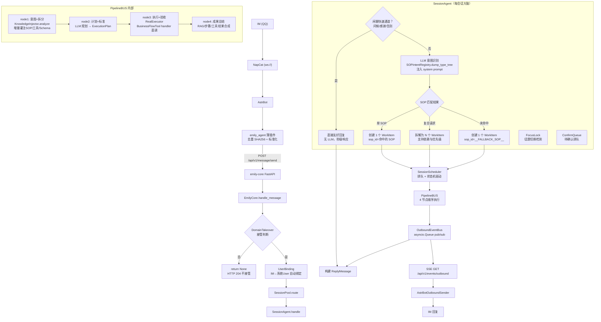
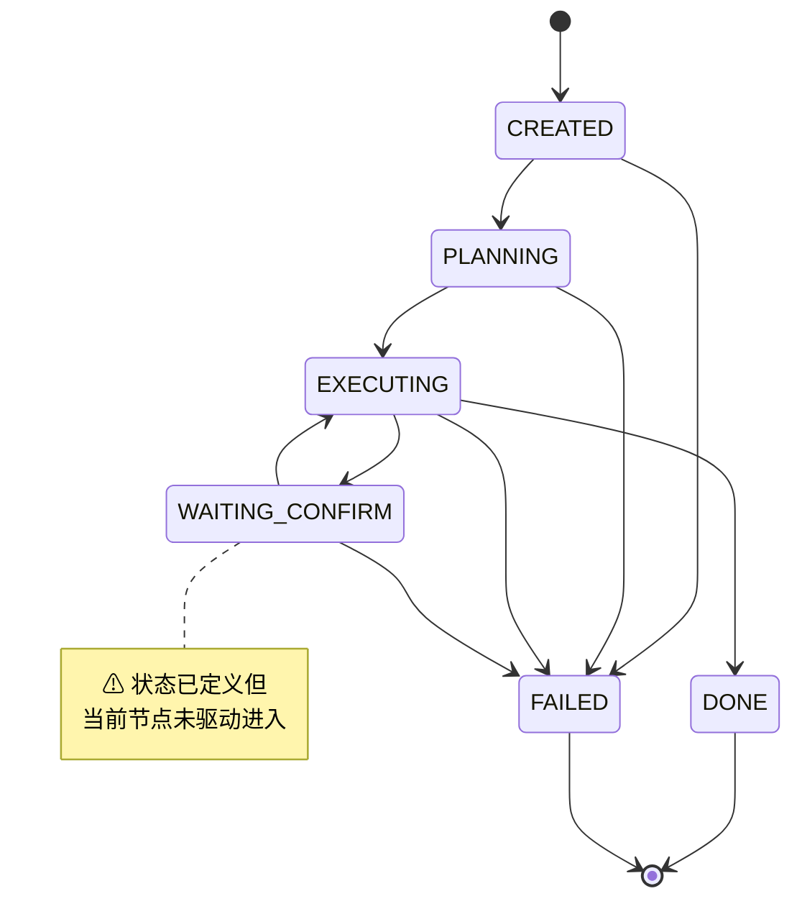
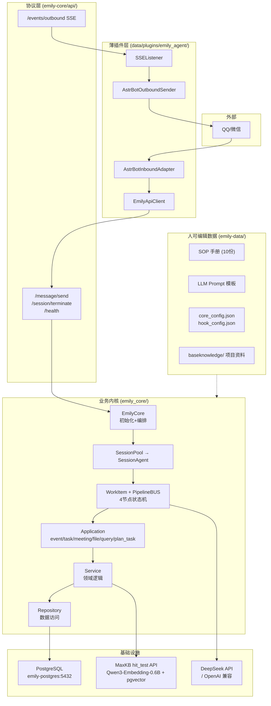

# Emily 业务模块与运转全景

> ← 返回 [CLAUDE.md](../CLAUDE.md) | 最后更新：2026-07-10

---

## 1. 端到端消息流转全景



---

## 2. WorkItem 状态机

一条用户消息 → 0..N 个 WorkItem。每个 WorkItem 是一个独立的执行单元，在 4 节点 PipelineBUS 中流转。



| 状态 | 含义 | 谁驱动转换 |
|------|------|-----------|
| `CREATED` | 刚创建，未开始执行 | `SessionScheduler` 创建 |
| `PLANNING` | 正在生成执行计划 | `SessionScheduler._run_one()` |
| `EXECUTING` | 正在执行计划步骤 | `SessionScheduler._run_one()` |
| `WAITING_CONFIRM` | 等待用户确认后继续 | ⚠ 已定义，未驱动 |
| `DONE` | 执行成功完成（终态） | `PipelineBUS` node4 后 |
| `FAILED` | 执行异常或终止（终态） | `PipelineBUS` 异常处理 |

---

## 3. 4 节点管道总线

```mermaid
graph TD
    subgraph Legend["Hook 图例"]
        L_BLOCK["🔴 BLOCK<br/>终止管道"]
        L_WARN["⚠ WARN<br/>警告继续"]
    end

    subgraph BUS["PipelineBUS — 4 节点（固定顺序）"]
        direction TB

        subgraph N1["node1 '意图+拆分' (required)"]
            N1H["KnowledgeInjector.analyze<br/>增量灌注 SOP/工具/Schema<br/>构建 RouteDecision"]
            N1H_before["before: 预留"]
            N1H_after["after: 预留"]
        end

        subgraph N2["node2 '计划+标准' (required)"]
            N2_before["before: plan_task_match<br/>🔐 auth.admin_check"]
            N2H["LLMPlanner<br/>→ ExecutionPlan<br/>(risk_level / steps / tool_params)"]
            N2_after["after: 预留"]
        end

        subgraph N3["node3 '执行+验收' (required)"]
            N3_before["before: trace.reasoning_start<br/>🔐 auth.admin_check"]
            N3H["RealExecutor<br/>M14 BusinessFlowTool handler 直调<br/>+ RAG knowledge_search 内联"]
            N3_after["after: trace.reasoning_end<br/>📝 audit.sop_completed"]
            N3_error["on_error: 📝 audit.agent_error"]
        end

        subgraph N4["node4 '成果总结' (non-required)"]
            N4_before["before: 预留"]
            N4H["合成 result_text<br/>→ verified_reply"]
            N4_after["after: 预留"]
        end

        N1 --> N2 --> N3 --> N4
```

| 节点 | 名称 | 必选 | 职责 |
|------|------|------|------|
| `wi_node1` | 意图+拆分 | ✅ | KnowledgeInjector 增量灌注 SOP/工具/Schema → 构建并验证 RouteDecision |
| `wi_node2` | 计划+标准 | ✅ | 生成 ExecutionPlan（含 risk_level L1-L3 / PlanStep[] / acceptance_criteria） |
| `wi_node3` | 执行+验收 | ✅ | 遍历 PlanStep，调用 BusinessFlowTool handler 或 RAG |
| `wi_node4` | 成果总结 | ❌ | 合成 result_text → verified_reply |

### 3.1 Hook 挂载规则

| 规则 | 说明 |
|------|------|
| **顺序不可跳** | 消息必须按 node1→node4 顺序流经每个节点 |
| **before 可阻断** | 任一 before hook 返回 BLOCK → 管道立即终止 |
| **异常即阻断** | before hook 抛异常视为 BLOCK（安全第一原则）；after hook 异常不阻断 |
| **deny always wins** | 多个 hook 中任一阻断即终止 |
| **三态决策** | ALLOW=放行 / WARN=警告继续 / BLOCK=终止 |
| **声明式配置** | Hook 通过 `hook_config.json` 注册，不改 Python 代码 |

### 3.2 已注册 Hook

| 挂载点 | Hook | 类型 | 决策 | 说明 |
|--------|------|------|------|------|
| `before:wi_node2` | `auth.admin_check` | auth | ALLOW/BLOCK | 管理员鉴权 |
| `before:wi_node2` | `plan_task_match` | plan_task_match | ALLOW | 计划任务周期匹配 |
| `before:wi_node3` | `trace.reasoning_start` | trace | ALLOW | 创建 Agent 推理追踪 |
| `before:wi_node3` | `auth.admin_check` | auth | ALLOW/BLOCK | 管理员鉴权 |
| `after:wi_node3` | `trace.reasoning_end` | trace | ALLOW | 更新推理追踪结果 |
| `after:wi_node3` | `audit.sop_completed` | audit | ALLOW | 审计 SOP 执行完成 |
| `on_error:wi_node3` | `audit.agent_error` | audit | ALLOW | 审计 Agent 执行失败 |
| `before:wi_node4` | `guardian.reply_review` | verify | ALLOW/WARN | 核验回复内容 |
| `before:wi_node4` | `guardian.deep_audit` | deep_audit | ALLOW | 深度审计调查（默认关闭） |
| `after:wi_node4` | `audit.outbound_archived` | audit | ALLOW | 审计回复已发送 |

---

## 4. 分层架构



**设计约束**：
- `emily_core` 不 import 任何 `astrbot.*` 包——未来可独立为微服务
- 薄插件不含业务逻辑——DTO 副本使插件不依赖 Core 包
- 分层不可跳：`API → EmilyCore → Session → WorkItem → Application → Service → Repository → DB`

---

## 5. 业务模块清单

### 5.1 核心消息处理

| 模块 | 职责 | 关键文件 | 依赖 |
|------|------|----------|------|
| **消息入口与接管** | 消息去重、标准化、接管决策（@bot/私聊/observe） | `data/plugins/emily_agent/main.py`, `services/domain_takeover_service.py` | AstrBot, Config |
| **用户绑定** | IM 平台用户→系统 User 自动创建/绑定/回填 | `services/user_binding_service.py`, `repositories/user_repo.py` | users, user_im_bindings |
| **Session 池与路由** | conversation_id→SessionAgent 映射/TTL/串行锁 | `adapters/session/session_pool.py`, `session_factory.py` | SessionAgent |
| **Session 大脑** | 快回短路、LLM SOP 意图识别、WorkItem 拆分、FocusLock、ConfirmQueue、回复聚合 | `session/session_agent.py`, `session/{context,state,focus_lock,confirm_queue}.py` | LLMClient, SOPIntentRegistry, SessionScheduler, StateMachineService |

### 5.2 管道与执行

| 模块 | 职责 | 关键文件 | 依赖 |
|------|------|----------|------|
| **WorkItem 状态机** | 单任务全息记录 + 6 态状态机 | `workitem/workitem.py`, `workitem_state.py` | — |
| **SessionScheduler** | 每 Session 的 WorkItem 队列/优先级/执行驱动 | `workitem/scheduler.py` | WorkItem, PipelineBUS |
| **PipelineBUS** | 4 节点顺序执行 + Hook 挂载与触发 | `workitem/pipeline/bus.py`, `node.py`, `context.py` | HookRegistry, WorkItemAgent |
| **WorkItemAgent** | 4 节点 handler（意图注入/LLM规划/M14执行/总结），auth/risk 代理 | `workitem/workitem_agent.py` | KnowledgeInjector, BusinessFlowToolRegistry |
| **KnowledgeInjector** | 增量 SOP/工具/Schema 灌注，token 预算 LRU 淘汰 | `workitem/injector.py` | SOPIntentRegistry, SOPLoader, ToolRegistry |
| **Hook 系统** | 7 种 Hook 子类（Auth/Audit/Verify/Trace/Progress/DeepAudit/PlanTaskMatch），三态决策 | `workitem/pipeline/hook.py`, `hook_registry.py`, `hook_config.json` | AgentTraceService, PlanTaskService |

### 5.3 Agent 引擎（冷备 / 备选路径）

| 模块 | 职责 | 关键文件 | 状态 |
|------|------|----------|------|
| **MasterAgent** | ReAct 编排器（chat_with_tools/SOP 匹配派发/复合拆解） | `agent/master_agent.py` | 冷备——逻辑已提取到 SessionAgent |
| **BusinessFlowAgent** | （已删除） | — | M14 模式已提取到 WorkItemAgent，`agent/` 目录整体移除 |

### 5.4 SOP 系统

| 模块 | 职责 | 关键文件 | 依赖 |
|------|------|----------|------|
| **SkillRegistry** | 扫描 `skills/` 加载 `.skill.yaml` → Skill 定义缓存 → 热重载 | `skill/registry.py`, `skill/parser.py` | `.skill.yaml` 文件 |
| **SOP 匹配** | LLM 语义匹配（Registry 仅提供目录，不做匹配） | `session/session_agent.py._recognize_intent()` | LLMClient, SOPIntentRegistry |

**10 份 SOP**：SOP-000(编写标准) / SOP-001(会议) / SOP-002(事件) / SOP-003(任务) / SOP-004(文件) / SOP-005(查询) / SOP-007(长期记忆) / SOP-008(待解决) / SOP-011(节点管理) / SOP-999(全涵兜底)

**新增 SOP**：放 `.md` 到 `emily-data/sops/` → 重启即生效，零代码改动。

### 5.5 业务 CRUD

| 模块 | 职责 | Application | Service | Repository |
|------|------|-------------|---------|------------|
| **事件记录** | 事件 pending create / confirm / cancel / 简报 | `event_app.py` | `event_service.py` | `event_repo.py` |
| **任务管理** | 任务创建/更新/完成/取消 | `task_app.py` | `task_service.py` | `task_repo.py` |
| **会议记录** | 会议纪要录入 | `meeting_app.py` | `meeting_service.py` | `meeting_repo.py` |
| **文件归档** | 文件元数据 + 附件存储 | `file_app.py` | `file_service.py` + `file_storage_service.py` | `file_repo.py` |
| **数据查询** | 跨 9 表结构化查询 + 统计 + journal | `query_app.py` | `query_service.py` | 多 repo |

### 5.6 工具系统

| 模块 | 职责 | 关键文件 |
|------|------|----------|
| **BusinessFlowToolRegistry** (M14) | 5 核心业务流工具——框架直调（不暴露为 LLM function-calling） | `tools/business_flow_tools.py` |
| **ToolRegistry** (LLM) | 条件工具——query_data + knowledge_search/chat_archive/memory/pending_issue/plan_task——暴露为 OpenAI function-calling 供 unmatched 兜底 | `agent/tool_registry.py`, `tools/__init__.py` |

### 5.7 横切关注点

| 模块 | 职责 | 关键文件 |
|------|------|----------|
| **消息记录** | 入站/出站/前导消息持久化（event_id 幂等） | `services/message_service.py`, `repositories/message_repo.py` |
| **聊天归档** | 双向全量聊天存档 + 附件关联 + 检索工具 | `services/chat_archive_service.py`, `repositories/chat_archive_repo.py`, `tools/chat_archive_tool.py` |
| **Agent 追踪** | Agent 推理 / LLM 交互 / 工具调用日志（fail-safe 不阻塞） | `services/agent_trace_service.py`, `repositories/{agent_reasoning,llm_interaction,tool_call}_repo.py` |
| **文件存储** | IM 附件下载到本地 + file_no 生成 + files/message_attachments 联动 | `services/file_storage_service.py`, `repositories/file_repo.py` |
| **确认流持久化** | SOP 检查点快照/确认/过期/恢复——容器重启不丢待确认项 | `services/checkpoint_service.py`, `session/confirm_queue.py` |
| **长期记忆** | 每用户 Markdown 长期记忆文件（SOP-007） | `services/user_memory_service.py`, `tools/memory_tool.py` |
| **待解决问题** | SOP-008 待解决问题清单（编号/写/完成/列） | `services/pending_issues.py`, `tools/pending_issue_tool.py` |
| **事件日志** | 追加模式项目事件流水 Markdown | `services/event_journal.py` |

### 5.8 知识库

| 模块 | 职责 | 关键文件 |
|------|------|----------|
| **MaxKB RAG** | hit_test API 纯向量检索 → 返回文档段落+相似度 | `providers/rag/maxkb_provider.py` |
| **本地回退** | 零依赖 TF 关键词搜索 .md/.txt（stage/role 过滤） | `providers/rag/local_fallback.py` |
| **session.md** | Emy 核心人格 + 回复规范 + 意图路由（合二为一） | `emily-data/prompts/session.md` |
| **workitem.md** | 执行 Agent 角色 + 规划规则 + 回复合成规则 | `emily-data/prompts/workitem.md` |

### 5.9 计划任务（最新模块）

| 模块 | 职责 | 关键文件 |
|------|------|----------|
| **计划任务引擎** | 模板/实例生命周期、7 态机、鉴权、非周期匹配 | `services/plan_task_service.py`, `repositories/plan_task_repo.py` |
| **后台调度器** | asyncio 循环：advisory-lock / 超时提醒 / 周期生成 / LLM 失败通知 / 自动归档 / 自动升级 | `services/plan_task_scheduler.py` |
| **工作流集成** | 确认时启动工作流/回写实例 id/失败重试 | `services/workflow_integrator.py` |
| **工具与 Hook** | SOP-009/010 工具 + PlanTaskMatchHook（before:wi_node2） | `tools/plan_task_tool.py`, `application/plan_task_app.py`, `pipeline/hook.py` |

### 5.10 基础设施

| 模块 | 职责 | 关键文件 |
|------|------|----------|
| **LLM 客户端** | DeepSeek/OpenAI 兼容 async 封装（chat / chat_json / chat_with_tools / trace callback） | `infrastructure/llm/client.py` |
| **数据库** | PostgreSQL 连接池 + 36 表 ORM + 幂等建表 | `infrastructure/database/{session,models}.py` |
| **配置** | 全局 Config dataclass + env 覆盖 + bootstrap 初始化 | `config.py`, `bootstrap.py` |
| **出站总线** | asyncio.Queue pub/sub 出站事件广播 | `outbound_bus.py` |

---

## 6. 降级策略

系统各组件在 LLM 不可用时有自然降级行为，无需 Mock 模式切换：

| 组件 | 正常路径 | LLM 不可用时 |
|------|----------|-------------|
| **规划器** | `WorkItemAgent._llm_plan()` | `_fallback_steps()`（3 步通用计划） |
| **执行器** | `WorkItemAgent._real_execute()`（M14 直调） | 无 BusinessFlowToolRegistry 时返回空结果 |
| **Guardian** | `RealGuardian` 陪跑+出站审核 | 跳过（`_guardian=None`） |
| **鉴权** | `PermissionAuthEngine` 三维鉴权 | 无引擎时走 `sop_allow` 白名单 |
| **风险评估** | `grade_risk()` 按 intent_type 分级 | 始终按分级逻辑执行（无 mock 分支） |

---

## 7. SOP 路由与派发流程

```
用户消息 → SessionAgent
  │
  ├─ 快回短路：问候/感谢/告别 → 硬编码直接回复
  │
  ├─ LLM 语义匹配（SOPIntentRegistry.dump_type_tree 注入 prompt）
  │   │
  │   ├─ 命中单个 SOP (confidence≥medium)
  │   │   → 创建 WorkItem(sop_id=命中的SOP)
  │   │   → KnowledgeInjector 加载 SOP §1-7 全文 + §3.2 工具
  │   │   → WorkItemAgent 规划（步骤绑定 tool_name，如 record_event）
  │   │   → RealExecutor → BusinessFlowTool.handler(params)
  │   │
  │   ├─ 复合请求 (compound=true)
  │   │   → 拆解为 N 个 WorkItem（sub_tasks）
  │   │   → 每个独立走 4 节点 BUS
  │   │
  │   └─ 未命中 (confidence<none)
  │       → 创建 WorkItem(sop_id=__FALLBACK_SOP__)
  │       → unmatched.md 兜底
  │       → ReAct + ToolRegistry (LLM function-calling 自由推理)
```
