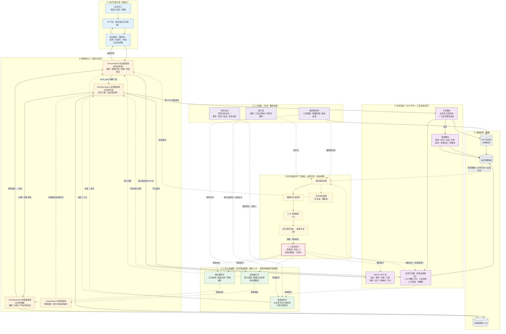

# Emily 系统架构图

> 更新：2026-08-21 ｜ 依据 [CLAUDE.md](../CLAUDE.md)、[业务模块与运转全景.md](业务模块与运转全景.md)、[开发记录.md](开发记录.md)、论文正文 4.1–4.4 节口径绘制。
>
> 本图只表达**架构语义与模块关联**，不体现具体技术栈（IM 品牌、桥接组件、数据库 / 向量库 / LLM 型号、执行框架等实现细节）。
>
> 术语对照（工程名 ↔ 论文名）：世界书 = 项目态势书 ｜ 规则书 = 组织规则书 ｜ 系统自我描述 = 系统能力书。

## 图例与关系速读

| 箭头类型 | 含义 |
|---------|------|
| 实线 `-->` | 数据 / 控制流（主链路） |
| 虚线 `-.->` | 认知注入 / 回写 / 采集（异步或非主链路） |

**七层结构**：
1. **接入层** — IM 平台 → 薄网关插件（去重 / 标准化 / 转发，无业务逻辑）
2. **智能体分工** — 三主力（Session / WorkItem / Guardian）+ 专家（按需加载）
3. **三书基座** — 通用 LLM 特化为垂直领域团队智能体的「共享认知地图」
4. **源头数据** — 三书各自的生成/更新依据：态势书是「全景节点（骨架）+ 业务日志（流水）」双源；规则书 ← 集团规范库；能力书 ← 能力包
5. **业务底座** — SOP 引导用户与工具模块、信息模块交互；全景节点承载态势感知
6. **基础设施** — 关系型数据库 / RAG 知识库 / 大语言模型
7. **复盘闭环** — 采集 → 洞察 → 规则归纳 → 提案 → 人审批放行 → 回写三书 / SOP / 全景节点

**关键设计语义**：
- **三智能体是三段式组织分工**（前台组织 / 中台执行 / 后台审核），非平级并列；Guardian 独立于执行链路，对应地产「执行与审核分离」的条线制衡。
- **三书是系统级共享基座 + 角色化按需取用**，不是某一 agent 的私有物；携带归属：Session 代表「态势书 + 能力书」，Guardian 代表「规则书」。
- **项目态势书 = 全景节点（骨架）+ 业务日志（流水）双源聚合**：全景节点提供结构化骨架，业务日志（事件/任务/会议/文件记录与项目日志流水）提供过程信息，二者聚合为态势书，再注入智能体，形成「节点 + 日志 → 态势书 → 智能体」的态势感知链。
- **复盘是双向闭环**：输入侧采集项目数据 / 规范库 / 能力包 / 业务日志 / 会话记录；输出侧通过周度「规则归纳 → 提案」产出变更建议，经**人审批放行**后回写三书、SOP、全景节点，推动态势同步与经验积累。
- **受控演进（Human-in-the-loop）**：三书、SOP、全景节点（状态空间）的变更，系统只能产出**提案**，最终**审批放行必须由人（管理员 / 责任人）完成**，系统不自主落库。全景节点需区分两类更新：节点**状态流转**（如 CONDITIONS_NOT_MET → IN_PROGRESS → COMPLETED）由 LLM 增强 FSM 自动判定，无需审批；节点**增删改（结构 / 状态空间变更）** 则必须经人审批放行。
- **专家智能体按需加载**：由系统能力书（注册专家库）驱动唤起，承接垂直领域任务，与三常驻主力 agent 区分。
