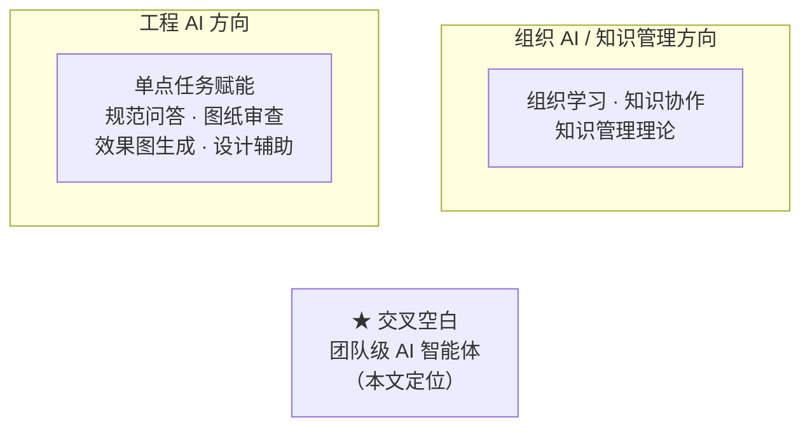
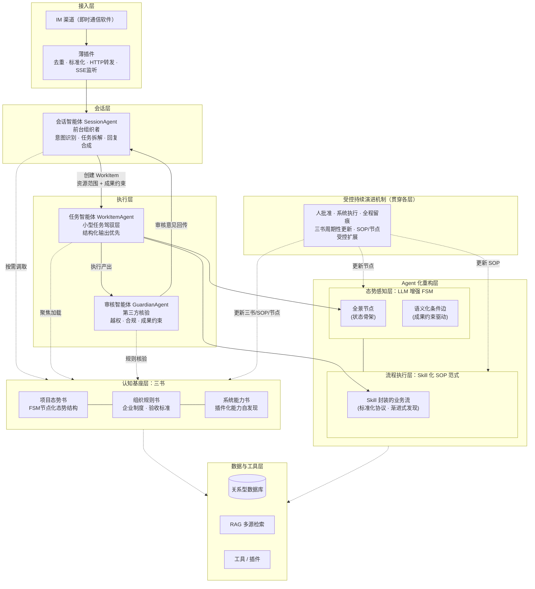
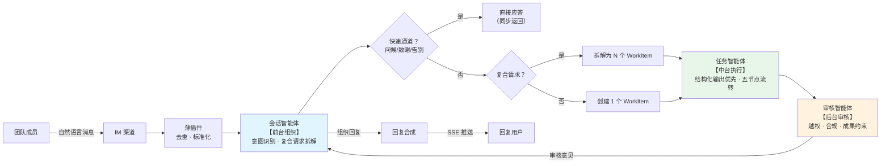

# 论文图 —— V3.1 期刊版（3 张图）

> 用途：期刊版论文的 3 张核心图，均含 Mermaid 源码，可直接导出为 SVG/PNG
> 图题在下方（GB 格式），中文表述

---

## 图 2-1 研究脉络交叉空白定位图

**位置**：第 2 章 相关研究（研究空白定位节）
**尺寸**：单栏（约 7.5 cm × 7 cm），居中

> 注：两条研究脉络形成"两端强、中间弱"格局——工程AI端单点工具成熟但停留在个人任务层，组织AI端有理论但缺工程化落地。二者之间缺少"让AI以极低门槛持续嵌入团队日常信息流、自动汇聚多来源过程信息为组织公共记忆"的工程化衔接层，这正是本文定位。

---

## 图 4-1 系统总体架构图

**位置**：第 4 章 4.1 节 架构总览
**尺寸**：通栏（约 15 cm × 10 cm），纵向排版

> 注：全文最重要的一张图。核心信息：①三智能体分工（前台组织/中台执行/后台审核）；②两大Agent化重构机制（LLM增强FSM态势层 + Skill化SOP执行层，骨架-血肉嵌套）；③三书认知基座（态势-规则-能力，共享基座、按需渐进式发现）；④受控持续演进贯穿各层。

---

## 图 4-2 三智能体分工与消息处理链路图

**位置**：第 4 章 4.3 节 三智能体分工协作机制
**尺寸**：通栏横向（约 15 cm × 7 cm）

> 注：三智能体形成"前台组织-中台执行-后台审核"的三层分工，对应地产项目管理"条线制衡"逻辑——执行与审核分离，AI行为天然对齐组织管控要求。复合请求拆解与双通道响应（快速通道+业务执行）是系统工程特色。
