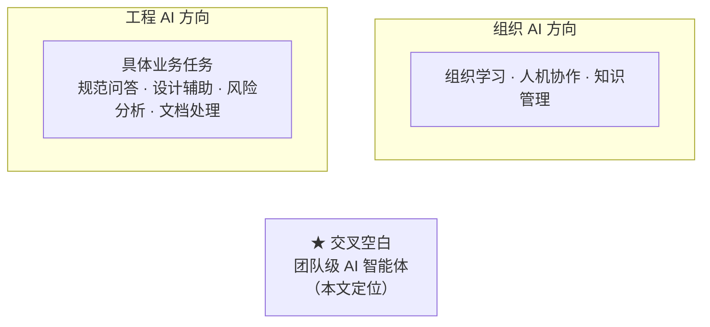
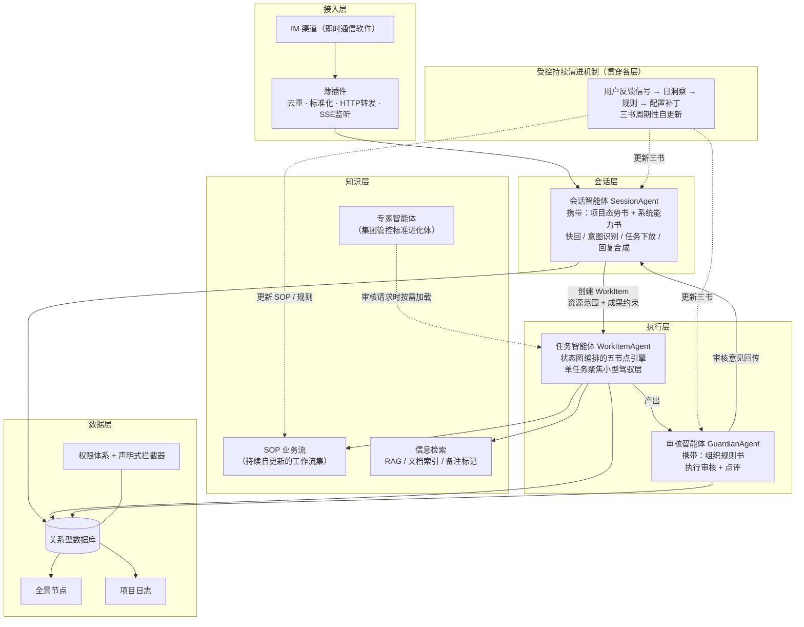
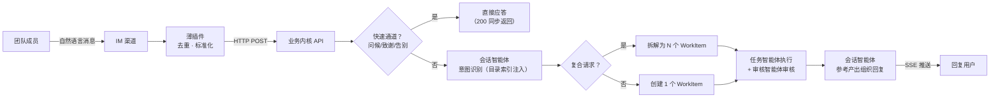
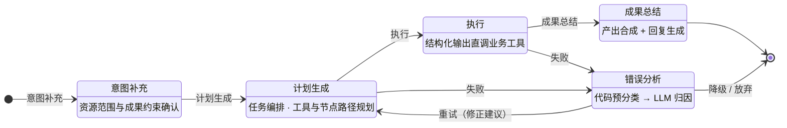
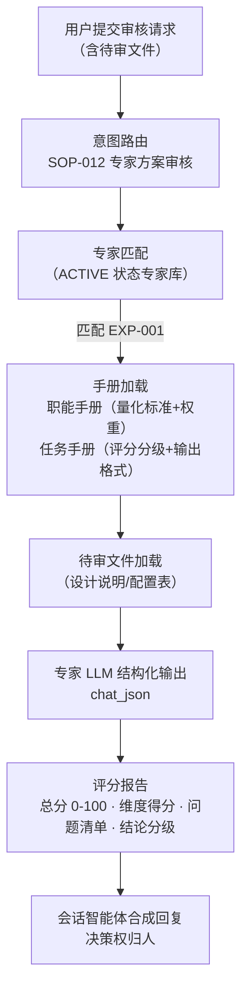
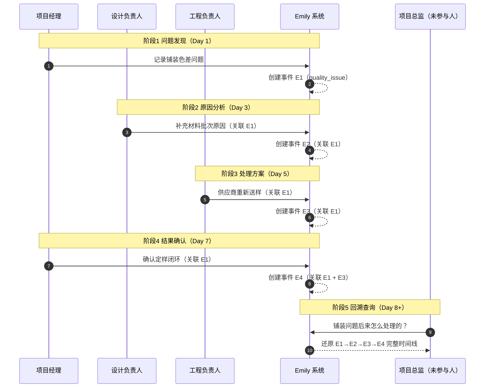

# 论文图表制作文件

> 论文：《地产垂直领域的团队 AI 智能体系统架构设计与实践探索》
> 用途：图表独立制作文件——正文中的图表位置以文字占位标记，本文件提供每个图表的 Mermaid 源码 / 表格内容 / 建议尺寸 / 制作要求
> 目标期刊排版：双栏（栏宽约 7.5 cm）或通栏（约 15 cm），图表尺寸需按此规划

---

## 一、图清单（6 张）

### 图 2-1 研究脉络交叉空白定位图 ★ 第 2 章核心图

**位置**：第 2 章 2.5 节
**建议尺寸**：单栏（约 7.5 cm × 7 cm），居中
**制作要求**：
- 两个圆形或圆角矩形代表两条研究脉络："工程 AI 方向"（左）与"组织 AI 方向"（右），上下排列或左右排列均可
- 交叉区域以星号标注"团队级 AI 智能体"（本文定位）
- 每个脉络下方一行小字标注其重点（工程 AI：具体业务任务；组织 AI：组织学习/人机协作/知识管理）
- 简洁为主，不画多余装饰

**Mermaid 源**：

> 注：Mermaid 的 `~~~` 表示不可见连接，制图时用两个相交的圆/椭圆表达交叉关系更直观。

---

### 图 4-1 系统总体架构图 ★ 全文最重要的一张图

**位置**：第 4 章 4.1 节
**建议尺寸**：通栏整页宽（约 15 cm × 9-10 cm），纵向排版；若双栏刊面紧张，可横排占通栏
**制作要求**：
- 五层结构自上而下排列，受控持续演进机制画为侧翼贯穿（虚线框）
- 三个智能体节点内标注携带的"三书"（态势书+能力书/规则书）
- 层次感用浅色底纹区分，箭头标注动作语义（创建 WorkItem/审核意见回传/按需加载/更新三书）
- 这是全文架构总纲，信息密度要高但不凌乱

**Mermaid 源**：

---

### 图 4-2 消息处理主链路图

**位置**：第 4 章 4.2 节
**建议尺寸**：通栏横向（约 15 cm × 6-7 cm）；若双栏，可纵向压成 7.5 cm × 10 cm
**制作要求**：横向流程图，含"快速通道"与"复合请求拆解"两个分支；虚线箭头标注审核意见回传路径

**Mermaid 源**：

---

### 图 4-3 WorkItem 执行引擎五节点状态图

**位置**：第 4 章 4.4.1 节
**建议尺寸**：单栏即可（约 7.5 cm × 8 cm），纵向
**制作要求**：状态图，含错误分析节点的"重试回边"与"降级/放弃"出口；五节点顺序流转 + 两条失败分支

**Mermaid 源**：

---

### 图 4-4 专家智能体按需加载流程图

**位置**：第 4 章 4.5 节
**建议尺寸**：单栏（约 7.5 cm × 9 cm），纵向
**制作要求**：纵向流程，7 步；落点节点强调"决策权归人"（呼应 P1）

**Mermaid 源**：

---

### 图 5-1 连续过程信息协同案例时序图 ★ 第 5 章核心图

**位置**：第 5 章 5.5 节
**建议尺寸**：通栏（约 15 cm × 8 cm），横向；若双栏，可纵向压成 7.5 cm × 12 cm
**制作要求**：
- 横向泳道时序图，4 条泳道（项目经理 / 设计负责人 / 工程负责人 / 项目总监）
- 横向时间轴 5 阶段（问题发现 → 原因分析 → 处理方案 → 结果确认 → 回溯查询）
- 事件节点按"角色 × 阶段"落位，锚点事件 E1 以强调色突出
- 关联关系用橙色虚线箭头指向锚点 E1，E4 自动补全关联 E3 需单独标出（设计亮点）
- 回溯查询以绿色节点强调"未参与人低成本回溯"，箭头指向完整记录链

**Mermaid 源**：

---

## 二、表清单（12 张）

### 表 1-1 四重困难 × 设计原则对应表

**位置**：第 1 章引言
**建议尺寸**：通栏（约 15 cm 宽），4 行
**正文内容**：

| 组织视角的结构性困难 | 对应设计原则 | 解答逻辑 |
|---------------------|-------------|---------|
| 行为改变成本高 | P3 自然语言信息接入 | 低学习门槛的 IM 入口消解习惯改变阻力 |
| 数据冷启动死循环 | P5 陪跑式信息采集 | 不要求刻意贡献，系统在运行中自然沉淀 |
| 组织风险顾虑 | P1 弱人工智能工具化定位 | 只陪跑不卡流程，签名认证式人机边界 |
| 价值归属模糊 | P2 团队级训练主体 | 知识沉淀到团队而非个人，价值对组织可见 |
| （技术使能层） | P4 渐进式知识发现 | 上下文窗口约束下的工程方案 |

---

### 表 2-1 研究分类框架表

**位置**：第 2 章 2.5 节
**建议尺寸**：通栏（约 15 cm 宽），6 行 5 列
**正文内容**：

| 研究类型 | AI 服务对象 | 数据来源 | 使用方式 | 主要局限 |
|---------|------------|---------|---------|---------|
| 单点专业工具 | 个人 | 单次输入 | 即时调用 | 缺乏长期项目记忆 |
| RAG 问答 | 个人 / 团队 | 文档库 | 被动查询 | 缺乏过程数据 |
| BIM / 数字孪生 | 项目 | 结构化工程数据 | 平台操作 | 信息录入成本较高 |
| Agent 系统 | 任务 | 工具 / 数据库 | 任务执行 | 多为任务中心 |
| **本文系统** | **团队** | **日常过程信息** | **长期陪跑** | 尚缺大规模组织验证 |

> 注：此表将"研究空白"从主观判断升级为分类框架呈现，使本文定位一目了然。

---

### 表 2-2 本文与既有路径对比表

**位置**：第 2 章 2.5 节
**建议尺寸**：通栏（约 15 cm 宽），7 行 5 列
**正文内容**：

| 维度 | 传统数字化工具（MIS/BIM） | 通用 AI 助手 | 行业 AI 单点工具 / 平台问答 | 本文系统 |
|------|--------------------------|-------------|---------------------------|---------|
| 信息入口 | 表单 / 模型（需培训） | 网页/APP 对话 | 平台界面 / 专业软件 | IM 自然语言（低门槛） |
| 基本单位 | 流程 | 个人 | 任务 | **团队** |
| 知识主体 | 企业（格式固化） | 个人 | 平台 / 个人 | **团队（结构化组织资产）** |
| 信息汇聚 | 汇总后处理 | 无 | 查询式 | 全量陪跑采集 |
| 人机边界 | 流程控制 | 无约束 | 系统内约束 | 签名认证式 |
| 能力生长 | 固定 | 固定 | 知识库更新 | 受控持续演进 |
| 事实校验 | 无（单一来源信息） | 无 | 无 | **相对独立的信息记录与交叉溯源** |

> 注：与新版第 2 章五节结构对齐——原"传统 MIS / 通用 AI 助手 / 平台嵌入问答 / 单点工具赋能"四列合并为"传统数字化工具（MIS/BIM）"与"行业 AI 单点工具/平台问答"两列，并新增"基本单位"维度行（对应 2.3 节"现有研究基本单位是任务，本文是团队"的核心论断）。

---

### 表 3-1 问题—约束—原则映射模型

**位置**：第 3 章 3.6 节
**建议尺寸**：单栏（约 7.5 cm 宽），5 行
**正文内容**：

| 结构性问题 | 设计约束 | 对应设计原则 |
|---------|---------|-------------|
| 信息录入困难 | 操作门槛 | P3 自然语言信息接入 |
| 数据冷启动 | 使用前没有数据 | P5 陪跑式信息采集 |
| AI 越权风险 | 决策责任不清 | P1 弱人工智能工具化定位 |
| 知识随人流失 | 知识主体个人化 | P2 团队级训练主体 |
| 知识规模扩大 | 上下文 / 注意力限制 | P4 渐进式知识发现 |

> 注：此表将五原则从"经验归纳"提升为"结构性约束推导"，是第 3 章"去经验化"的核心，与 3.6 节"问题—约束—原则"的推导结构对应。

---

### 表 3-2 五原则结构关系表

**位置**：第 3 章 3.6 节
**建议尺寸**：单栏即可（约 7.5 cm 宽），4 行
**正文内容**：

| 结构层 | 原则 | 解决的问题 |
|--------|------|-----------|
| 输入侧 | P3 自然语言信息接入 | 信息怎么进来 |
| 输入侧 | P5 陪跑式信息采集 | 信息如何持续积累 |
| 处理侧 | P4 渐进式知识发现 | 知识与能力如何被组织与调用 |
| 边界侧 | P1 弱人工智能工具化定位 | AI 能做什么、不能做什么 |
| 边界侧 | P2 团队级训练主体 | 知识归谁所有、为谁沉淀 |

---

### 表 3-3 术语对照表

**位置**：第 3 章 3.6 节末
**建议尺寸**：单栏（约 7.5 cm 宽），8 行
**正文内容**：

| 术语 | 学术化定义 |
|------|-----------|
| 工作任务单元（WorkItem） | 一条用户消息拆解出的独立业务意图执行单元 |
| 三书 | 团队型智能体的上下文组织机制：环境上下文（项目态势）+ 组织上下文（规则）+ 能力上下文（系统能力） |
| 签名认证制 | 信息自由录入、权限人签证认领后方视为有效的记录生效机制 |
| 陪跑式信息采集 | 系统在日常运行中自然采集过程信息、不依赖用户刻意填报的数据积累方式 |
| 渐进式知识发现 | "目录索引先行、按需加载全文"的知识与能力加载策略 |
| 受控持续演进 | 人工确认约束下的系统持续观察、沉淀经验与能力增量迭代机制 |
| 可追溯记录链 | 由不同角色、不同时间、不同渠道留痕串成的可对照任务推进记录 |

> 注：此表对应三审意见"自创术语需统一释义"，将工程内部命名上升为学术可读表述。

---

### 表 4-1 设计决策与原则映射表

**位置**：第 4 章 4.8 节
**建议尺寸**：通栏（约 15 cm 宽），17 行 4 列
**正文内容**：

| 架构层次 | 关键设计决策 | 对应原则 | 决策核心理由 |
|---------|-------------|---------|-------------|
| 接入层 | 双容器结构，薄插件+独立内核 | P3 | IM 为入口但不为 IM 所绑定 |
| 会话层 | 会话智能体：三书认知基石（态势书+能力书；审核智能体携规则书） | P4 | 组织规则+项目态势+能力边界，按需注入 |
| 会话层 | 会话智能体：目录索引注入，只组织不执行 | P4 | 上下文窗口约束与注意力保持 |
| 会话层 | 资源范围与成果约束随任务下放 | P1 | 任务执行边界由会话层预先界定 |
| 会话层 | 权限快照一次性注入、只读 | P1 | 杜绝智能体越权篡改 |
| 执行层 | 任务智能体：单一任务聚焦的小型驾驭层 | P4 | 不掌握无关项目信息，避免知识污染 |
| 执行层 | 结构化输出优先模式 | P1 | 工具选择应固定于流程而非 LLM 临场推理 |
| 执行层 | 审核智能体：规则书+鉴权+成果约束三重灌注 | P1 | AI 产出经独立核验关卡后方达用户 |
| 执行层 | 错误分析纠错闭环 | P1 | AI 不确定性环节的自纠能力 |
| 知识层 | SOP 集合持续自更新 | P2 | 经验随团队沉淀、优胜劣汰 |
| 知识层 | 专家智能体：集团管控标准进化体 | P4 | 管控手册提炼为按需加载的领域专家 |
| 数据层 | 签名认证制事件 | P1 | 只陪跑不卡流程的人机边界 |
| 数据层 | 声明式拦截器 | P1 | 横切逻辑与业务解耦 |
| 数据层 | 全景节点+项目日志 | P5 | 陪跑式采集的数据底座 |
| 演进层 | 人主导的经验结构化（增量定义 SOP/节点模板） | P2 | 经验随团队沉淀、跨项目复用 |
| 演进层 | 系统自我观察与迭代（洞察→规则→补丁闭环） | P1 | 人批准、系统执行、全程留痕 |

---

### 表 5-1 功能验证结果汇总表 ⚠ 数字需作者核实

**位置**：第 5 章 5.2.1 节
**建议尺寸**：通栏（约 15 cm 宽），8 行
**正文内容**：

| 验证维度 | 场景数 | 通过 | 通过率 |
|----------|--------|------|--------|
| SOP 意图识别与业务路由 | 15 | 15 | 100% |
| 结构化参数提取与工具调用 | 12 | 11 | 91.7% |
| 数据查询与结果过滤 | 8 | 8 | 100% |
| 权限分级控制 | 6 | 5 | 83.3% |
| 文件管理 | 11 | 9 | 81.8% |
| 多轮对话与上下文保持 | 4 | 4 | 100% |
| 复合请求拆解与确认闭环 | 6 | 6 | 100% |
| **合计** | **62** | **58** | **93.5%** |

---

### 表 5-2 设计原则验证矩阵

**位置**：第 5 章 5.3.4 节
**建议尺寸**：通栏（约 15 cm 宽），5 行
**正文内容**：

| 设计原则 | 验证场景 | 验证结论 |
|---------|---------|---------|
| P1 弱人工智能工具化定位 | 场景三 | 专家智能体输出量化评分报告，最终决策权归人 |
| P2 团队级训练主体 | 场景一 | 越级查询跨管理层级直接透传，无需中间汇报 |
| P3 自然语言信息接入 | 场景一、二、三 | 全程自然语言交互，无表单、无预配置报表 |
| P4 渐进式知识发现 | 场景三 | 通用智能体按需加载专家手册切换角色，非全量注入 |
| P5 陪跑式信息采集 | 场景二 | 日报由系统日常采集的事件/任务动态聚合，非预配置模板 |

---

### 表 5-3 完整证据链对比表（项目 A vs 项目 B）

**位置**：第 5 章 5.4.2 节
**建议尺寸**：通栏（约 15 cm 宽），6 行
**正文内容**：

| 维度 | 项目 B（传统模式，未使用 Emily） | 项目 A（使用 Emily） |
|------|--------------------------------|---------------------|
| 指令下达 | 集团微信群（滚动淹没） | 任务下发 TSK + 全景节点，均留痕 |
| 执行留痕 | 工长微信口头汇报 + 拍照 | 完工上报事件（执行人，附照片地址） |
| 记录来源 | 记录人=执行人=上报人，同一只手 | 执行人 ≠ 认证人 ≠ 验收人，多角色 |
| 时间可对照 | 否（各说各话，无汇聚点） | 是（7/15 下发 → 7/18 上报 → 7/19 验收） |
| 交叉验证 | 无从谈起（孤岛） | 证据链完整，可组合交叉验证 |
| 领导核查方式 | 逐人电话 / 翻群 / 找台账 | 一次自然语言查询 |

> 注：表 5-3 支撑 5.4.2 节"可追溯记录链"对比实验，是"重构团队信息流"立论的核心证据表。

---

### 表 5-4 连续过程案例五阶段表

**位置**：第 5 章 5.5.1 节
**建议尺寸**：通栏（约 15 cm 宽），5 行
**正文内容**：

| 阶段 | 时间 | 角色 | 动作 | 事件类型 | 关联关系 |
|------|------|------|------|---------|---------|
| 1 问题发现 | Day 1 | 项目经理 | 记录铺装色差问题 | quality_issue | 锚点（无前向关联） |
| 2 原因分析 | Day 3 | 设计负责人 | 确认材料批次差异 | decision | 关联 E1 |
| 3 处理方案 | Day 5 | 工程负责人 | 供应商重新送样 | quality_issue | 关联 E1 |
| 4 结果确认 | Day 7 | 项目经理 | 确认定样、闭环 | decision | 关联 E1 + E3（自动补全） |
| 5 回溯查询 | Day 8+ | 项目总监（未参与） | 自然语言回溯全程 | — | 查询 |

> 注：表 5-4 支撑 5.5 节连续过程案例的"五阶段剧本"，是"信息逐步长成可追溯记录链"的动态验证脚本。

---

### 表 5-5 事件关联链表

**位置**：第 5 章 5.5.2 节
**建议尺寸**：通栏（约 15 cm 宽），4 行
**正文内容**：

| 事件编号 | 标题 | 事件类型 | 关联事件（related_event_ids） | 记录人 | 确认人 |
|---------|------|---------|------------------------------|--------|--------|
| E1 | 铺装颜色与效果图差异大 | quality_issue | `[]` | 张正宏 | 张正宏 |
| E2 | 铺装色差系材料批次 | decision | `[E1]` | 赵明远 | 赵明远 |
| E3 | 铺装样品重新送样 | quality_issue | `[E1]` | 李景利 | 李景利 |
| E4 | 样板区铺装定样 | decision | `[E1, E3]` | 张正宏 | 张正宏 |

> 注：表 5-5 支撑 5.5.2 节"关联链的形成"，是数据库直接核查的证据表，展示显式关联稳定回填与 E4 自动补全 E3 的完整链路。

---

## 三、制图总体规范

1. **风格统一**：全部图表使用同一套配色（建议冷灰色系 + 单一强调色）与字体（与正文一致的宋体/黑体）
2. **图题在下方、表题在上方**（GB 格式）
3. **中文表述**：图内文字全部中文（正文已按此要求，Mermaid 中英文混排处制图时统一为中文）
4. **编号规则**：图 2-1、图 4-1 至 4-4、图 5-1，表 1-1/2-1/2-2/3-1/3-2/3-3/4-1/5-1/5-2/5-3/5-4/5-5 已定，勿改动
5. **表 5-1 数字带 ⚠**：制作前请作者核实汇总数字后再定稿
