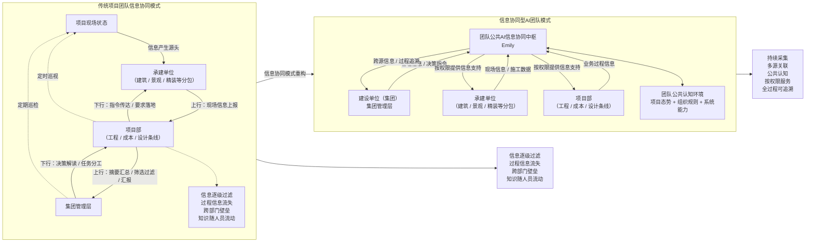
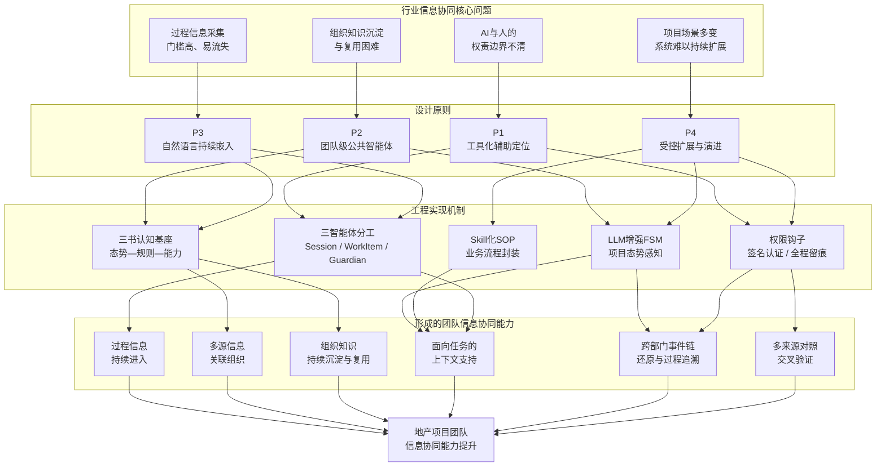
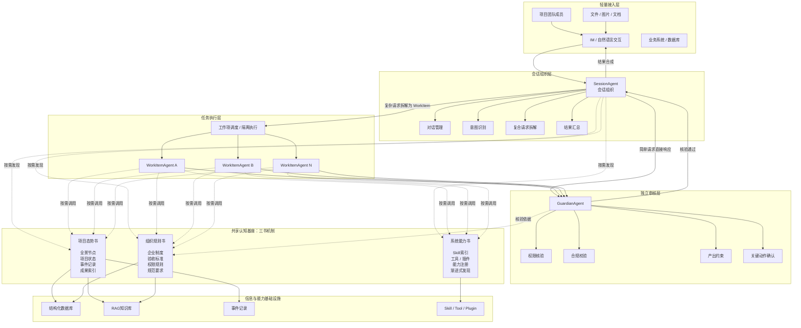

# 图1 传统项目团队信息流与AI信息协同模式对比

```mermaid
flowchart LR

    %% =========================
    %% 传统模式
    %% =========================

    subgraph T["传统项目团队信息协同模式"]
        direction TB

        T_site["项目现场状态"]
        T_contractor["承建单位<br/>（建筑 / 景观 / 精装等分包）"]
        T_dept["项目部<br/>（工程 / 成本 / 设计条线）"]
        T_owner["集团管理层"]

        T_site -->|"信息产生源头"| T_contractor
        T_contractor -->|"上行：现场信息上报"| T_dept
        T_dept -->|"上行：摘要汇总 / 筛选过滤 / 汇报"| T_owner

        T_owner -->|"下行：决策解读 / 任务分工"| T_dept
        T_dept -->|"下行：指令传达 / 要求落地"| T_contractor

        T_owner -.->|"定期巡检"| T_site
        T_dept -.->|"定时巡视"| T_site

        T_issue["信息逐级过滤<br/>过程信息流失<br/>跨部门壁垒<br/>知识随人员流动"]
        T_dept -.-> T_issue
    end


    %% =========================
    %% AI协同模式
    %% =========================

    subgraph A["信息协同型AI团队模式"]
        direction TB

        AI["团队公共AI信息协同中枢<br/>Emily"]

        K["团队公共认知环境<br/>项目态势 + 组织规则 + 系统能力"]

        A_owner["建设单位（集团）<br/>集团管理层"]
        A_contractor["承建单位<br/>（建筑 / 景观 / 精装等分包）"]
        A_dept["项目部<br/>（工程 / 成本 / 设计条线）"]

        A_owner -->|"管理信息 / 决策指令"| AI
        A_contractor -->|"现场信息 / 施工数据"| AI
        A_dept -->|"业务过程信息"| AI

        AI <--> K

        AI -->|"跨源信息 / 过程追溯"| A_owner
        AI -->|"按权限提供信息支持"| A_contractor
        AI -->|"按权限提供信息支持"| A_dept
    end


    %% =========================
    %% 对比关系
    %% =========================

    T -->|"信息协同模式重构"| A


    %% =========================
    %% 问题与效果
    %% =========================

    CMP_T["信息逐级过滤<br/>过程信息流失<br/>跨部门壁垒<br/>知识随人员流动"]
    T --> CMP_T

    CMP_A["持续采集<br/>多源关联<br/>公共认知<br/>按权限服务<br/>全过程可追溯"]
    A --> CMP_A
```
# 图2 问题—设计原则—工程机制—组织能力形成逻辑

```mermaid
flowchart TB

    %% =========================
    %% 第一层：行业问题
    %% =========================

    subgraph P["行业信息协同核心问题"]
        direction LR

        P1["AI与人的<br/>权责边界不清"]
        P2["组织知识沉淀<br/>与复用困难"]
        P3["过程信息采集<br/>门槛高、易流失"]
        P4["项目场景多变<br/>系统难以持续扩展"]
    end


    %% =========================
    %% 第二层：设计原则
    %% =========================

    subgraph D["设计原则"]
        direction LR

        D1["P1<br/>工具化辅助定位"]
        D2["P2<br/>团队级公共智能体"]
        D3["P3<br/>自然语言持续嵌入"]
        D4["P4<br/>受控扩展与演进"]
    end


    %% =========================
    %% 第三层：工程机制
    %% =========================

    subgraph M["工程实现机制"]
        direction LR

        M1["三书认知基座<br/>态势—规则—能力"]

        M2["LLM增强FSM<br/>项目态势感知"]

        M3["Skill化SOP<br/>业务流程封装"]

        M4["三智能体分工<br/>Session / WorkItem / Guardian"]

        M5["权限钩子<br/>签名认证 / 全程留痕"]
    end


    %% =========================
    %% 第四层：能力形成
    %% =========================

    subgraph C["形成的团队信息协同能力"]
        direction LR

        C1["过程信息<br/>持续进入"]

        C2["多源信息<br/>关联组织"]

        C3["组织知识<br/>持续沉淀与复用"]

        C4["面向任务的<br/>上下文支持"]

        C5["跨部门事件链<br/>还原与过程追溯"]

        C6["多来源对照<br/>交叉验证"]
    end


    %% =========================
    %% 最终目标
    %% =========================

    R["地产项目团队<br/>信息协同能力提升"]


    %% =========================
    %% 问题 → 原则
    %% =========================

    P1 --> D1
    P2 --> D2
    P3 --> D3
    P4 --> D4


    %% =========================
    %% 原则 → 机制
    %% =========================

    D1 --> M4
    D1 --> M5

    D2 --> M1
    D2 --> M2

    D3 --> M1
    D3 --> M4

    D4 --> M2
    D4 --> M3
    D4 --> M5


    %% =========================
    %% 机制 → 能力
    %% =========================

    M1 --> C2
    M1 --> C3

    M2 --> C4
    M2 --> C5

    M3 --> C4

    M4 --> C1
    M4 --> C4

    M5 --> C5
    M5 --> C6


    %% =========================
    %% 能力汇聚
    %% =========================

    C1 --> R
    C2 --> R
    C3 --> R
    C4 --> R
    C5 --> R
    C6 --> R
```

# 图3 Emily总体架构

```mermaid
flowchart TB

    %% =========================
    %% 接入层
    %% =========================

    subgraph L1["轻量接入层"]
        direction LR

        U1["项目团队成员"]
        U2["IM / 自然语言交互"]
        U3["文件 / 图片 / 文档"]
        U4["业务系统 / 数据库"]

        U1 --> U2
        U3 --> U2
    end


    %% =========================
    %% 会话层
    %% =========================

    subgraph L2["会话组织层"]
        direction TB

        S["SessionAgent<br/>会话组织"]

        S1["对话管理"]
        S2["意图识别"]
        S3["复合请求拆解"]
        S4["结果汇总"]

        S --> S1
        S --> S2
        S --> S3
        S --> S4
    end


    %% =========================
    %% 执行层
    %% =========================

    subgraph L3["任务执行层"]
        direction LR

        W1["WorkItemAgent A"]
        W2["WorkItemAgent B"]
        W3["WorkItemAgent N"]

        W0["工作项调度 / 隔离执行"]

        W0 --> W1
        W0 --> W2
        W0 --> W3
    end

    %% =========================
    %% 审核层
    %% =========================

    subgraph L4["独立审核层"]
        direction TB

        G["GuardianAgent"]

        G1["权限核验"]
        G2["合规校验"]
        G3["产出约束"]
        G4["关键动作确认"]

        G --> G1
        G --> G2
        G --> G3
        G --> G4
    end


    %% =========================
    %% 三书认知基座
    %% =========================

    subgraph L5["共享认知基座：三书机制"]
        direction LR

        B1["项目态势书<br/><br/>全景节点<br/>项目状态<br/>事件记录<br/>成果索引"]

        B2["组织规则书<br/><br/>企业制度<br/>验收标准<br/>权限规则<br/>规范要求"]

        B3["系统能力书<br/><br/>Skill索引<br/>工具 / 插件<br/>能力注册<br/>渐进式发现"]
    end


    %% =========================
    %% 底层数据能力
    %% =========================

    subgraph L6["信息与能力基础设施"]
        direction LR

        D1["结构化数据库"]
        D2["RAG知识库"]
        D3["事件记录"]
        D4["Skill / Tool / Plugin"]
    end


    %% =========================
    %% 主链路
    %% =========================

    U2 --> S

    S -->|"简单请求直接响应"| G

    S -->|"复杂请求拆解为 WorkItem"| W0

    W1 --> G
    W2 --> G
    W3 --> G

    G -->|"核验通过"| S

    S -->|"结果合成"| U2


    %% =========================
    %% 三书调用
    %% =========================

    S -.->|"按需发现"| B1
    S -.->|"按需发现"| B2
    S -.->|"按需发现"| B3

    W1 -.->|"按需调用"| B1
    W1 -.->|"按需调用"| B2
    W1 -.->|"按需调用"| B3

    W2 -.->|"按需调用"| B1
    W2 -.->|"按需调用"| B2
    W2 -.->|"按需调用"| B3

    W3 -.->|"按需调用"| B1
    W3 -.->|"按需调用"| B2
    W3 -.->|"按需调用"| B3

    G -.->|"核验依据"| B2


    %% =========================
    %% 基础设施支撑
    %% =========================

    B1 --> D1
    B1 --> D2
    B1 --> D3

    B2 --> D1
    B2 --> D2

    B3 --> D4
```