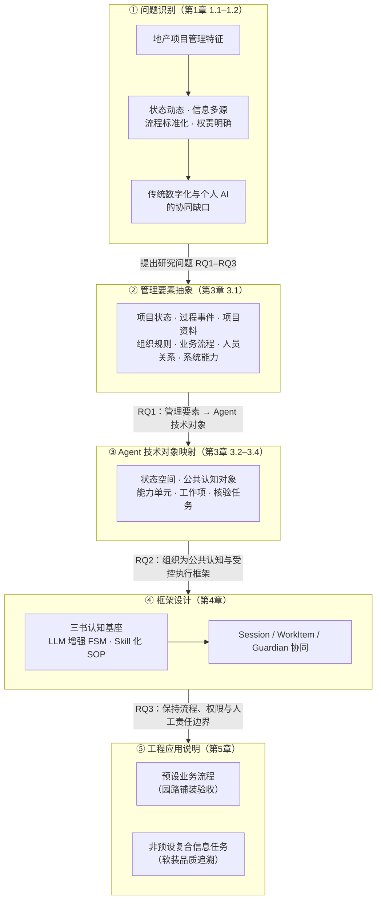
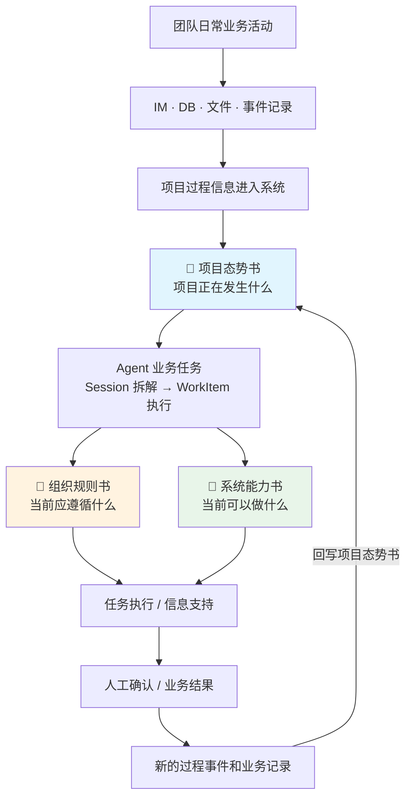

# 论文图 1 与图 4 —— Mermaid 源

> 用途：V5.2 投稿终稿版论文的两张核心图，均含 Mermaid 源码，可直接导出为 SVG/PNG
> 图题在下方（GB 格式），中文表述

---

## 图 1 总体研究思路

**位置**：第 1 章 1.3 节 研究问题与研究思路
**尺寸**：单栏（约 7.5 cm × 10 cm），纵向排版

> 注：研究思路采用"问题识别—管理要素抽象—Agent 对象映射—框架设计—工程应用说明"五段式，由地产管理特征出发，识别传统数字化与个人 AI 之间的协同缺口，逐级收敛到信息协同型 AI 智能体框架，并以两个真实业务实例说明框架落地。

---

## 图 4 三书驱动的信息协同运行闭环

**位置**：第 4 章 4.7 节 信息协同运行闭环
**尺寸**：通栏（约 15 cm × 9 cm），纵向排版

> 注：项目过程信息构成持续更新的"热记忆"，组织规则书与系统能力书作为与热记忆关联的两个认知维度，共同形成 Agent 运行所需的信息交汇与架构地图。闭环起点为团队日常业务活动，终点以新的过程事件回写项目态势书，实现"业务活动 → 公共认知 → 任务支持 → 新的活动"的持续复用。
