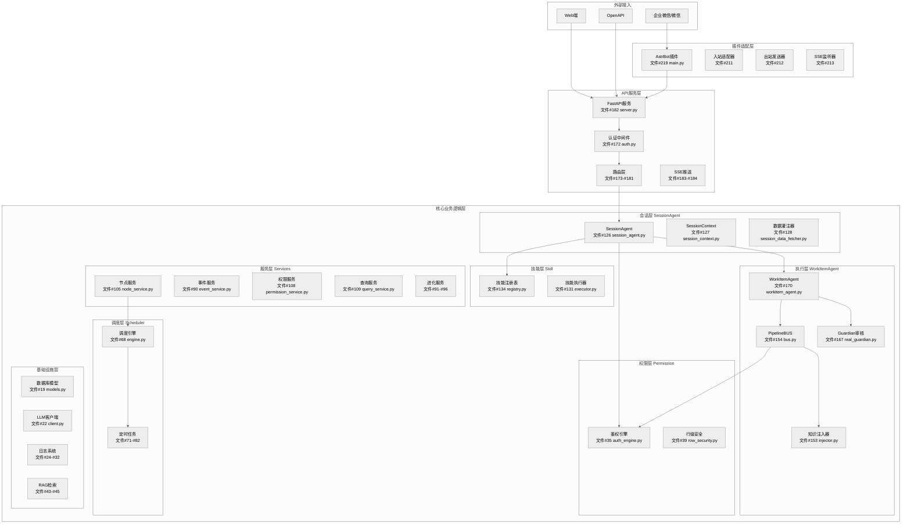
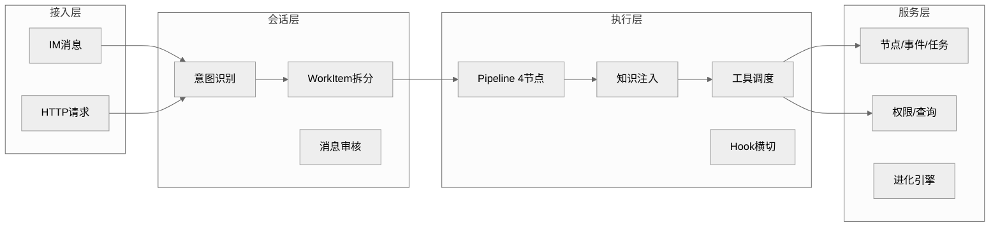
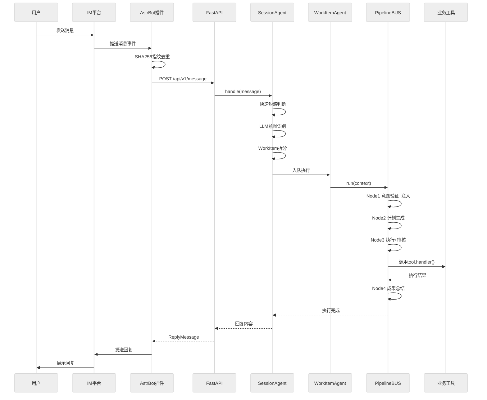
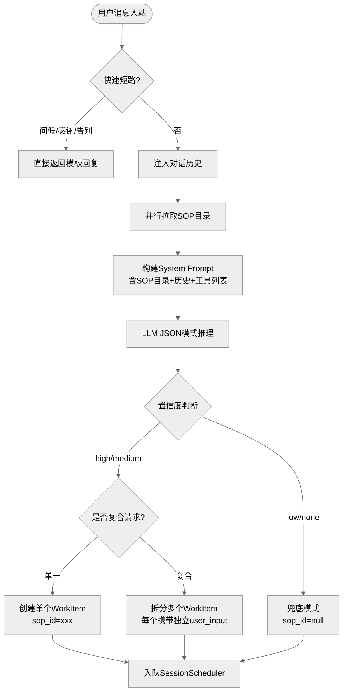
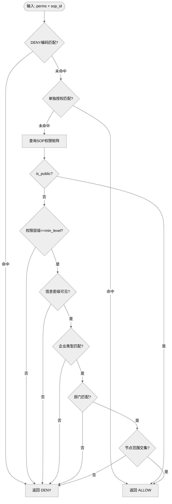
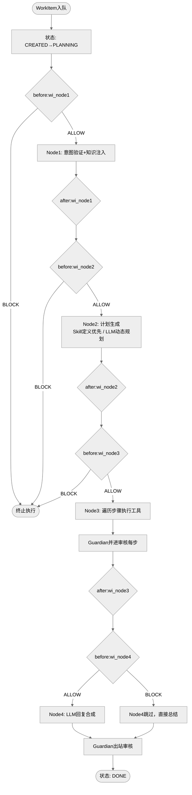
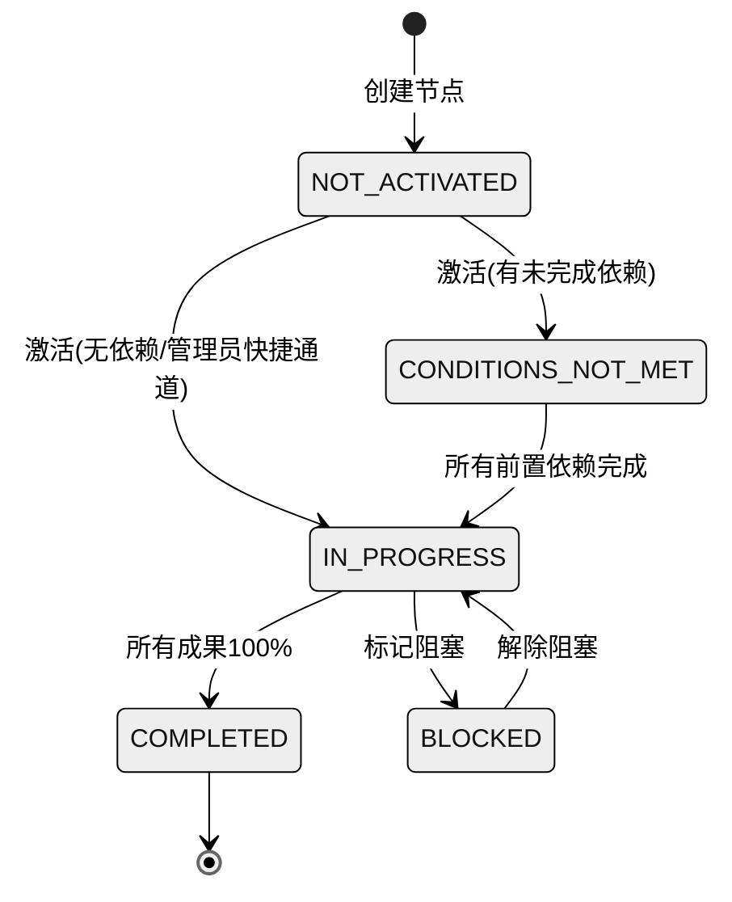
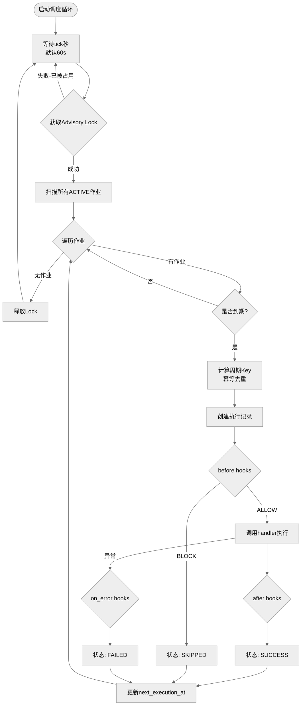
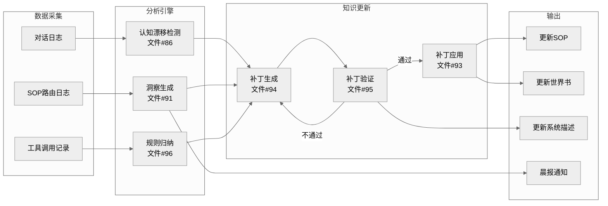
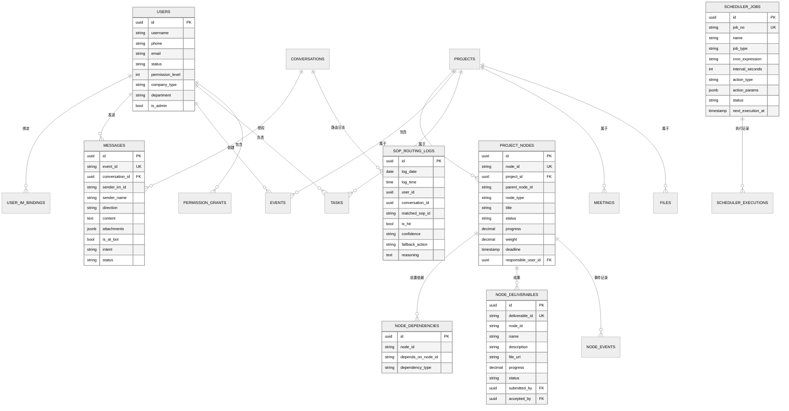

-- Active: 1782440591477@@127.0.0.1@25432@emily
# 艾米地产项目人工智能调度管理系统

## 文档鉴别材料（软件设计说明书）

### 版本：V1.0

***

## 目录

1. [软件概述](#1-软件概述)
2. [系统架构设计](#2-系统架构设计)
3. [核心功能模块](#3-核心功能模块)
4. [关键算法与流程](#4-关键算法与流程)
5. [数据库设计](#5-数据库设计)
6. [交互模式说明](#6-交互模式说明)
7. [典型应用场景](#7-典型应用场景)
8. [版本历史](#8-版本历史)

***

## 1. 软件概述

### 1.1 基本信息

| 项目   | 内容               |
| ---- | ---------------- |
| 软件名称 | 艾米地产项目人工智能调度管理系统 |
| 软件简称 | Emily            |
| 版本号  | V1.0             |
| 开发语言 | Python 3         |
| 数据库  | PostgreSQL       |
| 运行环境 | Docker 容器化部署     |

### 1.2 软件定位

Emily 是一款面向地产项目全生命周期的智能协作管理平台。系统以三层 Agent 架构为核心，将 LLM（大语言模型）的语义理解能力与工程项目管理的精确调度需求深度融合，实现从自然语言到业务执行的闭环。

**交互形态说明**：本软件未设独立 UI 界面，是基于主流 IM 即时通讯工具（企业微信、微信等）的信息交互软件。用户无需安装额外客户端，直接在熟悉的聊天工具中 @机器人 即可完成全部业务操作，系统以对话形式反馈执行结果、推送巡检通知和日报。同时提供 HTTP API 接口供 Web 端等外部系统集成。

### 1.3 核心价值

- **智能调度**：用户以自然语言下达指令，系统自动识别意图、匹配SOP流程、调度工具执行
- **全景管控**：项目节点按状态机自动流转，进度实时计算、异常自动告警
- **三维权限**：权限层级 × 信息密级 × 资源范围，矩阵式鉴权保障数据安全
- **持续进化**：内置认知漂移检测、规则归纳、补丁生成等自进化机制

### 1.4 技术选型

| 层级    | 技术                       |
| ----- | ------------------------ |
| 后端框架  | Python AsyncIO + FastAPI |
| ORM   | SQLAlchemy               |
| 数据库   | PostgreSQL + JSONB       |
| LLM引擎 | OpenAI兼容接口（多模型支持）        |
| 接入渠道  | 企业微信/微信（AstrBot）/ Web端   |
| 知识检索  | MaxKB / 本地RAG fallback   |
| 部署    | Docker + docker-compose  |

### 1.5 源代码规模

本项目共包含 **220 个核心源代码文件**，详见程序鉴别材料，涵盖核心业务逻辑层、API服务层、系统脚本层和插件适配层四大层级。

***

## 2. 系统架构设计

### 2.1 总体架构（三层Agent）



### 2.2 分层架构说明



**核心设计原则**：

- 接入层负责消息标准化和渠道适配（文件#209-#218）
- 会话层负责意图理解和任务拆分（文件#119-#129）
- 执行层负责流程编排和工具调用（文件#153-#171）
- 服务层负责业务逻辑和数据持久化（文件#84-#118）

### 2.3 消息流转全景



***

## 3. 核心功能模块

### 3.1 会话调度与智能对话

**功能概述**：用户通过自然语言与系统交互，系统自动识别意图并执行对应操作。支持私聊和群聊两种模式，群聊中仅 @机器人 的消息被处理。

**实现文件**：

| 文件编号 | 文件路径                              | 职责                                     |
| ---- | --------------------------------- | -------------------------------------- |
| 126  | session/session\_agent.py         | 会话主脑，意图识别、WorkItem拆分、消息审核              |
| 127  | session/session\_context.py       | 会话上下文，对话历史管理                           |
| 128  | session/session\_data\_fetcher.py | 数据灌注器，Session创建时注入权限/SOP/RAG/工具/Schema |
| 129  | session/session\_state.py         | 会话状态枚举（CREATED/ACTIVE/ARCHIVED）        |
| 125  | session/focus\_lock.py            | 焦点锁，防止多话题交叉干扰                          |

**快速短路机制**：常见问候语、感谢语、告别语直接返回模板回复，无需 LLM 参与，实现毫秒级响应（见文件#126，`_try_fast_reply` 方法）。

**数据灌注机制**：Session 创建时由 SessionDataFetcher 并行拉取五大上下文（见文件#128）：

- 权限上下文（用户级别/密级/企业类型）
- SOP 目录树
- RAG 知识摘要
- 可用工具列表
- 可见数据库 Schema

### 3.2 SOP标准化作业流程

**功能概述**：基于预定义的 SOP 模板，引导用户按规范完成业务操作。每份 SOP 包含前置条件、操作步骤、验收标准和异常处理方案。

**实现文件**：

| 文件编号 | 文件路径                      | 职责                 |
| ---- | ------------------------- | ------------------ |
| 9    | agent/sop\_parser.py      | SOP文档解析，提取章节结构化内容  |
| 130  | skill/definition.py       | Skill定义数据结构        |
| 131  | skill/executor.py         | Skill执行器，按步骤驱动工具调用 |
| 132  | skill/param\_extractor.py | 参数提取器，从用户输入提取结构化参数 |
| 133  | skill/parser.py           | Skill YAML文件解析     |
| 134  | skill/registry.py         | Skill注册表，扫描加载/热重载  |
| 135  | skill/validator.py        | 参数校验器              |

**内置 SOP 清单**：

| SOP ID       | 名称     | Skill文件                         | 说明           |
| ------------ | ------ | ------------------------------- | ------------ |
| SOP-001-REC  | 会议纪要归档 | SOP-001-REC-meeting\_summary.md | 会议记录与待办提取    |
| SOP-002-REC  | 事件记录   | SOP-002-REC-event\_record.md    | 质量/安全/进度事件记录 |
| SOP-003-REC  | 任务管理   | SOP-003-REC-task\_manage.md     | 任务创建/分配/追踪   |
| SOP-004-FILE | 文件归档   | SOP-004-FILE-file\_archive.md   | 工程文件上传与分类    |
| SOP-005-QRY  | 数据查询   | SOP-005-QRY-data\_query.md      | 项目数据多维度检索    |
| SOP-007-REC  | 用户记忆   | SOP-007-REC-user\_memory.md     | 用户偏好记忆       |
| SOP-008-SYS  | 待确认处理  | SOP-008-SYS-pending\_issue.md   | 待确认事项处理      |
| SOP-011-SYS  | 节点管理   | SOP-011-SYS-node\_manage.md     | 全景节点树管理      |
| SOP-999-SYS  | 兜底模式   | SOP-999-SYS-fallback.md         | 自由工具调用+RAG检索 |

### 3.3 WorkItem 执行引擎

**功能概述**：全局唯一的 WorkItemAgent 通过 4 节点 Pipeline 执行每个工作项，从意图验证到成果总结形成完整闭环。

**实现文件**：

| 文件编号 | 文件路径                                | 职责                                  |
| ---- | ----------------------------------- | ----------------------------------- |
| 170  | workitem/workitem\_agent.py         | WorkItemAgent核心，定义4节点handler        |
| 169  | workitem/workitem.py                | WorkItem数据结构                        |
| 171  | workitem/workitem\_state.py         | WorkItem状态枚举                        |
| 168  | workitem/scheduler.py               | SessionScheduler，WorkItem排队与分配      |
| 153  | workitem/injector.py                | KnowledgeInjector，增量灌注SOP/工具/Schema |
| 154  | workitem/pipeline/bus.py            | PipelineBUS，4节点公共执行总线               |
| 155  | workitem/pipeline/context.py        | BusContext，执行上下文                    |
| 156  | workitem/pipeline/hook.py           | Hook机制，三态决策ALLOW/WARN/BLOCK         |
| 157  | workitem/pipeline/hook\_registry.py | Hook注册表                             |
| 167  | workitem/pipeline/real\_guardian.py | Guardian，LLM内容安全审核                  |

**4 节点说明**：

| 节点        | 名称      | 职责                                 |
| --------- | ------- | ---------------------------------- |
| wi\_node1 | 意图验证+注入 | 验证路由决策，KnowledgeInjector增量灌注所需知识   |
| wi\_node2 | 计划+标准   | Skill定义优先，否则LLM动态规划生成ExecutionPlan |
| wi\_node3 | 执行+验收   | 遍历步骤调用工具handler，Guardian并进审核每步输出   |
| wi\_node4 | 成果总结    | LLM合成自然语言回复，Guardian出站内容审核         |

### 3.4 Pipeline Hook 横切机制

**功能概述**：每个 Pipeline 节点支持 3 个 Hook 挂载点（before/after/on\_error），实现鉴权、审计、日志等横切关注点的声明式注入。

**三态决策**：ALLOW（放行）/ WARN（放行但记录警告）/ BLOCK（阻断执行）

**deny always wins 原则**：任一 before hook BLOCK → 立即终止执行，before hook 异常视为 BLOCK。

**预置 Hook 示例**：

- `before:wi_node1` → AuthenticationHook（鉴权检查）
- `after:wi_node3` → AuditLogHook（执行审计记录）
- `after:wi_node4` → NotificationHook（进度通知推送）

### 3.5 三维权限控制

**功能概述**：以"权限层级 × 信息密级 × 资源范围"三维矩阵实现精确到字段的访问控制。

**实现文件**：

| 文件编号 | 文件路径                            | 职责           |
| ---- | ------------------------------- | ------------ |
| 35   | permission/auth\_engine.py      | 三维鉴权引擎       |
| 36   | permission/cache.py             | 权限缓存（矩阵+白名单） |
| 37   | permission/code\_compiler.py    | 权限编码编译器      |
| 38   | permission/level.py             | 权限层级定义与树形继承  |
| 39   | permission/row\_security.py     | 行级安全过滤器      |
| 108  | services/permission\_service.py | 权限管理服务       |

**权限维度**：

| 维度   | 内容                                   | 说明              |
| ---- | ------------------------------------ | --------------- |
| 权限层级 | L0访客 \~ L5系统管理员                      | 树形继承，上级包含下级所有权限 |
| 信息密级 | PUBLIC/INTERNAL/PRIVATE/CONFIDENTIAL | 不可见性由低到高        |
| 资源范围 | 企业类型/部门/节点范围                         | 精确到具体项目节点       |

**鉴权短路优先级**：DENY > 单独授权 > TEMP临时 > PERMANENT永久 > AUTO自动

### 3.6 全景节点图

**功能概述**：将工程项目拆分为多层级节点树，每个节点独立进行状态流转和进度计算，实现项目全景可视化管控。

**实现文件**：

| 文件编号 | 文件路径                             | 职责                          |
| ---- | -------------------------------- | --------------------------- |
| 105  | services/node\_service.py        | 节点CRUD、状态流转、进度计算（1028行核心逻辑） |
| 106  | services/node\_state\_machine.py | 状态机引擎，依赖/成果/进度计算            |
| 104  | services/node\_commands.py       | 节点操作命令定义                    |
| 102  | services/node\_batch.py          | 批量节点操作                      |
| 103  | services/node\_batch\_update.py  | 批量更新引擎                      |
| 54   | repositories/node\_repo.py       | 节点数据访问层                     |

**节点状态定义**：

```
NOT_ACTIVATED → CONDITIONS_NOT_MET → IN_PROGRESS → COMPLETED
                    ↑                    ↓
                    +--------------------+
                                     BLOCKED → IN_PROGRESS
```

**进度计算**：父节点进度 = Σ(子节点进度 × 子节点权重) / Σ(子节点权重)

### 3.7 智能调度引擎

**功能概述**：基于 CRON/INTERVAL/ONCE 三种调度模式的定时任务引擎，驱动节点巡检、日报生成、数据同步等自动化运维。

**实现文件**：

| 文件编号 | 文件路径                           | 职责                        |
| ---- | ------------------------------ | ------------------------- |
| 68   | scheduler/engine.py            | 调度引擎核心，Advisory Lock分布式调度 |
| 69   | scheduler/handler\_registry.py | 作业Handler注册表              |
| 70   | scheduler/hook\_registry.py    | 调度Hook注册表                 |
| 83   | scheduler/service.py           | 作业管理服务                    |

**内置定时任务**：

| 文件编号 | 任务                             | 说明       |
| ---- | ------------------------------ | -------- |
| 71   | daily\_insight.py              | 每日洞察生成   |
| 74   | morning\_report.py             | 晨报生成     |
| 75   | node\_deadlines.py             | 节点截止日期检查 |
| 76   | patch\_validator.py            | 补丁验证     |
| 77   | periodic\_node.py              | 周期性节点巡检  |
| 78   | rule\_induction.py             | 规则归纳     |
| 79   | session\_cleanup.py            | 会话清理     |
| 80   | system\_description\_update.py | 系统描述更新   |
| 82   | world\_book\_update.py         | 世界书更新    |

### 3.8 进化引擎

**功能概述**：系统持续从运行日志中学习，自动生成认知补丁、归纳业务规则、检测认知漂移，实现"越用越聪明"的自进化能力。

**实现文件**：

| 文件编号 | 文件路径                                           | 职责                |
| ---- | ---------------------------------------------- | ----------------- |
| 91   | services/evolution/insight\_generator.py       | 洞察生成器，从对话日志提炼改进建议 |
| 92   | services/evolution/morning\_report\_builder.py | 晨报构建器             |
| 93   | services/evolution/patch\_applier.py           | 补丁应用器             |
| 94   | services/evolution/patch\_generator.py         | 补丁生成器             |
| 95   | services/evolution/patch\_validator.py         | 补丁验证器             |
| 96   | services/evolution/rule\_inductor.py           | 规则归纳器             |
| 86   | services/cognition\_drift\_detector.py         | 认知漂移检测            |
| 111  | services/schema\_drift\_detector.py            | Schema漂移检测        |

### 3.9 业务工具集

**功能概述**：15+ 个可被 LLM 动态调用的业务工具，封装了事件记录、任务管理、文件归档、会议纪要等核心业务操作。

**实现文件**：

| 文件编号 | 文件路径                              | 功能      |
| ---- | --------------------------------- | ------- |
| 140  | tools/event\_tool.py              | 事件记录工具  |
| 152  | tools/task\_tool.py               | 任务管理工具  |
| 141  | tools/file\_tool.py               | 文件管理工具  |
| 143  | tools/meeting\_tool.py            | 会议纪要工具  |
| 149  | tools/query\_tool.py              | 数据查询工具  |
| 139  | tools/email\_tool.py              | 邮件工具    |
| 144  | tools/memory\_tool.py             | 用户记忆工具  |
| 146  | tools/node\_tool.py               | 节点管理工具  |
| 147  | tools/node\_voice\_entry\_tool.py | 语音录入工具  |
| 148  | tools/pending\_issue\_tool.py     | 待确认事项工具 |
| 142  | tools/knowledge\_search\_tool.py  | 知识检索工具  |
| 137  | tools/chat\_archive\_tool.py      | 聊天归档工具  |

### 3.10 系统脚本层

**功能概述**：24 个独立脚本覆盖系统初始化、冷启动、进化循环、自检等运维场景。

**关键脚本**：

| 文件编号 | 文件路径                                  | 功能                         |
| ---- | ------------------------------------- | -------------------------- |
| 189  | scripts/cold\_start.py                | 冷启动：初始化检查→世界书构建→邮件通知       |
| 188  | scripts/cognition\_cycle.py           | 认知循环：定期复盘→生成洞察→应用补丁        |
| 206  | scripts/self\_check.py                | 系统自检：数据库→LLM→RAG→文件存储全链路检查 |
| 185  | scripts/build\_system\_description.py | 系统描述构建                     |
| 186  | scripts/build\_world\_book.py         | 世界书构建                      |
| 192  | scripts/evolution.py                  | 进化主流程                      |
| 203  | scripts/manage\_nodes.py              | 节点管理                       |

***

## 4. 关键算法与流程

### 4.1 LLM 意图识别与 WorkItem 拆分



### 4.2 三维鉴权短路求值



### 4.3 Pipeline 4节点执行流程



### 4.4 节点状态机流转



### 4.5 调度引擎 Tick 循环



### 4.6 认知进化循环



***

## 5. 数据库设计

### 5.1 核心ER关系图



### 5.2 核心表结构说明

#### 5.2.1 users（用户表）

| 字段名               | 类型           | 说明                       |
| ----------------- | ------------ | ------------------------ |
| id                | UUID PK      | 用户唯一标识                   |
| username          | VARCHAR(100) | 用户名/真实姓名                 |
| phone             | VARCHAR(50)  | 手机号                      |
| email             | VARCHAR(200) | 邮箱                       |
| status            | VARCHAR(50)  | active/suspended/deleted |
| permission\_level | INTEGER      | 权限层级0-5                  |
| company\_type     | VARCHAR(50)  | 建设/设计/总包/分包/监理/供应商       |
| department        | VARCHAR(100) | 所属部门                     |
| is\_admin         | BOOLEAN      | 管理员标记                    |

#### 5.2.2 project\_nodes（项目节点表）

| 字段名                   | 类型              | 说明                                                                 |
| --------------------- | --------------- | ------------------------------------------------------------------ |
| node\_id              | VARCHAR(100) UK | 业务节点编号                                                             |
| project\_id           | UUID FK         | 所属项目                                                               |
| parent\_node\_id      | VARCHAR(100)    | 父节点（树形结构）                                                          |
| node\_type            | VARCHAR(50)     | 阶段/子阶段/任务/成果                                                       |
| title                 | VARCHAR(500)    | 节点标题                                                               |
| status                | VARCHAR(50)     | NOT\_ACTIVATED/CONDITIONS\_NOT\_MET/IN\_PROGRESS/BLOCKED/COMPLETED |
| progress              | DECIMAL(5,2)    | 完成百分比0-100                                                         |
| weight                | DECIMAL(5,2)    | 权重（父节点进度计算用）                                                       |
| deadline              | TIMESTAMP       | 截止时间                                                               |
| responsible\_user\_id | UUID FK         | 责任人                                                                |

#### 5.2.3 messages（消息记录表）

| 字段名              | 类型              | 说明                                |
| ---------------- | --------------- | --------------------------------- |
| event\_id        | VARCHAR(100) UK | 幂等去重键                             |
| conversation\_id | UUID FK         | 会话ID                              |
| sender\_im\_id   | VARCHAR(200)    | IM平台发件人ID                         |
| direction        | VARCHAR(50)     | user\_to\_agent / agent\_to\_user |
| content          | TEXT            | 消息内容                              |
| attachments      | JSONB           | 附件列表                              |
| is\_at\_bot      | BOOLEAN         | 是否@机器人                            |
| intent           | VARCHAR(100)    | 识别出的SOP意图                         |

#### 5.2.4 scheduler\_jobs（调度作业表）

| 字段名                 | 类型             | 说明                    |
| ------------------- | -------------- | --------------------- |
| job\_no             | VARCHAR(50) UK | 作业编号                  |
| job\_type           | VARCHAR(20)    | CRON/INTERVAL/ONCE    |
| cron\_expression    | VARCHAR(100)   | Cron表达式               |
| interval\_seconds   | INTEGER        | 间隔秒数                  |
| action\_type        | VARCHAR(50)    | 动作类型                  |
| action\_params      | JSONB          | 动作参数                  |
| status              | VARCHAR(20)    | DRAFT/ACTIVE/INACTIVE |
| next\_execution\_at | TIMESTAMP      | 下次执行时间                |

#### 5.2.5 sop\_routing\_logs（SOP路由日志表）

| 字段名              | 类型          | 说明                        |
| ---------------- | ----------- | ------------------------- |
| log\_date        | DATE        | 日志日期                      |
| matched\_sop\_id | VARCHAR(50) | 匹配的SOP标识                  |
| is\_hit          | BOOLEAN     | 是否命中                      |
| confidence       | VARCHAR(10) | 置信度(high/medium/low/none) |
| fallback\_action | VARCHAR(30) | 兜底动作类型                    |
| reasoning        | TEXT        | LLM判断理由                   |

***

## 6. 交互模式说明

本软件未设独立 UI 界面，基于以下两种模式与用户及外部系统交互：

### 6.1 IM 对话交互模式

用户通过企业微信/微信等 IM 工具的群聊或私聊，以 @机器人 方式与系统对话。系统以自然语言回复执行结果，并主动推送巡检告警、晨报等通知。

**交互特点**：

- **零安装**：直接使用现有 IM 工具，无需安装额外客户端
- **群聊协作**：项目成员在群内 @机器人 下达指令，全员可见执行结果，信息透明
- **主动推送**：系统通过出站总线主动推送节点逾期告警、每日晨报、认知洞察等通知
- **上下文记忆**：同一会话内保持对话历史，支持追问与澄清

**交互示例**：

```
用户（企业微信群聊）：
  @Emily 帮我记录：今天3号楼样板段放线完成，验收通过

Emily：
  [OK] 事件已记录
  事件编号：EVT-20260711-0001
  事件类型：进度事件
  事件标题：3号楼样板段放线完成验收通过

  同时创建以下待办任务：
  [ ] TSK-001 防水工程进场准备（责任人：王工）
     截止时间：2026-07-12
```

### 6.2 HTTP API 接口模式

系统提供 RESTful API 供 Web 端、外部系统或脚本调用。所有 API 经过认证中间件鉴权，返回 JSON 格式数据。

**核心 API 路由**：

| 路由                       | 方法       | 说明         | 实现文件                    |
| ------------------------ | -------- | ---------- | ----------------------- |
| `/api/v1/session`        | POST     | 创建/恢复会话    | #180 session.py         |
| `/api/v1/message`        | POST     | 处理入站消息     | #175 message.py         |
| `/api/v1/node`           | GET/POST | 节点查询与管理    | #177 node.py            |
| `/api/v1/node/schemas`   | GET      | 节点Schema查询 | #178 node\_schemas.py   |
| `/api/v1/permission`     | GET/POST | 权限查询与配置    | #179 permission.py      |
| `/api/v1/evolution`      | GET/POST | 进化数据查询     | #173 evolution.py       |
| `/api/v1/skills`         | GET      | Skill列表查询  | #181 skills.py          |
| `/api/v1/meta-cognition` | GET      | 元认知状态查询    | #176 meta\_cognition.py |
| `/api/v1/health`         | GET      | 健康检查       | #174 health.py          |

### 6.3 SSE 实时推送

系统通过 Server-Sent Events 机制向订阅方推送实时状态变更，核心实现见文件 #183（node\_events.py）和 #184（outbound.py）。

**推送事件类型**：

| 事件类型          | 说明              |
| ------------- | --------------- |
| node.progress | 节点进度更新          |
| node.status   | 节点状态变更          |
| workitem.step | WorkItem 执行步骤进展 |
| notification  | 巡检告警、晨报等主动通知    |

***

## 7. 典型应用场景

### 7.1 场景一：事件快速记录

**参与角色**：现场工程师\
**对应SOP**：SOP-002-REC（事件记录）\
**核心文件**：#126 SessionAgent + #140 EventTool

```
用户：@Emily 记录质量问题：3号楼10层剪力墙垂直度偏差8mm，
      已通知分包整改，限期明天完成。[现场照片.jpg]

系统执行流程：
1. SessionAgent 快速短路判定 → 非问候，进入意图识别
2. LLM匹配 → SOP-002-REC（置信度 high）
3. WorkItem 创建 → Pipeline 执行：
   Node1: 验证SOP存在 + 注入SOP全文
   Node2: 提取结构化参数（类型=质量, 位置=3号楼10层, 偏差=8mm）
   Node3: EventTool.handler()创建事件 + 自动创建整改任务
   Node4: 合成回复 →「[OK] 质量事件已记录…」
```

### 7.2 场景二：数据智能查询

**参与角色**：项目资料员\
**对应SOP**：SOP-005-QRY（数据查询）\
**核心文件**：#126 SessionAgent + #149 QueryTool + #109 QueryService

```
用户：Emily，查一下分户验收的规范要求有哪些？

系统执行流程：
1. LLM匹配 → SOP-005-QRY
2. KnowledgeInjector 注入RAG知识摘要 + 可见数据库Schema
3. Node3: QueryTool 双路径检索：
   a) RAG语义检索 → 知识库中找到《住宅工程分户验收规程》
   b) DB查询 → 补充项目历史验收记录
4. Node4: LLM合成结构化回复（含规范条文 + 历史记录引用）
```

### 7.3 场景三：自动化巡检告警

**参与角色**：系统自动触发\
**调度作业**：node\_deadlines（文件#75）\
**核心文件**：#68 SchedulerEngine + #105 NodeService

```
系统每日09:00自动巡检：

1. SchedulerEngine tick循环触发 node_deadlines 作业
2. 扫描规则：
   - 超过7天无进展 → 标记为"关注"
   - 3天内到期 → 提醒责任人
   - 前置依赖已完成但未激活 → 激活提示
   - 成果超期未验收 → 提醒验收人
3. 通过出站总线推送巡检结果到项目群
```

***

## 8. 版本历史

### V1.0（当前版本）

**核心功能清单**：

| 序号 | 功能模块                   | 状态 | 关键文件             |
| -- | ---------------------- | -- | ---------------- |
| 1  | 三层Agent架构              | [OK]  | #126, #170, #154 |
| 2  | LLM意图识别与SOP匹配          | [OK]  | #126, #9         |
| 3  | Pipeline 4节点执行引擎       | [OK]  | #154, #156, #167 |
| 4  | 三维权限控制体系               | [OK]  | #35, #36, #39    |
| 5  | 全景节点树与状态机              | [OK]  | #105, #106       |
| 6  | CRON/INTERVAL/ONCE调度引擎 | [OK]  | #68, #71-#82     |
| 7  | 15+业务工具集               | [OK]  | #136-#152        |
| 8  | Skill定义与执行框架           | [OK]  | #130-#135        |
| 9  | 认知进化引擎(洞察/补丁/规则)       | [OK]  | #91-#96          |
| 10 | 企业微信/微信(AstrBot)接入     | [OK]  | #209-#220        |
| 11 | Session上下文5维数据灌注       | [OK]  | #128             |
| 12 | Guardian内容安全审核         | [OK]  | #167             |
| 13 | RAG知识检索(MaxKB/本地)      | [OK]  | #43-#45          |
| 14 | 完整审计日志体系               | [OK]  | #24-#32          |
| 15 | 冷启动与自检脚本               | [OK]  | #189, #206       |

**技术特性**：

- AsyncIO异步架构，支持高并发会话处理
- Pipeline Hook插件化横切机制（鉴权/审计/通知）
- 幂等去重（消息SHA256指纹 + 调度周期Key）
- Advisory Lock分布式调度防重
- 树形权限继承 + 三级密级控制
- 文件SHA256哈希去重存储

***

**文档编制说明**：
本文档为艾米地产项目人工智能调度管理系统的软件设计说明书，用于软件著作权登记之目的。文档中所有功能描述均基于项目实际代码实现，文件编号索引与程序鉴别材料严格对应（共220个文件）。

**编制日期**：2026年7月\
**版本**：V1.0
