# 生态城26#地（设计+工程） — 全景节点索引

> **生成时间**：2026-06-29 23:24
> **数据来源**：`emily-data/baseknowledge/生态城26#地.xlsx` Sheet6「全生命周期节点计划」
> **解析器**：SOP-012-FLOW v2.0
> **筛选范围**：仅包含 设计(SJ) + 工程(SG) 阶段
> **节点总数**：1341 | **一级**：1 | **二级**：22

---

## 阶段概览

| 阶段码 | 阶段名称 | 节点数 | 一级 | 二级 |
|--------|---------|--------|------|------|
| SJ | 设计阶段 | 27 | 0 | 1 |
| SG | 工程施工阶段 | 683 | 1 | 6 |

---

## 全景节点图

> **说明**：实线 = WBS层级推断依赖；虚线 = 阶段间推断依赖（需人工确认）。仅展示 L1+L2 关键节点（23个）。

```mermaid
%%{init: {"theme": "dark", "flowchart": {"nodeSpacing": 20, "rankSpacing": 50}}}%%
flowchart TB

    subgraph SJ_Stage [设计阶段]
        SJ_0001["施工图完成并通过内外审核"]:::subNode
    end

    subgraph SG_Stage [工程施工阶段]
        SG_0001["开工、建设"]:::mainNode
        SG_0002["取得工程规划许可证"]:::subNode
        SG_0016["取得施工许可证"]:::subNode
        SG_0027["开工准备"]:::subNode
        SG_0032["首批次取得预售许可证（含正负零..."]:::subNode
        SG_0041["工程施工阶段"]:::subNode
        SG_0680["竣工验收完成"]:::subNode
    end

    classDef mainNode fill:#4a4a4a,stroke:#ffb74d,stroke-width:2px
    classDef subNode fill:#353535,stroke:#888888,stroke-width:1px
    SG_0001 -->|WBS| SG_0002
    SG_0001 -->|WBS| SJ_0001
    SG_0001 -->|WBS| CB_0001
    SG_0001 -->|WBS| CB_0013
    SG_0001 -->|WBS| SG_0016
    SG_0001 -->|WBS| SG_0027
    SG_0001 -->|WBS| SG_0032
    SG_0001 -->|WBS| YX_0001
    SG_0001 -->|WBS| YX_0011
    SG_0001 -->|WBS| YX_0021
    SG_0001 -->|WBS| YX_0031
    SG_0001 -->|WBS| YX_0041
    SG_0001 -->|WBS| YX_0046
    SG_0001 -->|WBS| YX_0055
    SG_0001 -->|WBS| YX_0065
    SG_0001 -->|WBS| YX_0079
    SG_0001 -->|WBS| YX_0080
    SG_0001 -->|WBS| YX_0081
    SG_0001 -->|WBS| YX_0091
    SG_0001 -->|WBS| CB_0075
    SG_0001 -->|WBS| SG_0041
    SG_0001 -->|WBS| SG_0680
```

> 💡 如果 Mermaid 图没有渲染出来，请安装 VS Code 插件 `Markdown Preview Mermaid Support`，或复制 mermaid 代码块到 <https://mermaid.live/> 查看。

---

> 📂 **大文件已拆分**：节点树明细（1341 节点按阶段缩进）见 [`生态城26#地（设计+工程）-节点树明细.md`](./生态城26#地（设计+工程）-节点树明细.md)

---

---

## 关键里程碑表

| 节点编号 | 节点名称 | 级别 | 责任部门 | 计划完成时间 | 完成标准摘要 |
|----------|---------|------|---------|-------------|------------|
| SG-0001 | 开工、建设 | 一级 | 各部门 | 【缺失】 | 1、自土地摘牌之日起，75日历天取得总包施工许可证； 2、自土地摘牌之日起，14 |
| SG-0002 | 取得工程规划许可证 | 二级 | 开发部 | 【缺失】 | 自土地摘牌之日起，68日历天取得工程规划许可证；施工证取得前7日历天完成 |
| SJ-0001 | 施工图完成并通过内外审核 | 二级 | 设计部/李超 | 【缺失】 | 1、土地摘牌之日起，66日历天取得外部图审合格证； 2、土地摘牌之日起，72日历 |
| CB-0001 | 总包内部定标 | 二级 | 项目经理 | 2019-01-30 | 自土地摘牌之日起，65日历天完成区域定标会；70日历天内完成内部定标审批； |
| CB-0013 | 涉及基础部分分包定标 | 二级 | 项目经理 | 2019-02-20 | 自土地摘牌之日起，60日历天完成区域定标会； |
| SG-0016 | 取得施工许可证 | 二级 | 开发部 | 【缺失】 | 自土地摘牌之日起，75日历天前取得总包施工许可证 |
| SG-0027 | 开工准备 | 二级 | 工程部 | 【缺失】 | 自土地摘牌之日起，75日历天前完成开工准备 |
| SG-0032 | 首批次取得预售许可证（含正负零） | 二级 | 开发部 | 【缺失】 | 自土地摘牌之日起，148日历天取得第一批次销许；3#、4#、7# |
| YX-0001 | 2019年一批次取得预售许可证 | 二级 | 苗青 | 2019-03-30 | 自土地摘牌之日起，241天取得销许；叠拼8#、9#、13#； |
| YX-0011 | 2019年二批次取得预售许可证 | 二级 | 苗青 | 2019-05-15 | 自土地摘牌之日起，287天取得销许；叠拼10#、12#、14#、18#、19#、 |
| YX-0021 | 2019年三批次预售许可证 | 二级 | 苗青 | 2019-07-15 | 自土地摘牌之日起，348天取得销许；叠拼15#、16#、17#、22#、 |
| YX-0031 | 2019年四批次预售许可证 | 二级 | 苗青 | 2019-09-15 | 自土地摘牌之日起，379天取得销许；20#、23#、24#、28#、11#、21 |
| YX-0041 | 展示区、样板间开放 | 二级 | 项目经理 | 2019-07-15 | 自土地摘牌之日起，147日历天展示区开放（含样板间和售楼处） |
| YX-0046 | 开盘 | 二级 | 营销部 | 【缺失】 | 自土地摘牌之日起，150日历天开盘 |
| YX-0055 | 签约 | 二级 | 营销部 | 【缺失】 | 生态城项目2019年，全年住宅签约完成12.2亿。月底最后一天24点前，达成月度 |
| YX-0065 | 回款 | 二级 | 营销部 | 【缺失】 | 生态城项目2019年完成住宅签约回款10.9亿 |
| YX-0079 | 销售净利率 | 二级 | 营销部 | 【缺失】 | 年度销售净利率不低于5%。月底最后一天24点前，达成月度费效指标。 |
| YX-0080 | 营销费率 | 二级 | 营销 | 【缺失】 | 年度营销费率1.8%（销售费率1.3%，企划推广费效0.5%。）月底最后一天24 |
| YX-0081 | 企划推广 | 二级 | 营销 | 【缺失】 | 月度推广方案汇报与执行，周度暖场活动开展。月底最后一天24点前，达成月度费效指标 |
| YX-0091 | 渠道拓客 | 二级 | 营销 | 【缺失】 | 月底最后一天24点，按照每月指标完成到访量，成交量。 |
| CB-0075 | 分项工程招标定标 | 二级 | 项目经理 | 2020-09-30 | 自土地摘牌之日起，65日历天完成区域定标会；70日历天内完成内部定标审批； |
| SG-0041 | 工程施工阶段 | 二级 | 工程部 | 2020-10-30 | 1、自开工之日起，65天内完成正负零施工； 2、自开工之日起，240天内完成主体 |
| SG-0680 | 竣工验收完成 | 二级 | 项目经理 | 2020-11-15 | 1、交付前45天完成各分项验收及竣工验收 2、交付前45天取得竣工验收质量监督报 |

---

## 依赖关系概览

- **WBS 层级推断依赖**：1340 条（每个子节点依赖其父节点）
- **阶段间推断依赖**：1 条（按阶段排序推断）

> ⚠️ **注意**：Excel 文件中未显式标注节点间依赖关系。以上所有依赖均为 Agent 基于 WBS 层级和阶段顺序的推断。已确认的依赖用实线，推断的依赖用虚线。详见《缺失依赖清单》。

---

## 数据质量检查

| 检查项 | 数量 | 影响 |
|--------|------|------|
| 完成标准缺失 | 9 | 影响节点的验收依据，建议补充 |
| 责任部门缺失 | 67 | 影响节点的责任追踪，建议补充 |
| 计划时间缺失 | 266 | 影响进度计划的制定 |
| 节点名称重复 | 53 | 可能造成混淆，建议人工确认 |
