# 生态城26#地（设计+工程） — 全景节点索引

> **生成时间**：2026-06-29 23:47
> **数据来源**：`emily-data/baseknowledge/生态城26#地.xlsx` Sheet6「全生命周期节点计划」
> **解析器**：SOP-012-FLOW v2.0
> **筛选范围**：仅 设计(SJ) + 工程(SG) 阶段
> **节点总数**：710 | **一级**：1 | **二级**：7

---

## 阶段概览

| 阶段码 | 阶段名称 | 节点数 | 一级 | 二级 |
|--------|---------|--------|------|------|
| SJ | 设计阶段 | 27 | 0 | 1 |
| SG | 工程施工阶段 | 683 | 1 | 6 |

---

## 全景节点图

> **说明**：实线 = WBS层级推断依赖；虚线 = 阶段间推断依赖（需人工确认）。仅展示 L1+L2 关键节点（8个）。

```mermaid
%%{init: {"theme": "dark", "flowchart": {"nodeSpacing": 20, "rankSpacing": 50}}}%%
flowchart TB

    subgraph SJ_Stage [设计阶段]
        SJ_0001["施工图完成并通过内外审核"]:::subNode
    end

    subgraph SG_Stage [工程施工阶段]
        SG_0001["开工、建设"]:::mainNode
        SG_0002["取得工程规划许可证"]:::subNode
        SG_0016["取得施工许可证"]:::subNode
        SG_0027["开工准备"]:::subNode
        SG_0032["首批次取得预售许可证（含正负零..."]:::subNode
        SG_0041["工程施工阶段"]:::subNode
        SG_0680["竣工验收完成"]:::subNode
    end

    classDef mainNode fill:#4a4a4a,stroke:#ffb74d,stroke-width:2px
    classDef subNode fill:#353535,stroke:#888888,stroke-width:1px
    SG_0001 -->|WBS| SG_0002
    SG_0001 -->|WBS| SJ_0001
    SG_0001 -->|WBS| SG_0016
    SG_0001 -->|WBS| SG_0027
    SG_0001 -->|WBS| SG_0032
    SG_0001 -->|WBS| SG_0041
    SG_0001 -->|WBS| SG_0680
```

> 💡 如果 Mermaid 图没有渲染出来，请安装 VS Code 插件 `Markdown Preview Mermaid Support`，或复制 mermaid 代码块到 <https://mermaid.live/> 查看。

---

> 📂 **大文件已拆分**：节点树明细（710 节点按阶段缩进）见 [`生态城26#地（设计+工程）-节点树明细.md`](./生态城26#地（设计+工程）-节点树明细.md)

---

---

## 关键里程碑表

| 节点编号 | 节点名称 | 级别 | 责任部门 | 计划完成时间 | 完成标准摘要 |
|----------|---------|------|---------|-------------|------------|
| SG-0001 | 开工、建设 | 一级 | 各部门 | 【缺失】 | 1、自土地摘牌之日起，75日历天取得总包施工许可证； 2、自土地摘牌之日起，14 |
| SG-0002 | 取得工程规划许可证 | 二级 | 开发部 | 【缺失】 | 自土地摘牌之日起，68日历天取得工程规划许可证；施工证取得前7日历天完成 |
| SJ-0001 | 施工图完成并通过内外审核 | 二级 | 设计部/李超 | 【缺失】 | 1、土地摘牌之日起，66日历天取得外部图审合格证； 2、土地摘牌之日起，72日历 |
| SG-0016 | 取得施工许可证 | 二级 | 开发部 | 【缺失】 | 自土地摘牌之日起，75日历天前取得总包施工许可证 |
| SG-0027 | 开工准备 | 二级 | 工程部 | 【缺失】 | 自土地摘牌之日起，75日历天前完成开工准备 |
| SG-0032 | 首批次取得预售许可证（含正负零） | 二级 | 开发部 | 【缺失】 | 自土地摘牌之日起，148日历天取得第一批次销许；3#、4#、7# |
| SG-0041 | 工程施工阶段 | 二级 | 工程部 | 2020-10-30 | 1、自开工之日起，65天内完成正负零施工； 2、自开工之日起，240天内完成主体 |
| SG-0680 | 竣工验收完成 | 二级 | 项目经理 | 2020-11-15 | 1、交付前45天完成各分项验收及竣工验收 2、交付前45天取得竣工验收质量监督报 |

---

## 依赖关系概览

- **WBS 层级推断依赖**：709 条（每个子节点依赖其父节点）
- **阶段间推断依赖**：1 条（按阶段排序推断）

> ⚠️ **注意**：Excel 文件中未显式标注节点间依赖关系。以上所有依赖均为 Agent 基于 WBS 层级和阶段顺序的推断。已确认的依赖用实线，推断的依赖用虚线。详见《缺失依赖清单》。

### 阶段间推断依赖

| 上游节点 | 下游节点 | 推断依据 | 置信度 |
|---------|---------|---------|--------|
| SJ-0027 (取得图审合格正) | SG-0001 (开工、建设) | 阶段间推断 | 低（需人工确认） |

---

## 数据质量检查

| 检查项 | 数据 |
|--------|------|
| 完成标准缺失 | 3 个节点（0%） |
| 责任部门缺失 | 0 个节点（0%） |
| 计划时间缺失 | 82 个节点（11%） |
| 名称重复 | 23 处 |
| 重复名称示例 | 确定图审单位(2次), 数字化信息录入(2次), 设计院完成意见回复(2次), 取得图审合格正(2次), 叠拼第一批次叠拼/一批次7栋楼（3#、4#、5#、6#、19#、25#、27#）(63次) |

---

## 列映射推断

| Excel原始列名 | 推断含义 | 映射目标字段 | 映射方式 |
|-------------|---------|------------|---------|
| 级别 | WBS层级（一级~八级） | plan_level | 直接映射 |
| 计划节点名称 | 节点名称（含括号阶段标注） | node_name | 直接映射（清理括号标注） |
| 完成标准 | 完成判定标准（自由文本） | criteria | 直接映射 |
| 主责单位 | 主办责任部门（含具体责任人） | owner | 直接映射 |
| 双向考核单位 | 协办/考核部门 | supervisor_unit | 语义推断 |
| 开始时间（Excel序列数） | 计划开始日期 | planned_start_date | 序列数→日期转换 |
| 周期（天数） | 计划工期 | duration | 直接映射 |
| 完成时间（Excel序列数） | 计划结束日期 | planned_end_date | 序列数→日期转换 |
| 28栋叠拼及5栋洋房（月列） | 月度时段标记 | — | 未解析（时间轴可视化用） |