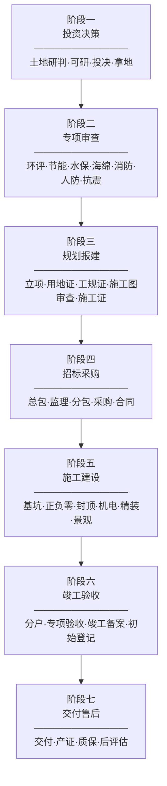
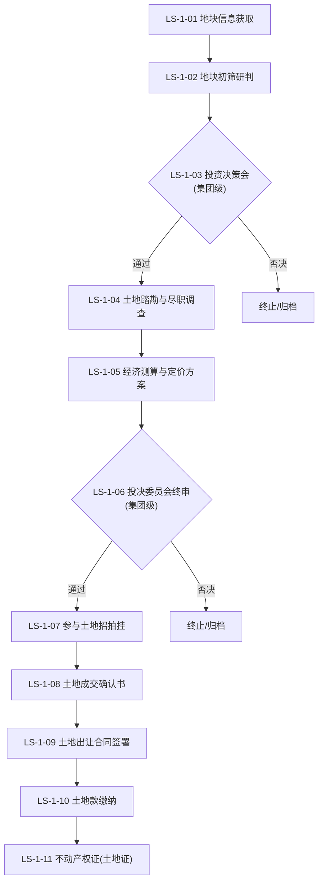
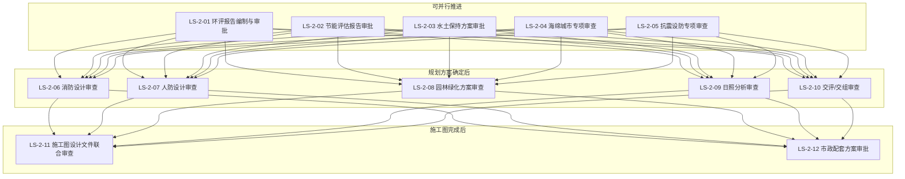
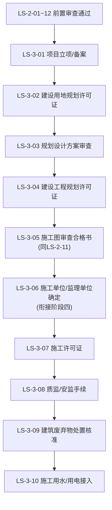
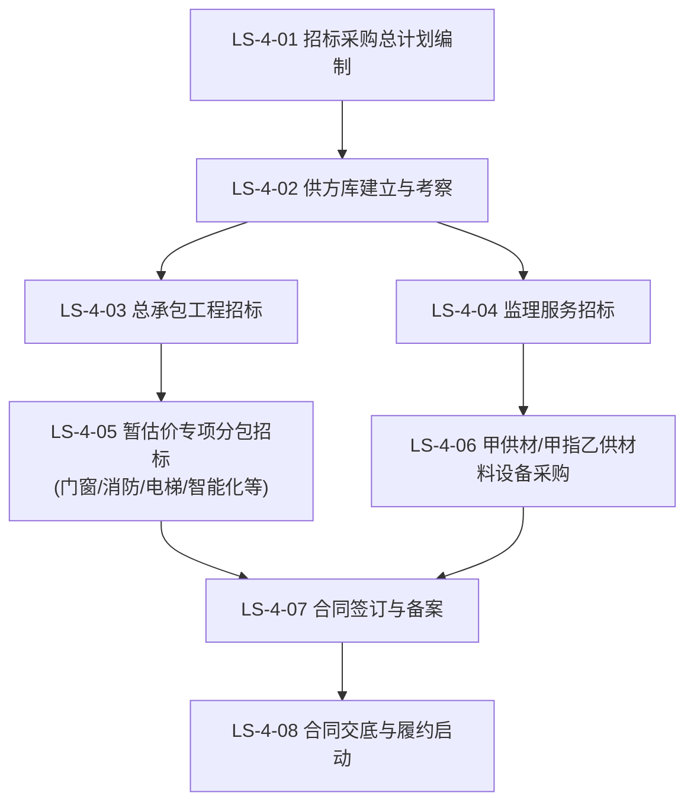
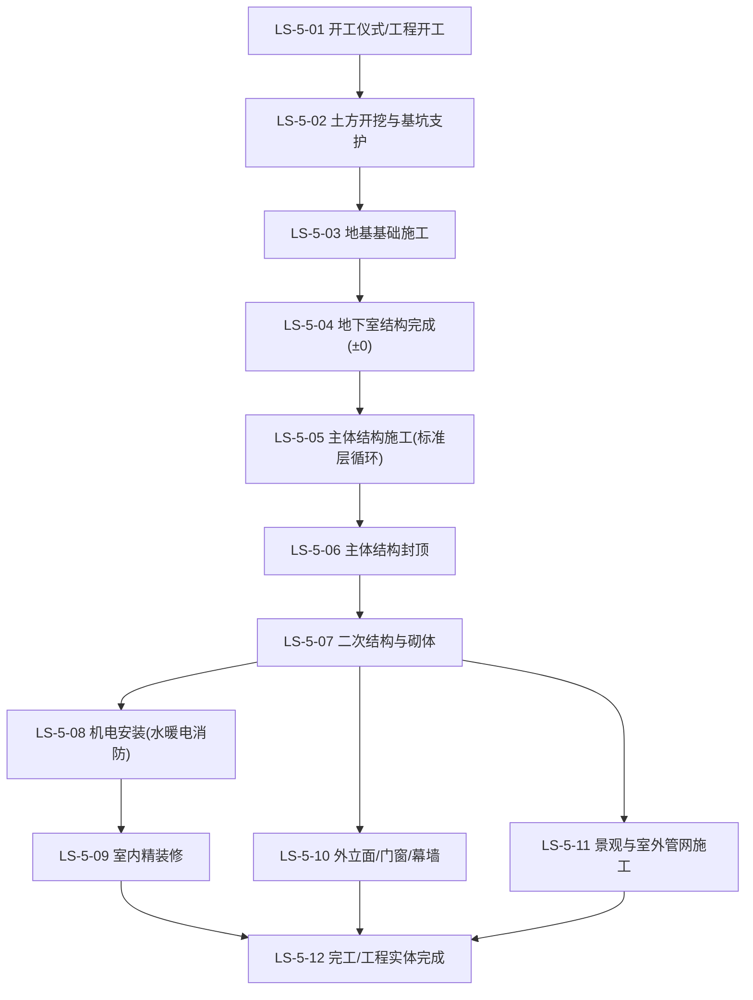
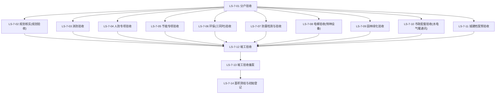
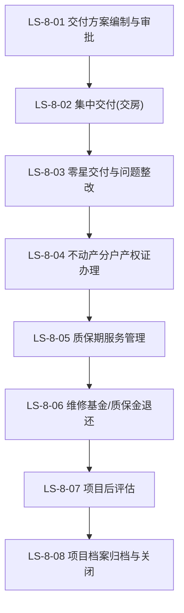
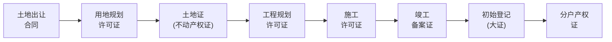
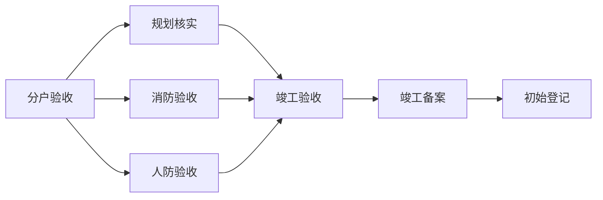

# 住宅地产项目全生命周期节点路线图

> **适用范围**：集团下属10-50万㎡标准住宅/商住混合独立项目
> **管控层级**：三级管控体系（集团-区域-项目）
> **配套文档**：[项目组织管控体系.md](项目组织管控体系.md) — 组织架构·岗位权责·审批流程
> **输出形式**：Mermaid 主图 + 7阶段子图 + 节点说明表 + 全量节点台账

---

## 一、全生命周期总览

住宅地产项目全生命周期是指从土地研判到交付后评估的完整过程，涵盖 **7 大阶段、约 75 个管控节点**。

> **说明**：阶段间存在交叉搭接——如专项审查可在投资决策阶段后期先行启动，招标采购可与规划报建并行。上图展示的是主线时序逻辑，实际项目应根据里程碑制定具体搭接计划。

---

## 二、阶段一：投资决策阶段

> **阶段总述**：从地块信息获取到土地出让合同签署，是整个项目最前端的风控关口。
> **核心目标**：在合法合规前提下，以合理对价获取可开发土地。
> **主责部门**：集团/区域投资拓展部、财务管理部、法务审计部

### 2.1 Mermaid 流程图

### 2.2 节点说明表

| 编号 | 节点名称 | 节点等级 | 负责岗位 | 配合岗位 | 前置条件 | 产出成果清单 | 成果质量标准 | 标准工期 |
|------|----------|----------|----------|----------|----------|--------------|--------------|----------|
| LS-1-01 | 地块信息获取 | 三级 | 投资拓展主管(集团/区域) | 区域总 | 供地计划发布/勾地信息获取 | 地块信息卡（位置/面积/容积率/限高/配建要求等） | 信息完整度≥90%，含四至红线图、规划条件、出让底价 | 按供地节奏 |
| LS-1-02 | 地块初筛研判 | 二级 | 投资拓展主管(集团/区域) | 设计部经理、成本部经理、营销部经理、财务经理 | LS-1-01 地块信息卡完备 | 初筛报告（含强排方案、成本匡算、售价预估、IRR初算） | IRR≥集团投资门槛，无颠覆性合规风险 | 7-10个工作日 |
| LS-1-03 | 投资决策会(立项) | 一级 | 集团总经理 | 区域总、投资拓展部、法务主管 | LS-1-02 初筛报告通过部门会签 | 投决会纪要、立项批复 | 集团总经理签发，明确是否进入尽调阶段 | 按投决会排期 |
| LS-1-04 | 土地踏勘与尽职调查 | 二级 | 投资拓展主管(集团/区域) | 法务主管、审计主管、营销部经理、设计部经理 | LS-1-03 投决会同意立项 | 尽调报告（法律尽调+财务尽调+工程尽调+市场尽调）、风险评估矩阵 | 尽调覆盖：权属、抵押、查封、拆迁、污染、地下管线、规划红线；法律意见书由集团法务审核签字 | 15-30个工作日 |
| LS-1-05 | 经济测算与定价方案 | 二级 | 投资拓展主管(集团/区域) | 财务经理、成本部经理、营销部经理 | LS-1-04 尽调报告无实质障碍 | 详细经济测算模型（含敏感性分析）、初步定价方案 | IRR/NPV/ROE 多情景测算，含±15%敏感性分析 | 5-7个工作日 |
| LS-1-06 | 投决委员会终审 | 一级 | 集团总经理 | 投决会全体委员 | LS-1-05 经济测算+LS-1-04 尽调报告 | 正式投决批复、授权举牌价区间 | 集团总经理签发，明确授权底价、最高价及付款条件 | 按投决会排期 |
| LS-1-07 | 参与土地招拍挂 | 一级 | 投资拓展主管(集团/区域) | 法务主管、财务经理 | LS-1-06 投决批复 | 竞买申请书、保证金缴纳凭证、竞买报价单 | 报价不超过投决会授权最高价；保证金按时足额缴纳 | 按出让公告时间 |
| LS-1-08 | 土地成交确认书 | 一级 | 投资拓展主管(集团/区域) | 法务主管 | LS-1-07 竞得(摘牌成功) | 《成交确认书》原件 | 自然资源部门盖章生效，载明成交价、付款期限、交地时间 | 摘牌当日/次日 |
| LS-1-09 | 土地出让合同签署 | 一级 | 投资拓展主管(集团/区域) | 法务主管(集团)、项目总经理 | LS-1-08 成交确认书 | 《国有建设用地使用权出让合同》 | 双方签章，合同条款符合投决批复条件(付款节奏/交地标准) | 成交后10个工作日内 |
| LS-1-10 | 土地款缴纳 | 一级 | 财务经理 | 投资拓展主管、集团财务部 | LS-1-09 出让合同约定的付款节点 | 土地出让金缴款凭证、契税完税证明 | 足额按时缴纳，逾期产生每日0.05%滞纳金 | 按合同约定期限 |
| LS-1-11 | 不动产权证(土地证) | 一级 | 开发部经理 | 投资拓展主管、财务经理 | LS-1-10 全部土地款+契税缴纳完毕 | 《不动产权证书》(土地) | 不动产登记中心登记，权利人、面积、用途、年限准确 | 资料齐全后15个工作日 |

---

## 三、阶段二：专项审查阶段

> **阶段总述**：在取得土地证后、方案报建前/并行推进的各专项合规审查，是工规证的前置条件池。
> **核心目标**：逐项取得各职能部门的审查批复，为规划方案审批扫清障碍。
> **主责部门**：设计管理部、开发报建部

### 3.1 Mermaid 流程图

### 3.2 节点说明表

| 编号 | 节点名称 | 节点等级 | 负责岗位 | 配合岗位 | 前置条件 | 产出成果清单 | 成果质量标准 | 标准工期 |
|------|----------|----------|----------|----------|----------|--------------|--------------|----------|
| LS-2-01 | 环评报告编制与审批 | 二级 | 开发部经理 | 设计部经理、建筑设计主管 | LS-1-11 土地证；委托有资质环评机构 | 《环境影响报告表/书》及审批意见 | 通过属地生态环境局审批；如涉及土壤污染需先完成土壤调查 | 报告编制30日+审批15-30日 |
| LS-2-02 | 节能评估报告审批 | 二级 | 开发部经理 | 设计部经理、强弱电设计主管、暖通设计主管 | LS-1-11 土地证；委托有资质节能评估机构 | 《节能评估报告》及审查意见 | 通过属地发改委/住建局审批，满足当地节能标准(如绿建一星以上) | 编制20日+审批10-15日 |
| LS-2-03 | 水土保持方案审批 | 二级 | 开发部经理 | 设计部经理、景观设计主管 | 项目占地≥1万㎡或土方量≥5万m³需编制水保方案 | 《水土保持方案报告书》及审批意见 | 通过属地水务局审批，明确水保监测与补偿费缴纳标准 | 编制20日+审批15日 |
| LS-2-04 | 海绵城市专项审查 | 二级 | 设计部经理 | 建筑设计主管、给排水设计主管、景观设计主管 | 规划方案初步确定 | 《海绵城市专项设计方案》及审查意见 | 通过住建局海绵办审查，满足当地雨水年径流总量控制率要求 | 方案设计15日+审批15日 |
| LS-2-05 | 抗震设防专项审查 | 二级 | 设计部经理 | 建筑设计主管、结构设计 | 结构方案与初步设计完成 | 《抗震设防专项审查意见书》 | 通过属地住建局抗震办审批(超限高层须报省住建厅) | 审查15日 |
| LS-2-06 | 消防设计审查 | 二级 | 开发部经理 | 给排水设计主管、强弱电设计主管、暖通设计主管 | 规划方案审定；建筑专业施工图基本完成 | 《建设工程消防设计审查意见书》 | 通过属地住建局消防审查(纯住宅一般工程可备案抽查制，特殊工程须许可制) | 审查15-20日 |
| LS-2-07 | 人防设计审查 | 二级 | 开发部经理 | 建筑设计主管、结构设计 | 规划方案审定；确定人防应建面积/易地建设方案 | 《人防工程设计审查意见书》或《人防易地建设审批表》+缴费凭证 | 通过属地人防办审批；易地建设费按时足额缴纳 | 审查15-20日 |
| LS-2-08 | 园林绿化方案审查 | 三级 | 景观设计主管 | 开发部经理 | 景观方案设计完成 | 《园林绿化方案审查意见书》 | 绿地率满足规划条件要求(通常住宅≥30-35%) | 审查10-15日 |
| LS-2-09 | 日照分析审查 | 三级 | 建筑设计主管 | 开发部经理 | 建筑方案总平面图确定；委托有资质日照分析机构 | 《日照分析报告》及审查意见 | 被遮挡住宅满足当地日照标准(冬至日/大寒日最低日照时数)；无重大日照信访风险 | 分析7日+审查7日 |
| LS-2-10 | 交评/交组审查 | 三级 | 建筑设计主管 | 开发部经理 | 总平面图确定；地下车库方案确定 | 《交通影响评价报告》/《交通组织方案》及审查意见 | 通过属地交警/交通局审查；出入口满足道路红线退距要求 | 分析15日+审查15日 |
| LS-2-11 | 施工图设计文件联合审查 | 二级 | 设计部经理 | 各专业设计主管 | 全专业施工图设计完成；消防/人防/抗震专项已通过 | 《施工图设计文件审查合格书》(含建筑/结构/给排水/电气/暖通专业) | 通过有资质施工图审查机构审查；审查意见逐条闭合 | 审查15-30日(含修改闭环) |
| LS-2-12 | 市政配套方案审批 | 三级 | 给排水设计主管 | 强弱电设计主管、暖通设计主管、开发部经理、配套报建专员 | 施工图审查通过 | 供水/供电/燃气/热力/通讯/雨污水接驳方案审批件各一份 | 各市政垄断单位(供水公司/供电局/燃气公司/热力公司)分别审批通过 | 各专项15-30日不等 |

---

## 四、阶段三：规划报建阶段

> **阶段总述**：从项目立项到取得施工许可证，是依法开工的前置审批链。主线为：用地证→工规证→施工证。
> **核心目标**：取得全部合法开工手续。
> **主责部门**：开发报建部

### 4.1 Mermaid 流程图

### 4.2 节点说明表

| 编号 | 节点名称 | 节点等级 | 负责岗位 | 配合岗位 | 前置条件 | 产出成果清单 | 成果质量标准 | 标准工期 |
|------|----------|----------|----------|----------|----------|--------------|--------------|----------|
| LS-3-01 | 项目立项/备案 | 二级 | 开发部经理 | 投资拓展主管、财务经理 | LS-1-11 土地证；LS-2-02 节能审查通过 | 《企业投资项目备案证》或《项目核准批复》 | 通过发改委/经信委备案或核准；项目代码获取 | 备案5个工作日/核准20个工作日 |
| LS-3-02 | 建设用地规划许可证 | 二级 | 规划报建专员 | 开发部经理 | LS-1-09 土地出让合同；LS-3-01 立项备案 | 《建设用地规划许可证》 | 自然资源局核发；用地性质、面积、红线与出让合同一致 | 10-15个工作日 |
| LS-3-03 | 规划设计方案审查 | 二级 | 规划报建专员 | 设计部经理、建筑设计主管 | LS-3-02 用地证；方案设计完成；各专项审查通过 | 《规划设计方案审定通知书》 | 规划局/自然资源局组织联审通过；总平面图、建筑单体方案、综合管网方案三审定稿 | 提交后20-30个工作日(含公示10日) |
| LS-3-04 | 建设工程规划许可证 | 二级 | 规划报建专员 | 开发部经理、建筑设计主管 | LS-3-03 规划方案审定；LS-2-06 消防/07 人防/05 抗震审查通过 | 《建设工程规划许可证》 | 自然资源局核发；计容面积、建筑高度、退距、车位配比等关键指标与审定方案一致 | 10-15个工作日 |
| LS-3-05 | 施工图审查合格书 | 二级 | 设计部经理 | 各专业设计主管 | 全专业施工图完成；消防/人防专项已批 | 《施工图设计文件审查合格书》 | 同LS-2-11，此处为报施工证的前置校验节点 | 详见LS-2-11 |
| LS-3-06 | 施工/监理单位确定 | 二级 | 成本部经理 | 招标采购专员、工程部经理 | 招标完成或直接发包备案完成 | 中标通知书 / 直接发包备案表；施工合同 / 监理合同 | 总包单位具备相应资质等级(不低于二级)；监理单位具备相应资质 | 衔接阶段四 |
| LS-3-07 | 施工许可证 | 二级 | 工程报建专员 | 开发部经理、工程部经理、成本部经理 | 五前置：①LS-3-04工规证+②LS-3-05施工图审查+③LS-3-06施工/监理合同+④建设资金落实证明+⑤施工组织设计审查通过 | 《建筑工程施工许可证》 | 住建局核发；建设单位、工程名称、建设规模、合同价格、合同工期信息准确 | 资料齐全后7个工作日 |
| LS-3-08 | 质监/安监手续 | 三级 | 工程报建专员 | 安全总监、工程部经理 | LS-3-07 施工许可证 | 工程质量监督注册证书、施工安全监督备案表 | 质监站/安监站受理通过；人脸识别考勤系统(实名制)安装就绪 | 与施工证同步/3日内 |
| LS-3-09 | 建筑废弃物处置核准 | 三级 | 工程报建专员 | 土建工程主管 | LS-3-07 施工许可证 | 《城市建筑垃圾处置核准许可证》 | 城管局/环卫局核发；排放量、运输车辆、消纳场所备案 | 3-5个工作日 |
| LS-3-10 | 施工用水/用电接入 | 三级 | 水电工程主管 | 配套报建专员 | LS-3-07 施工许可证 | 施工临时用水/用电接入完毕并可用 | 满足施工临电容量要求(通常≥500kVA)；临水满足施工消防与生活需求 | 申请后7-15日 |

---

## 五、阶段四：招标采购阶段

> **阶段总述**：从总包招标到专项分包、材料设备采购，贯穿施工前及施工早期。
> **核心目标**：依法合规选定工程承包商与供应商，控制采购成本在目标成本内。
> **主责部门**：成本合约部

### 5.1 Mermaid 流程图

### 5.2 节点说明表

| 编号 | 节点名称 | 节点等级 | 负责岗位 | 配合岗位 | 前置条件 | 产出成果清单 | 成果质量标准 | 标准工期 |
|------|----------|----------|----------|----------|----------|--------------|--------------|----------|
| LS-4-01 | 招标采购总计划编制 | 二级 | 成本部经理 | 工程部经理、设计部经理、财务经理 | LS-3-04 工规证取得后启动；目标成本已批复 | 《项目招标采购总计划》含招标界面划分、采购方式、时间节点、预估金额 | 覆盖所有合同包；界面无漏项/无重叠；采购方式符合集团采购管理制度(公开招标/邀请招标/竞争性谈判/直接发包) | 编制7日+审批5日 |
| LS-4-02 | 供方库建立与考察 | 三级 | 招标采购专员 | 工程部经理、成本部经理 | LS-4-01 招标总计划 | 合格供方名录、考察报告 | 每类招标≥3家合格投标人；考察报告含履约能力/管理体系/在建同类项目实地踏勘评价 | 15-30日 |
| LS-4-03 | 总承包工程招标 | 二级 | 招标采购专员 | 成本部经理、工程部经理、法务主管 | LS-4-01 招标计划批复；LS-3-05 施工图审查通过；标底/最高限价编制完成 | 招标文件、工程量清单、评标报告、中标通知书 | 招标流程符合《招标投标法》及当地规定；最低价中标或综合评分法；合同价不超目标成本 | 招标公告至中标通知书45-60日 |
| LS-4-04 | 监理服务招标 | 三级 | 招标采购专员 | 成本部经理、工程部经理 | LS-4-01 招标计划批复 | 监理招标文件、评标报告、中标通知书、监理合同 | 监理单位资质满足项目规模要求(住宅项目乙级及以上) | 30-45日 |
| LS-4-05 | 暂估价专项分包招标 | 三级 | 招标采购专员 | 成本部经理、工程部经理、设计部经理(技术标) | 主体总包合同签订后进行；各项技术参数确认 | 各项专项分包中标通知书与合同：门窗/消防/电梯/智能化/精装/景观/外保温/涂料等 | 各专项界面清晰、不重不漏；合同价在总包暂估价范围内或经审批调整 | 各专项30-45日 |
| LS-4-06 | 甲供材/甲指乙供材料设备采购 | 三级 | 招标采购专员 | 土建造价主管、安装造价主管、设计部经理 | 施工图材料表完成；封样确认 | 甲供材采购合同/订单、甲指乙供品牌库封样清单 | 材料品牌/规格满足设计要求；价格在目标成本以内；供货周期匹配施工进度 | 各采购15-30日 |
| LS-4-07 | 合同签订与备案 | 二级 | 合同管理员 | 法务主管(集团)、招标采购专员 | 中标通知书发出；合同条款谈判完成 | 正式签章的合同文本、合同备案凭证(住建局) | 合同金额、工期、质量、付款条款与招标文件/中标通知书一致；法务审核无保留意见 | 中标通知书后30日内 |
| LS-4-08 | 合同交底与履约启动 | 三级 | 招标采购专员 | 工程部经理、成本部经理、合同管理员 | LS-4-07 合同签订 | 合同交底会议纪要、履约保函、预付款保函 | 工程/成本/设计/财务各条线明确各自合同责任；保函金额/格式/有效期合规 | 合同签订后7日内 |

---

## 六、阶段五：施工建设阶段

> **阶段总述**：从开工到完工的实体建造全过程，是工期、质量、安全、成本四大管控的主战场。
> **核心目标**：在目标成本内、按计划工期、达到质量标准、零安全事故完成建造。
> **主责部门**：工程管理部

### 6.1 Mermaid 流程图

### 6.2 节点说明表

| 编号 | 节点名称 | 节点等级 | 负责岗位 | 配合岗位 | 前置条件 | 产出成果清单 | 成果质量标准 | 标准工期 |
|------|----------|----------|----------|----------|----------|--------------|--------------|----------|
| LS-5-01 | 开工仪式/工程开工 | 三级 | 工程部经理 | 项目总经理、安全总监、土建工程主管 | LS-3-07 施工许可证取得；施工组织设计审批通过；场地三通一平完成 | 开工令、开工报告报监 | 施工许可证在场内公示；实名制通道、扬尘监测、洗车台等文明施工设施到位 | 施工证取得后7日内 |
| LS-5-02 | 土方开挖与基坑支护 | 二级 | 土建工程主管 | 安全总监、工程部经理 | LS-5-01 开工令签批；深基坑方案专家论证通过(超5m)；基坑监测方案审批 | 土方外运台账、基坑监测报告(周边沉降+位移)、基坑验收记录 | 基坑安全等级满足设计要求；监测数据在警戒值内；支护结构无重大渗漏/变形 | 1-3个月(视基坑深度与面积) |
| LS-5-03 | 地基基础施工 | 二级 | 土建工程主管 | 工程部经理、设计部经理(验槽) | LS-5-02 基坑验收合格；基础施工方案审批；桩基检测合格 | 地基验槽记录、桩基检测报告、基础钢筋隐蔽验收记录、基础混凝土试块报告 | 持力层满足设计要求；桩基承载力和完整性检测合格(一类桩≥95%，不允许四类桩)；基础分部验收合格 | 1-3个月 |
| LS-5-04 | 地下室结构完成(±0) | 一级 | 工程部经理 | 土建工程主管 | LS-5-03 基础验收通过；地下室外防水完成；回填土完成 | ±0结构验收记录、地下室防水效果检查记录 | 结构无裂缝/渗漏/冷缝；轴线/标高/截面尺寸偏差在规范允许范围内(GB50204) | 1-3个月(视地下室层数与面积) |
| LS-5-05 | 主体结构施工(标准层循环) | 三级 | 土建工程主管 | 工程部经理、成本部(进度款审核) | LS-5-04 ±0完成；铝模/爬架方案审批(如采用) | 逐层钢筋/模板/混凝土验收记录、标养/同条件试块报告、沉降观测记录 | 每层轴线垂直度偏差不超15mm；混凝土强度满足设计；沉降速率在稳定标准内 | 标准层5-7日/层 |
| LS-5-06 | 主体结构封顶 | 一级 | 工程部经理 | 土建工程主管 | LS-5-05 顶层结构施工完成 | 封顶仪式记录、主体结构分部验收记录、沉降观测终期报告 | 主体结构分部验收合格；沉降趋于稳定(最后100天沉降速率≤0.01mm/d)；砌体插入条件具备 | 从±0起约5-8个月(视层数) |
| LS-5-07 | 二次结构与砌体 | 三级 | 土建工程主管 | 精装工程主管(界面移交) | LS-5-06 主体封顶；主体验收合格 | 砌体/圈梁/构造柱/门窗过梁的验收记录、烟道/风道安装验收 | 砌体灰缝饱满度≥80%，垂直度/平整度符合GB50203；砌体养护到位(顶部斜砌间隔7日) | 1-3个月 |
| LS-5-08 | 机电安装(水暖电消防) | 二级 | 水电工程主管 | 土建工程主管、精装工程主管 | LS-5-07 砌体(管井/设备房)完成 | 给排水管道试压记录、电气绝缘测试记录、消防管道试压记录、通风管道漏光测试记录 | 管道试压合格(给水1.5倍工作压力)；电线电缆绝缘电阻达标；管道标识清晰；综合管线无碰撞 | 3-6个月(与精装交叉) |
| LS-5-09 | 室内精装修 | 二级 | 精装工程主管 | 精装设计主管、水电工程主管 | LS-5-08 隐蔽工程(水电)验收；精装工作面移交验收 | 逐户精装过程验收记录、材料进场检验报告、成品保护记录、精装问题销项清单 | 墙面/地面平整度2m靠尺≤3mm，阴阳角方正≤3mm；木地板无空鼓；橱柜/洁具/开关面板安装牢固端正 | 4-8个月 |
| LS-5-10 | 外立面/门窗/幕墙 | 三级 | 土建工程主管(兼) | 成本部(甲供材核验) | LS-5-07 外墙体完成；门窗洞口尺寸复核 | 外立面保温/涂料/石材验收记录、门窗淋水试验记录、幕墙分项验收记录 | 外窗淋水试验合格(30分钟无渗漏)；外立面颜色/线条与效果图一致(设计部确认)；保温层厚度满足节能设计 | 2-4个月 |
| LS-5-11 | 景观与室外管网施工 | 三级 | 景观工程主管 | 景观设计主管、水电工程主管(管综) | LS-5-08 室外综合管网施工完成；室外土方平整完成 | 景观软硬质验收记录、苗木验收记录、园路/铺装/围墙/大门验收记录 | 乔灌木成活率≥95%；铺装平整度≤3mm落差；排水坡度正确无明显积水 | 2-4个月(含管综) |
| LS-5-12 | 完工/工程实体完成 | 一级 | 工程部经理 | 设计部经理、成本部经理 | LS-5-09~11 精装/外立面/景观全部完成 | 完工自检报告、质量缺陷销项清单100%闭合、逐户逐室检查记录 | 实体质量满足设计图纸及国标要求；功能齐全(水电暖通消防电梯均可运行)；具备分户验收条件 | 从开工起总计18-30个月 |

---
## 七、阶段六：竣工验收阶段

> **阶段总述**：从工程完工到取得竣工备案证，是法定合规审查最密集的阶段，包含十多项专项验收。
> **核心目标**：逐项取得法定验收通过批文，完成竣工备案。
> **主责部门**：工程管理部、开发报建部

### 7.1 Mermaid 流程图

### 7.2 节点说明表

| 编号 | 节点名称 | 节点等级 | 负责岗位 | 配合岗位 | 前置条件 | 产出成果清单 | 成果质量标准 | 标准工期 |
|------|----------|----------|----------|----------|----------|--------------|--------------|----------|
| LS-7-01 | 分户验收 | 二级 | 工程部经理 | 房修主管、土建工程主管、精装工程主管、水电工程主管、监理 | LS-5-12 工程实体完成；通水通电通暖具备 | 《住宅工程质量分户验收表》(逐户逐室)、问题销项清单 | 逐户逐室验收：开间/进深/层高偏差≤10mm；墙面/地面空鼓每自然间≤5%且单块面积≤200cm²；门窗启闭灵活无渗漏；给排水通畅；电气回路正确 | 15-30日 |
| LS-7-02 | 规划核实(规划验收) | 一级 | 规划报建专员 | 开发部经理、设计部经理 | LS-7-01 工程实体完成；实测面积测绘完成 | 《建设工程规划核实合格证》 | 自然资源局核实：建筑面积(计容/不计容)、建筑高度、退距、绿地率、停车位、配套公建面积等指标全数满足工规证要求；违建为零 | 资料齐全后15-20个工作日 |
| LS-7-03 | 消防验收 | 一级 | 工程报建专员 | 开发部经理、水电工程主管 | LS-7-01 实体完成；消防系统联动调试合格 | 《建设工程消防验收意见书》(合格) | 住建局消防验收：消防水系统(消火栓/喷淋)出水正常；报警系统联动正常；疏散通道/楼梯间/前室畅通；防火门/防火卷帘功能正常；消防车道/登高面满足要求 | 申请后15-20个工作日(含现场验收) |
| LS-7-04 | 人防专项验收 | 一级 | 工程报建专员 | 开发部经理、土建工程主管 | LS-7-01 实体完成；人防设备安装调试完成 | 《人防工程专项验收意见书》 | 人防办验收：人防门启闭灵活、密闭性能达标；滤毒通风系统正常；人防标识齐全；如易地建设则提供缴费凭证 | 申请后15个工作日 |
| LS-7-05 | 节能专项验收 | 二级 | 工程报建专员 | 设计部经理、土建工程主管 | LS-7-01 实体完成；节能检测报告(围护结构+设备) | 《建筑节能专项验收意见书》或备案 | 住建局节能办验收：外墙/屋面/外窗传热系数检测达标；采暖/空调/照明系统能效检测达标 | 申请后10-15个工作日 |
| LS-7-06 | 环保(三同时)验收 | 二级 | 工程报建专员 | 配套报建专员 | LS-7-01 实体完成；化粪池/隔油池/雨污分流完成；环评批复中各项环保措施落实 | 《建设项目竣工环境保护验收意见》或备案 | 雨污分流正确接入市政管网；如有餐饮则隔油池/油烟净化合规；如有锅炉/发电机则废气排放达标 | 自行验收+公示20日，或行政审批20日 |
| LS-7-07 | 防雷检测与验收 | 三级 | 工程报建专员 | 水电工程主管 | LS-7-01 实体完成；防雷接地系统施工完成 | 《防雷装置检测报告》(合格) | 有资质防雷检测机构检测：接闪器/引下线/接地装置阻值达标；浪涌保护器(SPD)安装合规 | 检测5日+出报告5日 |
| LS-7-08 | 电梯验收(特种设备) | 三级 | 工程报建专员 | 水电工程主管 | 电梯安装调试完成；电梯厂家自检合格 | 《电梯监督检验报告》(合格)、《特种设备使用登记证》 | 市特检院现场检验合格；电梯五方通话正常；应急救援装置有效 | 申请后15-20个工作日 |
| LS-7-09 | 园林绿化验收 | 三级 | 景观工程主管 | 开发部经理、景观设计主管 | LS-5-11 景观施工完成 | 《园林绿化工程验收意见书》或纳入规划核实 | 绿地率达标(实测不低于规划条件)；乔灌木成活率≥95%；铺装/园建无安全隐患 | 与规划核实同步或单独5-10日 |
| LS-7-10 | 市政配套验收 | 二级 | 配套报建专员 | 水电工程主管 | 水电气暖通讯各专业安装调试完成 | 供水验收合格证明、供电验收合格证明、燃气验收合格证明、热力验收合格证明、通讯验收合格证明 | 各市政单位分别验收通过并出具正式接入许可(抄表到户/一户一表) | 各专项10-20日 |
| LS-7-11 | 城建档案预验收 | 二级 | 资料员 | 工程部经理、各专业主管 | LS-7-01 实体完成；所有工程技术资料整理归档 | 《建设工程档案预验收意见书》 | 城建档案馆预验收：施工技术资料、监理资料、竣工图、验收文件等按要求立卷归档；竣工图加盖竣工图章且签字完整 | 资料整理30日+审查15日 |
| LS-7-12 | 竣工验收 | 一级 | 项目总经理 | 工程部经理、设计部经理、总包/监理/勘察/设计 | 全部专项验收通过或取得合格意见书 | 《建设工程竣工验收报告》(六方签章)、竣工验收会议纪要 | 六方(建设单位、施工单位、监理单位、设计单位、勘察单位、审图机构)共同验收并签章；提出整改项已全部闭合 | 质量缺陷整改14日内+正式验收1日 |
| LS-7-13 | 竣工验收备案 | 一级 | 工程报建专员 | 开发部经理 | LS-7-12 竣工验收报告签章完成；全部专项验收合格文件齐备 | 《建设工程竣工验收备案证》 | 住建局备案：所有法定前置文件(12项以上)集齐归档；备案证信息准确 | 资料齐全后10个工作日 |
| LS-7-14 | 面积测绘与初始登记 | 一级 | 规划报建专员 | 产证专员、设计部经理 | LS-7-13 竣工备案证取得；房产测绘(实测绘)完成 | 《房屋面积测绘报告》(实测绘)、《不动产权初始登记证》(大证) | 测绘公司为有房产测绘资质机构；实测绘面积与预测绘面积偏差≤3%；初始登记权利人为建设单位，信息完整 | 测绘15日+登记15-30个工作日 |

---

## 八、阶段七：交付售后阶段

> **阶段总述**：从集中交付到质保期结束，体现产品兑现力与客户服务能力的终局阶段。
> **核心目标**：平稳交付、业主满意、产证办结、项目复盘。
> **主责部门**：客户服务部、营销策划部

### 8.1 Mermaid 流程图

### 8.2 节点说明表

| 编号 | 节点名称 | 节点等级 | 负责岗位 | 配合岗位 | 前置条件 | 产出成果清单 | 成果质量标准 | 标准工期 |
|------|----------|----------|----------|----------|----------|--------------|--------------|----------|
| LS-8-01 | 交付方案编制与审批 | 二级 | 客服部经理 | 营销部经理、工程部经理、财务经理 | LS-7-13 竣工备案证取得 | 《项目交付方案》含交付排期、应急预案、陪验流程、媒体应对方案 | 交付方案经项目总→区域总审批通过；交付人员培训完毕(至少一次模拟演练) | 编制7日+审批5日 |
| LS-8-02 | 集中交付(交房) | 一级 | 客服部经理 | 房修主管、营销部经理(通知业主)、财务经理(结算) | LS-8-01 交付方案审批；交付通知书寄达业主 | 《房屋交接书》(逐户)、《住宅质量保证书》、《住宅使用说明书》(两书) | 集中交付到访交付率≥80%；业主报修问题当天分类、当天派单；两书交付时填写并签收 | 集中交付周期7-14日 |
| LS-8-03 | 零星交付与问题整改 | 三级 | 房修主管 | 工程部经理(协调施工单位)、客服部经理 | LS-8-02 集中交付后仍有未到访/未收房业主 | 零星交付记录、报修问题整改台账(逐项销号) | 报修问题修复率≥95%；重大质量问题(渗漏/开裂)14日内响应并提供维修方案；零星交付日接待时间与业主预约一致 | 持续至交付率≥95%，约1-3个月 |
| LS-8-04 | 不动产分户产权证办理 | 一级 | 产证专员 | 客服部经理、财务经理(契税代缴) | LS-7-14 初始登记(大证)完成；业主契税/维修基金缴纳凭证集齐 | 《不动产权证书》(分户) | 分户产证权利人、面积、坐落与网签合同一致；按合同约定时限办结(通常交房后90-180日内) | 资料齐全后90-180日(视批量) |
| LS-8-05 | 质保期服务管理 | 三级 | 房修主管 | 工程部经理、施工单位 | LS-8-02/03 交付完成 | 质保期内报修台账、投诉处理记录、客户满意度调查报告 | 屋面防水5年/有防水要求的卫生间和外墙面5年/供热供冷2个采暖供冷期/电气给排水装修2年/地基基础和主体结构设计使用年限(50年)；24小时响应机制 | 质保期2-5年(按保修项目) |
| LS-8-06 | 维修基金/质保金退还 | 三级 | 成本部经理 | 财务经理、工程部经理 | 各单项工程缺陷责任期满(通常1-2年)；最终结算完成 | 质保金退还审批单、最终结算确认书 | 质保期内质量问题全部整改完毕并回访确认；质保金按合同约定比例分期退还 | 缺陷责任期满后30日内 |
| LS-8-07 | 项目后评估 | 二级 | 项目总经理 | 全部门经理(设计/工程/成本/营销/财务/客服) | LS-8-04 产证大范围办结；清盘基本完成 | 《项目后评估报告》含目标vs实际对比(工期/成本/售价/利润/IRR)、经验教训、优秀案例 | 后评估报告覆盖设计/工程/成本/营销/客服/财务六大条线；形成可复用的改善建议≥10条 | 编制30日 |
| LS-8-08 | 项目档案归档与关闭 | 三级 | 资料员(工程) | 行政人事经理(项目档案)、客服部经理 | LS-8-07 后评估完成；LS-8-06 质保金基本结清 | 项目全量归档文件清单、档案移交记录、项目关闭 | 所有证照、合同、图纸、验收文件、财务凭证、售后记录按集团归档标准立卷；电子档案同步备份 | 项目关闭前30日 |

---

## 九、全量节点台账（汇总）

| 节点编号 | 节点名称 | 阶段 | 等级 | 负责岗位 | 产出成果(概要) | 标准工期(天) |
|----------|----------|------|------|----------|-----------------|--------------|
| LS-1-01 | 地块信息获取 | 投资决策 | 三级 | 投资拓展主管(集团/区域) | 地块信息卡 | 按供地节奏 |
| LS-1-02 | 地块初筛研判 | 投资决策 | 二级 | 投资拓展主管(集团/区域) | 初筛报告(强排+成本+售价+IRR) | 7-10 |
| LS-1-03 | 投资决策会(立项) | 投资决策 | 一级 | 集团总经理 | 投决会纪要、立项批复 | 按投决会排期 |
| LS-1-04 | 土地踏勘与尽职调查 | 投资决策 | 二级 | 投资拓展主管(集团/区域) | 尽调报告(法律+财务+工程+市场) | 15-30 |
| LS-1-05 | 经济测算与定价方案 | 投资决策 | 二级 | 投资拓展主管(集团/区域) | 经济测算模型+定价方案 | 5-7 |
| LS-1-06 | 投决委员会终审 | 投资决策 | 一级 | 集团总经理 | 正式投决批复+授权价区间 | 按投决会排期 |
| LS-1-07 | 参与土地招拍挂 | 投资决策 | 一级 | 投资拓展主管(集团/区域) | 竞买文件+保证金凭证 | 按出让公告 |
| LS-1-08 | 土地成交确认书 | 投资决策 | 一级 | 投资拓展主管(集团/区域) | 成交确认书 | 摘牌当日 |
| LS-1-09 | 土地出让合同签署 | 投资决策 | 一级 | 投资拓展主管(集团/区域) | 国有建设用地使用权出让合同 | 成交后10日内 |
| LS-1-10 | 土地款缴纳 | 投资决策 | 一级 | 财务经理 | 缴款凭证+契税完税证明 | 按合同约定期限 |
| LS-1-11 | 不动产权证(土地证) | 投资决策 | 一级 | 开发部经理 | 不动产权证书(土地) | 15 |
| LS-2-01 | 环评报告编制与审批 | 专项审查 | 二级 | 开发部经理 | 环评报告+审批意见 | 编制30+审批15-30 |
| LS-2-02 | 节能评估报告审批 | 专项审查 | 二级 | 开发部经理 | 节能评估报告+审查意见 | 编制20+审批10-15 |
| LS-2-03 | 水土保持方案审批 | 专项审查 | 二级 | 开发部经理 | 水保方案报告书+审批意见 | 编制20+审批15 |
| LS-2-04 | 海绵城市专项审查 | 专项审查 | 二级 | 设计部经理 | 海绵城市专项方案+审查意见 | 方案15+审批15 |
| LS-2-05 | 抗震设防专项审查 | 专项审查 | 二级 | 设计部经理 | 抗震设防审查意见书 | 审查15 |
| LS-2-06 | 消防设计审查 | 专项审查 | 二级 | 开发部经理 | 消防设计审查意见书 | 审查15-20 |
| LS-2-07 | 人防设计审查 | 专项审查 | 二级 | 开发部经理 | 人防审查意见书/易地建设审批 | 审查15-20 |
| LS-2-08 | 园林绿化方案审查 | 专项审查 | 三级 | 景观设计主管 | 园林绿化方案审查意见书 | 审查10-15 |
| LS-2-09 | 日照分析审查 | 专项审查 | 三级 | 建筑设计主管 | 日照分析报告+审查意见 | 分析7+审查7 |
| LS-2-10 | 交评/交组审查 | 专项审查 | 三级 | 建筑设计主管 | 交评/交组报告+审查意见 | 分析15+审查15 |
| LS-2-11 | 施工图设计文件联合审查 | 专项审查 | 二级 | 设计部经理 | 施工图审查合格书(全专业) | 15-30 |
| LS-2-12 | 市政配套方案审批 | 专项审查 | 三级 | 给排水设计主管 | 水/电/气/暖/通讯各专项审批件 | 各专项15-30 |
| LS-3-01 | 项目立项/备案 | 规划报建 | 二级 | 开发部经理 | 企业投资项目备案证 | 5-20 |
| LS-3-02 | 建设用地规划许可证 | 规划报建 | 二级 | 规划报建专员 | 建设用地规划许可证★ | 10-15 |
| LS-3-03 | 规划设计方案审查 | 规划报建 | 二级 | 规划报建专员 | 规划设计方案审定通知书 | 20-30(含公示10日) |
| LS-3-04 | 建设工程规划许可证 | 规划报建 | 二级 | 规划报建专员 | 建设工程规划许可证★ | 10-15 |
| LS-3-05 | 施工图审查合格书 | 规划报建 | 二级 | 设计部经理 | 施工图审查合格书 | 同LS-2-11 |
| LS-3-06 | 施工/监理单位确定 | 规划报建 | 二级 | 成本部经理 | 中标通知书+施工/监理合同 | 衔接阶段四 |
| LS-3-07 | 施工许可证 | 规划报建 | 二级 | 工程报建专员 | 建筑工程施工许可证★ | 7 |
| LS-3-08 | 质监/安监手续 | 规划报建 | 三级 | 工程报建专员 | 质量监督注册证+安全监督备案表 | 3 |
| LS-3-09 | 建筑废弃物处置核准 | 规划报建 | 三级 | 工程报建专员 | 建筑垃圾处置核准许可证 | 3-5 |
| LS-3-10 | 施工用水/用电接入 | 规划报建 | 三级 | 水电工程主管 | 临时水/电接入投用 | 7-15 |
| LS-4-01 | 招标采购总计划编制 | 招标采购 | 二级 | 成本部经理 | 项目招标采购总计划 | 7+5 |
| LS-4-02 | 供方库建立与考察 | 招标采购 | 三级 | 招标采购专员 | 合格供方名录+考察报告 | 15-30 |
| LS-4-03 | 总承包工程招标 | 招标采购 | 二级 | 招标采购专员 | 招标文件+中标通知书 | 45-60 |
| LS-4-04 | 监理服务招标 | 招标采购 | 三级 | 招标采购专员 | 中标通知书+监理合同 | 30-45 |
| LS-4-05 | 暂估价专项分包招标 | 招标采购 | 三级 | 招标采购专员 | 各专项分包中标通知书+合同 | 各30-45 |
| LS-4-06 | 甲供材/甲指乙供采购 | 招标采购 | 三级 | 招标采购专员 | 采购合同+封样清单 | 各15-30 |
| LS-4-07 | 合同签订与备案 | 招标采购 | 二级 | 合同管理员 | 正式合同文本+备案凭证 | 中标后30日内 |
| LS-4-08 | 合同交底与履约启动 | 招标采购 | 三级 | 招标采购专员 | 交底纪要+履约保函 | 合同签订后7日内 |
| LS-5-01 | 开工仪式/工程开工 | 施工建设 | 三级 | 工程部经理 | 开工令+开工报告 | 施工证后7日内 |
| LS-5-02 | 土方开挖与基坑支护 | 施工建设 | 二级 | 土建工程主管 | 基坑验收记录+监测报告 | 30-90 |
| LS-5-03 | 地基基础施工 | 施工建设 | 二级 | 土建工程主管 | 验槽记录+桩基检测报告 | 30-90 |
| LS-5-04 | 地下室结构完成(±0) | 施工建设 | 一级 | 工程部经理 | ±0结构验收记录 | 30-90 |
| LS-5-05 | 主体结构施工(标准层) | 施工建设 | 三级 | 土建工程主管 | 逐层验收记录+试块报告 | 5-7日/层 |
| LS-5-06 | 主体结构封顶 | 施工建设 | 一级 | 工程部经理 | 主体结构分部验收记录 | ±0起5-8个月 |
| LS-5-07 | 二次结构与砌体 | 施工建设 | 三级 | 土建工程主管 | 砌体验收记录 | 30-90 |
| LS-5-08 | 机电安装(水暖电消防) | 施工建设 | 二级 | 水电工程主管 | 管道试压+绝缘测试记录 | 90-180 |
| LS-5-09 | 室内精装修 | 施工建设 | 二级 | 精装工程主管 | 过程验收+销项清单 | 120-240 |
| LS-5-10 | 外立面/门窗/幕墙 | 施工建设 | 三级 | 土建工程主管(兼) | 淋水试验+立面验收记录 | 60-120 |
| LS-5-11 | 景观与室外管网施工 | 施工建设 | 三级 | 景观工程主管 | 软硬质验收+苗木验收记录 | 60-120 |
| LS-5-12 | 完工/工程实体完成 | 施工建设 | 一级 | 工程部经理 | 完工自检报告+销项清单 | 总工期18-30个月 |
| LS-7-01 | 分户验收 | 竣工验收 | 二级 | 工程部经理 | 分户验收表(逐户)+销项清单 | 15-30 |
| LS-7-02 | 规划核实(规划验收) | 竣工验收 | 一级 | 规划报建专员 | 建设工程规划核实合格证 | 15-20 |
| LS-7-03 | 消防验收 | 竣工验收 | 一级 | 工程报建专员 | 建设工程消防验收意见书(合格) | 15-20 |
| LS-7-04 | 人防专项验收 | 竣工验收 | 一级 | 工程报建专员 | 人防工程专项验收意见书 | 15 |
| LS-7-05 | 节能专项验收 | 竣工验收 | 二级 | 工程报建专员 | 建筑节能专项验收意见书 | 10-15 |
| LS-7-06 | 环保(三同时)验收 | 竣工验收 | 二级 | 工程报建专员 | 竣工环保验收意见/备案 | 20 |
| LS-7-07 | 防雷检测与验收 | 竣工验收 | 三级 | 工程报建专员 | 防雷装置检测报告(合格) | 5+5 |
| LS-7-08 | 电梯验收(特种设备) | 竣工验收 | 三级 | 工程报建专员 | 电梯监督检验报告+使用登记证 | 15-20 |
| LS-7-09 | 园林绿化验收 | 竣工验收 | 三级 | 景观工程主管 | 园林绿化工程验收意见书 | 5-10 |
| LS-7-10 | 市政配套验收 | 竣工验收 | 二级 | 配套报建专员 | 水/电/气/暖/通讯各验收证明 | 各10-20 |
| LS-7-11 | 城建档案预验收 | 竣工验收 | 二级 | 资料员 | 建设工程档案预验收意见书 | 资料30+审查15 |
| LS-7-12 | 竣工验收 | 竣工验收 | 一级 | 项目总经理 | 竣工验收报告(六方签章) | 缺陷整改14+正式1日 |
| LS-7-13 | 竣工验收备案 | 竣工验收 | 一级 | 工程报建专员 | 竣工验收备案证 | 10 |
| LS-7-14 | 面积测绘与初始登记 | 竣工验收 | 一级 | 规划报建专员 | 房屋实测绘报告+初始登记证(大证) | 测绘15+登记15-30 |
| LS-8-01 | 交付方案编制与审批 | 交付售后 | 二级 | 客服部经理 | 项目交付方案 | 7+5 |
| LS-8-02 | 集中交付(交房) | 交付售后 | 一级 | 客服部经理 | 房屋交接书(逐户)+两书 | 7-14 |
| LS-8-03 | 零星交付与问题整改 | 交付售后 | 三级 | 房修主管 | 报修整改台账(逐项销号) | 1-3月 |
| LS-8-04 | 不动产分户产权证办理 | 交付售后 | 一级 | 产证专员 | 不动产权证书(分户) | 90-180 |
| LS-8-05 | 质保期服务管理 | 交付售后 | 三级 | 房修主管 | 报修台账+满意度调查报告 | 2-5年 |
| LS-8-06 | 维修基金/质保金退还 | 交付售后 | 三级 | 成本部经理 | 质保金退还审批单+最终结算确认 | 缺陷责任期满30日 |
| LS-8-07 | 项目后评估 | 交付售后 | 二级 | 项目总经理 | 项目后评估报告(六大条线) | 30 |
| LS-8-08 | 项目档案归档与关闭 | 交付售后 | 三级 | 资料员(工程) | 全量归档文件清单+档案移交记录 | 关闭前30日 |

> ★ 标记为法定证照主线节点

---

## 十、关键路径与法定节点依赖链

### 10.1 四证主线（不可跳的最短路径）

### 10.2 验收主线（不可跳的最短路径）

### 10.3 节点预警标准（对照《组织管控体系》4.3节）

| 预警等级 | 滞后时限 | 响应机制 | 责任主体 |
|----------|----------|----------|----------|
| 一级预警 | ≥3天 | 责任岗提交说明 → 项目总组织整改 | 项目级 |
| 二级预警 | ≥7天 | 上报区域 → 区域派专项小组督导 | 区域级 |
| 三级预警 | ≥15天 | 上报集团 → 启动专项问责程序 | 集团级 |
| **一级节点**（集团决策级）滞后直接触发三级预警 | — | 同时启动项目/区域/集团三级响应 | — |

---

**文档版本**：V1.0
**编制部门**：项目总经理办公室
**生效日期**：2025年1月1日
**配套文档**：[项目组织管控体系.md](项目组织管控体系.md) — 组织架构·岗位权责·审批流程·兼岗原则
**更新周期**：与组织管控体系同步修订，每年一次；法规变化时即时更新
