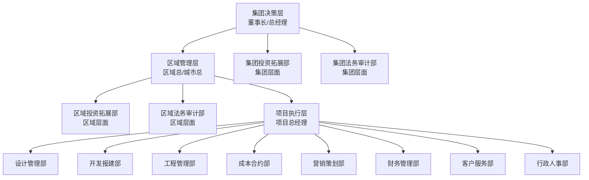

# 地产项目组织管控体系（集团独立项目版）
> **适用范围**：集团下属10-50万㎡标准住宅/商住混合独立项目  
> **管控层级**：三级管控体系（集团-区域-项目）  
> **输出形式**：组织架构图 + 部门职责 + 岗位权责 + 兼岗原则

---

## 一、组织架构体系（三级管控）

> **备注**：投资拓展、法务审计职能属于集团/区域层面职责，不在具体项目层面设置专职部门和岗位，由集团/区域对应部门统筹支持，完成相关工作后移交项目团队执行。

---

## 二、核心岗位分工与职责清单（部门层级化）

### 2.1 项目总（项目最高负责人）
| 岗位 | 核心分工职责 | 任职资格要求 | 直接上级 |
|------|--------------|--------------|----------|
| **项目总经理** | 全周期第一责任人，统筹进度/质量/成本/安全，重大决策上报，经营目标达成，各部门协同管理，对最终交付负全责 | 5年以上同规模项目操盘经验，PMP优先 | 区域总/城市总 |

---

### 2.2 设计管理部
> **部门职责**：负责项目全周期设计管理，从概念方案到现场技术支持，确保产品品质与成本平衡。
> **兼岗原则**：设计主管宜与同专业工程主管兼岗，专业属性按阶段侧重；小型项目可跨相近专业兼岗。

| 岗位 | 核心分工职责 | 任职资格要求 | 备注 | 部门归属 |
|------|--------------|--------------|------|----------|
| **设计部经理**（建筑专业牵头） | 部门统筹管理，设计进度管控，重大设计决策，跨部门技术协调，设计质量总负责 | 高级工程师优先，8年以上地产设计管理经验 | 主岗，不可兼岗 | 设计管理部 |
| 建筑设计主管 | 概念/方案/施工图建筑专业把控，报建图纸对接，现场建筑技术支持，设计变更管控 | 5年以上建筑设计经验，熟悉当地规划要求 | 可兼岗结构设计（小型项目） | 设计管理部 |
| 精装设计主管 | 售楼处/样板间/公区/户内精装修设计管理，材料选型，现场精装技术支持 | 5年以上室内设计经验，熟悉精装材料与工艺 | 可兼岗精装工程主管（按阶段侧重） | 设计管理部 |
| 景观设计主管 | 景观方案/施工图设计管理，软硬质景观选型，现场景观施工技术支持 | 3年以上景观设计经验，熟悉植物配置与造景 | 可兼岗景观工程主管（按阶段侧重） | 设计管理部 |
| 给排水设计主管 | 给排水/消防水系统设计管理，现场水电技术支持，市政接驳对接 | 3年以上给排水设计经验，熟悉消防规范 | 可兼岗水电工程主管（工程属性为主） | 设计管理部 |
| 强弱电设计主管 | 强电/弱电/智能化系统设计管理，现场电气技术支持，供电接驳对接 | 3年以上电气设计经验，熟悉供电规范 | 可兼岗暖通设计（小型项目） | 设计管理部 |
| 暖通设计主管 | 采暖/通风/空调系统设计管理，现场暖通技术支持，燃气接驳对接 | 3年以上暖通设计经验，熟悉设备选型 | 可兼岗强弱电设计（小型项目） | 设计管理部 |

---

### 2.3 开发报建部
> **部门职责**：负责项目全流程证照办理、政府关系维护、法定验收协调，确保合法合规开发。

| 岗位 | 核心分工职责 | 任职资格要求 | 备注 | 部门归属 |
|------|--------------|--------------|------|----------|
| **开发部经理** | 部门统筹管理，报建计划制定，重要政府关系维护，重大报建问题协调 | 5年以上开发报建经验，熟悉当地政府办事流程 | 主岗，不可兼岗 | 开发报建部 |
| 规划报建专员 | 建设用地规划许可证、建设工程规划许可证办理，规划指标核验，规划核实 | 熟悉自然资源局办事流程，了解规划法规 | 可兼岗配套报建 | 开发报建部 |
| 工程报建专员 | 施工许可证办理，质量/安全监督手续，一金三制落实，竣工验收备案 | 熟悉住建局办事流程，了解建设法规 | 可兼岗消防人防报建 | 开发报建部 |
| 消防/人防报建专员 | 消防设计审查，消防验收，人防报建审查，人防专项验收 | 熟悉消防/人防法规与验收标准 | 可由工程报建专员兼任 | 开发报建部 |
| 配套报建专员 | 环评/节能/海绵城市审查，水电气暖通讯配套对接，市政接驳协调 | 熟悉各专项审查要求与配套部门流程 | 可由规划报建专员兼任 | 开发报建部 |

---

### 2.4 工程管理部
> **部门职责**：负责施工现场全面管理，进度/质量/安全管控，施工单位协调，竣工验收组织。
> **兼岗原则**：工程主管宜与同专业设计主管兼岗，专业属性按阶段侧重；小型项目可跨相近专业兼岗。

| 岗位 | 核心分工职责 | 任职资格要求 | 备注 | 部门归属 |
|------|--------------|--------------|------|----------|
| **工程部经理** | 部门统筹管理，施工总进度计划管控，重大技术问题决策，施工单位总协调 | 注册建造师优先，8年以上工程管理经验 | 主岗，不可兼岗 | 工程管理部 |
| 土建工程主管 | 土方/基础/主体/砌体/二次结构/防水等土建专业施工管理，质量验收 | 5年以上土建现场管理经验，熟悉施工规范 | 可兼岗精装工程主管（小型项目） | 工程管理部 |
| 精装工程主管 | 精装修施工管理，精装材料验收，精装质量管控，精装问题销项 | 3年以上精装现场管理经验，熟悉精装工艺 | 可由精装设计主管兼任 | 工程管理部 |
| 景观工程主管 | 景观施工管理，软硬质景观验收，苗木成活率管控，景观效果把控 | 3年以上景观现场管理经验，熟悉植物习性 | 可由景观设计主管兼任 | 工程管理部 |
| 水电工程主管 | 给排水/消防/强弱电/暖通施工管理，机电设备验收，市政接驳协调 | 5年以上机电现场管理经验，熟悉机电规范 | 可由给排水设计主管兼任（工程属性为主） | 工程管理部 |
| 安全总监 | 安全生产责任制落实，安全隐患排查治理，安全教育培训，应急预案演练 | 注册安全工程师，3年以上安全管理经验 | 主岗，不可兼岗 | 工程管理部 |
| 资料员 | 工程资料管理，技术资料归档，验收资料准备，城建档案移交 | 2年以上工程资料管理经验，熟悉资料规程 | 可兼岗行政助理（小型项目） | 工程管理部 |

---

### 2.5 成本合约部
> **部门职责**：负责目标成本管控、招标采购、合同管理、预结算、动态成本监控。

| 岗位 | 核心分工职责 | 任职资格要求 | 备注 | 部门归属 |
|------|--------------|--------------|------|----------|
| **成本部经理** | 部门统筹管理，目标成本制定，重大成本决策，招标采购总负责 | 注册造价工程师，8年以上地产成本经验 | 主岗，不可兼岗 | 成本合约部 |
| 土建造价主管 | 土建专业预结算，工程量清单编制，签证变更审核，进度款审核 | 注册造价师优先，5年以上土建造价经验 | 可兼岗精装造价 | 成本合约部 |
| 安装造价主管 | 机电/消防/给排水/暖通专业预结算，安装材料核价，签证变更审核 | 3年以上安装造价经验，熟悉定额与计价 | 可兼岗景观造价 | 成本合约部 |
| 招标采购专员 | 供方库管理，招标文件编制，开标评标组织，合同起草与谈判 | 3年以上招采经验，熟悉合同法与招标流程 | 可兼岗合同管理 | 成本合约部 |
| 合同管理员 | 合同归档管理，合同履约跟踪，索赔与反索赔管理，合同台账维护 | 2年以上合同管理经验，熟悉地产合同体系 | 可由招标采购专员兼任 | 成本合约部 |

---

### 2.6 营销策划部
> **部门职责**：负责项目定位、营销策划、销售执行、渠道管理、品牌推广、回款跟进。

| 岗位 | 核心分工职责 | 任职资格要求 | 备注 | 部门归属 |
|------|--------------|--------------|------|----------|
| **营销部经理** | 部门统筹管理，营销总案制定，销售目标管控，价格策略制定 | 5年以上地产营销经验，有成功项目操盘案例 | 主岗，不可兼岗 | 营销策划部 |
| 策划师 | 项目定位研究，营销方案策划，活动策划执行，媒体推广对接 | 3年以上地产策划经验，熟悉市场调研方法 | 可兼岗品牌推广 | 营销策划部 |
| 销售主管 | 销售团队管理，销售目标分解，客户洽谈签约，案场日常管理 | 3年以上地产销售管理经验，熟悉销售流程 | 主岗，不可兼岗 | 营销策划部 |
| 置业顾问 | 客户接待，产品讲解，意向跟进，合同签署，回款催收 | 2年以上地产销售经验，沟通表达能力强 | 按配置人数，不兼岗 | 营销策划部 |
| 渠道专员 | 渠道拓展与维护，分销对接，拓客活动执行，渠道效果评估 | 2年以上渠道管理经验，熟悉当地分销市场 | 可兼岗策划助理 | 营销策划部 |

---

### 2.7 财务管理部
> **部门职责**：负责资金计划、融资管理、税务筹划、会计核算、成本控制、资金监控。

| 岗位 | 核心分工职责 | 任职资格要求 | 备注 | 部门归属 |
|------|--------------|--------------|------|----------|
| **财务经理** | 部门统筹管理，资金计划制定，融资对接，税务筹划，经营分析 | 中级会计师以上，5年以上地产财务经验 | 主岗，不可兼岗 | 财务管理部 |
| 会计 | 会计核算，凭证制作，报表编制，税务申报，成本核算 | 3年以上会计经验，熟悉地产会计准则 | 可兼岗出纳（小型项目） | 财务管理部 |
| 出纳 | 现金管理，银行结算，票据管理，费用报销，资金日报 | 2年以上出纳经验，熟悉银行结算业务 | 可兼岗行政文员（小型项目） | 财务管理部 |

---

### 2.8 客户服务部
> **部门职责**：负责客户关系维护、分户验收、交付组织、投诉处理、产证办理、质保期服务。

| 岗位 | 核心分工职责 | 任职资格要求 | 备注 | 部门归属 |
|------|--------------|--------------|------|----------|
| **客服部经理** | 部门统筹管理，交付总协调，重大投诉处理，客户满意度管理 | 5年以上地产客服经验，熟悉客诉处理流程 | 主岗，不可兼岗 | 客户服务部 |
| 维保主管 | 分户验收组织，问题整改跟踪，交付验房，质保期维修协调 | 3年以上工程或维保经验，熟悉房屋质量标准 | 可兼岗工程部资料员 | 客户服务部 |
| 产证专员 | 不动产权证办理，客户资料收集，契税代缴，产证发放与移交 | 2年以上产证办理经验，熟悉不动产登记流程 | 可兼岗客服助理 | 客户服务部 |

---

### 2.9 行政人事部
> **部门职责**：负责行政管理、人事管理、档案管理、后勤保障、企业文化。

| 岗位 | 核心分工职责 | 任职资格要求 | 备注 | 部门归属 |
|------|--------------|--------------|------|----------|
| **行政人事经理** | 部门统筹管理，招聘配置，绩效考核，薪酬福利，行政制度建设 | 3年以上行政人事管理经验，熟悉劳动法规 | 主岗，不可兼岗 | 行政人事部 |
| 行政专员 | 办公用品采购，会议组织，车辆管理，后勤保障，档案管理 | 2年以上行政经验，沟通协调能力强 | 可兼岗人事助理 | 行政人事部 |
| 人事专员 | 招聘执行，入职离职，社保公积金，员工关系，培训组织 | 2年以上人事经验，熟悉人力资源模块 | 可兼岗行政助理 | 行政人事部 |

---

### 2.10 集团/区域支持岗
> **说明**：以下岗位不属于具体项目编制，由集团/区域对应部门派出，为项目提供专业支持。

| 部门 | 岗位 | 核心分工职责 | 任职资格要求 | 部门归属 |
|------|------|--------------|--------------|----------|
| 投资拓展部 | *投资拓展主管（集团/区域） | 地块踏勘、市场调研、尽职调查、投决材料编制、土拍对接、土地出让合同签署 | 3年以上投拓经验，熟悉土地政策与财务测算 | 集团/区域投资拓展部 |
| 法务审计部 | *法务主管（集团/区域支持） | 重大合同审核、风险合规审查、纠纷处理、投决/重大事项法律把关、合规体系建设 | 律师执业资格，熟悉地产行业法律法规 | 集团/区域法务审计部 |
| 法务审计部 | *审计主管（集团/区域支持） | 项目成本审计、合同履约审计、资金使用审计、廉政审计、问题整改跟踪 | 注册会计师优先，3年以上地产审计经验 | 集团/区域法务审计部 |

---

## 三、三级决策机制
| 决策层级 | 决策范围 | 审批主体 | 审批时限 |
|----------|----------|----------|----------|
| **集团级** | 一级里程碑节点变更、投决拿地、目标成本调整≥5%、价格调整≥3%、重大风险处置、单笔付款≥500万 | 集团总经理/投决会 | 7个工作日 |
| **区域级** | 二级节点变更、目标成本调整2%-5%、营销方案、招标结果、一般风险处置、单笔付款100-500万 | 区域总/区域办公会 | 3个工作日 |
| **项目级** | 三级节点调整、设计变更≤10万、签证变更≤5万、日常现场决策、单笔付款<100万 | 项目总/项目办公会 | 1个工作日 |

---

**文档版本**：V1.0  
**编制部门**：集团运营管理中心  
**生效日期**：2025年1月1日  
**更新周期**：每年修订一次，组织架构调整时即时更新
