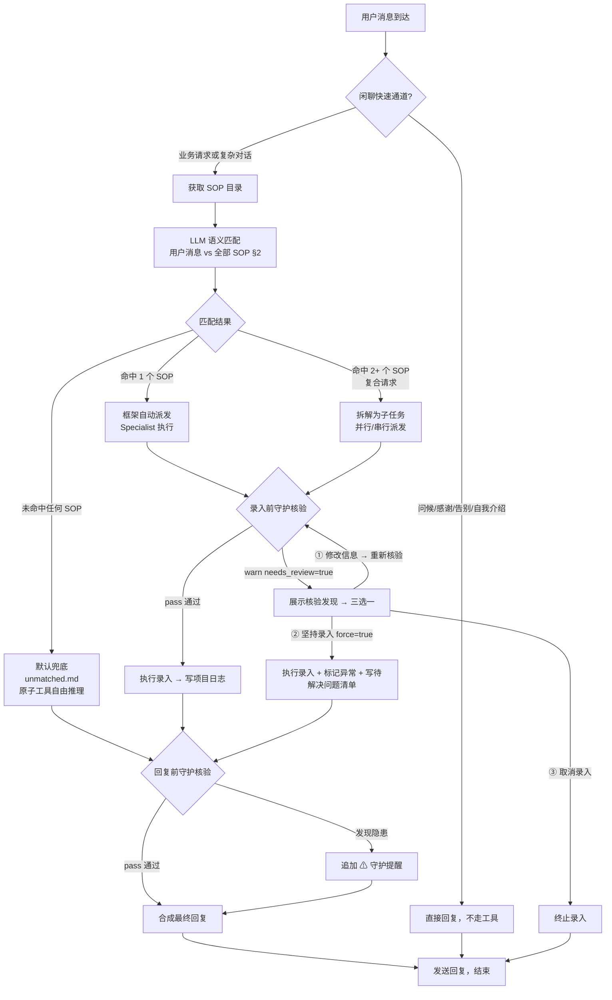

# 业务决策树根图

## 适用场景

Emy 收到用户消息后，按此根图逐级判断。根图描述路由流程——具体有哪些 SOP 可用，由 SOPIntentRegistry 运行时动态扫描 `SOPrepository/` 决定。根图不包含任何具体 SOP 名称。

## 分支指引

### 闲聊快速通道 (B→C)
- 触发词：你好/早/晚上好/hi/hello、谢谢/感谢/thanks、再见/拜拜/bye、你是谁/自我介绍
- 直接返回固定文案，不调用任何 LLM 工具，不走守护核验
- 此路径秒级响应，节省 LLM 调用延迟

### SOP 语义匹配 (D→E→F)
- D 节点：Orchestrator 调用 SOPIntentRegistry.dump_as_text() 获取 SOP 目录
- E 节点：将目录文本注入 LLM system prompt，LLM 对用户消息做语义匹配
- 匹配原则：
  - 语义优先：理解用户真实意图，不做机械的关键词命中
  - 否定条件必须遵守：用户意图命中否定条件则不选该 SOP
  - 上下文感知：同一句话在不同上下文中可能匹配不同 SOP
- F 节点：LLM 输出 SOPMatchDecision（JSON 格式），含 sop_id + confidence + reasoning

### 单意图路由 (F→G)
- LLM 判定匹配 1 个 SOP 且 confidence ≥ medium
- Orchestrator 自动派发 Specialist 执行对应 SOP（框架内置能力）
- Specialist 按需加载 SOP §1-§7 全文，限定工具集执行

### 复合请求拆解 (F→H)
- LLM 判定匹配 2+ 个 SOP，is_compound=true
- Orchestrator 拆解为独立子任务，各分配 sop_id + user_input + priority
- 无依赖子任务并行派发，有依赖串行
- 汇总全部 FlowResult 后合成回复

### 默认兜底 (F→I)
- LLM 判定全部 SOP 匹配度低于阈值，fallback=true
- 加载 unmatched.md 为 system prompt
- 开放全部原子工具自由推理，最多 5 轮工具调用
- 记录未命中事件到 notebook
- 这是结构性保底——不是 if-else 的最后一支，而是匹配失败时必然触发的路径

### 拟录入单流程 (G/H)
- 必须先组装拟录入单再调用 record_xxx 工具
- 推理字段优先级：用户明确提供 > LLM 语义提取 > DB 上下文查询 > 系统默认值
- 缺失必填字段标注「待补充」，每轮最多展示一次拟录入单
- 用户"确认"/"好的"/"OK" → 执行录入；"修改XX" → 更新字段重新展示；"取消" → 终止
- 排版规则：纵向排版（手机适配），字段名独占一行，值缩进2空格，来源用〔〕标注

### 录入前守护核验 (L → N → ①/②/③)
当调用 record_event / record_task / record_meeting / record_file 后，工具可能返回 `needs_review=true`。

**核验结果两级**：
- **pass**：静默放行，正常入库
- **warn**（needs_review=true）：暂停流程，展示核验发现

**warn 时三选一（N 节点）**：
| 选择 | 操作 | 后果 |
|------|------|------|
| ① 修改信息 → 重新审核 | 用户提供修正 → 重新组装拟录入单 → 再次调用工具 | 重新走核验 |
| ② 坚持原样录入 | 用原参数重新调用，设置 force=true | 入库成功，标记 [守护标记]，写入待解决问题清单 |
| ③ 取消录入 | 回复"已取消" | 不入库 |

**关键原则**：守护核验只做提醒，绝不替代用户做决策。凡有 warn 必让用户选择。

### 回复前守护核验 (P)
- 所有工具调用完成后，守护 Agent 对回复内容做轻量核验
- pass：正常发送
- warn：在原回复末尾追加 `⚠ 守护提醒：{发现的问题}`
- 核验维度：事实性错误、安全隐患、逻辑矛盾

### 长期记忆管理
- 在发送回复前，检查用户是否表达了明显的长期或持续性要求
- 触发场景："随时跟踪..."、"每天检查..."、"以后..."、"每周..."、"定期..."
- 调用 write_user_memory 工具记录
- 严禁嘴上说"记住了"但实际没调用工具

### 待解决问题闭环
- 管理员触发：manage_pending_issues 查看/处理 PND 条目
- 闭环流程：record_event（决策事件）→ manage_pending_issues(action="resolve") → 回复

%% goto: unmatched.md  — 未命中预设意图时使用原子工具自由推理兜底，记录未命中事件
