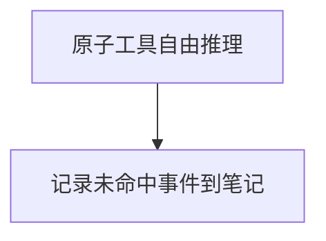

# 未命中兜底流程

## 适用场景

当用户请求无法匹配根图中任何预设意图（事件记录/任务管理/会议记录/文件归档/数据查询/守护调查）时，进入此流程。LLM 使用原子工具自由组合推理，尽力完成用户任务，同时将此次未命中事件记录下来供后续优化。



## 分支指引

### 节点 A：原子工具自由推理

**目标**：即使没有预设决策图覆盖，也要尽力用现有原子工具完成用户请求。不要因为"没有对应流程"而拒绝服务。

**可用工具**（系统已注册的原子操作）：
- `query_data` — 查询数据库（event/task/meeting/file/message/user/project/summary/journal）
- `record_event` — 录入事件
- `record_task` — 创建任务
- `record_meeting` — 归档会议
- `record_file` — 归档文件
- `write_notebook` — 写入笔记文件
- `knowledge_search` — RAG 知识库检索

**执行策略**：
1. 先理解用户意图：从消息语义中推断用户真正想做什么
2. 拆解为原子步骤：将复杂请求拆分为可独立执行的工具调用序列
3. 逐步执行：每次只调用一个工具，观察结果后再决定下一步
4. 如果某个工具返回错误或无法完成，尝试换用其他工具或调整参数
5. **最多 5 轮工具调用**后必须合成回复，避免无限循环
6. 完成用户请求后进入节点 B

**典型场景示例**：
- 用户问"帮我想想下周做什么" → 先查本周任务(query_data) → 再查项目计划(query_data) → 综合建议
- 用户说"把群里的图纸转发给张三" → 查最近文件(query_data) → 如无法转发则诚实说明当前能力边界
- 用户提了一个全新领域的请求 → 诚实说明暂不支持，建议替代方案

### 节点 B：记录未命中事件到笔记

**目标**：将本次未命中事件完整记录下来，写入 `notebooks/未命中事件笔记.md`，供管理员后续分析并决定是否需要新建子图。

**记录内容格式**：

```markdown
## 未命中事件 [YYYY-MM-DD HH:MM]

### 用户原始消息
{用户输入原文，完整保留}

### 意图推断
{LLM 对用户意图的分析和理解}

### 处理过程
- 调用了哪些工具、参数和结果
- 每一步的推理依据

### 处理结果
{最终回复内容，是否成功满足用户需求}

### 改进建议
{如果已有对应子图，应归入哪个意图；或者是否需要新建子图}
```

**调用方式**：使用 `write_notebook` 工具，文件名指定为 `未命中事件笔记`，将上述内容格式化后写入。

**重要规则**：
- 必须先完成节点 A（尽力处理用户请求），再执行节点 B（记录）
- 如果 write_notebook 工具不可用，在日志中输出警告，不影响主流程
- 记录应简洁但包含关键信息，方便管理员快速判断是否需要新建决策子图

%% goto: main.md  — 返回根图继续后续流程（回复核验 → 发送）
