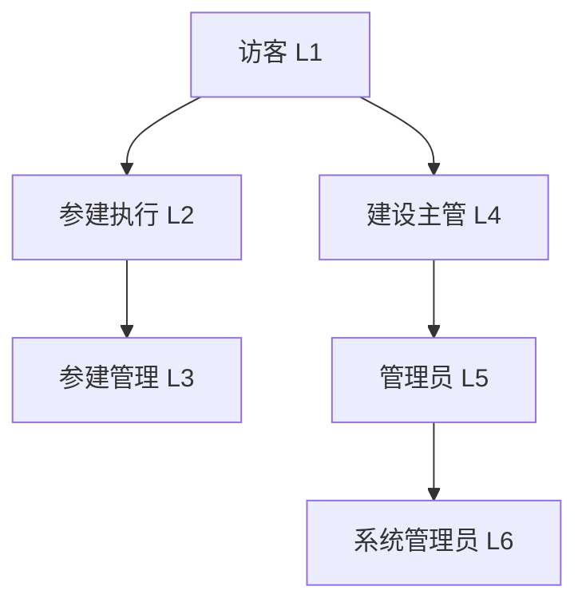
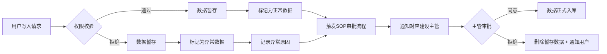
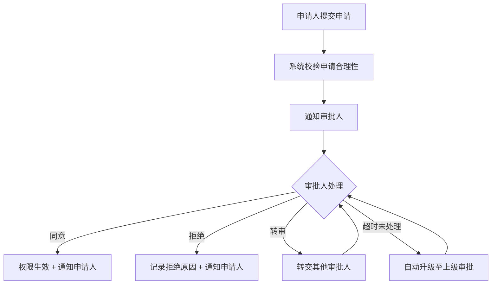

# 权限管理系统需求说明书

## 文档信息

| 项    | 值                    |
| ---- | -------------------- |
| 文档版本 | v1.0                 |
| 编写日期 | 2026-06-26           |
| 适用范围 | Emily 项目权限管理模块       |
| 设计原则 | 最小权限原则、职责分离原则、审计追踪原则 |

***

## 一、系统概述

### 1.1 模块职能

权限管理系统负责管理用户对数据的访问权，即**用户与数据的关系**管控。通过统一的权限控制机制，确保数据访问的安全性、合规性和可追溯性。

### 1.2 核心设计理念

采用**双层授权体系**：

1. **用户分组授权**：基于角色的访问控制（RBAC）
2. **数据集合单独授权**：基于资源属性的访问控制（ABAC）

### 1.3 权限决策模型（新增）

采用 **RBAC + ABAC 混合模型**：

```
权限决策 = 主体属性 + 资源属性 + 环境属性 + 操作类型
```

- **主体属性**：用户角色、单位归属、职能范围、职级
- **资源属性**：密级分类、项目归属、全景节点、数据类型
- **环境属性**：访问时间、网络环境、设备信息
- **操作类型**：读取、写入、修改、删除、授权

### 1.4 权限优先级规则（新增）

```
拒绝 > 单独文件授权 > 临时授权 > 管理员角色授权 > 单位归属自动授权
```

***

## 二、用户权限体系

### 2.1 用户权限分组

系统设置 **六个基本权限分组**，权限逐级递增：

| 序号 | 权限分组  | 权限级别 | 说明          |
| -- | ----- | ---- | ----------- |
| 1  | 访客    | L1   | 所有接入用户自动获得  |
| 2  | 参建执行  | L2   | 非建设单位人员基础权限 |
| 3  | 参建管理  | L3   | 参建单位管理人员权限  |
| 4  | 建设主管  | L4   | 建设单位专业主管权限  |
| 5  | 管理员   | L5   | 全局管理员权限     |
| 6  | 系统管理员 | L6   | 最高系统权限      |

### 2.2 权限继承机制

采用**权限继承制**，高级角色自动继承低级角色的所有权限：



### 2.3 权限初始化与自动授权规则

| 用户状态    | 初始权限 | 触发条件   | 自动获得权限              |
| ------- | ---- | ------ | ------------------- |
| 新用户首次接入 | 访客   | -      | 公开信息读取权             |
| 绑定非建设单位 | 参建执行 | 单位归属绑定 | 所属单位参建执行权限 + 单位权限范围 |
| 绑定建设单位  | 建设主管 | 单位归属绑定 | 建设主管权限 + 职能对应权限范围   |

### 2.4 各分组详细权限定义

#### 2.4.1 访客（L1）

- **授权方式**：自动授予，无需审批
- **权限范围**：
  - ✅ 所有标记为"公开"的信息读取权
  - ❌ 无任何写入权限
  - ❌ 无法查看内部、私有、机密信息

#### 2.4.2 参建执行（L2）

- **继承**：访客全部权限
- **新增权限**：
  - ✅ 本单位参与范围内全景节点的内部信息读取权
  - ✅ 本单位职能范围内成果上报权（写入）
- **权限范围限制**：受单位权限范围属性约束，越权操作标记为异常

#### 2.4.3 参建管理（L3）

- **继承**：参建执行全部权限
- **新增权限**：
  1. ✅ 对无单位归属的访客用户，赋予本单位归属权（仅限自身所在单位）
  2. ✅ 将归属本单位的人员移出单位
  3. ✅ 调整本单位人员权限（仅限本单位内 L2 ↔ L3 两层）
  4. ✅ 本单位参与节点内机密资源访问权

#### 2.4.4 建设主管（L4）

- **继承**：访客全部权限
- **新增权限**：
  - ✅ 标记为"内部"的全量信息访问权（责任范围内）
  - ✅ 对"参建管理"及以下人员的单位归属调整权（加入、移出、调整 L2↔L3）
  - ✅ 异常数据审批处理权
  - ⚠️ **限制**：不能授予用户加入建设管理单位
- **职能映射**：建设主管名称代表负责范围，系统自动映射对应全景节点控制权

#### 2.4.5 管理员（L5）

- **继承**：建设主管全部权限
- **新增权限**：
  1. ✅ 对"建设主管"及以下所有人员的单位归属调整权
  2. ✅ 所有标记为"机密"信息的访问权
  3. ✅ 永久授权执行权
  4. ✅ 所有用户私有信息查看权（审计用途）

#### 2.4.6 系统管理员（L6）

- **权限范围**：全部系统权限
- **特殊权限**：
  - 系统配置修改
  - 权限规则定义与修改
  - 审计日志管理
  - 数据备份与恢复

***

## 三、信息分类与访问控制

### 3.1 信息密级分类

所有数据资源必须划分访问属性，分为四类：

| 密级 | 标识颜色 | 访问范围               | 数据示例                 |
| -- | ---- | ------------------ | -------------------- |
| 公开 | 绿色   | 全员可见               | 项目名称、项目四至、容积率、用地面积   |
| 内部 | 蓝色   | 相关责任范围内人员可见        | 会议纪要、完工确认单、工程进度、质量报告 |
| 私有 | 黄色   | 仅本人 + 管理员及以上可见     | 用户长期记忆、聊天记录存档、个人工作笔记 |
| 机密 | 红色   | 仅管理员及以上可见 + 单独文件授权 | 商务合同、成本数据、核心技术方案     |

### 3.2 数据类型覆盖范围

权限控制覆盖以下所有数据类型：

- 数据库表数据（行级 + 列级）
- SOP 业务流程表单
- 文档库文件
- 通信记录与聊天存档
- 系统配置参数

***

## 四、单位权限范围体系

### 4.1 单位权限范围属性

每个单位自带**权限范围属性**，与单位所属职能强关联。

#### 4.1.1 数据结构定义

```json
{
  "unitId": "单位唯一标识",
  "unitName": "单位名称",
  "unitType": "建设单位/参建单位",
  "functionScope": [
    {
      "functionType": "职能类型（如：景观工程、土建工程、精装修）",
      "nodeIds": ["关联全景节点ID列表"],
      "allowedOperations": ["read", "write", "upload"]
    }
  ],
  "createTime": "创建时间",
  "updateTime": "更新时间"
}
```

#### 4.1.2 职能与全景节点映射

| 职能类型   | 自动关联全景节点范围      |
| ------ | --------------- |
| 景观工程主管 | 所有景观设计、景观施工节点   |
| 土建工程主管 | 所有土建施工、结构工程节点   |
| 精装修主管  | 所有精装修设计、精装修施工节点 |
| 机电工程主管 | 所有机电安装、消防工程节点   |

### 4.2 越权异常处理

当用户试图超出单位权限范围操作时：

1. **读取越权**：拒绝访问，提示权限不足，引导申请权限
2. **写入越权**：
   - 数据暂存（标记为异常数据）
   - 记录异常原因
   - 触发 SOP 审批流程
   - 通知对应建设主管处理

***

## 五、授权形式与流程

### 5.1 授权形式分类

#### 5.1.1 形式1：单位归属自动授权

- **触发条件**：用户绑定单位归属时自动触发
- **授权内容**：自动获得该单位对应级别权限 + 单位权限范围
- **有效期**：长期有效，直至单位归属变更
- **无需审批**：系统自动执行

#### 5.1.2 形式2：临时授权（单文件/单范围）

支持主动授权和被动请求授权两种模式：

| 项     | 说明            |
| ----- | ------------- |
| 授权范围  | 单个文件 / 指定节点范围 |
| 默认时长  | 10 分钟         |
| 最大时长  | 24 小时         |
| 授权人要求 | 必须拥有被授权资源的权限  |
| 可被授权人 | 所有系统用户        |

**主动授权流程**：

1. 授权人选择资源
2. 指定被授权人
3. 设置授权时长
4. 确认授权 → 生效

**被动请求授权流程**：

1. 请求人访问无权限资源
2. 点击"申请权限"
3. 系统通过"协同待办模块"通知资源所有者/管理员
4. 授权人审批（同意/拒绝）
5. 审批结果通知申请人

#### 5.1.3 形式3：永久授权

- **执行权限**：仅管理员（L5）及以上可执行
- **授权范围**：单个文件、目录、节点范围
- **有效期**：永久有效，直至手动撤销
- **审计要求**：必须记录授权原因

### 5.2 授权撤销机制

- **主动撤销**：授权人可随时撤销已发出的授权
- **自动撤销**：临时授权到期自动失效
- **强制撤销**：管理员可撤销任何授权
- **级联撤销**：用户权限降级时，超出新权限级别的授权自动撤销

***

## 六、权限编号系统设计

### 6.1 权限编码规则

采用 **字符串分层编码**，便于扩展和解析：

```
格式：[资源类型]-[密级]-[项目ID]-[节点ID]-[资源ID]

示例：
  - DOC-PUBLIC-PRJ001-NODE001-FILE001
  - DB-INTERNAL-PRJ002-*-*
  - SOP-CONFIDENTIAL-*-NODE005-FORM003
```

#### 6.1.1 分段说明

| 分段   | 长度 | 可选值                                  | 说明               |
| ---- | -- | ------------------------------------ | ---------------- |
| 资源类型 | 3  | DOC/DB/SOP/MSG/SYS                   | 文档/数据库/SOP/消息/系统 |
| 密级   | 8  | PUBLIC/INTERNAL/PRIVATE/CONFIDENTIAL | 公开/内部/私有/机密      |
| 项目ID | 可变 | PRJxxx / \*                          | 项目标识，\* 表示所有项目   |
| 节点ID | 可变 | NOUExxx / \*                         | 全景节点标识，\* 表示所有节点 |
| 资源ID | 可变 | xxx / \*                             | 具体资源标识，\* 表示所有   |

#### 6.1.2 通配符规则

- `*` 表示匹配任意值
- 支持前缀匹配，如 `NODE001*` 表示该节点下所有子节点

### 6.2 用户权限清单存储

- **存储位置**：用户主表 `permission_list` 字段（JSON 数组格式）
- **数据结构**：

```json
{
  "userId": "用户ID",
  "permissionList": [
    {
      "permissionCode": "权限编码",
      "grantType": "AUTO/TEMP/PERMANENT",
      "grantTime": "授权时间",
      "expireTime": "过期时间（临时授权）",
      "grantBy": "授权人ID"
    }
  ]
}
```

### 6.3 Session 权限注入机制

#### 6.3.1 注入流程

1. 用户登录成功
2. 系统查询用户权限清单
3. 编译权限规则（编码 → 内存结构）
4. 注入用户状态机
5. 返回登录成功

#### 6.3.2 性能优化策略

- **按需加载**：基础权限立即加载，细粒度权限访问时校验
- **缓存机制**：权限清单 Redis 缓存（TTL: 15分钟）
- **增量更新**：权限变更时主动推送刷新通知

***

## 七、权限异常处理机制

### 7.1 读取权限异常

**场景**：用户请求读取不具备权限的数据

- **处理动作**：
  1. 拒绝访问，返回 HTTP 403
  2. 记录审计日志
  3. 前端提示："您暂无此资源访问权限，请向直接上级申请"
  4. 提供快捷申请权限入口

### 7.2 写入权限异常

**场景**：用户试图写入无权访问的数据段

#### 7.2.1 处理流程



**流程说明**：

- **权限校验通过**：数据暂存 → 标记为正常 → 触发SOP审批 → 主管确认后正式入库
- **权限校验拒绝**：数据暂存 → 标记为异常 + 记录原因 → 触发SOP审批 → 主管判断：
  - 同意：正式入库（可补全用户权限）
  - 拒绝：删除暂存数据并通知用户

#### 7.2.2 暂存数据管理

- **存储位置**：独立临时表 `pending_data`
- **保留期限**：默认 7 天，超时自动清理
- **数据结构**：

```json
{
  "pendingId": "待处理ID",
  "userId": "提交用户ID",
  "dataType": "数据类型",
  "dataContent": "数据内容快照",
  "exceptionReason": "异常原因",
  "targetNodeId": "目标节点ID",
  "approverId": "待审批主管ID",
  "status": "PENDING/APPROVED/REJECTED",
  "createTime": "创建时间",
  "expireTime": "过期时间"
}
```

***

## 八、授权审计与日志

### 8.1 授权日志表设计

PostgreSQL 表 `permission_audit_log`：

| 字段名              | 类型           | 说明          | 约束                      |
| ---------------- | ------------ | ----------- | ----------------------- |
| log\_id          | BIGSERIAL    | 日志ID        | PRIMARY KEY             |
| event\_time      | TIMESTAMP    | 事件时间        | NOT NULL, DEFAULT NOW() |
| grantor\_id      | VARCHAR(64)  | 授权人ID       | NOT NULL                |
| grantee\_id      | VARCHAR(64)  | 被授权人ID      | NOT NULL                |
| permission\_code | VARCHAR(256) | 权限编码        | NOT NULL                |
| grant\_type      | VARCHAR(32)  | 授权类型        | AUTO/TEMP/PERMANENT     |
| duration         | INTEGER      | 权限时长（秒）     | NULLABLE（永久授权为NULL）     |
| session\_id      | VARCHAR(128) | 授权Session编号 | NULLABLE                |
| operation\_type  | VARCHAR(32)  | 操作类型        | GRANT/REVOKE/EXPIRE     |
| client\_ip       | VARCHAR(64)  | 客户端IP       | <br />                  |
| user\_agent      | TEXT         | 用户代理        | <br />                  |
| remark           | VARCHAR(512) | 备注/授权原因     | <br />                  |

### 8.2 审计要求

1. **不可篡改**：日志表仅支持 INSERT，禁止 UPDATE/DELETE
2. **完整记录**：所有权限变更操作必须留痕
3. **查询能力**：支持按用户、时间、权限编码、操作类型查询
4. **报表统计**：
   - 用户权限分布报表
   - 授权操作活跃度报表
   - 异常访问统计报表

***

## 九、权限审批工作流

### 9.1 权限申请审批流程

适用于：临时授权申请、单位归属申请、权限升级申请



### 9.2 审批超时规则

- **一级审批**：24小时未处理自动升级
- **二级审批**：48小时未处理自动升级至管理员
- **紧急申请**：支持标记"紧急"，缩短超时时间至2小时

### 9.3 协同待办模块集成

#### 9.3.1 模块说明
权限审批流程通过 **「协同待办」模块**（Agent Issue）实现审批通知与闭环管理。该模块为独立子系统，权限系统预留调用接口，具体实现方案参考架构文档：
> `需求文件/待办公告模块/Agent协同待办模块-架构师完善版.md`

#### 9.3.2 触发场景
权限系统在以下场景自动调用协同待办接口创建待办事项：
1. 用户提交权限申请（临时授权、单位归属、权限升级）
2. 用户写入数据权限校验不通过，需主管审批
3. 权限定期评审任务分配

#### 9.3.3 待办分类编码
权限相关待办使用统一分类标识：
| 分类编码 | 待办类型 | 说明 |
|---------|---------|------|
| `PERMISSION_REQUEST` | 权限申请审批 | 用户申请权限时创建 |
| `ANOMALY_ESCALATION` | 异常数据审批 | 越权写入数据时创建 |
| `PERMISSION_REVIEW` | 权限定期评审 | 季度评审任务时创建 |

#### 9.3.4 预留接口清单
```
// 创建权限审批待办
POST /api/v1/agent-issues/create
{
  "title": "待办标题",
  "description": "待办详情",
  "category": "PERMISSION_REQUEST",
  "assigneeId": "审批人ID",
  "priority": "NORMAL/HIGH/URGENT",
  "sourceData": {
    "requestType": "权限申请类型",
    "permissionCode": "权限编码",
    "requesterId": "申请人ID"
  }
}

// 查询用户待办列表
GET /api/v1/agent-issues/my?status=OPEN

// 处理待办（同意/拒绝）
POST /api/v1/agent-issues/{issueId}/action
{
  "action": "ACCEPT/DECLINE/RESOLVE",
  "remark": "处理意见"
}
```

#### 9.3.5 回调机制
协同待办处理完成后，通过回调通知权限系统：
```
POST /api/v1/permission/callback/issue-result
{
  "issueId": "待办ID",
  "action": "RESOLVED/DECLINED",
  "resultData": {
    "approved": true/false,
    "approverId": "审批人ID",
    "remark": "审批意见"
  }
}
```

***

## 十、数据脱敏与安全增强

### 10.1 数据脱敏规则

对于部分权限用户查看敏感信息时，自动脱敏显示：

| 数据类型  | 脱敏规则      | 示例                         |
| ----- | --------- | -------------------------- |
| 手机号   | 中间4位脱敏    | 138\*\*\*\*1234            |
| 身份证号  | 中间10位脱敏   | 110101\*\*\*\*\*\*\*\*1234 |
| 金额数据  | 低权限用户显示范围 | 100万-500万                  |
| 联系人信息 | 按需脱敏      | 张\*明                       |

<br />

<br />

***

## 十一、权限变更实时生效机制

### 11.1 变更触发场景

- 用户单位归属变更
- 用户权限分组变更
- 资源密级调整
- 单位权限范围调整

### 11.2 生效机制

1. **实时推送**：通过 WebSocket 推送权限变更通知至在线用户
2. **本地缓存失效**：客户端收到通知后立即重新拉取权限
3. **下一次请求生效**：离线用户下次请求时自动刷新权限
4. **强制登出**：高危权限降级时可选择强制登出

***

## 十二、权限批量管理

### 12.1 批量操作支持

- 批量授权：按部门/项目/节点批量授予权限
- 批量回收：按维度批量回收权限
- 权限模板：预设常用权限模板，一键应用
- 权限继承：组织架构调整时级联调整权限

### 12.2 权限定期评审

- **评审周期**：每季度一次
- **评审内容**：用户权限合理性、权限过期清理
- **自动提醒**：系统自动生成权限评审清单推送管理员

***

## 十三、非功能性需求

### 13.1 性能要求

- 单用户权限校验耗时 < 10ms
- 支持并发用户数 > 1000
- 权限列表查询响应时间 < 50ms

### 13.2 可用性要求

- 系统可用性 ≥ 99.9%
- 权限服务故障降级模式：保留已登录用户权限，禁止新权限申请

### 13.3 安全性要求

- 权限校验必须在服务端执行，前端校验仅作体验优化
- 权限令牌防止 CSRF、重放攻击
- 敏感操作必须记录操作人 IP 和设备信息

### 13.4 可扩展性

- 支持新增权限分组
- 支持自定义权限编码规则扩展
- 支持接入新的资源类型

***

## 十四、接口设计概要

### 14.1 核心权限校验接口

```
POST /api/v1/permission/check
Request:
{
  "userId": "用户ID",
  "resourceCode": "资源编码",
  "operation": "read/write/delete/grant"
}
Response:
{
  "allowed": true/false,
  "reason": "拒绝原因",
  "suggestedApprover": "建议审批人ID"
}
```

### 14.2 权限管理接口

- `POST /api/v1/permission/grant` - 授权
- `POST /api/v1/permission/revoke` - 撤销授权
- `GET /api/v1/permission/user/{userId}` - 查询用户权限列表
- `POST /api/v1/permission/request` - 申请权限
- `POST /api/v1/permission/approve` - 审批权限申请

***

## 十五、附录

### 15.1 术语表

| 术语   | 说明                                       |
| ---- | ---------------------------------------- |
| RBAC | Role-Based Access Control，基于角色的访问控制      |
| ABAC | Attribute-Based Access Control，基于属性的访问控制 |
| 全景节点 | 项目全景图中的业务节点                              |
| SOP  | Standard Operating Procedure，标准作业流程      |

### 15.2 参考标准

- 《信息安全技术 访问控制技术指南》（GB/T 35273-2020）
- 《网络安全等级保护基本要求》
- OAuth 2.0、RBAC96 标准模型

### 15.3 变更记录

| 版本   | 日期         | 修改人   | 修改内容   |
| ---- | ---------- | ----- | ------ |
| v1.0 | 2026-06-26 | 系统架构师 | 初始完整版本 |

