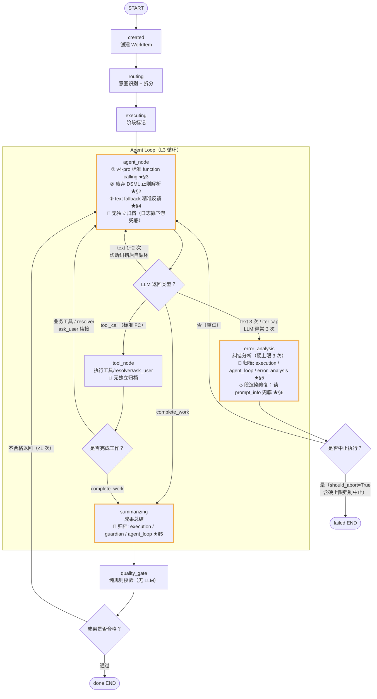

# BUG-05 修正完成后 — WorkItem 业务流节点流转图

> **配套计划**：`BUG-05_废弃DSML正则与归档缺陷修正计划_V1.md`
> **关键结论**：修正计划**不改变 LangGraph 的节点与边**，只改节点内部行为（agent_node 的模型/解析/反馈）与归档可见性（ArchiveHook 白名单 + 渲染）。下图即修正完成后的全貌，★ 标注修正计划带来的变化点。

---

## 节点流转图

---

## 图例

| 标记 | 含义 |
|------|------|
| ★§N | 修正计划第 N 章节的改动点 |
| 📐 | 该节点的 ArchiveHook（fire_after）归档的 LLM 日志类别 |
| 橙色粗边框节点 | 修正计划涉及改动的节点（暗色背景友好的标注方式） |

---

## 修正计划改动点对照（图上 ★ 标注）

| 位置 | 改动 | 章节 |
|------|------|------|
| **agent_node** | 废弃 DSML 正则解析（删常量+函数+检测分支） | §2 |
| **agent_node** | agent_loop_model 切 v4-pro + max_tokens=8192 | §3 |
| **agent_node** | text fallback 精准反馈（诊断 DSML/JSON/纯文本三类，给针对性纠错） | §4 |
| **summarizing** 📐 | 归档白名单 +`agent_loop`（成功路径归档 agent loop 日志） | §5 |
| **error_analysis** 📐 | 归档白名单 +`agent_loop` +`error_analysis`（失败现场归档） | §5 |
| **error_analysis** ◇ | 段渲染修复：WorkItem 加 `error_analysis` 字段 + 去 try/except + render 读 prompt_info 兜底 | §6 |
| **executing** | 不再渲染"Agent 执行循环"空标题（该段在 agent_node 之前，天然无 agent_loop 日志） | §7 |

---

## 归档点与 LLM 日志类别映射（§5 核心改动）

| 节点 | fire_after 归档类别 | 修正计划改动 |
|------|---------------------|-------------|
| created | 无 LLM 日志 | — |
| routing | `intent` | — |
| executing | `planning` / `execution` / `guardian` | §7：不再渲染空标题（agent_node 之前无 agent_loop 日志） |
| **agent_node** | ✗ 不挂 ArchiveHook | 日志靠 summarizing / error_analysis 兜底归档 |
| **tool_node** | ✗ 不挂 ArchiveHook | 同上 |
| **summarizing** | `execution` / `guardian` / **`agent_loop`** | §5：+`agent_loop`（成功时归档 agent loop 全部 LLM 日志） |
| quality_gate | 无 LLM（纯规则校验） | — |
| **error_analysis** | `execution` / **`agent_loop`** / **`error_analysis`** | §5：+`agent_loop` +`error_analysis`（失败现场归档 3 次 text fallback 的请求/响应） |

> **核心改进**：agent_node / tool_node 不挂 ArchiveHook（直接调 loop 函数，无 hook 包装），原本 agent loop 期间的 LLM 日志在归档里完全不可见。修正后，无论成功（summarizing）还是失败（error_analysis），agent_loop 类别的 LLM 日志都会在下游节点被归档，`archived_ids` 跨节点去重保证不重复。

---

## 路由判断说明（对应图中的菱形）

| 图中菱形 | 判断内容 | 路由函数（代码） | 分支去向 |
|----------|----------|------------------|----------|
| LLM 返回类型？ | agent_node 调 LLM 后，返回是 tool_call / 纯文本 / complete_work 哪一种 | `route_after_agent` (loop.py:365) | tool_node / agent_node 自循环 / error_analysis / summarizing |
| 是否完成工作？ | tool_node 执行的工具是否为 complete_work（成果已提交） | `route_after_tool` (loop.py:387) | summarizing（完成）/ agent_node（继续循环） |
| 成果是否合格？ | quality_gate 规则校验 StructuredResult 是否实质性满足（非"正在查询"等承诺话术） | `route_after_quality_gate` (graph.py:114) | done（通过）/ agent_node（退回重做 ≤1 次） |
| 是否中止执行？ | error_analysis 判定 should_abort（失败不可恢复 / 硬上限 3 次强制中止） | `route_after_error` (graph.py:106) | failed END（中止）/ agent_node（重试） |

---

## agent_node 内部分支（对应图中"LLM 返回类型？"判断）

| LLM 返回 | 处理 | 出口 |
|----------|------|------|
| `tool_call`（v4-pro 标准 FC） | 暂存 `_pending_tool_call` | → tool_node |
| `text` 第 1~2 次 | 诊断 content（DSML/JSON/纯文本）+ 精准纠错，回 agent_node | → agent_node（自循环） |
| `text` 第 3 次 | should_abort=True，error_type=transient_failure | → error_analysis |
| iteration cap（默认 12） | should_escalate=True | → error_analysis |
| LLM 异常连续 3 次 | should_abort=True | → error_analysis |

> 废弃 DSML 正则后，v4-pro 偶发文本泄漏由 text fallback 精准反馈兜住——agent 知道"输错格式了"，下一轮用标准 function calling 纠正；3 次仍失败则 escalate 到 error_analysis 归档失败现场。
