# 房地产建设项目全生命周期流程图

## 一、总体流程总览

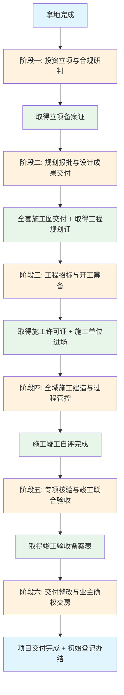

---

## 二、阶段一：投资立项与合规研判

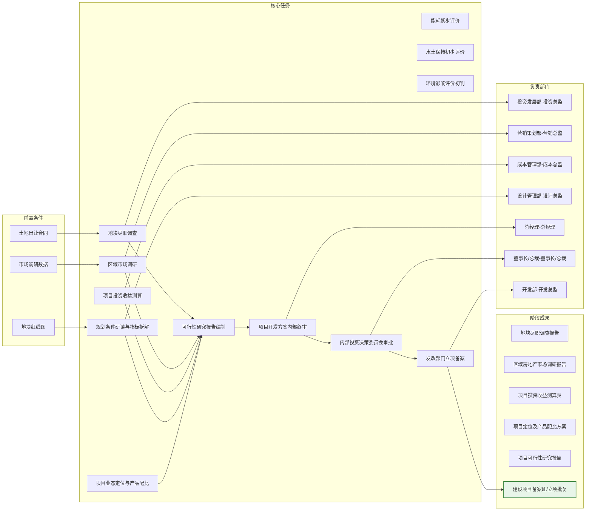

---

## 三、阶段二：规划报批与设计成果交付

### 3.1 勘测定界与土地确权

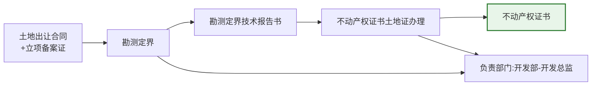

### 3.2 各专业方案设计并行

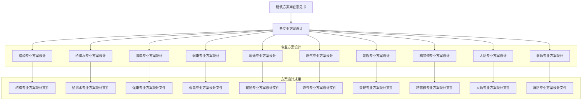

### 3.3 各专业施工图设计并行

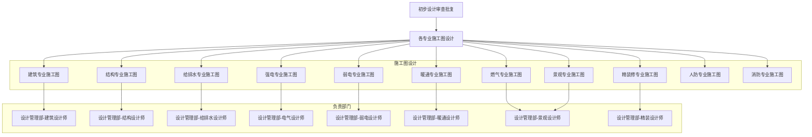

### 3.4 施工图审查与备案流程

---

## 四、阶段三：工程招标与开工筹备

### 4.1 招标流程总览

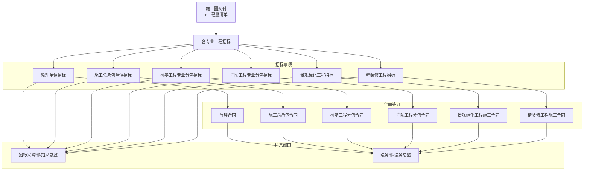

### 4.2 开工筹备流程

---

## 五、阶段四：全域施工建造与过程管控

### 5.1 桩基与基础工程

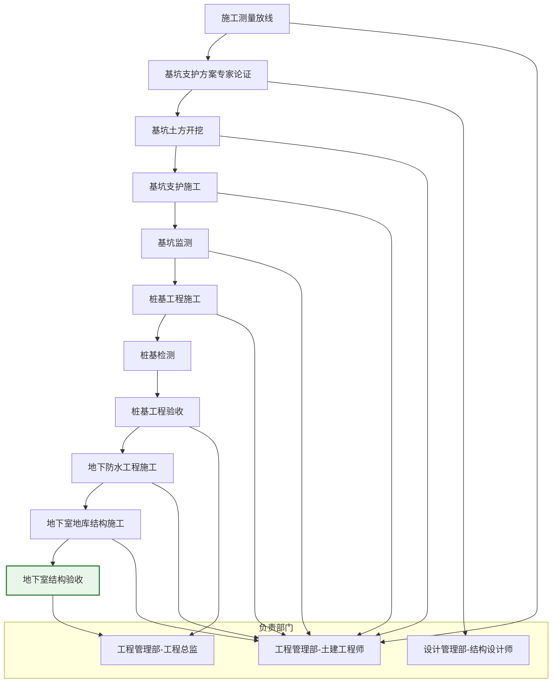

### 5.2 主体结构与外檐工程

### 5.3 机电安装工程（并行）

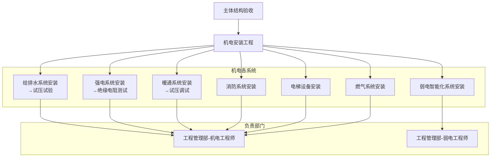

### 5.4 精装修与小市政工程

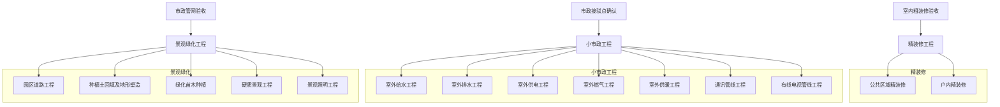

---

## 六、阶段五：专项核验与竣工联合验收

### 6.1 各专项验收流程

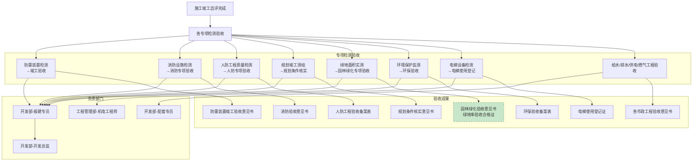

### 6.2 竣工备案流程

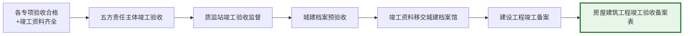

---

## 七、阶段六：交付整改与业主确权交房

### 7.1 分户验收与维保整改

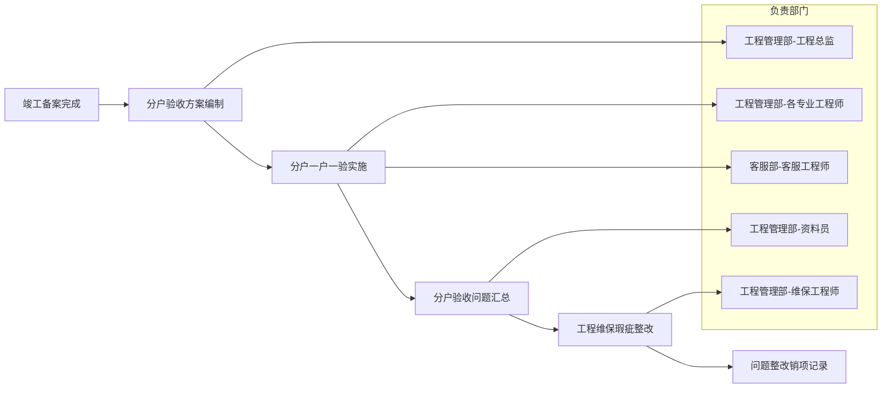

### 7.2 配套正式接驳

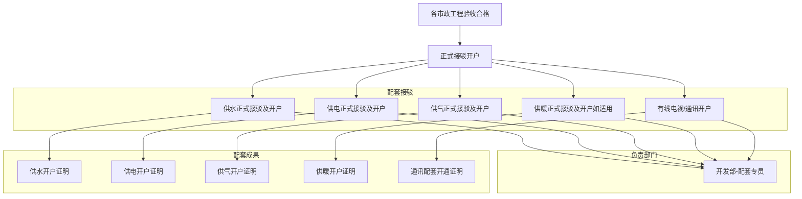

### 7.3 物业承接查验

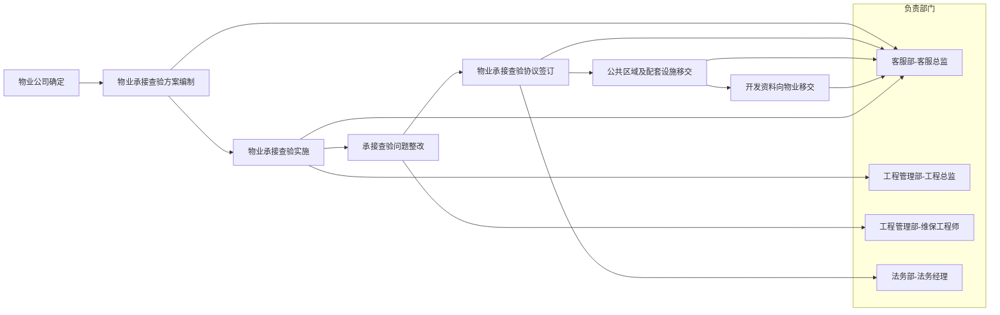

### 7.4 交付组织与产权办理

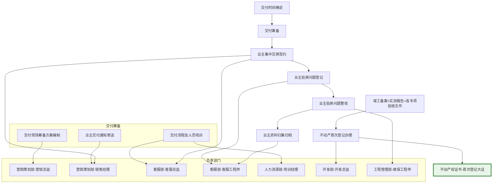

---

## 八、组织架构与责任矩阵

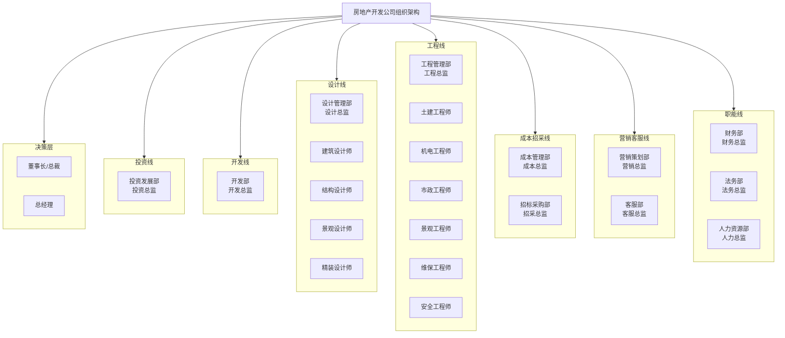

---

## 九、设计与工程对应关系矩阵

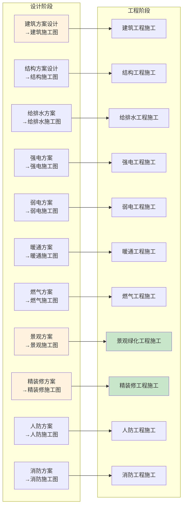

> 图例说明：设计阶段（黄色）→ 工程阶段（绿色），施工图交付是工程启动的前置条件

---

*注：本流程图基于房地产建设项目全生命周期143+项精细化任务编制，明确了各阶段、各专业的责任主体与成果交付标准。*
