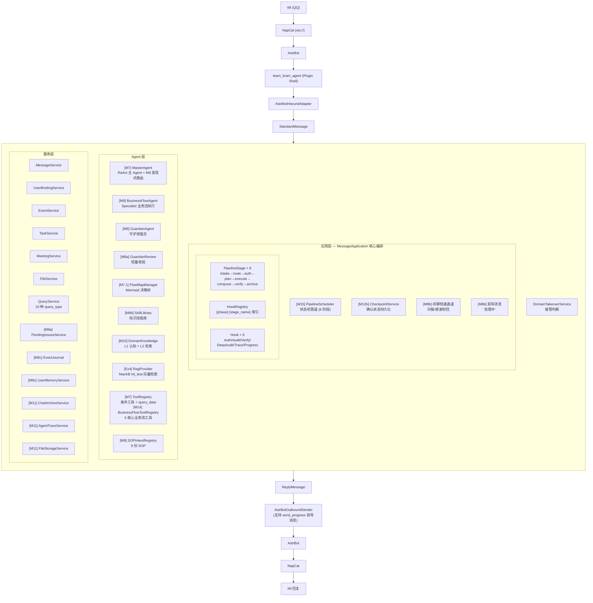
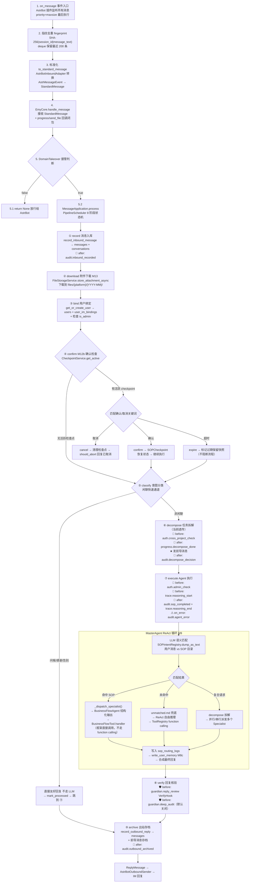
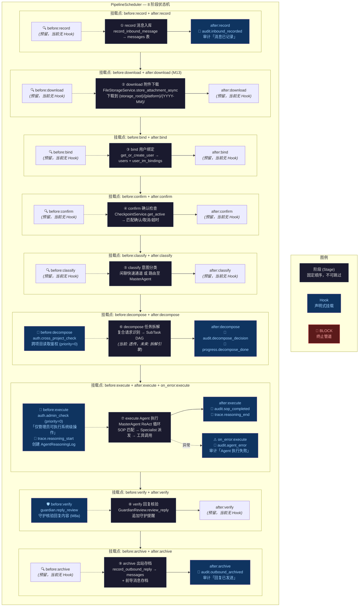

# Emy — 企业公共大脑 Agent

> **本文档作用**：为 AI 辅助开发工具提供项目全局上下文。每次新会话开始时，AI 可通过本文档快速了解项目定位、技术栈、架构、目录结构和关键设计原则，无需重新扫描整个代码库。
>
> **🔗 接入指引（请 AI 进入会话后按以下顺序加载）**：
>
> 1. 读完本文档（README.md） → 理解项目全貌
> 2. 读 [CLAUDE.md](CLAUDE.md) → 获取操作指令和约束
> 3. 读 [tem\_log/开发记录.md](tem_log/开发记录.md) → 了解当前进度、决策记录、速查命令
> 4. 内存 Memory 文件（`~/.claude/projects/d--app-EmyBot/memory/`）由 Claude 自动加载，无需手动读取
>
> **以下内容无需向用户重复介绍**：项目定位、架构、目录结构、设计原则、开发阶段——读 README + CLAUDE.md 即可获取。

## 1. 项目简介

Emy 是一个面向企业的 AI Agent工具，通过 IM（QQ/微信等）与员工交互，实现：

- 团队工作流记录与留痕
- 业务 SOP 数字化与引导
- 项目/任务/会议/文件统一管理
- 企业知识库检索 RAG（Ex4：MaxKB hit\_test 纯向量语义搜索，Qwen3-Embedding-0.6B + pgvector）
- 本项目环境管理基于uv，请在对python环境管理、脚本启动时使用uv工具，避免直接使用裸命令，如pip/python XXX.py。

**核心理念**：以工作流和持久化为骨架，AI 作为认知与交互层后加。

## 2. 技术栈

| 层          | 技术选型                        | 说明                                 |
| ---------- | --------------------------- | ---------------------------------- |
| **IM 接入**  | AstrBot + NapCat (Docker)   | QQ 消息桥接                            |
| **插件基座**   | AstrBot Plugin Shell        | `star.Star` 插件模型                   |
| **消息适配**   | 自研 Adapter 层                | AstrMessageEvent → StandardMessage |
| **数据库**    | PostgreSQL + SQLAlchemy 2.0 | 对接 MaxKB 容器 PG 服务                  |
| **AI/LLM** | DeepSeek / OpenAI API       | M3 起启用                             |
| **部署**     | Docker Compose              | 3 容器：napcat / astrbot / maxkb      |

## 3. 架构



**EmyCore 不依赖任何 AstrBot 对象**，确保未来可独立迁移为微服务。

**M3-M14 数据流（接管消息 → PipelineScheduler 8 阶段状态机总线）：**



> **阶段顺序**（`__init__.py` 装配）：① intake → ② route → ③ auth → ④ plan → ⑤ execute → ⑥ compose → ⑦ verify → ⑧ archive。管道是消息处理的**唯一总线**，每条消息按 WorkOrder 状态机流转（闲聊/确认命中时通过 DONE_FASTREPLY 短路到 compose；鉴权拒绝走 DONE_DENIED 短路；异常走 DONE_ERROR 短路直接 archive）。
> **Hook 挂载**（通过 `pipeline_config_m15.json` 声明式配置）：🔐=auth（可 BLOCK）、📝=audit（审计日志）、🔎=trace（推理追踪）、📢=progress（前导消息）、🛡=verify/deep_audit（回复核验）。before hook 异常视为 BLOCK（安全第一），after hook 失败不阻断。deny always wins。
> **M15 变更**：引入 PipelineScheduler 状态机驱动管道（8 阶段 + WorkOrder），替代 M12a 9 阶段铁序循环。M12a 9 阶段已完全移除。
> **M12b 变更**：确认流程从内存 `pending_confirmations` dict 迁移到 `SOPCheckpoint` DB 表 + `CheckpointService`。容器重启不丢失待确认项；超时保留快照（标记 expired），用户说"刚才的还有吗"可恢复。
> **M13 变更**：新增 `download` 管道阶段（① record 之后自动下载附件到本地）；`ReplyMessage` 支持 `file_paths` 字段；Agent 可按需调用 `send_file` / `read_local_file` 工具。
> **M14 变更**：核心业务流工具（record\_event / record\_task / record\_meeting / record\_file / query\_data）从 LLM ToolRegistry 迁移至 `BusinessFlowToolRegistry`。命中 SOP 路径走 BusinessFlowAgent 结构化输出 → 框架直接调用 handler（不走 ReAct + function calling）；未命中兜底路径仍走 ToolRegistry 自由推理。
> **M9 架构重构（2026-06-19）**：5 个"伪工具"从 ToolRegistry 移除，Agent 编排迁移为 MasterAgent 内置方法，守护调查新增 DeepAuditHook。

### 3.1 BUS 管道架构（PipelineScheduler 8 阶段状态机 + Hook 横切）

管道是消息处理的**唯一总线**，通过 WorkOrder 状态机驱动 8 个阶段流转。Hook 是横切关注点（鉴权/审计/核验/追踪/通知），通过 `pipeline_config_m15.json` 声明式挂载到阶段的 `before`（前置）或 `after`（后置）位置，不侵入阶段 handler 代码。



**管道执行规则：**

| 规则                   | 说明                                                 |
| -------------------- | -------------------------------------------------- |
| **顺序不可跳**            | 消息必须按 ①→⑧ 顺序流经每个阶段                                 |
| **before Hook 可阻断**  | 任一 before Hook 返回 BLOCK → 管道立即终止，返回拒绝回复            |
| **异常即阻断**            | before Hook 抛异常视为 BLOCK（安全第一原则）；after Hook 异常不阻断   |
| **deny always wins** | 多个 Hook 中任一阻断即终止，不存在"多数表决"                         |
| **三态决策**             | ALLOW=放行 / WARN=警告但继续 / BLOCK=立即终止                 |
| **声明式配置**            | 新增 Hook 只需编辑 `pipeline_config_m15.json`，不改任何 Python 代码 |

**当前已注册 Hook（12 个，8 个挂载点）：**

| 挂载点                | Hook                       | 类型          | 决策          | 说明                                   |
| ------------------ | -------------------------- | ----------- | ----------- | ------------------------------------ |
| `after:record`     | `audit.inbound_recorded`   | audit       | ALLOW       | 审计：消息已入库                             |
| `before:decompose` | `auth.cross_project_check` | auth        | ALLOW/BLOCK | 跨项目读取鉴权                              |
| `after:decompose`  | `audit.decompose_decision` | audit       | ALLOW       | 审计：拆解决策                              |
| `after:decompose`  | `progress.decompose_done`  | progress    | ALLOW       | 前导消息通知                               |
| `before:execute`   | `auth.admin_check`         | auth        | ALLOW/BLOCK | **管理员鉴权**（priority=0，最先执行）           |
| `before:execute`   | `trace.reasoning_start`    | trace       | ALLOW       | 创建 Agent 推理追踪                        |
| `after:execute`    | `audit.sop_completed`      | audit       | ALLOW       | 审计：SOP 执行完成                          |
| `after:execute`    | `trace.reasoning_end`      | trace       | ALLOW       | 更新推理追踪结果                             |
| `on_error:execute` | `audit.agent_error`        | audit       | ALLOW       | 审计：Agent 执行失败                        |
| `before:verify`    | `guardian.deep_audit`      | deep\_audit | ALLOW       | 深度审计调查（默认关闭，替代原 invoke\_guardian 工具） |
| `before:verify`    | `guardian.reply_review`    | verify      | ALLOW/WARN  | 守护核验回复（M8a）                          |
| `after:archive`    | `audit.outbound_archived`  | audit       | ALLOW       | 审计：回复已发送                             |

> **关键行为**：`auth.admin_check` 是当前唯一实际阻断的 Hook——非管理员的所有消息在 `before:execute` 被拦截，返回「仅管理员可执行系统级操作」。管理员消息正常放行至 MasterAgent。

**M9 业务流路由（MasterAgent ReAct 循环，发现式路由替代旧 M7.1 硬编码分支）：**

根图 `prompts/flows/main.md` 描述路由流程框架，具体 SOP 分支由 `SOPIntentRegistry` 运行时扫描 `SOPrepository/` 动态决定。LLM 收到包含 SOP 目录的 system prompt 后做语义匹配：

| 路由路径     | 触发条件                         | 处理方式                                                        |
| -------- | ---------------------------- | ----------------------------------------------------------- |
| 闲聊快速通道   | 问候/感谢/告别/自我介绍 — 硬编码匹配，不走 LLM | 直接回复（秒级响应）                                                  |
| 命中单个 SOP | LLM 语义匹配度 ≥ medium           | 框架自动派发 `_dispatch_specialist(sop_id)` → Specialist 按 SOP 执行 |
| 复合请求     | LLM 检测到 2+ 独立意图              | decompose 拆解 → 并行/串行派发多个 Specialist                         |
| 未命中兜底    | 全部 SOP 匹配度低于阈值               | 加载 `unmatched.md` → 原子工具自由推理（结构性保底）                         |

**当前已加载 SOP（9 份）**：SOP-001 会议纪要 / SOP-002 事件记录 / SOP-003 任务管理 / SOP-004 文件归档 / SOP-005 数据查询 / SOP-006 守护审计 / SOP-007 长期记忆 / SOP-008 待解决问题 / SOP-999 全涵兜底

**新增 SOP 方式**：放 `.md` 文件到 `SOPrepository/` → 重启即生效，无需改任何代码。

### 3.2 工具库模块

EmyBot 有两套工具注册表，服务于不同的执行路径：

| 注册表                          | 文件                                         | 用途                                            | LLM 可见 |
| ---------------------------- | ------------------------------------------ | --------------------------------------------- | ------ |
| **ToolRegistry**             | `tools/__init__.py` → `create_all_tools()` | LLM function calling（条件工具 + query\_data 兜底）   | ✅ 是    |
| **BusinessFlowToolRegistry** | `tools/business_flow_tools.py`             | 框架直接执行（SOP 匹配后 LLM 输出 JSON 参数 → 框架调用 handler） | ❌ 否    |

#### 3.2.1 BusinessFlowToolRegistry — 核心业务流工具（5 个，框架直接执行）

SOP 匹配后，BusinessFlowAgent 使用结构化输出模式：LLM `chat_json` → `{tool, params}` → 框架调用 handler。**不暴露为 LLM function calling**。

| # | 工具名              | handler                                | 用途                                 |
| - | ---------------- | -------------------------------------- | ---------------------------------- |
| 1 | `record_event`   | `event_tool.handle_record_event()`     | 事件录入（GuardianReview 核验 + force 机制） |
| 2 | `record_task`    | `task_tool.handle_record_task()`       | 任务管理（创建/更新/完成/取消）                  |
| 3 | `record_meeting` | `meeting_tool.handle_record_meeting()` | 会议纪要录入                             |
| 4 | `record_file`    | `file_tool.handle_record_file()`       | 文件归档                               |
| 5 | `query_data`     | `query_tool.handle_query_data()`       | 跨实体综合查询（9 种 query\_type）           |

> **工厂函数**：`create_business_flow_tools()`，按请求创建，闭包注入 `user_id`/`message_id`/`guardian_review`/`pending_issues`。注意 `query_data` 同时注册在下方 ToolRegistry 中，供 unmatched 兜底路径使用。

#### 3.2.2 ToolRegistry — LLM 工具（1 个兜底查询 + 7 个条件工具）

用于 MasterAgent 的 ReAct 自由推理路径（unmatched 兜底 / 复合请求合成）。工厂函数 `create_all_tools()`。**这些工具暴露为 OpenAI function calling**。

**始终注册（1 个）：**

| # | 工具名          | 用途                     |
| - | ------------ | ---------------------- |
| 1 | `query_data` | 兜底只读查询（unmatched 路径可用） |

**条件注册（7 个，按需）：**

| # | 工具名                     | 注册条件                                           | 用途               |
| - | ----------------------- | ---------------------------------------------- | ---------------- |
| 2 | `manage_pending_issues` | `pending_issues is not None`                   | 待解决问题清单管理        |
| 3 | `write_user_memory`     | `user_memory_service` + `user_name`            | 写入用户长期记忆         |
| 4 | `chat_archive`          | `chat_archive_service is not None`             | 聊天记录归档检索         |
| 5 | `create_flow_diagram`   | `flow_map_manager` + `is_admin` + `llm_client` | 🔐 管理员：创建业务决策流程图 |
| 6 | `knowledge_search`      | `rag_provider` + `kb_enabled`                  | RAG 知识库语义搜索      |
| 7 | `send_file`             | `send_file_callback is not None`               | 主动发送本地文件         |
| 8 | `read_local_file`       | `file_storage_service is not None`             | 按需读取本地文件内容       |

> **说明**：以下 Agent 编排能力为框架内置方法，**不暴露为 LLM 可调用工具**：
>
> - 业务流派发 → `MasterAgent._dispatch_specialist()`
> - 守护调查 → `MasterAgent._invoke_guardian()` + `DeepAuditHook`
> - SOP 目录 / 流程图内省 → 直接注入 system prompt
>
> **内部工具**：`write_notebook` ([notebook\_tool.py](data/plugins/team_brain_agent/teambrain_core/tools/notebook_tool.py)) 定义了 `ToolDefinition`，但仅被 GuardianAgent 内部引用，不对外注册。

#### 3.2.3 工具定义规范

**ToolDefinition**（LLM 工具，[tool\_registry.py](data/plugins/team_brain_agent/teambrain_core/agent/tool_registry.py)）：

```python
@dataclass
class ToolDefinition:
    name: str              # 唯一标识（如 "query_data", "knowledge_search"）
    description: str       # 自然语言描述，注入 LLM system prompt
    parameters: dict       # JSON Schema 格式的参数定义
    execute: Callable      # async fn(args: dict) -> dict
    require_admin: bool    # True = 仅管理员可调用
```

`ToolRegistry.get_openai_tools(admin: bool)` 将注册表导出为 OpenAI function calling 格式。

**BusinessFlowTool**（业务流工具，[business\_flow\_tools.py](data/plugins/team_brain_agent/teambrain_core/tools/business_flow_tools.py)）：

```python
@dataclass
class BusinessFlowTool:
    name: str              # 工具名（与 SOP §3.2 一致）
    description: str       # 工具描述（注入 LLM prompt 帮助参数提取）
    parameters: dict       # JSON Schema 参数定义
    handler: Callable      # async fn(params: dict) -> dict（框架直接调用）
```

#### 3.2.4 注册策略

| 策略            | 说明                                                                                                                                 |
| ------------- | ---------------------------------------------------------------------------------------------------------------------------------- |
| **每请求新建**     | 每个用户消息创建新的 ToolRegistry + BusinessFlowToolRegistry，部分工具绑定 `user_id`/`message_id`/`is_admin`                                        |
| **条件注册**      | 工具按依赖服务的可用性条件注册——服务未就绪则不暴露，而非注册空实现                                                                                                 |
| **管理员隔离**     | `require_admin=True` 的工具不暴露给普通用户的 LLM function calling 列表                                                                          |
| **核验注入**      | 核心业务流工具（BusinessFlowToolRegistry）统一接收 `guardian_review` + `pending_issues` 参数，handler 内部走核验三选一                                     |
| **新增 LLM 工具** | ① 写 `*_tool.py`（定义 `ToolDefinition`）→ ② 在 `tools/__init__.py` 的 `create_all_tools()` 中条件注册 → 重启生效                                  |
| **新增业务流工具**   | ① 在对应 `*_tool.py` 中写 `handle_*()` handler → ② 在 `create_business_flow_tools()` 中注册 `BusinessFlowTool` → ③ 对应 SOP §3.2 声明工具名 → 重启生效 |

#### 3.2.5 工具与 SOP 业务流的关系

```
用户消息 → MasterAgent (ReAct)
  ├─ LLM 输出 SOPMatchDecision（JSON 匹配决策）
  │   └─ 框架自动派发: _dispatch_specialist(sop_id)
  │       └─ BusinessFlowAgent（结构化输出模式）
  │           ├─ LLM chat_json 提取参数: {tool, params}
  │           └─ 框架调用: BusinessFlowTool.handler(params)
  │                 → GuardianReview → Application.handle_*()
  └─ 未命中任何 SOP → unmatched.md 兜底
      └─ ReAct 自由推理，LLM function calling
          └─ ToolRegistry（query_data + 条件工具）
```

**关注点分离**：SOP 是编排层（流程模板），BusinessFlowTool 是执行层（框架直接调用），LLM Tool 是自由推理层（unmatched 兜底）。Agent 编排（Specialist 派发、Guardian 调查）由框架内置方法处理，不暴露为 LLM 可调用工具。

## 4. 目录结构

```
d:\app\EmyBot/
├── docker-compose-napcat.yml          # Docker 编排文件（含 maxKB 知识库容器）
├── README.md                          # 项目介绍（当前文件）← AI 第一入口
├── CLAUDE.md                          # AI 操作指令与约束 ← AI 第二入口

├── Ex4-MaxKB部署-PG迁移-RAG集成-实施计划.md  # Ex4 实施方案
├── .gitignore
│
├── data/                              # AstrBot 数据目录（挂载进容器）
│   ├── plugins/
│   │   ├── team_brain_agent/          # ★ Emy 主插件（M1-M11 全部验收）
│   │   │   ├── metadata.yaml
│   │   │   ├── main.py                # AstrBot 插件入口（含 RAG 初始化）
│   │   │   ├── db/                    # (运行时) PostgreSQL 数据存储
│   │   │   ├── notebooks/             # (运行时生成) 守护Agent 笔记
│   │   │   ├── memory/                # (运行时生成) 用户长期记忆文件
│   │   │   ├── data/files/             # (运行时生成) 附件物理存储 (M13 自动下载) — {platform}/{YYYY-MM}/FIL-YYYYMMDD-NNNN.ext
│   │   │   ├── SOPrepository/         # SOP 业务流手册仓库 (M9)
│   │   │   │   ├── SOP-000-BASE-standard.md   # SOP 编写规范
│   │   │   │   ├── SOP-001-REC-meeting_summary.md
│   │   │   │   ├── SOP-002-REC-event_record.md
│   │   │   │   ├── ...                        # SOP-003 至 SOP-008 + SOP-999
│   │   │   ├── scripts/               # 运维脚本
│   │   │   └── teambrain_core/        # 业务内核（可独立迁移）
│   │   │       ├── __init__.py        # EmyCore 类 + 全部组件组装
│   │   │       ├── bootstrap.py       # 初始化入口（DB + EmyCore）
│   │   │       ├── config.py          # 全部配置（含 M8/M10/M11/PG 相关配置项）
│   │   │       ├── adapters/
│   │   │       │   ├── standard/      # 标准协议对象
│   │   │       │   │   ├── message.py
│   │   │       │   │   ├── route_decision.py
│   │   │       │   │   ├── reply.py
│   │   │       │   │   ├── result.py
│   │   │       │   │   └── command.py
│   │   │       │   └── astrbot/       # AstrBot 适配
│   │   │       │       ├── inbound_adapter.py
│   │   │       │       └── outbound_sender.py   # 支持 send_progress 前导
│   │   │       ├── application/       # 应用层编排
│   │   │       │   ├── message_app.py         # 核心编排（含闲聊快速通道）
│   │   │       │   ├── event_app.py           # EventApplication（含日志钩子）
│   │   │       │   ├── task_app.py
│   │   │       │   ├── meeting_app.py
│   │   │       │   ├── file_app.py
│   │   │       │   └── query_app.py
│   │   │       ├── agent/             # Agent 层 (M6-M11)
│   │       ├── pipeline/          # M15 管道总线包 (MessagePipeline + PipelineScheduler + WorkOrder + Hook + Mock)
│   │       │   ├── __init__.py    # 公共 API 导出
│   │       │   ├── hook.py        # Hook 基类 + 6 个子类 + 三态决策
│   │       │   ├── hook_registry.py    # HookRegistry 注册表
│   │       │   ├── pipeline_context.py # PipelineContext + SubTask
│   │       │   ├── pipeline_stage.py   # PipelineStage 定义
│   │       │   └── message_pipeline.py # MessagePipeline 总线核心
│   │   │       │   ├── master_agent.py        # ReAct 主 Agent + M9 发现式路由
│   │   │       │   ├── guardian_agent.py      # 守护调查员（含重复调用检测）
│   │   │       │   ├── guardian_review.py     # 轻量核验器 (M8a)
│   │   │       │   ├── business_flow_agent.py # Specialist 业务流执行 Agent (M9)
│   │   │       │   ├── intent_registry.py     # SOPIntentRegistry 意图注册表 (M9)
│   │   │       │   ├── tool_registry.py       # 工具注册表
│   │   │       │   ├── mermaid_flow.py        # Mermaid 解析器（流程图 Parser + NL2Flow）
│   │   │       │   ├── flow_renderer.py       # FlowMapManager + 决策图渲染 (M7.1)
│   │   │       │   ├── skill_library.py       # 知识技能库（纯 Markdown 注入）(M8d)
│   │   │       │   └── conversation_context.py # 对话上下文（含长期记忆加载）
│   │   │       ├── services/          # 业务服务层
│   │   │       │   ├── domain_takeover_service.py
│   │   │       │   ├── message_service.py
│   │   │       │   ├── user_binding_service.py
│   │   │       │   ├── event_service.py
│   │   │       │   ├── task_service.py
│   │   │       │   ├── meeting_service.py
│   │   │       │   ├── file_service.py
│   │   │       │   ├── query_service.py       # 含 query_type="journal"
│   │   │       │   ├── pending_issues.py      # 待解决问题清单 (M8a)
│   │   │       │   ├── event_journal.py       # 项目事件日志 (M8c)
│   │   │       │   ├── user_memory_service.py # 用户长期记忆 (M8c)
│   │   │       │   ├── chat_archive_service.py # 全量聊天记录存档 (M11)
│   │   │       │   ├── agent_trace_service.py  # Agent 推理全链路追踪 (M11)
│   │   │       │   ├── file_storage_service.py # 附件物理存储 (M11)
│   │   │       │   └── checkpoint_service.py   # 确认状态持久化 (M12b)
│   │   │       ├── tools/             # Agent 工具层 (M6-M11)
│   │   │       │   ├── __init__.py            # create_all_tools 工厂（M11 新增 chat_archive）
│   │   │       │   ├── event_tool.py          # 含录入前核验三选一
│   │   │       │   ├── task_tool.py
│   │   │       │   ├── meeting_tool.py
│   │   │       │   ├── file_tool.py
│   │   │       │   ├── query_tool.py
│   │   │       │   ├── guardian_tool.py       # 已废弃（迁移至 MasterAgent + DeepAuditHook）
│   │   │       │   ├── notebook_tool.py
│   │   │       │   ├── pending_issue_tool.py  # 待解决清单管理 (M8a)
│   │   │       │   ├── memory_tool.py         # write_user_memory (M8c)
│   │   │       │   ├── business_flow_tool.py  # _extract_allowed_tools_from_sop 工具函数（M9 重构）
│   │   │       │   ├── knowledge_search_tool.py # RAG 知识库搜索 (Ex4)
│   │   │       │   └── chat_archive_tool.py   # 聊天记录检索 (M11)
│   │   │       ├── providers/            # 外部服务提供者 (Ex4 + M10)
│   │   │       │   └── rag/              # RAG 知识库检索
│   │   │       │       ├── base.py           # RagProvider ABC + 数据模型
│   │   │       │       ├── maxkb_provider.py # MaxKB HTTP API 检索
│   │   │       │       └── local_fallback.py # 本地 TF 关键词搜索 + M10 stage/role 过滤
│   │   │       ├── repositories/
│   │   │       │   ├── message_repo.py
│   │   │       │   ├── user_repo.py
│   │   │       │   ├── event_repo.py
│   │   │       │   ├── chat_archive_repo.py   # 聊天归档查询 (M11)
│   │   │       │   ├── agent_reasoning_repo.py # Agent 推理日志 (M11)
│   │   │       │   ├── llm_interaction_repo.py # LLM 交互日志 (M11)
│   │   │       │   └── tool_call_repo.py       # 工具调用日志 (M11)
│   │   │       ├── skills/            # Agent 知识技能库 (M8d)
│   │   │       │   └── guardian_data_audit/   # 数据审计技能
│   │   │       │       └── skill.md           # 纯 Markdown 知识注入文件
│   │   │       ├── prompts/           # LLM Prompt 模板
│   │   │       │   ├── master_agent.txt       # 含 M8a/M8c/M10 领域知识
│   │   │       │   ├── 守护Agent.md          # 守护 Prompt（含核验规则 + M10 领域知识）
│   │   │       │   ├── domain_knowledge.md    # L1 核心领域认知 (M10) — ~320 tokens
│   │   │       │   └── flows/                 # Mermaid 决策树文件 (M7.1)
│   │   │       │       ├── main.md            # 根图（常驻 prompt）
│   │   │       │       ├── event_flow.md      # 事件录入决策子图
│   │   │       │       └── ...                # 更多子图按需添加
│   │   │       └── infrastructure/    # 基础设施
│   │   │           ├── database/
│   │   │           │   ├── models.py   # ORM 模型（22 表）
│   │   │           │   ├── session.py  # PostgreSQL 连接管理
│   │   │           └── llm/
│   │   │               └── client.py

│   ├── cmd_config.json
│   ├── plugins.json
│   └── data_v4.db                     # AstrBot 自身 SQLite
│
├── napcat/                            # NapCat 配置与数据
│   └── config/
│       ├── napcat.json
│       └── onebot11.json
│
├── ntqq/                              # QQ NT 数据（登录态等）
│
│
├── 开发记录.md                        # 里程碑进度 + ADR + 操作速查（AI 任务完成后主动更新）
└── tem_log/                           # 开发文档、需求、实施计划
    ├── 踩坑记录.md                    # 技术问题与解决方案
    ├── knowledge_builder.py           # (M10) 领域知识提取脚本（3 阶段流水线）
    ├── 待解决问题.md                  # (M8a) 守护核验待处理清单
    ├── 项目日志.md                    # (M8c) 项目事件流水日志
    ├── 验收测试/                      # M2-M11 验收测试脚本
    │   ├── verify_m2.py
    │   ├── verify_m3.py
    │   ├── verify_m4.py
    │   ├── verify_m5.py
    │   ├── verify_m6.py
    │   ├── verify_m7.py
    │   ├── verify_m8a.py
    │   ├── verify_m8b.py
    │   ├── verify_m8c.py
    │   ├── verify_flows.py
    │   ├── verify_domain_l1.py        # (M10) L1 领域认知注入测试（71 用例）
    │   ├── verify_domain_l2.py        # (M10) L2 按需检索测试（37 用例）
    │   ├── Ex4-PG实战验证实验报告.md   # (Ex4) PG 迁移实战验证
    │   └── M11阶段IM通信模式实战测试报告.md
    └── 开发需求/
        ├── M1 ～ M8 各阶段实施计划
        ├── M7.1-MermaidFlow-实施计划.md
        ├── M7.1-MermaidFlow-变更报告.md
        ├── M7.1-MermaidFlow-QQ测试用例.md
        ├── M8d-Agent技能知识库-实施计划.md
        ├── M6-守护Agent-代码实现设计.md
        ├── M6-QQ测试用例.md
        ├── M10_实施报告.md             # (M10) 地产领域知识注入实施报告
        ├── M10-地产领域知识注入方案.md  # (M10) 领域知识注入方案设计
        ├── m11-全量聊天记录存储.md      # (M11) 全量聊天存档 + Agent 追踪 + PG 迁移
        ├── 数据结构.md
        ├── TeamBrain-MVP开发整合包/
        └── 需求文档/
```

## 5. 关键设计原则

| 原则             | 说明                                                      |
| -------------- | ------------------------------------------------------- |
| **业务内核独立**     | EmyCore 不 import 任何 `astrbot.*` 包，未来可独立为微服务             |
| **Adapter 隔离** | IM 平台差异全部封装在 `adapters/astrbot/` 中，不渗透到业务层              |
| **分层清晰**       | main.py → Adapter → EmyCore → Service → Repository → DB |
| **小步快跑**       | 每个 M 阶段都独立可验收，不跳步                                       |
| **MVP 造轮子原则**  | 业务核心自建（消息/用户/项目/任务），基础设施复用成熟开源                          |
| **PostgreSQL** | 对接 MaxKB 容器 PG 服务，pool\_pre\_ping + pool\_recycle 自动重连  |

## 6. 重要文档索引

| 文档               | 说明                                            | 路径                                  |
| ---------------- | --------------------------------------------- | ----------------------------------- |
| **CLAUDE.md**    | AI 操作指令与约束（AI 进入会话后必读第 2 份文档）                 | [CLAUDE.md](CLAUDE.md)              |
| **AstrBot 项目位置** | AstrBot 源码目录（插件开发对接参考）                        | `D:/app/AstrBot`                    |
| **开发记录**         | 开发进度、决策记录、操作命令速查（AI 进入会话后必读第 3 份文档，任务完成后主动更新） | [开发记录.md](开发记录.md)（含「架构决策记录 ADR」章节） |
| **踩坑记录**         | 历史问题、解决方案、避坑指南                                | [tem\_log/踩坑记录.md](tem_log/踩坑记录.md) |

## 7. AI 辅助开发工具

| 工具            | 说明                                          | 详细指南                                                  |
| ------------- | ------------------------------------------- | ----------------------------------------------------- |
| **CodeGraph** | MCP 代码索引服务，帮助 AI 快速理解代码结构，支持符号查询、调用链追踪、影响分析 | [tem\_log/CodeGraph使用指南.md](tem_log/CodeGraph使用指南.md) |

## 8. 数据库表结构速查

> 更新日期：2026-06-22。M11 新增 4 张表，M15 新增 1 张 Hook 执行日志表，M12b 新增 1 张 SOP 检查点表，M13 复用已有 files/message\_attachments 表，共 22 张表。
>
> 📄 **完整文档**：[tem\_log/开发需求/数据结构.md](tem_log/开发需求/数据结构.md) — 所有表的字段名、类型、约束规则、说明
>
> 💻 **源码对照**：[models.py](data/plugins/team_brain_agent/teambrain_core/infrastructure/database/models.py)

| 表名                          | 列数 | 说明                                  |
| --------------------------- | -- | ----------------------------------- |
| `users`                     | 20 | 人员信息（系统身份 + 人事档案，合并原 employees）     |
| `user_im_bindings`          | 8  | IM 账号绑定                             |
| `conversations`             | 10 | 会话                                  |
| `messages`                  | 23 | 通讯记录                                |
| `message_attachments`       | 10 | 消息附件关联 (M11)                        |
| `projects`                  | 13 | 项目基本条件                              |
| `events`                    | 16 | 事件记录                                |
| `tasks`                     | 14 | 任务                                  |
| `meetings`                  | 20 | 会议记录                                |
| `files`                     | 26 | 文件存储（M11 新增 source\_attachment\_id） |
| `company_info`              | 9  | 公司基础信息                              |
| `project_indicator_details` | 12 | 项目指标                                |
| `business_flow_orders`      | 19 | 业务流转单                               |
| `instruction_orders`        | 19 | 指令单                                 |
| `project_plans`             | 14 | 计划表（主表）                             |
| `plan_items`                | 18 | 计划明细表                               |
| `sop_routing_logs`          | 12 | SOP 路由决策日志 (M9)                     |
| `agent_reasoning_logs`      | 14 | Agent 推理记录 (M11)                    |
| `llm_interaction_logs`      | 16 | LLM 调用日志 (M11)                      |
| `tool_call_logs`            | 12 | 工具调用日志 (M11)                        |
| `hook_execution_logs`       | 10 | Hook 执行日志 — 审计每次 hook 的决策与耗时 |
| `sop_checkpoints`           | 19 | SOP 执行状态快照 — 确认流程持久化与恢复 (M12b)      |

