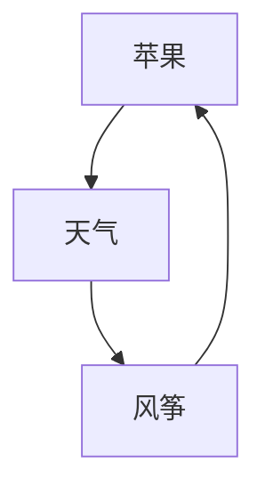

## 此文件是用户个人工作笔记，AI工具不用管其中的内容

1. 全量IM传入的消息入库存储备查；
包括群内不是@自己的信息。群内非@自己信息，在信息入库后，意图分析前，插入hook进行判断。判定为‘群内非@自己’则阻断后续任务。

2. 查询类溯源告知；
查数类请求，要回复时告知信息来源原文件。如查询出差报销限额，通过RAG找到了《集团报销规范》有相关要求，根据信息作答后，告知信息来源文件是此文件

3. 鉴权策略；
人员权限的管理从工具使用权、业务流使用权、数据库与具体表单访问权的权限与人员表进行绑定来实现

4. 守护Agent的审核依据约定；三类
所有业务流统一出自SOP流程库，约定流程库的文件，自述输出信息的审核原则。且包含SOP流与数据库表的绑定约定。供Agent参考。
数据库每个表单单独撰写审核原则，包括外链关联原则校验。（作为数据库数据录入硬限制的补充，避免循环限定问题）
树状进度任务流，此模块待开发，开发时单独给审核原则。

5. 守护Agent的审核；
根据审核约定对 数据/信息/文件 进行审核，并给出反馈意见。如：参建单位履约状态不在履约中的单位不应有参与具体工作的记录上传。
可对单一实体、特定范围实体、全量实体 进行审核。审核后对信息进行打包签章（哈希签名）

6. 树状进度任务流（项目状态机）；
- 项目各阶段分组分块，每个阶段块分：未启动、运行中、完工维护  三个阶段只有运行中的任务流可以有委派任务。
- 被委派任务的主体，应是某个承包单位（公司实体，外链数据库-公司表），而执行任务的责任人与具体执行人应是某个库内注册用户（用户实体，外链数据库-人员表）。运行中的任务流参与人员，方可上传相关的完工确认单。否则判定为异常。如室内精装班组，若上传建筑结构浇筑任务进展事件，则应判定为异常。
- 树状任务指派溯源审核，每个人有明确的任务、领域覆盖范围，其上传的信息应符合自己的职能，有明显偏差应判异常；如一个景观铺装班组承包班组用户上报的击杀了4只哥斯拉，这肯定是胡闹。

- 项目当前注册的任务流，应将其维护为一个对应的数据库，是一个  生产者-消费者 模式的数据表清单，记录着当前正在执行的阶段模块，关联的公司、用户。跟着分组分块的启动/完工，进行拉起封存的操作。完工维护的分块任务，只能以备注的形式，追加记录。

- 需要一个对全生命周期的任务分组分块的原则。它应有主线与支线
主线 如：拿地、取证、设计、招标、总包合同、施工完成、交付验收
支线 如：景观、精装、安装、软转、水电等设计、工程

- 阶段启闭策略：模块启闭负责人制度。两种启闭模式：
    - 一是明确模块启闭客观条件，自动启闭，备案通知到相关负责人，进行按公司要求的流程被动启闭，
    - 二是负责人强项启闭模块，只有管理员、项目总、模块负责人有权强行启闭模块，且要给出备案原因。

7. 规范、规章类数据源存放结构约定；
集团规范、国家法规数据源用外链（方便需要统一的信息源，如国家法规更新、企业业务规范更新）。
地标、项目信息 系统配置内部仓库做数据源。且内容原则上不得超出外链来的对应信息。（地标不突破国标，项目制度不突破企业制度）
如，项目启动要求，为企业标准，用于子项目启动时的搭建框架。

8. 自进化模块；
一个持续对项目信息的观察员Agent常驻任务流，它根据实际服务产生的数据，分析反思现有SOP流、数据库结构、总线+hook流程的合理性。必要时提出改进计划，提交管理员。

EX. 可视化控制台

---

会话流转单 数据结构类，继承自StandardMessage
### 总线管道：
#### S1阶段：信息传入

- before：无
- main： 信息结构化，用实例化的标准信息流‘数据结构类’初始化‘会话流转单’实例对象进入管道
- after：
    1. 会话连续性判断，检查当前用户是否有会话保持。将会话ID补充入‘会话流转单’
        - 若有：复用会话编号。补充如
        - 若无：使用会话编号生成脚本生成
#### S2阶段：


---
业务流程编排
## session机制：
- 功能：多任务交互排队、单焦点护持锁、待确认队列排序、区分多task展示顺序、IM消息路由
- 需求：需要有独立调度Agent，改造master-agent作为session调度。
- 具备：session层级业务流转单（状态机）
- 新session拉起：
    - 加载滑动窗口对话载入机制，加载最近20轮对话，远期对话加载摘要
    - sop流摘要
    - 基座工具摘要
    - 项目状态机摘要（暂mork待实现）
- 生命周期切分：1、用户主动要求切分。2、会话挂起时间超阈值（无对话超30分钟）

## task：树状结构，用户交互确认是子task。
- task的状态可以有：在办、挂起等待、办结
- 每个用户可以有多个task
- 具备：task各子层级关联单独立的业务流转单（状态机）、父节点记录



User Message
  │
  ▼
Message Gateway                          ← main.py + Adapter + DomainTakeover
  │
  ▼
Session Runtime                          ← 一个层，两个类
  │
  ├── SessionManager.get_or_create()
  ├── 确定性路由
  └── 构造 context（注入 session + route_hint）
  │
  ▼
Pipeline Bus                      ← 8 阶段，不变
  │
  ├── intake     ← 消息入库/绑定/快速通道
  ├── route      ← SOP 意图识别 + 模糊消息归属判断
  ├── auth       ← 权限校验
  ├── plan       ← 生成执行计划
  ├── execute    ← 工具调用/DB写入/RAG
  ├── compose    ← 生成自然语言回复
  ├── verify     ← 出站审核
  └── archive    ← 出站存档
  │
  ├─────────────────────────────────┐
  │  Hook (横切，挂载在阶段上)        │
  │  ├── AuditHook → EventBus        │
  │  ├── TraceHook → EventBus        │
  │  ├── VerifyHook                  │
  │  └── ProgressHook                │
  └─────────────────────────────────┘
  │
  ▼
Response


---
User Message
  │
  ▼
Message Gateway                          ← main.py + Adapter + DomainTakeover
  │
  ▼
  Session Runtime 
## 整个信息流流转全景
整个过程就是个pipeline
与用户交互的是session模块，它有自己的调度机
session的调度体现在：
1、监听message入站
2、监听workitem状态机更新
3、组织自然语言出站


session模块保持一个常驻workitem状态机，用于发送短路信息给session调度机

### 1、监听message入站
- session调度
  - 匹配 上 激活的session，信息路由入 session状态机入站通道
  - 周期性休眠session（异步10分钟一检）
  - create session
    - 分配session_ID
    - 拉起master-Agent
    - 配置session状态机
      - 用户长期记忆文件
      - 历史对话文件
      - 用户权限列表
      - workitem列表与状态机

- 维护一个 session 列表：
  - session模块包含：session_ID、session 最后通话时间、session状态（激活、休眠）

### 2、session模块
- session调度机监听workitem状态机
- session调度机监听机入站通道：意图识别+拆分  交给  常驻workitem状态机
  - 是短路指令？：确认/闲聊/其他兜底，若是由master-Agent根据直接响应。更新workitem状态机或常驻workitem状态机
  - 非短路指令？：master-Agent拆分workitem并更新表，填写workitem状态机。
  - workitem状态机包含：要用到的sop，要用到的基座工具，要用到的数据库范围  ->  鉴权审核，直接更新状态机
- 执行：启动workitem engine  sub总线
  - 根据状态机需求描述，灌注拉起workAgent。
- 交互：master-Agent根据workitem状态机，生成自然语言回复

### 3、信息出站
多任务交互排队、单焦点护持锁、待确认队列排序

```mermaid
A[message入站监听路由模块]
B[session模块]
C[workitem engine 模块]