# Emily 系统技术白皮书

> 地产开发团队公共大脑 - 陪跑地产开发全生命周期的AI工具
>
> 版本：V1.0 | 最后更新：2026-07-14

---

## 1. 软件概述

### 1.1 基本信息

**Emily** 是一款陪跑地产开发全生命周期的AI协作工具，定位为"地产开发团队公共大脑"。系统通过QQ等即时通讯渠道接入，以纯口语化交互方式，帮助团队完成消息归档、节点追踪、意图路由、知识沉淀等日常工作，让个体经验沉淀为团队公共能力。当前版本 V1.0，技术架构采用薄插件 + 独立业务内核（Session 主线 + WorkItem + PipelineBUS）。

### 1.2 软件定位

**Emily** 是一款专为地产开发行业设计的 **团队公共大脑**，旨在解决传统地产项目管理中的核心痛点：

#### 行业痛点

| 痛点 | 影响 |
|------|------|
| **信息差** | 开发建设中的过程细节散落各处，关键信息不对称 |
| **协作低效** | 依赖"人盯人"的原始模式，跨团队沟通成本高 |
| **经验流失** | 团队成员变动导致宝贵经验无法传承 |
| **知识孤岛** | 各专业条线知识无法共享，同类问题重复踩坑 |


### 1.3 核心价值主张

#### ✨ 价值一：全面记录，消除信息差

开发建设中的过程细节被全量归档、追踪和统一管理，消除信息不对称。

#### ✨ 价值二：高效协作，打破信息壁垒

多渠道统一接入、纯口语化交互与意图智能路由，大幅提升团队协作效率。

#### ✨ 价值三：知识沉淀，经验永不流失

通过世界书、规则书和自我认知书的三书协同自进化，将行业经验永久沉淀为团队资产。

#### ✨ 价值四：模式升级，AI 融入日常

节点巡检、健康度监控与智能推荐让AI工具融入地产行业日常。

### 1.4 功能全景图

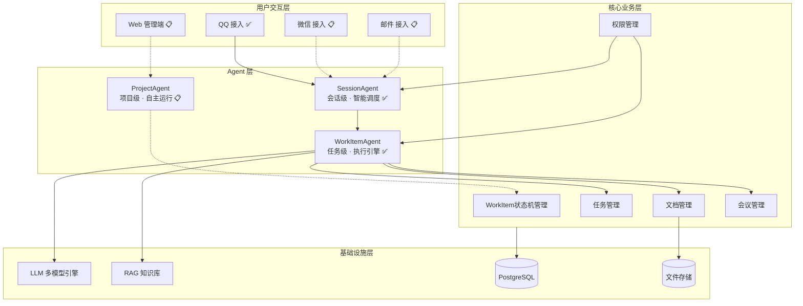

> **图例**：✅ 已实现 | 📋 规划中 | -.-> 规划中连接

---

## 2. 系统架构设计

### 2.1 设计理念：薄插件 + 独立业务内核

Emily 采用 **"薄插件 + 独立业务内核"** 的架构设计，确保系统的可扩展性和独立性：

#### 设计原则

| 原则 | 说明 |
|------|------|
| **插件无业务** | 薄插件层仅做协议转换和消息转发，不含任何业务逻辑 |
| **内核不依赖** | 业务内核不依赖具体 IM 平台，可以独立运行和演进 |
| **分层不可跳** | 严格分层架构，各层不可跨层调用，确保职责边界清晰 |
| **WorkItem+PipelineBUS 驱动** | WorkItem 6 态状态机 + 4 节点 PipelineBUS 驱动业务流转，确保一致性和可追溯性 |

#### 架构优势

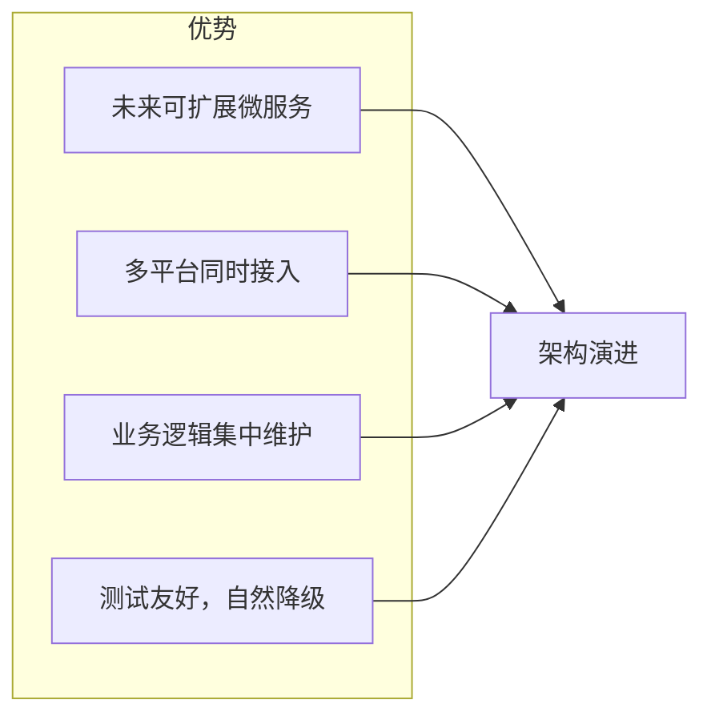

#### 降级策略

系统各组件在 LLM 不可用时有自然降级行为，无需显式模式切换：

| 组件 | 正常路径 | LLM 不可用时 |
|------|----------|-------------|
| **规划器** | `WorkItemAgent._llm_plan()` | `_fallback_steps()`（3 步通用计划） |
| **执行器** | `WorkItemAgent._real_execute()`（M14 直调） | 无 BusinessFlowToolRegistry 时返回空结果 |
| **Guardian** | `RealGuardian` 陪跑+出站审核 | 跳过（`_guardian=None`） |
| **鉴权** | `PermissionAuthEngine` 三维鉴权 | 无引擎时走 `sop_allow` 白名单 |
| **风险评估** | `grade_risk()` 按 intent_type 分级 | 始终按分级逻辑执行 |

### 2.2 技术架构图

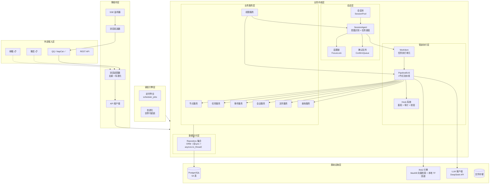

### 2.3 分层架构说明

#### 第一层：薄插件层（Plugin Layer）

**职责**：协议转换、消息去重、标准化、转发

| 组件 | 职责 | 关键文件 |
|------|------|----------|
| 消息适配器 | IM 平台消息 → StandardMessage | `adapters/astrbot/inbound_adapter.py` |
| API 客户端 | StandardMessage → POST `/api/v1/message/send` | `adapters/api_client.py` |
| SSE 监听器 | 监听核心层出站事件 | `adapters/sse_listener.py` |
| 消息发送器 | ReplyMessage → IM 平台消息 | `adapters/astrbot/outbound_sender.py` |

**设计约束**：
- 插件层不 import 任何 `emily_core.*` 包
- 仅依赖 DTO 副本（`adapters/standard/*.py` 为 Core 对应类的刻意副本）
- 无状态，可水平扩展

#### 第二层：协议层（Protocol Layer）

**职责**：API 路由、SSE 事件流、请求验签

| 端点 | 方法 | 说明 |
|------|------|------|
| `/api/v1/message/send` | POST | 入站消息入口 |
| `/api/v1/events/outbound` | GET | SSE 出站事件流 |
| `/api/v1/health` | GET | 健康检查 |
| `/api/v1/session/terminate` | POST | 会话终止 |

#### 第三层：会话层（Session Layer）

**职责**：用户意图识别、多任务调度、上下文管理

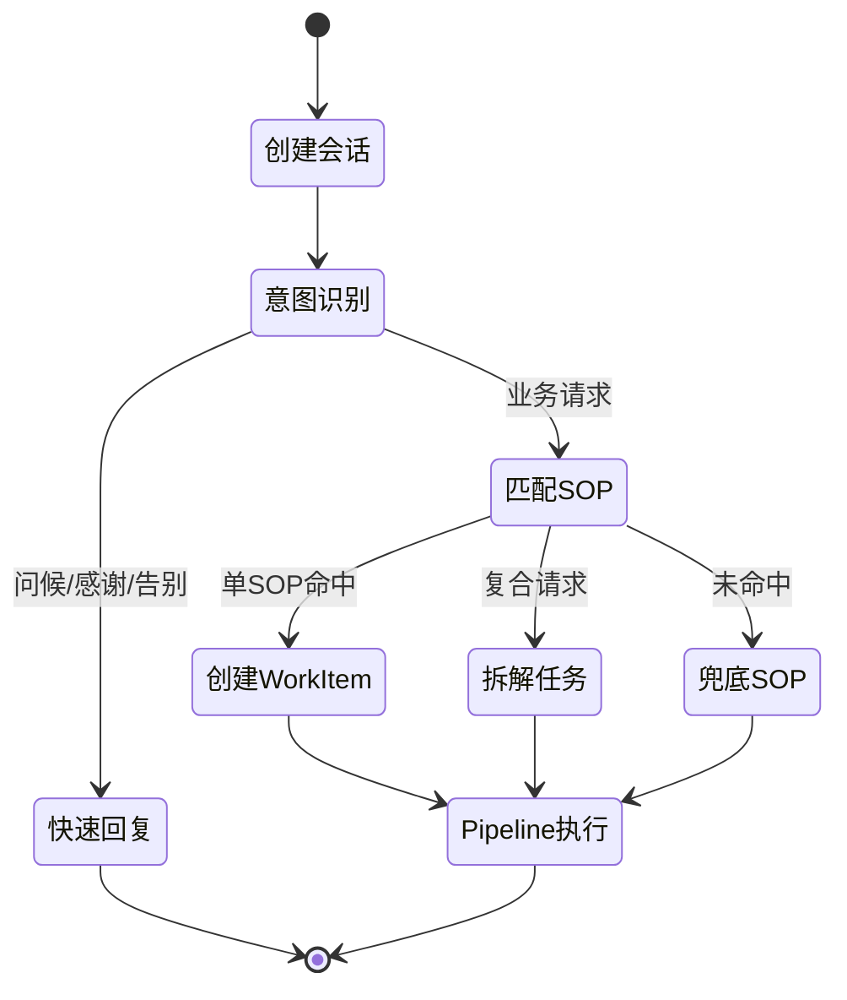

**核心组件**：
- **SessionPool**：`conversation_id` → `SessionAgent` 映射，TTL 自动清理
- **SessionAgent**：每会话大脑，负责意图识别和任务调度
- **FocusLock**：话题切换检测，防止上下文污染
- **ConfirmQueue**：待用户确认的任务排队，支持恢复

#### 第四层：管道执行层（Pipeline Layer）

**职责**：4 节点流水线执行、Hook 挂载、WorkItem 状态机驱动

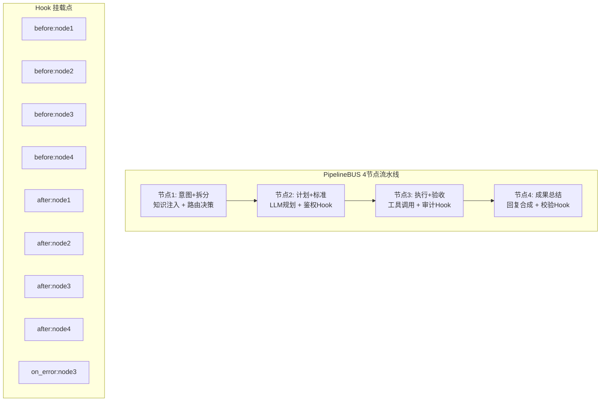

**Pipeline 节点说明**：

| 节点 | 名称 | 必选 | 核心职责 |
|------|------|------|---------|
| **node1** | 意图+拆分 | ✅ | KnowledgeInjector 增量注入 SOP/工具/Schema，构建并验证 RouteDecision |
| **node2** | 计划+标准 | ✅ | LLM Planner 生成 ExecutionPlan（含风险等级/步骤/验收标准） |
| **node3** | 执行+验收 | ✅ | 遍历 PlanStep，调用 BusinessFlowTool handler 或 RAG 检索 |
| **node4** | 成果总结 | ❌ | 合成 result_text → verified_reply，Guardian 内容审核 |

#### 第五层：业务服务层（Service Layer）

**职责**：领域逻辑实现、事务管理、跨领域协调

| 服务 | 职责 | 对应 SOP |
|------|------|----------|
| NodeService | 全景节点管理、状态流转、成果进度 | SOP-011-SYS |
| TaskService | 任务创建、分配、追踪、验收 | SOP-003-REC |
| EventService | 事件记录、分类、关联、简报 | SOP-002-REC |
| MeetingService | 会议纪要、待办提取、追踪 | SOP-001-REC |
| FileService | 文件归档、版本链、权限控制 | SOP-004-FILE |
| QueryService | 跨表查询、统计、报表生成 | SOP-005-QRY |
| PermissionService | 权限校验、范围控制、授权管理 | 系统内置 |

#### 第六层：数据访问层（Repository Layer）

**职责**：ORM 操作、数据一致性保证

**核心 Repository**（全部 sync，async Service 用 `asyncio.to_thread()` 包裹）：
- `UserRepository` - 用户与 IM 绑定
- `MessageRepository` - 消息全量归档
- `NodeRepository` - 全景节点树
- `TaskRepository` - 任务管理
- `EventRepository` - 事件记录
- `MeetingRepository` - 会议管理
- `FileRepository` - 文件与版本链
- `PermissionGrantRepository` - 权限授权
- `AgentReasoningRepository` - Agent 推理日志
- `EvolutionRepo` - 自进化洞察/规则/补丁

### 2.4 核心数据流

#### 端到端消息处理流程

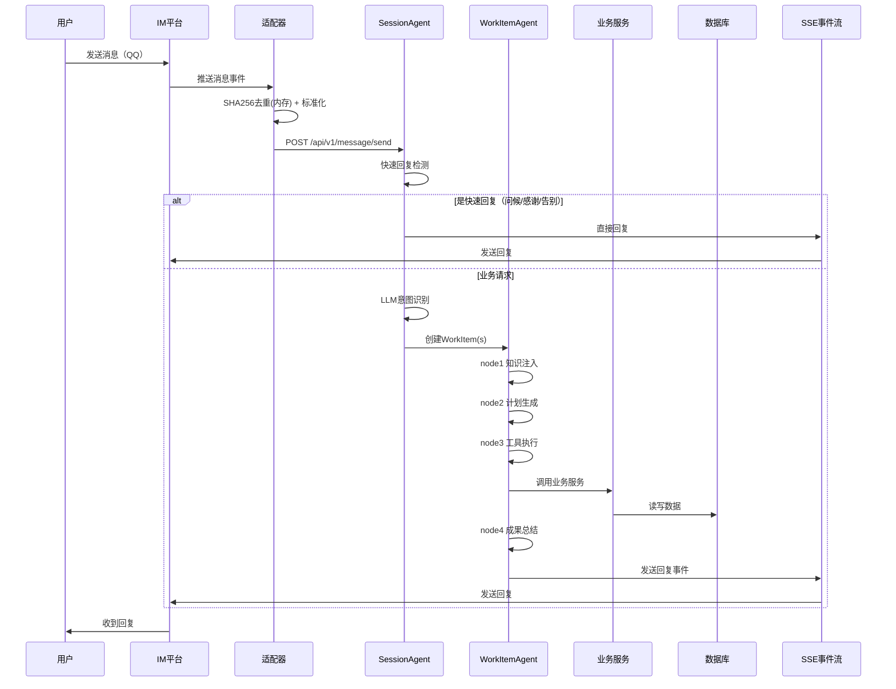

#### WorkItem 状态机流转

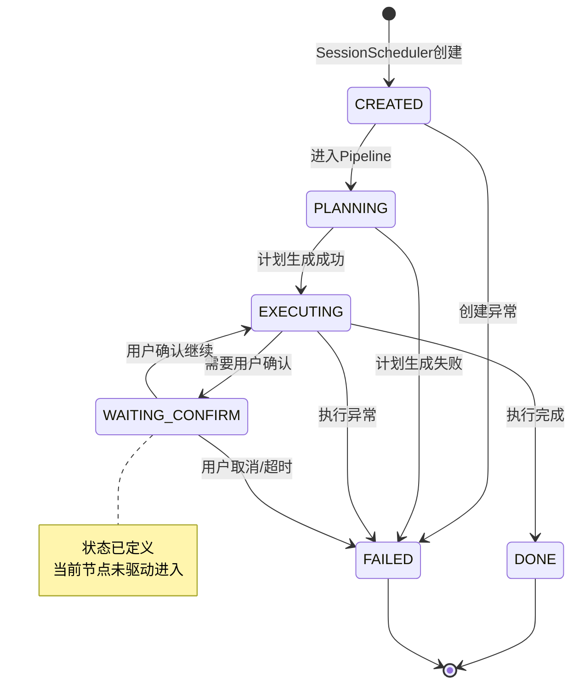

**状态说明**：

| 状态 | 含义 | 触发条件 |
|------|------|---------|
| `CREATED` | 任务已创建 | SessionScheduler 从用户消息解析创建 |
| `PLANNING` | 正在生成执行计划 | WorkItemAgent.node2 调用 LLM Planner |
| `EXECUTING` | 正在执行计划步骤 | WorkItemAgent.node3 遍历 PlanStep 调用工具 |
| `WAITING_CONFIRM` | 等待用户确认 | 执行到需要用户决策的节点 |
| `DONE` | 执行成功完成 | 所有步骤执行通过，成果合成完成 |
| `FAILED` | 执行异常或终止 | 任何节点异常 / 用户取消 / 超时 |

---

## 3. 核心业务模块详解

### 3.1 全生命周期管理（信息全生命周期流程）

#### 3.1.1 消息处理机制

**消息标准化流程**：

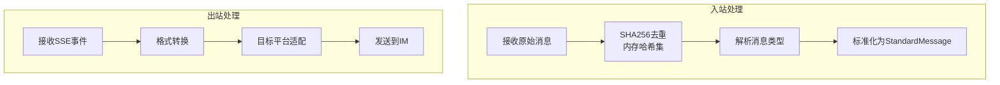

**去重机制**：
- 对每条消息计算 `SHA256(platform + conversation_id + message_id + content)`
- 内存哈希集缓存最近 10 分钟的消息哈希
- 重复消息直接丢弃，避免重复处理

**StandardMessage 标准化字段**：

| 字段 | 类型 | 说明 |
|------|------|------|
| `message_id` | str | 消息唯一 ID |
| `platform` | str | "napcat" / "qq" / "simulator" |
| `conversation_type` | str | "private" / "group" |
| `conversation_id` | str | 群 ID 或私聊用户 ID |
| `sender_id` | str | 发送者 IM ID |
| `sender_name` | str | 发送者昵称 |
| `is_at_bot` | bool | 是否 @机器人 |
| `content` | str | 消息文本（@bot 已剥离） |
| `msg_type` | int | 1文本/2图片/3文件/4语音/5视频/6卡片 |
| `attachments` | list[dict] | 附件列表 |
| `group_id` | str\|None | 群 ID |
| `mentioned_user_ids` | list[str] | 被 @用户 ID 列表 |
| `reply_to_message_id` | str\|None | 引用的消息 ID |

#### 3.1.2 Session 会话管理

**会话生命周期**：

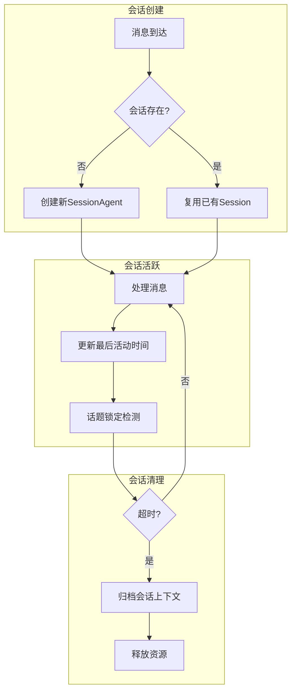

**SessionContext 上下文数据结构**：

```python
{
    "session_id": "uuid",
    "conversation_id": "group-xxx",
    "permission_snapshot": {
        "level": 3,
        "company_type": "施工单位",
        "sop_allow": ["SOP-001-REC", "SOP-002-REC", ...],
        "project_ids": ["proj-uuid-1"],
        "authorized_node_ids": ["node-001", "node-002"],
    },
    "recent_turns": [...],          # 最近对话轮次
    "user_memory_summary": "...",   # 用户长期记忆摘要
    "sop_tool_catalog": "...",      # SOP/工具目录摘要
    "focus_topic": "当前话题关键词",  # 话题锁定
    "last_activity_at": "2026-07-14T10:30:00+08:00",
}
```

#### 3.1.3 WorkItem 工作项流转

**从用户消息到 WorkItem 的拆解过程**：

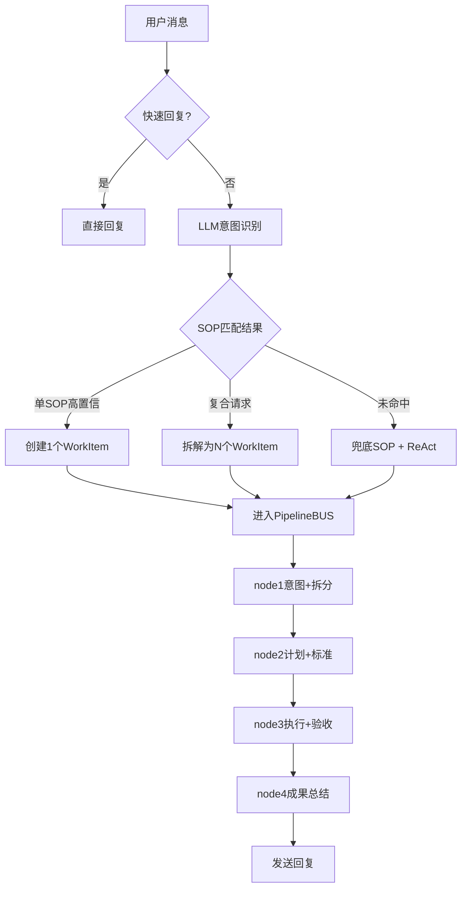

**WorkItem 数据结构**：

```python
{
    "workitem_id": "wi-uuid",
    "session_id": "session-uuid",
    "sop_id": "SOP-001-REC",
    "sop_version": "v1.0",
    "status": "EXECUTING",
    "priority": "normal",  # low/normal/high/urgent
    "user_intent": "用户原始意图",
    "route_decision": {
        "intent_type": "SOP",
        "sop_id": "SOP-001-REC",
        "confidence": "high",
        "is_compound": False,
        "tools_needed": ["record_meeting"],
    },
    "execution_plan": {
        "risk_level": "L2",
        "steps": [
            {"tool": "record_meeting", "params": {...}, "description": "..."},
            {"tool": "extract_action_items", "params": {...}, "description": "..."}
        ],
        "acceptance_criteria": "..."
    },
    "current_step": 1,
    "tool_results": [],
    "created_at": "...",
    "updated_at": "..."
}
```

---

### 3.2 全景节点管理系统

#### 3.2.1 树状结构设计

**节点层级体系**：

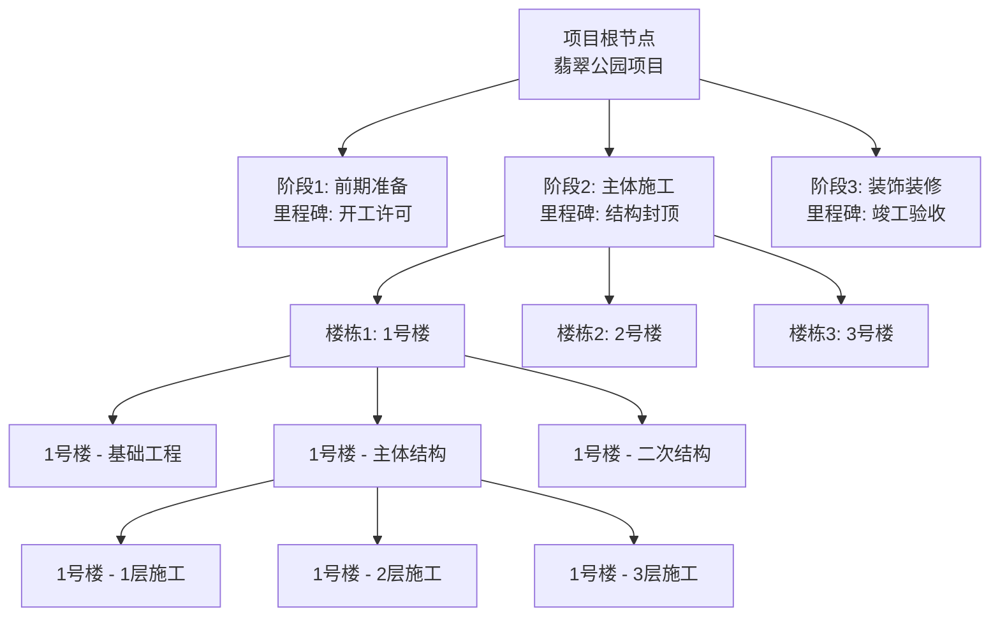

**节点属性设计**：

| 属性 | 类型 | 说明 |
|------|------|------|
| `id` | UUID | 全局唯一节点 ID |
| `node_no` | String | 业务编号（如 NODE-20260714-0001） |
| `title` | String | 节点名称 |
| `description` | String | 节点描述 |
| `level` | Integer | 层级深度 |
| `parent_node_id` | UUID | 父节点 ID |
| `project_id` | UUID | 所属项目 |
| `status` | Enum | NOT_ACTIVATED / CONDITIONS_NOT_MET / IN_PROGRESS / COMPLETED |
| `weight` | Integer | 父子权重 |
| `progress` | Integer | 进度 0-100 |
| `approver_id` | UUID | 审批人 |
| `approved_at` | String | 审批时间 |

#### 3.2.2 里程碑体系

**里程碑类型**：

| 类型 | 说明 | 典型示例 |
|------|------|---------|
| **强制里程碑** | 必须完成才能进入下一阶段 | 取得施工许可证、主体结构验收、竣工验收 |
| **关键节点** | 重要时间节点，影响整体进度 | 土方开挖完成、地下结构封顶、主体封顶 |
| **交付里程碑** | 对外交付节点 | 预售节点、交付节点 |

> **📋 里程碑看守机制**（规划中）：5 分钟定时巡检 → T-7/T-3/T-1 分级预警 → 智能解堵推荐。当前里程碑节点通过节点成果提交和状态流转管理。

#### 3.2.3 文件可见范围控制

**基于节点的权限继承**：

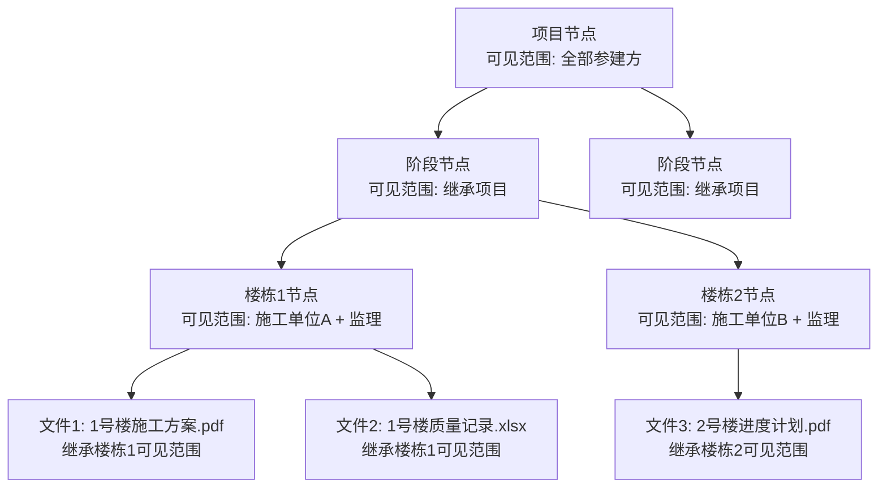

**可见范围规则**：

| 规则 | 说明 |
|------|------|
| **继承规则** | 子节点默认继承父节点的可见范围 |
| **收窄规则** | 子节点可见范围只能是父节点的子集，不能扩大 |
| **显式授权** | 可通过权限申请流程临时扩大可见范围 |
| **文件关联** | 上传到节点的文件自动继承该节点的可见范围 |

#### 3.2.4 任务依据与完工上报机制

**从节点到任务的分解**：

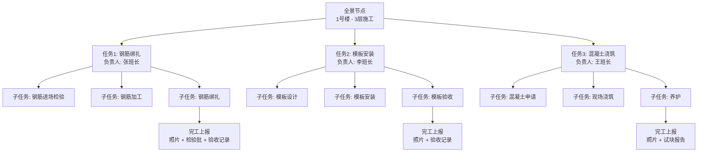

**完工上报流程**：

1. **负责人发起**：任务负责人确认完成，提交完工上报
2. **附件要求**：必须上传现场照片、检验批、验收记录等佐证材料
3. **AI 预检**：系统自动检查材料完整性，提示补充
4. **监理审核**：监理工程师现场核验，签署意见
5. **节点更新**：审核通过后，自动更新节点进度和状态

#### 3.2.5 节点生命周期

**四态节点状态机**：

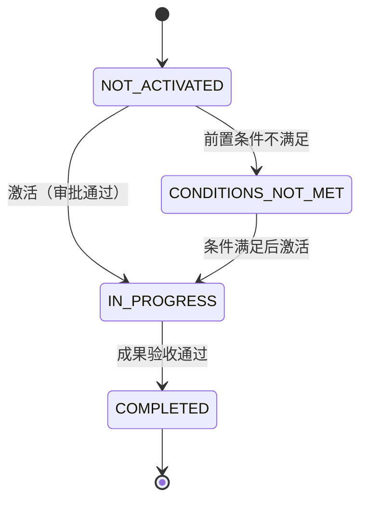

| 状态 | 颜色 | 说明 |
|------|------|------|
| `NOT_ACTIVATED` | ⚪ 灰色 | 尚未激活，等待审批或前置条件 |
| `CONDITIONS_NOT_MET` | 🟡 黄色 | 前置条件不满足，无法开始 |
| `IN_PROGRESS` | 🔵 蓝色 | 正常进行中 |
| `COMPLETED` | 🟢 绿色 | 已完成，通过验收 |

---

### 3.3 SOP 流程引擎

#### 3.3.1 SOP 设计规范

**SOP 七段式结构**：

```markdown
# SOP-001-REC: 会议纪要记录

## 1. SOP 标识
- SOP_ID: SOP-001-REC
- 版本: v1.0
- 适用场景: 项目周例会、专题会议、监理例会等会议记录
- 触发词: ["开会", "会议纪要", "记录会议", "周例会"]

## 2. 意图识别
- 核心意图: 记录会议内容，提取待办事项
- 前置条件: 用户明确提到会议相关词汇
- 置信度阈值: medium

## 3. 工具与权限
- 必需工具: record_meeting, extract_action_items
- 所需权限: meeting:create, task:create
- 知识范围: 当前项目

## 4. 执行步骤
1. 询问会议基本信息（类型、时间、地点、参会人）
2. 记录会议主要内容和决议
3. 提取待办事项（负责人、截止时间）
4. 生成会议纪要初稿
5. 请用户确认后正式保存

## 5. 输出规范
- 会议编号: MTG-YYYYMMDD-NNNN
- 纪要格式: Markdown
- 待办格式: - [ ] 待办内容 @负责人 截止:YYYY-MM-DD

## 6. 异常处理
- 信息不全: 主动询问补充
- 权限不足: 提示联系管理员
- 创建失败: 记录日志，提示重试

## 7. 后续动作
- 将待办事项自动转化为任务
- 通知相关参会人
- 关联到对应项目节点
```

#### 3.3.2 SOP 注册与发现机制

**SOP 注册表数据结构**：

```python
{
    "sop_id": "SOP-001-REC",
    "version": "v1.0",
    "display_name": "会议纪要记录",
    "category": "RECORD",
    "trigger_keywords": ["开会", "会议纪要", "记录会议"],
    "intent_examples": [
        "帮我记录一下今天的周例会",
        "刚才的会议内容整理一下",
        "开个专题会议，记录一下"
    ],
    "required_tools": ["record_meeting", "extract_action_items"],
    "required_permissions": ["meeting:create", "task:create"],
    "min_permission_level": 1,
    "is_active": true,
    "is_deprecated": false,
    "file_path": "emily-data/sops/SOP-001-REC-meeting.md",
    "loaded_at": "2026-07-14T09:00:00+08:00"
}
```

**热重载机制**：
1. 系统启动时扫描 `emily-data/sops/` 目录（SOPIntentRegistry）和 `emily-data/skills/` 目录（SkillRegistry）
2. 解析所有 `.md`/`.skill.yaml` 文件，构建内存注册表
3. 支持通过 API 端点触发热重载（SkillRegistry.reload()），无需重启容器
4. 若未主动触发热重载，新增 SOP 需重启 emily-core 生效

#### 3.3.3 执行引擎原理

**SOP 匹配与执行流程**：

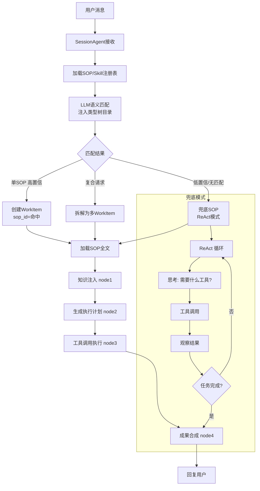

#### 3.3.4 SOP 新增流程

**零代码新增 SOP 三步法**：

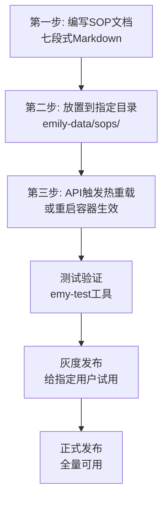

**新增 SOP 示例**：

```markdown
# SOP-099-REC: 安全巡检记录

## 1. SOP 标识
- SOP_ID: SOP-099-REC
- 版本: v1.0
- 适用场景: 日常安全巡检记录
- 触发词: ["安全巡检", "安全检查", "隐患记录"]

## 2. 意图识别（略）
## 3. 工具与权限（略）
## 4. 执行步骤（略）
## 5. 输出规范（略）
## 6. 异常处理（略）
## 7. 后续动作（略）
```

放置到目录后，通过 API 触发热重载或重启容器即可生效。

#### 3.3.5 异常处理机制

**SOP 执行异常分类**：

| 异常类型 | 触发场景 | 处理策略 |
|---------|---------|---------|
| **信息不足** | 用户提供的信息不完整 | 主动询问，引导补充 |
| **权限不足** | 用户权限低于 SOP 要求 | 提示原因，引导申请权限 |
| **工具失败** | 工具调用异常 | 重试 2 次 → 失败提示 → 记录日志 |
| **LLM 超时** | 大模型响应超时 | 降级策略（fallback steps/简化处理）→ 提示用户 |
| **依赖缺失** | 前置条件不满足 | 说明原因，引导先完成前置 |
| **用户中断** | 用户明确取消 | 清理上下文，确认取消 |

**异常处理流程**：

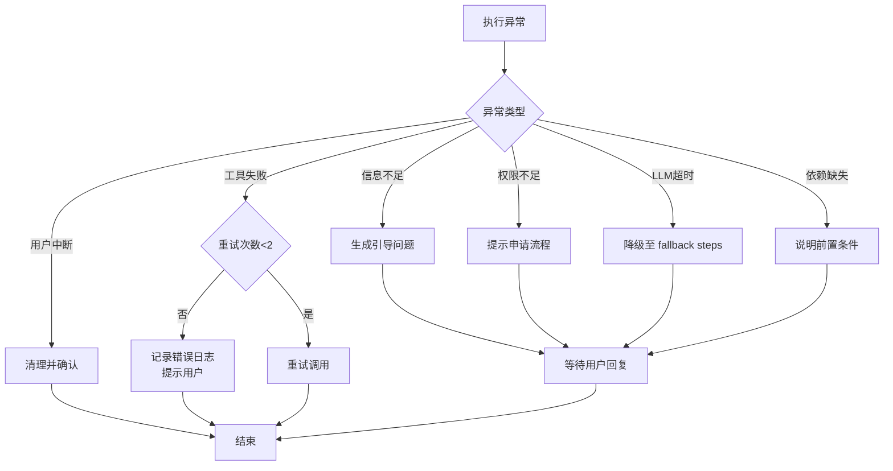

---

### 3.4 自进化系统

> **实现状态说明**：三书体系已建立数据模型和基础服务，但部分高级功能（Rete 规则引擎、认知漂移检测、灰度验证闭环）仍在规划中。以下按已实现和规划中分别标注。

#### 3.4.1 三书体系架构

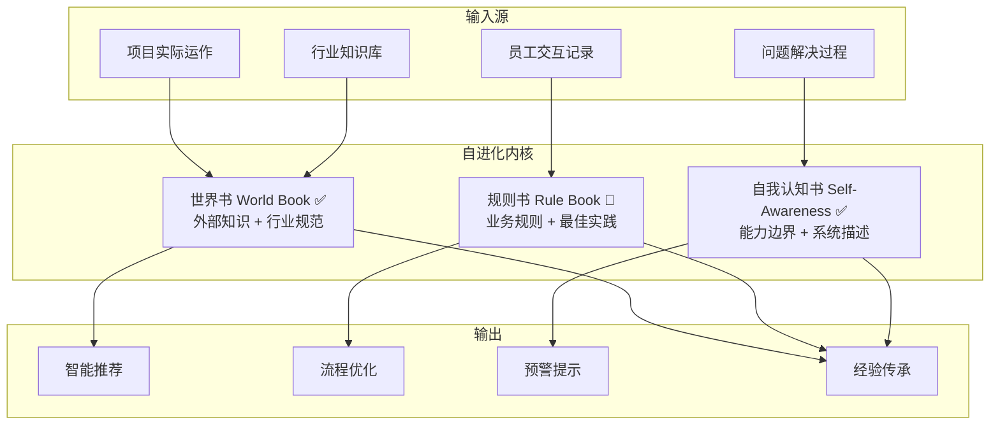

> **图例**：✅ 已实现 | 🔧 部分实现 | 📋 规划中

#### 3.4.2 世界书（World Book） ✅

**世界书内容结构**：

| 分类 | 内容 | 来源 | 更新频率 |
|------|------|------|---------|
| **行业规范** | 国家规范、行业标准、地方规定 | 人工导入 | 月度 |
| **项目资料** | 地勘报告、设计图纸、施工方案 | 文件上传解析 | 实时 |
| **历史经验** | 历史项目的问题、解决方案、教训 | 自动提炼 | 每日 |
| **组织知识** | 公司管理制度、流程规范 | 人工录入 | 按需 |

**世界书构建流程**：

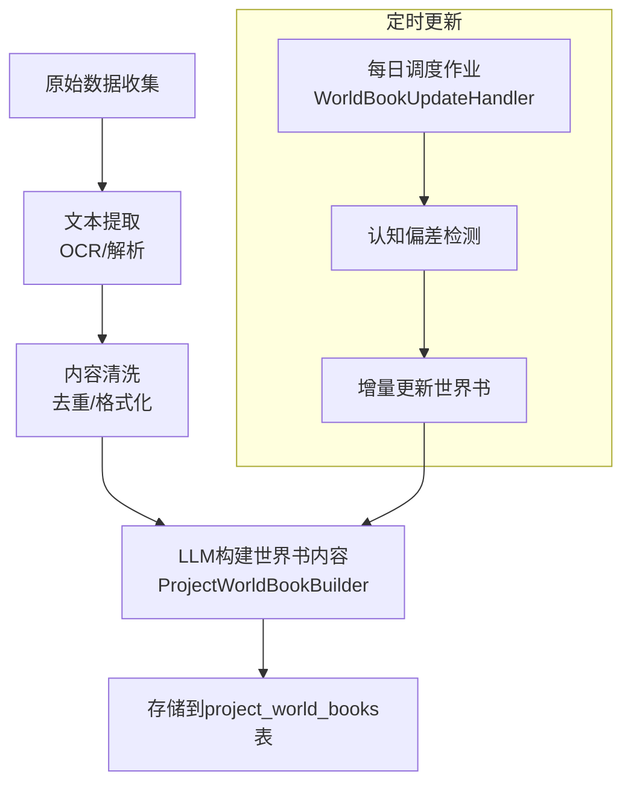

**世界书检索策略**：
- **向量检索**：通过 MaxKB hit_test API 语义匹配（默认）
- **关键词回退**：本地 TF 关键词搜索（MaxKB 不可用时兜底）
- **范围过滤**：按项目阶段（stage）、岗位角色（role）缩小检索范围

#### 3.4.3 规则书（Rule Book） 🔧

**规则书内容结构**：

```python
{
    "business_rules": [
        {
            "rule_id": "RULE-001",
            "name": "工程款支付审批流程",
            "condition": "申请金额 > 100万 AND 进度 < 80%",
            "action": "需要总经理审批",
            "priority": "high",
            "source": "财务管理制度V3.0",
            "version": "v1.0"
        }
    ],
    "best_practices": [
        {
            "practice_id": "BP-001",
            "name": "雨季施工注意事项",
            "scenario": "天气预报显示未来3天有大雨",
            "recommendation": [
                "检查基坑排水系统",
                "暂停室外高空作业",
                "覆盖已浇筑混凝土"
            ],
            "source": "项目经验总结"
        }
    ]
}
```

**当前实现**：RuleBookLoader 加载 YAML 规则文件 → 注入 Session prompt 供 LLM 参考。规则作为上下文提示 LLM，不通过独立的规则引擎执行。

> **📋 规划中**：Rete 算法规则引擎，支持条件自动匹配和动作执行。

#### 3.4.4 自我认知书（Self-Awareness Book） ✅

**自我认知维度**：

| 维度 | 内容 | 实现状态 |
|------|------|---------|
| **能力边界** | 系统自我描述（SystemDescription） | ✅ 已实现 |
| **历史表现** | 各 SOP 成功率、平均耗时 | 🔧 部分实现（EvolutionDailyInsight） |
| **错误模式** | 常见错误类型、发生频率 | 🔧 部分实现（AgentTraceService） |
| **知识盲区** | 哪些领域知识不足 | 📋 规划中 |

**SystemDescriptionBuilder**：启动时自动构建系统自我认知描述，包含数据库 schema、SOP 目录、工具列表等，供 LLM 理解系统能力边界。

> **📋 规划中**：认知漂移检测（统计显著性检验）、基准线建立与自动校准。

#### 3.4.5 三者协同进化机制 🔧

**自进化闭环**：

```mermaid
graph TD
    subgraph 观察
        A[用户交互]
        B[任务执行]
        C[结果反馈]
    end

    subgraph 学习 ✅
        D[每日洞察<br/>EvolutionDailyInsight]
        E[规则归纳<br/>RuleInductor]
    end

    subgraph 进化 🔧
        G[世界书更新 ✅<br/>WorldBookUpdateHandler]
        H[规则书更新 🔧<br/>RuleBookLoader热重载]
        I[自我认知更新 ✅<br/>SystemDescriptionBuilder]
    end

    A & B & C --> D
    D --> E
    D --> G
    E --> H
    D --> I
```

**进化触发条件**：

| 触发类型 | 触发条件 | 进化内容 | 实现状态 |
|---------|---------|---------|---------|
| **定时进化** | 调度作业（每日） | 世界书偏差检测 + 更新 | ✅ |
| **规则归纳** | 每周（可配置） | LLM 归纳 EvolutionRule | ✅ |
| **人工触发** | 管理员手动执行脚本 | 全量重建世界书 | ✅ |

> **📋 规划中**：灰度验证→效果评估→全量发布闭环；事件触发式进化；性能触发的自动降级。

---

### 3.5 三维权限控制系统

#### 3.5.1 权限模型原理

**三维权限模型**：

```mermaid
graph TB
    subgraph 维度1: 角色级别
        L1[级别1: 访客<br/>仅公开信息]
        L2[级别2: 参建执行<br/>个人工作范围]
        L3[级别3: 参建管理<br/>团队管理范围]
        L4[级别4: 建设主管<br/>项目全局]
        L5[级别5: 管理员<br/>用户权限管理]
        L6[级别6: 系统管理员<br/>系统配置]
    end

    subgraph 维度2: 数据范围
        P1[范围1: 仅自己<br/>user_id = current_user]
        P2[范围2: 所在部门<br/>department = current_dept]
        P3[范围3: 所在公司<br/>company = current_company]
        P4[范围4: 指定项目<br/>project_id IN allowed_projects]
        P5[范围5: 全景节点<br/>node_id IN authorized_nodes]
    end

    subgraph 维度3: 操作类型
        O1[操作1: 读 READ<br/>查询、查看]
        O2[操作2: 写 WRITE<br/>创建、编辑]
        O3[操作3: 删 DELETE<br/>删除、归档]
        O4[操作4: 审 APPROVE<br/>审批、确认]
        O5[操作5: 管 ADMIN<br/>系统管理]
    end

    L1 --> P1 --> O1
    L2 --> P2 --> O1 & O2
    L3 --> P3 --> O1 & O2 & O3
    L4 --> P4 --> O1 & O2 & O3 & O4
    L5 & L6 --> P5 --> O1 & O2 & O3 & O4 & O5
```

**权限编码规则**：

```
权限码 = 资源类型-密级-项目ID-节点ID-资源ID（短横线分隔）

示例：
- DOC-PUBLIC-project-123-*-*   → 项目123下所有公开文档的读权限
- DB-INTERNAL-*-node-456-*     → 节点456下内部数据的写权限
- SOP-INTERNAL-*-*-*           → 所有内部SOP的访问权限
```

#### 3.5.2 范围控制（全景节点 + 企业属性）

**基于全景节点的范围控制**：

```mermaid
graph TB
    U[用户A<br/>施工单位A<br/>负责楼栋1]

    P[项目全景节点树]

    P --> S1[前期准备]
    P --> S2[主体施工]
    P --> S3[装饰装修]

    S2 --> B1[楼栋1<br/>✅ 可见可操作]
    S2 --> B2[楼栋2<br/>❌ 不可见]
    S2 --> B3[楼栋3<br/>❌ 不可见]

    B1 --> F1[1号楼文件<br/>✅ 可见]
    B2 --> F2[2号楼文件<br/>❌ 不可见]

    U --> B1 --> F1
```

**范围控制规则**：

| 规则 | 说明 | 示例 |
|------|------|------|
| **节点可见继承** | 子节点自动继承父节点的可见范围 | 楼栋1可见 → 楼栋1下所有文件可见 |
| **企业类型过滤** | 按参建单位类型限制可见范围 | 施工单位看不到设计单位内部文件 |
| **项目隔离** | 不同项目数据完全隔离 | 项目A的人默认看不到项目B |
| **黑白名单** | SOP↔权限组绑定支持 allow/deny | 特邀专家可查看指定范围 |

#### 3.5.3 企业管理员权限体系

**权限组设计**：

```mermaid
graph TD
    Root[系统权限组]

    Root --> G1[建设单位组<br/>默认级别4]
    Root --> G2[施工单位组<br/>默认级别2]
    Root --> G3[监理单位组<br/>默认级别3]
    Root --> G4[设计单位组<br/>默认级别2]
    Root --> G5[供应商组<br/>默认级别2]

    G1 --> G1_1[建设-工程部]
    G1 --> G1_2[建设-成本部]
    G1 --> G1_3[建设-采购部]

    G2 --> G2_1[施工-项目经理]
    G2 --> G2_2[施工-技术负责人]
    G2 --> G2_3[施工-施工员]
```

**权限组属性**：

| 属性 | 说明 |
|------|------|
| `name` | 权限组名称 |
| `code` | 权限组编码（唯一） |
| `description` | 权限组描述 |
| `company_type` | 适用企业类型 |
| `department` | 适用部门 |
| `org_level` | 组织层级（企业/部门/小组） |
| `parent_group_id` | 父权限组，支持继承 |
| `allowed_sop_types` | 允许使用的 SOP 类型 |
| `min_grouping_level` | 最低分组级别要求 |
| `is_system` | 是否系统内置组（不可删除） |

#### 3.5.4 权限校验流程

**运行时权限校验**：

```mermaid
flowchart TD
    A[用户请求操作] --> B[构建权限快照<br/>PermissionService.build_permission_dict]
    B --> C{级别校验<br/>用户level ≥ 操作要求?}
    C -->|否| D[返回权限不足]

    C -->|是| E{SOP白名单校验<br/>SOP在用户sop_allow中?}
    E -->|否| D

    E -->|是| F{范围校验<br/>资源在用户可见范围内?}
    F -->|否| D

    F -->|是| G{特殊约束检查<br/>企业类型/部门/授权码}
    G -->|不通过| D

    G -->|通过| H[记录权限审计日志]
    H --> I[允许操作]
```

**Hook 集成鉴权**：

权限校验通过 Pipeline Hook 机制实现，采用**声明式 JSON 配置**，挂载在 `before:wi_node2` 和 `before:wi_node3`：

```json
// hook_config.json 中的鉴权 Hook 声明
{
    "mount_point": "before:wi_node2",
    "hook_name": "auth.admin_check",
    "hook_type": "auth",
    "enabled": true
}
```

```python
# 实际 Hook 子类实现（pipeline/hook.py）
class AuthHook(Hook):
    """鉴权 Hook —— 检查管理员权限"""
    async def execute(self, context: BusContext) -> HookDecision:
        user_level = context.session_context.permission_level
        required_level = context.route_decision.min_permission_level

        if user_level < required_level:
            return HookDecision.block(
                f"权限不足: 需要级别{required_level}, 当前级别{user_level}"
            )
        return HookDecision.allow()
```

#### 3.5.5 权限申请与授权

**权限申请流程**：

```mermaid
graph TD
    A[用户发起权限申请] --> B[填写申请信息<br/>原因/范围/时长]
    B --> C[系统自动校验<br/>是否符合申请条件]

    C -->|不通过| D[提示原因，拒绝申请]
    C -->|通过| E[通知审批人]

    E --> F[审批人审核]
    F -->|拒绝| G[通知申请人]
    F -->|同意| H[创建临时授权]

    H --> I[设置授权有效期]
    I --> J[记录授权审计日志]
    J --> K[通知申请人权限已开通]

    L[定时任务<br/>扫描过期授权] --> M[自动回收权限]
    M --> N[通知用户权限已过期]
```

**授权类型**：

| 类型 | 有效期 | 适用场景 |
|------|--------|---------|
| `PERMANENT` | 永久 | 正式岗位权限 |
| `TEMP` | 指定时长 | 临时协助、跨项目支援 |
| `AUTO` | 自动计算 | 基于任务周期，任务完成自动回收 |

---

## 4. 基座工具与基础设施

### 4.1 RAG 知识库系统

#### 4.1.1 向量检索方案

**当前架构**：采用 MaxKB 容器提供向量检索服务，Emily Core 通过 `hit_test` API 调用。向量数据由 MaxKB 内部管理（Qwen3-Embedding-0.6B + pgvector），不在 Emily 的 PostgreSQL 中。

| 方案 | 优点 | 缺点 | 当前选择 |
|------|------|------|---------|
| **MaxKB hit_test** | 开箱即用、Qwen3 中文优化、管理界面友好 | 独立容器、API 依赖 | ✅ 主路径 |
| **本地 TF 回退** | 零依赖、MaxKB 不可用时自动切换 | 仅关键词匹配，无语义理解 | ✅ 兜底 |

**MaxKB 向量存储配置**：
- Embedding 模型：Qwen3-Embedding-0.6B（1024 维）
- 向量存储：pgvector（MaxKB 容器内 PostgreSQL）
- 索引方式：HNSW（余弦相似度）
- 项目隔离：MaxKB 知识库按项目划分

#### 4.1.2 检索策略

**两层检索架构**：

```mermaid
graph TD
    A[用户查询] --> B{MaxKB 可用?}

    B -->|是| C[MaxKB hit_test API<br/>纯向量语义检索]
    C --> D[返回文档段落 + 相似度分数]
    D --> E[格式化为 LLM 上下文]

    B -->|否| F[本地 TF 关键词回退<br/>扫描 .md/.txt 文件]
    F --> G[stage/role 元数据过滤]
    G --> E
```

**当前检索能力**：
- **语义检索**：通过 MaxKB 向量相似度匹配（主路径）
- **关键词回退**：本地 TF 关键词搜索（MaxKB 不可用时）
- **范围过滤**：按项目阶段（stage）、岗位角色（role）过滤

> **📋 规划中**：查询改写、交叉编码器 Rerank、混合检索加权融合。

### 4.2 PostgreSQL 数据库设计

#### 核心表概览（54 表）

**人员与 IM 绑定**：

| 表名 | 说明 | 记录数量级 |
|------|------|-----------|
| `users` | 用户信息 + 权限级别 | 千级 |
| `user_im_bindings` | IM 平台账号绑定 | 千级 |

**通讯与会话**：

| 表名 | 说明 | 记录数量级 |
|------|------|-----------|
| `conversations` | 会话记录（群聊/私聊） | 万级 |
| `messages` | 消息全量归档 | 十万级 |
| `message_attachments` | 消息附件关联 | 万级 |
| `session_archives` | 会话归档（Session 注销时持久化） | 万级 |

**项目与业务记录**：

| 表名 | 说明 | 记录数量级 |
|------|------|-----------|
| `projects` | 项目主表 | 百级 |
| `events` | 项目事件记录 | 万级 |
| `tasks` | 任务管理 | 万级 |
| `meetings` | 会议记录 | 万级 |
| `files` | 文件存储 + 版本链 | 十万级 |
| `company_info` | 参建公司信息 | 百级 |
| `project_indicator_details` | 项目指标明细 | 千级 |
| `business_flow_orders` | 业务流转单 | 万级 |
| `instruction_orders` | 指令单 | 万级 |
| `project_plans` | 计划主表 | 千级 |
| `plan_items` | 计划明细项 | 万级 |

**全景节点 V2**：

| 表名 | 说明 | 记录数量级 |
|------|------|-----------|
| `project_nodes` | 全景节点树 | 千级/项目 |
| `node_dependencies` | 节点依赖关系 | 千级 |
| `node_deliverables` | 节点交付物 | 万级 |
| `node_accessible_files` | 节点可见文件映射 | 万级 |
| `node_events` | 节点事件日志 | 万级 |

**权限系统**：

| 表名 | 说明 | 记录数量级 |
|------|------|-----------|
| `permission_def` | 权限码定义 | 百级 |
| `permission_groups` | 权限组 | 百级 |
| `permission_grants` | 授权记录 | 万级 |
| `permission_requests` | 权限申请审批 | 千级 |
| `permission_audit_log` | 权限审计日志 | 十万级 |
| `sop_business_flows` | SOP 业务流注册 | 百级 |
| `sop_permission_bindings` | SOP↔权限组绑定 | 百级 |
| `pending_data` | 越权写入暂存 | 千级 |
| `data_masking_rules` | 脱敏规则 | 百级 |
| `permission_review_tasks` | 定期评审任务 | 百级 |
| `public_field_registry` | 公开字段白名单 | 百级 |

**日志与追踪**：

| 表名 | 说明 | 记录数量级 |
|------|------|-----------|
| `sop_routing_logs` | SOP 路由决策日志 | 十万级 |
| `agent_reasoning_logs` | Agent 推理记录 | 十万级 |
| `llm_interaction_logs` | LLM 调用日志 | 十万级 |
| `tool_call_logs` | 工具调用日志 | 十万级 |
| `hook_execution_logs` | Hook 执行日志 | 十万级 |
| `pipeline_execution_logs` | 管道执行日志 | 十万级 |
| `evolution_llm_interaction_logs` | 进化LLM交互日志 | 万级 |
| `rag_retrieval_logs` | RAG 检索日志 | 万级 |
| `session_lifecycle_logs` | 会话生命周期日志 | 万级 |
| `scheduler_job_logs` | 调度作业日志 | 万级 |
| `user_feedback_signals` | 用户反馈信号 | 万级 |
| `business_event_logs` | 业务事件日志 | 万级 |

**自进化系统**：

| 表名 | 说明 | 记录数量级 |
|------|------|-----------|
| `project_world_books` | 项目世界书 | 百级 |
| `system_descriptions` | 系统自我认知 | 百级 |
| `evolution_daily_insights` | 每日洞察 | 千级 |
| `evolution_rules` | 归纳规则 | 百级 |
| `evolution_patches` | 进化补丁 | 百级 |

**调度引擎**：

| 表名 | 说明 | 记录数量级 |
|------|------|-----------|
| `scheduler_jobs` | 系统调度作业 | 千级 |
| `scheduler_executions` | 调度执行记录 | 万级 |

**其他**：

| 表名 | 说明 | 记录数量级 |
|------|------|-----------|
| `tool_registry` | 工具注册 | 百级 |
| `session_accessible_files` | 会话可访问文件 | 万级 |
| `sop_checkpoints` | SOP 检查点（已废弃） | — |

### 4.3 其他中间件

#### 4.3.1 缓存策略（内存缓存）

当前系统采用 Python 内存对象作为缓存层，不依赖外部缓存中间件：

| 缓存项 | 存储方式 | 说明 |
|--------|---------|------|
| 会话上下文 | SessionAgent 内存对象 | 随 SessionPool 管理，TTL 30 分钟 |
| 权限快照 | PermissionService 内存缓存 | 构建后注入 SessionContext，版本号控制失效 |
| SOP 注册表 | SOPIntentRegistry / SkillRegistry 内存 | 启动时加载，API 触发热重载 |
| 消息去重哈希 | Python set（内存） | 插件进程内维护最近 10 分钟哈希 |
| Prompt 模板 | prompt_loader 内存缓存 | 文件变更后自动失效重读 |

> **📋 规划中**：系统规模扩大后，可引入 Redis 作为分布式缓存和消息队列，实现多实例水平扩展。

#### 4.3.2 消息队列（AsyncIO Queue）

**当前实现**：采用 Python `asyncio.Queue` 作为进程内消息队列：

| 队列 | 用途 | 消费者 |
|------|------|--------|
| `outbound_events` | 出站事件（回复消息、通知等） | SSE 监听器 |

> **📋 规划中**：系统规模扩大后，可迁移到 Redis Queue 或 Kafka，实现多实例水平扩展。

---

## 5. 总调度引擎

### 5.1 session 定时清理策略

**会话生命周期管理**：

```mermaid
graph TD
    A[定时任务<br/>每分钟执行] --> B[扫描所有活跃会话]
    B --> C[计算最后活动距今时间]

    C --> D{> 30分钟 无活动?}
    D -->|否| E[保持活跃]

    D -->|是| F[标记为待归档]
    F --> G[持久化会话上下文]
    G --> H[释放内存资源]
    H --> I[从会话池中移除]
    I --> J[记录会话归档日志]

    K[用户再次发送消息] --> L{会话已归档?}
    L -->|是| M[从归档恢复]
    L -->|否| N[复用现有会话]
```

**清理规则**：

| 条件 | 动作 |
|------|------|
| 30 分钟无活动 | 自动归档，释放内存 |
| 24 小时无活动 | 彻底清理，不可恢复 |
| 有未完成 WorkItem | 延迟清理，等待任务完成 |
| 有待用户确认 | 保持活跃（最长 7 天） |

### 5.2 定期复盘机制 ✅

**每日复盘流程**：

```mermaid
graph TD
    A[每日调度作业触发] --> B[收集近期数据]

    subgraph 数据收集
        B --> B1[消息日志]
        B --> B2[SOP 执行记录]
        B --> B3[工具调用结果]
    end

    B --> C[指标计算]

    subgraph 指标分析
        C --> C1[SOP 命中率]
        C --> C2[兜底率]
        C --> C3[健康度评分]
    end

    C --> D[生成 EvolutionDailyInsight]
    D --> E[RuleInductor 归纳规则<br/>（每周/可配置）]
```

### 5.3 📋 每日晨报生成流程（规划中）

> 以下为规划中的晨报生成流程，当前调度引擎支持 PeriodicNodeHandler 定期创建 TASK 节点，晨报功能尚未实现。

**项目健康度晨报**：

```mermaid
graph TD
    A[每日早晨 8:00 触发] --> B[扫描所有项目]

    B --> C[节点状态分析]
    C --> C1[卡滞节点清单]
    C --> C2[即将到期里程碑]
    C --> C3[进度偏差统计]

    B --> D[关键指标汇总]
    D --> D1[新增任务/事件/会议数]
    D --> D2[待办事项统计]
    D --> D3[文件上传数量]

    B --> E[风险预警]
    E --> E1[高风险任务预警]
    E --> E2[即将超期待办]
    E --> E3[权限申请待审批]

    C1 & C2 & C3 & D1 & D2 & D3 & E1 & E2 & E3 --> F[LLM 生成晨报]

    F --> G[格式化为 Markdown]
    G --> H[推送到项目群]
    H --> I[@相关负责人]
```

### 5.4 系统冷启动/热启动流程

**冷启动流程（系统重启）**：

```mermaid
graph TD
    A[系统启动] --> B[读取环境变量校验]
    B --> C{校验通过?}
    C -->|否| D[启动失败<br/>输出错误日志]
    C -->|是| E[PostgreSQL 连接测试]
    
    E --> F{连接成功?}
    F -->|否| G[重试 3 次<br/>间隔 5 秒]
    G -->|全部失败| D
    
    F -->|是| H[数据库表检查<br/>create_all + _ensure_columns]
    H --> I[构建权限快照缓存]
    I --> J[加载 SOP/Skill 目录索引]
    J --> K[构建 KnowledgeInjector]
    K --> L[启动 SchedulerEngine]
    L --> M[启动 HTTP 服务]
    M --> N[启动 SSE 事件总线]
    N --> O[系统就绪<br/>输出启动成功日志]
```

**启动自检清单**：

| 检查项 | 失败处理 | 重试机制 |
|--------|----------|----------|
| 环境变量完整性 | 立即终止，错误码 1 | 否 |
| PostgreSQL 连接 | 记录错误日志 | 3 次，间隔 5 秒 |
| MaxKB 连接 | 降级到本地 TF 搜索 | 启动后后台重试 |
| SOP 目录加载 | 使用默认 SOP 继续 | 启动后热加载 |
| 权限缓存预热 | 延迟初始化 | 首次鉴权时动态加载 |

---

## 6. 数据库设计

### 6.1 ER 图

```mermaid
erDiagram
    USERS ||--o{ USER_IM_BINDINGS : "IM绑定"
    USERS ||--o{ MESSAGES : "发送"
    USERS ||--o{ SESSION_ARCHIVES : "归档"
    USERS ||--o{ EVENTS : "创建"
    USERS ||--o{ TASKS : "负责/创建"
    USERS ||--o{ MEETINGS : "创建"
    USERS ||--o{ FILES : "上传"
    USERS ||--o{ PERMISSION_GRANTS : "被授权"

    CONVERSATIONS ||--o{ MESSAGES : "包含"

    PROJECTS ||--o{ EVENTS : "项目"
    PROJECTS ||--o{ TASKS : "项目"
    PROJECTS ||--o{ MEETINGS : "项目"
    PROJECTS ||--o{ FILES : "项目"
    PROJECTS ||--o{ PROJECT_NODES : "项目"

    MESSAGES ||--o{ MESSAGE_ATTACHMENTS : "附件"
    FILES ||--o{ MESSAGE_ATTACHMENTS : "关联"

    PROJECT_NODES ||--o{ NODE_DEPENDENCIES : "依赖"
    PROJECT_NODES ||--o{ NODE_DELIVERABLES : "成果"
    PROJECT_NODES ||--o{ NODE_ACCESSIBLE_FILES : "可见文件"
    PROJECT_NODES ||--o{ NODE_EVENTS : "事件日志"

    PERMISSION_GROUPS ||--o{ SOP_PERMISSION_BINDINGS : "绑定"
    SOP_BUSINESS_FLOWS ||--o{ SOP_PERMISSION_BINDINGS : "绑定"

    SCHEDULER_JOBS ||--o{ SCHEDULER_EXECUTIONS : "生成"

    EVOLUTION_DAILY_INSIGHTS ||--o{ EVOLUTION_RULES : "归纳"
    EVOLUTION_DAILY_INSIGHTS ||--o{ EVOLUTION_PATCHES : "生成"
```

### 6.2 核心表结构详解

#### 用户与身份表

| 表名 | 说明 | 关键字段 |
|------|------|----------|
| `users` | 系统用户表 | `id`, `username`, `email`, `level`, `company`(FK→company_info.id), `project_id`(FK→projects.id), `perm_list`, `org_category`, `supervisor_id`, `status` |
| `user_im_bindings` | IM 平台账号绑定 | `id`, `user_id`(FK→users.id), `im_platform`, `im_user_id`, `im_display_name`, `status` |

**权限层级说明**：

| 级别 | 名称 | 说明 |
|------|------|------|
| 1 | 访客 | 只读访问，可查看公开信息 |
| 2 | 参建执行 | 可创建和编辑自己的内容 |
| 3 | 参建管理 | 团队级读写权限 |
| 4 | 建设主管 | 项目全局读写权限 |
| 5 | 管理员 | 企业级管理权限 |
| 6 | 系统管理员 | 完整系统权限 |

#### 消息与会话表

| 表名 | 说明 | 关键字段 |
|------|------|----------|
| `conversations` | 会话表（群聊/私聊） | `id`, `im_platform`, `conversation_type`, `conversation_id`, `title`, `project_id`, `takeover_mode` |
| `messages` | 消息表 | `id`, `event_id`(UNIQUE), `conversation_id`(FK→conversations.id), `sender_user_id`, `sender_im_id`, `content`, `direction`, `msg_type`, `is_at_bot`, `takeover`, `intent` |
| `message_attachments` | 消息附件 | `id`, `message_id`(FK→messages.id), `file_id`(FK→files.id), `attachment_type`, `file_url`, `local_path`, `file_size` |
| `session_archives` | 会话归档 | `id`, `conversation_id`, `user_id`, `turn_count`, `message_history_snapshot`, `context_snapshot`, `archived_at`, `archive_reason` |

> **注意**：`messages.conversation_id` 是 FK→`conversations.id`（UUID），非业务 conversation_id 字符串。写入前需调用 `_resolve_conversation_id()` 转换。

#### 业务数据表

| 表名 | 说明 | 关键字段 |
|------|------|----------|
| `events` | 事件记录 | `id`, `event_no`(UNIQUE), `project_id`, `user_id`, `title`, `event_type`, `category`, `status`, `related_event_ids` |
| `tasks` | 任务记录 | `id`, `task_no`(UNIQUE), `project_id`, `title`, `owner_id`, `owner_text`, `status`, `due_date`, `due_text` |
| `meetings` | 会议记录 | `id`, `meeting_no`(UNIQUE), `project_id`, `title`, `summary`, `attendees`, `meeting_type`, `meeting_date`, `location`, `conclusion`, `action_items` |
| `files` | 文件归档 | `id`, `file_no`(UNIQUE), `project_id`, `filename`, `file_type`, `storage_path`, `file_size`, `version`, `is_latest`, `parent_file_id`, `confidentiality`, `source_attachment_id` |

#### 全景节点表

| 表名 | 说明 | 关键字段 |
|------|------|----------|
| `project_nodes` | 项目节点 | `id`, `project_id`, `parent_node_id`, `node_no`, `title`, `description`, `status`, `weight`, `progress`, `level`, `path`, `approver_id` |
| `node_dependencies` | 节点依赖 | `id`, `node_id`, `depends_on_node_id`, `dependency_type` |
| `node_deliverables` | 节点交付物 | `id`, `node_id`, `title`, `description`, `status`, `submitted_by`, `submitted_at` |
| `node_accessible_files` | 节点可见文件 | `id`, `node_id`, `file_id`, `visible_scope` |
| `node_events` | 节点事件日志 | `id`, `node_id`, `event_type`, `event_data`, `created_by` |

**节点状态枚举**：`NOT_ACTIVATED`, `CONDITIONS_NOT_MET`, `IN_PROGRESS`, `COMPLETED`

#### 权限系统表

| 表名 | 说明 | 关键字段 |
|------|------|----------|
| `permission_def` | 权限码定义 | `id`, `perm_code`(UNIQUE), `resource_type`, `security_level`, `project_id`, `node_id`, `resource_id`, `description` |
| `permission_groups` | 权限组 | `id`, `name`, `code`(UNIQUE), `description`, `company_type`, `department`, `org_level`, `parent_group_id`, `allowed_sop_types`, `is_system` |
| `permission_grants` | 授权记录 | `id`, `grant_no`(UNIQUE), `grantee_id`(FK→users.id), `grantor_id`, `perm_code`, `grant_type`, `operations`, `expire_time`, `status` |
| `permission_audit_log` | 权限审计日志 | `log_id`(BIGSERIAL), `event_time`, `grantor_id`, `grantee_id`, `perm_code`, `operation_type`, `client_ip`, `remark` |
| `permission_requests` | 权限申请审批 | `id`, `request_no`(UNIQUE), `requester_id`, `perm_code`, `request_type`, `status`, `current_approver_id`, `approval_level` |

#### 自进化系统表

| 表名 | 说明 | 关键字段 |
|------|------|----------|
| `project_world_books` | 项目世界书 | `id`, `project_id`, `content_text`, `content_json`, `initialization_tier`, `token_count`, `status`, `version` |
| `system_descriptions` | 自我认知书 | `id`, `version`, `status`, `content_hash` |
| `evolution_daily_insights` | 每日洞察 | `id`, `insight_date`, `project_id`, `insight_text`, `sop_hit_rate`, `fallback_rate`, `health_score`, `anomaly_flags` |
| `evolution_rules` | 归纳规则 | `id`, `rule_no`(UNIQUE), `title`, `description`, `category`, `confidence`, `status`, `suggested_action` |
| `evolution_patches` | 进化补丁 | `id`, `insight_id`, `patch_content`, `patch_type`, `status` |

#### 调度引擎表

| 表名 | 说明 | 关键字段 |
|------|------|----------|
| `scheduler_jobs` | 调度作业定义 | `id`, `job_no`(UNIQUE), `name`, `job_type`, `cron_expression`, `action_type`, `handler_module`, `action_params`, `status`, `next_execution_at` |
| `scheduler_executions` | 调度执行记录 | `id`, `job_id`, `execution_no`(UNIQUE), `period_key`, `status`, `started_at`, `finished_at`, `error_message`, `result_summary` |

### 6.3 数据字典

#### 通用字段约定

| 字段名 | 类型 | 说明 |
|--------|------|------|
| `*_id` | UUID | 全局唯一标识符（String 存储） |
| `*_no` | String | 业务编号（如 `EVT-YYYYMMDD-NNNN`） |
| `created_at` | String | 创建时间（ISO8601 字符串，非 DB 原生 datetime） |
| `updated_at` | String | 更新时间（ISO8601 字符串，onupdate 自动更新） |
| `is_deleted` | Boolean | 软删除标记，False 表示未删除 |
| `status` | String | 状态枚举，各表定义 |

#### 编号规则

| 编号前缀 | 说明 | 格式 |
|----------|------|------|
| `EVT-` | 事件编号 | `EVT-YYYYMMDD-NNNN` |
| `TSK-` | 任务编号 | `TSK-YYYYMMDD-NNNN` |
| `MTG-` | 会议编号 | `MTG-YYYYMMDD-NNNN` |
| `FIL-` | 文件编号 | `FIL-YYYYMMDD-NNNN` |
| `NODE-` | 节点编号 | `NODE-YYYYMMDD-NNNN` |
| `PND-` | 待解决数据 | `PND-YYYYMMDD-NNNN` |
| `PGR-` | 权限授权 | `PGR-YYYYMMDD-NNNN` |
| `PRQ-` | 权限申请 | `PRQ-YYYYMMDD-NNNN` |
| `JOB-` | 调度作业 | `JOB-YYYYMMDD-NNNN` |

---

## 7. 部署与运维

### 7.1 本地 Docker 部署指南

**前置要求**：

| 软件 | 版本要求 |
|------|----------|
| Docker | 24.0+ |
| Docker Compose | 2.0+ |
| 内存 | 至少 8GB |
| 磁盘 | 至少 50GB 可用空间 |

**部署步骤**：

```bash
# 1. 克隆代码仓库
git clone <repository-url>
cd emily

# 2. 复制环境变量模板
cp .env.example .env

# 3. 编辑环境变量
# 配置 QQ 账号、数据库密码、LLM API Key 等

# 4. 启动所有容器
docker compose -f docker-compose-napcat.yml up -d

# 5. 查看容器状态
docker compose -f docker-compose-napcat.yml ps

# 6. 查看日志
docker logs -f emily-core
```

**容器端口映射**：

| 容器 | 宿主机端口 | 容器端口 | 说明 |
|------|------------|----------|------|
| `napcat` | 6099 | 6099 | NapCat Web UI |
| `emily-core` | 18080 | 18080 | API 服务 |
| `maxkb` | 8080 | 8080 | MaxKB 知识库 |
| `emily-postgres` | 25432 | 5432 | PostgreSQL（仅本地访问） |

### 7.2 生产环境部署建议

**高可用架构**：

```mermaid
graph TD
    LB[负载均衡器<br/>Nginx / ALB]
    
    subgraph 应用层
        AC1[emily-core 实例 1]
        AC2[emily-core 实例 2]
        AC3[emily-core 实例 3]
    end
    
    subgraph 数据层
        PG[PostgreSQL<br/>主从复制]
        MQ[消息队列<br/>📋 Redis Queue / Kafka]
    end
    
    subgraph 知识库
        MAXKB[MaxKB 集群]
    end
    
    LB --> AC1 & AC2 & AC3
    AC1 & AC2 & AC3 --> PG
    AC1 & AC2 & AC3 --> MQ
    AC1 & AC2 & AC3 --> MAXKB
```

> **注意**：当前生产环境为单实例部署。Redis Queue / Kafka 为多实例水平扩展时需要引入的中间件，当前版本不依赖。

**资源配置建议**：

| 环境 | CPU | 内存 | 磁盘 | 实例数 |
|------|-----|------|------|--------|
| 开发/测试 | 4 核 | 8GB | 100GB | 1 |
| 小规模生产 | 8 核 | 16GB | 500GB | 2 |
| 中规模生产 | 16 核 | 32GB | 1TB | 3+ |

**备份策略**：

| 数据类型 | 备份频率 | 保留周期 | 存储位置 |
|----------|----------|----------|----------|
| PostgreSQL 数据库 | 每日全量 + 每小时增量 | 30 天 | 对象存储 + 本地 |
| 附件文件 | 每日增量 | 永久 | 对象存储 |
| 配置文件 | 变更时备份 | 永久 | 版本控制 |
| 日志文件 | 每日轮转 | 90 天 | 对象存储 |

### 7.3 QQ 登录集成配置

**NapCat 配置**：

1. 首次启动后，访问 `http://localhost:6099` 登录 NapCat Web UI
2. 使用 QQ 扫码登录
3. 配置反向 WebSocket 地址：`ws://astrbot:6185/ws`
4. 启用消息上报：启用所有消息类型

**AstrBot 配置**：

1. 访问 AstrBot 管理面板
2. 添加 NapCat 适配器配置
3. 安装并启用 `emily_agent` 插件
4. 配置插件参数：
   ```json
   {
     "emycore_url": "http://emily-core:18080",
     "emycore_sse_url": "http://emily-core:18080",
     "emycore_api_token": "your-api-key-here"
   }
   ```

**常见问题**：

| 问题 | 原因 | 解决方案 |
|------|------|----------|
| QQ 登录失败 | 登录环境异常 | 使用常用设备扫码 |
| 消息不响应 | 网络连接问题 | 检查容器网络连通性 |
| 消息重复 | 去重缓存失效 | 检查插件进程是否重启（内存哈希集丢失） |

### 7.4 监控与日志

**系统监控指标**：

| 指标类别 | 关键指标 | 告警阈值 |
|----------|----------|----------|
| 系统资源 | CPU 使用率、内存使用率、磁盘使用率 | CPU > 80% 持续 5 分钟 |
| API 服务 | 请求成功率、响应时间、QPS | 成功率 < 95% |
| 数据库 | 连接数、慢查询 | 慢查询 > 1 秒 |
| LLM 调用 | 成功率、响应时间、Token 消耗 | 成功率 < 90% |
| 调度任务 | 执行成功率、执行耗时 | 连续失败 3 次 |

**日志体系**：

```mermaid
graph TD
    A[应用日志输出] --> B[文件日志<br/>按日轮转]
    A --> C[stdout/stderr] --> D[Docker logs]
    
    B --> E[日志采集器<br/>Filebeat / Vector]
    D --> E
    
    E --> F[日志中心<br/>ELK / Loki]
    
    F --> G[日志查询]
    F --> H[告警规则]
    H --> I[告警通知]
```

**日志级别**：

| 级别 | 说明 | 示例 |
|------|------|------|
| `ERROR` | 错误，影响功能 | 数据库连接失败 |
| `WARN` | 警告，不影响功能但需关注 | LLM 调用超时重试 |
| `INFO` | 一般信息 | 系统启动、用户登录 |
| `DEBUG` | 调试信息 | 详细调用流程 |

### 7.5 常见问题排查

**容器相关问题**：

| 问题 | 排查步骤 |
|------|----------|
| 容器启动失败 | 1. 查看容器日志 `docker logs <container-name>`<br/>2. 检查环境变量配置<br/>3. 检查端口是否被占用 |
| 容器频繁重启 | 1. 检查健康检查配置<br/>2. 查看 OOM 日志<br/>3. 增加内存限制 |
| `__pycache__` 不刷新 | Docker bind-mount 不触发 Python 重编译，需手动清除：`docker exec emily-core find /app/emily_core -name '__pycache__' -type d -exec rm -rf {} +` |

**数据库相关问题**：

| 问题 | 排查步骤 |
|------|----------|
| 数据库连接失败 | 1. 检查 PostgreSQL 容器状态<br/>2. 验证连接串配置<br/>3. 检查网络连通性 |
| 查询性能问题 | 1. 查看慢查询日志<br/>2. 检查索引是否缺失<br/>3. 分析执行计划 `EXPLAIN ANALYZE` |
| 新增字段不生效 | `create_all()` 不 ALTER 已有表，需手动 DDL 或通过 `_ensure_columns` 注册 |

**LLM 相关问题**：

| 问题 | 排查步骤 |
|------|----------|
| LLM 调用超时 | 1. 检查网络连通性<br/>2. 验证 API Key 有效性<br/>3. 调整超时参数 |
| 回复质量差 | 1. 检查 Prompt 模板<br/>2. 验证上下文注入是否正确<br/>3. 尝试调整 temperature 参数 |

---

## 8. 使用手册

### 8.1 快速开始

**首次使用流程**：

```mermaid
graph TD
    A[邀请机器人入群] --> B[@机器人打招呼]
    B --> C[系统自动创建用户]
    C --> D[分配默认权限]
    D --> E[开始使用]
```

**常用命令速查**：

| 命令 | 功能 | 示例 |
|------|------|------|
| `记录事件 <内容>` | 创建事件记录 | `记录事件：1号楼3层钢筋验收通过` |
| `创建任务 <内容>` | 创建任务 | `创建任务：整理验收资料，明天中午前完成` |
| `记录会议 <内容>` | 记录会议纪要 | `记录会议：周例会，讨论进度计划` |
| `上传文件` | 归档文件 | 直接发送文件，@机器人备注 |
| `查询 <关键词>` | 跨库查询 | `查询上周的所有事件` |
| `帮助` | 查看帮助 | `帮助` |

### 8.2 管理员操作指南

**权限管理**：

```bash
# 查看用户权限
docker exec emily-postgres psql -U emily -d emily -c "
  SELECT username, level, status
  FROM users
  ORDER BY level DESC
"

# 提升用户权限
UPDATE users
SET level = 5
WHERE username = '张三'
```

**SOP 管理**：

1. **新增 SOP**：
   - 在 `emily-data/sops/` 目录下创建新的 `.md` 文件
   - 按照七段式结构编写
   - 重启 `emily-core` 容器生效，或通过 API 触发热重载

2. **热加载 SOP（无需重启）**：
   ```bash
   # Skill 热重载 API
   curl -X POST http://localhost:18080/api/v1/skills/reload
   ```

**系统维护**：

| 操作 | 命令 |
|------|------|
| 查看系统状态 | `curl http://localhost:18080/api/v1/health` |
| 清除 pycache | `docker exec emily-core find /app/emily_core -name '__pycache__' -type d -exec rm -rf {} +` |
| 重建世界书 | `uv run python scripts/build_world_book.py --project-id <UUID>` |

### 8.3 普通用户操作指南

**日常使用场景**：

**场景 1：记录事件**

```
用户：@Emily 记录事件：1号楼3层墙柱钢筋验收通过
Emily：好的，已为您创建事件记录，请确认：

📋 事件详情
━━━━━━━━━━━━━━━━━━━━
📌 标题：1号楼3层墙柱钢筋验收通过
📁 关联节点：1号楼-3层施工
👤 创建人：张工

请回复"确认"完成创建，或说明需要修改的内容。

用户：确认
Emily：✅ 事件已确认创建！
  事件编号：EVT-20260714-0001
```

**场景 2：创建任务并分配**

```
用户：@Emily 创建任务：整理验收资料，明天中午前完成，交给李工
Emily：好的，已为您创建任务：

📋 任务详情
━━━━━━━━━━━━━━━━━━━━
📌 标题：整理验收资料
📝 描述：明天中午前完成
👤 负责人：李工
⏰ 截止时间：2026-07-15 12:00

任务编号：TSK-20260714-0001
```

**场景 3：查询历史记录**

```
用户：@Emily 查询上周张三创建的所有事件
Emily：为您查询到 5 条事件记录：

📋 查询结果：5 条
━━━━━━━━━━━━━━━━━━━━

1. EVT-20260708-0003
   1号楼2层顶板钢筋验收
   创建人：张三  时间：07-08

2. EVT-20260709-0001
   2号楼基础验槽
   创建人：张三  时间：07-09

...
```

**场景 4：上传文件**

```
用户：[发送文件：1号楼3层钢筋检验批.pdf]
用户：@Emily 归档到1号楼3层节点
Emily：✅ 文件已成功归档！

📋 文件信息
━━━━━━━━━━━━━━━━━━━━
📁 文件名称：1号楼3层钢筋检验批.pdf
📂 文件编号：FIL-20260714-0012
📁 关联节点：1号楼-3层施工
👤 上传人：张工
📏 文件大小：2.3 MB
```

**使用技巧**：

| 技巧 | 说明 |
|------|------|
| **@机器人** | 群聊中必须@机器人才能响应 |
| **明确意图** | 尽量使用"记录/创建/查询"等动词开头 |
| **提供上下文** | 提及项目、节点名称，提高准确性 |
| **分步骤操作** | 复杂操作分步说，不要一句话多个意图 |

---

## 9. 附录

### 术语表

| 术语 | 英文 | 说明 |
|------|------|------|
| **SOP** | Standard Operating Procedure | 标准操作流程，系统预设的业务处理流程 |
| **WorkItem** | 工作项 | 单个任务执行单元，一条消息可拆解为多个 WorkItem |
| **Session** | 会话 | 用户与系统的一次连续交互上下文 |
| **PipelineBUS** | 管道总线 | 4 节点顺序执行的消息处理流水线 |
| **KnowledgeInjector** | 知识注入器 | 将 SOP、工具、Schema 增量注入到执行上下文 |
| **世界书** | World Book | 项目级外部知识沉淀 |
| **规则书** | Rule Book | 从对话和洞察中归纳的业务规则 |
| **自我认知书** | Self-Awareness Book | 系统对自身能力的描述 |
| **全景节点** | Panorama Node | 树状结构的项目工作分解节点 |
| **RAG** | Retrieval-Augmented Generation | 检索增强生成，结合知识库的 LLM 问答 |
| **薄插件** | Thin Plugin | 仅负责消息转发，不含业务逻辑的 AstrBot 插件 |
| **BusContext** | 管道上下文 | 流经 4 节点的共享状态对象 |
| **Hook** | 管道钩子 | 声明式挂载的管道拦截器，支持 ALLOW/WARN/BLOCK 三态决策 |

### 变更日志

| 版本 | 日期 | 说明 |
|------|------|------|
| v1.0 | 2026-07-14 | 初始版本 |
| v1.1 | 2026-07-14 | 审核修正：删除虚构 Redis 描述、修正节点状态枚举、修正设计原则、修正权限级别编号、修正 SSE 端点路径、修正向量维度、标注规划中功能、补全 54 表清单、修正 ER 图、修正 Hook 示例、修正权限编码分隔符、简化 RAG 检索策略、简化自进化描述 |
| v1.2 | 2026-07-14 | 移除 Mock/Real 双模式：删除 mocks/ 目录、删除 _resolve_mode() 和 4 个 mode 配置字段，改为自然降级策略 |

### 参考资料

1. **AstrBot 官方文档** - https://docs.astrbot.com/
2. **NapCat 官方文档** - https://napcat.one/
3. **FastAPI 官方文档** - https://fastapi.tiangolo.com/
4. **PostgreSQL 官方文档** - https://www.postgresql.org/docs/
5. **MaxKB 官方文档** - https://maxkb.cn/docs/
6. **OpenAI API 文档** - https://platform.openai.com/docs/

---

*本文档最后更新时间：2026-07-14*
