# Emily 系统技术白皮书

> 地产开发团队公共大脑 - 陪跑地产开发全生命周期的AI工具
>
> 版本：V1.0 | 最后更新：2026-07-14

---

## 1. 软件概述

### 1.1 基本信息

| 项 | 说明 |
|---|------|
| **产品名称** | Emily - 地产开发团队公共大脑 |
| **产品定位** | 陪跑地产开发全生命周期的AI协作工具 |
| **核心价值** | 让个体经验沉淀为团队公共能力 |
| **技术架构** | 三层 Agent 架构 + 薄插件独立内核 |
| **开发团队** | Emily 核心开发团队 |
| **当前版本** | V1.0 |

### 1.2 软件定位

**Emily** 是一款专为地产开发行业设计的 **团队公共大脑**，旨在解决传统地产项目管理中的核心痛点：

#### 行业痛点

| 痛点 | 影响 |
|------|------|
| **信息差** | 开发建设中的过程细节散落各处，关键信息不对称 |
| **协作低效** | 依赖"人盯人"的原始模式，跨团队沟通成本高 |
| **经验流失** | 团队成员变动导致宝贵经验无法传承 |
| **知识孤岛** | 各专业条线知识无法共享，同类问题重复踩坑 |

#### 目标用户群

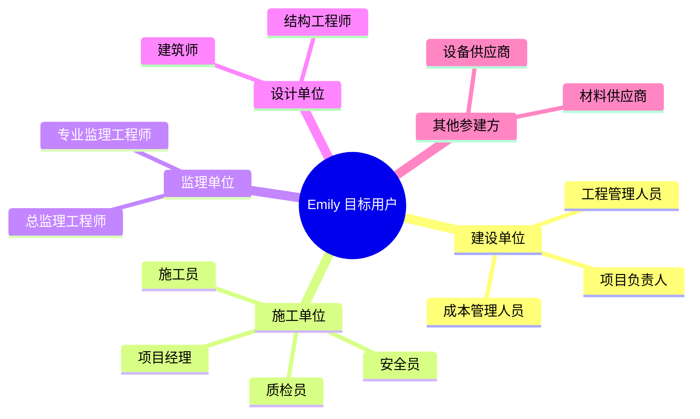
```mermaid
mindmap
  root((Emily 目标用户))
    建设单位
      项目负责人
      工程管理人员
      成本管理人员
    施工单位
      项目经理
      施工员
      质检员
      安全员
    监理单位
      总监理工程师
      专业监理工程师
    设计单位
      建筑师
      结构工程师
    其他参建方
      材料供应商
      设备供应商
```

### 1.3 核心价值主张

#### ✨ 价值一：全面记录，消除信息差

> 开发建设中的过程细节被完整记录，消除信息不对称

- **全量消息归档**：入站/出站消息完整记录，可追溯可审计
- **节点状态追踪**：90+ 标准节点的全生命周期管理
- **附件统一管理**：照片、文档、图纸统一存储和关联

#### ✨ 价值二：高效协作，打破信息壁垒

> 打破信息壁垒，大幅提升团队协作效率

- **多渠道统一接入**：QQ / 微信 / 邮箱 / 小程序，不用下载 APP
- **纯口语化交互**：不用培训，会说话就会用
- **智能任务派发**：AI 自动理解意图，匹配最合适的执行者

#### ✨ 价值三：知识沉淀，经验永不流失

> 行业经验不再随人走，永久沉淀为团队资产

- **世界书**：外部行业知识和规范的持续积累
- **规则书**：企业业务规则和最佳实践的沉淀
- **自我认知书**：系统对自身能力边界的认知
- **自进化机制**：三书协同，越用越聪明

#### ✨ 价值四：模式升级，AI 融入日常

> 信息管理告别"人盯人"的原始模式，AI工具融入地产行业日常

- **5分钟巡检**：卡滞节点自动发现，智能预警
- **健康度监控**：多维度量化评估项目健康状态
- **智能推荐**：同类问题自动推荐历史解决方案

### 1.4 功能全景图

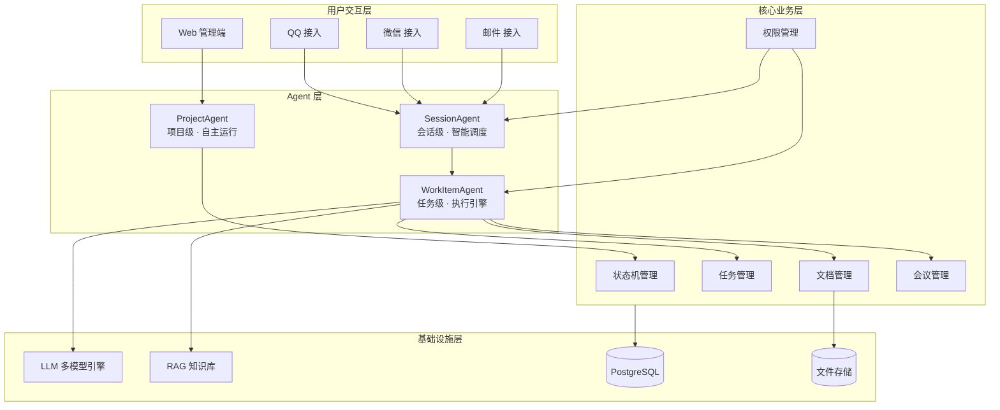
```mermaid
graph TD
    subgraph UI["用户交互层"]
        QQ[QQ 接入]
        WX[微信 接入]
        Mail[邮件 接入]
        Web[Web 管理端]
    end

    subgraph Agent["Agent 层"]
        PA[ProjectAgent<br/>项目级 · 自主运行]
        SA[SessionAgent<br/>会话级 · 智能调度]
        WA[WorkItemAgent<br/>任务级 · 执行引擎]
    end

    subgraph Core["核心业务层"]
        SM[状态机管理]
        TM[任务管理]
        DM[文档管理]
        MM[会议管理]
        PM[权限管理]
    end

    subgraph Infra["基础设施层"]
        LLM[LLM 多模型引擎]
        RAG[RAG 知识库]
        DB[(PostgreSQL)]
        FS[(文件存储)]
    end

    QQ --> SA
    WX --> SA
    Mail --> SA
    Web --> PA

    PA --> SM
    SA --> WA
    WA --> TM
    WA --> DM
    WA --> MM

    PM --> SA
    PM --> WA

    WA --> LLM
    WA --> RAG
    Core --> DB
    DM --> FS
```

---

## 2. 系统架构设计

### 2.1 设计理念：薄插件 + 独立业务内核

Emily 采用 **"薄插件 + 独立业务内核"** 的架构设计，确保系统的可扩展性和独立性：

#### 设计原则

| 原则 | 说明 |
|------|------|
| **插件无业务** | 薄插件层仅做协议转换和消息转发，不含任何业务逻辑 |
| **内核不依赖** | 业务内核不依赖具体 IM 平台，可以独立运行和演进 |
| **分层可跳** | 严格的分层架构，各层职责清晰，便于独立优化 |
| **状态驱动** | 全局状态机驱动，确保业务流转的一致性和可追溯性 |

#### 架构优势

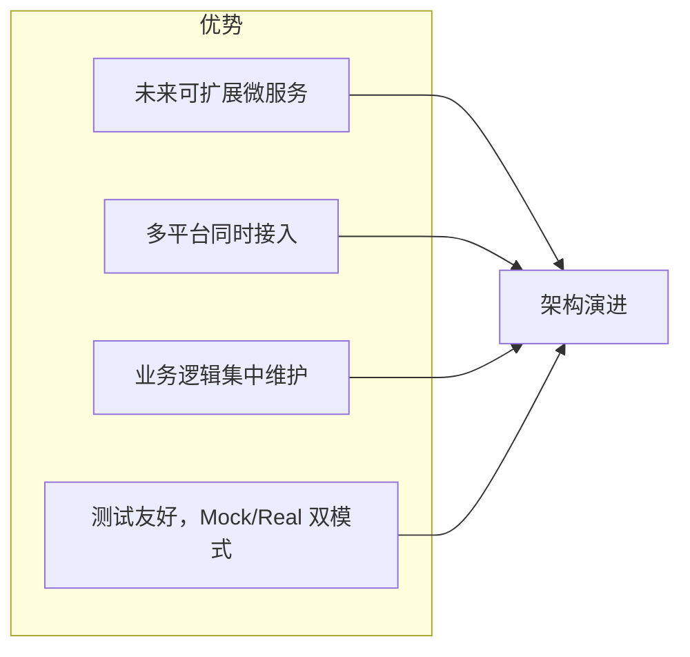
```mermaid
graph LR
    subgraph 优势
        A[未来可扩展微服务]
        B[多平台同时接入]
        C[业务逻辑集中维护]
        D[测试友好，Mock/Real 双模式]
    end

    A --> E[架构演进]
    B --> E
    C --> E
    D --> E
```

### 2.2 技术架构图

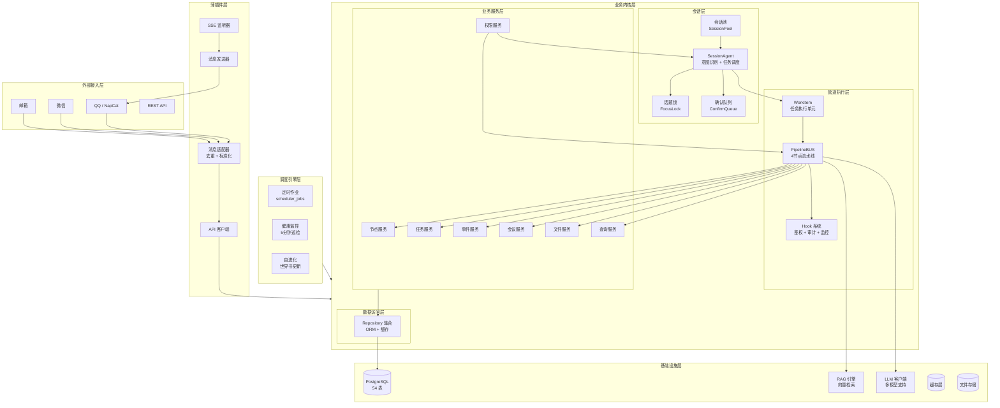
```mermaid
graph TB
    subgraph External["外部接入层"]
        IM1[QQ / NapCat]
        IM2[微信]
        IM3[邮箱]
        API[REST API]
    end

    subgraph Plugin["薄插件层"]
        Adapter[消息适配器<br/>去重 + 标准化]
        Client[API 客户端]
        SSE[SSE 监听器]
        Sender[消息发送器]
    end

    subgraph Core["业务内核层"]
        subgraph Session["会话层"]
            SA[SessionAgent<br/>意图识别 + 任务调度]
            Pool[会话池<br/>SessionPool]
            Lock[话题锁<br/>FocusLock]
            Queue[确认队列<br/>ConfirmQueue]
        end

        subgraph Pipeline["管道执行层"]
            BUS[PipelineBUS<br/>4节点流水线]
            Hook[Hook 系统<br/>鉴权 + 审计 + 监控]
            WI[WorkItem<br/>任务执行单元]
        end

        subgraph Service["业务服务层"]
            NodeSvc[节点服务]
            TaskSvc[任务服务]
            EventSvc[事件服务]
            MeetingSvc[会议服务]
            FileSvc[文件服务]
            QuerySvc[查询服务]
            PermSvc[权限服务]
        end

        subgraph Repo["数据访问层"]
            Repos[Repository 集合<br/>ORM + 缓存]
        end
    end

    subgraph Infra["基础设施层"]
        DB[(PostgreSQL<br/>54 表)]
        RAG[RAG 引擎<br/>向量检索]
        LLM[LLM 客户端<br/>多模型支持]
        Cache[(缓存层)]
        FS[(文件存储)]
    end

    subgraph Scheduler["调度引擎层"]
        Jobs[定时作业<br/>scheduler_jobs]
        Monitor[健康监控<br/>5分钟巡检]
        Evolution[自进化<br/>世界书更新]
    end

    %% 数据流
    IM1 --> Adapter
    IM2 --> Adapter
    IM3 --> Adapter

    Adapter --> Client --> Core
    SSE --> Sender --> IM1

    Pool --> SA
    SA --> Lock
    SA --> Queue
    SA --> WI

    WI --> BUS
    BUS --> Hook

    BUS --> NodeSvc
    BUS --> TaskSvc
    BUS --> EventSvc
    BUS --> MeetingSvc
    BUS --> FileSvc
    BUS --> QuerySvc

    PermSvc --> SA
    PermSvc --> BUS

    Service --> Repos --> DB
    BUS --> LLM
    BUS --> RAG

    Scheduler --> Core
```

### 2.3 分层架构说明

#### 第一层：薄插件层（Plugin Layer）

**职责**：协议转换、消息去重、标准化、转发

| 组件 | 职责 | 关键文件 |
|------|------|----------|
| 消息适配器 | IM 平台消息 → 标准消息格式 | `adapters/inbound/*.py` |
| API 客户端 | 标准消息 → POST `/api/v1/message/send` | `adapters/api_client.py` |
| SSE 监听器 | 监听核心层出站事件 | `adapters/sse_listener.py` |
| 消息发送器 | 标准回复 → IM 平台消息 | `adapters/outbound/sender.py` |

**设计约束**：
- 插件层不 import 任何 `emily_core.*` 包
- 仅依赖标准数据结构（DTO）
- 无状态，可水平扩展

#### 第二层：协议层（Protocol Layer）

**职责**：API 路由、SSE 事件流、请求验签

| 端点 | 方法 | 说明 |
|------|------|------|
| `/api/v1/message/send` | POST | 入站消息入口 |
| `/api/v1/message/events` | GET | SSE 出站事件流 |
| `/api/v1/health` | GET | 健康检查 |
| `/api/v1/session/terminate` | POST | 会话终止 |

#### 第三层：会话层（Session Layer）

**职责**：用户意图识别、多任务调度、上下文管理

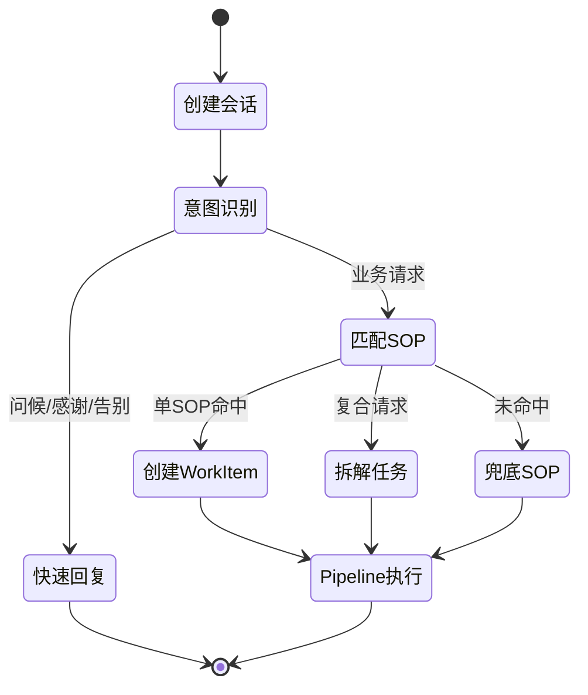
```mermaid
stateDiagram-v2
    [*] --> 创建会话
    创建会话 --> 意图识别
    意图识别 --> 快速回复 : 问候/感谢/告别
    意图识别 --> 匹配SOP : 业务请求
    匹配SOP --> 创建WorkItem : 单SOP命中
    匹配SOP --> 拆解任务 : 复合请求
    匹配SOP --> 兜底SOP : 未命中
    创建WorkItem --> Pipeline执行
    拆解任务 --> Pipeline执行
    兜底SOP --> Pipeline执行
    快速回复 --> [*]
    Pipeline执行 --> [*]
```

**核心组件**：
- **SessionPool**：`conversation_id` → `SessionAgent` 映射，TTL 自动清理
- **SessionAgent**：每会话大脑，负责意图识别和任务调度
- **FocusLock**：话题切换检测，防止上下文污染
- **ConfirmQueue**：待用户确认的任务排队，支持恢复

#### 第四层：管道执行层（Pipeline Layer）

**职责**：4 节点流水线执行、Hook 挂载、状态机驱动

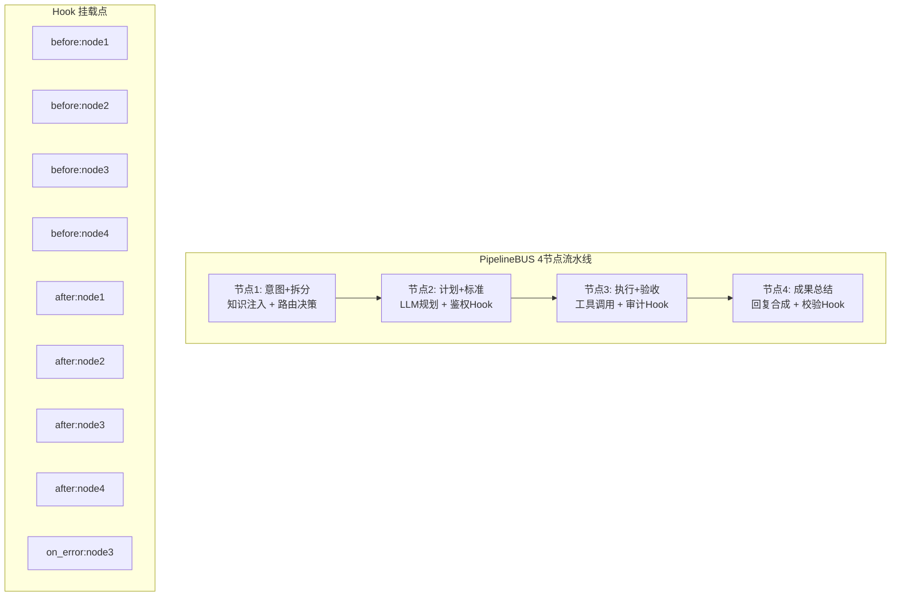
```mermaid
graph TD
    subgraph Pipeline["PipelineBUS 4节点流水线"]
        N1[节点1: 意图+拆分<br/>知识注入 + 路由决策]
        N2[节点2: 计划+标准<br/>LLM规划 + 鉴权Hook]
        N3[节点3: 执行+验收<br/>工具调用 + 审计Hook]
        N4[节点4: 成果总结<br/>回复合成 + 校验Hook]
    end

    N1 --> N2 --> N3 --> N4

    subgraph Hooks["Hook 挂载点"]
        B1[before:node1]
        B2[before:node2]
        B3[before:node3]
        B4[before:node4]
        A1[after:node1]
        A2[after:node2]
        A3[after:node3]
        A4[after:node4]
        E3[on_error:node3]
    end
```

**Pipeline 节点说明**：

| 节点 | 名称 | 必选 | 核心职责 |
|------|------|------|---------|
| **node1** | 意图+拆分 | ✅ | KnowledgeInjector 增量注入 SOP/工具/Schema，构建并验证 RouteDecision |
| **node2** | 计划+标准 | ✅ | LLM Planner 生成 ExecutionPlan（含风险等级/步骤/验收标准） |
| **node3** | 执行+验收 | ✅ | 遍历 PlanStep，调用 BusinessFlowTool handler 或 RAG 检索 |
| **node4** | 成果总结 | ❌ | 合成 result_text → verified_reply，Guardian 内容审核 |

#### 第五层：业务服务层（Service Layer）

**职责**：领域逻辑实现、事务管理、跨领域协调

| 服务 | 职责 | 对应 SOP |
|------|------|----------|
| NodeService | 全景节点管理、状态流转、里程碑 | SOP-011-SYS |
| TaskService | 任务创建、分配、追踪、验收 | SOP-003-REC |
| EventService | 事件记录、分类、关联、简报 | SOP-002-REC |
| MeetingService | 会议纪要、待办提取、追踪 | SOP-001-REC |
| FileService | 文件归档、版本链、权限控制 | SOP-004-FILE |
| QueryService | 跨表查询、统计、报表生成 | SOP-005-QRY |
| PermissionService | 权限校验、范围控制、授权管理 | 系统内置 |

#### 第六层：数据访问层（Repository Layer）

**职责**：ORM 操作、缓存、数据一致性保证

**核心 Repository**：
- `UserRepository` - 用户与 IM 绑定
- `MessageRepository` - 消息全量归档
- `NodeRepository` - 全景节点树
- `TaskRepository` - 任务管理
- `EventRepository` - 事件记录
- `MeetingRepository` - 会议管理
- `FileRepository` - 文件与版本链
- `PermissionGrantRepository` - 权限授权
- `AgentReasoningRepository` - Agent 推理日志
- `WorldBookRepository` - 世界书知识库

### 2.4 核心数据流

#### 端到端消息处理流程

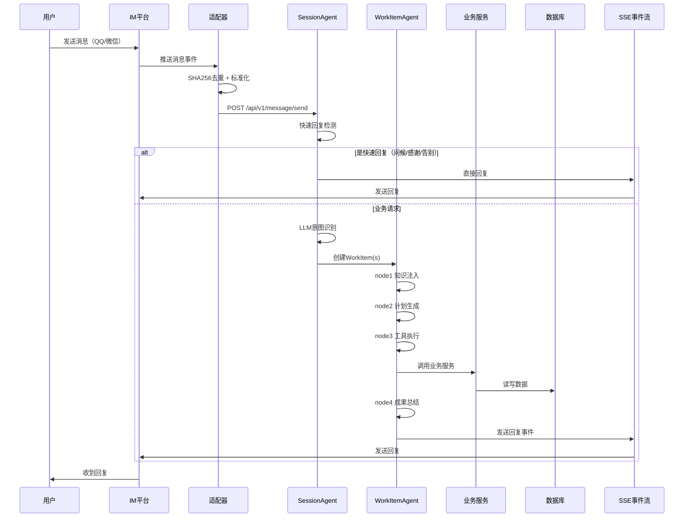
```mermaid
sequenceDiagram
    participant U as 用户
    participant IM as IM平台
    participant A as 适配器
    participant SA as SessionAgent
    participant WA as WorkItemAgent
    participant SVC as 业务服务
    participant DB as 数据库
    participant SSE as SSE事件流

    U->>IM: 发送消息（QQ/微信）
    IM->>A: 推送消息事件
    A->>A: SHA256去重 + 标准化
    A->>SA: POST /api/v1/message/send

    SA->>SA: 快速回复检测
    alt 是快速回复（问候/感谢/告别）
        SA->>SSE: 直接回复
        SSE->>IM: 发送回复
    else 业务请求
        SA->>SA: LLM意图识别
        SA->>WA: 创建WorkItem(s)
        WA->>WA: node1 知识注入
        WA->>WA: node2 计划生成
        WA->>WA: node3 工具执行
        WA->>SVC: 调用业务服务
        SVC->>DB: 读写数据
        WA->>WA: node4 成果总结
        WA->>SSE: 发送回复事件
        SSE->>IM: 发送回复
    end

    IM->>U: 收到回复
```

#### WorkItem 状态机流转

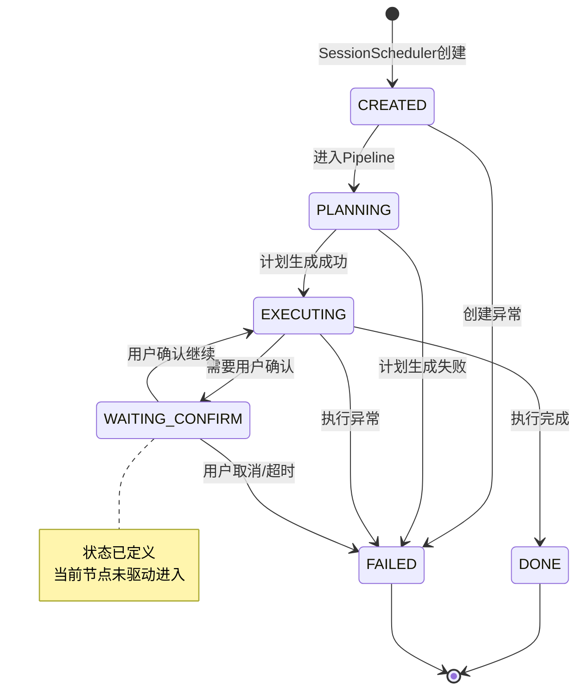
```mermaid
stateDiagram-v2
    [*] --> CREATED: SessionScheduler创建

    CREATED --> PLANNING: 进入Pipeline
    CREATED --> FAILED: 创建异常

    PLANNING --> EXECUTING: 计划生成成功
    PLANNING --> FAILED: 计划生成失败

    EXECUTING --> WAITING_CONFIRM: 需要用户确认
    EXECUTING --> DONE: 执行完成
    EXECUTING --> FAILED: 执行异常

    WAITING_CONFIRM --> EXECUTING: 用户确认继续
    WAITING_CONFIRM --> FAILED: 用户取消/超时

    DONE --> [*]
    FAILED --> [*]

    note right of WAITING_CONFIRM
        状态已定义
        当前节点未驱动进入
    end note
```

**状态说明**：

| 状态 | 含义 | 触发条件 |
|------|------|---------|
| `CREATED` | 任务已创建 | SessionScheduler 从用户消息解析创建 |
| `PLANNING` | 正在生成执行计划 | WorkItemAgent.node2 调用 LLM Planner |
| `EXECUTING` | 正在执行计划步骤 | WorkItemAgent.node3 遍历 PlanStep 调用工具 |
| `WAITING_CONFIRM` | 等待用户确认 | 执行到需要用户决策的节点 |
| `DONE` | 执行成功完成 | 所有步骤执行通过，成果合成完成 |
| `FAILED` | 执行异常或终止 | 任何节点异常 / 用户取消 / 超时 |

---

## 3. 核心业务模块详解

### 3.1 全生命周期管理（信息全生明流程）

#### 3.1.1 AstrBot 消息处理机制

**消息标准化流程**：

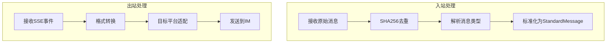
```mermaid
graph TD
    subgraph 入站处理
        R[接收原始消息]
        D[SHA256去重]
        P[解析消息类型]
        S[标准化为StandardMessage]
    end

    subgraph 出站处理
        E[接收SSE事件]
        F[格式转换]
        T[目标平台适配]
        O[发送到IM]
    end

    R --> D --> P --> S
    E --> F --> T --> O
```

**去重机制**：
- 对每条消息计算 `SHA256(platform + conversation_id + message_id + content)`
-  Redis 缓存最近 10 分钟的消息哈希
- 重复消息直接丢弃，避免重复处理

**标准化字段**：

| 字段 | 类型 | 说明 |
|------|------|------|
| `event_id` | String | 全局唯一事件ID（幂等键） |
| `conversation_id` | String | 会话ID（群聊/私聊） |
| `user_id` | String | IM平台用户ID |
| `user_name` | String | 用户昵称 |
| `message_type` | Enum | text/image/file/audio |
| `content` | String | 消息文本内容 |
| `attachments` | List | 附件列表 |
| `timestamp` | DateTime | 消息时间戳 |

#### 3.1.2 Session 会话管理

**会话生命周期**：

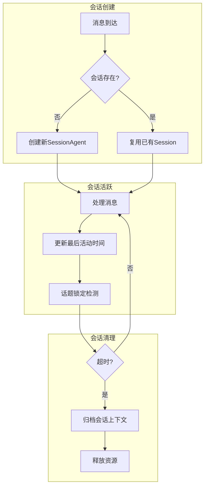
```mermaid
graph TD
    subgraph 会话创建
        A[消息到达]
        B{会话存在?}
        C[创建新SessionAgent]
        D[复用已有Session]
    end

    subgraph 会话活跃
        E[处理消息]
        F[更新最后活动时间]
        G[话题锁定检测]
    end

    subgraph 会话清理
        H[超时检测<br/>30分钟无活动]
        I[归档会话上下文]
        J[释放资源]
    end

    A --> B
    B -->|否| C --> E
    B -->|是| D --> E

    E --> F --> G
    G --> H{超时?}
    H -->|是| I --> J
    H -->|否| E
```

**SessionContext 上下文数据结构**：

```python
{
    "session_id": "uuid",
    "conversation_id": "group-xxx",
    "user_ids": ["user1", "user2"],  # 涉及的用户
    "active_tasks": ["wi-1", "wi-2"],  # 进行中的任务
    "pending_confirms": [],  # 待确认队列
    "focus_topic": "当前话题关键词",  # 话题锁定
    "last_activity_at": "2026-07-14T10:30:00+08:00",
    "message_history": [  # 最近N条消息
        {"role": "user", "content": "...", "timestamp": "..."},
        {"role": "assistant", "content": "...", "timestamp": "..."}
    ]
}
```

#### 3.1.3 WorkItem 工作项流转

**从用户消息到 WorkItem 的拆解过程**：

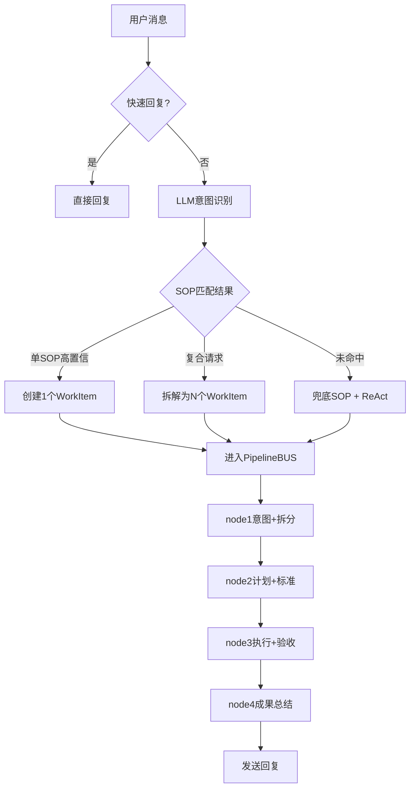
```mermaid
flowchart TD
    A[用户消息] --> B{快速回复?}
    B -->|是| C[直接回复]
    B -->|否| D[LLM意图识别]

    D --> E{SOP匹配结果}
    E -->|单SOP高置信| F[创建1个WorkItem]
    E -->|复合请求| G[拆解为N个WorkItem]
    E -->|未命中| H[兜底SOP + ReAct]

    F --> I[进入PipelineBUS]
    G --> I
    H --> I

    I --> J[node1意图+拆分]
    J --> K[node2计划+标准]
    K --> L[node3执行+验收]
    L --> M[node4成果总结]
    M --> N[发送回复]
```

**WorkItem 数据结构**：

```python
{
    "workitem_id": "wi-uuid",
    "session_id": "session-uuid",
    "sop_id": "SOP-001-REC",
    "sop_version": "v1.0",
    "status": "EXECUTING",
    "priority": "normal",  # low/normal/high/urgent
    "user_intent": "用户原始意图",
    "route_decision": {
        "tools_needed": ["record_meeting"],
        "permissions_required": ["meeting:create"],
        "knowledge_scope": ["project-123"]
    },
    "execution_plan": {
        "risk_level": "L2",
        "steps": [
            {"tool": "record_meeting", "params": {...}, "description": "..."},
            {"tool": "extract_action_items", "params": {...}, "description": "..."}
        ],
        "acceptance_criteria": "..."
    },
    "current_step": 1,
    "tool_results": [],
    "created_at": "...",
    "updated_at": "..."
}
```

---

### 3.2 全景节点管理系统

#### 3.2.1 树状结构设计

**节点层级体系**：

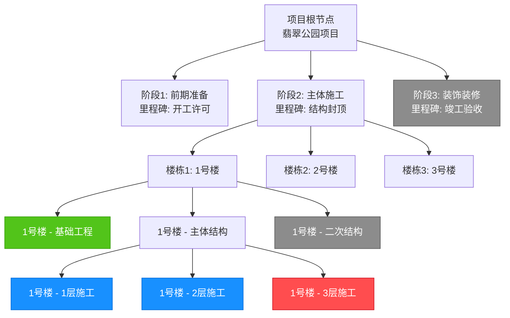
```mermaid
graph TB
    Root[项目根节点<br/>翡翠公园项目]

    Root --> L1_1[阶段1: 前期准备<br/>里程碑: 开工许可]
    Root --> L1_2[阶段2: 主体施工<br/>里程碑: 结构封顶]
    Root --> L1_3[阶段3: 装饰装修<br/>里程碑: 竣工验收]

    L1_2 --> L2_1[楼栋1: 1号楼]
    L1_2 --> L2_2[楼栋2: 2号楼]
    L1_2 --> L2_3[楼栋3: 3号楼]

    L2_1 --> L3_1[1号楼 - 基础工程]
    L2_1 --> L3_2[1号楼 - 主体结构]
    L2_1 --> L3_3[1号楼 - 二次结构]

    L3_2 --> L4_1[1号楼 - 1层施工]
    L3_2 --> L4_2[1号楼 - 2层施工]
    L3_2 --> L4_3[1号楼 - 3层施工]

    %% 状态标记
    classDef completed fill:#52c41a,stroke:#389e0d,color:white
    classDef active fill:#1890ff,stroke:#096dd9,color:white
    classDef blocked fill:#ff4d4f,stroke:#cf1322,color:white
    classDef pending fill:#8c8c8c,stroke:#595959,color:white

    class L3_1 completed
    class L4_1,L4_2 active
    class L4_3 blocked
    class L3_3,L1_3 pending
```

**节点属性设计**：

| 属性 | 类型 | 说明 |
|------|------|------|
| `node_id` | String | 全局唯一节点ID |
| `node_no` | String | 业务编号（如 NODE-20260714-0001） |
| `name` | String | 节点名称 |
| `description` | String | 节点描述 |
| `level` | Integer | 层级深度（1-5级） |
| `parent_id` | String | 父节点ID |
| `project_id` | String | 所属项目 |
| `status` | Enum | NOT_STARTED / IN_PROGRESS / BLOCKED / DELAYED / COMPLETED |
| `planned_start` | DateTime | 计划开始时间 |
| `planned_end` | DateTime | 计划结束时间 |
| `actual_start` | DateTime | 实际开始时间 |
| `actual_end` | DateTime | 实际结束时间 |
| `responsible_id` | String | 负责人 |
| `milestone_id` | String | 关联里程碑（如为里程碑节点） |
| `dependencies` | List | 前置依赖节点ID列表 |
| `tags` | List | 标签（专业/工序等） |
| `visible_to` | List | 可见范围（权限组） |

#### 3.2.2 里程碑体系

**里程碑类型**：

| 类型 | 说明 | 典型示例 |
|------|------|---------|
| **强制里程碑** | 必须完成才能进入下一阶段 | 取得施工许可证、主体结构验收、竣工验收 |
| **关键节点** | 重要时间节点，影响整体进度 | 土方开挖完成、地下结构封顶、主体封顶 |
| **交付里程碑** | 对外交付节点 | 预售节点、交付节点 |

**里程碑看守机制**：

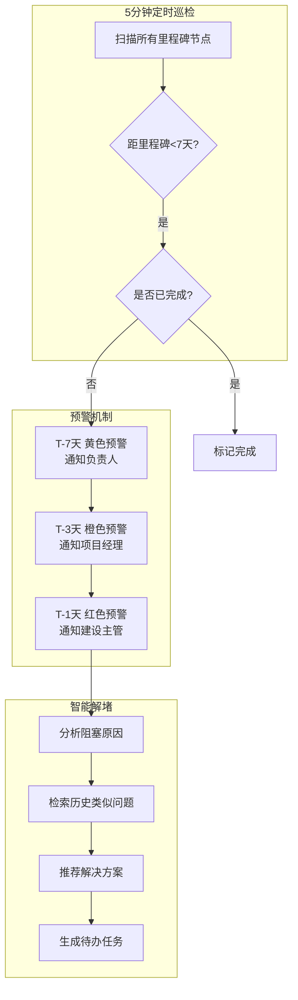
```mermaid
graph TD
    subgraph 巡检[5分钟定时巡检]
        A[扫描所有里程碑节点]
        B{距里程碑<7天?}
        C{是否已完成?}
    end

    subgraph 预警[预警机制]
        D[T-7天 黄色预警<br/>通知负责人]
        E[T-3天 橙色预警<br/>通知项目经理]
        F[T-1天 红色预警<br/>通知建设主管]
    end

    subgraph 解堵[智能解堵]
        G[分析阻塞原因]
        H[检索历史类似问题]
        I[推荐解决方案]
        J[生成待办任务]
    end

    A --> B
    B -->|是| C
    C -->|否| D --> E --> F --> G
    G --> H --> I --> J
    C -->|是| K[标记完成]
```

#### 3.2.3 文件可见范围控制

**基于节点的权限继承**：

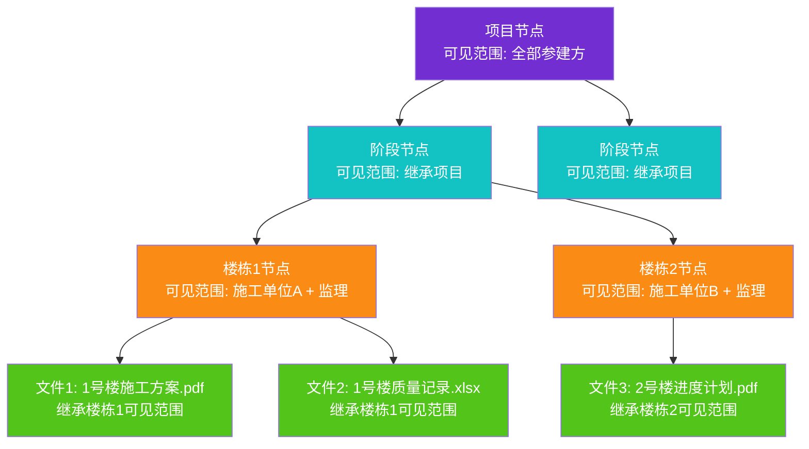
```mermaid
graph TB
    P[项目节点<br/>可见范围: 全部参建方]
    P --> S1[阶段节点<br/>可见范围: 继承项目]
    P --> S2[阶段节点<br/>可见范围: 继承项目]

    S1 --> B1[楼栋1节点<br/>可见范围: 施工单位A + 监理]
    S1 --> B2[楼栋2节点<br/>可见范围: 施工单位B + 监理]

    B1 --> F1[文件1: 1号楼施工方案.pdf<br/>继承楼栋1可见范围]
    B1 --> F2[文件2: 1号楼质量记录.xlsx<br/>继承楼栋1可见范围]
    B2 --> F3[文件3: 2号楼进度计划.pdf<br/>继承楼栋2可见范围]

    classDef project fill:#722ed1,color:white
    classDef stage fill:#13c2c2,color:white
    classDef building fill:#fa8c16,color:white
    classDef file fill:#52c41a,color:white

    class P project
    class S1,S2 stage
    class B1,B2 building
    class F1,F2,F3 file
```

**可见范围规则**：

| 规则 | 说明 |
|------|------|
| **继承规则** | 子节点默认继承父节点的可见范围 |
| **收窄规则** | 子节点可见范围只能是父节点的子集，不能扩大 |
| **显式授权** | 可通过权限申请流程临时扩大可见范围 |
| **文件关联** | 上传到节点的文件自动继承该节点的可见范围 |

#### 3.2.4 任务依据与完工上报机制

**从节点到任务的分解**：

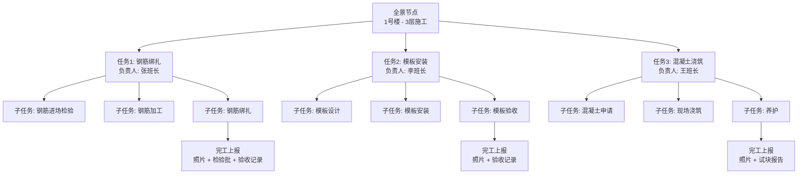
```mermaid
graph TD
    N[全景节点<br/>1号楼 - 3层施工]

    N --> T1[任务1: 钢筋绑扎<br/>负责人: 张班长]
    N --> T2[任务2: 模板安装<br/>负责人: 李班长]
    N --> T3[任务3: 混凝土浇筑<br/>负责人: 王班长]

    T1 --> S1[子任务: 钢筋进场检验]
    T1 --> S2[子任务: 钢筋加工]
    T1 --> S3[子任务: 钢筋绑扎]

    T2 --> S4[子任务: 模板设计]
    T2 --> S5[子任务: 模板安装]
    T2 --> S6[子任务: 模板验收]

    T3 --> S7[子任务: 混凝土申请]
    T3 --> S8[子任务: 现场浇筑]
    T3 --> S9[子任务: 养护]

    S3 --> R1[完工上报<br/>照片 + 检验批 + 验收记录]
    S6 --> R2[完工上报<br/>照片 + 验收记录]
    S9 --> R3[完工上报<br/>照片 + 试块报告]
```

**完工上报流程**：

1. **负责人发起**：任务负责人确认完成，提交完工上报
2. **附件要求**：必须上传现场照片、检验批、验收记录等佐证材料
3. **AI 预检**：系统自动检查材料完整性，提示补充
4. **监理审核**：监理工程师现场核验，签署意见
5. **节点更新**：审核通过后，自动更新节点进度和状态

#### 3.2.5 节点生命周期

**五态节点状态机**：

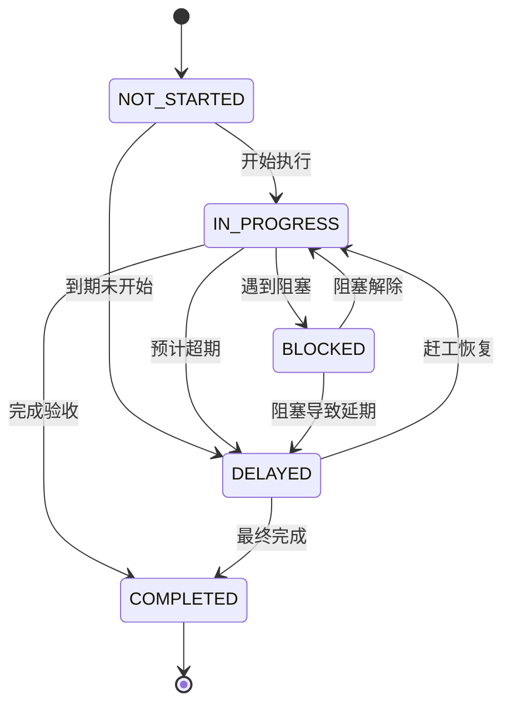
```mermaid
stateDiagram-v2
    [*] --> NOT_STARTED

    NOT_STARTED --> IN_PROGRESS: 开始执行
    NOT_STARTED --> DELAYED: 到期未开始

    IN_PROGRESS --> BLOCKED: 遇到阻塞
    IN_PROGRESS --> DELAYED: 预计超期
    IN_PROGRESS --> COMPLETED: 完成验收

    BLOCKED --> IN_PROGRESS: 阻塞解除
    BLOCKED --> DELAYED: 阻塞导致延期

    DELAYED --> IN_PROGRESS: 赶工恢复
    DELAYED --> COMPLETED: 最终完成

    COMPLETED --> [*]
```

| 状态 | 颜色 | 说明 |
|------|------|------|
| `NOT_STARTED` | ⚪ 灰色 | 尚未开始，未到计划开始时间 |
| `IN_PROGRESS` | 🔵 蓝色 | 正常进行中 |
| `BLOCKED` | 🔴 红色 | 遇到阻塞，需要协调解决 |
| `DELAYED` | 🟠 橙色 | 进度滞后，预计无法按时完成 |
| `COMPLETED` | 🟢 绿色 | 已完成，通过验收 |

---

### 3.3 SOP 流程引擎

#### 3.3.1 SOP 设计规范

**SOP 七段式结构**：

```markdown
# SOP-001-REC: 会议纪要记录

## 1. SOP 标识
- SOP_ID: SOP-001-REC
- 版本: v1.0
- 适用场景: 项目周例会、专题会议、监理例会等会议记录
- 触发词: ["开会", "会议纪要", "记录会议", "周例会"]

## 2. 意图识别
- 核心意图: 记录会议内容，提取待办事项
- 前置条件: 用户明确提到会议相关词汇
- 置信度阈值: medium

## 3. 工具与权限
- 必需工具: record_meeting, extract_action_items
- 所需权限: meeting:create, task:create
- 知识范围: 当前项目

## 4. 执行步骤
1. 询问会议基本信息（类型、时间、地点、参会人）
2. 记录会议主要内容和决议
3. 提取待办事项（负责人、截止时间）
4. 生成会议纪要初稿
5. 请用户确认后正式保存

## 5. 输出规范
- 会议编号: MTG-YYYYMMDD-NNNN
- 纪要格式: Markdown
- 待办格式: - [ ] 待办内容 @负责人 截止:YYYY-MM-DD

## 6. 异常处理
- 信息不全: 主动询问补充
- 权限不足: 提示联系管理员
- 创建失败: 记录日志，提示重试

## 7. 后续动作
- 将待办事项自动转化为任务
- 通知相关参会人
- 关联到对应项目节点
```

#### 3.3.2 SOP 注册与发现机制

**SOP 注册表数据结构**：

```python
{
    "sop_id": "SOP-001-REC",
    "version": "v1.0",
    "display_name": "会议纪要记录",
    "category": "RECORD",
    "trigger_keywords": ["开会", "会议纪要", "记录会议"],
    "intent_examples": [
        "帮我记录一下今天的周例会",
        "刚才的会议内容整理一下",
        "开个专题会议，记录一下"
    ],
    "required_tools": ["record_meeting", "extract_action_items"],
    "required_permissions": ["meeting:create", "task:create"],
    "min_permission_level": 1,
    "is_active": true,
    "is_deprecated": false,
    "file_path": "emily-data/sops/SOP-001-REC-meeting.md",
    "loaded_at": "2026-07-14T09:00:00+08:00"
}
```

**热重载机制**：
1. 系统启动时扫描 `emily-data/sops/` 目录
2. 解析所有 `.md` 文件，提取 §1 标识段
3. 构建内存中的 SOP 注册表
4. 文件变更时自动热重载（inotify）
5. 支持运行时新增 SOP，无需重启

#### 3.3.3 执行引擎原理

**SOP 匹配与执行流程**：

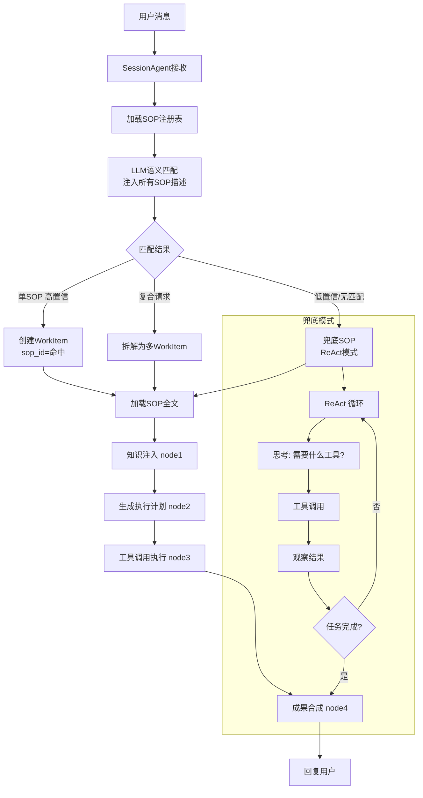
```mermaid
flowchart TD
    A[用户消息] --> B[SessionAgent接收]
    B --> C[加载SOP注册表]
    C --> D[LLM语义匹配<br/>注入所有SOP描述]

    D --> E{匹配结果}
    E -->|单SOP 高置信| F[创建WorkItem<br/>sop_id=命中]
    E -->|复合请求| G[拆解为多WorkItem]
    E -->|低置信/无匹配| H[兜底SOP<br/>ReAct模式]

    F --> I[加载SOP全文]
    G --> I
    H --> I

    I --> J[知识注入 node1]
    J --> K[生成执行计划 node2]
    K --> L[工具调用执行 node3]
    L --> M[成果合成 node4]
    M --> N[回复用户]

    subgraph 兜底模式
        H --> O[ReAct 循环]
        O --> P[思考: 需要什么工具?]
        P --> Q[工具调用]
        Q --> R[观察结果]
        R --> S{任务完成?}
        S -->|否| O
        S -->|是| M
    end
```

#### 3.3.4 SOP 新增流程

**零代码新增 SOP 三步法**：

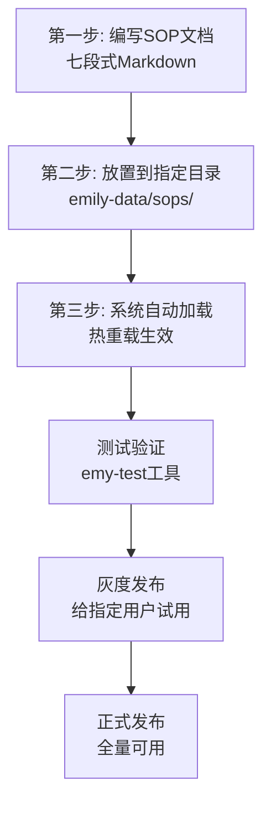
```mermaid
graph TD
    A[第一步: 编写SOP文档<br/>七段式Markdown]
    B[第二步: 放置到指定目录<br/>emily-data/sops/]
    C[第三步: 系统自动加载<br/>热重载生效]

    A --> B --> C

    D[测试验证<br/>emy-test工具]
    E[灰度发布<br/>给指定用户试用]
    F[正式发布<br/>全量可用]

    C --> D --> E --> F
```

**新增 SOP 示例**：

```markdown
# SOP-099-REC: 安全巡检记录

## 1. SOP 标识
- SOP_ID: SOP-099-REC
- 版本: v1.0
- 适用场景: 日常安全巡检记录
- 触发词: ["安全巡检", "安全检查", "隐患记录"]

## 2. 意图识别（略）
## 3. 工具与权限（略）
## 4. 执行步骤（略）
## 5. 输出规范（略）
## 6. 异常处理（略）
## 7. 后续动作（略）
```

放置到目录后，系统自动检测到新文件，解析注册，无需重启服务。

#### 3.3.5 异常处理机制

**SOP 执行异常分类**：

| 异常类型 | 触发场景 | 处理策略 |
|---------|---------|---------|
| **信息不足** | 用户提供的信息不完整 | 主动询问，引导补充 |
| **权限不足** | 用户权限低于 SOP 要求 | 提示原因，引导申请权限 |
| **工具失败** | 工具调用异常 | 重试 2 次 → 失败提示 → 记录日志 |
| **LLM 超时** | 大模型响应超时 | 降级策略（Mock/简化处理）→ 提示用户 |
| **依赖缺失** | 前置条件不满足 | 说明原因，引导先完成前置 |
| **用户中断** | 用户明确取消 | 清理上下文，确认取消 |

**异常处理流程**：

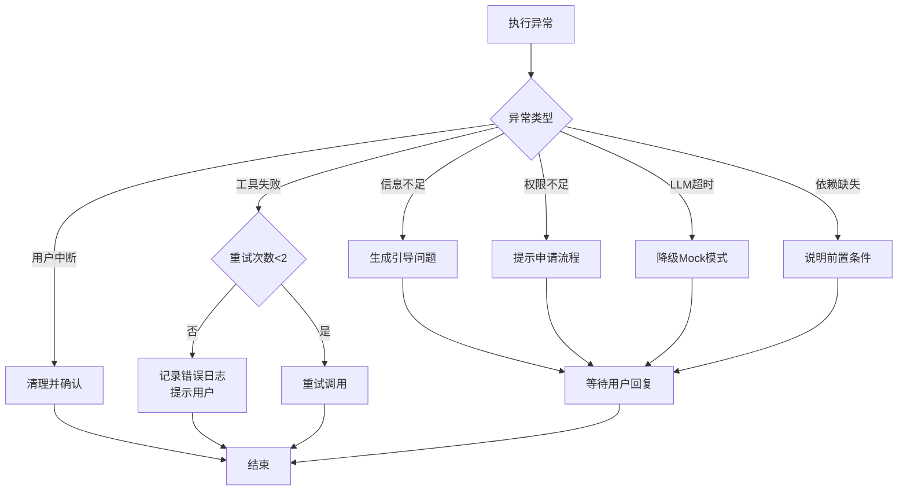
```mermaid
flowchart TD
    A[执行异常] --> B{异常类型}

    B -->|信息不足| C[生成引导问题]
    B -->|权限不足| D[提示申请流程]
    B -->|工具失败| E{重试次数<2}
    B -->|LLM超时| F[降级Mock模式]
    B -->|依赖缺失| G[说明前置条件]
    B -->|用户中断| H[清理并确认]

    E -->|是| I[重试调用]
    E -->|否| J[记录错误日志<br/>提示用户]

    C --> K[等待用户回复]
    D --> K
    F --> K
    G --> K
    H --> L[结束]
    J --> L
    I --> L
    K --> L
```

---

### 3.4 自进化系统

#### 3.4.1 三书体系架构

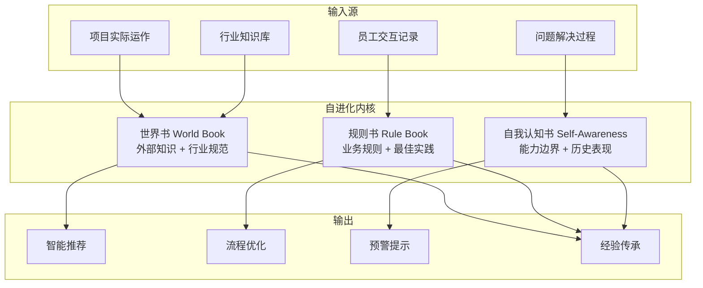
```mermaid
graph TB
    subgraph 自进化内核
        WB[世界书 World Book<br/>外部知识 + 行业规范]
        RB[规则书 Rule Book<br/>业务规则 + 最佳实践]
        SA[自我认知书 Self-Awareness<br/>能力边界 + 历史表现]
    end

    subgraph 输入源
        A[项目实际运作]
        B[员工交互记录]
        C[问题解决过程]
        D[行业知识库]
    end

    subgraph 输出
        E[智能推荐]
        F[流程优化]
        G[预警提示]
        H[经验传承]
    end

    A --> WB
    B --> RB
    C --> SA
    D --> WB

    WB --> E
    RB --> F
    SA --> G
    WB & RB & SA --> H
```

#### 3.4.2 世界书（World Book）

**世界书内容结构**：

| 分类 | 内容 | 来源 | 更新频率 |
|------|------|------|---------|
| **行业规范** | 国家规范、行业标准、地方规定 | 人工导入 + 爬虫 | 月度 |
| **项目资料** | 地勘报告、设计图纸、施工方案 | 文件上传解析 | 实时 |
| **历史经验** | 历史项目的问题、解决方案、教训 | 自动提炼 | 每日 |
| **组织知识** | 公司管理制度、流程规范 | 人工录入 | 按需 |
| **外部信息** | 天气、材料价格、政策动态 | API 对接 | 实时 |

**世界书构建流程**：

```mermaid
graph TD
    A[原始数据收集] --> B[文本提取<br/>OCR/解析]
    B --> C[内容清洗<br/>去重/格式化]
    C --> D[语义分块<br/>Chunking]
    D --> E[向量化<br/>Embedding]
    E --> F[向量数据库存储<br/>pgvector]
    F --> G[索引构建<br/>HNSW]
    G --> H[检索服务化]

    subgraph 定时更新
        I[每日增量扫描]
        J[新增文件解析]
        K[向量索引更新]
    end

    I --> J --> K --> G
```

**世界书检索策略**：
- **语义检索**：基于向量相似度的语义匹配（默认）
- **关键词检索**：TF-IDF 关键词匹配（兜底）
- **混合检索**：语义 + 关键词加权融合
- **范围过滤**：按项目、节点、专业缩小检索范围

#### 3.4.3 规则书（Rule Book）

**规则书内容结构**：

```python
{
    "business_rules": [
        {
            "rule_id": "RULE-001",
            "name": "工程款支付审批流程",
            "condition": "申请金额 > 100万 AND 进度 < 80%",
            "action": "需要总经理审批",
            "priority": "high",
            "source": "财务管理制度V3.0",
            "version": "v1.0"
        }
    ],
    "best_practices": [
        {
            "practice_id": "BP-001",
            "name": "雨季施工注意事项",
            "scenario": "天气预报显示未来3天有大雨",
            "recommendation": [
                "检查基坑排水系统",
                "暂停室外高空作业",
                "覆盖已浇筑混凝土"
            ],
            "source": "项目经验总结"
        }
    ],
    "approval_matrix": {
        "payment": {
            "0-10万": "项目经理审批",
            "10-50万": "工程部长审批",
            "50万以上": "总经理审批"
        }
    }
}
```

**规则引擎工作原理**：

```mermaid
flowchart TD
    A[触发场景] --> B[加载相关规则]
    B --> C[条件匹配<br/>Rete算法]
    C --> D{匹配成功?}

    D -->|是| E[执行规则动作]
    D -->|否| F[无规则触发]

    E --> G[规则冲突解决<br/>优先级排序]
    G --> H[执行最高优先级规则]
    H --> I[记录规则命中日志]

    J[定期复盘<br/>规则有效性分析] --> K[规则优化建议]
    K --> L[人工审核确认]
    L --> M[规则书更新]
```

#### 3.4.4 自我认知书（Self-Awareness Book）

**自我认知维度**：

| 维度 | 内容 | 用途 |
|------|------|------|
| **能力边界** | 能做什么、不能做什么 | 避免超出能力范围的承诺 |
| **历史表现** | 各 SOP 成功率、平均耗时、用户满意度 | 识别薄弱环节 |
| **错误模式** | 常见错误类型、发生频率、改进措施 | 预防性优化 |
| **知识盲区** | 哪些领域知识不足、检索失败率高 | 提示补充知识 |
| **用户偏好** | 不同用户的交互习惯、偏好格式 | 个性化服务 |

**认知漂移检测**：

```mermaid
graph TD
    A[基准线建立<br/>初始能力评估] --> B[实时监控<br/>各项指标]

    B --> C[偏差检测<br/>统计显著性检验]
    C --> D{漂移程度}

    D -->|轻微| E[记录观察]
    D -->|中等| F[触发预警<br/>通知管理员]
    D -->|严重| G[启动降级策略<br/>Mock模式]

    E --> H[定期复盘]
    F --> H
    G --> H

    H --> I[根因分析]
    I --> J[改进措施]
    J --> K[更新自我认知书]
    K --> L[重新建立基准线]
```

#### 3.4.5 三者协同进化机制

**自进化闭环**：

```mermaid
graph TD
    subgraph 观察
        A[用户交互]
        B[任务执行]
        C[结果反馈]
    end

    subgraph 学习
        D[行为模式分析]
        E[成功/失败归因]
        F[知识缺口识别]
    end

    subgraph 进化
        G[世界书更新<br/>补充新知识]
        H[规则书更新<br/>优化业务规则]
        I[自我认知更新<br/>调整能力边界]
    end

    subgraph 验证
        J[灰度验证<br/>小范围测试]
        K[效果评估<br/>指标对比]
        L[全量发布<br/>正式生效]
    end

    A & B & C --> D & E & F
    D --> G
    E --> H
    F --> I
    G & H & I --> J --> K --> L
    L --> A
```

**进化触发条件**：

| 触发类型 | 触发条件 | 进化内容 |
|---------|---------|---------|
| **定时进化** | 每日凌晨 2:00 | 汇总当日数据，增量更新三书 |
| **事件触发** | 重大问题解决、里程碑完成 | 提炼经验，更新规则书 |
| **人工触发** | 管理员主动触发 | 全量重建、导入新知识 |
| **性能触发** | 成功率下降、响应变慢 | 自我认知调整、降级 |

---

### 3.5 三维权限控制系统

#### 3.5.1 权限模型原理

**三维权限模型**：

```mermaid
graph TB
    subgraph 维度1: 角色级别
        L0[级别0: 访客<br/>仅公开信息]
        L1[级别1: 参建执行<br/>个人工作范围]
        L2[级别2: 参建管理<br/>团队管理范围]
        L3[级别3: 建设主管<br/>项目全局]
        L4[级别4: 管理员<br/>用户权限管理]
        L5[级别5: 系统管理员<br/>系统配置]
    end

    subgraph 维度2: 数据范围
        P1[范围1: 仅自己<br/>user_id = current_user]
        P2[范围2: 所在部门<br/>department = current_dept]
        P3[范围3: 所在公司<br/>company = current_company]
        P4[范围4: 指定项目<br/>project_id IN allowed_projects]
        P5[范围5: 全景节点<br/>node_id IN visible_nodes]
    end

    subgraph 维度3: 操作类型
        O1[操作1: 读 READ<br/>查询、查看]
        O2[操作2: 写 WRITE<br/>创建、编辑]
        O3[操作3: 删 DELETE<br/>删除、归档]
        O4[操作4: 审 APPROVE<br/>审批、确认]
        O5[操作5: 管 ADMIN<br/>系统管理]
    end

    L0 --> P1 --> O1
    L1 --> P2 --> O1 & O2
    L2 --> P3 --> O1 & O2 & O3
    L3 --> P4 --> O1 & O2 & O3 & O4
    L4 & L5 --> P5 --> O1 & O2 & O3 & O4 & O5
```

**权限编码规则**：

```
权限码 = RESOURCE_TYPE:SECURITY_LEVEL:PROJECT_ID:NODE_ID:RESOURCE_ID

示例：
- meeting:read:project-123:*:*  → 项目123下所有会议的读权限
- task:write:*:node-456:*      → 节点456下所有任务的写权限
- file:approve:*:*:file-789    → 文件789的审批权限
```

#### 3.5.2 范围控制（全景节点 + 企业属性）

**基于全景节点的范围控制**：

```mermaid
graph TB
    U[用户A<br/>施工单位A<br/>负责楼栋1]

    P[项目全景节点树]

    P --> S1[前期准备]
    P --> S2[主体施工]
    P --> S3[装饰装修]

    S2 --> B1[楼栋1<br/>✅ 可见可操作]
    S2 --> B2[楼栋2<br/>❌ 不可见]
    S2 --> B3[楼栋3<br/>❌ 不可见]

    B1 --> F1[1号楼文件<br/>✅ 可见]
    B2 --> F2[2号楼文件<br/>❌ 不可见]

    U --> B1 --> F1
```

**范围控制规则**：

| 规则 | 说明 | 示例 |
|------|------|------|
| **节点可见继承** | 子节点自动继承父节点的可见范围 | 楼栋1可见 → 楼栋1下所有文件可见 |
| **企业类型过滤** | 按参建单位类型限制可见范围 | 施工单位看不到设计单位内部文件 |
| **项目隔离** | 不同项目数据完全隔离 | 项目A的人默认看不到项目B |
| **黑白名单** | 支持白名单（额外授权）和黑名单（排除） | 特邀专家可查看指定范围 |

#### 3.5.3 企业管理员权限体系

**权限组设计**：

```mermaid
graph TD
    Root[系统权限组]

    Root --> G1[建设单位组<br/>默认级别3]
    Root --> G2[施工单位组<br/>默认级别2]
    Root --> G3[监理单位组<br/>默认级别2]
    Root --> G4[设计单位组<br/>默认级别1]
    Root --> G5[供应商组<br/>默认级别1]

    G1 --> G1_1[建设-工程部]
    G1 --> G1_2[建设-成本部]
    G1 --> G1_3[建设-采购部]

    G2 --> G2_1[施工-项目经理]
    G2 --> G2_2[施工-技术负责人]
    G2 --> G2_3[施工-施工员]

    classDef level3 fill:#722ed1,color:white
    classDef level2 fill:#1890ff,color:white
    classDef level1 fill:#52c41a,color:white

    class G1,G1_1,G1_2,G1_3 level3
    class G2,G2_1,G2_2,G3 level2
    class G4,G5,G2_3 level1
```

**权限组属性**：

| 属性 | 说明 |
|------|------|
| `name` | 权限组名称 |
| `code` | 权限组编码（唯一） |
| `description` | 权限组描述 |
| `company_type` | 适用企业类型 |
| `department` | 适用部门 |
| `org_level` | 组织层级（企业/部门/小组） |
| `parent_group_id` | 父权限组，支持继承 |
| `allowed_sop_types` | 允许使用的 SOP 类型 |
| `min_grouping_level` | 最低分组级别要求 |
| `allowed_nodes` | 可访问的全景节点范围 |
| `is_system` | 是否系统内置组（不可删除） |

#### 3.5.4 权限校验流程

**运行时权限校验**：

```mermaid
flowchart TD
    A[用户请求操作] --> B[提取上下文<br/>用户/资源/操作]
    B --> C[获取用户权限组]
    C --> D[获取资源可见范围]

    D --> E{级别校验<br/>用户级别 ≥ 操作要求级别?}
    E -->|否| F[返回权限不足]

    E -->|是| G{范围校验<br/>资源在用户可见范围内?}
    G -->|否| F

    G -->|是| H{操作校验<br/>用户有权限执行该操作?}
    H -->|否| F

    H -->|是| I{特殊约束检查<br/>企业类型/部门/时间}
    I -->|不通过| F

    I -->|通过| J[记录权限审计日志]
    J --> K[允许操作]
```

**Hook 集成鉴权**：

权限校验通过 Pipeline Hook 机制实现，挂载在 `before:node2` 和 `before:node3`：

```python
# 鉴权 Hook 示例
@hook.register("before:node2", "auth.admin_check")
def auth_admin_check(context: PipelineContext) -> HookDecision:
    """管理员操作鉴权"""
    user = context.current_user
    required_level = context.route_decision.required_permission_level

    if user.permission_level < required_level:
        return HookDecision.block(
            f"权限不足: 需要级别{required_level}, 当前级别{user.permission_level}"
        )

    return HookDecision.allow()
```

#### 3.5.5 权限申请与授权

**权限申请流程**：

```mermaid
graph TD
    A[用户发起权限申请] --> B[填写申请信息<br/>原因/范围/时长]
    B --> C[系统自动校验<br/>是否符合申请条件]

    C -->|不通过| D[提示原因，拒绝申请]
    C -->|通过| E[通知审批人]

    E --> F[审批人审核]
    F -->|拒绝| G[通知申请人]
    F -->|同意| H[创建临时授权]

    H --> I[设置授权有效期]
    I --> J[记录授权审计日志]
    J --> K[通知申请人权限已开通]

    L[定时任务<br/>扫描过期授权] --> M[自动回收权限]
    M --> N[通知用户权限已过期]
```

**授权类型**：

| 类型 | 有效期 | 适用场景 |
|------|--------|---------|
| `PERMANENT` | 永久 | 正式岗位权限 |
| `TEMPORARY` | 指定时长 | 临时协助、跨项目支援 |
| `AUTO` | 自动计算 | 基于任务周期，任务完成自动回收 |
| `ONCE` | 单次使用 | 一次性操作，使用后即失效 |

---

## 4. 基座工具与基础设施

### 4.1 RAG 知识库系统

#### 4.1.1 向量数据库选型

**技术选型对比**：

| 方案 | 优点 | 缺点 | 最终选择 |
|------|------|------|---------|
| **pgvector + PostgreSQL** | 与业务库统一、事务支持、运维简单 | 大规模性能一般 | ✅ 选中 |
| **Pinecone** | 托管服务、性能优秀 | 成本高、数据出境 | ❌ |
| **Milvus** | 专业向量库、功能强大 | 运维复杂、资源消耗大 | ❌ |
| **Chroma** | 轻量、易用 | 生产环境功能不足 | ❌ |

**pgvector 配置**：

```sql
-- 扩展安装
CREATE EXTENSION IF NOT EXISTS vector;

-- 向量表创建
CREATE TABLE knowledge_embeddings (
    id UUID PRIMARY KEY DEFAULT gen_random_uuid(),
    content TEXT NOT NULL,
    content_hash VARCHAR(64) UNIQUE NOT NULL,  -- SHA256 去重
    embedding vector(1536) NOT NULL,           -- text-embedding-ada-002 维度
    metadata JSONB NOT NULL DEFAULT '{}',
    source_type VARCHAR(50),                   -- file/message/meeting/...
    source_id VARCHAR(100),                    -- 源记录ID
    project_id VARCHAR(100),                   -- 项目隔离
    created_at TIMESTAMP WITH TIME ZONE DEFAULT NOW()
);

-- HNSW 索引（余弦相似度）
CREATE INDEX idx_knowledge_embedding ON knowledge_embeddings
USING hnsw (embedding vector_cosine_ops);

-- 项目过滤索引
CREATE INDEX idx_knowledge_project ON knowledge_embeddings(project_id);
```

#### 4.1.2 检索策略

**多层级检索架构**：

```mermaid
graph TD
    A[用户查询] --> B[查询改写<br/>LLM优化]
    B --> C[向量化<br/>Embedding]

    C --> D[一级检索<br/>向量相似度 Top50]
    D --> E[二级过滤<br/>元数据过滤<br/>项目/类型/时间]
    E --> F[三级重排<br/>交叉编码器 Rerank]
    F --> G[结果融合<br/>加权综合排序]
    G --> H[返回最相关结果 Top10]

    subgraph 兜底策略
        I[向量检索失败率 > 30%] --> J[切换关键词检索<br/>TF-IDF]
    end

    D --> I
```

**检索评分公式**：

```
最终得分 = 0.7 × 向量相似度 +
           0.2 × 关键词匹配度 +
           0.1 × 时效性权重（越新越高）
```

### 4.2 PostgreSQL 数据库设计

#### 核心表概览

| 表名 | 说明 | 记录数量级 |
|------|------|-----------|
| `users` | 用户信息 + 权限级别 | 千级 |
| `user_im_bindings` | IM 平台账号绑定 | 千级 |
| `conversations` | 会话记录（群聊/私聊） | 万级 |
| `messages` | 消息全量归档 | 十万级 |
| `message_attachments` | 消息附件关联 | 万级 |
| `projects` | 项目主表 | 百级 |
| `project_nodes` | 全景节点树 | 千级/项目 |
| `node_dependencies` | 节点依赖关系 | 千级 |
| `node_deliverables` | 节点交付物 | 万级 |
| `events` | 项目事件记录 | 万级 |
| `tasks` | 任务管理 | 万级 |
| `meetings` | 会议记录 | 万级 |
| `files` | 文件存储 + 版本链 | 十万级 |
| `company_info` | 参建公司信息 | 百级 |
| `business_flow_orders` | 业务流转单 | 万级 |
| `instruction_orders` | 指令单 | 万级 |
| `permission_groups` | 权限组 | 百级 |
| `permission_grants` | 授权记录 | 万级 |
| `permission_requests` | 权限申请审批 | 千级 |
| `permission_audit_log` | 权限审计日志 | 十万级 |
| `sop_business_flows` | SOP 业务流注册 | 百级 |
| `sop_routing_logs` | SOP 路由决策日志 | 十万级 |
| `agent_reasoning_logs` | Agent 推理记录 | 十万级 |
| `llm_interaction_logs` | LLM 调用日志 | 十万级 |
| `tool_call_logs` | 工具调用日志 | 十万级 |
| `hook_execution_logs` | Hook 执行日志 | 十万级 |
| `scheduler_jobs` | 系统调度作业 | 千级 |
| `scheduler_executions` | 调度执行记录 | 万级 |
| `world_book_entries` | 世界书条目 | 万级 |
| `rule_book_entries` | 规则书条目 | 千级 |
| `system_description` | 系统自我认知 | 百级 |
| `public_field_registry` | 公开字段白名单 | 百级 |

### 4.3 其他中间件

#### 4.3.1 缓存层（Redis）

**缓存策略**：

| 缓存项 | TTL | 说明 |
|--------|-----|------|
| `session:{session_id}` | 30分钟 | 会话上下文 |
| `user:{user_id}` | 1小时 | 用户信息 + 权限 |
| `sop_registry` | 永久（热重载更新） | SOP 注册表 |
| `message_hash:{hash}` | 10分钟 | 消息去重哈希 |
| `rag_results:{query_hash}` | 5分钟 | RAG 检索结果缓存 |
| `permission_codes:{user_id}` | 10分钟 | 用户权限码集合 |

#### 4.3.2 消息队列（AsyncIO Queue）

**当前实现**：由于系统规模尚小，采用 Python `asyncio.Queue` 作为进程内消息队列：

| 队列 | 用途 | 消费者 |
|------|------|--------|
| `outbound_events` | 出站事件（回复消息、通知等） | SSE 监听器、发送器 |
| `audit_logs` | 审计日志 | 日志写入器 |
| `llm_requests` | LLM 请求（限流） | LLM 客户端 |
| `file_processing` | 文件处理任务 | 文件处理器 |

**未来演进**：系统规模扩大后，可迁移到 Redis Queue 或 Kafka，实现多实例水平扩展。

---

## 5. 总调度引擎

### 5.1 session 定时清理策略

**会话生命周期管理**：

```mermaid
graph TD
    A[定时任务<br/>每分钟执行] --> B[扫描所有活跃会话]
    B --> C[计算最后活动距今时间]

    C --> D{> 30分钟 无活动?}
    D -->|否| E[保持活跃]

    D -->|是| F[标记为待归档]
    F --> G[持久化会话上下文]
    G --> H[释放内存资源]
    H --> I[从会话池中移除]
    I --> J[记录会话归档日志]

    K[用户再次发送消息] --> L{会话已归档?}
    L -->|是| M[从归档恢复]
    L -->|否| N[复用现有会话]
```

**清理规则**：

| 条件 | 动作 |
|------|------|
| 30 分钟无活动 | 自动归档，释放内存 |
| 24 小时无活动 | 彻底清理，不可恢复 |
| 有未完成 WorkItem | 延迟清理，等待任务完成 |
| 有待用户确认 | 保持活跃（最长 7 天） |

### 5.2 定期复盘机制

**每日复盘流程**：

```mermaid
graph TD
    A[每日凌晨 2:00 触发] --> B[收集昨日数据]

    subgraph 数据收集
        B --> B1[消息日志]
        B --> B2[SOP 执行记录]
        B --> B3[工具调用结果]
        B --> B4[用户反馈]
    end

    B --> C[指标计算]

    subgraph 指标分析
        C --> C1[SOP 成功率/耗时]
        C --> C2[工具调用成功率]
        C --> C3[用户满意度评分]
        C --> C4[常见错误类型统计]
    end

    C --> D[趋势对比<br/>vs 昨日/上周基线]

    D --> E{指标异常?<br/>成功率下降 > 10%}
    E -->|是| F[生成异常报告<br/>通知管理员]
    E -->|否| G[正常记录]

    F --> H[根因分析<br/>LLM 分析日志]
    H --> I[改进建议]
    I --> J[更新自我认知书]

    G --> K[更新世界书<br/>提炼新经验]
    J --> K
```

### 5.3 每日晨报生成流程

**项目健康度晨报**：

```mermaid
graph TD
    A[每日早晨 8:00 触发] --> B[扫描所有项目]

    B --> C[节点状态分析]
    C --> C1[卡滞节点清单]
    C --> C2[即将到期里程碑]
    C --> C3[进度偏差统计]

    B --> D[关键指标汇总]
    D --> D1[新增任务/事件/会议数]
    D --> D2[待办事项统计]
    D --> D3[文件上传数量]

    B --> E[风险预警]
    E --> E1[高风险任务预警]
    E --> E2[即将超期待办]
    E --> E3[权限申请待审批]

    C1 & C2 & C3 & D1 & D2 & D3 & E1 & E2 & E3 --> F[LLM 生成晨报]

    F --> G[格式化为 Markdown]
    G --> H[推送到项目群]
    H --> I[@相关负责人]
```

**晨报内容示例**：

```markdown
# 📊 翡翠公园项目 - 每日晨报
> 报告时间：2026-07-14 08:00

## 🚨 今日关注

### 🔴 卡滞节点（2个）
1. **1号楼-3层钢筋验收** - 已卡滞 2 天
   - 负责人：@张监理
   - 原因：监理抽检不合格，需整改

2. **2号楼-基础验收** - 已卡滞 1 天
   - 负责人：@李总监
   - 原因：资料不全，需补充

### 🟠 即将到期里程碑（1个）
- **主体结构封顶** - 还有 5 天
  - 当前进度：95%
  - 建议：加快收尾，准备验收资料

## 📈 昨日数据
- 新增任务：12 个
- 完成任务：8 个
- 记录事件：5 条
- 上传文件：18 个
- 会议纪要：2 份

## ✅ 待办提醒（共 15 项）
- 待您审批：3 项 @建设主管
- 待您确认：2 项 @各负责人
- 即将超时：4 项（红色标注）

---
💡 点击回复对应编号查看详情
```

### 5.4 系统冷启动/热启动流程

**冷启动流程（系统重启）**：

```mermaid
graph TD
    A[系统启动] -->