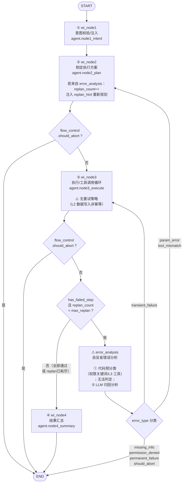

# WorkItem LangGraph 执行流程图

## 流程说明

| 节点 | 职责 | 失败处理 |
|------|------|----------|
| ① wi_node1 | 意图校验与注入 | 无分支，直通 node2 |
| ② wi_node2 | 制定执行方案（支持 re-plan） | should_abort → 终止 |
| ③ wi_node3 | 执行工具调用（非幂等，不重试） | 失败 + 未耗尽 replan → error_analysis |
| ⚠ error_analysis | 自反省：代码预分类 → LLM 归因 | 参数/工具错误 → 回 node2 重新规划；瞬态失败 → 回 node3 直接重试；其余 → 终止 |
| ④ wi_node4 | 结果汇总 | 结束 |

## 关键约束

- **max_replan** 默认为 1，防止 error_analysis → node2 的死循环
- 一旦 replan_count 耗尽，node3 失败后直接进入 node4（不再进 error_analysis）
- error_analysis 两级分析：代码预分类优先（零 LLM 调用），无法判定时才调 LLM
- node3 不做自动重试（L2 数据写入非幂等，重试可能导致重复写入）
