# 地产开发项目阶段划分 — Mermaid 树状图

> 由 [阶段划分.md](./阶段划分.md) 自动提取生成  
> 生成日期：2026-06-25

---

## 顶层全景：六大阶段

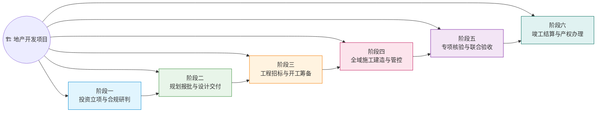

---

## 阶段一：投资立项与合规研判（12个任务）

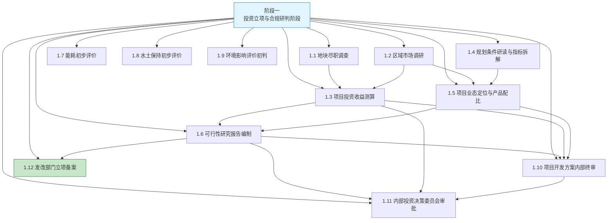

---

## 阶段二：规划报批与设计成果交付（7大部分，39个任务）

### 概览

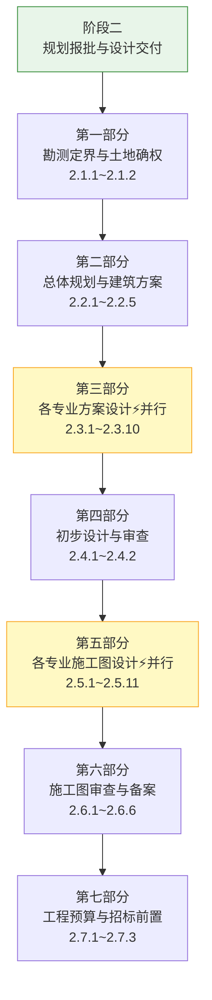

### 第一部分：勘测定界与土地确权

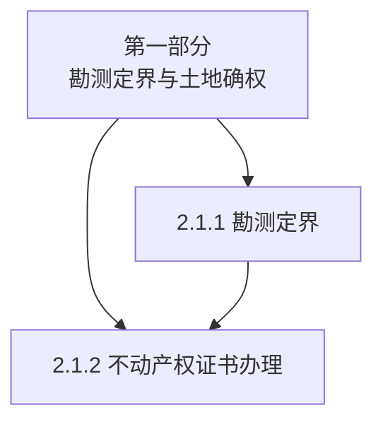

### 第二部分：总体规划与建筑方案设计

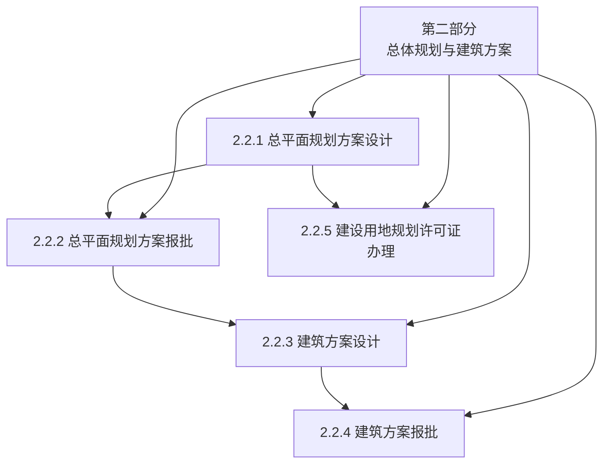

### 第三部分：各专业方案设计（并行）

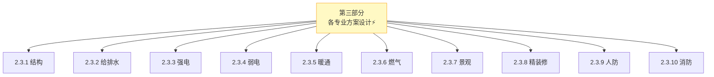

### 第四～第七部分

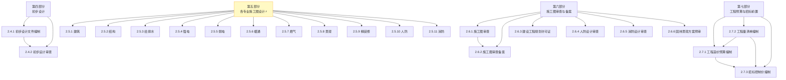

---

## 阶段三：工程招标与开工筹备（20个任务）

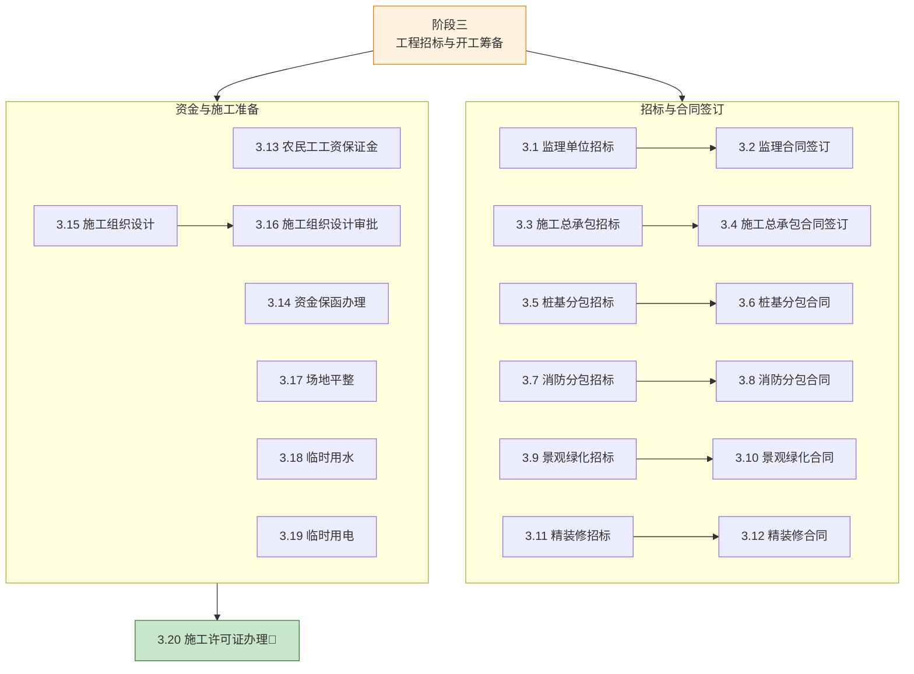

---

## 阶段四：全域施工建造与过程管控（12大部分，62个任务）

### 概览

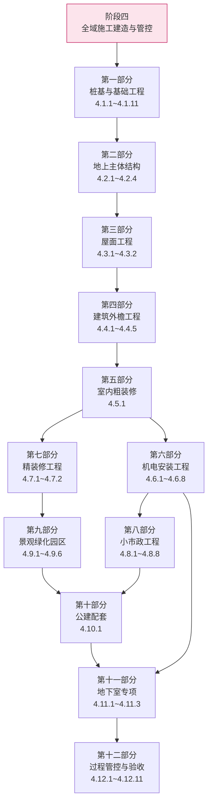

### 第一部分：桩基与基础工程

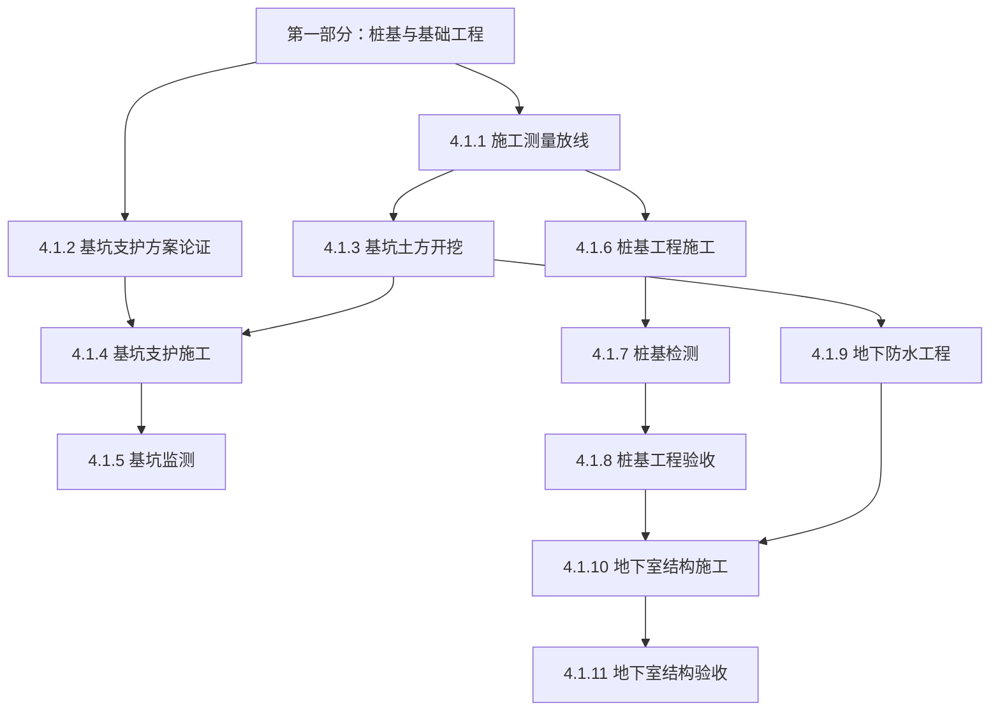

### 第二部分～第四部分

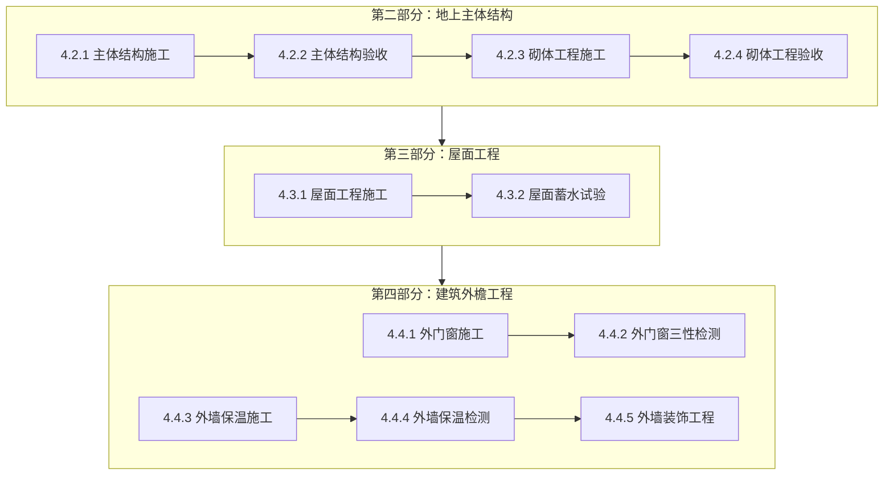

### 第五部分：室内粗装修 & 第六部分：机电安装

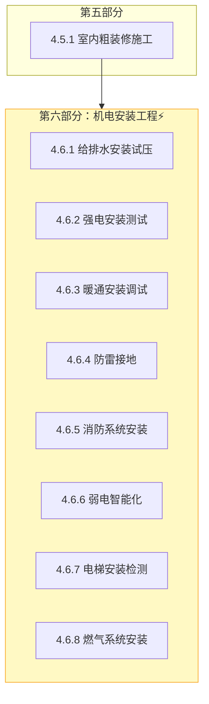

### 第七部分：精装修 & 第八部分：小市政

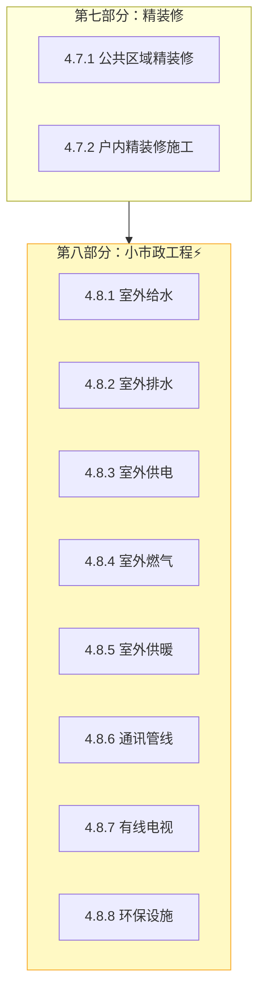

### 第九部分：景观绿化 & 第十部分：公建配套

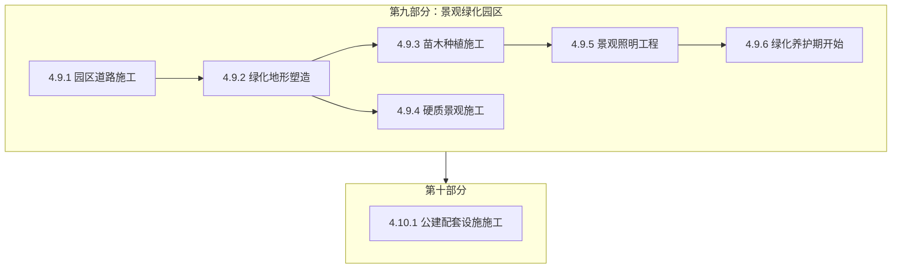

### 第十一部分：地下室专项 & 第十二部分：过程管控与验收

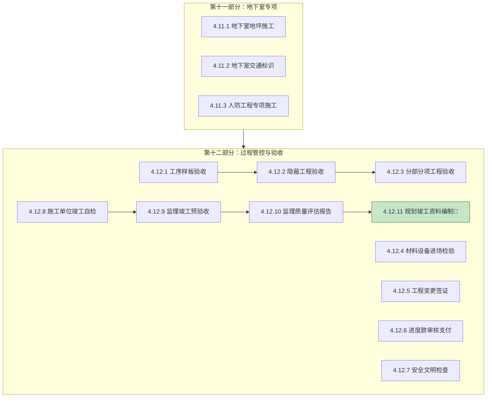

---

## 阶段五：专项核验与竣工联合验收

```mermaid
flowchart TD
    S5["阶段五<br/>专项核验与联合验收"]

    subgraph 专项检测
        D51["5.1 防雷装置检测"] --> D52["5.2 防雷竣工验收"]
        D53["5.3 消防设施检测"] --> D54["5.4 消防工程专项验收"]
        D55["5.5 人防工程质量检测"] --> D56["5.6 人防工程专项验收"]
        D57["5.7 电梯专项验收"]
        D58["5.8 节能专项验收"]
        D59["5.9 环保设施验收"]
        D510["5.10 规划竣工核实"]
        D511["5.11 绿化工程验收"]
        D512["5.12 档案预验收"]
    end

    subgraph 联合验收
        D513["5.13 竣工联合验收申报"]
        D514["5.14 竣工联合验收"]
        D515["5.15 竣工验收备案🚩"]
    end

    S5 --> 专项检测
    专项检测 --> 联合验收
    D513 --> D514 --> D515

    style S5 fill:#f3e5f5,stroke:#7b1fa2
    style D515 fill:#c8e6c9,stroke:#2e7d32
```

---

## 阶段六：竣工结算与产权办理

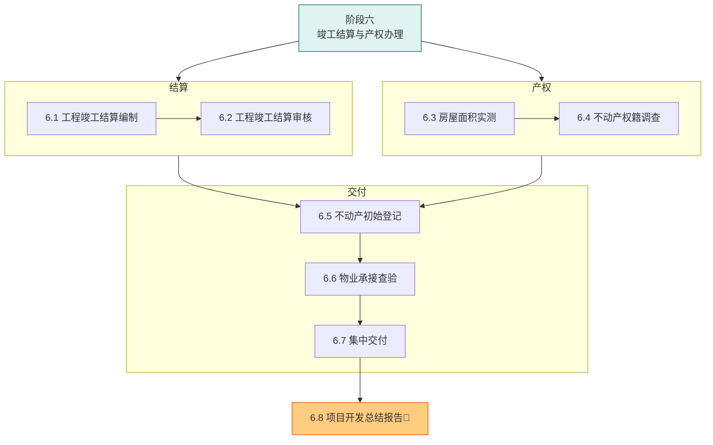

---

## 完整关键路径图（从立项到办结的最短依赖链）

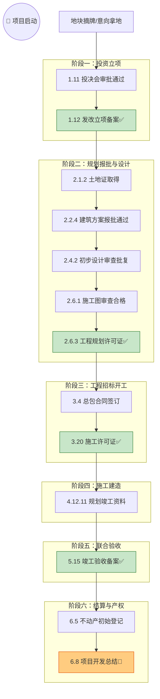

---

## 图例

| 符号 | 含义 |
|------|------|
| 🏗️ | 项目根节点 |
| 🚩 | 阶段闭环标志（关键里程碑） |
| 🏁 | 项目完结 |
| ⚡ | 并行阶段 / 并行执行区块 |
| 🟢 绿色节点 | 关键许可证 / 闭环节点 |
| 🟡 黄色区块 | 并行执行区域 |
| 🟠 橙色节点 | 项目最终交付 |
