# 规则
- 整体阶段划分为：规划、设计、施工、交付四个大阶段
- 首尾的规划、交付两个大阶段，当前只设各一个节点，分别作为中间节点的起始与终止点，未来有需要再扩展。所以当前本系统主要处理设计、工程施工两阶段的工作

## GH:规划阶段（起始节点）
- GH 项目立项：建设单位设计部

## SJ:设计阶段：以建筑设计为总线，平行分布以下支线设计节点
- SJ-JZ 建筑设计：建筑设计承包单位
- SJ-JG 景观设计：景观设计承包单位
- SJ-JZ 精装类
    - SJ-JZ-YZ 硬装：精装设计承包单位
    - SJ-JZ-RZ 软装：精装软装设计承包单位
- SJ-DL 电力：电力局
- SJ-GS 自来水公司
- SJ-RQ 燃气设计：燃气设计承包单位
- SJ-SH 深化设计类
    - SJ-SH-MC 门窗：门窗深化单位
    - SJ-SH-WY 外檐：外檐深化单位

## SG:工程施工阶段：以总包工程为总线，树状分布以下支线工程节点
- SG-ZB 总包类：总包单位
    - SG-MC 门窗分包：门窗承包单位
    - SG-WY 外檐分包：外檐幕墙承包单位
- SG-JG 景观工程：景观承包单位
- SG-JZ-YZ 精装硬装工程：精装硬装承包单位
- SG-JZ-RZ 精装软装工程：精装软装承包单位
- SG-DL 电力工程：电力局
- SG-GS 自来水工程：自来水公司
- SG-RQ 燃气工程：燃气公司

## JF:交付阶段（终止节点）
- JF 竣工验收交付：建设单位工程部

## 全景节点流程图

```mermaid
flowchart TB
    %% 样式定义（深色主题适配）
    classDef stageBox fill:#2d2d2d,stroke:#555555,stroke-width:2px,rx:8px
    classDef mainNode fill:#3d3d3d,stroke:#ffb74d,stroke-width:2px
    classDef subNode fill:#353535,stroke:#888888,stroke-width:1px
    
    %% 规划阶段
    subgraph GH_Stage [规划阶段]
        GH[GH 项目立项<br/>建设单位设计部]:::mainNode
    end
    GH_Stage:::stageBox
    
    %% 设计阶段
    subgraph SJ_Stage [设计阶段]
        direction LR
        SJ_JZ[SJ-JZ 建筑设计<br/>建筑设计承包单位]:::mainNode
        SJ_JG[SJ-JG 景观设计<br/>景观设计承包单位]:::subNode
        SJ_JZ_YZ[SJ-JZ-YZ 精装硬装<br/>精装设计承包单位]:::subNode
        SJ_JZ_RZ[SJ-JZ-RZ 精装软装<br/>精装软装设计承包单位]:::subNode
        SJ_DL[SJ-DL 电力设计<br/>电力局]:::subNode
        SJ_GS[SJ-GS 自来水设计<br/>自来水公司]:::subNode
        SJ_RQ[SJ-RQ 燃气设计<br/>燃气设计承包单位]:::subNode
        SJ_SH_MC[SJ-SH-MC 门窗深化<br/>门窗深化单位]:::subNode
        SJ_SH_WY[SJ-SH-WY 外檐深化<br/>外檐深化单位]:::subNode
    end
    SJ_Stage:::stageBox
    
    %% 施工阶段
    subgraph SG_Stage [施工阶段]
        direction LR
        SG_ZB[SG-ZB 总包工程<br/>总包单位]:::mainNode
        SG_JG[SG-JG 景观工程<br/>景观承包单位]:::subNode
        SG_JZ_YZ[SG-JZ-YZ 精装硬装<br/>精装硬装承包单位]:::subNode
        SG_JZ_RZ[SG-JZ-RZ 精装软装<br/>精装软装承包单位]:::subNode
        SG_DL[SG-DL 电力工程<br/>电力局]:::subNode
        SG_GS[SG-GS 自来水工程<br/>自来水公司]:::subNode
        SG_RQ[SG-RQ 燃气工程<br/>燃气公司]:::subNode
        SG_MC[SG-MC 门窗分包<br/>门窗承包单位]:::subNode
        SG_WY[SG-WY 外檐分包<br/>外檐幕墙承包单位]:::subNode
    end
    SG_Stage:::stageBox
    
    %% 交付阶段
    subgraph JF_Stage [交付阶段]
        JF[JF 竣工验收交付<br/>建设单位工程部]:::mainNode
    end
    JF_Stage:::stageBox
    
    %% 强制四个阶段上下排列
    GH_Stage --> SJ_Stage
    SJ_Stage --> SG_Stage
    SG_Stage --> JF_Stage
    
    %% 主线连接（加粗红色实线）
    GH -->|主线| SJ_JZ
    SJ_JZ -->|主线| SG_ZB
    SG_ZB -->|主线| JF
    
    %% 支线连接（蓝色细线）
    GH --> SJ_JG
    GH --> SJ_JZ_YZ
    GH --> SJ_JZ_RZ
    GH --> SJ_DL
    GH --> SJ_GS
    GH --> SJ_RQ
    
    %% 深化设计（虚线，从属于建筑设计）
    SJ_JZ -.-> SJ_SH_MC
    SJ_JZ -.-> SJ_SH_WY
    
    %% 设计到施工的对应连接
    SJ_JG --> SG_JG
    SJ_JZ_YZ --> SG_JZ_YZ
    SJ_JZ_RZ --> SG_JZ_RZ
    SJ_DL --> SG_DL
    SJ_GS --> SG_GS
    SJ_RQ --> SG_RQ
    SJ_SH_MC --> SG_MC
    SJ_SH_WY --> SG_WY
    
    %% 总包分支
    SG_ZB --> SG_MC
    SG_ZB --> SG_WY
    
    %% 各施工支线汇聚到交付
    SG_JG --> JF
    SG_JZ_YZ --> JF
    SG_JZ_RZ --> JF
    SG_DL --> JF
    SG_GS --> JF
    SG_RQ --> JF
    
    %% 连线样式
    linkStyle 0 stroke-width:0,stroke:transparent
    linkStyle 1 stroke-width:0,stroke:transparent
    linkStyle 2 stroke-width:0,stroke:transparent
    linkStyle 3 stroke:#ff8a80,stroke-width:5px,stroke-linecap:round
    linkStyle 4 stroke:#ff8a80,stroke-width:5px,stroke-linecap:round
    linkStyle 5 stroke:#ff8a80,stroke-width:5px,stroke-linecap:round
```

